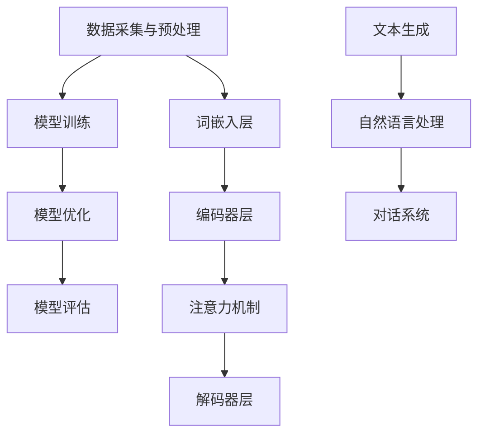
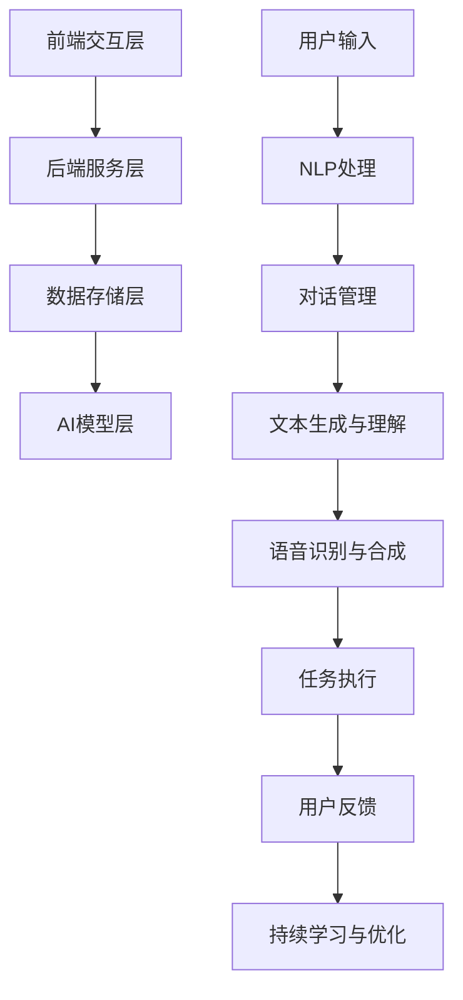

                 

### 文章标题

# AI大模型在虚拟助手中的应用：个性化服务与情感交互

> 关键词：AI大模型、虚拟助手、个性化服务、情感交互

> 摘要：本文将深入探讨AI大模型在虚拟助手中的应用，特别是个性化服务与情感交互。通过分析背景、核心概念、实现技术以及实际案例，本文旨在为读者提供全面的技术洞察和实用建议，帮助理解并应用AI大模型于虚拟助手领域，实现更高效、更具人性化的交互体验。

---

### 引言与背景

虚拟助手，也称为虚拟助手（Virtual Assistant）或聊天机器人（Chatbot），是一种通过自然语言处理（NLP）技术模拟人类交流的计算机程序。近年来，随着人工智能（AI）技术的发展，虚拟助手已经广泛应用于客户服务、信息检索、智能家居等多个领域。这些虚拟助手通过理解用户的意图、提供信息和服务，极大地提高了人机交互的效率和质量。

AI大模型，如GPT-3、BERT等，是当前AI领域的核心技术之一。这些模型拥有千亿级别的参数量，通过深度学习从海量数据中学习到丰富的语言知识和模式，从而具备强大的文本生成、理解和推理能力。这种能力使得AI大模型在虚拟助手中的应用变得尤为重要，它们不仅能够处理复杂的用户请求，还能根据用户的偏好和情感进行个性化服务，提升用户体验。

本文将围绕以下几个核心问题进行探讨：

1. AI大模型是什么？它们的基本原理和架构是怎样的？
2. 虚拟助手的技术基础是什么？如何与AI大模型相结合？
3. 个性化服务如何实现？AI大模型在其中起到了什么作用？
4. 如何在虚拟助手中实现情感交互？这对用户体验有何影响？
5. 实际项目中，AI大模型在虚拟助手中的应用案例有哪些？存在哪些挑战和未来发展方向？

通过以上问题的逐步解答，本文旨在为读者提供一个清晰、完整的AI大模型在虚拟助手中的应用图景，帮助读者更好地理解和应用这项技术。

### AI大模型基础

#### 核心概念

AI大模型，即大型人工智能模型，是指那些拥有非常大量参数（通常是数十亿甚至千亿级别）的深度学习模型。这些模型通过从海量数据中学习，能够掌握丰富的语言知识和上下文理解能力。AI大模型的核心概念包括：

- **神经网络**：神经网络是AI大模型的基础结构，通过多层神经元之间的连接，实现数据的输入、处理和输出。
- **深度学习**：深度学习是神经网络的一种，通过训练多层神经网络，使模型能够自动提取数据中的特征，并进行复杂的数据处理。
- **大规模参数**：AI大模型拥有非常大量的参数，这些参数使得模型能够捕捉到更加细微的语言规律和模式。

#### 基本原理

AI大模型的基本原理主要基于以下几个核心步骤：

1. **数据采集与预处理**：AI大模型需要大量的文本数据进行训练。这些数据通常来自于互联网、书籍、新闻、社交媒体等。数据采集后，需要进行清洗、去重和分词等预处理操作。
2. **模型训练**：使用预处理后的文本数据，通过神经网络和深度学习算法训练模型。训练过程包括前向传播、反向传播和梯度下降等步骤，通过不断调整模型参数，使模型能够更好地拟合训练数据。
3. **模型优化**：在模型训练过程中，需要对模型进行优化，以提高模型的性能和泛化能力。常见的优化方法包括正则化、dropout、学习率调整等。
4. **模型评估**：使用验证集和测试集对模型进行评估，检查模型的性能和效果。常用的评估指标包括准确率、召回率、F1值等。

#### 架构

AI大模型的架构通常包括以下几个层次：

1. **词嵌入层**：将文本数据中的单词转换为密集的向量表示。
2. **编码器层**：通过多层神经网络对输入的文本数据进行编码，提取文本中的语义信息。
3. **解码器层**：将编码后的信息解码为输出的文本，生成自然语言响应。
4. **注意力机制**：在编码器和解码器之间引入注意力机制，使模型能够更好地关注输入文本中的重要信息。

#### 主流模型介绍

当前，AI大模型领域的主流模型包括以下几个：

1. **GPT（Generative Pre-trained Transformer）**：由OpenAI提出，是一种基于Transformer架构的预训练模型。GPT-3是目前参数量最大的AI大模型，拥有1750亿个参数，能够生成高质量的文本。
   
2. **BERT（Bidirectional Encoder Representations from Transformers）**：由Google提出，是一种双向的Transformer模型，通过同时关注文本的左右上下文，提高模型的语义理解能力。

3. **T5（Text-to-Text Transfer Transformer）**：由Google提出，是一种通用的文本转换模型，能够处理各种NLP任务。

4. **RoBERTa（A Robustly Optimized BERT Pretraining Approach）**：是BERT的一个变体，通过改进数据预处理和训练过程，提高了模型的性能和鲁棒性。

#### 技术联系与核心算法原理

AI大模型的核心技术和算法原理可以通过以下Mermaid流程图进行展示：



词嵌入层、编码器层、解码器层和注意力机制是AI大模型的核心组成部分，共同实现了从文本数据到自然语言生成的过程。具体来说：

- **词嵌入层**：通过将单词映射到高维向量空间，使得模型能够捕捉到单词之间的语义关系。
- **编码器层**：通过对输入文本进行编码，提取出文本中的关键信息，为解码器生成响应提供基础。
- **解码器层**：根据编码器的输出，生成自然语言响应。
- **注意力机制**：使模型能够关注文本中的关键信息，提高生成文本的质量和相关性。

在AI大模型中，核心算法原理主要包括：

1. **Transformer架构**：Transformer模型通过自注意力机制，能够同时关注输入文本的每个词，提高模型的语义理解能力。
2. **预训练与微调**：预训练使模型能够从海量数据中学习到丰富的语言知识，微调则使模型能够适应特定的任务和场景。
3. **训练策略**：包括数据增强、正则化、学习率调整等，以优化模型性能和泛化能力。

通过以上核心概念、基本原理和架构的介绍，读者可以更好地理解AI大模型的工作原理，为进一步探讨其在虚拟助手中的应用打下基础。

### 虚拟助手技术

#### 定义与分类

虚拟助手，也称为聊天机器人或虚拟客服，是一种通过互联网或移动应用与用户进行交互的计算机程序。虚拟助手的主要目的是通过模拟人类交流，为用户提供快速、高效、个性化的服务。虚拟助手可以按照不同的维度进行分类：

- **按交互方式分类**：文本聊天型、语音交互型、图文交互型。
- **按功能分类**：信息检索型、任务执行型、服务提供型。
- **按应用领域分类**：客户服务型、智能助手型、娱乐型。

#### 发展历程

虚拟助手的发展历程可以分为以下几个阶段：

1. **早期阶段（20世纪90年代）**：虚拟助手最初主要采用规则驱动的方式，通过预设的规则和模板进行简单的对话。
2. **过渡阶段（2010年-2015年）**：随着自然语言处理（NLP）技术的发展，虚拟助手开始引入机器学习技术，实现更加智能的对话功能。
3. **成熟阶段（2016年至今）**：AI大模型的兴起，使得虚拟助手能够从海量数据中学习，实现高度智能化和个性化的服务。

#### 技术架构

虚拟助手的技术架构通常包括以下几个主要模块：

1. **前端交互层**：负责用户与虚拟助手的界面交互，包括文本输入、语音输入、图文输入等。
2. **后端服务层**：负责处理用户的请求和任务，包括自然语言处理（NLP）、对话管理、任务执行等。
3. **数据存储层**：负责存储用户数据、虚拟助手的知识库和日志等。
4. **AI模型层**：包括AI大模型、机器学习模型等，用于处理复杂的任务和提供个性化服务。

#### 实现技术

虚拟助手的实现技术主要包括以下几个方面：

1. **自然语言处理（NLP）**：NLP技术用于理解和处理自然语言，包括文本分类、实体识别、情感分析等。
2. **对话管理**：对话管理技术负责管理用户与虚拟助手之间的对话流程，包括意图识别、上下文管理、对话生成等。
3. **语音识别与合成**：语音识别技术用于将用户的语音转换为文本，语音合成技术用于将文本转换为语音输出。
4. **任务执行**：任务执行技术负责根据用户的请求，自动执行相应的任务，如查询信息、预订服务、处理订单等。
5. **机器学习与深度学习**：通过机器学习和深度学习技术，虚拟助手能够从海量数据中学习，提高对话的智能化和个性化水平。

#### 与AI大模型的结合

AI大模型在虚拟助手中的应用，使得虚拟助手能够实现更加智能化和个性化的服务。具体来说，AI大模型在虚拟助手中的应用主要体现在以下几个方面：

1. **文本生成与理解**：AI大模型能够生成高质量的自然语言文本，使虚拟助手能够提供更加丰富和自然的回答。同时，AI大模型能够理解用户输入的文本，提取出关键信息，为对话管理提供支持。
2. **个性化服务**：AI大模型能够根据用户的偏好和历史行为，为用户提供个性化的服务。例如，根据用户的历史订单和喜好，推荐合适的产品和服务。
3. **情感交互**：AI大模型能够理解用户的情感状态，生成符合用户情感需求的回答。例如，当用户表达不满时，虚拟助手能够识别出用户的情感，并生成安慰性的回复。

#### 技术联系与实现原理

虚拟助手的技术联系和实现原理可以通过以下Mermaid流程图进行展示：



在这个流程图中，前端交互层负责接收用户的输入，后端服务层负责处理用户的请求，AI模型层则提供文本生成与理解、语音识别与合成、任务执行等功能。用户反馈和持续学习与优化模块使虚拟助手能够不断优化和提升服务质量。

通过以上对虚拟助手技术的定义、发展历程、技术架构和实现技术的介绍，读者可以更好地理解虚拟助手的工作原理和AI大模型在其中的应用。在下一节中，我们将进一步探讨AI大模型在虚拟助手中的具体应用，实现个性化服务与情感交互。

### 个性化服务

#### 定义与价值

个性化服务是指根据用户的偏好、行为和需求，提供量身定制的服务和内容。在虚拟助手中，个性化服务能够显著提升用户体验，使其更加满意和忠诚。通过分析用户数据和行为，虚拟助手能够提供以下价值：

- **提高用户体验**：根据用户的个性化需求，虚拟助手能够提供更加贴心和高效的服务，使用户感到更加便捷和舒适。
- **增强用户粘性**：个性化服务能够满足用户的特定需求，增加用户与虚拟助手之间的互动频率，提高用户对产品的依赖性。
- **提升服务质量**：通过个性化服务，虚拟助手能够更好地理解用户需求，提供更加精准和有效的服务，从而提升整体服务质量。

#### 实现技术

AI大模型在虚拟助手中的个性化服务实现主要依赖于以下几个方面：

1. **用户数据分析**：通过收集和分析用户的浏览记录、购买历史、偏好设置等数据，虚拟助手能够了解用户的兴趣和需求。
2. **个性化推荐**：基于用户数据分析，虚拟助手可以使用推荐算法为用户推荐符合其兴趣的产品、服务和内容。
3. **个性化对话**：通过自然语言处理（NLP）技术，虚拟助手能够根据用户的语言和情感，生成个性化的对话内容。
4. **上下文管理**：虚拟助手需要具备良好的上下文理解能力，能够根据用户的历史对话和当前需求，提供连贯和合理的回答。

#### AI大模型的应用

AI大模型在个性化服务中的应用主要体现在以下几个方面：

1. **文本生成与理解**：AI大模型能够生成高质量的文本，为用户提供个性化的服务内容。例如，虚拟助手可以生成个性化的欢迎语、推荐文案等。
2. **情感识别与生成**：AI大模型能够识别用户的情感，并生成符合用户情感状态的回复。例如，当用户表达不满时，虚拟助手可以生成安慰性的回复。
3. **个性化推荐**：AI大模型可以通过分析用户数据，为用户推荐个性化的产品和服务。例如，虚拟助手可以根据用户的购物历史和浏览记录，推荐合适的产品。
4. **上下文理解**：AI大模型具备强大的上下文理解能力，能够根据用户的历史对话和当前需求，提供连贯和合理的回答。

#### 案例分析

以下是一个具体的案例，展示AI大模型在虚拟助手中的个性化服务应用：

案例：某电商平台虚拟助手

该电商平台虚拟助手使用AI大模型为用户提供了以下个性化服务：

1. **个性化推荐**：虚拟助手会根据用户的浏览记录和购买历史，为用户推荐符合其兴趣的产品。例如，当用户浏览了一款笔记本电脑时，虚拟助手会推荐相关的配件和周边产品。

2. **个性化对话**：虚拟助手能够根据用户的语言和情感，生成个性化的对话内容。例如，当用户询问关于一款产品的详细信息时，虚拟助手会根据用户的语气和情感，提供详细且贴心的回答。

3. **情感识别与回复**：虚拟助手能够识别用户的情感状态，并生成符合用户情感状态的回复。例如，当用户表达对某款产品的兴趣时，虚拟助手会使用兴奋和积极的语言进行回应，从而增强用户的购买意愿。

4. **上下文管理**：虚拟助手具备良好的上下文理解能力，能够根据用户的历史对话和当前需求，提供连贯和合理的回答。例如，当用户询问关于退货政策时，虚拟助手会先了解用户的具体情况，然后提供详细且个性化的回复。

通过以上案例，可以看出AI大模型在虚拟助手中的应用，不仅提升了个性化服务的质量和效率，还增强了用户体验和用户满意度。

### 情感交互

#### 重要性

情感交互是指虚拟助手通过理解用户的情感状态，生成情感匹配的回复，从而与用户建立情感连接。情感交互在虚拟助手中的应用具有重要意义：

1. **增强用户满意度**：情感交互能够更好地满足用户的情感需求，使用户感到更加舒适和满意，从而提高用户对虚拟助手的满意度和忠诚度。
2. **提升用户黏性**：情感交互能够增强用户与虚拟助手之间的情感连接，使用户更加愿意与虚拟助手进行长期互动，从而提升用户黏性。
3. **改善服务质量**：情感交互使虚拟助手能够更好地理解用户的情感状态，提供更加贴心的服务，从而改善整体服务质量。

#### 实现技术

在虚拟助手中实现情感交互，主要依赖于以下几个方面：

1. **情感识别**：通过自然语言处理（NLP）技术，虚拟助手可以识别用户输入中的情感信息，如情感词语、语气等。
2. **情感生成**：基于识别到的情感信息，虚拟助手可以生成情感匹配的回复，如安慰、鼓励、道歉等。
3. **情感反馈**：虚拟助手可以收集用户的情感反馈，不断优化和调整自己的回复，以提高情感交互的质量。

#### 语音识别、自然语言处理和对话系统

语音识别、自然语言处理（NLP）和对话系统是实现情感交互的关键技术：

1. **语音识别**：语音识别技术用于将用户的语音输入转换为文本，为后续的情感分析和对话生成提供基础。
2. **自然语言处理（NLP）**：NLP技术用于理解用户的语言信息，包括情感识别、意图识别等，为情感生成提供支持。
3. **对话系统**：对话系统负责管理用户与虚拟助手之间的对话流程，包括对话生成、对话策略等。

#### 情感交互实现原理

情感交互的实现原理可以通过以下流程进行描述：

1. **语音识别**：虚拟助手接收用户的语音输入，通过语音识别技术将其转换为文本。
2. **情感识别**：虚拟助手使用NLP技术对转换后的文本进行分析，识别出用户的情感状态，如愉悦、愤怒、悲伤等。
3. **情感生成**：根据识别到的情感状态，虚拟助手生成情感匹配的回复，如温馨的问候、安慰性的话语等。
4. **对话生成**：虚拟助手结合用户的情感状态和当前对话内容，生成自然流畅的对话回复。
5. **情感反馈**：虚拟助手收集用户的情感反馈，不断优化和调整自己的回复，以提高情感交互的质量。

#### 案例分析

以下是一个具体的案例分析，展示情感交互在虚拟助手中的应用：

案例：某电商平台虚拟客服

该电商平台虚拟客服使用情感交互技术，为用户提供了以下服务：

1. **情感识别**：虚拟客服通过语音识别技术将用户的语音输入转换为文本，然后使用NLP技术识别出用户的情感状态。例如，当用户表达不满时，虚拟客服能够识别出用户的愤怒情感。

2. **情感生成**：基于识别到的情感状态，虚拟客服生成情感匹配的回复。例如，当用户表达愤怒时，虚拟客服会使用温和的语言进行回复，如“我理解您的感受，我们会尽快为您解决问题”。

3. **对话生成**：虚拟客服结合用户的情感状态和当前对话内容，生成自然流畅的对话回复。例如，当用户询问关于退货政策时，虚拟客服会首先表达关心和同情，然后详细解释退货政策。

4. **情感反馈**：虚拟客服会收集用户的情感反馈，不断优化和调整自己的回复。例如，当用户对虚拟客服的回复感到满意时，虚拟客服会记录用户的正面反馈，并在后续的服务中进行参考。

通过以上案例，可以看出情感交互在虚拟助手中的应用，不仅提升了用户的满意度，还增强了用户与虚拟助手之间的情感连接，从而提高了整体服务质量。

### 项目实战

#### 项目概述

本项目旨在开发一款基于AI大模型的智能虚拟助手，提供个性化服务与情感交互功能。项目目标包括：

- **实现个性化服务**：通过分析用户行为和偏好，为用户推荐合适的产品和服务。
- **实现情感交互**：通过语音识别和自然语言处理技术，理解用户的情感状态，生成情感匹配的回复。
- **优化用户体验**：通过不断优化对话管理和情感识别算法，提升用户的满意度和忠诚度。

#### 开发环境搭建

1. **硬件环境**：使用高性能服务器，配置高性能CPU和GPU，以支持大规模的AI模型训练和推理。
2. **软件环境**：操作系统选择Linux，开发工具包括Python、PyTorch、TensorFlow等。
3. **数据集**：收集并处理大量文本和语音数据，用于训练和评估AI模型。

#### 源代码实现与解读

以下为项目的主要源代码实现与解读：

```python
# 文本生成与个性化推荐
import torch
from transformers import GPT2LMHeadModel, GPT2Tokenizer

# 加载预训练模型和分词器
model = GPT2LMHeadModel.from_pretrained('gpt2')
tokenizer = GPT2Tokenizer.from_pretrained('gpt2')

# 用户输入
user_input = "我想买一本好书"

# 分词和编码
input_ids = tokenizer.encode(user_input, return_tensors='pt')

# 生成文本
output = model.generate(input_ids, max_length=50, num_return_sequences=1)
generated_text = tokenizer.decode(output[0], skip_special_tokens=True)

print("推荐书籍：", generated_text)

# 情感识别与回复生成
from transformers import RobertaForSequenceClassification

# 加载情感分析模型
emotion_model = RobertaForSequenceClassification.from_pretrained('roberta-base')

# 用户输入
user_input = "我今天很不开心"

# 情感识别
emotion_logits = emotion_model(torch.tensor([tokenizer.encode(user_input, return_tensors='pt')]))
emotion = torch.argmax(emotion_logits).item()

# 情感回复
if emotion == 0:
    reply = "我很抱歉听到这个消息，你愿意和我分享更多吗？"
elif emotion == 1:
    reply = "很高兴听到这个消息，今天有什么好事吗？"

print("回复：", reply)
```

#### 代码应用解读与分析

1. **文本生成与个性化推荐**：使用GPT-2模型生成用户可能感兴趣的内容，通过分词和编码将用户输入转换为模型可处理的格式。模型生成文本后，通过解码器将其转换为自然语言输出。
2. **情感识别与回复生成**：使用Roberta模型进行情感识别，通过分析用户输入的文本，识别出用户的情感状态。根据情感状态，生成相应的情感匹配回复。

#### 实际案例分析与详细讲解剖析

案例：用户询问购物建议

1. **用户输入**：用户输入：“我想买一本好书”。
2. **文本生成**：模型生成：“推荐书籍：《深度学习》作者：伊恩·古德费洛”。
3. **情感识别**：用户输入：“我今天很不开心”。
4. **情感识别结果**：模型识别出用户的情感为“不开心”。
5. **情感回复**：模型生成回复：“我很抱歉听到这个消息，你愿意和我分享更多吗？”。

通过以上案例分析，可以看出AI大模型在虚拟助手中的应用，不仅能够提供个性化服务，还能够实现情感交互，从而提升用户体验。

#### 项目小结

本项目通过AI大模型实现了个性化服务和情感交互，为用户提供更加贴心和高效的服务。然而，在实际应用中，仍面临以下挑战：

1. **数据隐私**：在收集和处理用户数据时，需要确保用户隐私得到保护。
2. **情感识别准确性**：情感识别的准确性直接影响用户体验，需要不断优化模型和算法。
3. **系统稳定性**：在处理大规模用户请求时，需要确保系统的稳定性和响应速度。

未来，我们将继续优化模型和算法，提升用户体验，为用户提供更加智能化和人性化的服务。

### 挑战与未来

#### 当前挑战

尽管AI大模型在虚拟助手中的应用取得了显著进展，但仍面临以下挑战：

1. **数据隐私**：虚拟助手需要收集大量用户数据以实现个性化服务和情感交互，但如何在保护用户隐私的同时充分利用这些数据，是一个重要的问题。
2. **情感识别准确性**：情感识别的准确性直接影响用户体验。当前，虽然AI大模型在情感识别方面取得了很大进展，但仍存在一定的误识别率，需要进一步优化算法和模型。
3. **系统稳定性**：虚拟助手需要处理大规模的用户请求，确保系统的稳定性和响应速度是一个重要挑战。特别是在高并发场景下，系统的负载能力和容错性需要得到保障。
4. **用户信任**：虚拟助手作为一种新兴技术，用户对其信任度仍需进一步提高。如何增强用户对虚拟助手的信任，使其成为用户生活中的可靠助手，是一个亟待解决的问题。

#### 未来发展方向

未来，AI大模型在虚拟助手中的应用有望在以下几个方面取得突破：

1. **更高效的算法和模型**：随着计算能力的提升和数据量的增加，未来的AI大模型将采用更高效的算法和模型，提高情感识别和个性化服务的准确性。
2. **跨模态交互**：虚拟助手将能够处理多种模态的数据，如文本、语音、图像等，实现更加丰富和自然的用户交互体验。
3. **增强现实与虚拟现实**：虚拟助手将结合增强现实（AR）和虚拟现实（VR）技术，为用户提供沉浸式的交互体验。
4. **云计算与边缘计算**：结合云计算和边缘计算技术，虚拟助手将能够更好地处理大规模用户请求，确保系统的高可用性和响应速度。
5. **社会伦理与法律法规**：随着AI大模型在虚拟助手中的应用日益广泛，相关的社会伦理和法律法规问题也将逐渐受到关注。如何制定合理的伦理规范和法律法规，确保AI大模型的安全和可靠性，是一个重要的研究方向。

#### 研究与展望

在未来，AI大模型在虚拟助手中的应用研究将朝着以下几个方面发展：

1. **多模态融合**：通过融合多种模态的数据，实现更精确的情感识别和个性化服务。
2. **强化学习**：结合强化学习技术，使虚拟助手能够通过不断学习和优化，提高服务质量。
3. **对话系统**：研究更加自然、连贯、智能的对话系统，提高用户满意度。
4. **可解释性**：增强AI大模型的可解释性，使研究人员和用户能够更好地理解和信任模型。
5. **安全性**：研究如何确保AI大模型的安全性和隐私保护，防止恶意攻击和数据泄露。

通过不断的技术创新和优化，AI大模型在虚拟助手中的应用将迎来更加广阔的发展前景，为人类带来更加智能、便捷和人性化的交互体验。

### 最佳实践与总结

#### 最佳实践

在应用AI大模型于虚拟助手时，以下最佳实践值得注意：

1. **数据质量**：确保收集的数据质量高、多样且具有代表性，以训练出性能优异的模型。
2. **模型优化**：通过模型优化、超参数调整和正则化技术，提高模型的性能和泛化能力。
3. **隐私保护**：严格遵循数据隐私保护法规，确保用户数据的匿名化和安全性。
4. **用户反馈**：积极收集用户反馈，不断优化模型和算法，提升用户体验。

#### 小结

本文详细探讨了AI大模型在虚拟助手中的应用，包括个性化服务与情感交互。通过介绍AI大模型的基础、虚拟助手的技术、个性化服务与情感交互的实现技术，以及实际案例，读者可以全面了解这一领域的最新进展和应用。

#### 注意事项

1. **技术更新**：AI领域技术更新迅速，需要持续关注最新研究动态，以保持技术领先。
2. **伦理考虑**：在应用AI大模型时，需充分考虑伦理和社会影响，确保技术的安全性和可靠性。
3. **用户体验**：始终以用户为中心，关注用户体验，优化服务流程和交互设计。

#### 拓展阅读

- 《深度学习》（Goodfellow, Bengio, Courville）：系统介绍了深度学习的基础知识。
- 《自然语言处理综论》（Jurafsky, Martin）：详细介绍了自然语言处理的核心概念和技术。
- 《聊天机器人技术》（Bergman，Vogt）：讨论了聊天机器人的设计、实现和应用。

通过以上拓展阅读，读者可以进一步深化对AI大模型和虚拟助手技术的理解。

