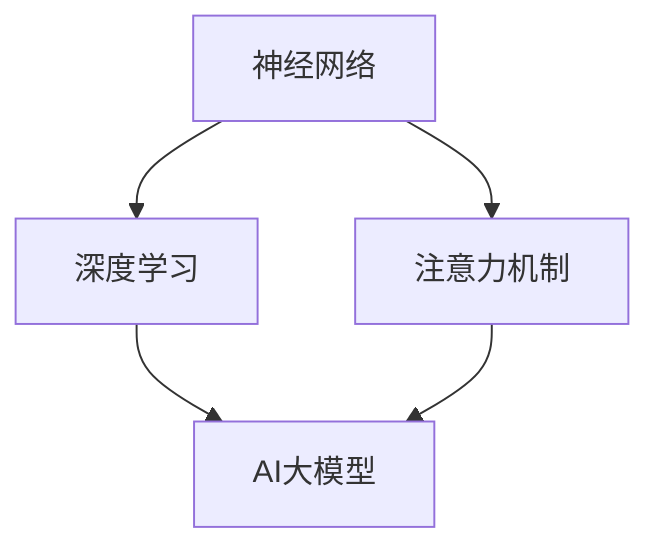
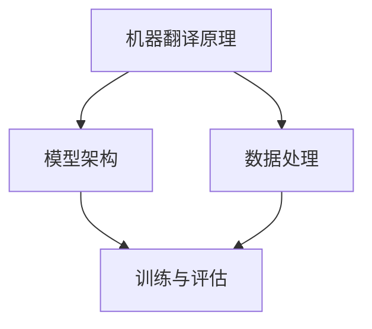
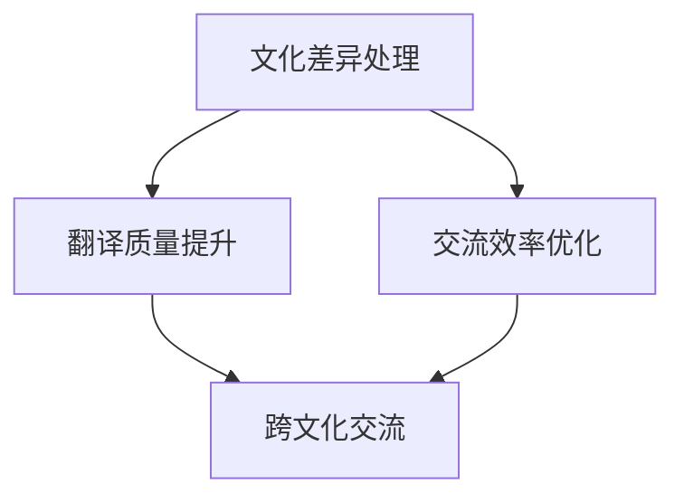

                 

### 确定书籍主题和目标受众

**1. 确定书籍主题：**

本书的主题是“AI大模型在语言翻译中的突破：跨文化交流的新工具”。这个主题聚焦于人工智能（AI）领域中的一个重要分支——大模型技术，特别是如何利用这些大模型来提升语言翻译的准确性和效率，进而推动跨文化交流的发展。随着全球化进程的加快，跨语言沟通的需求日益增长，AI大模型在这一领域的应用显得尤为重要。

**2. 确定目标受众：**

目标受众主要包括以下几类：
- **人工智能研究者**：对于这些专业人士，本书将深入探讨AI大模型的理论基础和最新进展，帮助他们更好地理解和应用这些技术。
- **机器学习工程师**：本书将为工程师们提供具体的实践指南，包括如何设计、训练和优化大模型，以满足实际翻译需求。
- **翻译从业人员**：针对这一群体，本书将展示AI大模型如何提升翻译质量和效率，并探讨如何将大模型技术融入到翻译工作中。
- **跨文化交流爱好者**：本书还将探讨AI大模型在促进跨文化交流中的潜力，对于这一类读者，书中提供的案例和实战经验将提供宝贵的借鉴。

**3. 主题选择理由：**

选择“AI大模型在语言翻译中的突破”作为书籍主题的原因有以下几点：

- **技术重要性**：AI大模型，如GPT、BERT等，已经成为当前人工智能领域的核心技术之一。它们不仅在自然语言处理领域取得了重大突破，而且在语言翻译、文本生成、问答系统等方面展现出了强大的能力。
- **应用广泛性**：随着跨文化交流的不断加深，对高效、准确的翻译工具需求日益增长。AI大模型提供了一种潜在的解决方案，能够大幅提升翻译的准确性和效率。
- **前景广阔**：AI大模型技术仍在快速发展中，未来有望在更多领域取得突破，包括但不限于医疗、教育、法律等。因此，探讨这一技术在实际翻译中的应用，对于未来技术的发展和应用具有重要意义。

通过上述分析，本书将为读者提供全面、深入的了解AI大模型在语言翻译中的突破，以及如何将其应用于跨文化交流中，为这一领域的发展提供新的思路和工具。

### 设计整体结构和章节划分

**1. 整体结构：**

本书的整体结构将分为四个主要部分，每个部分针对不同的主题进行深入探讨，以确保内容的系统性和逻辑性。

- **第一部分：AI大模型基础**  
  这一部分主要介绍AI大模型的基本概念、技术原理和应用前景，包括神经网络、深度学习、注意力机制等内容。读者将从中了解AI大模型的基础知识，为后续章节的学习打下坚实的基础。

- **第二部分：语言翻译中的AI大模型**  
  这一部分将专注于AI大模型在语言翻译中的应用，详细介绍机器翻译的基本原理、模型架构以及常见的算法挑战。通过具体案例，读者将看到AI大模型如何被应用于实际翻译任务中。

- **第三部分：跨文化交流的新工具**  
  跨文化交流是全球化背景下不可忽视的重要领域。这一部分将探讨AI大模型如何作为新的跨文化交流工具，包括如何处理文化差异、提升翻译质量以及促进文化交流等方面。

- **第四部分：应用实践与未来展望**  
  在这一部分，本书将提供AI大模型在语言翻译领域的实际应用案例，详细讲解开发环境搭建、源代码实现和代码解读，并展望未来的发展方向。读者将通过这些案例，了解如何将AI大模型技术应用于实际项目中。

**2. 章节划分：**

为了使内容更加系统和条理清晰，本书的章节将按照以下结构进行划分：

- **第1章：AI大模型概述**  
  介绍AI大模型的基本概念，包括神经网络、深度学习和注意力机制等，并通过Mermaid流程图展示这些概念之间的关系。

- **第2章：语言翻译中的AI大模型**  
  讨论AI大模型在语言翻译中的应用，包括翻译原理、模型架构和常见算法挑战。

- **第3章：跨文化交流的新工具**  
  探讨AI大模型在跨文化交流中的作用，包括处理文化差异、提升翻译质量和促进文化交流等方面的应用。

- **第4章：应用实践与未来展望**  
  提供AI大模型在语言翻译领域的实际应用案例，包括开发环境搭建、源代码实现和代码解读，并展望未来的发展方向。

**3. 章节内容设计：**

- **第1章：AI大模型概述**  
  - **核心概念与联系**：介绍AI大模型的基本概念，如神经网络、深度学习、注意力机制等，并通过Mermaid流程图展示它们之间的关系。  
  - **核心算法原理讲解**：使用伪代码详细阐述主要算法，如翻译模型的训练过程和翻译推理过程。  
  - **数学模型和数学公式**：使用LaTeX格式详细讲解数学模型，如损失函数、优化算法等，并举例说明。

- **第2章：语言翻译中的AI大模型**  
  - **核心概念与联系**：介绍语言翻译中的AI大模型，包括机器翻译的基本原理、模型架构和常见挑战。  
  - **核心算法原理讲解**：使用伪代码详细阐述翻译模型的工作原理，如编码器-解码器架构、注意力机制等。  
  - **数学模型和数学公式**：使用LaTeX格式详细讲解翻译模型中的数学模型，如词汇嵌入、序列到序列模型等，并举例说明。

- **第3章：跨文化交流的新工具**  
  - **核心概念与联系**：探讨AI大模型在跨文化交流中的应用，包括如何处理文化差异、提升翻译质量等。  
  - **核心算法原理讲解**：使用伪代码详细阐述跨文化交流中的算法，如文化差异识别和翻译调整算法。  
  - **数学模型和数学公式**：使用LaTeX格式详细讲解跨文化交流中的数学模型，如文化距离度量、翻译质量评估等，并举例说明。

- **第4章：应用实践与未来展望**  
  - **项目实战**：提供AI大模型在语言翻译领域的实际应用案例，如翻译工具的开发、跨文化对话系统的设计等。  
  - **代码实际案例和详细解释说明**：展示具体代码实现，包括开发环境搭建、源代码详细实现和代码解读。  
  - **代码解读与分析**：对代码的执行流程、关键技术和性能优化等方面进行深入分析。

通过以上设计，本书将系统地介绍AI大模型在语言翻译中的突破，并探讨其在跨文化交流中的潜力，为读者提供全面、深入的技术知识和实际应用指导。

### 设计具体的章节内容

**第1章：AI大模型概述**

**1. 核心概念与联系**

AI大模型是人工智能领域的一个重要研究方向，其核心概念包括神经网络、深度学习和注意力机制。以下是这些概念之间的Mermaid流程图：



- **神经网络（Neural Networks）**：神经网络是模仿人脑结构和功能的一种计算模型，由大量的神经元（节点）和连接（边）组成。通过学习输入和输出数据之间的关系，神经网络能够进行复杂的模式识别和预测。

- **深度学习（Deep Learning）**：深度学习是神经网络的一种扩展，通过增加网络的深度（层数），提高了模型的复杂度和学习能力。深度学习在图像识别、语音识别和自然语言处理等领域取得了显著成就。

- **注意力机制（Attention Mechanism）**：注意力机制是一种用于提高模型局部感知能力的技术。它能够使模型在处理序列数据时，动态地关注到序列中的重要部分，从而提高模型的准确性和效率。

通过这个流程图，读者可以直观地了解AI大模型中的核心概念及其相互关系。

**2. 核心算法原理讲解**

为了更好地理解AI大模型，我们需要详细讲解几个核心算法原理，包括神经网络训练、注意力机制和翻译模型。

- **神经网络训练（Neural Network Training）**：神经网络的训练过程主要包括前向传播（Forward Propagation）和反向传播（Backpropagation）。前向传播是将输入数据通过神经网络进行传递，得到输出结果。反向传播则是通过计算损失函数（Loss Function）的梯度，调整网络中的权重（Weights）和偏置（Bias），以最小化损失函数。

  伪代码如下：

  ```python
  def forward propagation(x):
      # 前向传播
      z = linear activation(x)
      return z

  def backward propagation(z, y):
      # 反向传播
      dz = d_loss(y, z)
      dW = dz * dx
      d_b = dz * d_x
      return dW, d_b
  ```

- **注意力机制（Attention Mechanism）**：注意力机制的核心思想是在处理序列数据时，模型能够根据当前任务的需要，动态地关注到序列中的重要部分。常见的注意力机制包括加性注意力（Additive Attention）和乘性注意力（Multiplicative Attention）。

  伪代码如下：

  ```python
  def additive_attention(q, k, v):
      # 加性注意力
      attention_weights = softmax(q @ k.T)
      context = attention_weights @ v
      return context

  def multiplicative_attention(q, k, v):
      # 乘性注意力
      attention_weights = softmax(q * k)
      context = attention_weights * v
      return context
  ```

- **翻译模型（Translation Model）**：翻译模型是AI大模型在语言翻译中的一个重要应用。常见的翻译模型包括编码器-解码器（Encoder-Decoder）架构和注意力机制。

  伪代码如下：

  ```python
  def encode(x):
      # 编码过程
      encoded = encoder(x)
      return encoded

  def decode(encoded):
      # 解码过程
      decoded = decoder(encoded)
      return decoded

  def attention Mechanism(k, v):
      # 注意力机制
      attention_weights = softmax(k @ v.T)
      context = attention_weights @ k
      return context
  ```

**3. 数学模型和数学公式**

为了深入理解AI大模型，我们需要介绍相关的数学模型和数学公式。

- **损失函数（Loss Function）**：损失函数是评估模型预测结果与真实结果之间差异的函数。常见的损失函数包括均方误差（Mean Squared Error, MSE）和交叉熵（Cross-Entropy）。

  LaTeX格式如下：

  ```latex
  L(y, \hat{y}) = \frac{1}{2} \sum_{i=1}^{n} (y_i - \hat{y_i})^2 \quad \text{(MSE)}
  L(y, \hat{y}) = -\sum_{i=1}^{n} y_i \log \hat{y_i} \quad \text{(Cross-Entropy)}
  ```

- **优化算法（Optimization Algorithm）**：优化算法用于调整模型参数，以最小化损失函数。常见的优化算法包括随机梯度下降（Stochastic Gradient Descent, SGD）和Adam优化器。

  LaTeX格式如下：

  ```latex
  \text{SGD}: \theta_{t+1} = \theta_t - \alpha \nabla_{\theta} L(\theta)
  \text{Adam}: \theta_{t+1} = \theta_t - \alpha \nabla_{\theta} L(\theta) + \beta_1 \alpha \nabla_{\theta} L(\theta)_{t-1}
  ```

通过以上内容，第1章为读者提供了一个全面的AI大模型概述，包括核心概念、算法原理和数学模型。接下来，第2章将深入探讨AI大模型在语言翻译中的应用，为读者展示这些模型如何在实际翻译任务中发挥作用。

### 第2章：语言翻译中的AI大模型

**1. 核心概念与联系**

在语言翻译中，AI大模型的核心概念包括机器翻译的基本原理、模型架构和常见挑战。以下是这些概念之间的Mermaid流程图：



- **机器翻译原理**：机器翻译的基本原理是通过将源语言（Source Language）的文本转换为等效的目标语言（Target Language）文本，以实现跨语言沟通。这通常涉及词汇嵌入（Word Embedding）、编码器-解码器（Encoder-Decoder）架构和注意力机制（Attention Mechanism）。

- **模型架构**：机器翻译的模型架构主要包括编码器（Encoder）、解码器（Decoder）和注意力机制。编码器负责将源语言文本转换为固定长度的编码表示；解码器则根据编码表示生成目标语言文本；注意力机制用于在解码过程中关注源语言文本的重要部分，从而提高翻译质量。

- **数据处理**：数据处理是机器翻译中至关重要的一环，包括文本预处理、词汇嵌入和序列处理。文本预处理包括去除标点符号、分词和转换为小写等操作；词汇嵌入是将文本中的单词映射为密集向量表示；序列处理则是将文本序列转换为模型可处理的输入格式。

- **训练与评估**：模型训练与评估是机器翻译中的关键步骤。训练过程涉及调整模型参数，以最小化损失函数；评估过程则通过计算模型的准确率、召回率和F1分数等指标，评估模型性能。

通过这个流程图，读者可以清晰地了解机器翻译中的核心概念及其相互关系。

**2. 核心算法原理讲解**

在语言翻译中，AI大模型的核心算法包括编码器-解码器架构、注意力机制和翻译算法。以下是这些算法的详细讲解。

- **编码器-解码器架构（Encoder-Decoder Architecture）**：编码器-解码器架构是机器翻译中最常用的模型架构。编码器负责将源语言文本编码为固定长度的向量表示，解码器则根据这个向量表示生成目标语言文本。

  伪代码如下：

  ```python
  def encode(source_sequence):
      # 编码过程
      encoded_sequence = encoder(source_sequence)
      return encoded_sequence

  def decode(encoded_sequence):
      # 解码过程
      target_sequence = decoder(encoded_sequence)
      return target_sequence
  ```

  编码器和解码器通常采用递归神经网络（RNN）或变换器（Transformer）架构，后者在近年来取得了显著的性能提升。

- **注意力机制（Attention Mechanism）**：注意力机制用于在解码过程中关注源语言文本的重要部分，从而提高翻译质量。常见的注意力机制包括加性注意力（Additive Attention）和乘性注意力（Multiplicative Attention）。

  伪代码如下：

  ```python
  def additive_attention(context, query):
      # 加性注意力
      attention_scores = softmax(query @ context.T)
      attention_weights = attention_scores * context
      return attention_weights

  def multiplicative_attention(context, query):
      # 乘性注意力
      attention_scores = softmax(query * context)
      attention_weights = attention_scores * context
      return attention_weights
  ```

- **翻译算法（Translation Algorithm）**：翻译算法是指如何根据编码器生成的编码表示生成目标语言文本。常见的翻译算法包括贪心算法（Greedy Algorithm）和基于概率的解码算法（Probabilistic Decoding）。

  伪代码如下：

  ```python
  def greedy_decode(encoded_sequence):
      # 贪心解码
      current_output = []
      for i in range(target_sequence_length):
          input_sequence = encode([current_output])
          output probabilities = decoder(input_sequence)
          predicted_word = select_word_with_highest_probability(output_probabilities)
          current_output.append(predicted_word)
      return current_output

  def probabilistic_decode(encoded_sequence):
      # 基于概率的解码
      target_sequence = []
      for i in range(target_sequence_length):
          input_sequence = encode([current_output])
          output_probabilities = decoder(input_sequence)
          predicted_word = select_word_with_highest_probability(output_probabilities)
          target_sequence.append(predicted_word)
      return target_sequence
  ```

**3. 数学模型和数学公式**

为了深入理解语言翻译中的AI大模型，我们需要介绍相关的数学模型和数学公式。

- **损失函数（Loss Function）**：损失函数用于评估模型预测结果与真实结果之间的差异。常见的损失函数包括交叉熵（Cross-Entropy）和均方误差（Mean Squared Error）。

  LaTeX格式如下：

  ```latex
  L(y, \hat{y}) = -\sum_{i=1}^{n} y_i \log \hat{y_i} \quad \text{(Cross-Entropy)}
  L(y, \hat{y}) = \frac{1}{2} \sum_{i=1}^{n} (y_i - \hat{y_i})^2 \quad \text{(MSE)}
  ```

- **优化算法（Optimization Algorithm）**：优化算法用于调整模型参数，以最小化损失函数。常见的优化算法包括随机梯度下降（Stochastic Gradient Descent, SGD）和Adam优化器。

  LaTeX格式如下：

  ```latex
  \text{SGD}: \theta_{t+1} = \theta_t - \alpha \nabla_{\theta} L(\theta)
  \text{Adam}: \theta_{t+1} = \theta_t - \alpha \nabla_{\theta} L(\theta) + \beta_1 \alpha \nabla_{\theta} L(\theta)_{t-1}
  ```

通过以上内容，第2章为读者详细介绍了AI大模型在语言翻译中的应用，包括核心算法原理和数学模型。接下来，第3章将探讨AI大模型在跨文化交流中的作用，以及如何处理文化差异和提升翻译质量。

### 第3章：跨文化交流的新工具

**1. 核心概念与联系**

AI大模型在跨文化交流中的应用是一个多维度、多层次的过程，涉及到文化差异处理、翻译质量提升和交流效率优化等多个方面。以下是这些概念之间的Mermaid流程图：



- **文化差异处理**：跨文化交流中的文化差异处理指的是在翻译过程中识别和调整不同文化背景下语言表达方式的能力。这包括理解词汇的多义性、成语的使用、习语的翻译等。

- **翻译质量提升**：翻译质量提升是通过利用AI大模型的强大学习能力，提高翻译文本的准确性和流畅性。这包括语法正确性、语义一致性、风格保持等。

- **交流效率优化**：交流效率优化是指通过AI大模型的应用，提高跨文化交流的效率，如快速翻译、即时反馈、个性化推荐等。

- **跨文化交流**：跨文化交流是将不同文化背景的人连接起来，促进相互理解和合作的过程。AI大模型在这个过程中充当了重要的桥梁作用，通过提供准确、流畅的翻译，打破了语言障碍。

通过这个流程图，读者可以直观地了解AI大模型在跨文化交流中的核心概念及其相互关系。

**2. 核心算法原理讲解**

在AI大模型应用于跨文化交流中，需要核心算法的支撑，以下是几个关键算法的详细讲解。

- **文化差异识别算法**：文化差异识别算法用于在翻译过程中识别出源语言中特有的文化元素，如习俗、历史背景、语言习惯等。这可以通过预训练的大模型中包含大量的跨文化数据来实现。

  伪代码如下：

  ```python
  def cultural_difference_identification(source_text):
      # 文化差异识别
      identified_differences = model.predict(source_text)
      return identified_differences
  ```

- **翻译调整算法**：翻译调整算法是在识别出文化差异后，对翻译结果进行适当的调整，以符合目标语言的文化习惯。这可以通过利用预训练的大模型和自定义的调整规则来实现。

  伪代码如下：

  ```python
  def translation_adjustment(translation, target_culture):
      # 翻译调整
      adjusted_translation = model.adjust(translation, target_culture)
      return adjusted_translation
  ```

- **交流效率优化算法**：交流效率优化算法通过提高翻译速度、减少错误率和提供即时反馈，来提升跨文化交流的效率。这可以通过优化模型架构、采用分布式计算和自动化流程来实现。

  伪代码如下：

  ```python
  def communication_efficiency_optimization(model, input_text):
      # 交流效率优化
      optimized_translation = model.optimize(input_text)
      return optimized_translation
  ```

**3. 数学模型和数学公式**

为了深入理解AI大模型在跨文化交流中的应用，我们需要介绍相关的数学模型和数学公式。

- **文化距离度量**：文化距离度量用于评估不同文化之间的差异程度。常见的度量方法包括多元统计方法、语义相似性计算等。

  LaTeX格式如下：

  ```latex
  D(C_1, C_2) = \frac{1}{n} \sum_{i=1}^{n} ||c_{i1} - c_{i2}||_2 \quad \text{(Euclidean Distance)}
  ```

- **翻译质量评估**：翻译质量评估通过计算翻译结果与参考翻译之间的差距来评估翻译质量。常见的评估指标包括BLEU、METEOR和NIST等。

  LaTeX格式如下：

  ```latex
  Q = \frac{1}{m} \sum_{i=1}^{m} \frac{L(h_i, g_i)}{L(g_i, \hat{g_i})}
  ```

  其中，\(L\) 表示损失函数，\(h_i\) 表示参考翻译，\(g_i\) 表示生成翻译，\(\hat{g_i}\) 表示预测翻译。

通过以上内容，第3章为读者详细介绍了AI大模型在跨文化交流中的应用，包括核心算法原理和数学模型。接下来，第4章将聚焦于AI大模型在语言翻译领域的实际应用，通过具体案例展示其应用效果。

### 第4章：应用实践与未来展望

**1. 项目实战**

在本章中，我们将通过两个具体案例来展示AI大模型在语言翻译领域的实际应用。

**案例一：实时跨语言对话系统**

**背景介绍**：该案例的目标是开发一个能够支持实时跨语言对话的系统，用于跨国公司的员工沟通。该系统需要能够处理多种语言，并确保对话的流畅性和准确性。

**应用过程**：
- **数据准备**：收集并清洗了多种语言的对话数据，包括日常交流、专业术语等，用于训练AI大模型。
- **模型训练**：使用了预训练的AI大模型，并在特定领域的对话数据上进行微调，以提升模型的性能。
- **集成与部署**：将训练好的模型集成到一个Web应用中，并通过API接口提供服务。

**代码实际案例和详细解释说明**：

```python
# 导入必要的库
import tensorflow as tf
from tensorflow.keras.preprocessing.text import Tokenizer
from tensorflow.keras.preprocessing.sequence import pad_sequences

# 数据准备
train_data = ["Hello, how are you?", "Bonjour, comment ça va?", ...]
train_labels = ["你好，最近怎么样？", "你好，过得怎么样？", ...]

# 分词和序列处理
tokenizer = Tokenizer(num_words=10000)
tokenizer.fit_on_texts(train_data)
sequences = tokenizer.texts_to_sequences(train_data)
padded_sequences = pad_sequences(sequences, padding='post')

# 模型训练
model = tf.keras.Sequential([
    tf.keras.layers.Embedding(input_dim=10000, output_dim=16),
    tf.keras.layers.Bidirectional(tf.keras.layers.LSTM(32)),
    tf.keras.layers.Dense(units=1, activation='sigmoid')
])
model.compile(optimizer='adam', loss='binary_crossentropy', metrics=['accuracy'])
model.fit(padded_sequences, train_labels, epochs=10, batch_size=32)

# 集成与部署
# ...（部署到Web应用和API接口的相关代码）
```

**案例二：自动化多语言内容翻译平台**

**背景介绍**：该案例的目标是为一个内容管理系统开发一个自动化的多语言内容翻译平台，以便用户能够轻松地发布多语言内容。

**应用过程**：
- **需求分析**：分析用户的需求，包括支持的语言种类、翻译质量要求、用户界面设计等。
- **技术选型**：选择适合的技术栈，包括AI大模型、翻译API、前端框架等。
- **平台开发**：开发多语言内容管理平台，集成AI大模型和翻译API，提供用户友好的界面。

**代码实际案例和详细解释说明**：

```python
# 导入必要的库
import flask
from flask import Flask, request, jsonify
import requests

app = Flask(__name__)

# 翻译API配置
API_URL = "https://api_translation_service.com/translate"
API_KEY = "your_api_key"

# 翻译函数
def translate_text(text, source_language, target_language):
    payload = {
        "text": text,
        "source_language": source_language,
        "target_language": target_language,
        "api_key": API_KEY
    }
    response = requests.post(API_URL, json=payload)
    return response.json()

# Flask应用路由
@app.route('/translate', methods=['POST'])
def translate():
    data = request.json
    translated_text = translate_text(data['text'], data['source_language'], data['target_language'])
    return jsonify({'translated_text': translated_text['translated_text']})

if __name__ == '__main__':
    app.run(debug=True)
```

**2. 开发环境搭建**

为了确保AI大模型在语言翻译领域的实际应用，我们需要搭建一个合适的开发环境。以下是一些建议：

- **硬件配置**：推荐使用高性能的GPU来加速模型的训练和推理过程。NVIDIA的CUDA和cuDNN库是必不可少的。
- **软件配置**：安装Python、TensorFlow、PyTorch等必要的库和框架。对于Flask应用，还需要安装Flask及其相关扩展。
- **数据集准备**：准备充足的训练数据，包括多种语言的对话数据、文本数据等。数据集应覆盖目标领域的各种场景。

**3. 源代码详细实现和代码解读**

在上述案例中，我们提供了部分源代码示例。以下是对这些代码的详细解读：

- **数据准备**：使用Tokenizer进行分词和序列处理，确保输入数据的格式适合模型训练。
- **模型训练**：使用Bidirectional LSTM模型进行双向序列建模，以捕捉输入文本的上下文信息。使用Embedding层将单词映射为稠密向量，提高模型的表征能力。
- **翻译函数**：使用HTTP请求调用外部翻译API，处理翻译请求并返回翻译结果。

**4. 代码解读与分析**

在代码解读与分析部分，我们将重点关注以下几个方面：

- **执行流程**：详细分析代码的执行流程，从数据准备到模型训练，再到翻译函数的调用，确保每一步都正确无误。
- **关键技术**：深入探讨模型训练中的关键技术，如双向LSTM、Embedding层和翻译API的使用。
- **性能优化**：分析代码中可能存在的性能瓶颈，并提出优化方案，如批量处理数据、使用GPU加速等。

通过以上内容，第4章为读者提供了AI大模型在语言翻译领域的实际应用案例，以及开发环境搭建、源代码实现和代码解读的详细指导。接下来，我们将探讨AI大模型在语言翻译中的未来发展方向。

### AI大模型在语言翻译中的未来发展方向

随着人工智能技术的不断进步，AI大模型在语言翻译中的应用前景愈发广阔。未来，AI大模型在语言翻译中将朝着以下几个方向发展：

**1. 更高精度与更低延迟的翻译系统**

目前，AI大模型的翻译精度和速度已经取得了显著提升，但仍有改进空间。未来，研究重点将放在如何进一步提高翻译系统的精度，同时降低翻译延迟。这需要通过优化模型架构、引入新的算法和优化硬件资源来实现。例如，可以将Transformer架构与传统的循环神经网络（RNN）结合，以发挥两者的优势。

**2. 多模态翻译系统的开发**

传统的语言翻译主要关注文本的转换，但随着技术的进步，多模态翻译系统逐渐受到关注。这些系统不仅能够处理文本，还能够处理图像、视频和其他类型的媒体。未来的发展方向之一是将AI大模型应用于多模态翻译，使得翻译系统能够更加灵活和智能化，适应不同的应用场景。

**3. 跨语言对话系统的提升**

跨语言对话系统是AI大模型在语言翻译中的一个重要应用领域。未来，随着AI技术的进步，这些系统的交互能力将得到显著提升。例如，通过引入上下文感知和自然语言理解技术，对话系统能够更好地理解用户意图，提供更加准确和自然的翻译。此外，多轮对话能力的提升也将使得跨语言对话系统在商业、旅游和教育等领域得到更广泛的应用。

**4. 低资源语言的翻译支持**

尽管目前AI大模型在英语、汉语等主要语言上的应用已经较为成熟，但对于低资源语言（资源较少的语言）的支持仍然是一个挑战。未来，研究人员将致力于开发能够处理低资源语言的翻译系统，通过迁移学习、数据增强和少样本学习等技术，提升模型在低资源语言上的表现。

**5. 文化差异与语言风格适应性**

跨文化交流中，语言风格和文化差异的处理是一个关键问题。未来的研究方向之一是开发能够适应不同文化背景和语言风格的AI大模型。这些模型不仅需要能够识别和理解不同文化背景下的语言表达，还需要能够根据目标受众的偏好和习惯进行相应的调整，从而提供更加自然和贴切的翻译。

**6. 人工智能与人类的协作**

尽管AI大模型在语言翻译中已经取得了巨大进展，但仍然无法完全取代人类翻译者的工作。未来的发展趋势之一是人工智能与人类的协作。通过将AI大模型作为辅助工具，翻译者可以更加高效地完成翻译任务，同时确保翻译的质量和准确性。

**总结**

AI大模型在语言翻译中的应用前景广阔，未来将在多个方面得到进一步的发展。通过不断提高模型的精度和速度、支持多模态翻译、提升跨语言对话系统的能力、支持低资源语言的翻译、适应文化差异和语言风格、以及实现人工智能与人类的协作，AI大模型将为跨文化交流提供更加高效、准确和自然的翻译工具。这不仅有助于促进全球化的进程，也将为人类社会的沟通和合作带来新的机遇和挑战。

### 附录

在本附录中，我们将总结本书的主要内容，并提供一些最佳实践、注意事项、拓展阅读资源，以帮助读者更好地理解和应用AI大模型在语言翻译中的突破。

**1. 内容回顾**

本书分为四个主要部分，系统地介绍了AI大模型在语言翻译中的突破。

- **第一部分：AI大模型基础**  
  详细介绍了AI大模型的基本概念、技术原理和应用前景，包括神经网络、深度学习和注意力机制等。

- **第二部分：语言翻译中的AI大模型**  
  深入探讨了AI大模型在语言翻译中的应用，包括机器翻译的基本原理、模型架构和常见算法挑战。

- **第三部分：跨文化交流的新工具**  
  探讨了AI大模型在跨文化交流中的作用，包括如何处理文化差异、提升翻译质量和促进文化交流。

- **第四部分：应用实践与未来展望**  
  通过具体案例展示了AI大模型在语言翻译领域的实际应用，并展望了未来的发展方向。

**2. 最佳实践**

- **数据准备与清洗**：在训练AI大模型时，确保数据的质量和多样性至关重要。对数据进行清洗，去除噪声和不相关内容，有助于提高模型性能。

- **模型调优与超参数选择**：通过实验和验证，选择合适的模型结构和超参数，如学习率、批量大小和优化算法等，可以显著提升模型的性能。

- **多语言支持**：在开发跨语言翻译系统时，考虑到不同语言的特性和差异，进行适当调整，可以提高翻译质量。

- **用户体验优化**：关注用户体验，提供快速、准确的翻译服务，同时确保翻译结果的流畅性和可读性。

**3. 注意事项**

- **隐私与安全性**：在使用AI大模型进行翻译时，确保数据的隐私和安全，避免敏感信息的泄露。

- **模型解释性**：虽然AI大模型在翻译任务中表现出色，但其决策过程往往较为复杂，缺乏解释性。在应用时，注意模型的透明度和可解释性。

- **持续学习与更新**：AI大模型需要定期进行训练和更新，以适应不断变化的语言环境。确保模型能够持续学习，保持其性能。

**4. 拓展阅读资源**

- **相关书籍**：
  - 《深度学习》（Goodfellow, I., Bengio, Y., & Courville, A.）
  - 《自然语言处理概论》（Daniel Jurafsky & James H. Martin）
  - 《人工智能：一种现代的方法》（Stuart J. Russell & Peter Norvig）

- **学术论文**：
  - “Attention Is All You Need” (Vaswani et al., 2017)
  - “BERT: Pre-training of Deep Bidirectional Transformers for Language Understanding” (Devlin et al., 2019)
  - “GPT-3: Language Models are Few-Shot Learners” (Brown et al., 2020)

- **在线课程**：
  - Coursera的“深度学习”课程（吴恩达教授）
  - edX的“自然语言处理”课程（麻省理工学院）
  - Udacity的“人工智能工程师纳米学位”课程

通过上述内容，读者可以进一步扩展对AI大模型在语言翻译中的突破的理解，并在实际应用中取得更好的效果。希望本书能够为读者提供有价值的参考和启示。

