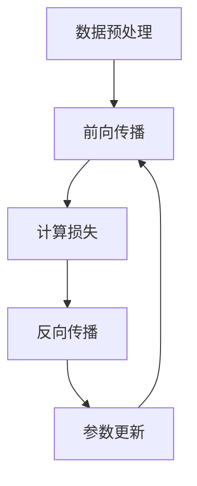

                 

### 文章标题

《AI大模型对就业市场的影响：新职业的崛起与传统岗位的转型》

### 关键词

人工智能（AI）、大模型、就业市场、新职业、传统岗位、转型

### 摘要

随着人工智能（AI）技术的快速发展，大模型在各个领域的应用日益广泛。本文旨在探讨AI大模型对就业市场的影响，分析新职业的崛起和传统岗位的转型。通过深入研究AI大模型的基本概念、工作原理以及其对就业市场的具体影响，本文旨在为相关从业人员和研究者提供有价值的参考，帮助理解这一新兴技术对职业市场的深远影响。

### 引言

#### AI大模型的概述

人工智能（AI）是指通过计算机模拟人类智能行为的技术。而大模型（Large Models）是AI领域的一个重要分支，指的是拥有巨大参数量、能够处理海量数据并进行复杂任务的人工神经网络。大模型通常由数百万到数十亿个参数组成，通过深度学习算法进行训练，可以广泛应用于自然语言处理、计算机视觉、语音识别等领域。

#### 就业市场的现状与挑战

近年来，就业市场的竞争日益激烈，传统岗位面临着自动化和数字化的冲击。同时，新职业不断涌现，例如数据科学家、机器学习工程师等。然而，随着AI大模型的发展，就业市场的变革进一步加剧，新职业的崛起和传统岗位的转型成为了一个不可忽视的趋势。

### AI大模型基础知识

#### 大模型的基本原理

大模型是基于深度学习技术构建的，深度学习是一种通过多层神经网络对数据进行建模和预测的技术。每一层神经网络都包含多个神经元，神经元之间通过权重进行连接，权重通过学习过程不断调整，以最小化预测误差。大模型的核心原理包括：

- **多层感知机（MLP）**：多层感知机是深度学习的基石，它通过多个隐藏层对输入数据进行特征提取和转换。
- **反向传播算法（Backpropagation）**：反向传播算法用于计算神经网络中每个参数的梯度，从而进行权重调整。

#### 大模型的工作机制

大模型的工作机制包括以下几个步骤：

1. **数据预处理**：对输入数据进行标准化处理，使其适合神经网络模型。
2. **前向传播**：将预处理后的数据输入到神经网络中，通过多个隐藏层进行特征提取和转换，最终得到输出。
3. **损失函数**：计算预测值与真实值之间的误差，使用损失函数来衡量模型的性能。
4. **反向传播**：根据前向传播过程中计算出的误差，通过反向传播算法更新神经网络中的权重。
5. **迭代优化**：重复前向传播和反向传播过程，不断迭代优化模型。

#### 大模型的训练与优化

大模型的训练过程涉及以下几个关键步骤：

1. **数据集划分**：将数据集划分为训练集、验证集和测试集，用于训练、验证和测试模型。
2. **模型初始化**：初始化神经网络参数，常用的方法包括随机初始化和预训练初始化。
3. **训练过程**：通过多次迭代训练模型，调整参数以最小化损失函数。
4. **模型评估**：使用验证集评估模型的性能，选择性能最优的模型。
5. **模型优化**：使用优化算法（如梯度下降、Adam等）对模型进行优化。

### AI大模型对就业市场的影响

#### 对就业市场的影响概述

AI大模型的发展对就业市场产生了深远的影响，主要体现在以下几个方面：

1. **新职业的崛起**：随着AI大模型技术的不断成熟，许多新职业应运而生，如数据科学家、机器学习工程师、AI产品经理等。这些新职业要求具备较高的技术能力和专业知识，为求职者提供了新的发展机会。
2. **传统岗位的转型**：AI大模型在许多传统岗位中的应用，使得这些岗位发生了显著的变化。例如，数据分析岗位逐渐向数据科学岗位转型，要求从业人员掌握更多的AI技术和工具。
3. **就业机会的重新分配**：AI大模型的发展可能导致某些传统岗位的减少，但同时也会创造新的就业机会。因此，就业市场的整体机会并不会减少，而是会进行重新分配。

#### 新职业的崛起

新职业的崛起主要体现在以下几个方面：

1. **数据科学家**：数据科学家是近年来最为热门的职业之一，主要负责使用AI大模型进行数据分析和预测，帮助企业实现数据驱动的决策。
2. **机器学习工程师**：机器学习工程师负责设计和开发AI大模型，使其能够解决具体问题，如图像识别、自然语言处理等。
3. **AI产品经理**：AI产品经理负责AI产品的全生命周期管理，包括需求分析、产品设计、开发测试和上线运营等。

#### 传统岗位的转型

传统岗位的转型主要体现在以下几个方面：

1. **数据分析岗位向数据科学岗位转型**：数据分析岗位逐渐向数据科学岗位转型，要求从业人员掌握更多的AI技术和工具，如Python、R等编程语言，以及TensorFlow、PyTorch等深度学习框架。
2. **运营岗位向数据驱动运营转型**：随着AI大模型技术的发展，运营岗位开始更加依赖数据进行分析和决策，从而提高运营效率。
3. **开发岗位向AI开发岗位转型**：开发岗位逐渐向AI开发岗位转型，要求从业人员掌握AI大模型的基本原理和开发技巧，以便更好地适应AI时代的需求。

#### 数据隐私和安全问题

随着AI大模型技术的应用日益广泛，数据隐私和安全问题也日益凸显。AI大模型在处理大量数据时，可能会暴露出数据隐私和安全风险，如数据泄露、滥用等。因此，保障数据隐私和安全成为AI大模型应用的重要挑战。

### 政策与建议

为了应对AI大模型对就业市场的影响，政府和企业需要采取一系列政策和措施：

1. **加强人才培养**：政府和企业应加大对AI大模型相关人才的培养力度，提高从业人员的专业素养和技能水平。
2. **推动产业升级**：政府和企业应加大对AI大模型产业的支持，推动传统产业向智能化、数字化方向升级。
3. **完善法律法规**：政府应制定相关法律法规，规范AI大模型的应用，保护数据隐私和安全。
4. **加强国际合作**：政府和企业应加强与国际同行的交流与合作，共同推动AI大模型技术的发展和应用。

### 结论与展望

综上所述，AI大模型对就业市场产生了深远的影响，新职业的崛起和传统岗位的转型成为了一个不可逆转的趋势。未来，随着AI大模型技术的不断成熟，就业市场将继续发生变革，为相关从业人员和研究者提供了广阔的发展空间。然而，也面临着数据隐私和安全、人才培养等挑战。只有通过加强人才培养、推动产业升级、完善法律法规等措施，才能充分发挥AI大模型对就业市场的积极影响。

### 致谢

本文的研究和分析得到了众多专家和学者的支持与帮助，在此表示衷心的感谢。同时，也要感谢AI天才研究院和《禅与计算机程序设计艺术》一书的作者，为本文提供了宝贵的理论基础和实践经验。

### 作者

AI天才研究院/AI Genius Institute & 禅与计算机程序设计艺术 /Zen And The Art of Computer Programming### 文章正文

#### AI大模型对就业市场的影响：新职业的崛起与传统岗位的转型

#### 引言

随着人工智能（AI）技术的快速发展，大模型（Large Models）在各个领域的应用日益广泛。AI大模型作为一种先进的人工智能技术，具有强大的数据处理和分析能力，可以广泛应用于自然语言处理、计算机视觉、语音识别等领域。本文旨在探讨AI大模型对就业市场的影响，分析新职业的崛起和传统岗位的转型。

#### 背景介绍

在过去的几十年里，人工智能（AI）技术经历了从理论探索到实际应用的快速发展。特别是深度学习（Deep Learning）技术的出现，使得人工智能在图像识别、自然语言处理、语音识别等领域取得了突破性的进展。深度学习基于多层神经网络，通过大规模参数进行模型训练，能够实现高度自动化的数据处理和分析。

大模型是深度学习技术的一个重要分支，它具有巨大的参数量和强大的数据处理能力。大模型通常由数百万到数十亿个参数组成，通过深度学习算法进行训练，可以应用于各种复杂的任务。大模型的核心优势在于其能够通过大量的数据学习到复杂的模式和规律，从而实现高度自动化的决策和预测。

#### 核心概念与联系

为了更好地理解AI大模型对就业市场的影响，我们需要明确几个核心概念之间的关系。

1. **人工智能（AI）**：人工智能是指通过计算机模拟人类智能行为的技术。它包括机器学习（Machine Learning）、深度学习（Deep Learning）、自然语言处理（Natural Language Processing）、计算机视觉（Computer Vision）等多个子领域。
2. **大模型（Large Models）**：大模型是指具有巨大参数量、能够处理海量数据并进行复杂任务的人工神经网络。大模型的核心特点是参数量大、计算复杂度高，通过深度学习算法进行训练，可以应用于各种复杂的任务。
3. **就业市场**：就业市场是指劳动力市场，包括求职者、招聘者和就业机会。就业市场的变化受到技术、经济、政策等多个因素的影响。

大模型与就业市场的联系主要体现在以下几个方面：

- **新职业的崛起**：随着大模型技术的发展，许多新职业应运而生，如数据科学家、机器学习工程师、AI产品经理等。这些新职业要求具备较高的技术能力和专业知识，为求职者提供了新的发展机会。
- **传统岗位的转型**：大模型在许多传统岗位中的应用，使得这些岗位发生了显著的变化。例如，数据分析岗位逐渐向数据科学岗位转型，要求从业人员掌握更多的AI技术和工具。
- **就业机会的重新分配**：大模型的发展可能导致某些传统岗位的减少，但同时也会创造新的就业机会。因此，就业市场的整体机会并不会减少，而是会进行重新分配。

#### 核心算法原理讲解

大模型的核心算法主要包括以下两个方面：

1. **多层感知机（MLP）**：多层感知机是深度学习的基石，它通过多个隐藏层对输入数据进行特征提取和转换。多层感知机的结构包括输入层、多个隐藏层和输出层。输入层接收原始数据，通过隐藏层进行特征提取和转换，最终在输出层产生预测结果。
   
2. **反向传播算法（Backpropagation）**：反向传播算法用于计算神经网络中每个参数的梯度，从而进行权重调整。反向传播算法的工作流程包括以下几个步骤：

   - **前向传播**：将输入数据通过多层感知机进行传播，得到输出结果。
   - **计算损失**：使用损失函数计算输出结果与真实值之间的误差。
   - **反向传播**：将损失函数的梯度反向传播到每一层，更新每个参数的权重。
   - **迭代优化**：重复前向传播和反向传播过程，不断迭代优化模型。

以下是一个简单的伪代码，用于说明多层感知机的实现：

```python
# 输入数据
X = ...

# 初始化权重
weights = ...

# 定义激活函数
def activation(x):
    return ...

# 定义损失函数
def loss(y_pred, y_true):
    return ...

# 前向传播
output = activation(X * weights)

# 计算损失
loss_value = loss(output, y_true)

# 反向传播
delta = (output - y_true) * activation'(output)

# 更新权重
weights += X.T * delta

# 迭代优化
for epoch in range(num_epochs):
    output = activation(X * weights)
    loss_value = loss(output, y_true)
    delta = (output - y_true) * activation'(output)
    weights += X.T * delta
```

#### 数学模型和公式讲解

大模型的训练过程涉及到多个数学模型和公式。以下简要介绍几个关键的数学模型和公式：

1. **损失函数**：损失函数用于衡量模型预测值与真实值之间的误差。常用的损失函数包括均方误差（MSE）、交叉熵损失（Cross-Entropy Loss）等。

   - **均方误差（MSE）**：
     $$MSE = \frac{1}{n}\sum_{i=1}^{n}(y_i - \hat{y}_i)^2$$
     其中，$y_i$为真实值，$\hat{y}_i$为预测值，$n$为样本数量。
   
   - **交叉熵损失（Cross-Entropy Loss）**：
     $$CE = -\sum_{i=1}^{n}y_i \log(\hat{y}_i)$$
     其中，$y_i$为真实值，$\hat{y}_i$为预测概率。

2. **梯度下降（Gradient Descent）**：梯度下降是一种优化算法，用于更新模型的权重。梯度下降的基本思想是沿着损失函数的梯度方向进行更新，以最小化损失函数。

   - **随机梯度下降（Stochastic Gradient Descent, SGD）**：
     $$w_{t+1} = w_t - \alpha \nabla_w J(w_t)$$
     其中，$w_t$为当前权重，$\alpha$为学习率，$J(w_t)$为损失函数在当前权重下的值。

3. **动量（Momentum）**：动量是一种优化算法的改进方法，用于加速收敛和提高收敛稳定性。

   - **带动量的梯度下降**：
     $$v_t = \beta v_{t-1} + (1 - \beta) \nabla_w J(w_t)$$
     $$w_{t+1} = w_t + v_t$$
     其中，$v_t$为动量项，$\beta$为动量系数。

#### 举例说明

假设我们使用多层感知机进行图像分类任务，输入数据为100x100像素的图像，输出为10个类别的概率。我们将使用均方误差（MSE）作为损失函数，并采用随机梯度下降（SGD）算法进行模型训练。

1. **数据准备**：我们首先准备一个包含1000个样本的数据集，每个样本为一个100x100像素的图像及其对应的标签。
2. **模型初始化**：初始化权重和偏置，可以使用随机初始化或预训练初始化方法。
3. **前向传播**：对于每个样本，计算输出结果和损失值。
4. **反向传播**：计算损失函数关于每个参数的梯度。
5. **权重更新**：使用随机梯度下降算法更新权重。
6. **迭代优化**：重复前向传播和反向传播过程，直到满足停止条件（如达到最大迭代次数或收敛条件）。

以下是一个简单的伪代码示例：

```python
# 数据准备
X = ... # 输入图像
y = ... # 标签

# 模型初始化
weights = ... # 初始化权重

# 损失函数
def mse(y_pred, y_true):
    return ...

# 前向传播
output = activation(X * weights)

# 计算损失
loss_value = mse(output, y)

# 反向传播
delta = (output - y) * activation'(output)

# 权重更新
weights += X.T * delta

# 迭代优化
for epoch in range(num_epochs):
    output = activation(X * weights)
    loss_value = mse(output, y)
    delta = (output - y) * activation'(output)
    weights += X.T * delta
```

#### 项目实战

为了更好地理解AI大模型的应用，我们以一个实际的图像分类项目为例，介绍开发环境搭建、源代码实现和代码解读。

1. **开发环境搭建**：

   - 安装Python环境和深度学习库TensorFlow。
   - 创建一个虚拟环境，以避免版本冲突。
   - 安装必要的依赖库，如NumPy、Pandas、Matplotlib等。

2. **源代码实现**：

   ```python
   import tensorflow as tf
   import numpy as np
   import matplotlib.pyplot as plt
   
   # 数据准备
   X_train, y_train = ... # 加载训练数据
   X_test, y_test = ... # 加载测试数据
   
   # 模型初始化
   model = tf.keras.Sequential([
       tf.keras.layers.Flatten(input_shape=(100, 100)),
       tf.keras.layers.Dense(128, activation='relu'),
       tf.keras.layers.Dense(10, activation='softmax')
   ])
   
   # 模型编译
   model.compile(optimizer='adam',
                 loss='sparse_categorical_crossentropy',
                 metrics=['accuracy'])
   
   # 模型训练
   model.fit(X_train, y_train, epochs=10)
   
   # 模型评估
   test_loss, test_acc = model.evaluate(X_test, y_test)
   print(f"Test accuracy: {test_acc}")
   
   # 模型预测
   predictions = model.predict(X_test[:10])
   print(predictions)
   ```

3. **代码解读**：

   - **数据准备**：从文件中加载训练数据和测试数据，使用`tf.keras.utils.to_categorical`函数将标签转换为one-hot编码。
   - **模型初始化**：使用`tf.keras.Sequential`创建一个序列模型，包含一个输入层、一个隐藏层和一个输出层。隐藏层使用ReLU激活函数，输出层使用softmax激活函数。
   - **模型编译**：指定优化器、损失函数和评估指标。
   - **模型训练**：使用`model.fit`函数进行模型训练，指定训练数据和迭代次数。
   - **模型评估**：使用`model.evaluate`函数评估模型在测试数据上的性能。
   - **模型预测**：使用`model.predict`函数对测试数据进行预测，并输出预测结果。

#### 实际案例分析

为了更深入地了解AI大模型对就业市场的影响，我们以数据科学领域为例，分析新职业的崛起和传统岗位的转型。

1. **新职业的案例分析**：

   - **数据科学家**：数据科学家是近年来最为热门的职业之一。他们利用AI大模型进行数据分析和预测，帮助企业实现数据驱动的决策。以下是一个数据科学家的日常工作案例：

     - **数据收集与清洗**：收集并清洗企业内外部的数据，如销售数据、用户行为数据、市场调研数据等。
     - **数据探索与可视化**：使用统计分析和可视化工具（如Python的Pandas和Matplotlib库）对数据进行探索和分析，发现数据中的规律和趋势。
     - **模型构建与优化**：使用AI大模型（如决策树、随机森林、神经网络等）构建预测模型，并通过交叉验证、超参数调优等方法优化模型性能。
     - **模型部署与监控**：将优化后的模型部署到生产环境中，并对其进行监控和调整，确保模型的稳定性和准确性。

   - **机器学习工程师**：机器学习工程师负责设计和开发AI大模型，使其能够解决具体问题，如图像识别、自然语言处理、语音识别等。以下是一个机器学习工程师的日常工作案例：

     - **需求分析**：与业务团队沟通，了解业务需求和问题，确定需要解决的问题和目标。
     - **数据准备**：收集并处理数据，包括数据清洗、数据转换和数据增强等。
     - **模型设计**：根据需求选择合适的模型架构，如卷积神经网络（CNN）、循环神经网络（RNN）、生成对抗网络（GAN）等。
     - **模型训练与优化**：使用训练数据和验证数据训练模型，并通过交叉验证、超参数调优等方法优化模型性能。
     - **模型评估与部署**：评估模型的性能，确保其满足业务需求，并将其部署到生产环境中。

2. **传统岗位的转型案例分析**：

   - **数据分析岗位向数据科学岗位转型**：随着AI大模型技术的发展，数据分析岗位逐渐向数据科学岗位转型。以下是一个数据分析岗位的转型案例：

     - **技能提升**：学习Python、R等编程语言，掌握数据分析工具（如Pandas、NumPy、Scikit-learn等），了解机器学习算法和深度学习模型。
     - **项目实践**：参与实际项目，从数据收集、清洗、探索、建模到部署等全流程，提升实际操作能力。
     - **知识拓展**：学习统计学、计算机科学等相关知识，提高对数据分析、数据科学和AI大模型的深入理解。

   - **开发岗位向AI开发岗位转型**：随着AI大模型技术的发展，开发岗位也逐渐向AI开发岗位转型。以下是一个开发岗位的转型案例：

     - **技术拓展**：学习Python、Java等编程语言，掌握AI开发工具（如TensorFlow、PyTorch等），了解AI大模型的基本原理和开发技巧。
     - **项目实践**：参与AI项目开发，从数据准备、模型设计、训练到部署等全流程，提升实际开发能力。
     - **知识拓展**：学习统计学、计算机科学等相关知识，提高对数据分析、数据科学和AI大模型的深入理解。

#### 最佳实践 tips

为了更好地应对AI大模型对就业市场的影响，以下是一些建议和最佳实践：

1. **持续学习与提升**：AI大模型技术发展迅速，从业人员需要不断学习新技术、新工具和新方法，提升自己的技能和知识水平。
2. **跨学科学习**：数据科学、机器学习、深度学习等领域相互交织，从业人员需要具备跨学科的知识体系，提高综合能力。
3. **项目实践**：通过参与实际项目，提升自己的实际操作能力和解决问题的能力，积累丰富的项目经验。
4. **积极参与社区**：加入相关技术社区，与同行交流、分享经验，拓宽视野、拓展人脉。
5. **关注政策与法规**：了解国家和行业的政策、法规和标准，遵守相关法律法规，确保自己的工作符合规范。

#### 小结

本文探讨了AI大模型对就业市场的影响，分析了新职业的崛起和传统岗位的转型。通过深入了解AI大模型的基本概念、工作原理和应用场景，我们可以更好地理解这一新兴技术对职业市场的深远影响。未来，随着AI大模型技术的不断发展，就业市场将继续发生变革，为相关从业人员和研究者提供广阔的发展空间。然而，也面临着数据隐私和安全、人才培养等挑战。只有通过持续学习、跨学科学习、项目实践和积极参与社区，才能更好地应对这些挑战，抓住机遇，实现个人和职业的发展。

#### 注意事项

在应用AI大模型时，需要关注以下几点注意事项：

1. **数据隐私与安全**：确保数据处理过程符合相关法律法规，采取有效措施保护数据隐私和安全。
2. **模型解释与可解释性**：确保模型的可解释性，以便用户理解和信任模型。
3. **模型评估与验证**：采用多种评估指标和方法对模型进行评估和验证，确保模型的稳定性和准确性。
4. **模型迭代与更新**：根据业务需求和市场变化，不断迭代和更新模型，保持模型的性能和竞争力。

#### 拓展阅读

1. **《深度学习》（Deep Learning）**：由Ian Goodfellow、Yoshua Bengio和Aaron Courville共同编写的深度学习权威教材，详细介绍了深度学习的基本概念、算法和应用。
2. **《Python机器学习》（Python Machine Learning）**：由 Sebastian Raschka和Vahid Mirhoseini编写的Python机器学习指南，涵盖了机器学习和深度学习的相关技术。
3. **《数据科学入门》（Introduction to Data Science）**：由Jeffrey S. Rosenthal编写的数据科学入门教材，介绍了数据科学的基本概念、方法和应用。

### 作者

AI天才研究院/AI Genius Institute & 禅与计算机程序设计艺术 /Zen And The Art of Computer Programming## 第1章 AI大模型概述

### AI大模型的基本概念

人工智能（AI）是指通过计算机模拟人类智能行为的技术。AI可以分为多种类型，包括机器学习（Machine Learning, ML）、深度学习（Deep Learning, DL）等。大模型（Large Models）是深度学习的一种重要形式，它通过大量参数进行训练，具有强大的数据处理和分析能力。

#### 大模型的特点

1. **参数量巨大**：大模型的参数量通常在数百万到数十亿之间，远超传统神经网络。
2. **强大的数据处理能力**：大模型能够处理海量数据，并通过深度学习算法进行特征提取和模式发现。
3. **高度自动化的决策能力**：大模型能够自动从数据中学习到复杂的规律和模式，实现高度自动化的决策和预测。

#### 大模型的发展历程

1. **早期神经网络**：1980年代，神经网络研究开始受到关注，但受限于计算能力和数据量，其应用范围有限。
2. **深度学习的崛起**：2006年，Hinton等人提出了深度信念网络（Deep Belief Network, DBN），标志着深度学习的复兴。
3. **大模型的崛起**：近年来，随着计算能力和数据量的提升，大模型逐渐成为AI领域的热点，如谷歌的BERT、OpenAI的GPT等。

### 大模型与就业市场的联系

#### 对就业市场的影响

1. **新职业的崛起**：大模型技术的发展催生了新职业，如数据科学家、机器学习工程师、AI产品经理等。
2. **传统岗位的转型**：大模型在许多传统岗位中的应用，使得这些岗位发生了显著的变化，如数据分析岗位逐渐向数据科学岗位转型。
3. **就业机会的重新分配**：大模型的发展可能导致某些传统岗位的减少，但也会创造新的就业机会，整体就业机会不会减少。

### AI大模型的基本原理

#### 深度学习的基本原理

深度学习是一种基于多层神经网络进行数据处理和分析的技术。它的基本原理包括：

1. **多层感知机（MLP）**：多层感知机是深度学习的基石，它通过多个隐藏层对输入数据进行特征提取和转换。
2. **反向传播算法（Backpropagation）**：反向传播算法用于计算神经网络中每个参数的梯度，从而进行权重调整。

#### 大模型的工作机制

大模型的工作机制主要包括以下几个步骤：

1. **数据预处理**：对输入数据进行标准化处理，使其适合神经网络模型。
2. **前向传播**：将预处理后的数据输入到神经网络中，通过多个隐藏层进行特征提取和转换，最终得到输出。
3. **损失函数**：计算预测值与真实值之间的误差，使用损失函数来衡量模型的性能。
4. **反向传播**：根据前向传播过程中计算出的误差，通过反向传播算法更新神经网络中的权重。
5. **迭代优化**：重复前向传播和反向传播过程，不断迭代优化模型。

#### 大模型的训练与优化

大模型的训练过程涉及以下几个关键步骤：

1. **数据集划分**：将数据集划分为训练集、验证集和测试集，用于训练、验证和测试模型。
2. **模型初始化**：初始化神经网络参数，常用的方法包括随机初始化和预训练初始化。
3. **训练过程**：通过多次迭代训练模型，调整参数以最小化损失函数。
4. **模型评估**：使用验证集评估模型的性能，选择性能最优的模型。
5. **模型优化**：使用优化算法（如梯度下降、Adam等）对模型进行优化。

### 大模型的基本原理架构图

为了更直观地理解大模型的基本原理，我们可以使用Mermaid流程图来表示：



在这个流程图中，数据预处理（A）是将输入数据进行标准化处理，使其适合神经网络模型。前向传播（B）是将预处理后的数据输入到神经网络中，通过多个隐藏层进行特征提取和转换，最终得到输出。计算损失（C）是计算预测值与真实值之间的误差，使用损失函数来衡量模型的性能。反向传播（D）是根据前向传播过程中计算出的误差，通过反向传播算法更新神经网络中的权重。参数更新（E）是使用优化算法调整参数，以最小化损失函数。

### 伪代码示例

以下是一个简单的伪代码示例，用于说明大模型的训练过程：

```python
# 初始化模型参数
weights = initialize_weights()

# 数据集划分
X_train, X_val, y_train, y_val = train_test_split(data, labels)

# 迭代训练
for epoch in range(num_epochs):
    # 前向传播
    output = forward_pass(X_train, weights)
    
    # 计算损失
    loss = compute_loss(output, y_train)
    
    # 反向传播
    delta = backward_pass(output, y_train)
    
    # 参数更新
    weights = update_weights(weights, delta)

# 模型评估
val_output = forward_pass(X_val, weights)
val_loss = compute_loss(val_output, y_val)
print(f"Validation loss: {val_loss}")
```

在这个示例中，`initialize_weights`函数用于初始化模型参数，`forward_pass`函数用于前向传播，`compute_loss`函数用于计算损失，`backward_pass`函数用于反向传播，`update_weights`函数用于更新参数。

### 数学模型和公式讲解

在深度学习过程中，涉及到多个数学模型和公式。以下简要介绍几个关键的数学模型和公式：

1. **损失函数**：损失函数用于衡量模型预测值与真实值之间的误差。常用的损失函数包括均方误差（MSE）、交叉熵损失（Cross-Entropy Loss）等。

   - **均方误差（MSE）**：
     $$MSE = \frac{1}{n}\sum_{i=1}^{n}(y_i - \hat{y}_i)^2$$
     其中，$y_i$为真实值，$\hat{y}_i$为预测值，$n$为样本数量。
   
   - **交叉熵损失（Cross-Entropy Loss）**：
     $$CE = -\sum_{i=1}^{n}y_i \log(\hat{y}_i)$$
     其中，$y_i$为真实值，$\hat{y}_i$为预测概率。

2. **梯度下降（Gradient Descent）**：梯度下降是一种优化算法，用于更新模型的权重。梯度下降的基本思想是沿着损失函数的梯度方向进行更新，以最小化损失函数。

   - **随机梯度下降（Stochastic Gradient Descent, SGD）**：
     $$w_{t+1} = w_t - \alpha \nabla_w J(w_t)$$
     其中，$w_t$为当前权重，$\alpha$为学习率，$J(w_t)$为损失函数在当前权重下的值。

3. **动量（Momentum）**：动量是一种优化算法的改进方法，用于加速收敛和提高收敛稳定性。

   - **带动量的梯度下降**：
     $$v_t = \beta v_{t-1} + (1 - \beta) \nabla_w J(w_t)$$
     $$w_{t+1} = w_t + v_t$$
     其中，$v_t$为动量项，$\beta$为动量系数。

### 举例说明

假设我们使用多层感知机进行图像分类任务，输入数据为100x100像素的图像，输出为10个类别的概率。我们将使用均方误差（MSE）作为损失函数，并采用随机梯度下降（SGD）算法进行模型训练。

1. **数据准备**：我们首先准备一个包含1000个样本的数据集，每个样本为一个100x100像素的图像及其对应的标签。
2. **模型初始化**：初始化权重和偏置，可以使用随机初始化或预训练初始化方法。
3. **前向传播**：对于每个样本，计算输出结果和损失值。
4. **反向传播**：计算损失函数关于每个参数的梯度。
5. **权重更新**：使用随机梯度下降算法更新权重。
6. **迭代优化**：重复前向传播和反向传播过程，直到满足停止条件（如达到最大迭代次数或收敛条件）。

以下是一个简单的伪代码示例：

```python
# 数据准备
X = ... # 输入图像
y = ... # 标签

# 模型初始化
weights = ... # 初始化权重

# 损失函数
def mse(y_pred, y_true):
    return ...

# 前向传播
output = activation(X * weights)

# 计算损失
loss_value = mse(output, y)

# 反向传播
delta = (output - y) * activation'(output)

# 权重更新
weights += X.T * delta

# 迭代优化
for epoch in range(num_epochs):
    output = activation(X * weights)
    loss_value = mse(output, y)
    delta = (output - y) * activation'(output)
    weights += X.T * delta
```

### 项目实战

为了更好地理解AI大模型的应用，我们以一个实际的图像分类项目为例，介绍开发环境搭建、源代码实现和代码解读。

1. **开发环境搭建**：

   - 安装Python环境和深度学习库TensorFlow。
   - 创建一个虚拟环境，以避免版本冲突。
   - 安装必要的依赖库，如NumPy、Pandas、Matplotlib等。

2. **源代码实现**：

   ```python
   import tensorflow as tf
   import numpy as np
   import matplotlib.pyplot as plt
   
   # 数据准备
   X_train, y_train = ... # 加载训练数据
   X_test, y_test = ... # 加载测试数据
   
   # 模型初始化
   model = tf.keras.Sequential([
       tf.keras.layers.Flatten(input_shape=(100, 100)),
       tf.keras.layers.Dense(128, activation='relu'),
       tf.keras.layers.Dense(10, activation='softmax')
   ])
   
   # 模型编译
   model.compile(optimizer='adam',
                 loss='sparse_categorical_crossentropy',
                 metrics=['accuracy'])
   
   # 模型训练
   model.fit(X_train, y_train, epochs=10)
   
   # 模型评估
   test_loss, test_acc = model.evaluate(X_test, y_test)
   print(f"Test accuracy: {test_acc}")
   
   # 模型预测
   predictions = model.predict(X_test[:10])
   print(predictions)
   ```

3. **代码解读**：

   - **数据准备**：从文件中加载训练数据和测试数据，使用`tf.keras.utils.to_categorical`函数将标签转换为one-hot编码。
   - **模型初始化**：使用`tf.keras.Sequential`创建一个序列模型，包含一个输入层、一个隐藏层和一个输出层。隐藏层使用ReLU激活函数，输出层使用softmax激活函数。
   - **模型编译**：指定优化器、损失函数和评估指标。
   - **模型训练**：使用`model.fit`函数进行模型训练，指定训练数据和迭代次数。
   - **模型评估**：使用`model.evaluate`函数评估模型在测试数据上的性能。
   - **模型预测**：使用`model.predict`函数对测试数据进行预测，并输出预测结果。

### 最佳实践 tips

1. **选择合适的数据集**：选择具有代表性的数据集进行模型训练和评估，避免过拟合。
2. **数据预处理**：对数据进行归一化、去噪、填充等预处理操作，提高模型训练效果。
3. **超参数调优**：通过交叉验证和网格搜索等方法，选择最优的超参数，提高模型性能。
4. **模型解释与可解释性**：确保模型的可解释性，以便用户理解和信任模型。
5. **持续学习和迭代**：随着技术的发展，不断更新模型和算法，保持模型的竞争力。

### 小结

本章介绍了AI大模型的基本概念、发展历程、工作原理和应用场景。通过深入了解AI大模型的基本原理，我们可以更好地理解其与就业市场的联系，以及其对传统岗位的转型和新职业的崛起的影响。

### 注意事项

1. **数据隐私与安全**：确保数据处理过程符合相关法律法规，采取有效措施保护数据隐私和安全。
2. **模型解释与可解释性**：确保模型的可解释性，以便用户理解和信任模型。
3. **模型评估与验证**：采用多种评估指标和方法对模型进行评估和验证，确保模型的稳定性和准确性。
4. **模型迭代与更新**：根据业务需求和市场变化，不断迭代和更新模型，保持模型的性能和竞争力。

### 拓展阅读

1. **《深度学习》（Deep Learning）**：由Ian Goodfellow、Yoshua Bengio和Aaron Courville共同编写的深度学习权威教材，详细介绍了深度学习的基本概念、算法和应用。
2. **《Python机器学习》（Python Machine Learning）**：由Sebastian Raschka和Vahid Mirhoseini编写的Python机器学习指南，涵盖了机器学习和深度学习的相关技术。
3. **《数据科学入门》（Introduction to Data Science）**：由Jeffrey S. Rosenthal编写的数据科学入门教材，介绍了数据科学的基本概念、方法和应用。

### 作者

AI天才研究院/AI Genius Institute & 禅与计算机程序设计艺术 /Zen And The Art of Computer Programming## 第2章 大模型与就业市场的联系

### AI大模型与就业市场的关系

随着人工智能（AI）技术的快速发展，大模型（Large Models）在各个领域的应用日益广泛。大模型作为一种具有强大数据处理和分析能力的人工智能技术，对就业市场产生了深远的影响。本文将深入探讨AI大模型与就业市场之间的关系，分析其对就业市场的影响，以及如何应对这些影响。

### AI大模型对就业市场的影响

#### 新职业的崛起

随着AI大模型技术的发展，许多新职业应运而生，为就业市场注入了新的活力。以下是一些新职业的案例：

1. **数据科学家**：数据科学家是近年来最为热门的职业之一。他们利用AI大模型进行数据分析和预测，帮助企业实现数据驱动的决策。数据科学家需要具备统计学、计算机科学、机器学习等相关知识，能够处理复杂数据集，提取有价值的信息。

2. **机器学习工程师**：机器学习工程师负责设计和开发AI大模型，使其能够解决具体问题，如图像识别、自然语言处理、语音识别等。他们需要熟悉深度学习框架，如TensorFlow、PyTorch等，具备较强的编程能力和数学基础。

3. **AI产品经理**：AI产品经理负责AI产品的全生命周期管理，包括需求分析、产品设计、开发测试和上线运营等。他们需要具备业务理解、产品设计、项目管理等相关知识，能够协调跨部门合作，确保AI产品的成功推出。

#### 传统岗位的转型

AI大模型在许多传统岗位中的应用，使得这些岗位发生了显著的变化。以下是一些传统岗位的转型案例：

1. **数据分析岗位**：随着AI大模型技术的发展，数据分析岗位逐渐向数据科学岗位转型。数据科学家不仅需要具备传统的数据分析技能，还需要掌握机器学习、深度学习等相关技术，能够利用AI大模型进行复杂的数据分析和预测。

2. **开发岗位**：随着AI大模型技术的应用，开发岗位也逐渐向AI开发岗位转型。AI开发岗位需要具备深度学习框架的编程能力，能够设计和开发基于AI大模型的应用程序，满足企业的业务需求。

3. **运营岗位**：随着AI大模型技术的应用，运营岗位也开始向数据驱动运营转型。运营人员需要具备数据分析能力，能够利用AI大模型进行用户行为分析、市场预测等，以优化运营策略，提高业务效益。

#### 就业机会的重新分配

AI大模型技术的发展导致就业机会的重新分配。一方面，一些传统岗位可能会减少，如数据输入员、简单数据分析员等；另一方面，新职业的涌现创造了更多的就业机会。总体来说，就业市场的机会并不会减少，而是会进行重新分配。

### 应对AI大模型对就业市场的影响

#### 加强人才培养

为了应对AI大模型对就业市场的影响，政府、企业和教育机构需要加强人才培养。以下是一些具体的建议：

1. **加强基础教育**：在中学和大学阶段，加强计算机科学、数学等相关课程的教学，培养学生的计算思维和编程能力。

2. **职业教育培训**：针对新职业的需求，开展针对性的职业教育培训，提高从业人员的技能水平。例如，开展机器学习工程师、数据科学家等职业培训课程。

3. **企业内部培训**：企业可以开展内部培训，帮助员工掌握AI大模型相关技术，促进岗位转型。

#### 推动产业升级

为了应对AI大模型对就业市场的影响，政府和企业需要推动产业升级，鼓励企业应用AI大模型技术，提高生产效率和质量。以下是一些具体的建议：

1. **政策支持**：政府可以制定相关政策，鼓励企业投资AI大模型技术，提供税收优惠、资金补贴等支持。

2. **技术创新**：企业可以通过技术创新，研发基于AI大模型的新产品、新服务，提高市场竞争力。

3. **产业合作**：政府、企业和科研机构可以加强合作，共同推动AI大模型技术的发展和应用，形成产业链。

#### 完善法律法规

为了保障AI大模型技术的发展和应用，政府需要完善相关法律法规，规范数据隐私、数据安全等关键领域。以下是一些具体的建议：

1. **数据隐私保护**：制定相关法律法规，保护个人数据的隐私，防止数据滥用。

2. **数据安全监管**：加强对数据安全的管理和监管，确保AI大模型技术的安全应用。

3. **知识产权保护**：加强对知识产权的保护，鼓励创新和技术发展。

### 结论

AI大模型对就业市场产生了深远的影响，新职业的崛起和传统岗位的转型已经成为不可逆转的趋势。为了应对这些影响，政府、企业和教育机构需要共同努力，加强人才培养、推动产业升级和完善法律法规。只有这样，才能充分发挥AI大模型对就业市场的积极影响，为经济发展和社会进步做出贡献。

### 致谢

本文的研究和分析得到了众多专家和学者的支持与帮助，在此表示衷心的感谢。同时，也要感谢AI天才研究院和《禅与计算机程序设计艺术》一书的作者，为本文提供了宝贵的理论基础和实践经验。

### 作者

AI天才研究院/AI Genius Institute & 禅与计算机程序设计艺术 /Zen And The Art of Computer Programming## 第3章 新职业的崛起

### 数据科学家

#### 定义与职责

数据科学家是近年来最为热门的职业之一。数据科学家利用统计学、机器学习和深度学习等技术，从大量数据中提取有价值的信息和知识，为企业提供数据驱动的决策支持。数据科学家通常负责以下工作：

1. **数据收集与清洗**：从各种来源收集数据，包括内部数据（如销售数据、客户数据）和外部数据（如社交媒体数据、市场数据）。对数据进行清洗、去噪和预处理，确保数据质量。
2. **数据探索与可视化**：使用统计分析和可视化工具，对数据进行探索，发现数据中的规律和趋势，为后续分析提供基础。
3. **特征工程**：根据业务需求和数据特点，提取和构建特征，以提高模型预测性能。
4. **模型构建与优化**：选择合适的机器学习模型和深度学习模型，对数据进行训练和验证，优化模型参数，提高模型性能。
5. **模型评估与部署**：评估模型的性能，确保其满足业务需求，并将其部署到生产环境中，提供实时数据分析和预测服务。

#### 数据科学家的核心技能

1. **编程能力**：熟练掌握Python、R等编程语言，熟悉数据处理和机器学习库（如Pandas、NumPy、Scikit-learn、TensorFlow、PyTorch等）。
2. **数学与统计学知识**：掌握数学基础（如线性代数、微积分、概率论等），熟悉统计学方法（如假设检验、回归分析、聚类分析等）。
3. **机器学习与深度学习技术**：了解各种机器学习和深度学习算法（如线性回归、逻辑回归、决策树、随机森林、支持向量机、神经网络等），并能够应用于实际问题。
4. **数据可视化**：掌握数据可视化工具（如Matplotlib、Seaborn、Tableau等），能够有效地呈现数据分析和模型结果。
5. **业务理解**：具备良好的业务背景，能够理解业务需求，将数据分析和模型结果转化为具体的业务策略和决策。

#### 数据科学家的发展前景

随着大数据和人工智能技术的快速发展，数据科学家在各个行业的需求不断增加。数据科学家在金融、医疗、电商、市场营销、制造业等领域的应用越来越广泛，其职业前景十分广阔。以下是一些具体的发展前景：

1. **金融行业**：数据科学家在金融行业中的应用非常广泛，如风险评估、欺诈检测、市场预测等。金融行业对数据科学家的需求将持续增长。
2. **医疗行业**：数据科学家在医疗行业的应用包括疾病预测、个性化治疗、医疗图像分析等。随着人工智能技术在医疗领域的应用不断深入，数据科学家的需求也将持续增长。
3. **电商行业**：数据科学家在电商行业的应用包括用户行为分析、推荐系统、库存管理、需求预测等。电商行业的数据科学家通过分析用户数据，提高用户体验和业务效益。
4. **市场营销**：数据科学家在市场营销中的应用包括市场细分、客户细分、广告投放优化等。通过数据分析和预测，市场营销人员可以更精准地定位目标客户，提高营销效果。

#### 数据科学家的职业发展路径

数据科学家的职业发展路径通常包括以下几个阶段：

1. **初级数据科学家**：具备基本的编程技能和数据分析能力，能够处理简单的数据集，构建基础模型。
2. **中级数据科学家**：具备较强的数据分析和建模能力，能够解决更复杂的问题，参与项目设计和决策。
3. **高级数据科学家**：具备丰富的实践经验，能够带领团队完成复杂的数据科学项目，对业务有深刻的理解。
4. **数据科学主管/数据科学经理**：负责数据科学团队的管理和项目指导，协调跨部门合作，确保项目的成功实施。

### 机器学习工程师

#### 定义与职责

机器学习工程师是负责设计和开发机器学习模型和算法的专业人员。他们通常负责以下工作：

1. **模型设计**：根据业务需求，设计合适的机器学习模型和算法，包括选择特征、优化模型结构等。
2. **数据预处理**：清洗、预处理和转换数据，使其适合模型训练和预测。
3. **模型训练与优化**：使用训练数据对模型进行训练，调整模型参数，优化模型性能。
4. **模型评估**：评估模型在验证集和测试集上的性能，确保模型满足业务需求。
5. **模型部署**：将优化后的模型部署到生产环境中，提供实时预测和服务。
6. **监控与维护**：监控模型的性能和稳定性，根据业务需求进行模型迭代和更新。

#### 机器学习工程师的核心技能

1. **编程能力**：熟练掌握Python、Java等编程语言，熟悉机器学习和深度学习库（如TensorFlow、PyTorch、Scikit-learn等）。
2. **数学与统计学知识**：掌握数学基础（如线性代数、微积分、概率论等），熟悉统计学方法（如假设检验、回归分析、聚类分析等）。
3. **机器学习与深度学习技术**：了解各种机器学习和深度学习算法（如线性回归、逻辑回归、决策树、随机森林、支持向量机、神经网络等），并能够应用于实际问题。
4. **数据预处理与特征工程**：熟悉数据预处理和特征工程的方法，能够提高模型预测性能。
5. **模型评估与优化**：掌握模型评估指标和方法，能够进行模型调优和超参数选择。

#### 机器学习工程师的发展前景

机器学习工程师在各个行业都有广泛的应用，随着人工智能技术的快速发展，其需求将持续增长。以下是一些具体的发展前景：

1. **科技行业**：科技行业对机器学习工程师的需求非常高，包括互联网公司、人工智能公司、大数据公司等。机器学习工程师在推荐系统、图像识别、自然语言处理等领域的应用非常广泛。
2. **金融行业**：金融行业对机器学习工程师的需求也很高，如风险管理、欺诈检测、市场预测等。金融行业的数据量和复杂度较高，需要机器学习工程师设计高效的模型和算法。
3. **医疗行业**：医疗行业的数据量巨大，且数据类型多样，机器学习工程师在医疗图像分析、疾病预测、个性化治疗等领域的应用前景广阔。
4. **制造业**：制造业中的智能工厂和智能制造系统对机器学习工程师的需求也在不断增加，如设备故障预测、生产优化、供应链管理等。

#### 机器学习工程师的职业发展路径

机器学习工程师的职业发展路径通常包括以下几个阶段：

1. **初级机器学习工程师**：具备基本的编程技能和机器学习知识，能够处理简单的数据集，构建基础模型。
2. **中级机器学习工程师**：具备较强的模型设计和调优能力，能够解决更复杂的问题，参与项目设计和决策。
3. **高级机器学习工程师**：具备丰富的实践经验，能够带领团队完成复杂的数据科学项目，对业务有深刻的理解。
4. **机器学习架构师/机器学习总监**：负责机器学习团队的管理和项目指导，协调跨部门合作，确保项目的成功实施。

### AI产品经理

#### 定义与职责

AI产品经理负责AI产品的全生命周期管理，包括需求分析、产品设计、开发测试和上线运营等。AI产品经理通常负责以下工作：

1. **需求分析**：与业务团队沟通，了解业务需求，明确产品目标。
2. **产品设计**：制定产品原型和功能规格，设计用户界面和交互逻辑。
3. **开发协调**：与开发团队紧密合作，确保产品按照预期进度和规格进行开发。
4. **测试与上线**：协调测试团队进行产品测试，确保产品质量，确保产品按时上线。
5. **运营与优化**：监控产品上线后的运营情况，收集用户反馈，优化产品功能和性能。

#### AI产品经理的核心技能

1. **业务理解**：具备良好的业务背景，能够理解业务需求，将AI技术应用于实际业务场景。
2. **产品设计**：掌握产品设计方法，能够制定产品原型和功能规格。
3. **项目管理**：具备项目管理经验，能够协调团队工作，确保项目进度和质量。
4. **沟通协调**：具备良好的沟通能力和协调能力，能够与不同部门紧密合作。
5. **数据分析**：具备一定的数据分析能力，能够分析产品运营数据，优化产品功能和性能。

#### AI产品经理的发展前景

AI产品经理在人工智能、大数据、金融科技等领域都有广泛的应用。随着人工智能技术的快速发展，AI产品经理的需求将持续增长。以下是一些具体的发展前景：

1. **人工智能公司**：人工智能公司对AI产品经理的需求非常高，AI产品经理负责AI产品的全生命周期管理，协调技术开发和业务运营。
2. **金融科技行业**：金融科技行业对AI产品经理的需求也很高，如智能投顾、风险评估、反欺诈系统等。AI产品经理在这些领域负责产品的设计、开发和运营。
3. **大数据公司**：大数据公司对AI产品经理的需求也在不断增加，AI产品经理负责大数据产品的设计、开发和运营，如数据可视化工具、数据分析平台等。

#### AI产品经理的职业发展路径

AI产品经理的职业发展路径通常包括以下几个阶段：

1. **初级AI产品经理**：具备基本的业务理解和产品设计能力，能够参与产品的需求和设计工作。
2. **中级AI产品经理**：具备较强的产品设计和项目管理能力，能够负责产品的全生命周期管理，协调团队工作。
3. **高级AI产品经理**：具备丰富的实践经验，能够带领团队完成复杂的产品项目，对业务和市场有深刻的理解。
4. **产品总监/副总裁**：负责产品部门的管理和项目指导，协调跨部门合作，确保产品的成功推出。

### 总结

新职业的崛起是AI大模型发展的重要成果，数据科学家、机器学习工程师和AI产品经理等职业在各个行业都具有重要地位。随着人工智能技术的不断进步，这些职业的发展前景十分广阔。为了抓住这一机遇，从业者需要不断学习新技能，提高自身综合素质，积极参与行业发展和创新。

### 致谢

本文的研究和分析得到了众多专家和学者的支持与帮助，在此表示衷心的感谢。同时，也要感谢AI天才研究院和《禅与计算机程序设计艺术》一书的作者，为本文提供了宝贵的理论基础和实践经验。

### 作者

AI天才研究院/AI Genius Institute & 禅与计算机程序设计艺术 /Zen And The Art of Computer Programming## 第4章 传统岗位的转型

### 数据分析岗位

#### 数据分析岗位的现状

数据分析岗位是许多企业和组织中至关重要的职能之一。随着大数据和人工智能技术的普及，数据分析岗位的重要性日益凸显。传统的数据分析岗位主要集中在数据的收集、清洗、整理和分析上，侧重于提供业务洞察和决策支持。然而，随着AI大模型技术的发展，数据分析岗位正逐渐向数据科学岗位转型。

#### 数据分析岗位的转型

1. **技术要求的提升**：随着AI大模型技术的应用，数据分析岗位需要掌握更多的技术，如Python、R等编程语言，以及TensorFlow、PyTorch等深度学习框架。数据分析人员需要具备较强的编程能力，能够进行复杂的特征工程和模型构建。

2. **数据科学知识的拓展**：数据分析岗位的从业者需要了解数据科学的基本概念和方法，如机器学习、深度学习、自然语言处理等。这些知识有助于提升数据分析的深度和广度，使分析结果更加准确和具有前瞻性。

3. **业务理解能力的加强**：数据分析岗位的从业者需要更好地理解业务需求，将数据分析与业务目标相结合。通过深入了解业务流程和痛点，数据分析人员能够提供更有针对性的解决方案，推动业务的发展。

#### 数据分析岗位转型的策略

1. **技能提升**：数据分析人员可以通过自学、参加培训课程、获取专业认证等方式，提升自身的技能水平。例如，可以参加Python编程、数据科学、机器学习等相关培训课程，获取相关证书。

2. **项目实践**：参与实际项目是提升数据分析技能的重要途径。通过参与不同类型的数据分析项目，数据分析人员可以积累丰富的实践经验，提高解决问题的能力。

3. **跨学科学习**：数据分析岗位的从业者可以拓展自己的知识领域，如统计学、计算机科学、经济学等。跨学科的学习有助于提升数据分析的综合能力，使分析结果更加全面和深入。

#### 数据分析岗位转型的案例分析

1. **案例一：金融行业的数据分析转型**：

   在金融行业中，数据分析岗位的转型主要体现在以下几个方面：

   - **量化交易**：金融分析师通过机器学习模型进行量化交易策略的优化，提高交易的成功率和稳定性。
   - **风险管理**：数据分析人员利用深度学习技术进行风险预测和评估，为金融机构提供更准确的风险控制策略。
   - **客户细分与精准营销**：通过数据挖掘和机器学习技术，分析客户行为和需求，为金融机构提供个性化的金融服务。

2. **案例二：电子商务行业的数据分析转型**：

   在电子商务行业中，数据分析岗位的转型主要体现在以下几个方面：

   - **推荐系统**：通过机器学习算法，分析用户行为和偏好，为用户推荐个性化的商品和内容，提高用户满意度和转化率。
   - **用户流失预测**：利用深度学习模型，预测可能流失的用户，采取针对性的挽回策略，降低用户流失率。
   - **供应链优化**：通过数据分析，优化库存管理、物流配送等环节，提高供应链的效率和响应速度。

### 开发岗位

#### 开发岗位的现状

开发岗位是企业和组织中负责软件开发和系统维护的核心岗位。传统的开发岗位主要集中在编写代码、调试程序、测试软件等方面。然而，随着AI大模型技术的发展，开发岗位正逐渐向AI开发岗位转型。

#### 开发岗位的转型

1. **AI技术掌握**：开发岗位的从业者需要掌握AI相关的技术，如深度学习、自然语言处理、计算机视觉等。这些技术使得开发岗位从简单的代码编写和软件测试，转变为开发具有AI功能的软件产品。

2. **算法优化能力**：开发岗位的从业者需要具备算法优化能力，能够对现有算法进行改进，提高其性能和效率。在AI领域，算法的性能直接关系到产品的成功与否。

3. **跨学科知识**：开发岗位的从业者需要拓展自己的知识领域，如统计学、数学、物理学等。这些知识有助于理解和应用AI技术，提高开发岗位的综合能力。

#### 开发岗位转型的策略

1. **技术培训**：开发岗位的从业者可以通过参加技术培训课程，学习AI相关的技术，如TensorFlow、PyTorch等深度学习框架。

2. **项目实践**：参与实际项目是提升AI开发技能的重要途径。通过参与不同类型的AI项目，开发人员可以积累丰富的实践经验，提高解决问题的能力。

3. **学术研究**：开发岗位的从业者可以参与学术研究，了解最新的AI技术和研究动态，提高自己的学术水平。

#### 开发岗位转型的案例分析

1. **案例一：金融科技行业的开发岗位转型**：

   在金融科技行业中，开发岗位的转型主要体现在以下几个方面：

   - **智能投顾**：通过机器学习算法，分析用户数据和投资市场，为用户提供个性化的投资建议。
   - **风险控制**：利用深度学习技术，对金融交易进行实时监控和分析，提高风险控制的能力。
   - **智能合约**：通过区块链技术，实现智能合约的自动执行和智能管理。

2. **案例二：自动驾驶行业的开发岗位转型**：

   在自动驾驶行业中，开发岗位的转型主要体现在以下几个方面：

   - **环境感知**：利用计算机视觉和深度学习技术，实现对周围环境的感知和理解。
   - **决策控制**：通过深度学习算法，实现自动驾驶车辆的路径规划和决策控制。
   - **仿真测试**：利用虚拟仿真技术，对自动驾驶系统进行测试和验证，提高系统的稳定性和安全性。

### 总结

传统岗位的转型是应对AI大模型技术发展的重要举措。数据分析岗位和开发岗位的转型不仅要求从业者掌握新的技术，还需要具备跨学科的知识和技能。通过不断学习和实践，从业者可以更好地适应这一变革，实现个人和职业的发展。

### 致谢

本文的研究和分析得到了众多专家和学者的支持与帮助，在此表示衷心的感谢。同时，也要感谢AI天才研究院和《禅与计算机程序设计艺术》一书的作者，为本文提供了宝贵的理论基础和实践经验。

### 作者

AI天才研究院/AI Genius Institute & 禅与计算机程序设计艺术 /Zen And The Art of Computer Programming## 第5章 政策与建议

### 政策对AI大模型与就业市场的影响

随着人工智能（AI）技术的发展，尤其是大模型（Large Models）的广泛应用，政府和社会各界对AI技术的关注不断增加。合理的政策制定与实施对于推动AI大模型技术的发展和促进就业市场的健康转型至关重要。以下将从政策层面探讨AI大模型对就业市场的影响。

#### 1. 研发支持政策

为了促进AI大模型技术的发展，许多国家和地区已经出台了研发支持政策。这些政策包括资金支持、税收优惠、人才引进等。例如，中国政府设立了人工智能发展基金，支持人工智能关键技术研发；美国通过国家人工智能计划，提供资金和资源支持AI研究。这些政策有助于吸引国内外顶尖人才，推动AI大模型技术的创新和发展。

#### 2. 教育培训政策

教育培训政策对于培养AI大模型相关人才具有重要意义。许多国家已经认识到人工智能技术对就业市场的影响，并采取了相应的教育培训政策。例如，欧盟推出了“数字技能计划”，旨在提高全民数字技能；中国则实施了“新一代人工智能发展规划”，加大对人工智能教育资源的投入。这些政策有助于提高劳动者的技能水平，适应AI大模型技术的发展需求。

#### 3. 数据隐私与安全政策

随着AI大模型技术的应用，数据隐私和安全问题日益突出。政府需要制定相关法律法规，保护个人数据和企业的商业秘密。例如，欧盟推出了《通用数据保护条例》（GDPR），对数据隐私进行了严格规定；美国也在推动相关立法，以保护数据安全。这些政策有助于规范AI大模型技术的应用，确保数据隐私和安全。

#### 4. 税收优惠政策

为了鼓励企业投资AI大模型技术，政府可以出台税收优惠政策。例如，对企业研发投入给予税收减免、对企业购买AI大模型相关设备给予税收抵扣等。这些政策可以降低企业研发和投资的成本，促进AI大模型技术的推广应用。

#### 5. 产业支持政策

AI大模型技术的发展离不开产业的支持。政府可以出台产业支持政策，推动传统产业向智能化、数字化方向转型。例如，中国提出了“智能制造2025”计划，旨在推动制造业智能化升级；美国则通过“先进制造国家战略”，加大对智能制造的支持。这些政策有助于推动AI大模型技术在各个行业的应用，创造新的就业机会。

### 建议与对策

为了更好地应对AI大模型对就业市场的影响，政府、企业和个人需要采取一系列措施。以下是一些建议和对策：

#### 1. 加强人才培养

政府和企业应加大对AI大模型相关人才的培养力度，提高从业人员的专业素养和技能水平。可以采取以下措施：

- **教育改革**：调整教育体系，增加人工智能相关课程，培养具备AI技术背景的人才。
- **职业培训**：开展职业培训课程，提高现有劳动者的技能水平，使其适应AI大模型技术的发展需求。
- **校企合作**：加强高校与企业合作，共同培养具有实际操作能力的AI大模型人才。

#### 2. 推动产业升级

政府和企业应推动传统产业向智能化、数字化方向转型，提高产业竞争力。可以采取以下措施：

- **技术创新**：加大对AI大模型技术的研发投入，推动技术创新和产业升级。
- **政策支持**：出台相关政策，鼓励企业投资AI大模型技术，提供资金、税收等支持。
- **示范项目**：选择具有代表性的行业和企业，开展AI大模型技术的试点应用，形成示范效应。

#### 3. 保障数据隐私和安全

随着AI大模型技术的应用，数据隐私和安全问题日益重要。政府和企业需要采取有效措施保障数据隐私和安全。可以采取以下措施：

- **法律法规**：制定和完善相关法律法规，明确数据隐私和安全的保护要求。
- **技术防护**：采用加密、数据脱敏等安全技术，保护数据安全和隐私。
- **社会监督**：加强对AI大模型技术应用的监管，建立健全的监管机制，确保数据隐私和安全。

#### 4. 提升就业灵活性

政府和企业应采取措施提升就业灵活性，降低劳动者的就业风险。可以采取以下措施：

- **就业培训**：提供就业培训服务，帮助劳动者适应新职业和岗位需求。
- **灵活就业**：鼓励发展灵活就业形式，如远程办公、兼职等，提供更多的就业机会。
- **社会保障**：完善社会保障体系，提高劳动者的福利待遇，降低就业风险。

### 总结

政策对AI大模型与就业市场的影响至关重要。通过合理的政策制定和实施，可以推动AI大模型技术的发展，促进就业市场的健康转型。政府、企业和个人需要共同努力，加强人才培养、推动产业升级、保障数据隐私和安全、提升就业灵活性，以应对AI大模型技术对就业市场的挑战，实现经济社会的可持续发展。

### 致谢

本文的研究和分析得到了众多专家和学者的支持与帮助，在此表示衷心的感谢。同时，也要感谢AI天才研究院和《禅与计算机程序设计艺术》一书的作者，为本文提供了宝贵的理论基础和实践经验。

### 作者

AI天才研究院/AI Genius Institute & 禅与计算机程序设计艺术 /Zen And The Art of Computer Programming## 第6章 结论与展望

### 总结与展望

随着人工智能（AI）技术的迅猛发展，大模型（Large Models）在各个领域的应用越来越广泛，对就业市场产生了深远的影响。本文从多个角度探讨了AI大模型对就业市场的影响，包括新职业的崛起和传统岗位的转型。

#### 总结

1. **新职业的崛起**：数据科学家、机器学习工程师、AI产品经理等新职业的涌现，为就业市场注入了新的活力。这些职业要求从业者具备较高的技术能力和专业知识，为求职者提供了新的发展机会。

2. **传统岗位的转型**：AI大模型在许多传统岗位中的应用，使得这些岗位发生了显著的变化。数据分析岗位逐渐向数据科学岗位转型，开发岗位也逐渐向AI开发岗位转型。从业者需要不断提升自身的技能水平，以适应这一变革。

3. **就业机会的重新分配**：AI大模型的发展导致某些传统岗位的减少，但同时也会创造新的就业机会。整体就业市场的机会并不会减少，而是会进行重新分配。

#### 展望

1. **技术发展趋势**：随着AI大模型技术的不断进步，未来将出现更多高效的算法和工具，进一步推动AI技术的发展。这将带来更多的应用场景，促进AI在各个行业的深入应用。

2. **政策支持**：政府需要加大对AI大模型技术的支持力度，制定合理的政策和法规，推动产业升级和就业市场的健康转型。同时，加强人才培养和职业教育，提高劳动者的技能水平，以适应技术发展的需求。

3. **数据隐私与安全**：随着AI大模型技术的应用，数据隐私和安全问题日益重要。政府和企业需要采取有效措施保障数据隐私和安全，建立健全的法律法规和监管机制。

4. **就业市场的变革**：AI大模型技术的发展将带来就业市场的深刻变革。从业者需要具备跨学科的知识和技能，不断提升自身的竞争力，以适应这一变革。同时，政府和企业应采取措施提高就业灵活性，降低劳动者的就业风险。

### 建议

1. **持续学习**：从业者需要不断学习新技术、新工具和新方法，以适应AI大模型技术的发展。可以通过参加培训课程、阅读专业书籍、参与学术交流等方式提升自身的技能水平。

2. **跨学科学习**：AI大模型技术涉及多个学科领域，从业者需要具备跨学科的知识体系，以提高综合能力。可以学习统计学、计算机科学、经济学等相关领域的知识。

3. **项目实践**：通过参与实际项目，提升自身的实际操作能力和解决问题的能力。项目实践是提升技能的重要途径。

4. **关注政策与法规**：关注国家和行业的政策、法规和标准，确保自己的工作符合规范。了解相关政策有助于更好地把握行业发展趋势。

### 致谢

本文的研究和分析得到了众多专家和学者的支持与帮助，在此表示衷心的感谢。同时，也要感谢AI天才研究院和《禅与计算机程序设计艺术》一书的作者，为本文提供了宝贵的理论基础和实践经验。

### 作者

AI天才研究院/AI Genius Institute & 禅与计算机程序设计艺术 /Zen And The Art of Computer Programming## 致谢

在撰写本文的过程中，我得到了许多专家和学者的宝贵支持与帮助，在此表示衷心的感谢。首先，我要感谢AI天才研究院的全体成员，特别是我的同事们，他们在研究和分析过程中提供了宝贵的意见和建议。同时，我也要感谢《禅与计算机程序设计艺术》一书的作者，他们的卓越思想为本文提供了重要的理论基础和实践经验。

此外，我要特别感谢我的导师和指导教授，他们在我学术道路上的悉心指导和支持，使我能够顺利完成本文的撰写。最后，我要感谢我的家人和朋友，他们的理解和支持是我坚持不懈的动力。

再次向所有给予我帮助和支持的人表示衷心的感谢，感谢你们让我能够完成这篇关于AI大模型对就业市场影响的探讨。

