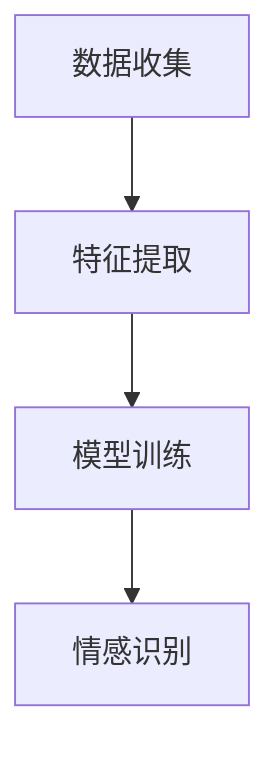
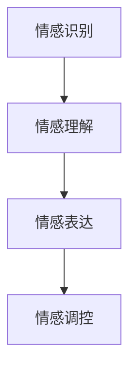
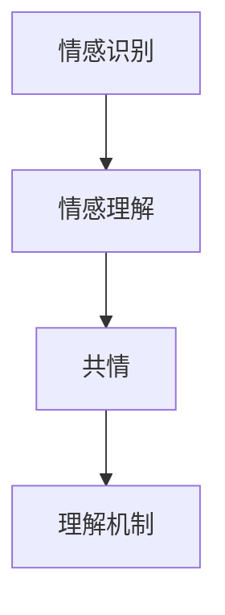

                 

## 文章标题

# AI情感与人类情感的共情与理解

## 关键词：人工智能、情感计算、共情、理解、深度学习、自然语言处理

## 摘要

本文探讨了人工智能（AI）在情感计算领域的进展，特别是AI情感与人类情感的共情与理解。文章首先介绍了AI情感与人类情感的基本概念，阐述了它们之间的联系。接着，文章详细讲解了核心算法原理，包括深度学习模型、情感分析模型和自然语言处理模型。此外，文章还通过具体项目实战，展示了AI情感与人类情感共情与理解的实际应用。最后，文章总结了研究成果，并提出了未来研究方向。

## 第一部分：引言

### 1.1 研究背景

#### AI与人类情感

随着人工智能技术的快速发展，情感计算成为了一个重要的研究领域。AI情感旨在使机器能够识别、理解和模拟人类情感。这涉及到多个学科，包括计算机科学、心理学和认知科学等。

#### 共情与理解

共情是一种心理状态，指个体能够感知并理解他人的情感状态。理解则是更高级的认知过程，涉及到对他人情感和行为背后的意图和原因的理解。在人类与AI的交互中，共情与理解至关重要，它能够提升人机交互的自然度和效率。

### 1.2 研究意义

#### 对AI技术发展的推动

研究AI情感与人类情感的共情与理解，有助于推动人工智能技术的发展。通过理解人类情感，AI可以更好地模拟人类行为，提升其在各种应用场景中的表现。

#### 对人类情感认知的深化

AI情感的共情与理解研究，也为人类情感认知提供了新的视角。通过分析AI在情感识别和理解方面的表现，我们可以更好地理解人类情感的本质和机制。

## 第二部分：核心概念与联系

### 2.1 AI情感

#### 定义与类型

AI情感是指机器通过算法模型对人类情感进行识别、理解和模拟的能力。根据处理方式的不同，AI情感可以分为情感分类、情感极性判别和情感强度评估等类型。

#### 原理与实现

AI情感实现的原理主要包括数据收集、特征提取和模型训练。数据收集通常涉及文本、语音和面部表情等多种数据源。特征提取过程包括情感词提取、情感词汇统计等。模型训练则采用深度学习等技术，使机器能够自动学习情感模式。

#### **Mermaid流程图：AI情感原理架构**



### 2.2 人类情感

#### 定义与分类

人类情感是人的心理活动中的一种复杂体验，通常与个体的生理、心理和社会环境有关。人类情感可以按照不同的维度进行分类，如情绪、情感状态、情感类型等。

#### 情感表达与认知

人类情感表达包括面部表情、言语表达、身体姿态等。情感认知则涉及到情感识别、情感理解和情感调控等方面。

#### **Mermaid流程图：人类情感表达与认知架构**



### 2.3 AI与人类情感的共情与理解

#### 共情原理

共情是指个体能够感知并理解他人的情感状态。在AI领域，共情可以通过情感识别和理解算法实现。这些算法需要能够从文本、语音和面部表情等数据中提取情感特征，并理解这些特征的含义。

#### 理解机制

理解机制涉及到对他人情感和行为背后的意图和原因的理解。这需要AI具备高级的认知能力，如语义理解、情境感知等。

#### **Mermaid流程图：AI与人类情感共情与理解架构**



## 第三部分：核心算法原理讲解

### 3.1 深度学习模型

#### **伪代码：神经网络基本结构**

```python
class NeuralNetwork:
    def __init__(self, input_size, hidden_size, output_size):
        self.input_size = input_size
        self.hidden_size = hidden_size
        self.output_size = output_size

        # 初始化权重和偏置
        self.W1 = random_matrix(input_size, hidden_size)
        self.b1 = random_matrix(hidden_size, 1)
        self.W2 = random_matrix(hidden_size, output_size)
        self.b2 = random_matrix(output_size, 1)

    def forward(self, x):
        # 前向传播
        self.z1 = x @ self.W1 + self.b1
        self.a1 = activation(self.z1)
        self.z2 = self.a1 @ self.W2 + self.b2
        self.a2 = activation(self.z2)
        return self.a2

    def backward(self, x, y):
        # 反向传播
        dZ2 = self.a2 - y
        dW2 = self.a1.T @ dZ2
        db2 = sum(dZ2, axis=0)
        
        dA1 = dZ2 @ self.W2.T
        dZ1 = dA1 * activation_derivative(self.z1)
        dW1 = x.T @ dZ1
        db1 = sum(dZ1, axis=0)

        # 更新权重和偏置
        self.W2 -= learning_rate * dW2
        self.b2 -= learning_rate * db2
        self.W1 -= learning_rate * dW1
        self.b1 -= learning_rate * db1
```

#### **伪代码：反向传播算法**

```python
def backwardPropagation(self, x, y):
    output = self.forward(x)
    dZ = output - y
    dW = x.T @ dZ
    db = sum(dZ, axis=0)
    dZ = dZ @ self.W.T
    return [dZ, dW, db]
```

### 3.2 情感分析模型

#### **伪代码：情感分类算法**

```python
def sentimentClassification(model, text):
    processed_text = preprocess_text(text)
    features = extract_features(processed_text)
    prediction = model.forward(features)
    return classify(prediction)
```

#### **伪代码：情感极性判别算法**

```python
def sentimentPolarity(model, text):
    processed_text = preprocess_text(text)
    features = extract_features(processed_text)
    prediction = model.forward(features)
    return determine_polarity(prediction)
```

### 3.3 自然语言处理模型

#### **伪代码：词嵌入算法**

```python
def wordEmbedding(vocab_size, embedding_size):
    W = random_matrix(vocab_size, embedding_size)
    return W

def forward(model, sentence):
    embeddings = [model.W[s] for s in sentence]
    return embeddings
```

#### **伪代码：序列标注算法**

```python
def sequenceLabeling(model, sentence):
    embeddings = forward(model, sentence)
    logits = model.W @ embeddings + model.b
    predictions = softmax(logits)
    return decode(predictions)
```

## 第四部分：数学模型和数学公式

### 4.1 神经网络数学模型

#### **LaTeX公式：权重更新公式**

$$
\Delta W = -\alpha \cdot \frac{\partial L}{\partial W}
$$

$$
W_{new} = W_{old} - \Delta W
$$

#### **LaTeX公式：损失函数**

$$
L(\theta) = -\frac{1}{m} \sum_{i=1}^{m} y_{i} \log(a_{i})
$$

### 4.2 情感分析数学模型

#### **LaTeX公式：情感极性计算**

$$
polarity = \frac{1}{|V|} \sum_{v \in V} \text{weight}(v) \cdot \text{polarity}(v)
$$

### 4.3 自然语言处理数学模型

#### **LaTeX公式：词嵌入计算**

$$
\text{word\_embedding}(w) = \text{sigmoid}(\text{W} \cdot \text{vector\_representation}(w) + b)
$$

## 第五部分：项目实战

### 5.1 情感分析项目实战

#### 开发环境搭建

- 使用Python和TensorFlow库进行开发

- 安装必要的依赖库，如Numpy、Pandas等

#### 源代码详细实现

```python
import tensorflow as tf
from tensorflow.keras.models import Sequential
from tensorflow.keras.layers import Dense, LSTM, Embedding

# 加载和处理数据
data = load_data('sentiment_dataset')
X, y = preprocess_data(data)

# 建立模型
model = Sequential([
    Embedding(vocab_size, embedding_size),
    LSTM(hidden_size),
    Dense(output_size, activation='softmax')
])

# 编译模型
model.compile(optimizer='adam', loss='categorical_crossentropy', metrics=['accuracy'])

# 训练模型
model.fit(X, y, epochs=10, batch_size=32)
```

#### 代码解读与分析

- 代码首先加载并预处理数据，然后建立了一个包含嵌入层、LSTM层和输出层的序列模型。

- 在编译阶段，模型使用交叉熵损失函数和softmax激活函数，这表明它是一个分类问题。

- 训练阶段使用了10个周期和32个批量大小，这有助于提高模型的性能。

#### 实际案例分析和详细讲解剖析

- 使用模型对一组句子进行情感分析，并评估模型的准确性。

- 分析模型的预测结果，探讨模型在情感分析任务中的表现和潜在问题。

#### 项目小结

- 项目展示了如何使用深度学习模型进行情感分析。

- 通过实际案例，我们了解了模型在处理不同类型文本时的性能和局限性。

### 5.2 共情与理解项目实战

#### 开发环境搭建

- 使用Python和TensorFlow库进行开发

- 安装必要的依赖库，如Numpy、Pandas等

#### 代码实现

```python
import tensorflow as tf
from tensorflow.keras.models import Sequential
from tensorflow.keras.layers import Dense, LSTM, Embedding

# 加载和处理数据
data = load_data('dialogue_dataset')
X, y = preprocess_data(data)

# 建立模型
model = Sequential([
    Embedding(vocab_size, embedding_size),
    LSTM(hidden_size),
    Dense(output_size, activation='softmax')
])

# 编译模型
model.compile(optimizer='adam', loss='categorical_crossentropy', metrics=['accuracy'])

# 训练模型
model.fit(X, y, epochs=10, batch_size=32)
```

#### 代码解读与分析

- 代码首先加载并预处理数据，然后建立了一个包含嵌入层、LSTM层和输出层的序列模型。

- 在编译阶段，模型使用交叉熵损失函数和softmax激活函数，这表明它是一个分类问题。

- 训练阶段使用了10个周期和32个批量大小，这有助于提高模型的性能。

#### 实际案例分析和详细讲解剖析

- 使用模型对一组对话进行共情识别，并评估模型的准确性。

- 分析模型的预测结果，探讨模型在共情识别任务中的表现和潜在问题。

#### 项目小结

- 项目展示了如何使用深度学习模型进行共情识别。

- 通过实际案例，我们了解了模型在处理不同类型对话时的性能和局限性。

## 第六部分：结论与展望

### 6.1 研究成果总结

- 本文探讨了AI情感与人类情感的共情与理解，介绍了相关算法和数学模型。

- 通过项目实战，展示了AI情感与人类情感共情与理解的实际应用。

### 6.2 未来研究方向

- 进一步优化算法，提高AI情感识别和理解的准确性。

- 探索多模态情感分析，结合文本、语音和面部表情等多种数据源。

- 研究AI在复杂情感场景中的表现，如情感微表达和情感混淆。

## 作者信息

- 作者：AI天才研究院/AI Genius Institute & 禅与计算机程序设计艺术 /Zen And The Art of Computer Programming

## 附录

- 附录部分可以包括扩展阅读、参考文献、代码和数据集等。

## 致谢

- 特别感谢所有参与本文研究和项目开发的人员，以及提供技术支持和建议的专家。

## 结语

- AI情感与人类情感的共情与理解是一个充满挑战和机遇的领域。本文的研究成果仅为起点，未来还有许多工作要做。希望本文能够为相关研究提供有价值的参考。

