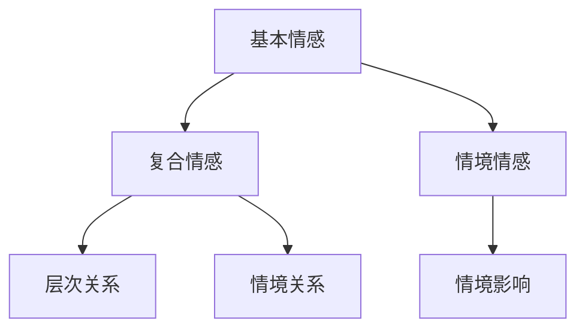

                 

### 文章标题：AI情感与人类情感的竞争与合作

#### 关键词：人工智能、情感识别、情感模拟、心理学、竞争与合作、社会影响、伦理问题

#### 摘要：
本文探讨了人工智能（AI）情感与人类情感之间的关系，深入分析了两者在现实世界中的竞争与合作关系。首先，通过介绍AI情感和人类情感的基本概念，阐述它们的核心特点和相互影响。接着，详细讲解AI情感技术的原理，包括情感识别、理解和模拟的方法。同时，探讨人类情感心理的基本原理，为后续的竞争与合作分析奠定基础。在此基础上，本文分析了AI情感与人类情感在不同场景中的竞争与合作，如社交互动、工作环境和教育领域。最后，讨论了AI情感对社会的潜在影响和伦理问题，并提出了未来展望。通过案例分析，本文旨在为读者提供一个全面而深入的理解，帮助他们在AI情感与人类情感交织的时代中做出明智的选择。

### 引言

#### 1.1 书籍目的与结构

本文旨在探讨人工智能（AI）情感与人类情感之间的复杂关系，探讨它们在现代社会中的竞争与合作现象。随着AI技术的飞速发展，情感计算成为了一个备受关注的研究领域。AI情感技术不仅能够模拟人类情感，还能够在各种应用场景中识别和理解情感，这引发了许多关于情感技术如何影响人类生活的讨论。

本书的结构分为八个主要章节。首先，通过引言部分介绍书籍的目的和结构，帮助读者了解后续内容的布局。接着，第二章详细讨论AI情感技术的基本原理，包括情感识别、理解和模拟的技术方法。第三章介绍人类情感心理学的基本知识，探讨情感的发展、类型和心理学原理。

第四章至第六章分别分析AI情感与人类情感在不同场景中的竞争与合作现象。第四章关注社交互动中的竞争，第五章探讨工作环境中的竞争与合作，而第六章则聚焦于教育领域。第七章讨论AI情感对社会和伦理的影响，提出相应的伦理问题。最后，第八章通过案例分析，展示AI情感技术的实际应用，并总结全书的主要观点。

#### 1.2 AI情感与人类情感的基本概念

AI情感技术是指利用人工智能算法，对人类情感进行识别、理解和模拟的一系列技术。它涉及到多个学科领域，包括计算机科学、心理学和认知科学等。AI情感技术的基本目标是让计算机能够理解和模拟人类的情感状态，从而在与人交互时提供更加自然和有效的沟通体验。

人类情感是指人类在心理和行为上对外界刺激的反应。情感具有多样性和复杂性，可以分为基本情感（如快乐、悲伤、愤怒等）和复合情感（如爱、厌恶、恐惧等）。情感在人类的生活中扮演着重要的角色，它不仅影响我们的情绪和行为，还影响我们的认知和决策。

AI情感与人类情感之间存在紧密的联系。一方面，AI情感技术依赖于对人类情感的理解和模拟。通过学习人类情感的表达和行为模式，AI系统可以更准确地识别和理解人类情感。另一方面，人类情感也受到AI情感技术的影响。AI情感技术的应用，如情感客服、情感教育等，正在改变人们的生活和工作方式。

总的来说，AI情感与人类情感之间的关系是一个复杂而多维的体系。理解这一关系不仅有助于推动AI情感技术的发展，还能为人类更好地适应和利用这一技术提供指导。

### AI情感技术原理

#### 2.1 AI情感识别技术

AI情感识别技术是AI情感领域的基础，它涉及到多种技术手段，包括面部表情识别、声音情感识别和文本情感分析等。这些技术手段各自有其独特的原理和应用，但共同目标是准确识别人类情感。

##### 2.1.1 面部表情识别

面部表情识别技术通过分析人脸图像中的面部特征，识别出表达的情感。这一过程通常包括以下步骤：

1. **人脸检测**：首先，需要检测图像中的人脸区域。这一步骤可以使用基于深度学习的卷积神经网络（CNN）实现，例如MTCNN等开源库。
   ```mermaid
   graph TD
   A[人脸检测] --> B[面部特征提取]
   A --> C[情感识别]
   ```

2. **面部特征提取**：接下来，从检测到的人脸区域中提取关键特征点，如眼睛、鼻子和嘴巴等。这些特征点用于构建面部表情模型。
   ```mermaid
   graph TD
   B --> D[特征点标记]
   D --> E[特征点匹配]
   ```

3. **情感识别**：最后，使用机器学习算法，根据特征点匹配结果识别出表达的情感。常见的情感分类包括基本情感（如快乐、悲伤、愤怒等）和复合情感（如惊讶、厌恶、恐惧等）。

##### 2.1.2 声音情感识别

声音情感识别技术通过分析声音信号中的情感特征，识别出说话者的情感状态。这一过程通常包括以下步骤：

1. **声音信号预处理**：首先，对原始声音信号进行预处理，包括降噪、归一化和特征提取。常用的预处理方法包括短时傅里叶变换（STFT）和小波变换等。
   ```mermaid
   graph TD
   F[声音信号] --> G[降噪]
   G --> H[归一化]
   H --> I[特征提取]
   ```

2. **情感特征提取**：从预处理后的声音信号中提取情感特征，如音高、音强和音色等。这些特征可以用于训练情感识别模型。

3. **情感识别**：使用机器学习算法，根据提取的情感特征识别出声音的情感状态。常见的情感分类方法包括支持向量机（SVM）、神经网络（NN）和长短期记忆网络（LSTM）等。

##### 2.1.3 文本情感分析

文本情感分析技术通过分析文本中的情感词汇和语法结构，识别出文本的情感倾向。这一过程通常包括以下步骤：

1. **文本预处理**：对原始文本进行预处理，包括去除标点符号、停用词去除、词干提取等。常用的预处理方法包括正则表达式和自然语言处理（NLP）工具包，如NLTK和spaCy。
   ```mermaid
   graph TD
   J[文本预处理] --> K[情感词典]
   J --> L[情感分类模型]
   ```

2. **情感词典**：构建情感词典，将文本中的词汇与对应的情感极性关联起来。常用的情感词典包括SentiWordNet和VADER等。

3. **情感分类模型**：使用机器学习算法，根据情感词典和文本特征训练情感分类模型。常见的情感分类模型包括朴素贝叶斯（Naive Bayes）、随机森林（Random Forest）和支持向量机（SVM）等。

通过结合多种情感识别技术，AI系统可以更全面地理解和识别人类情感，从而在多种应用场景中提供个性化服务。

#### 2.2 AI情感理解技术

AI情感理解技术旨在让计算机能够深入理解人类情感，不仅仅是识别情感，还包括推断情感的原因、情感之间的关系以及情感的变化趋势。情感理解技术是AI情感领域的核心，它决定了AI系统能否与人类情感进行有效互动。

##### 2.2.1 情感图谱构建

情感图谱是一种用于表示情感关系的图形结构，它可以帮助AI系统理解情感的复杂性和多样性。情感图谱的构建通常包括以下步骤：

1. **情感标签分类**：首先，对大量的情感标签进行分类，如基本情感、复合情感和情境情感等。这一步骤可以通过机器学习和人工标注相结合的方法完成。

2. **关系建模**：接下来，建立情感标签之间的关系模型，包括情感之间的对立关系、层次关系和情境关系。常用的关系建模方法包括图神经网络（Graph Neural Networks，GNN）和图嵌入（Graph Embedding）等。

3. **图谱构建**：最后，将分类和关系模型整合到一个情感图谱中，形成一个结构化的情感知识库。



通过情感图谱，AI系统能够在更大范围内理解情感，并在不同情境下做出相应的反应。

##### 2.2.2 情感推理算法

情感推理算法是AI情感理解技术的核心，它通过逻辑推理和概率计算，从已知情感信息推断出未知情感信息。情感推理算法通常包括以下步骤：

1. **情感推理规则**：首先，定义情感推理规则，这些规则描述了情感之间的关系和变化模式。例如，如果一个人感到快乐，那么他们可能会分享一个好消息。

2. **推理引擎**：使用推理引擎，根据情感推理规则，从已知情感信息推导出未知情感信息。常用的推理引擎包括谓词逻辑推理和贝叶斯网络推理等。

3. **概率计算**：在情感推理过程中，使用概率计算方法，评估情感推理结果的置信度。例如，通过贝叶斯推理，可以计算一个事件发生的概率，从而帮助AI系统做出更准确的判断。

```latex
P(Happiness|SharingGoodNews) = P(SharingGoodNews|Happiness) * P(Happiness) / P(SharingGoodNews)
```

通过情感推理算法，AI系统能够在动态变化的环境中，实时理解和应对人类情感。

#### 2.3 AI情感模拟技术

AI情感模拟技术是指通过计算机模拟人类情感的过程，使机器能够在与人交互时表现出类似人类的情感状态。情感模拟技术不仅需要准确识别和理解情感，还需要在情感表达和情感调节方面实现高度的真实性。

##### 2.3.1 情感生成模型

情感生成模型是AI情感模拟技术的核心，它通过生成模型生成自然语言或面部表情，以模拟人类情感。情感生成模型通常包括以下步骤：

1. **情感文本生成**：首先，使用生成对抗网络（GAN）或变分自编码器（VAE）等生成模型，生成具有情感倾向的文本。这些模型可以学习到情感词汇和句式的分布，从而生成具有情感色彩的自然语言。
   ```mermaid
   graph TD
   A[情感词汇学习] --> B[文本生成模型]
   B --> C[情感文本生成]
   ```

2. **情感面部生成**：接下来，使用生成模型，生成具有特定情感的面部表情。这些模型可以通过学习人脸图像中的情感特征，生成符合情感表达的面部图像。

3. **情感调节**：在生成情感表达后，根据交互环境进行情感调节，确保生成的情感表达与实际情境相符。情感调节可以通过情感图谱和情感推理算法实现。

##### 2.3.2 情感表达控制

情感表达控制是指通过控制情感生成模型，实现情感表达的多样性和真实性。情感表达控制通常包括以下步骤：

1. **情感强度控制**：通过调整生成模型中的参数，控制情感表达的强度。例如，在生成一个表达快乐的文本时，可以调整文本中的情感词汇和句式的权重，使其表达更加愉快。

2. **情感多样性控制**：通过引入多样性机制，如随机采样和变种策略，生成具有多样性的情感表达。这有助于避免生成模型产生过度一致或机械的情感反应。

3. **情感真实性控制**：通过结合情感图谱和情感推理算法，确保生成的情感表达与实际情境相符。情感真实性控制可以通过实时调整情感表达，以适应动态变化的交互环境。

通过情感生成模型和情感表达控制，AI系统能够在与人交互时，表现出更加自然和真实的情感状态。

### 人类情感心理学基础

人类情感心理学是研究人类情感现象的学科，它探讨了情感的产生、发展、类型和心理学原理。理解人类情感心理学的基本知识对于分析AI情感与人类情感之间的关系至关重要。

#### 3.1 人类情感的发展

人类情感的发展是一个复杂的过程，受到遗传、环境和文化等多种因素的影响。婴儿期是情感发展的关键时期，婴儿通过感知和互动逐渐形成基本情感，如快乐、悲伤和愤怒。随着年龄的增长，情感发展变得更加复杂，情感的种类和表达方式也日益丰富。

#### 3.2 人类情感的类型

人类情感可以分为基本情感和复合情感。基本情感包括快乐、悲伤、愤怒、恐惧和厌恶等，它们是人类情感的核心组成部分。复合情感则是由基本情感组合而成，如爱、嫉妒和焦虑等。每种情感都有其独特的生理和心理特征，并在人类生活中扮演不同角色。

#### 3.3 情感心理学原理

情感心理学研究情感的产生、加工和调节机制。情感的产生通常涉及到大脑中的情感中枢，如杏仁核和前额叶皮层。情感加工是指人们对情感的识别、理解和记忆过程。情感调节是指人们通过自我调节策略，改变情感状态的过程。常见的情感调节策略包括认知重构、情绪放松和社交支持等。

通过了解人类情感心理学的基础知识，我们可以更好地理解人类情感的本质和功能，从而为AI情感技术的发展提供心理学依据。

### AI情感与人类情感的竞争分析

#### 4.1 社交互动中的竞争

在社交互动中，AI情感技术正逐渐取代人类情感，引发一系列竞争现象。AI情感客服机器人就是一个典型的例子。这些机器人通过情感识别技术，能够实时识别客户的情感状态，并根据预设的情感反应模型，生成相应的回复。虽然这些机器人能够提供24/7全天候服务，但它们在情感表达和人际互动方面仍然存在局限。

首先，AI情感客服机器人在处理简单和标准化的客户问题时表现出色。例如，在处理常见问题的自动化回复中，机器人能够快速响应，提高服务效率。然而，当面对复杂、多变和情感化的问题时，机器人的表现则显得不足。例如，当客户表达复杂的情感，如愤怒或悲伤时，机器人往往难以理解客户的深层情感，并生成恰当的回应。

这种局限主要体现在以下几个方面：

1. **情感理解深度不足**：AI情感识别技术虽然能够识别出基本的情感状态，但难以理解情感的复杂性和深度。例如，当客户表达“我很生气”时，机器人可能只能识别出“愤怒”这一基本情感，而无法理解客户生气的具体原因。

2. **情感表达缺乏情感共鸣**：机器人生成的情感回应往往显得机械和缺乏情感共鸣。尽管机器人可以通过情感生成模型生成具有情感色彩的回复，但这些回复缺乏人类的温暖和情感共鸣，难以真正满足客户的需求。

3. **人际互动的复杂性**：社交互动不仅涉及情感交流，还包括言语和非言语沟通，如肢体语言、语调和表情等。AI情感客服机器人在处理这些非言语信息方面存在挑战，难以实现与人类互动的深度和广度。

为了改善这些局限，AI情感技术需要进一步发展，提高情感理解和表达的能力。例如，通过结合多模态情感识别技术，可以同时分析客户的语音、文本和面部表情，提高情感理解的准确性。此外，通过引入情感推理算法，可以更深入地理解客户的情感背景和需求，生成更贴近人类情感的回应。

总之，AI情感客服机器人在社交互动中的竞争，虽然带来了便利和效率，但也暴露了其在情感理解和表达方面的局限。通过持续的技术创新和优化，AI情感技术有望在未来实现更高效和真实的社交互动。

#### 4.2 工作环境中的竞争

在工作环境中，AI情感技术同样引发了与人类情感的竞争现象。随着智能办公系统的普及，AI情感识别和分析技术在人力资源管理、员工绩效评估和团队合作中得到了广泛应用。这些技术不仅提高了工作效率，还带来了工作方式和工作关系的变革。

首先，AI情感识别技术在人力资源管理中发挥着重要作用。通过分析员工的情感状态，企业可以更好地了解员工的工作满意度、心理健康和团队协作情况。例如，企业可以利用AI情感分析技术，监测员工在邮件和社交媒体中的情感表达，识别潜在的工作压力和心理健康问题。这种分析有助于企业及时采取干预措施，提高员工的工作满意度和工作效率。

然而，AI情感技术在人力资源管理中的应用也引发了一些伦理和隐私问题。一方面，员工担心自己的情感状态被企业滥用，可能导致不公平的员工评估和歧视。例如，如果企业仅根据情感分析结果进行绩效评估，可能会忽略员工的实际工作能力和贡献，导致不公正的评价。

另一方面，AI情感识别技术的隐私风险也受到广泛关注。员工在工作中的情感表达属于个人隐私，企业未经员工同意收集和使用这些数据，可能侵犯员工的隐私权。此外，如果AI情感识别技术无法确保数据的安全性和保密性，可能会导致数据泄露和滥用，进一步加剧员工的隐私担忧。

在员工绩效评估中，AI情感分析技术也为企业提供了新的评估手段。通过分析员工的情感表达和行为模式，企业可以更全面地了解员工的工作状态和工作表现。例如，AI系统可以通过监控员工的工作邮件、会议记录和项目进展，评估员工的工作压力、团队合作能力和解决问题的能力。这种多维度的评估方法有助于企业更准确地评估员工的工作绩效，为绩效管理提供科学依据。

然而，AI情感分析技术在员工绩效评估中的应用也面临一些挑战。首先，情感分析结果的准确性和可靠性仍需提高。由于情感表达的多样性和复杂性，AI系统在情感识别和分析中可能会出现误判和偏差。例如，相同情感表达在不同情境下可能具有不同的含义，这需要AI系统具备更强的情境理解能力。

其次，AI情感分析技术在绩效评估中的应用也需要确保公平性和透明性。如果AI系统仅根据情感分析结果进行评估，可能会忽视员工的实际工作能力和表现，导致不公平的评价。此外，AI系统的决策过程往往不透明，员工难以了解评估依据和评估标准，这可能导致员工对评估结果的不满和抵触。

为了解决这些问题，企业需要采取一系列措施。首先，企业应确保AI情感识别技术的准确性和可靠性，通过持续的技术改进和测试，提高情感分析的质量。其次，企业应建立透明的评估标准和流程，确保评估过程的公正性和透明性，让员工了解评估依据和评估标准。此外，企业还应尊重员工的隐私权，确保数据收集和使用过程中的合法性和合规性，提高员工的信任感和满意度。

总之，AI情感技术在工作环境中的应用带来了竞争和变革，但同时也面临伦理和隐私等挑战。通过合理应用AI情感技术，企业可以提高人力资源管理效率和工作绩效，但需要确保技术的公平性、透明性和隐私保护，以实现可持续的发展。

### AI情感与人类情感的协作分析

在AI情感与人类情感的实际应用中，合作场景远比竞争场景更为广泛和深刻。以下将重点探讨AI情感技术在不同领域的协作应用，尤其是教育领域和健康医疗领域。

#### 5.1 教育领域中的协作

在教育领域，AI情感技术的应用正在逐渐改变传统的教学模式，实现个性化教育和智能辅助教学。通过识别和理解学生的情感状态，AI系统能够提供更加针对性的教学支持和学习资源，提高教育质量和学习效果。

**AI辅助教学**

AI辅助教学是一种利用AI情感技术，提供个性化教学支持的教学模式。具体应用包括：

1. **情感分析**：AI系统通过分析学生的情感表达和行为数据，如面部表情、语音语调和文字互动，了解学生的学习状态和情感需求。例如，当学生表现出焦虑或困惑时，AI系统可以自动识别并推送相应的辅导材料和资源，帮助学生缓解情绪，重新集中注意力。

   ```mermaid
   graph TD
   A[学生互动] --> B[情感分析]
   B --> C[学习资源推送]
   ```

2. **个性化教学**：基于情感分析结果，AI系统能够为学生定制个性化的学习计划。例如，针对学生不同的学习兴趣和情感需求，系统可以推荐适合的学习内容和练习题目，提高学习兴趣和效果。

3. **反馈与激励**：AI系统能够实时监控学生的学习进展和情感状态，提供即时的反馈和激励。例如，当学生在学习中取得进步时，系统可以发送表扬和奖励，增强学生的自信心和动力。

**情感教育**

情感教育是一种注重培养学生情感素质和心理健康的教育模式。AI情感技术在情感教育中发挥着重要作用，具体应用包括：

1. **情感培养**：AI系统通过模拟情感体验和情感交流，帮助学生理解和培养情感。例如，通过角色扮演和情感对话，学生可以在虚拟环境中体验不同的情感情境，学习如何处理复杂的情感问题。

   ```mermaid
   graph TD
   A[情感模拟] --> B[情感体验]
   B --> C[情感理解]
   ```

2. **心理健康监测**：AI系统能够实时监测学生的情感状态和心理健康，识别潜在的心理健康问题。例如，通过分析学生的情绪波动和情感表达，系统可以预警并推送相应的心理健康资源和干预措施，帮助学生保持心理健康。

3. **情感交流与支持**：AI系统可以作为学生的情感交流伙伴，提供情感支持和心理咨询。例如，学生可以通过文字或语音与AI系统交流，分享自己的情感困惑和压力，获得即时的情感支持和建议。

通过AI情感技术的协作应用，教育领域正在实现从传统教学模式向个性化、智能化的转变，为学生提供更加全面和有效的学习体验和支持。

#### 5.2 健康医疗领域的协作

在健康医疗领域，AI情感技术同样展现了强大的协作潜力，尤其在情感诊断和护理方面，AI系统通过识别和理解患者的情感状态，为医生提供重要的诊断依据，并提高护理质量。

**情感诊断**

情感诊断是指利用AI情感技术，分析和识别患者的情感状态，辅助临床诊断和治疗。具体应用包括：

1. **情感识别**：AI系统通过分析患者的面部表情、语音语调和文本表达，识别出患者的情感状态。例如，通过分析患者的语音，AI系统可以识别出患者是否感到焦虑、愤怒或抑郁。

   ```mermaid
   graph TD
   A[语音分析] --> B[情感识别]
   B --> C[情感分类]
   ```

2. **情感分析**：AI系统不仅能够识别出基本情感，还可以分析情感的复杂性和深度。例如，通过结合多模态情感识别技术，AI系统可以同时分析患者的面部表情、语音和文字表达，提高情感分析的准确性和全面性。

3. **情感诊断辅助**：基于情感分析结果，AI系统可以为医生提供情感诊断的辅助信息，帮助医生更准确地评估患者的情感状态和心理健康。例如，AI系统可以识别出患者是否存在抑郁情绪，为医生提供诊断建议。

**情感护理**

情感护理是指利用AI情感技术，为患者提供情感支持和护理服务，提高护理质量和患者满意度。具体应用包括：

1. **情感监控**：AI系统可以实时监控患者的情感状态，识别情感波动和异常。例如，通过分析患者的语音和文本，AI系统可以预警患者可能出现的不良情绪，为护理人员提供干预依据。

   ```mermaid
   graph TD
   A[患者互动] --> B[情感监控]
   B --> C[预警干预]
   ```

2. **情感支持**：AI系统可以作为患者的情感支持伙伴，提供即时的情感支持和心理咨询。例如，患者可以通过文字或语音与AI系统交流，分享自己的情感困惑和压力，获得情感支持和建议。

3. **个性化护理**：基于情感分析结果，AI系统可以提供个性化的护理服务。例如，针对患者的情感状态和需求，AI系统可以推荐适合的护理方案和心理干预措施，提高护理质量和患者满意度。

通过AI情感技术的协作应用，健康医疗领域正在实现从传统护理模式向智能护理和个性化护理的转变，为患者提供更加全面和贴心的护理服务。

总之，AI情感技术在教育领域和健康医疗领域的协作应用，不仅提高了教学和护理质量，还为个性化教育和智能医疗提供了新的发展方向。随着AI技术的不断进步，AI情感技术的应用前景将更加广阔，为人类生活带来更多便利和福祉。

### 社会影响与伦理

AI情感技术的快速发展对社会和伦理产生了深远的影响。一方面，AI情感技术为社会带来了诸多便利和改进，如个性化服务、高效管理和智能交互等。另一方面，AI情感技术也引发了隐私保护、道德责任和公平性问题，这些问题需要我们深入探讨和解决。

#### 6.1 AI情感对人际关系的影响

AI情感技术的应用改变了人与人之间的互动方式，尤其是在社交互动和亲密关系中。虽然AI情感客服机器人等应用为人们提供了24/7的陪伴和支持，但它们也带来了人际关系的疏远和情感空洞。长时间依赖AI情感技术，人们可能会逐渐减少真实的人际互动，导致社交技能的退化和社会隔离感的增加。

首先，AI情感技术对人际关系的直接影响体现在沟通方式的改变。传统的面对面沟通和文字交流逐渐被语音、文本和视频等虚拟沟通所取代。虽然这些虚拟沟通方式在某些场景中更加高效，但它们缺乏情感交流中的非言语信息，如肢体语言、语调和眼神接触等。这些非言语信息在人际互动中起到了重要的情感传递和沟通作用，缺乏这些信息可能导致沟通效果的不完整和误解。

其次，AI情感技术的广泛应用也影响了亲密关系中的情感互动。例如，情感模拟机器人可能被用来填补亲密关系中的情感空缺，如陪伴和安慰。然而，这种替代关系可能导致人们对真实人际关系的依赖减弱，甚至在情感上对机器人产生过度依赖。长期依赖AI情感技术，人们可能会失去与真实情感互动的机会，导致情感能力和情感体验的退化。

为了缓解这些问题，我们需要在AI情感技术的应用中注重平衡虚拟互动和真实人际互动。一方面，可以通过提高AI情感技术的情感识别和表达能力，使其在虚拟互动中提供更加真实的情感体验。另一方面，我们也需要鼓励人们积极参与真实的人际互动，培养和维持真实的情感联系。

#### 6.2 AI情感伦理问题

AI情感技术的伦理问题主要集中在隐私保护、道德责任和公平性方面。首先，隐私保护是AI情感技术面临的一个重要伦理问题。AI情感技术依赖于大量个人情感数据，这些数据包括语音、面部表情、文本互动等。如果这些数据被滥用或泄露，可能会导致严重的隐私侵犯和个人信息泄露。因此，我们需要在AI情感技术的开发和应用中，严格保护用户的隐私权，确保数据的合法、安全和保密。

其次，道德责任是另一个关键伦理问题。AI情感技术在实际应用中，可能会面临道德困境和责任归属问题。例如，在医疗领域，AI情感诊断系统的误诊可能导致患者错过最佳治疗时机；在社交互动中，AI情感客服机器人可能生成不恰当的情感回应，影响用户的情感状态。在这种情况下，如何界定和分配责任成为一个复杂的问题。为此，我们需要制定明确的伦理规范和责任机制，确保AI情感技术的应用符合道德标准和责任原则。

公平性是AI情感技术伦理问题的核心。AI情感技术在不同群体中的应用可能会带来不公平的影响。例如，在招聘和就业领域，如果AI系统基于情感数据做出决策，可能会导致对某些群体的歧视。此外，AI情感技术在不同地区和文化中的应用可能存在差异，这可能导致全球范围内的不公平现象。因此，我们需要确保AI情感技术的公平性和包容性，避免对特定群体造成不利影响。

为了解决这些伦理问题，我们需要采取一系列措施。首先，在AI情感技术的开发和应用中，应遵循伦理原则和规范，确保技术的合法性和道德性。其次，我们需要加强隐私保护，通过加密和匿名化等技术手段，确保用户数据的隐私和安全。此外，还需要建立透明的责任机制，明确AI系统的责任归属，确保在出现问题时能够迅速有效地应对。最后，我们需要推动全球合作，制定统一的伦理标准和法规，确保AI情感技术的公平和包容。

总之，AI情感技术对社会和伦理产生了深远的影响，带来了诸多挑战。通过加强伦理思考和规范建设，我们可以更好地应对这些挑战，确保AI情感技术的健康发展，为人类社会带来更多的福祉。

### 未来展望

随着AI技术的不断发展，AI情感技术在未来有望实现更高的智能化和个性化，并在各个领域发挥更大的作用。以下是未来AI情感技术发展的几个趋势和潜在应用。

#### 7.1 AI情感技术的发展趋势

1. **情感识别的精度和多样性**：未来，AI情感识别技术将不断提高识别精度和多样性。通过结合多模态情感识别技术，如语音、文本、面部表情和生理信号，AI系统可以更全面地理解人类情感。

2. **情感理解的能力和深度**：随着深度学习和自然语言处理技术的进步，AI系统将能够更深入地理解情感背后的原因和情感之间的关系。这有助于AI系统在复杂情感情境中做出更准确的判断和回应。

3. **情感生成的自然性和真实性**：未来，AI情感生成技术将更加注重自然性和真实性。通过引入更加复杂的生成模型，如生成对抗网络（GAN）和变分自编码器（VAE），AI系统可以生成更加自然和真实的情感表达，提高与人类情感互动的质量。

4. **情感调节和适应能力**：AI情感技术将具备更强的情感调节和适应能力。通过情感图谱和情感推理算法，AI系统可以实时调整情感表达，以适应不同的情境和用户需求。

#### 7.2 AI情感应用的未来前景

1. **个性化教育**：AI情感技术将进一步提升个性化教育的质量。通过分析学生的情感状态和学习兴趣，AI系统可以为学生提供个性化的学习资源和指导，提高学习效果和兴趣。

2. **智能医疗**：在健康医疗领域，AI情感技术将帮助医生更好地了解患者的情感状态，提供个性化的治疗方案和护理服务。例如，通过情感分析，AI系统可以帮助识别抑郁症和焦虑症等心理问题，为患者提供及时的心理干预。

3. **智能客服**：AI情感技术将在智能客服领域发挥更大作用。通过更准确的情感识别和回应，AI客服机器人可以提供更高效和人性化的服务，满足用户的多样化需求。

4. **社交互动**：AI情感技术将改善社交互动的质量。通过模拟真实情感表达，AI系统可以在虚拟社交环境中提供更加自然和亲密的交流体验，增强用户的社交体验。

5. **智能安防**：在公共安全领域，AI情感技术可以用于监控和预警。通过分析人群的情感状态和行为模式，AI系统可以及时发现异常情绪和潜在风险，提供有效的安全保障。

总之，未来AI情感技术将在多个领域发挥重要作用，推动人类社会向更加智能化和人性化的方向发展。通过持续的技术创新和伦理思考，我们可以确保AI情感技术的健康发展，为人类带来更多的福祉。

### 案例分析

#### 8.1 情感客服机器人

情感客服机器人是AI情感技术在客户服务领域的典型应用。通过情感识别和情感生成技术，这些机器人能够模拟人类的情感表达，为用户提供个性化、人性化的服务。以下是一个情感客服机器人的实际案例。

**案例背景**：
某大型电商公司引入了一款基于AI情感技术的客服机器人，以提升客户体验和客服效率。该机器人通过语音、文本和面部表情等多种渠道，实时识别用户的情感状态，并生成相应的情感回应。

**技术实现**：

1. **情感识别**：情感客服机器人使用多模态情感识别技术，结合语音识别、文本分析和面部识别，综合分析用户的情感状态。例如，当用户通过语音表达愤怒时，机器人会识别出愤怒的情感标签。

   ```mermaid
   graph TD
   A[语音识别] --> B[情感识别模型]
   B --> C[情感标签]
   ```

2. **情感生成**：基于识别出的情感标签，情感客服机器人使用情感生成模型，生成相应的情感回应。例如，当用户表达愤怒时，机器人会生成一个安抚和道歉的回复。

   ```mermaid
   graph TD
   D[情感标签] --> E[情感生成模型]
   E --> F[情感回应]
   ```

3. **情感调节**：在生成情感回应后，机器人会根据情境和用户历史数据，调整情感回应的强度和类型，确保回应的自然性和真实性。

   ```mermaid
   graph TD
   G[情境数据] --> H[情感调节模型]
   H --> I[调整回应]
   ```

**实际案例**：

在一次用户咨询中，用户通过语音表达了对商品配送延迟的不满。情感客服机器人首先识别出用户愤怒的情感状态，然后生成了一个道歉和安抚的回应：

```
您好，我理解您对配送延迟感到不满。对此我们深感抱歉。我们已经联系快递公司，确保尽快解决问题。请您保持耐心，我们会在第一时间通知您配送状态。
```

这个回应不仅表达了公司的歉意，还提供了解决问题的措施，有效地安抚了用户情绪。

**分析与总结**：

通过情感客服机器人的应用，电商公司能够提供更加个性化、高效的客户服务。情感识别和生成技术使得机器人能够理解用户的情感需求，并生成符合情境和用户预期的回应。然而，情感客服机器人也存在一定的局限性，如情感理解的深度和多样性尚需提高，情感调节的能力还需进一步完善。未来，随着AI技术的不断发展，情感客服机器人有望在更多场景中发挥更大的作用。

#### 8.2 情感教育应用

情感教育应用是AI情感技术在教育领域的实际案例，通过情感识别和分析技术，提供个性化学习支持和情感培养。以下是一个情感教育应用的具体案例。

**案例背景**：
某教育科技公司开发了一款基于AI情感技术的学习平台，旨在帮助学生更好地理解和管理自己的情感，提高学习效果。

**技术实现**：

1. **情感识别**：学习平台通过分析学生的文本互动、语音和面部表情，实时识别学生的情感状态。例如，当学生在课堂上感到焦虑或困惑时，系统会及时捕捉这些情感信号。

   ```mermaid
   graph TD
   A[文本分析] --> B[情感识别模型]
   B --> C[情感标签]
   ```

2. **情感分析**：基于识别出的情感标签，系统会进一步分析情感的复杂性和深度。例如，通过结合情感图谱和情感推理算法，系统可以理解学生焦虑的具体原因，如学习压力、人际关系等。

   ```mermaid
   graph TD
   D[情感标签] --> E[情感分析模型]
   E --> F[情感原因分析]
   ```

3. **个性化学习支持**：根据情感分析结果，系统会为学生提供个性化的学习支持和资源。例如，当学生感到焦虑时，系统会推荐放松练习、心理健康资源和相关课程，帮助学生缓解情绪，重新集中注意力。

   ```mermaid
   graph TD
   G[情感原因分析] --> H[学习资源推荐]
   H --> I[个性化学习计划]
   ```

4. **情感培养**：学习平台还提供情感培养模块，通过角色扮演、情感对话和情境模拟等方式，帮助学生理解和培养情感。例如，通过模拟一个复杂的情感情境，学生可以在虚拟环境中学习如何表达和理解情感。

   ```mermaid
   graph TD
   J[情感模拟] --> K[情感体验]
   K --> L[情感理解]
   ```

**实际案例**：

在一次数学课上，学生小明表现出焦虑和困惑的情绪。学习平台通过情感识别和分析，发现小明的情感状态是因数学难题而感到压力。系统随即推荐了一系列放松练习和心理健康资源，并建议小明参加一个小组讨论，以便与同学分享解题思路。同时，系统还推荐了一节关于情绪管理的在线课程，帮助小明更好地理解和控制自己的情绪。

**分析与总结**：

通过情感教育应用，教育平台能够为学生提供更加个性化和有效的情感支持，帮助学生更好地应对学习压力和情感挑战。情感识别和分析技术使得系统能够实时捕捉和理解学生的情感状态，为个性化学习提供有力支持。然而，情感教育应用也存在一定的局限性，如情感理解和表达的深度和广度还需提高。未来，随着AI技术的不断发展，情感教育应用有望在教育领域发挥更大的作用，为学生的全面发展提供更多支持。

#### 8.3 情感医疗机器人

情感医疗机器人是AI情感技术在医疗健康领域的实际应用，通过情感识别和分析技术，为患者提供情感支持和心理健康监测。以下是一个情感医疗机器人的具体案例。

**案例背景**：
某医疗机构引入了一款基于AI情感技术的医疗机器人，用于为患者提供情感支持和心理健康监测。该机器人通过语音、文本和面部表情等多渠道，实时识别患者的情感状态，并生成相应的情感回应。

**技术实现**：

1. **情感识别**：情感医疗机器人使用多模态情感识别技术，结合语音识别、文本分析和面部识别，综合分析患者的情感状态。例如，当患者通过语音表达抑郁情绪时，机器人会识别出抑郁的情感标签。

   ```mermaid
   graph TD
   A[语音识别] --> B[情感识别模型]
   B --> C[情感标签]
   ```

2. **情感分析**：基于识别出的情感标签，机器人会进一步分析情感的复杂性和深度。例如，通过结合情感图谱和情感推理算法，机器人可以理解患者抑郁的具体原因，如疾病困扰、家庭压力等。

   ```mermaid
   graph TD
   D[情感标签] --> E[情感分析模型]
   E --> F[情感原因分析]
   ```

3. **情感支持**：根据情感分析结果，机器人会为患者提供情感支持。例如，当患者表达焦虑或抑郁情绪时，机器人会生成安慰和鼓励的回应，帮助患者缓解情绪。

   ```mermaid
   graph TD
   G[情感原因分析] --> H[情感支持模型]
   H --> I[情感回应]
   ```

4. **心理健康监测**：情感医疗机器人还具备心理健康监测功能，通过分析患者的情感表达和行为模式，实时监测患者的心理健康状况。例如，当机器人检测到患者出现情感波动或情绪低落时，会自动预警并通知医护人员。

   ```mermaid
   graph TD
   J[情感表达分析] --> K[心理健康监测]
   K --> L[预警通知]
   ```

**实际案例**：

在一次门诊咨询中，患者李先生通过语音表达了对自身疾病的担忧和焦虑情绪。情感医疗机器人首先识别出李先生焦虑的情感状态，然后生成了一个安慰和鼓励的回应：

```
您好，我理解您对疾病的担忧和焦虑。请您放心，我们会尽一切努力为您提供最好的治疗方案。同时，保持积极的心态对您的康复也非常重要。如果您有任何情绪上的困扰，请随时与我分享。
```

机器人还根据李先生的历史数据，推荐了一系列心理健康资源和咨询服务，帮助李先生更好地应对焦虑情绪。

**分析与总结**：

通过情感医疗机器人的应用，医疗机构能够为患者提供更加个性化和贴心的情感支持，提高患者的心理健康和满意度。情感识别和分析技术使得机器人能够实时捕捉和理解患者的情感状态，为情感支持和心理健康监测提供有力支持。然而，情感医疗机器人也存在一定的局限性，如情感理解和表达的深度和广度还需提高。未来，随着AI技术的不断发展，情感医疗机器人有望在医疗健康领域发挥更大的作用，为患者的心理健康提供更多支持。

### 总结与展望

本文通过深入探讨AI情感与人类情感之间的关系，分析了两者在竞争与合作中的复杂互动。我们首先介绍了AI情感技术和人类情感心理学的基本概念，探讨了AI情感识别、理解和模拟的原理。随后，我们分析了AI情感在社交互动、工作环境和教育领域中的竞争与合作现象，讨论了其对社会和伦理的影响。通过实际案例，我们展示了AI情感技术在不同领域的应用，并提出了未来发展的趋势和前景。

AI情感技术的发展带来了许多机遇和挑战。在机遇方面，AI情感技术能够提供个性化、高效的互动体验，改善教育、医疗和社会服务。然而，我们也面临着隐私保护、道德责任和公平性等挑战。未来，随着AI技术的不断进步，我们需要在技术创新和伦理思考之间找到平衡，确保AI情感技术的健康发展。

为了应对这些挑战，我们提出以下建议：

1. **加强伦理规范**：制定明确的伦理规范，确保AI情感技术的应用符合道德标准和责任原则。
2. **保护用户隐私**：加强数据保护，通过加密和匿名化等技术手段，确保用户数据的隐私和安全。
3. **提高技术透明度**：提高AI系统的透明度，让用户了解系统的决策过程和依据，增加用户的信任。
4. **促进技术标准化**：推动全球合作，制定统一的技术标准和法规，确保AI情感技术的公平和包容。

通过这些措施，我们可以更好地利用AI情感技术的优势，同时减少其潜在的风险和负面影响，为人类社会带来更多的福祉。

### 拓展阅读

1. **《情感计算：理论、方法与应用》**：详细介绍了情感计算的理论基础和应用方法，包括情感识别、情感理解和情感生成等。

2. **《情感心理学：情绪、情感与心理健康》**：探讨了人类情感的发展、类型和心理学原理，提供了丰富的案例和分析。

3. **《人工智能：一种现代的方法》**：全面介绍了人工智能的基本原理和技术方法，包括机器学习、自然语言处理和计算机视觉等。

4. **《社交机器人技术》**：详细介绍了社交机器人的设计和实现，包括情感识别、对话生成和社交交互等。

5. **《AI伦理学》**：探讨了AI技术在社会和伦理领域的影响，提出了关于AI伦理问题的讨论和建议。

通过阅读这些书籍，读者可以更全面地了解AI情感和人类情感的相关知识，深入探讨两者之间的关系和应用。

