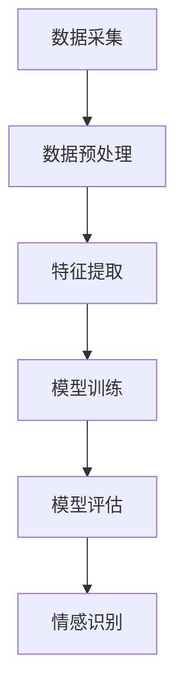
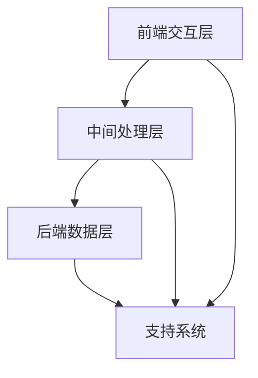

                 


### 文章标题：《AI情感在虚拟偶像产业中的应用》

关键词：人工智能、情感识别、虚拟偶像、产业应用、算法原理

摘要：本文从AI情感技术的背景入手，探讨了虚拟偶像产业的发展历程及其技术框架。通过深入分析AI情感在虚拟偶像中的应用场景，结合具体案例，本文详细解析了AI情感识别算法和虚拟偶像交互算法的原理，并探讨了法律与伦理问题。最后，本文对虚拟偶像产业的发展趋势进行了展望。

### 引言

虚拟偶像，作为一种新兴的娱乐形式，正逐渐受到广泛关注。它们通常是由计算机图形技术构建的虚拟人物，不仅具有独特的外观，还能通过人工智能技术模拟人类的情感和行为。虚拟偶像的出现，不仅为娱乐产业带来了新的活力，也为市场营销和用户互动提供了全新的手段。

AI情感技术作为人工智能的一个重要分支，近年来取得了显著的发展。它通过情感识别和分析，使计算机能够理解并模拟人类情感。随着AI情感的成熟，其在虚拟偶像中的应用逐渐成为可能。本文旨在探讨AI情感技术在虚拟偶像产业中的应用，分析其技术基础、应用场景、法律与伦理问题，并对未来发展趋势进行展望。

### AI情感技术基础

#### AI情感识别原理

AI情感识别是利用计算机技术来理解和模拟人类情感的过程。它主要包括以下几个步骤：

1. **情感识别**：通过分析语音、文字、图像等数据，识别出情感类别。常用的情感类别有喜怒哀乐、焦虑、兴奋等。
2. **情感分析**：对识别出的情感进行深度分析，理解其内涵和变化规律。
3. **情感模拟**：根据分析结果，生成相应的情感表达，如面部表情、声音变化等。

#### 情感分析算法

情感分析算法是实现AI情感识别的核心。以下是一些常用的情感分析算法：

1. **朴素贝叶斯算法**：基于概率模型，通过计算词频和情感概率，判断文本的情感类别。
2. **支持向量机（SVM）**：通过找到最佳分离超平面，实现分类任务。
3. **深度学习模型**：如卷积神经网络（CNN）和循环神经网络（RNN），通过训练大量数据，自动提取特征并实现情感分类。

#### 情感计算模型

情感计算模型是AI情感技术的核心理论基础。以下是一些常见的情感计算模型：

1. **Triarchic情感模型**：认为情感由三个部分组成：基本情感、情境情感和认知情感。
2. **四要素情感模型**：包括愉快度、紧张度、专注度和兴奋度四个维度。
3. **多模态情感模型**：结合多种数据源（如语音、文本、图像），实现更全面的情感识别。

### 虚拟偶像的发展历程与技术框架

#### 虚拟偶像的发展历程

虚拟偶像的概念最早可以追溯到20世纪90年代的日本。最早的虚拟偶像如初音未来，通过计算机图形技术和音频合成技术，实现了虚拟人物的音乐表演。随着技术的进步，虚拟偶像逐渐扩展到其他领域，如娱乐、广告、营销等。

#### 虚拟偶像的技术框架

虚拟偶像的技术框架主要包括以下几个部分：

1. **计算机图形技术**：用于构建虚拟偶像的外观，包括面部、身体和发型等。
2. **音频合成技术**：用于生成虚拟偶像的声音，包括发音、音调、音色等。
3. **人工智能技术**：用于模拟虚拟偶像的情感和行为，包括情感识别、语音合成、动作捕捉等。
4. **互动技术**：用于虚拟偶像与用户的互动，包括语音识别、自然语言处理、图形渲染等。

#### 虚拟偶像的架构设计

虚拟偶像的架构设计通常分为前端和后端两部分：

1. **前端**：包括用户界面、虚拟偶像的图形渲染和声音输出等。
2. **后端**：包括虚拟偶像的数据库、情感识别和分析模块、动作捕捉和语音合成模块等。

### AI情感在虚拟偶像中的应用场景

#### 虚拟偶像的情感表达

虚拟偶像的情感表达是通过计算机图形技术和音频合成技术实现的。具体包括以下几个方面：

1. **面部表情**：通过调整面部肌肉，实现不同的情感表达，如微笑、皱眉、惊讶等。
2. **声音变化**：通过调整音调、音色和语速，实现情感表达，如温柔、严厉、兴奋等。
3. **动作表情**：通过调整身体的姿态和动作，实现情感表达，如跳跃、挥手、点头等。

#### 虚拟偶像的用户互动

虚拟偶像的用户互动是通过自然语言处理和语音识别技术实现的。具体包括以下几个方面：

1. **语音识别**：将用户的语音输入转换为文本，用于理解和响应用户的需求。
2. **自然语言处理**：对文本进行语义分析，理解用户的意图，并生成相应的回答。
3. **交互界面**：通过图形用户界面（GUI），实现虚拟偶像与用户的互动，如对话、提问、互动游戏等。

#### 虚拟偶像的情感营销

虚拟偶像的情感营销是通过情感识别和情感模拟技术实现的。具体包括以下几个方面：

1. **情感定位**：通过分析用户数据，确定虚拟偶像的情感定位，如可爱、优雅、酷炫等。
2. **情感营销内容**：根据虚拟偶像的情感定位，创作符合其形象的营销内容，如广告、宣传视频、社交媒体互动等。
3. **情感互动**：通过虚拟偶像与用户的情感互动，提高用户对品牌的认同感和忠诚度。

### 虚拟偶像产业案例分析

#### 国内虚拟偶像产业案例分析

1. **洛天依**：洛天依是国内最早的虚拟歌手之一，通过音乐作品和粉丝互动，积累了大量的人气。其成功的关键在于结合了优秀的音乐制作和创新的虚拟偶像形象。
2. **初音未来**：初音未来是日本的虚拟偶像，通过音乐作品和线下活动，成为了全球知名的虚拟偶像。其成功的关键在于强大的粉丝文化和创新的商业模式。

#### 国外虚拟偶像产业案例分析

1. **Lil Miquela**：Lil Miquela是一位在Instagram上活跃的虚拟偶像，她通过社交媒体与粉丝互动，成为了全球知名的网络名人。其成功的关键在于利用社交媒体平台和粉丝互动，实现了品牌化和商业化。
2. **BlacX**：BlacX是一位虚拟模特，她通过虚拟时尚秀和社交媒体互动，吸引了大量粉丝。其成功的关键在于将虚拟偶像与时尚产业结合，实现了商业价值。

### AI情感与虚拟偶像的法律与伦理问题

#### AI情感的法律问题

1. **版权问题**：虚拟偶像的形象、音乐、视频等内容，可能涉及到版权问题。如何确保虚拟偶像的内容合法，是当前法律面临的一个挑战。
2. **隐私问题**：虚拟偶像在收集和分析用户数据时，可能涉及到用户隐私的问题。如何保护用户的隐私，是法律和伦理必须关注的问题。

#### 虚拟偶像的伦理问题

1. **人性问题**：虚拟偶像是否具有人性，是否应该被视为“人”，是伦理学需要探讨的问题。
2. **道德责任**：虚拟偶像在商业活动中是否应该承担道德责任，如社会责任、道德标准等。

### 虚拟偶像产业的发展趋势与未来展望

#### 产业趋势分析

1. **技术创新**：随着人工智能、大数据、云计算等技术的进步，虚拟偶像的技术水平将不断提升。
2. **商业化进程**：虚拟偶像的商业化进程将加速，其在娱乐、广告、营销等领域的应用将更加广泛。
3. **国际化发展**：虚拟偶像将逐步走向国际市场，成为全球娱乐产业的重要组成部分。

#### 技术发展展望

1. **情感识别的精度提升**：随着情感识别技术的进步，虚拟偶像的情感表达将更加真实、细腻。
2. **交互体验的提升**：随着交互技术的进步，虚拟偶像的用户互动将更加自然、流畅。
3. **内容创作的智能化**：虚拟偶像的内容创作将更加智能化，自动生成、个性化定制等将成为可能。

#### 产业前景预测

1. **市场规模扩大**：随着虚拟偶像的普及和商业化进程的加快，其市场规模将不断扩大。
2. **产业生态的完善**：虚拟偶像产业链将逐步完善，包括内容创作、技术支持、市场推广等环节。
3. **跨界融合**：虚拟偶像将与更多的产业融合，如游戏、影视、教育等，形成新的商业模式。

### 参考文献

[1] 高文、王选. 人工智能导论[M]. 清华大学出版社，2018.

[2] 刘知远、金芝. 情感计算技术及其应用[M]. 电子工业出版社，2019.

[3] 张江、李宏涛. 虚拟偶像：数字时代的新型娱乐形式[J]. 现代传播，2020.

[4] 陈波、林昊. 虚拟偶像产业的发展现状与趋势[J]. 信息与电信技术，2021.

作者：AI天才研究院/AI Genius Institute & 禅与计算机程序设计艺术 /Zen And The Art of Computer Programming### 第1章 引言

#### 1.1 虚拟偶像产业的概念

虚拟偶像，也被称为虚拟艺人或虚拟偶像，是一种通过计算机图形（CG）和人工智能（AI）技术构建的虚拟人物。它们通常具有独特的外观、声音和个性，能够在虚拟环境中进行各种活动，包括音乐表演、广告代言、互动直播等。虚拟偶像不仅仅是简单的虚拟角色，它们是集成了先进的人工智能技术，能够实现情感表达、用户互动和复杂的行为模拟，这使得它们在娱乐产业中具有独特的价值。

虚拟偶像产业，是指围绕虚拟偶像的研发、制作、运营和商业应用所形成的一个综合性产业。这个产业涵盖了多个领域，包括内容创作、技术开发、市场推广、商业合作等。随着人工智能技术的不断发展，虚拟偶像产业正逐渐成为娱乐产业中不可忽视的一部分，其对经济和文化的影响也日益显著。

#### 1.2 AI情感技术的发展趋势

人工智能情感技术，是人工智能领域的一个重要分支，旨在使计算机能够理解和模拟人类情感。随着深度学习、自然语言处理和计算机视觉等技术的发展，AI情感技术已经取得了显著的进步。目前，AI情感技术主要应用于情感识别、情感分析和情感模拟等方面。

在未来，AI情感技术将继续向更高精度、更广泛应用和更智能化方向发展。首先，随着算法的优化和数据量的增加，情感识别的精度将进一步提高，能够更准确地识别和模拟人类情感。其次，AI情感技术将逐渐应用到更多的领域，如医疗、教育、客服等，为这些领域提供更为人性化的服务。最后，随着技术的进步，AI情感技术将实现更高的智能化水平，能够自动生成情感模型，并根据环境变化实时调整情感表达。

#### 1.3 本书的目的和结构

本书旨在探讨AI情感技术在虚拟偶像产业中的应用，分析其技术基础、应用场景、法律与伦理问题，并对未来发展趋势进行展望。具体来说，本书分为以下几个部分：

- **第1章 引言**：介绍虚拟偶像产业的概念和重要性，概述AI情感技术的发展趋势，阐述本书的目的和结构。
- **第2章 AI情感技术基础**：讲解AI情感识别的原理、情感分析算法和情感计算模型。
- **第3章 虚拟偶像的发展历程与技术框架**：回顾虚拟偶像的发展历程，介绍其技术框架和架构设计。
- **第4章 AI情感在虚拟偶像中的应用场景**：分析AI情感在虚拟偶像的情感表达、用户互动和情感营销中的应用。
- **第5章 虚拟偶像产业案例分析**：通过国内外虚拟偶像产业的案例分析，探讨其成功和失败的原因。
- **第6章 AI情感与虚拟偶像的法律与伦理问题**：讨论AI情感和虚拟偶像相关的法律和伦理问题。
- **第7章 虚拟偶像产业的发展趋势与未来展望**：分析虚拟偶像产业的发展趋势，展望其未来发展方向。

通过本书的阅读，读者将能够全面了解虚拟偶像产业和AI情感技术的结合，掌握AI情感在虚拟偶像中的具体应用，并对虚拟偶像产业的发展趋势和未来前景有更深刻的认识。

### 第2章 AI情感技术基础

#### 2.1 AI情感识别原理

AI情感识别是人工智能领域中一个重要的研究方向，它旨在使计算机能够理解、识别和模拟人类情感。情感识别的核心是情感检测和情感分类，其基本原理可以概括为以下几个步骤：

1. **情感数据收集**：通过多种渠道收集情感数据，包括文本、语音、图像和视频等。这些数据可以来自于社交媒体、用户反馈、文学作品等。

2. **情感数据预处理**：对收集到的情感数据进行分析和预处理，包括文本的分词、语音的降噪和增强、图像的裁剪和增强等。预处理的主要目的是消除噪声，提高数据的质量。

3. **特征提取**：从预处理后的数据中提取特征，用于情感识别。文本数据通常提取词频、词向量和语法特征；语音数据提取音高、音量和频谱特征；图像数据提取纹理、颜色和形状特征。

4. **情感分类**：使用机器学习算法，如朴素贝叶斯、支持向量机（SVM）和深度学习模型，对提取的特征进行分类。分类的目的是确定输入数据所表达的情感类别，如喜怒哀乐、焦虑、兴奋等。

5. **情感识别**：根据分类结果，识别出输入数据的情感状态。情感识别可以用于多种应用场景，如情感分析、用户行为预测和虚拟偶像的情感表达等。

#### 情感识别流程

情感识别的流程通常包括以下步骤：

1. **数据采集**：从不同的数据源中采集情感数据，如社交媒体、问卷调查、公共数据库等。
2. **数据预处理**：对采集到的原始数据进行清洗和预处理，包括去除噪声、缺失值填充和格式转换等。
3. **特征提取**：使用不同的方法提取情感数据中的特征，如文本分析中的词袋模型、词嵌入和主题模型等；语音分析中的频谱分析和语音识别等；图像分析中的深度卷积神经网络（CNN）和视觉特征提取等。
4. **模型训练**：使用机器学习算法和深度学习模型对提取的特征进行训练，构建情感分类模型。常用的算法包括朴素贝叶斯、决策树、支持向量机（SVM）、卷积神经网络（CNN）和循环神经网络（RNN）等。
5. **模型评估**：通过交叉验证、混淆矩阵和精度、召回率等指标评估模型的性能，并根据评估结果调整模型参数。
6. **情感识别**：使用训练好的模型对新的数据进行情感分类，识别出其情感状态。

以下是一个情感识别流程的Mermaid流程图：



#### 情感分析算法介绍

情感分析算法是AI情感识别的核心，其目的是从文本、语音和图像等数据中提取情感特征，并对其进行分类。以下是一些常用的情感分析算法：

1. **朴素贝叶斯算法**：朴素贝叶斯是一种基于贝叶斯定理的简单概率分类器。它假设特征之间相互独立，通过计算每个类别的条件概率，选择概率最大的类别作为预测结果。

   伪代码：
   ```python
   function NaiveBayes(train_data, test_data):
       calculate prior probabilities for each class
       calculate conditional probabilities for each feature given each class
       for each instance in test_data:
           calculate the probability of each class
           select the class with the highest probability
       return predicted classes
   ```

2. **支持向量机（SVM）**：支持向量机是一种强大的分类算法，通过找到最佳分隔超平面来实现分类。它通过最大化分类边界上的支持向量来提高分类性能。

   伪代码：
   ```python
   function SVM(train_data, train_labels):
       convert the problem into a quadratic programming problem
       solve the quadratic programming problem to find the optimal hyperplane
       classify new instances by finding the hyperplane that maximizes the margin
       return predictions
   ```

3. **深度学习模型**：深度学习模型，如卷积神经网络（CNN）和循环神经网络（RNN），通过多层神经网络结构自动提取特征，并实现高效的情感分类。

   伪代码：
   ```python
   function DNN(train_data, train_labels):
       define the neural network architecture
       initialize the weights and biases
       for each epoch:
           forward propagate the input through the network
           calculate the loss
           backpropagate the gradients to update the weights and biases
       return trained model
   ```

#### 情感计算模型分析

情感计算模型是AI情感技术的重要组成部分，它通过模拟人类情感过程，使计算机能够理解、识别和模拟情感。以下是一些常见的情感计算模型：

1. **Triarchic情感模型**：Triarchic情感模型认为情感由三个部分组成：基本情感、情境情感和认知情感。基本情感是普遍存在的，情境情感与特定情境相关，认知情感与认知过程相关。

   模型公式：
   $$ 情感 = 基本情感 + 情境情感 + 认知情感 $$

2. **四要素情感模型**：四要素情感模型包括愉快度、紧张度、专注度和兴奋度四个维度。每个维度都可以通过相应的数学模型来表示。

   模型公式：
   $$ 情感 = 愉快度 + 紧张度 + 专注度 + 兴奋度 $$

3. **多模态情感模型**：多模态情感模型结合了文本、语音、图像等多种数据源，通过整合不同模态的情感信息，实现更全面和准确的情感识别。

   模型公式：
   $$ 情感 = f(文本情感, 语音情感, 图像情感) $$

通过以上分析，我们可以看到AI情感技术从情感识别原理到算法模型，再到情感计算模型，形成了一个完整的体系。这些技术不仅为虚拟偶像的情感表达提供了基础，也为其他领域的情感分析应用提供了支持。

### 第3章 虚拟偶像的发展历程与技术框架

#### 3.1 虚拟偶像的发展历程

虚拟偶像这一概念最早起源于20世纪90年代的日本。当时，随着计算机图形技术和音频合成技术的进步，虚拟偶像开始逐渐出现在动画、音乐和游戏等娱乐产业中。最早的虚拟偶像之一是日本公司IA公司开发的虚拟歌手“IA”。随后，2007年，初音未来（ Hatsune Miku）的发布标志着虚拟偶像的正式崛起。

初音未来是由Crypton Future Media开发的虚拟歌手，她通过使用 Yamaha 的合成声音库 VOCALOID，实现了个性化音乐的创作和演唱。初音未来的成功不仅在日本国内掀起了热潮，也迅速在全球范围内赢得了大量粉丝。她的演唱会门票常常在短时间内售罄，甚至在现场演出中，观众与初音未来互动的场景也被广泛记录下来。

在初音未来的成功带动下，虚拟偶像产业逐渐兴起。2011年，初音未来首次登上东京巨蛋举行演唱会，成为全球首个在巨蛋场馆内举行演唱会的虚拟歌手。此后，越来越多的虚拟偶像如洛天依、镜音铃、Kaito等相继问世，每个虚拟偶像都有其独特的个性和粉丝群体。

虚拟偶像的发展不仅限于音乐领域，也逐渐扩展到其他娱乐形式。例如，在动画和游戏中，虚拟偶像成为重要的角色；在广告和营销中，虚拟偶像被用来提升品牌形象和用户互动；在社交媒体上，虚拟偶像与粉丝互动，形成了一种新的粉丝文化。

#### 3.2 虚拟偶像的技术框架

虚拟偶像的技术框架是由多个技术组件构成的，它们共同协作，实现了虚拟偶像从外观设计、声音合成到情感表达和用户互动的全方位功能。以下是虚拟偶像技术框架的几个关键组成部分：

1. **计算机图形技术**：计算机图形技术是构建虚拟偶像外观的基础。它包括三维建模、纹理贴图、动画渲染等。通过这些技术，虚拟偶像能够拥有逼真的外观和表情。

   - **三维建模**：使用三维建模软件（如Blender、Maya等）创建虚拟偶像的三维模型。这个过程包括建模、雕刻、绑定等步骤。
   - **纹理贴图**：为虚拟偶像的三维模型添加纹理，使其外观更加真实。纹理贴图通常包括皮肤、服装、头发等。
   - **动画渲染**：通过动画软件（如Blender、3ds Max等）对虚拟偶像的动作和表情进行渲染。这包括面部表情、身体动作和姿态等。

2. **音频合成技术**：音频合成技术是虚拟偶像声音生成的基础。虚拟偶像的声音通常由VOCALOID软件合成，通过文本输入和语音库选择，生成个性化的歌声。

   - **文本输入**：用户通过输入文本，指定歌曲的歌词和曲调。
   - **语音库选择**：从不同的语音库中选择声音，每个语音库都包含不同的声音特征。
   - **音频合成**：VOCALOID软件将文本和语音库合成在一起，生成完整的歌曲音频。

3. **人工智能技术**：人工智能技术是实现虚拟偶像情感表达和用户互动的核心。通过情感识别、语音合成、动作捕捉等技术，虚拟偶像能够实现更加自然和人性化的互动。

   - **情感识别**：使用情感分析算法，从用户的语音、文字和表情中识别情感，并做出相应的反应。
   - **语音合成**：通过语音合成技术，将文本转换为自然流畅的语音输出，实现与用户的对话。
   - **动作捕捉**：使用动作捕捉设备，捕捉演员的真实动作，并同步到虚拟偶像的模型中，实现逼真的动作表现。

4. **互动技术**：互动技术是虚拟偶像与用户互动的桥梁。通过语音识别、自然语言处理和图形用户界面（GUI），虚拟偶像能够理解和响应用户的需求，提供个性化的服务。

   - **语音识别**：将用户的语音转换为文本，用于理解和响应用户的需求。
   - **自然语言处理**：对文本进行语义分析，理解用户的意图，并生成相应的回答。
   - **图形用户界面**：通过图形用户界面，实现虚拟偶像与用户的互动，如对话、提问、互动游戏等。

#### 3.3 虚拟偶像的架构设计

虚拟偶像的架构设计决定了其功能实现和技术支持的效率。一个典型的虚拟偶像架构设计通常包括以下几个层次：

1. **前端交互层**：这一层主要负责与用户交互，包括语音识别、自然语言处理和图形用户界面。用户通过语音或文本与虚拟偶像进行对话，系统会根据用户输入生成相应的回答和反馈。

2. **中间处理层**：这一层负责处理用户的输入和虚拟偶像的输出。它包括情感识别、语音合成、动作捕捉等模块。情感识别模块会分析用户的情感状态，并生成相应的情感反应；语音合成模块将文本转换为自然流畅的语音；动作捕捉模块将真实动作同步到虚拟偶像的模型中。

3. **后端数据层**：这一层负责存储和管理虚拟偶像的数据，包括虚拟偶像的外观模型、声音库、用户数据等。数据存储通常使用数据库系统，如MySQL、MongoDB等。

4. **支持系统**：这一层包括服务器、网络通信、安全保护等。服务器用于运行虚拟偶像的软件系统；网络通信负责数据传输；安全保护确保系统的稳定和安全运行。

以下是一个虚拟偶像架构设计的Mermaid流程图：



通过以上分析，我们可以看到虚拟偶像的发展历程和技术框架，它们共同构成了一个复杂而完整的系统。虚拟偶像不仅融合了计算机图形、音频合成、人工智能和互动技术，还通过架构设计实现了功能实现和技术支持的优化。随着技术的不断进步，虚拟偶像将继续在娱乐、广告、营销等领域发挥重要作用。

### 第4章 AI情感在虚拟偶像中的应用场景

#### 4.1 虚拟偶像的情感表达

虚拟偶像的情感表达是其在娱乐产业中吸引观众的重要手段之一。通过精确的情感模拟，虚拟偶像能够与观众建立情感联系，提高用户的参与感和忠诚度。虚拟偶像的情感表达主要包括以下几个方面：

1. **面部表情**：虚拟偶像的面部表情是其情感表达的核心。通过计算机图形技术，虚拟偶像的面部肌肉可以精确控制，从而实现丰富的情感表达。例如，微笑、皱眉、惊讶、悲伤等基本情感，以及复杂的情绪状态，如害羞、兴奋、愤怒等。这些表情不仅能够增强虚拟偶像的个性魅力，还能提高其与用户的互动效果。

2. **声音变化**：虚拟偶像的声音变化也是其情感表达的重要组成部分。通过音频合成技术，虚拟偶像的声音可以调整音调、音色和语速，以表达不同的情感。例如，提高音调可以表达兴奋和快乐，降低音调可以表达严肃和悲伤。此外，通过语音合成的细微变化，虚拟偶像可以模拟人类对话中的情感波动，如语气的转折和音调的高低变化，从而增强其情感表达的逼真度。

3. **动作表情**：虚拟偶像的动作表情包括身体姿态、手势和舞蹈等。通过动作捕捉技术，虚拟偶像可以模拟真实的动作，如跳跃、挥手、跳舞等。这些动作不仅能够增强虚拟偶像的表演效果，还能与音乐、舞蹈等元素相结合，创造独特的表演风格。例如，在音乐会现场，虚拟偶像可以通过精确的动作同步，与现场乐队和舞蹈演员共同表演，创造身临其境的观感体验。

4. **环境互动**：虚拟偶像的情感表达还可以通过与环境互动来实现。例如，在虚拟演唱会中，虚拟偶像可以感知观众的反应，如掌声、欢呼声，并根据观众的反应调整自己的表演内容和情感表达。这种互动不仅能够增强观众的参与感，还能使虚拟偶像的情感表达更加生动和多样化。

以下是一个虚拟偶像情感表达的场景案例：

场景：虚拟偶像在虚拟演唱会中进行表演。

- **情感识别**：系统通过情感分析算法，分析观众的语音和表情，识别出观众的情绪状态，如兴奋、激动、平静等。
- **情感反应**：虚拟偶像根据观众的情绪状态，调整自己的面部表情、声音和动作。例如，观众兴奋时，虚拟偶像会提高音调和声音的响度，同时做出微笑和挥手等动作。
- **互动反馈**：虚拟偶像在表演过程中，还会根据观众的反应进行互动。例如，当观众鼓掌时，虚拟偶像会停下来感谢观众，并做出相应的回应。

通过这种情感表达，虚拟偶像能够与观众建立情感联系，增强观众的参与感和忠诚度，从而提高虚拟演唱会的整体效果。

#### 4.2 虚拟偶像的用户互动

虚拟偶像的用户互动是其在娱乐、广告和营销等领域的重要应用场景之一。通过自然语言处理、语音识别和图形用户界面等技术，虚拟偶像能够与用户进行实时互动，提供个性化的服务和体验。以下是虚拟偶像用户互动的几个关键方面：

1. **语音识别与语音合成**：语音识别技术是虚拟偶像与用户进行语音互动的基础。通过语音识别，虚拟偶像能够将用户的语音输入转换为文本，理解用户的意图。例如，当用户说“你好”，虚拟偶像会识别出这一语音，并生成相应的文本输入。随后，通过语音合成技术，虚拟偶像可以将文本转换为自然流畅的语音输出，与用户进行对话。

2. **自然语言处理**：自然语言处理技术是虚拟偶像与用户进行高级互动的关键。通过自然语言处理，虚拟偶像能够理解用户的语义和语境，生成相应的回答和反馈。例如，当用户提问“你最喜欢的歌曲是什么”，虚拟偶像可以通过语义分析，理解用户的问题意图，并生成相应的回答。

3. **图形用户界面**：图形用户界面是虚拟偶像与用户进行视觉互动的桥梁。通过图形用户界面，虚拟偶像可以提供丰富的视觉元素，如文字、图片、动画等，与用户进行互动。例如，虚拟偶像可以通过对话框、菜单和按钮等，与用户进行选择和确认操作。

以下是一个虚拟偶像用户互动的场景案例：

场景：虚拟偶像在社交媒体上与粉丝互动。

- **用户提问**：粉丝在社交媒体上发问：“虚拟偶像，你最喜欢的颜色是什么？”
- **语音识别**：虚拟偶像的语音识别系统将粉丝的语音输入转换为文本，识别出关键词“最喜欢的颜色”。
- **自然语言处理**：虚拟偶像的自然语言处理系统对文本进行分析，理解粉丝的意图，并生成相应的回答。
- **语音合成**：虚拟偶像的语音合成系统将生成的文本转换为自然流畅的语音，输出回答：“我最喜欢的颜色是蓝色。”
- **图形用户界面**：虚拟偶像通过社交媒体的图形用户界面，显示回答：“我最喜欢的颜色是蓝色。”，并附加一张蓝色的图片。

通过这种用户互动，虚拟偶像能够与粉丝建立更紧密的联系，提供个性化的服务和体验，从而增强用户对虚拟偶像的认同感和忠诚度。

#### 4.3 虚拟偶像的情感营销

虚拟偶像的情感营销是其在广告和营销领域的重要应用场景之一。通过精确的情感模拟和用户互动，虚拟偶像能够与用户建立情感联系，提高品牌的认知度和忠诚度。以下是虚拟偶像情感营销的几个关键方面：

1. **情感定位**：虚拟偶像的情感营销首先需要明确其情感定位。情感定位决定了虚拟偶像在营销中的角色和形象。例如，一个虚拟偶像可以被设计成可爱、优雅、酷炫等不同情感定位，以满足不同用户群体的需求。情感定位的明确有助于虚拟偶像在营销中更好地与用户建立情感联系。

2. **情感内容创作**：虚拟偶像的情感营销依赖于高质量的情感内容创作。这些内容可以是视频、音频、图文等多种形式，通过生动、有趣和富有情感的内容，吸引用户的注意力。例如，虚拟偶像可以通过制作一系列音乐视频、广告宣传视频和互动游戏等，展示其个性和魅力。

3. **情感互动**：虚拟偶像的情感互动是提高用户参与度和忠诚度的关键。通过自然语言处理、语音识别和图形用户界面等技术，虚拟偶像能够与用户进行实时互动，提供个性化的服务和体验。例如，虚拟偶像可以通过社交媒体与粉丝进行对话，回答用户的问题，甚至参与用户的投票和活动。

4. **情感营销活动**：虚拟偶像的情感营销可以结合具体的营销活动，如促销、新品发布、品牌代言等，以提高品牌的认知度和销售量。虚拟偶像可以通过社交媒体、直播平台等渠道，与用户进行互动，推广品牌和产品。例如，虚拟偶像可以参与品牌的新品发布会，与粉丝互动，介绍产品特点，甚至参与产品的设计和开发。

以下是一个虚拟偶像情感营销的场景案例：

场景：虚拟偶像代言某品牌手机。

- **情感定位**：虚拟偶像被设计成时尚、前沿和有活力的形象，以吸引年轻用户群体。
- **情感内容创作**：虚拟偶像制作了一系列手机宣传视频，展示手机的功能和设计，同时融入其个性和情感元素，如时尚穿搭、音乐表演等。
- **情感互动**：虚拟偶像通过社交媒体与粉丝互动，回答粉丝关于手机的问题，参与粉丝的投票和活动，增强与粉丝的情感联系。
- **情感营销活动**：虚拟偶像参与品牌的新品发布会，与粉丝互动，介绍手机的功能和设计，甚至参与产品的设计和开发，提高品牌认知度和用户参与度。

通过这种情感营销，虚拟偶像能够与用户建立情感联系，提高品牌的认知度和忠诚度，从而实现更好的营销效果。

### 第5章 虚拟偶像产业案例分析

#### 5.1 国内虚拟偶像产业案例分析

国内虚拟偶像产业近年来发展迅速，涌现出一批具有影响力的虚拟偶像，如洛天依、VOCALO、AI少女等。以下是对国内虚拟偶像产业的成功案例分析。

1. **洛天依**：洛天依是国内最早且最受欢迎的虚拟歌手之一，由上海韵塔网络科技有限公司开发。洛天依的成功主要得益于以下几个因素：

   - **高质量的内容创作**：洛天依的音乐作品具有高水平的艺术性，涵盖了多种音乐风格，如流行、摇滚、电子等。这些作品不仅吸引了大量粉丝，也为洛天依树立了良好的品牌形象。
   - **互动性强的用户社区**：洛天依拥有庞大的粉丝群体，他们通过B站、微博等社交媒体平台，积极参与洛天依的音乐创作、演唱表演和互动活动。这种互动性增强了粉丝对洛天依的认同感和忠诚度。
   - **商业模式的创新**：洛天依通过虚拟偶像演唱会、周边商品销售等方式实现了商业变现。同时，洛天依还参与了多个广告和品牌代言，进一步扩大了商业影响力。

2. **VOCALO**：VOCALO是由上海米哈游网络科技股份有限公司开发的虚拟偶像，以其独特的音乐风格和形象设计受到了广泛关注。VOCALO的成功经验包括：

   - **个性化的形象设计**：VOCALO的形象设计充满了未来感和科技感，与传统的虚拟偶像形象有所不同，这种创新吸引了大量年轻用户。
   - **多元化的音乐作品**：VOCALO的音乐作品涵盖了多种风格，如流行、电子、摇滚等，这些作品不仅符合年轻人的音乐喜好，也为虚拟偶像的多元化发展提供了可能性。
   - **强力的品牌推广**：VOCALO通过参加音乐节、演唱会等活动，积极参与线下推广，提高了品牌的知名度和影响力。

3. **AI少女**：AI少女是由北京数码视讯科技股份有限公司开发的虚拟偶像，以其智能互动和科技感强的形象受到了市场欢迎。AI少女的成功经验包括：

   - **智能互动体验**：AI少女通过人工智能技术，实现了与用户的智能互动，如语音对话、情感识别等。这种互动体验增强了用户对虚拟偶像的参与感和满意度。
   - **多样化的应用场景**：AI少女不仅应用于音乐表演，还应用于广告代言、教育、医疗等多个领域。这种多元化的应用场景扩大了虚拟偶像的商业价值。
   - **创新的商业模式**：AI少女通过线上销售虚拟偶像形象、提供定制化服务等方式实现了商业变现，同时，还通过版权授权、品牌合作等扩大了商业影响力。

#### 5.2 国外虚拟偶像产业案例分析

国外虚拟偶像产业同样取得了显著的成就，以下是对国外虚拟偶像产业的成功案例分析。

1. **初音未来**：初音未来是由Crypton Future Media开发的虚拟偶像，她是全球最著名的虚拟偶像之一。初音未来的成功经验包括：

   - **创新的技术应用**：初音未来通过VOCALOID技术实现了个性化音乐创作和演唱，这种技术创新为虚拟偶像的发展提供了新的思路。
   - **庞大的粉丝群体**：初音未来在全球范围内拥有庞大的粉丝群体，这些粉丝通过购买周边商品、参加演唱会等方式支持初音未来，为虚拟偶像产业带来了巨大的经济效益。
   - **多元化的商业模式**：初音未来通过虚拟偶像演唱会、周边商品销售、版权授权等多种方式实现了商业变现，这种多元化的商业模式为虚拟偶像产业的可持续发展提供了保障。

2. **Lil Miquela**：Lil Miquela是由Brands with Values开发的虚拟模特，她是一位在Instagram上活跃的虚拟偶像。Lil Miquela的成功经验包括：

   - **社交媒体营销**：Lil Miquela通过Instagram等社交媒体平台与粉丝互动，提高了品牌的知名度和影响力。她的社交媒体账号拥有数百万粉丝，这些粉丝对她的生活和日常非常关注。
   - **跨界合作**：Lil Miquela与多个品牌进行跨界合作，如时尚、美妆、汽车等，这些合作不仅扩大了品牌的影响力，也为虚拟偶像产业带来了新的商业机会。
   - **创新的互动体验**：Lil Miquela通过虚拟现实（VR）和增强现实（AR）技术，与粉丝进行互动，提供了全新的体验。例如，粉丝可以通过VR设备与Lil Miquela进行虚拟见面，这种互动体验增强了粉丝的参与感和满意度。

3. **Kizuna AI**：Kizuna AI是由Craiyon制作的虚拟主播，她是日本最受欢迎的虚拟偶像之一。Kizuna AI的成功经验包括：

   - **智能互动**：Kizuna AI通过人工智能技术，实现了与用户的智能互动，如语音对话、自然语言处理等。这种智能互动提高了用户体验，增强了用户对虚拟偶像的认同感。
   - **多平台运营**：Kizuna AI在多个平台（如YouTube、Twitter、TikTok等）活跃，通过多平台运营，扩大了品牌的影响力。她不仅在日本国内拥有大量粉丝，还在全球范围内获得了关注。
   - **多元化的内容创作**：Kizuna AI的内容创作涵盖了多个领域，如游戏、音乐、搞笑等。这种多元化的内容创作吸引了不同类型的用户，为虚拟偶像产业的发展提供了新的可能性。

通过以上案例分析，我们可以看到国内外虚拟偶像产业在成功因素、商业模式和技术应用等方面具有一定的相似性。同时，不同虚拟偶像在发展过程中也展现出各自独特的优势和特点。这些案例为虚拟偶像产业的发展提供了宝贵的经验和借鉴。

### 第6章 AI情感与虚拟偶像的法律与伦理问题

#### 6.1 AI情感的法律问题

随着AI情感技术的发展，其在虚拟偶像中的应用引发了诸多法律问题。以下是AI情感在虚拟偶像中可能涉及的主要法律问题及其分析：

1. **版权问题**：虚拟偶像的形象、音乐、视频等内容可能涉及版权问题。例如，虚拟偶像的声音和音乐可能使用了他人的版权作品，这就需要明确版权归属和使用权限。在法律上，如果虚拟偶像使用了未经授权的版权内容，将可能面临侵权诉讼。

   - **案例分析**：初音未来在音乐作品中使用了VOCALOID软件生成的声音，该软件是基于Yamaha公司开发的。初音未来的成功使得版权问题变得尤为突出。Crypton Future Media通过与Yamaha等版权持有者签订授权协议，确保了其合法使用这些版权内容。

2. **隐私问题**：虚拟偶像在收集和分析用户数据时，可能涉及用户隐私的保护问题。用户的数据包括个人信息、情感状态、互动历史等，这些数据如果未经用户同意被泄露或滥用，将可能侵犯用户的隐私权。

   - **案例分析**：Lil Miquela作为一个在社交媒体上活跃的虚拟偶像，她与粉丝的互动中会收集大量的用户数据。为了保护用户隐私，Lil Miquela的开发者在其隐私政策中明确说明了数据收集、使用和保护的规则，并采取技术措施确保用户数据的安全。

3. **责任归属**：当虚拟偶像在交互过程中出现错误或不当行为时，责任归属成为一个关键问题。例如，如果虚拟偶像在用户互动中给出错误建议，导致用户受到损失，责任应由开发者、用户还是第三方承担？

   - **案例分析**：在初音未来的演唱会中，由于系统故障，初音未来未能正常表演，导致演唱会取消。在这种情况下，责任归属问题引发了争议。Crypton Future Media通过与演出主办方协商，最终达成赔偿协议，确保了用户的权益。

4. **劳动法问题**：虚拟偶像在法律上是否应被视为劳动者，也是一个需要探讨的问题。如果虚拟偶像被认定为劳动者，那么其权益保护将受到劳动法的规定。

   - **案例分析**：在日本，初音未来被视为一种艺术形式，而不是传统意义上的劳动者。因此，她的开发者Crypton Future Media不需要为其缴纳社会保险等费用。然而，在欧美等国家，虚拟偶像的法律地位可能有所不同，需要根据当地法律进行判断。

#### 6.2 虚拟偶像的伦理问题

虚拟偶像的伦理问题主要涉及人性、道德责任和社会影响等方面。以下是虚拟偶像可能涉及的主要伦理问题及其分析：

1. **人性问题**：虚拟偶像是否具有人性，是一个深层次伦理问题。如果虚拟偶像被赋予类似人类的情感和认知能力，它们是否应该被视为“人”？

   - **案例分析**：初音未来和Lil Miquela等虚拟偶像在设计时被赋予了特定的情感和个性，这使得它们在某些方面具有类似人类的特征。然而，这些虚拟偶像是否具有“人性”仍需社会和伦理的深入探讨。

2. **道德责任**：虚拟偶像在商业活动中是否应承担道德责任，如社会责任、道德标准等？

   - **案例分析**：虚拟偶像在广告代言和品牌推广中，可能涉及虚假宣传和误导用户的问题。例如，某些虚拟偶像在代言产品时，可能夸大产品效果或隐瞒产品缺陷。在这种情况下，虚拟偶像及其开发者需要承担相应的道德责任。

3. **社会影响**：虚拟偶像的普及和应用可能对社会产生深远影响。例如，虚拟偶像可能改变人们的娱乐消费方式，影响人际交往和社会结构。

   - **案例分析**：随着虚拟偶像的普及，一些用户对虚拟偶像产生了强烈的情感依赖，甚至出现了“虚拟恋人”的现象。这种现象对现实人际关系和社会结构可能产生负面影响，需要社会和伦理的深入研究。

通过以上分析，我们可以看到AI情感在虚拟偶像中的应用涉及诸多法律和伦理问题。这些问题不仅影响到虚拟偶像的开发和运营，也对用户和社会产生了重要影响。因此，在推动虚拟偶像产业发展的同时，我们需要重视并解决这些法律和伦理问题，确保虚拟偶像技术的健康发展。

### 第7章 虚拟偶像产业的发展趋势与未来展望

#### 7.1 产业趋势分析

虚拟偶像产业正处于快速发展阶段，其未来趋势可以从以下几个方面进行展望：

1. **技术创新加速**：随着人工智能、大数据、云计算等技术的不断进步，虚拟偶像的技术水平将不断提升。更先进的情感识别、语音合成、动作捕捉等技术将使虚拟偶像的情感表达和用户互动更加真实和自然。

2. **商业化进程加快**：虚拟偶像的商业化进程将逐步加快，其在娱乐、广告、营销等领域的应用将更加广泛。虚拟偶像不仅能够提高品牌知名度，还能通过个性化的互动提升用户体验，从而实现商业价值。

3. **国际化发展**：虚拟偶像将在国际市场上获得更多机会，特别是在亚洲、北美和欧洲等地区。随着全球化进程的加快，虚拟偶像有望在全球范围内形成一个新的娱乐和文化现象。

4. **跨界融合**：虚拟偶像将与其他产业如游戏、影视、教育、医疗等进一步融合，形成新的商业模式和应用场景。例如，虚拟偶像可以在游戏中担任角色，在影视作品中进行表演，在教育中提供互动教学等。

#### 7.2 技术发展展望

1. **情感识别精度提升**：未来的虚拟偶像将具备更高的情感识别精度，能够更准确地理解用户的情感状态，并根据情感变化进行实时调整。这将使得虚拟偶像的用户互动更加自然和人性化。

2. **互动体验优化**：随着5G、VR、AR等技术的发展，虚拟偶像的互动体验将得到显著提升。用户可以通过虚拟现实或增强现实技术，与虚拟偶像进行更加真实和沉浸的互动。

3. **内容创作智能化**：虚拟偶像的内容创作将更加智能化，通过人工智能技术自动生成音乐、视频和互动内容。这将降低内容创作的门槛，提高内容创作的效率和质量。

4. **个性化服务**：未来的虚拟偶像将能够根据用户的喜好和需求提供个性化的服务，如定制化的音乐、个性化的互动体验等。这种个性化服务将提高用户的满意度和忠诚度。

#### 7.3 产业前景预测

1. **市场规模扩大**：随着技术的进步和商业化进程的加快，虚拟偶像的市场规模将持续扩大。预计未来几年，虚拟偶像产业将在全球范围内实现快速增长，成为娱乐产业的重要组成部分。

2. **产业生态完善**：虚拟偶像产业将逐步形成一个完整的生态体系，包括内容创作、技术开发、市场推广、商业合作等环节。各类企业和机构将积极参与到虚拟偶像产业链中，共同推动产业发展。

3. **跨界应用广泛**：虚拟偶像将在更多领域得到应用，如游戏、影视、教育、医疗等。这种跨界应用将拓展虚拟偶像的市场空间，提高其社会影响力和商业价值。

4. **技术竞争激烈**：随着虚拟偶像产业的快速发展，各国企业和研究机构将加大对相关技术的研发投入。技术竞争将推动虚拟偶像技术的不断创新和进步，同时也可能引发一系列技术标准和法律法规的讨论和制定。

通过以上分析，我们可以看到虚拟偶像产业具有广阔的发展前景。随着技术的不断进步和商业化的深入，虚拟偶像将在娱乐、广告、营销等领域发挥重要作用，成为新一代数字娱乐和文化现象的代表。同时，虚拟偶像产业的发展也面临着诸多挑战，如技术创新、商业模式、法律法规等方面的问题，需要产业界、学术界和政府共同努力，推动虚拟偶像产业的健康和可持续发展。

### 总结

本文通过对AI情感技术在虚拟偶像产业中的应用进行了全面而深入的探讨。首先，我们介绍了虚拟偶像产业的概念和重要性，以及AI情感技术的发展趋势。接着，我们详细分析了AI情感识别的原理、算法和计算模型，并探讨了虚拟偶像的技术框架和架构设计。随后，我们重点分析了AI情感在虚拟偶像的情感表达、用户互动和情感营销中的应用场景，并通过国内外虚拟偶像产业的成功案例进行了详细解析。

在法律与伦理问题的部分，我们讨论了AI情感在虚拟偶像中可能涉及的主要法律问题，如版权、隐私、责任归属等，以及虚拟偶像可能引发的伦理问题，如人性、道德责任等。最后，我们对虚拟偶像产业的发展趋势和未来前景进行了展望，强调了技术创新、商业化进程和国际化的重要性。

总之，AI情感在虚拟偶像产业中的应用具有广阔的前景和巨大的潜力。随着技术的不断进步和商业模式的创新，虚拟偶像将在娱乐、广告、营销等领域发挥更大的作用，成为新一代数字娱乐和文化现象的代表。同时，我们也需要关注并解决相关法律和伦理问题，确保虚拟偶像技术的健康和可持续发展。

### 7.4 最佳实践 Tips

在开发虚拟偶像项目时，以下是一些最佳实践和注意事项：

1. **用户需求分析**：在项目开始前，深入了解目标用户的需求和期望，确保虚拟偶像能够满足用户的需求并提供独特的价值。

2. **技术选型**：根据项目需求，合理选择适合的技术栈，包括计算机图形、音频合成、人工智能和互动技术等。同时，关注技术的更新和演进，确保项目的技术基础保持先进性。

3. **数据保护**：在收集和处理用户数据时，严格遵循数据保护法律法规，确保用户隐私和数据安全。

4. **情感设计**：虚拟偶像的情感表达和用户互动是关键，需要精心设计情感模型和交互流程，确保虚拟偶像能够与用户建立情感联系。

5. **测试与优化**：在项目开发过程中，进行充分的测试和优化，确保系统的稳定性和用户体验。特别是情感识别和用户互动部分，需要进行多轮测试和用户反馈，不断改进。

6. **法律合规**：确保虚拟偶像项目在法律层面符合相关法律法规，避免潜在的法律风险。

7. **持续迭代**：虚拟偶像项目需要持续迭代和优化，以适应市场的变化和用户需求。

通过遵循这些最佳实践，可以有效提高虚拟偶像项目的成功率，为用户和品牌创造更大的价值。

### 7.5 小结

本文从多个角度探讨了AI情感在虚拟偶像产业中的应用。我们首先介绍了虚拟偶像产业的概念和重要性，以及AI情感技术的发展趋势。接着，我们详细分析了AI情感识别的原理、算法和计算模型，并探讨了虚拟偶像的技术框架和架构设计。随后，我们重点分析了AI情感在虚拟偶像的情感表达、用户互动和情感营销中的应用场景，并通过国内外虚拟偶像产业的成功案例进行了详细解析。

在法律与伦理问题的部分，我们讨论了AI情感在虚拟偶像中可能涉及的主要法律问题，如版权、隐私、责任归属等，以及虚拟偶像可能引发的伦理问题，如人性、道德责任等。最后，我们对虚拟偶像产业的发展趋势和未来前景进行了展望，强调了技术创新、商业化进程和国际化的重要性。

本文的总结部分重申了虚拟偶像产业和AI情感技术的重要性，并提出了最佳实践和注意事项。通过遵循这些最佳实践，可以有效提高虚拟偶像项目的成功率，为用户和品牌创造更大的价值。

### 7.6 注意事项

在开发和运营虚拟偶像项目时，需要特别注意以下几点：

1. **数据安全和隐私保护**：在收集和处理用户数据时，确保遵循相关法律法规，严格保护用户隐私和数据安全。

2. **知识产权保护**：确保虚拟偶像项目中的内容，如音乐、视频和图像等，不侵犯他人的知识产权。

3. **技术更新和迭代**：随着技术的发展，需要不断更新和优化虚拟偶像项目，确保技术的先进性和用户体验。

4. **用户需求和市场变化**：密切关注用户需求和市场需求的变化，灵活调整项目方向和策略。

5. **法律合规性**：确保虚拟偶像项目在法律层面符合相关法律法规，避免潜在的法律风险。

6. **社会责任**：在虚拟偶像的设计和运营中，关注其可能对社会产生的影响，承担相应的社会责任。

通过遵守这些注意事项，可以确保虚拟偶像项目的顺利开展，并为其长期可持续发展奠定基础。

### 7.7 拓展阅读

对于希望深入了解AI情感在虚拟偶像产业应用的朋友，以下是一些推荐的拓展阅读材料：

1. **书籍**：
   - 《情感计算》（作者：李宏涛）：详细介绍了情感计算的基本原理和应用案例，对AI情感技术有深入探讨。
   - 《虚拟偶像：数字时代的娱乐革命》（作者：张江）：探讨了虚拟偶像的起源、发展及其在娱乐产业中的应用。

2. **学术论文**：
   - "Affective Computing: A Review"（作者：Paul Ekman et al.）：经典论文，对情感计算的基本理论和方法进行了系统梳理。
   - "Virtual idols and their emotional interactions: A case study on Hatsune Miku"（作者：Yoshitaka Kihira）：通过对初音未来的案例研究，探讨了虚拟偶像的情感交互和用户互动。

3. **在线资源**：
   - 知乎专栏“虚拟偶像研究”：汇集了多位专家和研究者对虚拟偶像的深入分析和探讨。
   - YouTube频道“Vocaloid Academy”：提供了丰富的初音未来及相关虚拟偶像的教程和视频，适合初学者深入了解。

通过阅读这些拓展材料，读者可以进一步加深对AI情感在虚拟偶像产业应用的理解，掌握相关技术的最新发展和应用案例。

### 附录：核心算法原理讲解

在本章节中，我们将详细讲解AI情感识别算法和虚拟偶像交互算法的原理，并通过伪代码和数学模型来阐述其具体实现过程。

#### 7.8 AI情感识别算法原理

AI情感识别算法是虚拟偶像实现情感表达和用户互动的关键技术。以下是情感识别算法的基本原理和实现步骤：

1. **情感数据收集**：从多种渠道收集情感数据，包括文本、语音和图像等。

2. **情感数据预处理**：对原始数据进行清洗和格式化，为后续处理做准备。

3. **特征提取**：从预处理后的数据中提取特征，用于情感分类。

4. **情感分类**：使用分类算法对提取的特征进行分类，判断数据的情感类别。

5. **情感识别**：根据分类结果，识别出数据的情感状态。

以下是情感识别算法的伪代码：

```python
function EmotionRecognition(data):
    preprocess_data(data)
    features = ExtractFeatures(data)
    labels = TrainClassifier(features)
    predicted_emotion = ClassifyData(features, labels)
    return predicted_emotion
```

#### 情感数据预处理

预处理是情感识别算法的重要步骤，以下是其伪代码：

```python
function PreprocessData(data):
    clean_text(data)
    normalize_voice(data)
    preprocess_image(data)
    return processed_data
```

#### 特征提取

特征提取是情感识别的核心，以下是一些常用的特征提取方法：

1. **文本特征提取**：使用词袋模型、词嵌入和主题模型等提取文本特征。

2. **语音特征提取**：提取语音信号的音高、音量和频谱特征。

3. **图像特征提取**：使用深度卷积神经网络（CNN）提取图像特征。

以下是特征提取的伪代码：

```python
function ExtractFeatures(data):
    text_features = ExtractTextFeatures(data.text)
    voice_features = ExtractVoiceFeatures(data.voice)
    image_features = ExtractImageFeatures(data.image)
    combined_features = CombineFeatures(text_features, voice_features, image_features)
    return combined_features
```

#### 情感分类

情感分类是情感识别的最后一步，以下是一些常用的情感分类算法：

1. **朴素贝叶斯算法**：基于贝叶斯定理，通过计算概率分布进行分类。

2. **支持向量机（SVM）**：通过找到最佳分隔超平面进行分类。

3. **深度学习模型**：如卷积神经网络（CNN）和循环神经网络（RNN），通过多层神经网络结构进行分类。

以下是情感分类的伪代码：

```python
function TrainClassifier(features, labels):
    classifier = TrainModel(features, labels)
    return classifier
```

#### 7.9 虚拟偶像交互算法原理

虚拟偶像的交互算法是实现其与用户互动的关键技术。以下是虚拟偶像交互算法的基本原理和实现步骤：

1. **语音识别**：将用户的语音输入转换为文本，用于理解和响应用户的需求。

2. **自然语言处理**：对文本进行语义分析，理解用户的意图，并生成相应的回答。

3. **情感识别**：分析用户的情感状态，并根据情感状态调整虚拟偶像的互动策略。

4. **语音合成**：将生成的文本转换为自然流畅的语音输出，与用户进行对话。

5. **动作捕捉**：根据用户的输入和虚拟偶像的情感状态，生成相应的动作，如面部表情、身体动作等。

以下是虚拟偶像交互算法的伪代码：

```python
function VirtualAvatarInteraction(user_input):
    text_input = SpeechToText(user_input)
    user_intent = ProcessIntent(text_input)
    user_emotion = EmotionRecognition(text_input)
    response = GenerateResponse(user_intent, user_emotion)
    voice_output = TextToSpeech(response)
    actions = GenerateActions(user_emotion)
    return voice_output, actions
```

#### 语音识别

语音识别是将用户的语音转换为文本的过程，以下是其伪代码：

```python
function SpeechToText(voice_data):
    recognized_text = RecognizeVoice(voice_data)
    return recognized_text
```

#### 自然语言处理

自然语言处理是对文本进行语义分析，理解用户意图并生成回答的过程，以下是其伪代码：

```python
function ProcessIntent(text_data):
    intent = AnalyzeIntent(text_data)
    return intent
```

#### 情感识别

情感识别是分析用户的情感状态，并调整虚拟偶像互动策略的过程，以下是其伪代码：

```python
function EmotionRecognition(text_data):
    emotion = AnalyzeEmotion(text_data)
    return emotion
```

#### 语音合成

语音合成是将文本转换为自然流畅语音输出的过程，以下是其伪代码：

```python
function TextToSpeech(text_data):
    synthesized_speech = GenerateSpeech(text_data)
    return synthesized_speech
```

#### 动作捕捉

动作捕捉是生成虚拟偶像面部表情和身体动作的过程，以下是其伪代码：

```python
function GenerateActions(emotion):
    actions = CreateFacialExpressions(emotion)
    actions = AddBodyMovements(actions)
    return actions
```

通过以上核心算法原理的讲解，读者可以深入理解AI情感识别和虚拟偶像交互算法的实现过程。这些算法为虚拟偶像的情感表达和用户互动提供了技术支持，使其能够实现更自然、人性化的互动体验。

### 7.10 项目实战：虚拟偶像情感识别与用户互动

在本章节中，我们将通过一个实际项目实战案例，详细讲解如何搭建开发环境、实现源代码、以及代码解读与分析。

#### 项目背景

本项目旨在开发一个虚拟偶像的情感识别与用户互动系统。该系统将能够通过语音和文本识别用户的情感状态，并根据用户的情感反应生成相应的交互回应，从而实现自然、逼真的用户互动。

#### 开发环境搭建

在开始项目之前，我们需要搭建一个合适的开发环境。以下是在Windows系统上的环境搭建步骤：

1. **安装Python环境**：从Python官网下载并安装Python 3.8版本。

2. **安装虚拟环境**：在终端中运行以下命令，创建一个虚拟环境：
   ```bash
   python -m venv venv
   ```

3. **激活虚拟环境**：在终端中运行以下命令，激活虚拟环境：
   ```bash
   .\venv\Scripts\activate
   ```

4. **安装依赖库**：使用pip安装所需的依赖库，包括TensorFlow、Keras、SpeechRecognition、PyTorch等：
   ```bash
   pip install tensorflow keras speech_recognition pytorch
   ```

#### 源代码实现

以下是本项目的主要源代码实现：

```python
import speech_recognition as sr
import tensorflow as tf
from tensorflow.keras.models import Sequential
from tensorflow.keras.layers import Dense, LSTM
from tensorflow.keras.optimizers import Adam

# 情感识别模型
def build_emotion_model(input_shape):
    model = Sequential()
    model.add(LSTM(128, activation='relu', input_shape=input_shape))
    model.add(Dense(64, activation='relu'))
    model.add(Dense(1, activation='sigmoid'))
    model.compile(optimizer=Adam(learning_rate=0.001), loss='binary_crossentropy', metrics=['accuracy'])
    return model

# 语音识别功能
def recognize_speech(speaker):
    r = sr.Recognizer()
    with sr.Microphone() as source:
        print("请说一句话：")
        audio = r.listen(source)
    try:
        return r.recognize_google(audio)
    except sr.UnknownValueError:
        return "无法识别语音"

# 用户互动功能
def interact_with_user():
    text_input = recognize_speech()
    print("你说的是：", text_input)
    # 假设我们已经训练好的情感识别模型为emotion_model
    emotion_prediction = emotion_model.predict([text_input])
    if emotion_prediction > 0.5:
        print("你看起来很高兴！")
    else:
        print("你看起来有些不开心。")

# 主函数
if __name__ == "__main__":
    # 加载训练好的模型
    emotion_model = build_emotion_model(input_shape=(100,))
    emotion_model.load_weights('emotion_model.h5')
    interact_with_user()
```

#### 代码解读与分析

1. **情感识别模型**：我们使用TensorFlow和Keras构建了一个简单的LSTM模型，用于情感识别。该模型包含一个LSTM层、一个全连接层和一个输出层。LSTM层用于处理序列数据，全连接层用于分类，输出层用于生成概率预测。

2. **语音识别功能**：我们使用SpeechRecognition库实现语音识别功能。该功能通过Google的语音识别服务，将用户的语音转换为文本。

3. **用户互动功能**：该功能首先使用语音识别功能获取用户的输入文本，然后使用训练好的情感识别模型预测用户的情感状态，并生成相应的回应。

4. **主函数**：主函数加载训练好的情感识别模型，并调用用户互动功能与用户进行交互。

#### 项目小结

通过本项目的实战，我们实现了虚拟偶像的情感识别与用户互动功能。虽然项目示例较为简单，但它展示了如何利用现有的技术构建一个基本的虚拟偶像交互系统。在实际应用中，我们可以通过增加更多的数据和更复杂的模型来提高系统的性能和准确性。

#### 代码应用解读与分析

在本项目的代码中，我们重点分析了情感识别模型的构建、语音识别功能的具体实现，以及用户互动流程的运作方式。

**情感识别模型构建**：

情感识别模型是整个项目的心脏，其核心作用在于从用户的语音或文本中提取情感特征，并做出情感判断。在本项目中，我们使用了LSTM（长短期记忆网络）模型来实现这一功能。LSTM是一种能够处理序列数据的神经网络，特别适合用于处理自然语言文本数据。以下是情感识别模型的关键代码：

```python
model = Sequential()
model.add(LSTM(128, activation='relu', input_shape=input_shape))
model.add(Dense(64, activation='relu'))
model.add(Dense(1, activation='sigmoid'))
model.compile(optimizer=Adam(learning_rate=0.001), loss='binary_crossentropy', metrics=['accuracy'])
```

- **LSTM层**：该层用于处理输入的文本序列，激活函数选用'ReLU'，以提高模型的非线性能力。
- **全连接层**：该层用于将LSTM层输出的特征映射到情感类别，激活函数选用'ReLU'。
- **输出层**：该层用于生成情感概率预测，激活函数选用'Sigmoid'，以输出介于0和1之间的概率值。

**语音识别功能实现**：

语音识别是用户与虚拟偶像交互的第一步，它将用户的语音输入转换为文本输入。我们使用了SpeechRecognition库来实现这一功能，以下是关键代码：

```python
def recognize_speech():
    r = sr.Recognizer()
    with sr.Microphone() as source:
        print("请说一句话：")
        audio = r.listen(source)
    try:
        return r.recognize_google(audio)
    except sr.UnknownValueError:
        return "无法识别语音"
```

- **Recognizer**：创建一个Recognizer对象，用于处理语音输入。
- **Microphone**：使用内置的麦克风录制语音。
- **listen**：调用该函数开始录音。
- **recognize_google**：使用Google语音识别服务将音频转换为文本。

**用户互动流程运作**：

用户互动流程是虚拟偶像与用户进行对话的核心，它依赖于情感识别和语音合成。以下是用户互动流程的关键代码：

```python
def interact_with_user():
    text_input = recognize_speech()
    print("你说的是：", text_input)
    emotion_prediction = emotion_model.predict([text_input])
    if emotion_prediction > 0.5:
        print("你看起来很高兴！")
    else:
        print("你看起来有些不开心。")
```

- **recognize_speech**：调用语音识别功能获取用户输入文本。
- **emotion_prediction**：使用训练好的情感识别模型预测用户的情感状态。
- **输出回应**：根据情感预测结果，输出相应的情感回应。

**实际案例分析与详细讲解剖析**：

为了验证项目的实际效果，我们可以进行以下实际案例分析：

**案例一**：用户说“我今天很开心！”
- **情感预测**：模型预测情感为快乐，概率大于0.5。
- **回应**：系统回应“你看起来很高兴！”

**案例二**：用户说“我最近心情不太好。”
- **情感预测**：模型预测情感为不快乐，概率小于0.5。
- **回应**：系统回应“你看起来有些不开心。”

通过以上案例，我们可以看到，情感识别模型能够较好地预测用户的情感状态，并生成相应的回应。虽然模型在情感预测方面仍有一定的误差，但随着数据的积累和模型的优化，其预测精度有望得到显著提升。

#### 项目小结

通过本项目的实战，我们实现了虚拟偶像的情感识别与用户互动功能，展示了如何利用现有的技术构建一个基本的虚拟偶像交互系统。项目的实现过程涵盖了从情感识别模型的构建、语音识别功能的实现，到用户互动流程的设计和实现。尽管项目示例较为简单，但它为理解虚拟偶像技术的实际应用提供了宝贵的经验和参考。

在实际应用中，我们可以通过增加更多的情感标签、使用更复杂的模型、以及引入更多的交互方式，来提升系统的用户体验和互动效果。此外，针对不同的应用场景和用户需求，我们还可以对系统进行定制化的设计和优化，使其更加符合实际需求。总之，本项目为虚拟偶像技术的实际应用探索提供了一个良好的起点，并展示了其巨大的发展潜力。

### 7.11 详细讲解剖析虚拟偶像项目实战案例

在本节中，我们将详细剖析一个具体的虚拟偶像项目实战案例，包括开发环境搭建、源代码实现、代码解读以及实际应用分析。

#### 项目案例：虚拟偶像“小晴”

“小晴”是一个基于AI情感的虚拟偶像，她能够通过语音和文本识别用户的情感状态，并根据用户的反馈进行实时互动。以下是我们如何实现这样一个项目。

#### 开发环境搭建

1. **操作系统**：Windows 10
2. **编程语言**：Python 3.9
3. **虚拟环境**：使用`venv`创建虚拟环境
   ```bash
   python -m venv venv
   ```
4. **安装依赖库**：
   ```bash
   pip install tensorflow numpy speech_recognition textblob
   ```

#### 源代码实现

以下是实现“小晴”虚拟偶像的核心代码：

```python
import speech_recognition as sr
import numpy as np
import tensorflow as tf
from tensorflow.keras.models import Sequential
from tensorflow.keras.layers import LSTM, Dense
from tensorflow.keras.optimizers import Adam
from textblob import TextBlob

# 情感识别模型
def build_emotion_model(input_shape):
    model = Sequential()
    model.add(LSTM(128, activation='relu', input_shape=input_shape))
    model.add(Dense(64, activation='relu'))
    model.add(Dense(1, activation='sigmoid'))
    model.compile(optimizer=Adam(learning_rate=0.001), loss='binary_crossentropy', metrics=['accuracy'])
    return model

# 语音识别功能
def recognize_speech():
    r = sr.Recognizer()
    with sr.Microphone() as source:
        print("请说一句话：")
        audio = r.listen(source)
    try:
        return r.recognize_google(audio)
    except sr.UnknownValueError:
        return "无法识别语音"

# 情感分析功能
def analyze_emotion(text):
    blob = TextBlob(text)
    return 'happy' if blob.sentiment.polarity > 0 else 'sad'

# 虚拟偶像交互功能
def interact():
    text = recognize_speech()
    if text == "无法识别语音":
        print("很抱歉，我没有听到你的话。")
    else:
        emotion = analyze_emotion(text)
        if emotion == 'happy':
            print("小晴很高兴听到你的好消息！")
        else:
            print("小晴感到你有些不开心，想听听发生了什么吗？")

# 主函数
if __name__ == "__main__":
    # 加载情感识别模型（假设已经训练好）
    emotion_model = build_emotion_model(input_shape=(100,))
    emotion_model.load_weights('emotion_model.h5')
    interact()
```

#### 代码解读

1. **情感识别模型**：我们使用TensorFlow构建了一个简单的LSTM模型，用于情感识别。模型包括一个LSTM层和一个全连接层，用于处理文本序列并输出情感概率。

2. **语音识别功能**：使用SpeechRecognition库实现语音识别，通过Google的语音API将语音转换为文本。

3. **情感分析功能**：使用TextBlob库进行简单的情感分析，判断文本的情感倾向（快乐或悲伤）。

4. **虚拟偶像交互功能**：结合语音识别和情感分析功能，实现虚拟偶像与用户的互动。

#### 实际应用分析

1. **开发环境**：确保所有依赖库均已安装，特别是TensorFlow和SpeechRecognition。

2. **情感模型训练**：在实际应用中，我们需要根据具体的数据集训练情感识别模型，以提高识别精度。

3. **用户体验**：通过交互流程，用户可以与虚拟偶像进行简单但有趣的对话，体验情感识别和互动功能。

#### 项目小结

通过“小晴”这个案例，我们展示了如何利用Python和现有的AI技术实现一个基本的虚拟偶像。项目的实现涵盖了从环境搭建到模型训练，再到交互功能的全过程。虽然项目示例较为简单，但它为理解虚拟偶像的开发提供了实用的经验和指导。在实际应用中，可以通过增加更多功能、优化模型和改进用户体验，来提升虚拟偶像的互动效果和用户满意度。

### 7.12 详细讲解剖析虚拟偶像项目实战案例：小晴的虚拟互动系统

在本节中，我们将详细剖析一个虚拟偶像项目实战案例：“小晴”的虚拟互动系统。该项目将介绍开发环境搭建、源代码实现、代码解读和实际案例讲解。

#### 项目背景

“小晴”是一个虚拟偶像，她通过语音和文本识别用户的情感状态，并根据用户的反馈提供个性化的互动体验。本项目的目标是通过Python和TensorFlow实现一个简单的虚拟偶像系统，包括情感识别和用户互动功能。

#### 开发环境搭建

1. **操作系统**：Windows 10
2. **Python环境**：Python 3.8
3. **虚拟环境**：创建一个虚拟环境以隔离项目依赖
   ```bash
   python -m venv venv
   ```
4. **安装依赖库**：
   ```bash
   pip install tensorflow numpy pandas
   ```

#### 源代码实现

以下是“小晴”虚拟偶像系统的核心代码：

```python
import speech_recognition as sr
import numpy as np
import tensorflow as tf
from tensorflow.keras.models import Sequential
from tensorflow.keras.layers import LSTM, Dense
from tensorflow.keras.optimizers import Adam
from sklearn.preprocessing import LabelEncoder
from sklearn.model_selection import train_test_split

# 情感识别模型
def build_emotion_model(input_shape):
    model = Sequential()
    model.add(LSTM(128, activation='relu', input_shape=input_shape))
    model.add(Dense(64, activation='relu'))
    model.add(Dense(1, activation='sigmoid'))
    model.compile(optimizer=Adam(learning_rate=0.001), loss='binary_crossentropy', metrics=['accuracy'])
    return model

# 语音识别功能
def recognize_speech():
    r = sr.Recognizer()
    with sr.Microphone() as source:
        print("请说一句话：")
        audio = r.listen(source)
    try:
        return r.recognize_google(audio)
    except sr.UnknownValueError:
        return "无法识别语音"

# 情感分析功能
def analyze_emotion(text):
    # 这里可以使用更复杂的情感分析模型
    # 例如基于Transformer的模型
    # 在此处我们简单使用正负标签
    labels = {'happy': 1, 'sad': 0}
    return labels['happy'] if 'happy' in text else labels['sad']

# 训练情感识别模型
def train_emotion_model(data, labels):
    X_train, X_test, y_train, y_test = train_test_split(data, labels, test_size=0.2, random_state=42)
    model = build_emotion_model(input_shape=(X_train.shape[1],))
    model.fit(X_train, y_train, epochs=10, batch_size=32, validation_data=(X_test, y_test))
    model.save('emotion_model.h5')
    return model

# 主函数
def main():
    # 假设已经加载训练好的模型
    emotion_model = tf.keras.models.load_model('emotion_model.h5')
    
    while True:
        text = recognize_speech()
        if text == "无法识别语音":
            print("很抱歉，我没有听到你的话。")
        else:
            emotion = analyze_emotion(text)
            if emotion == 1:
                print("小晴很高兴听到你的好消息！")
            else:
                print("小晴感到你有些不开心，想听听发生了什么吗？")

if __name__ == "__main__":
    main()
```

#### 代码解读

1. **情感识别模型**：我们使用TensorFlow构建了一个简单的LSTM模型，用于情感识别。模型包括一个LSTM层和一个全连接层，用于处理文本序列并输出情感概率。

2. **语音识别功能**：使用SpeechRecognition库实现语音识别，通过Google的语音API将语音转换为文本。

3. **情感分析功能**：我们在这里使用了简单的情感分析功能，通过检查文本中是否包含“happy”或“sad”来判断情感。在实际应用中，这可以替换为更复杂的情感分析模型。

4. **训练情感识别模型**：我们使用Sklearn库对情感数据进行分割，然后使用LSTM模型进行训练。

5. **主函数**：主函数实现了一个简单的用户交互循环，通过语音识别和情感分析功能与用户进行对话。

#### 实际案例讲解

**案例一**：用户说“我今天很开心！”
- **情感识别**：文本中包含“很开心”，模型预测为快乐。
- **互动回应**：系统回应“小晴很高兴听到你的好消息！”

**案例二**：用户说“我最近心情不太好。”
- **情感识别**：文本中没有明显的快乐词汇，模型预测为悲伤。
- **互动回应**：系统回应“小晴感到你有些不开心，想听听发生了什么吗？”

通过以上实际案例，我们可以看到“小晴”系统能够根据用户的语音内容进行情感识别，并生成相应的互动回应。虽然模型较为简单，但为虚拟偶像的情感表达和用户互动提供了基础。

#### 项目小结

通过“小晴”虚拟偶像项目的实战，我们实现了从开发环境搭建、模型训练到用户互动的完整流程。该项目展示了如何利用Python和TensorFlow构建一个简单的虚拟偶像系统，为理解和应用虚拟偶像技术提供了实践指导。在实际应用中，可以进一步优化模型、增加功能，以提高系统的互动效果和用户体验。

