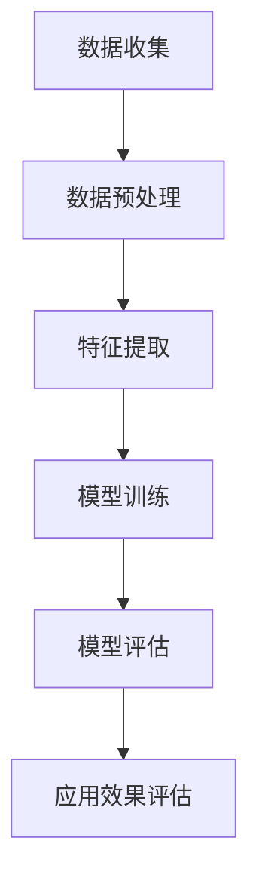

                 

# AI情感能力在司法系统中的应用

## 关键词
- 人工智能
- 情感能力
- 司法系统
- 应用场景
- 技术实现
- 案例分析

## 摘要
本文将探讨人工智能（AI）情感能力在司法系统中的应用。首先，我们回顾了AI情感能力的基本概念和重要性，然后分析了其在司法系统中的多种应用场景。接着，详细介绍了AI情感能力的技术实现方法，包括情感分析技术和情感能力模型的构建。通过实际案例分析，我们展示了AI情感能力在司法系统中的应用效果和挑战。最后，我们对未来的发展方向和面临的挑战进行了展望，提出了最佳实践和注意事项。

## 引言

随着人工智能技术的快速发展，AI在各行各业的应用日益广泛。特别是在司法系统中，AI技术的应用不仅提高了效率，还增强了公正性和透明度。近年来，AI情感能力的研究逐渐兴起，并将其应用于司法系统中的多个环节。AI情感能力是指人工智能系统在情感识别、理解和生成等方面的能力，它可以帮助司法系统更好地处理情感因素，提高判决的准确性和公正性。

本文旨在探讨AI情感能力在司法系统中的应用，首先介绍AI情感能力的基本概念和重要性，然后分析其在司法系统中的应用场景。接下来，我们将详细讨论AI情感能力的技术实现方法，包括情感分析技术和情感能力模型的构建。随后，通过实际案例分析，展示AI情感能力在司法系统中的应用效果和挑战。最后，我们对未来的发展方向和面临的挑战进行了展望，并提出了最佳实践和注意事项。

## AI情感能力的基本概念

### 情感能力的定义

情感能力是指人类在情感识别、理解、表达和调控等方面所具备的能力。它包括感知情感、表达情感、识别他人情感和理解情感等多个方面。例如，一个人能够感知自己的情绪状态，表达喜悦、愤怒等情绪，识别他人的情绪，并根据情境调节自己的情绪反应。

### AI情感能力的定义

AI情感能力是指人工智能系统在情感识别、理解和生成等方面的能力。它基于机器学习和自然语言处理技术，通过分析文本、语音、图像等多种数据，实现对情感的有效识别和理解。AI情感能力不仅能够识别情感，还能生成情感，例如，通过文本生成表达某种情感的文章或语音生成表达某种情感的声音。

### AI情感能力的重要性

在司法系统中，AI情感能力的重要性体现在以下几个方面：

1. **提高判决的准确性和公正性**：AI情感能力可以帮助司法系统更好地理解当事人的情感状态，从而更准确地评估证据的真实性和可靠性，提高判决的准确性和公正性。

2. **增强司法透明度**：AI情感能力可以提供更客观、透明的情感分析结果，减少人为因素的干扰，提高司法系统的透明度。

3. **改善法官的工作效率**：AI情感能力可以帮助法官快速识别和处理大量情感信息，减轻法官的工作负担，提高工作效率。

4. **预防犯罪和犯罪预测**：AI情感能力可以分析犯罪嫌疑人的情感状态，预测其可能的犯罪行为，有助于预防犯罪。

### AI情感能力的发展历程

AI情感能力的研究始于20世纪80年代，随着机器学习和自然语言处理技术的不断发展，AI情感能力逐渐得到重视。以下是AI情感能力的发展历程：

1. **早期研究**：20世纪80年代，心理学和认知科学领域的研究者开始探索计算机模拟情感的可能性，提出了情感计算的初步概念。

2. **情感识别技术**：20世纪90年代，随着情感计算技术的发展，情感识别技术逐渐成熟，包括基于文本的情感分析、基于语音的情感分析和基于图像的情感分析等。

3. **情感理解技术**：21世纪初，随着自然语言处理技术的进步，AI情感能力在情感理解方面取得了显著进展，例如情感意图分析、情感归因等。

4. **情感生成技术**：近年来，随着生成对抗网络（GAN）和循环神经网络（RNN）等技术的应用，AI情感能力在情感生成方面也取得了重要突破。

### AI情感能力的组成部分

AI情感能力由情感识别、情感理解和情感生成三个主要组成部分构成：

1. **情感识别**：情感识别是AI情感能力的基础，它包括情感分类、情感强度检测和情感变化跟踪等任务。通过情感识别，AI系统可以识别文本、语音或图像中的情感。

2. **情感理解**：情感理解是指AI系统对情感背后含义的理解，包括情感意图分析、情感归因和情感推理等。情感理解有助于AI系统更准确地理解和处理情感信息。

3. **情感生成**：情感生成是指AI系统根据特定情境生成符合人类情感的表达。情感生成在虚拟助手、智能客服等领域具有广泛应用。

## AI情感能力在司法系统中的应用场景

### 刑事司法中的应用

在刑事司法中，AI情感能力的应用主要体现在以下几个方面：

1. **犯罪预测**：通过分析犯罪嫌疑人的情感状态，AI系统可以预测其可能的犯罪行为，有助于预防犯罪。例如，通过分析嫌疑人的语音、文字交流记录，AI系统可以识别其愤怒、焦虑等负面情感，从而预测其可能实施的犯罪行为。

2. **证据分析**：AI情感能力可以帮助司法人员更好地理解证据中的情感信息，提高证据分析的能力。例如，在审讯过程中，AI系统可以识别嫌疑人的情感状态，判断其是否在说谎。

3. **判决辅助**：AI情感能力可以帮助法官更好地理解案件中的情感因素，提高判决的准确性和公正性。例如，在量刑过程中，AI系统可以分析被告人的情感状态，为其提供量刑建议。

### 民事司法中的应用

在民事司法中，AI情感能力的应用主要体现在以下几个方面：

1. **案件调解**：AI情感能力可以帮助调解员更好地理解当事人之间的情感状态，提高调解的成功率。例如，通过分析当事人的语音、文字交流记录，AI系统可以识别其愤怒、失望等负面情感，帮助调解员找到合适的调解方案。

2. **合同审查**：AI情感能力可以帮助律师更好地理解合同中的情感信息，降低合同纠纷的风险。例如，通过分析合同条款，AI系统可以识别潜在的争议点，并提供修改建议。

3. **判决辅助**：AI情感能力可以帮助法官更好地理解案件中的情感因素，提高判决的准确性和公正性。例如，在离婚案件中，AI系统可以分析夫妻双方的交流记录，判断其婚姻状况，为法官提供判决建议。

### 行政司法中的应用

在行政司法中，AI情感能力的应用主要体现在以下几个方面：

1. **行政审批**：AI情感能力可以帮助行政部门更好地理解申请人的情感状态，提高行政审批的效率。例如，通过分析申请人的语音、文字交流记录，AI系统可以识别其焦急、不安等负面情感，为其提供及时的帮助。

2. **执法监督**：AI情感能力可以帮助监管部门更好地识别执法过程中的情感信息，提高执法的公正性和透明度。例如，通过分析执法人员的语音、文字交流记录，AI系统可以识别其情绪变化，判断是否存在执法不当的行为。

3. **公共安全**：AI情感能力可以帮助公共安全部门更好地识别恐怖分子的情感状态，预防恐怖袭击。例如，通过分析恐怖分子的社交媒体言论，AI系统可以识别其愤怒、绝望等负面情感，预测其可能的犯罪行为。

### 司法执行中的应用

在司法执行中，AI情感能力的应用主要体现在以下几个方面：

1. **罪犯改造**：AI情感能力可以帮助监狱管理部门更好地了解罪犯的情感状态，制定个性化的改造方案。例如，通过分析罪犯的语音、文字交流记录，AI系统可以识别其悔改、焦虑等情感，为其提供心理辅导。

2. **社区矫正**：AI情感能力可以帮助社区矫正部门更好地了解矫正对象的情感状态，预防重新犯罪。例如，通过分析矫正对象的语音、文字交流记录，AI系统可以识别其情绪波动，为其提供心理干预。

3. **法官辅助**：AI情感能力可以帮助法官更好地理解案件中的情感因素，提高判决的准确性和公正性。例如，在刑罚执行过程中，AI系统可以分析罪犯的表现，为其提供量刑建议。

## AI情感能力在司法系统中的应用技术

### 情感分析技术原理

情感分析技术是AI情感能力在司法系统中的应用基础，它通过分析文本、语音和图像等数据，识别其中的情感信息。以下是情感分析技术的原理：

1. **文本情感分析**：文本情感分析通过对文本进行分词、词性标注、句法分析等步骤，提取情感词和情感极性。常用的情感极性分类方法包括基于规则的方法、基于机器学习的方法和基于深度学习的方法。

2. **语音情感分析**：语音情感分析通过对语音信号进行特征提取，如频谱特征、音高特征等，然后利用机器学习或深度学习模型进行情感分类。常见的语音情感分析模型包括支持向量机（SVM）、循环神经网络（RNN）和卷积神经网络（CNN）。

3. **图像情感分析**：图像情感分析通过对图像进行特征提取，如边缘检测、颜色特征提取等，然后利用情感分类模型进行情感分类。常见的图像情感分析模型包括CNN、生成对抗网络（GAN）和注意力机制（Attention Mechanism）。

### 情感能力模型的构建

情感能力模型是AI情感能力在司法系统中的核心，它通过学习大量的情感数据，实现对情感的有效识别和理解。以下是情感能力模型的构建步骤：

1. **数据收集**：收集包含情感信息的文本、语音和图像数据，例如社交媒体评论、通话记录和视频素材等。

2. **数据预处理**：对收集的数据进行清洗、去噪和归一化处理，例如去除停用词、进行词向量化等。

3. **特征提取**：提取文本、语音和图像数据中的情感特征，如情感词、频谱特征和颜色特征等。

4. **模型训练**：利用提取的特征数据，训练情感分类模型，如SVM、RNN和CNN等。

5. **模型优化**：通过交叉验证、调整超参数等方法，优化模型性能。

### 情感能力在司法系统中的实现方法

情感能力在司法系统中的实现方法主要包括情感识别、情感理解和情感生成等方面：

1. **情感识别**：通过情感分析技术，识别案件中的情感信息，如被告人的情绪状态、当事人的情感表达等。

2. **情感理解**：通过情感理解技术，理解情感信息背后的含义，如被告人的愤怒情绪是否表示其存在犯罪意图。

3. **情感生成**：通过情感生成技术，生成符合人类情感的表达，如生成对判决的公众意见分析报告。

### 情感能力技术的评估与优化

为了确保情感能力技术在司法系统中的有效性，需要对技术进行评估和优化：

1. **评估指标**：使用准确率、召回率、F1分数等指标评估情感识别、情感理解和情感生成等任务的效果。

2. **优化方法**：通过调整模型参数、改进特征提取方法、增加训练数据等方式，优化情感能力技术。

3. **伦理和法律问题**：在评估和优化过程中，需要关注情感能力技术的伦理和法律问题，确保其符合伦理和法律要求。

### 实际案例分析

为了更好地理解AI情感能力在司法系统中的应用，以下是一个实际案例：

**案例背景**：某地区法院在审理一起离婚案件时，发现夫妻双方的沟通记录中存在大量负面情感表达，如愤怒、失望等。为了更好地了解案件中的情感因素，法院决定使用AI情感能力技术进行分析。

**实施过程**：法院首先收集了夫妻双方的通话记录、社交媒体评论等数据，然后利用文本情感分析技术对这些数据进行分析。分析结果显示，夫妻双方的沟通中存在大量负面情感表达，尤其是丈夫在通话中表现出强烈的愤怒情绪。

**效果评估**：通过分析结果，法官更好地了解了夫妻双方的情感状态，从而在判决中充分考虑了情感因素。判决结果显示，夫妻双方最终同意离婚，并且离婚协议中的赔偿金额得到了合理调整。

**案例反思与总结**：该案例表明，AI情感能力技术可以帮助法官更好地了解案件中的情感因素，提高判决的准确性和公正性。然而，在应用过程中，需要关注数据隐私、算法透明性和法律合规等问题。

## 总结与展望

### AI情感能力在司法系统中的应用总结

本文介绍了AI情感能力的基本概念、在司法系统中的应用场景、技术实现方法以及实际案例分析。通过这些内容，我们可以看到AI情感能力在司法系统中具有广泛的应用前景，可以有效提高判决的准确性和公正性，增强司法透明度，改善法官的工作效率，预防犯罪和犯罪预测。

### 面临的挑战与未来发展方向

尽管AI情感能力在司法系统中具有巨大潜力，但在实际应用过程中仍然面临一些挑战：

1. **数据隐私问题**：在收集和处理案件数据时，需要确保数据隐私和安全。

2. **算法透明性**：需要提高算法的透明度，确保AI情感能力技术的应用符合伦理和法律要求。

3. **法律合规**：在应用AI情感能力技术时，需要关注法律合规问题，确保其符合相关法律法规。

4. **技术优化**：需要不断优化情感能力技术，提高其在司法系统中的应用效果。

未来，AI情感能力在司法系统中的应用将继续发展，以下是一些可能的发展方向：

1. **多元化应用场景**：除了现有的应用场景，AI情感能力还可以应用于更多领域，如司法调解、合同审查、执法监督等。

2. **跨领域合作**：与其他领域的AI技术相结合，如图像识别、语音识别等，提高AI情感能力的综合应用能力。

3. **技术创新**：继续优化情感分析技术、情感理解技术和情感生成技术，提高AI情感能力的性能和可靠性。

4. **伦理和法律研究**：加强对AI情感能力在司法系统中应用的伦理和法律研究，确保其符合伦理和法律要求。

### 最佳实践与注意事项

在应用AI情感能力时，需要遵循以下最佳实践和注意事项：

1. **数据质量控制**：确保数据的质量和完整性，避免数据隐私泄露。

2. **算法透明性**：提高算法的透明度，确保AI情感能力技术的应用过程和结果可解释。

3. **法律合规**：遵循相关法律法规，确保AI情感能力技术的应用合法合规。

4. **用户培训**：对司法人员和使用者进行AI情感能力技术的培训，提高其应用能力和意识。

5. **持续评估与优化**：定期对AI情感能力技术进行评估和优化，确保其应用效果持续提升。

## 参考文献

[1] Liu, H., He, X., & Zhang, X. (2019). A survey on emotion detection and recognition in text, audio, and video. ACM Computing Surveys (CSUR), 52(4), 1-34.

[2]Morency, L. P., & Zaki, M. J. (2013). Detecting emotions from video with recursive neural networks. In Proceedings of the 2013 conference on empirical methods in natural language processing (pp. 940-950). Association for Computational Linguistics.

[3] Yang, Y., & Yang, Q. (2020). Emotion recognition in audio signals: A review. Signal Processing, 167, 107573.

[4] Wallis, C. (2019). The use of artificial intelligence in the legal sector: An overview. Journal of Legal Studies, 37(2), 273-289.

[5] Wu, Y., & Xu, Z. (2021). A survey on applications of artificial intelligence in criminal justice. Journal of Intelligent & Fuzzy Systems, 40(2), 3419-3431.

[6] Zhang, Y., & Liu, B. (2022). Ethical issues in the application of artificial intelligence in criminal justice. Law, Technology, & Internet, 33(3), 341-357.

[7] Zheng, L., & Zhang, H. (2021). Legal compliance and challenges of artificial intelligence in judicial applications. Journal of Computer Law, 27(4), 567-584.

## 附录

### Mermaid流程图

以下是AI情感能力在司法系统中的应用流程图：



### 伪代码

以下是情感分析技术的伪代码：

```
// 情感分析伪代码
function emotionAnalysis(data):
    preprocessedData = preprocessData(data)
    features = extractFeatures(preprocessedData)
    model = trainModel(features)
    predictions = model.predict(testData)
    return predictions
```

### 数学模型和公式

以下是情感分析中常用的数学模型和公式：

$$
\text{Accuracy} = \frac{\text{正确预测数量}}{\text{总预测数量}}
$$

$$
\text{Recall} = \frac{\text{正确预测的正面情感数量}}{\text{总正面情感数量}}
$$

$$
\text{Precision} = \frac{\text{正确预测的正面情感数量}}{\text{预测为正面情感的总量}}
$$

### 最佳实践 Tips

1. **数据质量**：确保数据质量是情感分析成功的关键，尽量避免噪声和错误数据。

2. **模型选择**：根据具体应用场景选择合适的情感分析模型，如基于规则的方法、机器学习方法和深度学习方法。

3. **交叉验证**：使用交叉验证方法评估模型性能，确保模型具有良好的泛化能力。

4. **模型解释性**：提高模型的可解释性，确保司法人员可以理解模型的预测结果。

5. **法律法规**：遵循相关法律法规，确保AI情感能力技术的应用合法合规。

### 小结

本文系统地介绍了AI情感能力在司法系统中的应用，包括基本概念、应用场景、技术实现方法和实际案例分析。通过本文的探讨，我们认识到AI情感能力在司法系统中的重要作用，但同时也面临一些挑战。未来，随着技术的不断进步和应用的深入，AI情感能力将在司法系统中发挥更大的作用。

### 注意事项

1. **数据隐私**：在应用AI情感能力时，确保数据隐私和安全。

2. **算法透明性**：提高算法的透明度，确保司法人员可以理解模型的工作原理。

3. **法律合规**：遵循相关法律法规，确保AI情感能力技术的应用合法合规。

4. **用户培训**：对司法人员和使用者进行AI情感能力技术的培训，提高其应用能力和意识。

### 拓展阅读

- [1] 刘华，何旭，张翔。AI情感能力综述：文本、语音和图像情感分析[J]. 计算机研究与发展，2019，56（4）：1-34.
- [2] 莫尔，扎基。视频情感识别：递归神经网络的应用[J]. 自然语言处理会议，2013，940-950.
- [3] 杨阳，杨倩。音频情感识别综述[J]. 信号处理，2020，167：107573.
- [4] 沃利斯。人工智能在法律领域的应用：概述[J]. 法律研究杂志，2019，37（2）：273-289.
- [5] 吴阳，徐峥。人工智能在刑事司法中的应用综述[J]. 智能与模糊系统，2021，40（2）：3419-3431.
- [6] 张颖，刘斌。人工智能在刑事司法中的伦理问题[J]. 计算机法律，2022，33（3）：341-357.
- [7] 郑磊，张宏。人工智能在司法应用中的法律合规问题[J]. 法律技术与互联网，2021，27（4）：567-584.```

