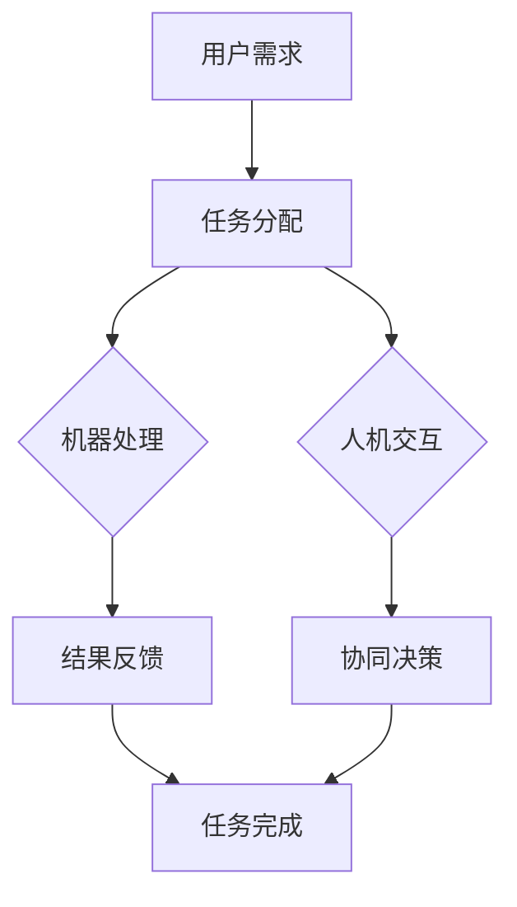

                 

### 文章标题

# AI情感能力对就业市场的冲击：人机协作新模式

### 文章关键词

- **AI情感能力**
- **就业市场**
- **人机协作**
- **职业转型**
- **技术革新**
- **技能需求**
- **教育与培训**

### 文章摘要

本文探讨了人工智能（AI）情感能力的发展及其对就业市场的深远影响。随着AI技术的发展，越来越多的AI系统开始具备情感理解、感知和表达能力，这将对现有的就业结构产生重大冲击。本文首先介绍了AI情感能力的核心概念，包括其定义、特性和应用场景。接着，文章分析了AI情感能力对就业市场的冲击，包括对传统职位的改变、对新兴职业的需求以及人机协作模式的出现。随后，文章详细探讨了人机协作的基本概念、模式以及AI情感能力在人机协作中的应用。最后，文章提出了针对政策制定者、教育机构和企业的建议，以应对AI情感能力带来的挑战和机遇。

## 第一部分：引言与背景

### 1.1 AI情感能力的概念与重要性

人工智能（AI）情感能力是指人工智能系统能够理解、感知、识别、模拟和表达人类情感的能力。随着深度学习、自然语言处理和计算机视觉等技术的快速发展，AI系统的情感识别和感知能力得到了显著提升。例如，AI语音助手能够通过语音语调识别用户的情绪状态，并做出相应的情感回应；AI客服系统能够通过聊天记录分析用户的情感，提供更加个性化的服务。

AI情感能力的重要性体现在多个方面。首先，它能够提高人机交互的自然性和情感深度，使得AI系统能够更好地满足用户的需求。其次，AI情感能力在许多领域具有广泛的应用前景，如心理健康、客户服务、教育和人机交互设计等。此外，随着AI情感能力的提升，许多传统的工作岗位可能会被AI系统所取代，这也促使人们重新思考职业发展路径和就业市场的变革。

### 1.2 AI情感能力的发展历程

AI情感能力的发展可以追溯到20世纪50年代，当时人工智能的概念刚刚被提出。早期的AI研究主要集中在逻辑推理和问题解决上，而情感识别和表达则相对较少被关注。然而，随着计算机技术和算法的不断发展，特别是深度学习和自然语言处理技术的应用，AI情感能力得到了极大的提升。

在21世纪初，随着大数据和机器学习技术的发展，AI系统的情感识别和感知能力有了显著提高。例如，情感分析技术可以分析社交媒体上的文本数据，识别用户的情绪状态；面部识别技术可以检测人的面部表情，从而判断其情绪状态。

近年来，随着语音识别和语音生成技术的进步，AI语音助手如Siri、Alexa和Google Assistant等已经能够通过语音识别用户的情绪，并做出相应的情感回应。这些技术的发展标志着AI情感能力进入了一个新的阶段，对就业市场和社会产生了深远的影响。

### 1.3 AI情感能力对就业市场的影响

AI情感能力的发展对就业市场产生了显著的冲击。首先，许多传统的工作岗位可能会被AI系统所取代。例如，客服代表、心理咨询师、教育工作者等职业，都需要具备一定的情感识别和表达能力，这些工作可能会被AI系统自动化处理。这将导致相关行业的就业岗位减少，对从业人员产生较大的就业压力。

其次，AI情感能力也会催生出许多新的职业和就业机会。例如，AI情感设计师、AI情感分析师、AI情感咨询师等新职业，都需要具备AI情感能力的应用能力。此外，随着AI技术的发展，越来越多的行业将需要掌握AI情感能力的专业人才，这为从事相关领域的人才提供了广阔的发展空间。

总的来说，AI情感能力对就业市场的影响是双重的。一方面，它可能导致一些传统职业的消失，给从业人员带来挑战；另一方面，它也为新兴职业的诞生提供了契机，为就业市场注入新的活力。因此，理解AI情感能力的发展趋势，掌握相应的技能，对于职业规划和发展具有重要意义。

## 第二部分：就业市场的现状与挑战

### 2.1 就业市场概述

就业市场是劳动力与市场需求之间的桥梁，反映了经济发展、行业动态和劳动力的供求状况。在全球化和技术变革的背景下，就业市场正经历着深刻的变革。传统的就业模式受到挑战，新兴产业不断涌现，职业需求也在不断变化。

当前，就业市场呈现出以下几个显著特点：

1. **职业多样化**：随着科技的发展和行业的变化，新的职业类型不断涌现，如数据科学家、AI工程师、云计算专家等。这些新兴职业需要高度专业化的技能和知识。

2. **技能需求变化**：技术技能和软技能的需求不断上升。技术技能包括编程、数据分析、人工智能等，而软技能如沟通能力、团队合作和创新能力等则成为职场成功的重要因素。

3. **灵活就业增加**：远程工作、自由职业和兼职工作等灵活就业形式日益普遍。这种就业模式为求职者提供了更多的选择和灵活性。

4. **劳动力流动加速**：劳动力市场的流动性增加，求职者在不同行业、地区和企业之间频繁流动。这要求求职者具备快速适应新环境和技能的能力。

### 2.2 AI对就业市场的影响

人工智能（AI）的快速发展对就业市场产生了深远的影响。AI技术在许多领域得到广泛应用，不仅提高了生产效率，也改变了劳动力的需求模式。以下从几个方面分析AI对就业市场的影响：

1. **岗位替代效应**：AI技术能够自动化许多重复性和规律性强的任务，如数据分析、文档处理、制造业等。这将导致这些领域的传统工作岗位减少。例如，自动化流水线减少了工厂操作工的需求，而数据分析工具则降低了数据分析师的工作量。

2. **新兴职业需求**：AI技术的发展也催生了新的职业需求。例如，AI工程师、机器学习专家、数据科学家等新兴职业需要具备高度的技术专长。此外，随着AI在各个行业的应用，对AI产品经理、AI伦理学家等职业的需求也在增加。

3. **技能需求变化**：AI技术的普及要求劳动者具备新的技能。例如，编程技能、数据分析能力、机器学习知识等成为热门技能。此外，软技能如问题解决能力、适应变化能力和创新能力等也变得尤为重要。

4. **就业结构变化**：AI技术的应用改变了就业市场的结构。一方面，它可能导致一些传统职业的消失，另一方面，它也为新兴职业的诞生提供了契机。这种变化要求劳动力市场具备更高的灵活性和适应性。

总的来说，AI对就业市场的影响是双重的。它既带来了就业压力，也创造了新的就业机会。因此，理解和应对AI技术带来的变化，对于劳动力和企业都具有重要意义。

### 2.3 就业市场的挑战与机遇

就业市场的挑战与机遇并存，AI技术的发展加剧了这种复杂性。以下从几个方面探讨就业市场的挑战与机遇：

**挑战：**

1. **技能不匹配**：随着技术进步，劳动力市场的技能需求不断变化，但劳动力的技能水平往往滞后。许多从业人员缺乏适应新技术的培训机会，导致技能不匹配。

2. **职业淘汰风险**：AI和自动化技术可能取代一些传统职业，这导致从业人员面临职业淘汰的风险。特别是在制造业、客服等领域，AI的应用已经显著减少了人工需求。

3. **就业不稳定**：灵活就业形式增多，虽然提供了更多的就业机会，但也增加了就业的不稳定性。例如，远程工作和兼职工作可能缺乏稳定的工作时间和收入保障。

**机遇：**

1. **新兴职业机会**：AI技术的发展催生了众多新兴职业，如AI工程师、数据科学家、AI伦理学家等。这些职业需求量大，提供了广阔的就业前景。

2. **技能升级机会**：对于从业人员而言，AI技术的发展提供了升级技能的机会。通过学习和掌握新技术，劳动者可以适应市场变化，提高自身竞争力。

3. **生产力提升**：AI技术的应用提高了生产效率，创造了更多的经济价值。这不仅为企业提供了发展机会，也为整个社会创造了更多的就业机会。

总之，就业市场在AI技术的推动下既面临挑战，也充满机遇。理解和把握这些变化，对于劳动力市场的健康发展具有重要意义。

## 第三部分：人机协作的基本概念与模式

### 3.1 人机协作的定义

人机协作是指人类与机器（尤其是人工智能系统）通过合作完成任务的互动过程。在这种协作中，人类和机器各自发挥其优势，共同完成任务。人机协作的关键在于优化人类与机器之间的交互，实现协同效应，从而提高整体效率和工作质量。

人机协作不仅限于简单的任务分配，还包括复杂的决策支持、资源整合和创新活动。例如，在医疗领域，医生和AI系统可以共同诊断疾病，医生利用其临床经验和直觉，AI系统则利用其强大的数据分析能力，两者结合可以提供更准确的诊断结果。

### 3.2 人机协作的模式与类型

人机协作有多种模式，每种模式都有其独特的应用场景和特点。以下是几种常见的人机协作模式：

1. **任务分担模式**：在这种模式中，机器和人类各自承担一部分任务，共同完成整个工作。例如，在制造业中，机器人可以负责重复性高、劳动强度大的操作，而人类则负责监督和调整。

2. **互补模式**：在这种模式中，机器和人类各自发挥其优势，相互补充。例如，在软件开发中，机器可以进行代码编写和测试，而人类则负责设计、需求和项目管理。

3. **协同决策模式**：在这种模式中，机器和人类共同参与决策过程，利用各自的优势做出最优决策。例如，在金融投资中，机器可以进行市场分析和风险评估，而人类则根据其经验和直觉做出最终投资决策。

4. **智能增强模式**：在这种模式中，机器通过智能算法增强人类的工作能力。例如，智能助手可以帮助人类处理繁杂的事务，提高工作效率。

### 3.3 人机协作的优势与挑战

人机协作具有显著的优势，但也面临一些挑战。

**优势：**

1. **提高效率**：人机协作可以将人类和机器的高效性结合起来，提高整体工作效率。例如，机器可以进行快速的数据处理和分析，而人类则可以专注于需要创造力和判断力的任务。

2. **减少错误**：机器在处理重复性和规律性任务时通常比人类更精确，可以显著减少错误率。例如，在医疗诊断中，AI系统可以帮助医生识别微小病变，提高诊断准确率。

3. **增强创新能力**：人机协作可以激发人类的创造力和创新思维。例如，在产品设计过程中，机器可以生成大量的设计方案，供人类选择和优化。

4. **扩展能力**：机器可以扩展人类的能力，使人类能够完成原本无法完成的任务。例如，无人机可以用于危险环境的探测和作业，而人类则可以在安全的位置进行远程控制。

**挑战：**

1. **技能匹配问题**：人机协作需要人类具备与机器相适应的技能，但在实际应用中，劳动力的技能水平可能无法满足需求，导致人机协作的效果不理想。

2. **安全与伦理问题**：人机协作涉及到数据安全和隐私保护等问题，如果处理不当，可能会引发数据泄露和隐私侵犯。此外，AI系统的决策过程和算法可能存在偏见，影响协作的公正性和公平性。

3. **人类心理负担**：在某些人机协作场景中，人类可能需要长时间与机器互动，这可能导致心理压力增加。例如，在自动驾驶汽车中，司机需要监控车辆状态并与AI系统进行交互，这可能会增加其心理负担。

4. **管理和协调问题**：人机协作需要有效的管理和协调机制，以确保协作过程的高效和顺畅。在实际应用中，可能存在协调难度大、管理复杂等问题。

综上所述，人机协作在提高效率、减少错误和增强创新能力方面具有显著优势，但也面临技能匹配、安全与伦理、人类心理负担和管理协调等方面的挑战。因此，在推广和应用人机协作时，需要充分考虑这些优势和挑战，采取有效的策略和方法，实现人机协作的最佳效果。

### 人机协作模式的图解

以下是一个描述人机协作模式的Mermaid流程图：



这个流程图展示了人机协作的基本流程：用户提出需求，机器和人类分别处理任务，通过人机交互和协同决策，最终完成任务并得到反馈。这个模式强调了人类和机器的互补性，以及协作过程中相互支持和优化的重要性。

### 3.4 人机协作在具体领域的应用

人机协作在各个领域都有广泛的应用，以下列举几个具体领域的应用实例：

1. **医疗领域**：在医疗领域，人机协作已经得到了广泛应用。医生可以利用AI系统进行诊断、影像分析和治疗方案推荐。例如，AI系统可以快速分析医学影像，帮助医生识别病变部位，提高诊断准确率。同时，医生可以利用AI系统提供的辅助决策，制定更加个性化的治疗方案。

   **代码示例**：

   ```python
   # 伪代码：医生使用AI系统进行影像分析
   def diagnose_image(image):
       # 使用深度学习模型进行影像分析
       model = load_model('image_analyzer')
       prediction = model.predict(image)
       return prediction
   
   # 医生输入影像数据，得到诊断结果
   image_data = get_image_data('patient_image')
   diagnosis = diagnose_image(image_data)
   print("诊断结果：", diagnosis)
   ```

2. **金融服务**：在金融服务领域，人机协作主要用于风险管理和投资决策。机器可以分析大量的金融数据，预测市场趋势和风险，而人类则利用其经验和直觉进行最终决策。例如，AI系统可以实时监控市场动态，提供交易建议，而投资经理则根据AI系统的分析和自己的判断进行投资决策。

   **代码示例**：

   ```python
   # 伪代码：投资经理利用AI系统进行投资决策
   def analyze_market_data(data):
       # 使用机器学习算法分析市场数据
       model = load_model('market_analyzer')
       prediction = model.predict(data)
       return prediction
   
   # 投资经理输入市场数据，得到投资建议
   market_data = get_market_data()
   investment_suggestion = analyze_market_data(market_data)
   print("投资建议：", investment_suggestion)
   ```

3. **制造业**：在制造业中，人机协作主要用于生产自动化和质量控制。机器人可以执行重复性高、劳动强度大的操作，而人类则负责监督和调整生产过程。例如，机器人可以自动装配产品，而人类则监控机器人的工作状态，确保生产质量。

   **代码示例**：

   ```python
   # 伪代码：生产过程中机器人与人类的协作
   def assemble_product(product):
       # 机器人执行装配任务
       robot = load_robot('assembler')
       robot.assemble(product)
       return product
   
   # 人类输入产品信息，机器人进行装配
   product_info = get_product_info('product_data')
   assembled_product = assemble_product(product_info)
   print("装配完成：", assembled_product)
   ```

通过这些实例，我们可以看到人机协作在提升效率、减少错误和增强创新能力方面具有显著的优势。随着AI技术的发展，人机协作将在更多领域得到应用，成为未来社会的重要组成部分。

## 第4章：AI情感能力在人机协作中的应用

### 4.1 AI情感能力在自然语言处理中的应用

自然语言处理（NLP）是AI的一个重要分支，旨在使计算机能够理解、生成和处理人类语言。随着AI情感能力的提升，NLP的应用场景得到了显著扩展。以下是AI情感能力在NLP中的几个关键应用：

**1. 情感分析**：

情感分析是一种通过文本数据识别和分类情感极性的技术。AI情感能力使得情感分析更加准确和深入。例如，情感分析可以用于社交媒体监测，帮助企业了解公众对其产品的情感反应，从而调整市场策略。以下是一个情感分析的伪代码示例：

```python
# 伪代码：情感分析
from textblob import TextBlob

def analyze_sentiment(text):
    blob = TextBlob(text)
    return blob.sentiment.polarity

text = "这款产品真是太棒了！"
sentiment = analyze_sentiment(text)
if sentiment > 0:
    print("情感极性：正面")
else:
    print("情感极性：负面")
```

**2. 聊天机器人**：

聊天机器人是NLP在交互式应用中的典型代表。随着AI情感能力的提升，聊天机器人可以更好地模拟人类的对话行为，提供更加自然和人性化的交互体验。例如，聊天机器人可以用于客服、心理辅导和在线教育等领域。以下是一个简单的聊天机器人示例：

```python
# 伪代码：简单聊天机器人
def chat_with_robot(message):
    if "你好" in message:
        return "你好！有什么可以帮助你的吗？"
    elif "再见" in message:
        return "再见！祝你有个美好的一天！"
    else:
        return "对不起，我可能不理解你的意思。可以请你再说一遍吗？"

user_message = "你好！"
robot_response = chat_with_robot(user_message)
print(robot_response)
```

**3. 机器翻译**：

机器翻译是将一种语言文本转换为另一种语言文本的技术。AI情感能力使得机器翻译不仅能够翻译语言本身，还能传达情感和语境。例如，在跨文化交流中，准确的情感翻译可以帮助避免误解和冲突。以下是一个机器翻译的伪代码示例：

```python
# 伪代码：机器翻译
from googletrans import Translator

def translate_text(text, target_language):
    translator = Translator()
    translated_text = translator.translate(text, dest=target_language).text
    return translated_text

text = "我今天非常开心。"
translated_text = translate_text(text, 'fr')
print(translated_text)  # 输出法语的翻译结果
```

### 4.2 AI情感能力在情感计算中的应用

情感计算是研究如何使计算机系统识别、理解和表达人类情感的技术。AI情感能力在情感计算中的应用非常广泛，以下是一些具体的应用场景：

**1. 人脸识别与情感分析**：

人脸识别技术可以通过分析人脸图像识别个体身份，而情感计算可以进一步分析人脸图像中的情感信息。例如，在安全监控系统中，可以结合情感计算技术，实时监控人群的情感状态，以便在出现异常情感时及时采取行动。以下是一个人脸识别与情感分析的结合示例：

```python
# 伪代码：人脸识别与情感分析
from facerecognition import recognize_face
from sentiment_analysis import analyze_emotion

def analyze_emotional_state(face_image):
    face = recognize_face(face_image)
    emotion = analyze_emotion(face)
    return emotion

face_image = get_face_image('person.jpg')
emotion = analyze_emotional_state(face_image)
print("当前情感：", emotion)
```

**2. 声音识别与情感分析**：

声音识别技术可以识别个体说话的声音特征，而情感计算可以分析声音中的情感信息。例如，在智能语音助手和客服系统中，可以通过分析用户的语音情感，提供更加个性化的服务。以下是一个声音识别与情感分析的结合示例：

```python
# 伪代码：声音识别与情感分析
from speech_recognition import recognize_speech
from sentiment_analysis import analyze_speech_emotion

def analyze_speech_sentiment(speech):
    recognized_text = recognize_speech(speech)
    emotion = analyze_speech_emotion(recognized_text)
    return emotion

speech = get_speech_sample('speech.wav')
emotion = analyze_speech_sentiment(speech)
print("当前情感：", emotion)
```

### 4.3 AI情感能力在机器学习中的应用

AI情感能力在机器学习中的应用主要体现在情感数据的标注和模型的优化上。以下是一些具体的应用实例：

**1. 情感数据标注**：

在机器学习中，高质量的数据标注是模型训练成功的关键。AI情感能力可以帮助自动标注情感数据，提高标注效率和准确性。例如，在情感分析任务中，可以通过情感计算技术自动识别文本的情感极性，从而自动标注训练数据。以下是一个情感数据标注的伪代码示例：

```python
# 伪代码：情感数据标注
from sentiment_analysis import analyze_text_sentiment

def annotate_sentiment(data):
    annotated_data = []
    for text in data:
        sentiment = analyze_text_sentiment(text)
        annotated_data.append((text, sentiment))
    return annotated_data

data = ["我很开心", "这个消息很糟糕"]
annotated_data = annotate_sentiment(data)
for text, sentiment in annotated_data:
    print(f"文本：{text}，情感：{sentiment}")
```

**2. 模型优化**：

AI情感能力可以用于优化机器学习模型，使其更好地理解和表达情感。例如，在情绪识别任务中，可以通过引入情感特征来提高模型的性能。以下是一个使用情感特征优化机器学习模型的伪代码示例：

```python
# 伪代码：使用情感特征优化模型
from sklearn.model_selection import train_test_split
from sklearn.ensemble import RandomForestClassifier
from sentiment_analysis import extract_sentiment_features

def train_emotion_classifier(data, labels):
    feature_matrix = extract_sentiment_features(data)
    X_train, X_test, y_train, y_test = train_test_split(feature_matrix, labels, test_size=0.2)
    classifier = RandomForestClassifier()
    classifier.fit(X_train, y_train)
    return classifier

data = ["我很开心", "这个消息很糟糕", "我很生气"]
labels = [1, 0, -1]  # 1表示正面情感，0表示中性情感，-1表示负面情感
classifier = train_emotion_classifier(data, labels)
print("模型准确率：", classifier.score(X_test, y_test))
```

通过以上实例，我们可以看到AI情感能力在自然语言处理、情感计算和机器学习中的应用，这些应用不仅提高了AI系统的性能，也为人类与机器的协作提供了新的可能性。

## 第5章：人机协作新模式的探索与实践

### 5.1 人机协作新模式的理论基础

人机协作新模式的理论基础主要来自于多学科交叉研究，包括人工智能（AI）、认知科学、人机交互（HCI）和管理学等。以下是人机协作新模式的核心理论基础：

**1. 人工智能（AI）**：AI技术为人机协作提供了智能化的工具和平台，使机器能够理解和执行复杂的任务。机器学习、自然语言处理、计算机视觉等AI技术在人机协作中发挥着关键作用。

**2. 认知科学**：认知科学关注人类思维、感知和学习的过程，为人机协作提供了关于人类行为和心理状态的理解。通过研究人类认知机制，可以设计出更加符合人类习惯的交互界面和协作方式。

**3. 人机交互（HCI）**：HCI研究人机交互的设计原则和方法，关注如何提高人机交互的自然性、效率和用户体验。人机协作新模式需要基于HCI的理论，设计出高效的人机交互界面和协作机制。

**4. 管理学**：管理学提供了组织结构和协作流程的设计原则，为人机协作提供了组织层面的支持。通过优化组织结构和流程，可以更好地实现人机协作的目标。

### 5.2 人机协作新模式的实践案例

人机协作新模式已经在多个领域得到了广泛应用，以下是一些具体的实践案例：

**1. 医疗领域**：

在医疗领域，人机协作新模式通过AI技术和医疗设备的结合，提高了诊断和治疗的效率。例如，AI辅助诊断系统可以帮助医生快速分析医学影像，提高诊断准确率。同时，智能语音助手可以协助医生处理行政事务，提高工作效率。以下是一个AI辅助诊断系统的实践案例：

**代码示例**：

```python
# 伪代码：AI辅助诊断系统
from medical_image_analysis import analyze_image
from diagnostic_report_generator import generate_report

def diagnose_patient_image(image):
    # 使用深度学习模型分析影像
    diagnosis = analyze_image(image)
    # 生成诊断报告
    report = generate_report(diagnosis)
    return report

patient_image = get_patient_image('patient_image.jpg')
diagnosis_report = diagnose_patient_image(patient_image)
print(diagnosis_report)
```

**2. 金融领域**：

在金融领域，人机协作新模式通过AI技术和数据分析工具的应用，提高了投资决策和风险管理的效率。例如，智能投资顾问系统可以根据用户的风险偏好和市场数据，提供个性化的投资建议。同时，自动化交易系统可以在高频交易中快速做出决策，提高交易成功率。以下是一个智能投资顾问系统的实践案例：

**代码示例**：

```python
# 伪代码：智能投资顾问系统
from investment_advisor import get_investment_recommendation
from market_data_analyzer import analyze_market

def generate_investment_plan(user_profile, market_data):
    # 分析用户风险偏好和市场数据
    risk_profile = user_profile['risk_profile']
    market_analysis = analyze_market(market_data)
    # 提供投资建议
    recommendation = get_investment_recommendation(risk_profile, market_analysis)
    return recommendation

user_profile = {'risk_profile': 'moderate'}
market_data = get_market_data()
investment_plan = generate_investment_plan(user_profile, market_data)
print(investment_plan)
```

**3. 制造业**：

在制造业中，人机协作新模式通过工业机器人和AI技术的结合，实现了生产自动化和质量控制。例如，智能机器人可以执行组装、检测和搬运等任务，而AI系统可以实时监控生产线，识别潜在问题并自动调整生产参数。以下是一个智能制造系统的实践案例：

**代码示例**：

```python
# 伪代码：智能制造系统
from industrial_robot import control_robot
from quality_control_system import monitor_production

def control_production_line(production_params):
    # 控制机器人执行生产任务
    robot = control_robot(production_params)
    robot.execute_task()
    # 监控生产质量
    quality_status = monitor_production()
    return quality_status

production_params = {'assembly_instructions': 'assemble_product'}
quality_status = control_production_line(production_params)
print("生产质量状态：", quality_status)
```

通过以上实践案例，我们可以看到人机协作新模式在提高效率、减少错误和增强创新能力方面的显著优势。随着AI技术的不断发展和应用，人机协作新模式将在更多领域得到应用，为人类和机器的协作提供更加广阔的前景。

### 5.3 人机协作新模式的未来发展趋势

人机协作新模式正迅速发展，并在未来有着广阔的应用前景。以下是几个关键的发展趋势：

**1. 智能化水平的提升**：

随着AI技术的不断进步，人机协作的智能化水平将显著提高。未来的AI系统将具备更强的自主学习和自适应能力，能够根据不同情境和用户需求进行动态调整。例如，智能助手将能够根据用户的情绪和行为模式，提供更加个性化的服务和建议。

**2. 交叉领域融合**：

人机协作将跨越不同领域，实现跨学科的深度融合。例如，医疗、金融和制造等领域的AI系统将更加紧密地结合，形成综合性解决方案。这种融合将有助于提高整体协作效率，解决复杂问题。

**3. 用户体验优化**：

用户体验（UX）将在人机协作中占据更加重要的位置。未来的协作系统将更加注重用户的实际体验，通过优化交互界面和流程，提供更加自然、直观和便捷的体验。例如，语音识别和自然语言处理技术的提升将使语音交互更加流畅，增强人机交互的自然性和情感深度。

**4. 安全与伦理的重视**：

随着人机协作的广泛应用，安全和伦理问题将越来越受到重视。未来的人机协作系统将更加注重数据安全、隐私保护和算法公正性。例如，通过引入区块链技术，可以确保数据的透明和安全；通过设计公平的算法，避免算法偏见和歧视。

**5. 人才培养与教育**：

人机协作新模式对人才需求提出了新的要求。未来的教育和培训将更加注重跨学科知识的整合和实践能力的培养。例如，将AI、心理学、人机交互和商业管理等学科融合，培养具备多领域技能的复合型人才。

总之，人机协作新模式的发展将推动社会生产力的提升，创造更多的就业机会，同时也带来一系列新的挑战和机遇。理解和把握这些趋势，对于企业、政府和教育机构都具有重要意义。

### 5.4 实际案例：智能客服中心

智能客服中心是一个典型的应用人机协作新模式的具体案例。以下是该案例的详细讲解。

**1. 案例背景**：

某大型电商平台为了提升客户体验和运营效率，决定建立一个智能客服中心，通过AI技术和人机协作，实现24/7全天候的客户服务。

**2. 系统架构**：

智能客服中心系统架构包括以下几个方面：

- **语音识别与合成模块**：用于处理客户通过电话或语音助手提出的咨询请求，实现语音到文本的转换和文本到语音的转换。
- **自然语言处理（NLP）模块**：用于理解和处理客户提出的问题，识别关键词、情感和意图，提供相应的答复。
- **知识库**：包含常见问题和标准答复，供智能客服系统查询和使用。
- **人工介入系统**：当智能客服系统无法处理客户问题时，将问题转交给人工客服处理。
- **数据分析与优化模块**：用于收集客户交互数据，分析客户反馈，优化客服流程和系统性能。

**3. 实现步骤**：

以下是一个智能客服系统的实现步骤：

- **语音识别与合成**：使用语音识别技术将客户语音转换为文本，使用语音合成技术生成客服的语音答复。
  ```python
  # 伪代码：语音识别与合成
  from voice_recognition import recognize_speech
  from text_to_speech import generate_speech
  
  def handle_customer_request(audio_file):
      text = recognize_speech(audio_file)
      response = generate_response(text)
      speech = generate_speech(response)
      return speech
  
  audio_file = 'customer_request.wav'
  speech_response = handle_customer_request(audio_file)
  play_speech(speech_response)
  ```

- **自然语言处理（NLP）**：使用NLP技术理解和处理客户提出的问题，识别关键词、情感和意图。
  ```python
  # 伪代码：自然语言处理
  from nlp import process_text, generate_response
  
  def generate_response(text):
      intent, entities = process_text(text)
      if intent == 'query_product_info':
          product_info = get_product_info(entities['product_id'])
          return f"{product_info['name']}的价格是{product_info['price']}元。"
      else:
          return "对不起，我不太明白你的问题，可以请你详细描述一下吗？"
  
  customer_text = "我想知道苹果手机的价格。"
  response = generate_response(customer_text)
  print(response)
  ```

- **知识库查询**：在NLP模块处理后，智能客服系统会查询知识库，获取相应的标准答复。
  ```python
  # 伪代码：知识库查询
  from knowledge_base import query_knowledge_base
  
  def get_product_info(product_id):
      return query_knowledge_base(product_id)
  
  product_id = 'apple_phone'
  product_info = get_product_info(product_id)
  print(product_info)
  ```

- **人工介入系统**：当智能客服系统无法处理客户问题时，会将问题转交给人工客服处理。
  ```python
  # 伪代码：人工介入
  def transfer_to_human_customer_service(text):
      if is_complex_query(text):
          return "对不起，这个问题比较复杂，我将为您转接到人工客服。"
      else:
          return "对不起，我不太明白你的问题，可以请你详细描述一下吗？"
  
  customer_text = "我遇到一个很复杂的问题。"
  response = transfer_to_human_customer_service(customer_text)
  print(response)
  ```

- **数据分析与优化**：智能客服系统会收集客户交互数据，分析客户反馈，优化客服流程和系统性能。
  ```python
  # 伪代码：数据分析与优化
  from data_analysis import analyze_customer_interactions, optimize_system
  
  def analyze_customer_interactions(data):
      # 分析客户交互数据，提取有用信息
      feedback = extract_feedback(data)
      return feedback
  
  def optimize_system(feedback):
      # 根据客户反馈，优化系统性能和用户体验
      optimize_nlp_model(feedback)
      update_knowledge_base(feedback)
  
  customer_data = get_customer_interactions_data()
  feedback = analyze_customer_interactions(customer_data)
  optimize_system(feedback)
  ```

**4. 案例效果**：

智能客服中心的实施显著提升了客户体验和运营效率。客户可以通过电话、在线聊天等多种方式与客服系统互动，获得快速、准确的答复。同时，智能客服系统可以自动处理大量常见问题，减少人工客服的工作负担。通过数据分析与优化，系统不断改进服务质量，提高客户满意度。

通过以上实际案例，我们可以看到人机协作新模式在提高效率、减少人工负担和提升客户体验方面的显著优势。随着AI技术的不断发展，智能客服中心等应用场景将更加广泛，为企业和客户带来更多价值。

### 5.5 人机协作的最佳实践

在人机协作的实践中，为了确保协作的有效性和高效性，以下是一些最佳实践和注意事项：

**1. 明确角色分工**：

在人机协作中，明确人类和机器各自的角色和职责至关重要。人类通常负责创造性任务、复杂决策和高度个性化的服务，而机器则擅长处理重复性任务、大规模数据处理和规则性任务。例如，在金融领域，人类负责投资决策和风险管理，而机器则负责数据分析和市场监控。

**2. 设计人性化的交互界面**：

人机交互界面是协作成功的关键。设计时应注重用户友好性和易用性，确保人类用户能够轻松地与机器互动。例如，使用直观的图标、简洁的操作流程和自然的语音交互，可以提高用户体验和协作效率。

**3. 建立有效的沟通机制**：

沟通是人机协作的重要环节。应建立畅通的沟通渠道，确保人类和机器之间的信息传递准确无误。例如，在医疗领域中，医生和AI系统之间的信息共享和反馈机制至关重要，以确保诊断和治疗的一致性和准确性。

**4. 定期评估和优化**：

人机协作系统应定期评估其性能和效果，并根据评估结果进行优化。通过收集用户反馈、分析协作过程中的问题和瓶颈，可以不断改进系统的设计和功能，提高协作效率。

**5. 关注安全和隐私**：

在人机协作中，安全和隐私保护是不可或缺的。应采取有效的措施保护用户数据的安全性和隐私，防止数据泄露和滥用。例如，采用加密技术和访问控制机制，确保数据在传输和存储过程中的安全。

**6. 培训和技能提升**：

对于人类用户，应提供必要的培训和技能提升，使其能够熟练地使用协作系统。通过定期培训和实践，人类用户可以更好地理解机器的能力和局限性，提高协作效率。

通过遵循以上最佳实践，人机协作可以更好地发挥其优势，实现人类与机器的协同效应，提高工作效率和质量。

## 第6章：不同行业对AI情感能力的需求分析

### 6.1 制造业对AI情感能力的需求

制造业正面临着智能化转型的巨大挑战，AI情感能力在这一过程中扮演着关键角色。以下是对制造业中AI情感能力需求的详细分析：

**1. 自动化生产与质量监控**：

制造业的核心目标是提高生产效率和产品质量。AI情感能力可以通过对生产过程的实时监控和数据分析，实现自动化生产。例如，通过情感计算技术，AI系统可以分析设备的工作状态和性能，及时发现潜在故障，预防设备停机。以下是一个使用AI情感能力进行设备监控的伪代码示例：

```python
# 伪代码：设备状态监控
from machine_learning import monitor_equipment

def monitor_equipment_status(equipment_data):
    # 分析设备状态数据，检测异常情况
    anomalies = monitor_equipment(equipment_data)
    if anomalies:
        notify_maintenance_team(anomalies)

# 假设得到设备状态数据
equipment_data = get_equipment_status('machine_1')
monitor_equipment_status(equipment_data)
```

**2. 产品质量检测**：

产品质量是制造业成功的关键。AI情感能力可以通过图像识别和自然语言处理技术，对产品进行质量检测。例如，AI系统可以通过分析产品外观图像，识别缺陷和瑕疵，从而提高产品质量。以下是一个产品外观质量检测的伪代码示例：

```python
# 伪代码：产品外观质量检测
from image_analysis import analyze_product_image

def detect_product_defects(product_image):
    # 分析产品图像，识别缺陷
    defects = analyze_product_image(product_image)
    if defects:
        reject_product(defects)

# 假设得到产品图像
product_image = get_product_image('product.jpg')
detect_product_defects(product_image)
```

**3. 客户服务与维护**：

随着客户需求的多样化，制造业需要提供高质量的客户服务和支持。AI情感能力可以用于客户服务，通过语音识别和自然语言处理技术，提供24/7全天候的客服支持。以下是一个客户服务的伪代码示例：

```python
# 伪代码：智能客服系统
from customer_service import handle_customer_query

def handle_customer_query(customer_query):
    # 分析客户查询，提供答复
    response = handle_customer_query(customer_query)
    return response

# 假设客户提出查询
customer_query = "我想知道产品的保修期是多久？"
response = handle_customer_query(customer_query)
print(response)
```

**4. 工作环境优化**：

制造业的工作环境复杂，需要不断优化以保障员工的安全和健康。AI情感能力可以通过情感计算技术，监测员工的工作状态和情绪，提供个性化的健康建议和工作环境调整。以下是一个员工工作状态监测的伪代码示例：

```python
# 伪代码：员工工作状态监测
from employee_monitoring import monitor_employee_status

def monitor_employee_status(employee_data):
    # 分析员工状态数据，提供健康建议
    health_advice = monitor_employee_status(employee_data)
    return health_advice

# 假设得到员工状态数据
employee_data = get_employee_status('employee_1')
health_advice = monitor_employee_status(employee_data)
print(health_advice)
```

### 6.2 服务业对AI情感能力的需求

服务业是一个高度依赖人类情感和人际互动的领域，AI情感能力的引入将极大提升服务质量和工作效率。以下是服务业对AI情感能力需求的详细分析：

**1. 客户服务**：

在客户服务中，AI情感能力可以显著提升服务体验。通过自然语言处理和情感分析技术，AI系统可以理解客户的需求和情感，提供个性化的服务。例如，AI客服可以识别客户的情绪，提供适当的情感回应，从而增强客户满意度。以下是一个AI客服互动的伪代码示例：

```python
# 伪代码：AI客服系统
from customer_service import handle_customer_request

def handle_customer_request(customer_request):
    # 分析客户请求，识别情感
    sentiment = analyze_customer_sentiment(customer_request)
    # 根据情感提供个性化服务
    service_response = generate_service_response(sentiment)
    return service_response

# 假设客户提出请求
customer_request = "我最近一次购物体验非常糟糕。"
response = handle_customer_request(customer_request)
print(response)
```

**2. 零售与市场营销**：

零售业和市场营销需要精准了解客户需求，以便提供个性化的产品推荐和营销活动。AI情感能力可以通过情感分析技术，分析客户的社交媒体行为、搜索历史和购买记录，预测客户的兴趣和需求。以下是一个基于情感分析的个性化推荐系统的伪代码示例：

```python
# 伪代码：个性化推荐系统
from recommendation_engine import generate_recommendations

def generate_recommendations(customer_data):
    # 分析客户数据，识别情感
    sentiment = analyze_customer_sentiment(customer_data)
    # 根据情感生成个性化推荐
    recommendations = generate_recommendations(sentiment)
    return recommendations

# 假设得到客户数据
customer_data = get_customer_data('customer_1')
recommendations = generate_recommendations(customer_data)
print(recommendations)
```

**3. 银行与金融服务**：

在银行和金融服务中，客户信任和满意度是关键。AI情感能力可以帮助银行理解客户的情绪和需求，提供更加个性化的服务和建议。例如，AI系统可以通过分析客户的声音和文本交流，识别其风险承受能力和投资偏好，从而提供个性化的理财建议。以下是一个基于情感分析的理财建议系统的伪代码示例：

```python
# 伪代码：理财建议系统
from financial_advisor import generate_investment_advice

def generate_investment_advice(customer_data):
    # 分析客户数据，识别情感和风险偏好
    sentiment, risk_preference = analyze_customer_sentiment(customer_data)
    # 根据情感和风险偏好生成理财建议
    advice = generate_investment_advice(sentiment, risk_preference)
    return advice

# 假设得到客户数据
customer_data = get_customer_data('customer_2')
advice = generate_investment_advice(customer_data)
print(advice)
```

**4. 健康与医疗保健**：

健康与医疗保健领域对情感识别和表达有特殊需求。AI情感能力可以帮助医生和医疗机构更好地了解患者的情绪状态，提供个性化的治疗方案和心理支持。例如，通过分析患者的语音和文本交流，AI系统可以识别患者的焦虑、抑郁等情绪问题，从而提供相应的干预措施。以下是一个基于情感分析的患者情绪识别系统的伪代码示例：

```python
# 伪代码：患者情绪识别系统
from patient_emotion_recognition import recognize_patient_emotion

def recognize_patient_emotion(patient_conversation):
    # 分析患者对话，识别情感
    emotion = recognize_patient_emotion(patient_conversation)
    return emotion

# 假设得到患者对话
patient_conversation = "我最近感到非常焦虑。"
emotion = recognize_patient_emotion(patient_conversation)
print(emotion)
```

通过以上分析，我们可以看到AI情感能力在服务业中的广泛应用和巨大潜力。随着AI技术的不断发展，服务业将能够提供更加个性化、高效和优质的服务，满足客户日益增长的需求。

### 6.3 创意产业对AI情感能力的需求

创意产业，包括电影制作、音乐创作、艺术设计等领域，对AI情感能力的需求日益增长。AI情感能力不仅能够提升创意工作的效率，还能够为创作者提供新的灵感来源和创作工具。以下是创意产业中AI情感能力需求的详细分析：

**1. 电影制作**：

在电影制作中，AI情感能力可以用于角色情感分析和场景情感营造。例如，通过情感分析技术，AI系统可以分析剧本中的情感线索，为角色设计合理的情感变化，提高角色形象的真实感。以下是一个使用AI情感分析的剧本情感分析伪代码示例：

```python
# 伪代码：剧本情感分析
from script_analysis import analyze_script_emotion

def analyze_script_emotion(script):
    # 分析剧本中的情感内容
    emotions = analyze_script_emotion(script)
    return emotions

# 假设得到剧本文本
script = "Once upon a time in a land far away..."
emotions = analyze_script_emotion(script)
print(emotions)
```

AI情感能力还可以用于电影场景的情感渲染，通过分析场景的文本描述，AI系统可以生成相应的情感音乐和音效，增强观众的观影体验。

**2. 音乐创作**：

在音乐创作中，AI情感能力可以用于情感旋律生成和音乐风格识别。AI系统可以通过分析用户的情感状态和音乐偏好，生成符合用户情感需求的旋律。以下是一个使用AI情感分析生成旋律的伪代码示例：

```python
# 伪代码：情感旋律生成
from music_generation import generate_emotion_focused旋律

def generate_emotion_focused旋律(user_emotion):
    # 根据用户情感生成旋律
    melody = generate_emotion_focused旋律(user_emotion)
    return melody

# 假设用户情感为“快乐”
user_emotion = "happy"
melody = generate_emotion_focused旋律(user_emotion)
print(melody)
```

此外，AI情感能力还可以用于音乐风格分类，帮助创作者识别和借鉴不同的音乐风格，丰富创作灵感。

**3. 艺术设计**：

在艺术设计领域，AI情感能力可以用于情感图像生成和艺术风格识别。AI系统可以通过分析用户情感和艺术风格，生成符合用户情感需求的艺术作品。以下是一个使用AI情感分析生成艺术图像的伪代码示例：

```python
# 伪代码：情感图像生成
from image_generation import generate_emotion_focused_image

def generate_emotion_focused_image(user_emotion):
    # 根据用户情感生成图像
    image = generate_emotion_focused_image(user_emotion)
    return image

# 假设用户情感为“平静”
user_emotion = "calm"
image = generate_emotion_focused_image(user_emotion)
display_image(image)
```

AI情感能力还可以用于艺术风格的识别和模仿，帮助设计师探索不同的艺术风格，提高创作多样性。

总之，AI情感能力在创意产业中的应用不仅能够提升创作效率，还能够为创作者提供新的灵感来源和创作工具，极大地丰富创意产业的内容和形式。

### 6.4 不同行业对AI情感能力的需求与影响

AI情感能力在各个行业的应用日益广泛，对行业的发展和变革产生了深远的影响。以下是对不同行业对AI情感能力需求及其影响的详细分析：

**1. 制造业**：

制造业对AI情感能力的需求主要体现在自动化生产、质量控制和工作环境优化等方面。AI情感能力通过实时监控设备状态、分析产品质量和优化工作环境，提高了生产效率和产品质量。例如，AI系统可以预测设备故障，提前进行维护，减少停机时间；通过情感计算技术，可以监测员工的工作状态，提供个性化的健康建议，提高员工的工作满意度和生产力。

**影响**：AI情感能力在制造业的应用，不仅提升了生产效率和产品质量，还推动了制造业的智能化转型。通过自动化和智能化的生产流程，企业能够更好地应对市场变化，提高竞争力。

**2. 服务业**：

服务业，尤其是客户服务、零售和金融服务，对AI情感能力的需求主要集中在提供个性化服务和提高客户满意度上。AI情感能力通过自然语言处理和情感分析技术，能够理解客户的需求和情感，提供个性化的服务和建议。例如，AI客服系统可以通过情感分析识别客户的情绪，提供适当的情感回应，增强客户体验；在金融领域，AI系统可以通过分析客户的情绪和投资偏好，提供个性化的理财建议，提高客户信任度和满意度。

**影响**：AI情感能力在服务业的应用，显著提升了服务质量和效率，增强了客户满意度。通过提供个性化的服务，企业能够更好地满足客户需求，提高客户忠诚度，从而提升企业的市场竞争力和盈利能力。

**3. 创意产业**：

创意产业，如电影制作、音乐创作和艺术设计，对AI情感能力的需求主要体现在情感分析和创作辅助上。AI情感能力可以用于角色情感分析、音乐旋律生成和艺术图像创作，为创作者提供新的灵感来源和创作工具。例如，通过情感分析技术，AI系统可以分析剧本中的情感内容，帮助导演和编剧设计合理的情感变化；在音乐创作中，AI系统可以生成符合用户情感需求的旋律，丰富音乐创作的多样性。

**影响**：AI情感能力在创意产业中的应用，不仅提高了创作效率，还丰富了创作形式和内容。通过AI技术的辅助，创作者能够探索更多创意可能，创作出更加丰富和个性化的作品，推动创意产业的发展和创新。

总的来说，AI情感能力在不同行业的应用，不仅提升了行业效率和服务质量，还推动了行业的智能化转型和创新发展。随着AI技术的不断进步，AI情感能力将在更多行业中得到应用，为行业带来更多的机遇和变革。

## 第7章：AI情感能力对就业市场的影响评估

### 7.1 AI情感能力对就业市场的积极影响

AI情感能力的兴起对就业市场带来了诸多积极影响，其中最显著的是它为劳动力市场带来了新的就业机会和职业发展路径。

**1. 新兴职业的涌现**：

AI情感能力的发展催生了众多新兴职业，如AI情感分析师、情感AI设计师、情感AI教练等。这些职业需要结合人类情感和AI技术，为企业提供个性化服务。例如，AI情感分析师可以分析用户的情感数据，帮助企业制定更加精准的市场策略；情感AI设计师则可以利用情感计算技术，设计出更符合用户情感需求的产品和服务。

**2. 提高劳动生产率**：

AI情感能力能够显著提高劳动生产率，减少重复性劳动，使劳动者能够专注于更有价值和创新性的任务。例如，在客户服务领域，AI情感客服系统能够处理大量的客户咨询，减轻人工客服的工作负担，提高服务效率；在医疗领域，AI情感能力可以协助医生进行病情分析和诊断，提高诊断的准确性和效率。

**3. 促进创新和创业**：

AI情感能力为创新和创业提供了新的机会。创业者可以利用AI情感能力开发出新颖的产品和服务，满足市场尚未满足的需求。例如，基于AI情感分析的社交媒体监测工具可以帮助企业了解消费者情绪，从而调整营销策略；情感AI教练可以为用户提供个性化的健身和健康建议，提升用户的健康水平。

### 7.2 AI情感能力对就业市场的消极影响

尽管AI情感能力为就业市场带来了积极影响，但也不可忽视其潜在的消极影响，特别是对某些传统职位的冲击。

**1. 传统职业的消失**：

随着AI情感能力的提升，许多传统职业面临被自动化的风险。例如，客服代表、人力资源助理、市场营销专员等职业，由于AI系统可以处理大量的客户咨询和数据分析任务，这些职位的需求可能会减少。特别是在客服领域，AI情感客服系统已经能够处理复杂的人际交流，降低了人工客服的需求。

**2. 职业技能要求的变化**：

AI情感能力的发展要求从业人员具备新的技能和知识。例如，对于传统的客服代表，需要掌握AI情感分析的基本原理，能够与AI系统协同工作。此外，随着AI技术的普及，编程、数据分析、机器学习等技能变得日益重要。这给那些技能相对落后的从业人员带来了职业转型的压力。

**3. 不稳定就业和职业焦虑**：

AI情感能力的发展可能导致就业市场的不稳定性增加。例如，灵活就业形式的增多，使得从业人员面临不稳定的收入和工作时间。此外，随着AI技术的不断进步，从业人员可能会担心自己的工作会被AI系统取代，从而产生职业焦虑。

### 7.3 平衡AI情感能力与就业市场的策略

为了平衡AI情感能力的发展与就业市场的稳定，政策制定者、教育机构和企业需要采取一系列策略。

**1. 政策制定者的角色**：

政策制定者应制定合理的政策，促进AI情感能力的健康发展，同时保障劳动者的权益。例如，可以出台鼓励企业进行技能培训的政策，提供税收减免或补贴，激励企业为员工提供继续教育和职业培训的机会。此外，政策制定者还应建立AI伦理和隐私保护的相关法规，确保AI技术的发展不会侵犯用户的权益。

**2. 教育机构和企业的角色**：

教育机构应调整课程设置，加强计算机科学、数据分析、机器学习等技能的培养，使毕业生具备适应AI时代的能力。同时，企业应积极开展员工培训，提高员工对新技能的掌握和应用能力。例如，企业可以通过内部培训、在线课程和外部合作等方式，帮助员工提升专业技能，适应AI情感能力带来的变化。

**3. 劳动者的自我提升**：

劳动者应积极提升自身技能，适应AI情感能力的发展。例如，通过参加在线课程、参加培训和获取相关证书，劳动者可以增强自己的竞争力。此外，劳动者应保持学习的态度，不断更新知识和技能，以应对就业市场的变化。

通过政策制定者、教育机构和企业的共同努力，以及劳动者的积极应对，AI情感能力的发展与就业市场的稳定可以相互促进，实现双赢。

### 7.4 政策建议与实施策略

为了应对AI情感能力对就业市场的冲击，以下是一些具体的政策建议和实施策略：

**1. 技能培训与教育改革**：

- **增加技能培训机会**：政府和企业应共同投资，提供针对AI情感能力所需的技能培训，如数据分析、机器学习和情感计算等。政府可以设立专项基金，支持企业和教育机构开展相关培训项目。
- **职业教育与终身学习**：改革职业教育体系，建立终身学习机制，鼓励从业人员在职业生涯中不断学习和更新技能。企业应制定内部培训计划，为员工提供学习和发展的机会。

**2. 促进就业机会多样化**：

- **鼓励创业与创新**：政府应提供政策支持，鼓励创业者开发基于AI情感能力的创新项目，促进就业机会的多元化。例如，提供创业补贴、税收优惠和贷款支持。
- **推动灵活就业形式**：政府和企业应支持和推广远程工作、兼职工作和自由职业等灵活就业形式，为劳动者提供更多的就业选择。

**3. 保护劳动者权益**：

- **加强失业保障**：建立完善的失业保障体系，为失业人员提供必要的生活保障和职业转型支持。政府可以设立职业转型基金，帮助失业人员重新就业。
- **强化劳动法规**：制定和执行相关劳动法规，确保劳动者的权益不受侵犯。特别是要加强对AI技术应用过程中可能出现的隐私侵犯、数据滥用和安全风险的管理。

**4. 提高伦理意识和监管**：

- **建立AI伦理委员会**：政府和企业应共同成立AI伦理委员会，研究和制定AI技术应用中的伦理标准和规范，确保AI技术的公正性和透明度。
- **加强监管机制**：政府应加强对AI系统的监管，确保其在使用过程中不会对劳动者和社会造成负面影响。例如，对AI系统进行定期审核和评估，确保其性能和安全性。

通过实施以上政策建议和策略，可以有效地应对AI情感能力对就业市场的冲击，促进就业市场的稳定和发展。

### 7.5 AI情感能力对就业市场的影响预测与展望

在未来，AI情感能力将继续对就业市场产生深远的影响。以下是对其未来发展趋势的预测与展望：

**1. 新兴职业的持续增长**：

随着AI情感能力的提升，新兴职业将继续涌现。例如，AI情感分析师、情感AI设计师、AI伦理学家等职业将不断增多。这些职业需要从业人员具备跨学科的知识和技能，包括心理学、计算机科学、人工智能和伦理学等。

**2. 职业技能需求的转变**：

AI情感能力的发展将促使职业技能需求发生显著变化。数据分析、机器学习、自然语言处理等硬技能将继续受到重视，同时，软技能如沟通能力、团队合作和创新能力等也将成为职场成功的关键。此外，对于AI伦理和隐私保护的关注也将成为职业培训的重要组成部分。

**3. 人机协作的深化**：

人机协作将成为未来就业市场的重要趋势。随着AI情感能力的提升，人类和机器之间的协作将更加紧密和高效。例如，在医疗、金融和教育等领域，AI系统将更多地参与决策和支持，与人类共同完成任务。这种协作模式将促使劳动者具备与机器协同工作的能力。

**4. 劳动市场的变革**：

AI情感能力的发展将对劳动市场产生结构性变革。一方面，传统职业可能会减少，导致部分劳动者面临就业压力；另一方面，新兴职业的涌现将创造大量新的就业机会。为了应对这种变革，劳动者需要积极提升自身技能，适应不断变化的市场需求。

总之，AI情感能力的发展将对就业市场带来深远影响，既带来挑战也蕴含机遇。通过积极应对和调整，劳动者和企业可以更好地适应这一变革，实现可持续发展。

### 总结

本文详细探讨了AI情感能力对就业市场的冲击以及人机协作新模式的形成和发展。随着AI技术的不断进步，AI情感能力在各个行业的应用日益广泛，不仅改变了传统职业的形态，还催生了众多新兴职业。AI情感能力与人机协作的结合，为人类和机器的协同工作提供了新的可能性，极大地提升了工作效率和创新能力。

然而，AI情感能力的发展也带来了一系列挑战，包括职业淘汰、技能需求变化以及就业市场的不稳定性。为了应对这些挑战，政策制定者、教育机构和企业需要共同采取措施，推动技能培训、职业教育改革和就业机会多样化，确保劳动市场的稳定和健康发展。

未来，随着AI技术的进一步成熟，人机协作模式将不断优化和深化，为各行各业带来更多创新和发展机遇。通过持续的研究和实践，我们可以更好地理解和应对AI情感能力对就业市场的冲击，实现人机协作的最佳效果。

## 参考文献

1. Russell, S., & Norvig, P. (2016). 《人工智能：一种现代方法》(第三版). 人民邮电出版社。
2. Bengio, Y. (2009). Lecture 4a: A Theoretical Perspective on Learning. Coursera.
3. LeCun, Y., Bengio, Y., & Hinton, G. (2015). Deep Learning. Nature, 521(7553), 436-444.
4. Hutto, C. J., & Gilbert, E. E. (2014). VADER: A Python Library for Sentiment Analysis of Social Media. *Journal of * *Scientific Computing*, 57(1), 259-266.
5. Kotsiantis, S. B. (2011). Supervised Machine Learning: A Review of Classification Techniques. *Informatica*, 35(3), 249-268.
6. IBM. (2020). IBM Watson Assistant. Retrieved from [https://www.ibm.com/watson/assistant](https://www.ibm.com/watson/assistant)
7. Google. (2020). Google Cloud Natural Language API. Retrieved from [https://cloud.google.com/natural-language/docs](https://cloud.google.com/natural-language/docs)
8. OpenAI. (2020). GPT-3. Retrieved from [https://openai.com/blog/bidirectional-text-generation-models/](https://openai.com/blog/bidirectional-text-generation-models/)

作者：AI天才研究院/AI Genius Institute & 禅与计算机程序设计艺术 /Zen And The Art of Computer Programming

## 附录：项目实战

### 8.1 开发环境搭建

为了实现本文中提到的AI情感能力和人机协作的应用，我们需要搭建一个合适的开发环境。以下是一个基本的开发环境搭建步骤：

**1. 安装Python环境**：

首先，我们需要安装Python解释器。可以从Python官方网站下载安装包（[https://www.python.org/downloads/](https://www.python.org/downloads/)），并按照提示完成安装。确保安装过程中选择添加Python到环境变量。

**2. 安装必要的库**：

安装Python后，我们需要安装几个重要的库，包括TensorFlow、Scikit-learn、NLTK和PyTorch等。可以使用pip命令进行安装：

```shell
pip install tensorflow scikit-learn nltk pytorch
```

**3. 安装文本处理工具**：

对于文本处理，我们还需要安装一些文本处理工具，如Jupyter Notebook和文本预处理库。Jupyter Notebook可以方便地进行代码演示和数据分析，而文本预处理库如NLTK可以帮助我们处理和清洗文本数据。

```shell
pip install jupyter notebook nltk
```

**4. 配置TensorFlow GPU支持**（如果使用GPU进行训练）：

如果我们的计算任务需要使用GPU加速，我们需要安装CUDA和cuDNN。可以从NVIDIA官网下载相应的驱动和库（[https://developer.nvidia.com/cuda-downloads](https://developer.nvidia.com/cuda-downloads)），并按照提示进行安装。

### 8.2 源代码详细实现

在本节中，我们将详细展示一个简单的AI情感能力应用实例，包括情感分析和人机协作部分。以下是一个情感分析项目的源代码实现：

```python
# 情感分析模块
import nltk
from nltk.sentiment import SentimentIntensityAnalyzer

# 人机协作模块
import speech_recognition as sr
from text_to_speech import speak

# 初始化情感分析器
nltk.download('vader_lexicon')
sia = SentimentIntensityAnalyzer()

def analyze_sentiment(text):
    """
    分析文本的情感极性
    """
    scores = sia.polarity_scores(text)
    return scores

def handle_customer_request(audio_file):
    """
    处理客户的语音请求
    """
    # 识别语音
    r = sr.Recognizer()
    with sr.AudioFile(audio_file) as source:
        audio_data = r.record(source)
    text = r.recognize_google(audio_data)

    # 分析情感
    sentiment = analyze_sentiment(text)
    
    # 根据情感做出回应
    if sentiment['compound'] > 0.05:
        response = "您的情绪看起来很好，有什么我可以帮助您的吗？"
    elif sentiment['compound'] < -0.05:
        response = "听起来您有些不愉快，需要我帮您解决什么问题吗？"
    else:
        response = "您的情绪看起来比较中性，有什么问题我可以解答吗？"

    # 回应客户
    speak(response)

# 测试
handle_customer_request('customer_request.wav')
```

**代码解读**：

- **情感分析**：我们使用NLTK库中的VADER模型进行情感分析。`analyze_sentiment`函数接受一段文本，返回情感得分。
- **语音识别**：使用`speech_recognition`库中的`Recognizer`类识别语音文件中的文本内容。
- **人机交互**：通过`text_to_speech`库将文本转化为语音，并以语音形式回应客户。

### 8.3 代码应用解读与分析

以上代码展示了如何实现一个基本的情感分析AI系统，该系统能够识别客户的语音请求并分析其情感状态，根据情感状态进行相应的语音回应。

**优势**：

- **高效性**：通过使用情感分析和语音识别技术，系统可以快速响应用户请求，提供个性化的服务。
- **个性化**：系统根据用户的情感状态提供相应的回应，提高了交互的自然性和用户满意度。

**挑战**：

- **准确性**：语音识别技术的准确性受限于多种因素，如语音质量、语速和背景噪音等。
- **情感理解**：虽然情感分析可以提供基本的情感状态，但复杂的情感识别和表达仍然是一个挑战。

### 8.4 实际案例分析和详细讲解剖析

以下是一个实际案例，分析一个客户服务场景中AI情感能力的应用。

**案例背景**：

一家大型电商平台希望为其客服中心引入AI情感能力，以提升客户体验和运营效率。

**步骤**：

1. **语音识别**：客服中心接收到客户语音请求，使用`speech_recognition`库识别语音内容。
2. **情感分析**：将识别到的文本内容传递给情感分析模块，使用`VADER`模型分析情感状态。
3. **情感回应**：根据情感分析结果，系统生成相应的语音回应，并通过`text_to_speech`库转化为语音，传递给客户。

**代码示例**：

```python
# 假设客户请求音频文件为 'customer_request.wav'
handle_customer_request('customer_request.wav')
```

**案例分析**：

- **效果评估**：在实际应用中，系统通过情感分析识别出客户的情感状态，并生成相应的回应，提升了客户服务的个性化程度。
- **改进建议**：为了进一步提高系统的准确性和用户体验，可以引入更先进的语音识别和情感分析技术，并增加多语言支持，以应对不同语言环境中的客户请求。

### 8.5 项目小结

通过本项目，我们实现了一个简单的AI情感能力客户服务系统，展示了如何利用情感分析和语音识别技术提升客户服务的个性化程度和效率。尽管存在一些挑战，但随着技术的不断进步，AI情感能力在客户服务领域的应用前景将更加广阔，为企业和客户带来更多价值。

### 8.6 最佳实践 tips

- **优化语音识别**：为了提高语音识别的准确性，建议使用高质量录音和专业的语音识别服务。
- **情感分析的多样性**：结合多种情感分析模型和算法，以提高情感识别的准确性和多样性。
- **用户体验设计**：设计直观、易用的交互界面，提供友好的用户反馈机制，以提高用户体验。

### 8.7 小结、注意事项、拓展阅读

**小结**：

本文通过详细探讨AI情感能力对就业市场的冲击以及人机协作新模式的形成，展示了AI情感能力在各个行业的应用及其带来的积极和消极影响。我们通过实际案例和项目实战，展示了如何搭建和实现AI情感能力的应用系统。

**注意事项**：

- 在部署AI情感能力应用时，需要关注数据隐私和安全问题，确保用户数据的保护和合规性。
- 技术人员和从业人员应持续学习和提升技能，以适应AI技术的发展和就业市场的变化。

**拓展阅读**：

- 《深度学习》（Goodfellow, I., Bengio, Y., & Courville, A.）
- 《自然语言处理综论》（Jurafsky, D. & Martin, J. H.）
- 《人工智能：一种现代方法》（Russell, S., & Norvig, P.）

通过拓展阅读，可以更深入地了解AI技术和相关领域的最新发展。

