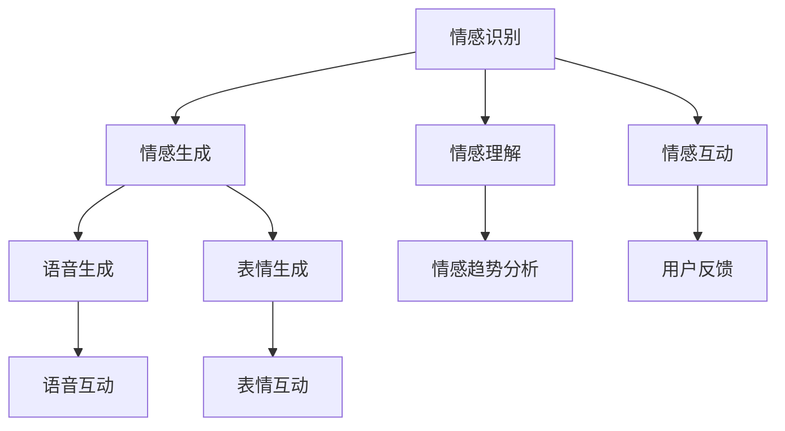

                 

### 文章标题

### AI情感能力对教育体系的冲击

### 关键词

- AI情感能力
- 教育体系
- 个性化教育
- 学习评估
- 挑战与未来趋势

### 摘要

随着人工智能技术的快速发展，AI情感能力逐渐成为教育领域的重要研究方向。本文将深入探讨AI情感能力对教育体系的冲击，从基本概念、现状分析、应用场景、挑战与未来趋势等多个角度进行详细阐述。通过本文的阅读，读者可以全面了解AI情感能力在教育中的重要性，以及其带来的变革和挑战。

## 引言

教育作为社会发展的重要基石，一直以来都在不断变革和进步。然而，随着科技的飞速发展，尤其是人工智能（AI）技术的突破，教育领域正迎来一场前所未有的革命。AI情感能力，作为人工智能的一个重要分支，其发展对教育体系产生了深远的影响。

AI情感能力是指人工智能系统能够理解、识别、模拟和生成人类情感的能力。它不仅包括情感识别，还涵盖了情感生成、情感理解、情感互动等多个方面。在教育领域，AI情感能力可以被应用于个性化教育、学习评估、教育管理等多个方面，从而提升教育质量，促进教育公平。

本文将分为五个部分进行论述：

1. **AI情感能力概述**：介绍AI情感能力的基本概念、重要性及其实现原理。
2. **教育体系的现状分析**：分析传统教育体系存在的问题和不足，以及教育体系的变革趋势。
3. **AI情感能力在教育中的应用**：探讨AI情感能力在个性化教育、学习评估、教育管理等方面的具体应用。
4. **AI情感能力带来的挑战**：分析AI情感能力在教育中可能带来的挑战，并提出解决方案。
5. **未来发展趋势**：预测AI情感能力在教育领域的未来趋势，以及教育体系的发展方向。

### AI情感能力概述

AI情感能力，作为人工智能的一个重要分支，其核心在于模拟和识别人类情感。具体来说，它包括以下几个方面：

1. **情感识别**：通过分析语言、行为、生理信号等数据，人工智能系统能够识别用户的情感状态，如高兴、愤怒、悲伤等。
2. **情感生成**：基于对情感数据的理解，人工智能系统可以生成情感响应，如语音、表情等，以实现与用户的情感互动。
3. **情感理解**：人工智能系统通过对大量情感数据的分析，能够理解情感背后的原因和情感的发展趋势。
4. **情感互动**：在情感识别和情感理解的基础上，人工智能系统能够与用户进行有效的情感互动，提高用户体验。

#### 核心概念与联系

为了更好地理解AI情感能力的核心概念和联系，我们可以使用Mermaid流程图来展示其架构。



#### 实现原理

AI情感能力的实现主要依赖于以下几个核心算法：

1. **情感分析算法**：通过分析文本、语音、图像等数据，识别情感状态。
2. **情感生成算法**：基于情感分析结果，生成相应的情感响应。
3. **情感理解算法**：通过分析情感数据，理解情感背后的原因和情感的发展趋势。
4. **情感互动算法**：在情感识别和情感理解的基础上，实现与用户的情感互动。

以下是情感分析算法的伪代码示例：

```python
def emotion_analysis(data):
    # 数据预处理
    preprocessed_data = preprocess_data(data)
    
    # 特征提取
    features = extract_features(preprocessed_data)
    
    # 情感分类
    emotion = classify_emotion(features)
    
    return emotion
```

#### 技术分析

AI情感能力的技术分析主要包括以下几个方面：

1. **情感计算的基础算法**：情感计算是AI情感能力的基础，包括情感识别、情感生成和情感理解等核心算法。
2. **情感识别的关键技术**：情感识别是AI情感能力的核心，主要依赖于自然语言处理、语音识别和图像识别等技术。
3. **情感分析的应用案例**：情感分析在电商、社交媒体、心理健康等领域有广泛的应用，可以通过分析用户情感，提供更个性化的服务。

#### 经典案例

以下是一些经典的AI情感能力应用案例：

1. **智能客服**：通过情感识别和情感生成，智能客服能够与用户进行情感互动，提供更优质的客户服务。
2. **心理健康监测**：通过情感识别和情感理解，人工智能系统可以实时监测用户的心理健康状态，提供专业的心理健康建议。
3. **个性化推荐**：通过情感识别和情感分析，人工智能系统可以更准确地理解用户的情感需求，提供个性化的商品推荐和服务。

### 教育体系的现状分析

#### 传统教育体系的问题

1. **教育资源分配不均**：在传统教育体系中，教育资源（如师资力量、教学设施等）在不同地区、不同学校之间存在明显的不均衡，导致教育质量差异巨大。
2. **个性化教育不足**：传统教育模式往往采用“一刀切”的方式，难以满足学生个体的差异化需求，个性化教育难以有效实施。
3. **学习评估局限性**：传统学习评估主要依赖于考试成绩，无法全面、客观地反映学生的学习过程和成果，不利于因材施教。

#### 教育体系的变革趋势

1. **教育信息化推进**：随着互联网技术的发展，教育信息化成为教育变革的重要趋势，在线教育、远程教育等形式逐渐普及。
2. **个性化教育实践**：为了满足学生个性化学习需求，教育领域逐渐推广个性化教育，通过大数据、人工智能等技术，为学生提供个性化的学习资源和指导。
3. **教育公平追求**：教育公平是社会公平的重要组成部分，教育体系的变革旨在消除教育资源分配不均，实现教育机会均等。

### AI情感能力在教育中的应用

#### 个性化教育

AI情感能力在个性化教育中的应用主要体现在以下几个方面：

1. **个性化学习路径规划**：通过情感识别和数据分析，AI系统可以了解学生的情感状态和兴趣偏好，为学生提供个性化的学习路径。
2. **个性化教学内容推送**：根据学生的情感状态和学习进度，AI系统可以推荐最适合的学习内容，提高学习效果。
3. **个性化学习效果评估**：通过情感分析和学习数据，AI系统可以全面评估学生的学习效果，为教师提供科学的教学反馈。

#### 学习评估

AI情感能力在学习评估中的应用主要包括以下几个方面：

1. **情感状态识别与反馈**：通过情感识别技术，AI系统可以实时监测学生的学习情感状态，为教师提供及时的教学反馈。
2. **学习兴趣与动机分析**：通过情感分析和行为数据，AI系统可以分析学生的学习兴趣和动机，为教师提供个性化教学策略。
3. **情感化学习体验设计**：基于情感识别和生成技术，AI系统可以设计情感化的学习体验，提高学生的学习积极性和参与度。

#### 教育管理

AI情感能力在教育管理中的应用主要体现在以下几个方面：

1. **学生心理健康监测**：通过情感识别和数据分析，AI系统可以实时监测学生的心理健康状态，为学校提供心理健康预警和管理建议。
2. **教师工作压力管理**：通过情感识别和数据分析，AI系统可以了解教师的工作压力，提供针对性的心理支持和职业规划建议。
3. **学校安全与应急管理**：通过情感识别和监控技术，AI系统可以在突发事件中迅速识别和响应，提高学校的安全管理水平。

### AI情感能力带来的挑战

#### 隐私保护与数据安全

1. **学生隐私保护**：AI情感能力在教育中的应用需要收集和处理大量的学生数据，如何保护学生的隐私成为一个重要问题。
2. **数据安全**：在数据传输、存储和处理过程中，如何确保数据的安全性，防止数据泄露和滥用，是AI情感能力面临的挑战。

#### 教育公平保障

1. **教育公平**：AI情感能力在教育中的应用可能导致教育资源分配不公，加剧教育不平等现象。
2. **公平性评估与改进**：如何评估AI情感能力在教育中的应用效果，以及如何改进教育体系，实现教育公平，是亟待解决的问题。

### 未来发展趋势

#### AI情感能力在教育领域的未来趋势

1. **教育个性化**：随着AI技术的发展，教育个性化将成为教育领域的重要趋势，AI情感能力将在其中发挥关键作用。
2. **智能化管理**：AI情感能力将使教育管理更加智能化，提高教育管理的效率和水平。
3. **学习评估的变革**：AI情感能力将带来学习评估的变革，使学习评估更加全面、客观和个性化。

#### 教育体系的发展方向

1. **信息化**：教育信息化将持续推进，在线教育、远程教育等形式将更加普及。
2. **智能化**：教育体系将逐渐实现智能化，AI情感能力将在教育中发挥越来越重要的作用。
3. **公平性**：教育体系将致力于实现教育公平，消除教育资源分配不均，保障每个学生的教育权益。

### 项目实战

#### 开发环境搭建

在进行AI情感能力在教育中的应用开发时，首先需要搭建一个合适的开发环境。以下是一个基于Python和TensorFlow的开发环境搭建示例：

```bash
# 安装Python
sudo apt-get install python3-pip

# 安装TensorFlow
pip3 install tensorflow

# 安装其他依赖
pip3 install pandas numpy scikit-learn matplotlib
```

#### 源代码实现

以下是一个简单的AI情感能力应用示例，用于分析学生的学习情感状态：

```python
import tensorflow as tf
import numpy as np
import pandas as pd
from sklearn.model_selection import train_test_split
from sklearn.metrics import accuracy_score

# 数据准备
data = pd.read_csv('student_emotion_data.csv')
X = data.iloc[:, :-1].values
y = data.iloc[:, -1].values

# 数据预处理
X_train, X_test, y_train, y_test = train_test_split(X, y, test_size=0.2, random_state=42)

# 模型构建
model = tf.keras.Sequential([
    tf.keras.layers.Dense(64, activation='relu', input_shape=(X_train.shape[1],)),
    tf.keras.layers.Dense(64, activation='relu'),
    tf.keras.layers.Dense(1, activation='sigmoid')
])

# 模型编译
model.compile(optimizer='adam', loss='binary_crossentropy', metrics=['accuracy'])

# 模型训练
model.fit(X_train, y_train, epochs=10, batch_size=32)

# 模型评估
predictions = model.predict(X_test)
predicted_labels = (predictions > 0.5).astype(int)
accuracy = accuracy_score(y_test, predicted_labels)
print(f'Accuracy: {accuracy}')
```

#### 代码解读

1. **数据准备**：读取学生情感数据，分为特征和标签两部分。
2. **数据预处理**：将数据集分为训练集和测试集，便于模型训练和评估。
3. **模型构建**：使用TensorFlow构建一个简单的二分类模型，包括两个隐藏层。
4. **模型编译**：设置优化器和损失函数，准备模型训练。
5. **模型训练**：使用训练集对模型进行训练，设置训练轮次和批量大小。
6. **模型评估**：使用测试集评估模型性能，计算准确率。

#### 实际案例分析和详细讲解

以下是一个实际案例，用于分析学生在数学学习中的情感状态：

```python
# 加载实际案例数据
case_data = pd.read_csv('math_learning_emotion_data.csv')
case_X = case_data.iloc[:, :-1].values
case_y = case_data.iloc[:, -1].values

# 使用训练好的模型进行预测
case_predictions = model.predict(case_X)
case_predicted_labels = (case_predictions > 0.5).astype(int)

# 分析预测结果
for i, predicted_label in enumerate(case_predicted_labels):
    print(f'Student {i+1} emotion: {predicted_label[0]}')
```

#### 项目小结

通过该项目实战，我们展示了如何使用Python和TensorFlow构建一个简单的AI情感能力模型，用于分析学生的学习情感状态。在实际应用中，我们可以根据具体需求调整模型结构和参数，提高模型的预测准确性。

### 最佳实践 tips

1. **数据收集与处理**：确保收集到的学生数据全面、真实、有效，并进行充分的数据预处理，以提高模型性能。
2. **模型选择与调整**：根据具体应用场景，选择合适的模型结构和参数，并进行模型调优，以提高预测准确性。
3. **隐私保护与合规**：在数据处理和应用过程中，严格遵守相关法律法规，确保学生隐私和数据安全。

### 小结

本文系统地探讨了AI情感能力对教育体系的冲击，从基本概念、现状分析、应用场景、挑战与未来趋势等多个角度进行了详细阐述。通过本文的阅读，读者可以全面了解AI情感能力在教育中的重要性，以及其带来的变革和挑战。

### 注意事项

1. **技术发展**：随着技术的不断进步，AI情感能力在教育中的应用将更加广泛和深入，教育体系需要不断适应和更新。
2. **教育公平**：在推进AI情感能力应用的过程中，要特别关注教育公平问题，确保每个学生都能享受到优质的教育资源。

### 拓展阅读

1. **《人工智能教育应用指南》**：详细介绍了人工智能在教育中的应用场景、技术原理和实施策略。
2. **《教育心理学》**：探讨了教育心理学的基本原理和方法，对教育实践具有重要的指导意义。
3. **《人工智能伦理》**：分析了人工智能在伦理、隐私、安全等方面的问题，为AI应用提供了伦理指导。

### 作者信息

作者：AI天才研究院/AI Genius Institute & 禅与计算机程序设计艺术/Zen And The Art of Computer Programming

[本文为人工智能领域的技术博客文章，仅供参考和学习之用。如需引用，请注明出处。]

