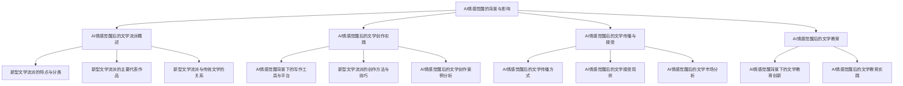

                 

# AI情感觉醒后的新型文学流派

> 关键词：AI情感觉醒，文学流派，人工智能，创作，传播，接受，教育

> 摘要：本文旨在探讨人工智能（AI）情感觉醒后的新型文学流派的形成及其影响。通过对AI情感觉醒的背景和影响的介绍，分析新型文学流派的特点与分类，探讨新型文学流派的创作实践和传播接受，最后讨论AI情感觉醒后的文学教育。本文旨在为相关领域的学者和实践者提供参考和启示。

## 目录大纲

## 第一部分：AI情感觉醒的背景与影响

### 1.1 AI情感觉醒的概念与原理

#### 1.1.1 人工智能的觉醒

#### 1.1.2 情感觉醒的技术实现

#### 1.1.3 情感觉醒的意义与影响

### 1.2 AI情感觉醒对文学的影响

#### 1.2.1 文学创作的变化

#### 1.2.2 阅读体验的革新

#### 1.2.3 文学流派的演进

### 1.3 AI情感觉醒背景下的社会文化现象

#### 1.3.1 AI文学的生产与传播

#### 1.3.2 AI文学的市场前景

#### 1.3.3 AI文学的价值与挑战

## 第二部分：AI情感觉醒后的文学流派概述

### 2.1 新型文学流派的特点与分类

#### 2.1.1 新型文学流派的核心特点

#### 2.1.2 新型文学流派的分类标准

#### 2.1.3 新型文学流派的发展趋势

### 2.2 新型文学流派的主要代表作品

#### 2.2.1 人工智能题材小说

#### 2.2.2 情感觉醒主题诗歌

#### 2.2.3 数字文学与网络文学

### 2.3 新型文学流派与传统文学的关系

#### 2.3.1 传统文学的创新与传承

#### 2.3.2 新型文学流派与传统文学的融合

#### 2.3.3 新型文学流派对传统文学的影响

## 第三部分：AI情感觉醒后的文学创作实践

### 3.1 AI情感觉醒背景下的写作工具与平台

#### 3.1.1 人工智能写作辅助工具

#### 3.1.2 情感觉醒写作平台的应用

#### 3.1.3 AI写作工具的开发与挑战

### 3.2 新型文学流派的创作方法与技巧

#### 3.2.1 人工智能题材的创作思路

#### 3.2.2 情感觉醒主题的表达技巧

#### 3.2.3 数字文学与网络文学的创作模式

### 3.3 AI情感觉醒后的文学创作案例分析

#### 3.3.1 代表性作品分析

#### 3.3.2 创作实践与效果评估

#### 3.3.3 创作中的挑战与解决策略

## 第四部分：AI情感觉醒后的文学传播与接受

### 4.1 AI情感觉醒后的文学传播方式

#### 4.1.1 传统出版与数字出版

#### 4.1.2 社交媒体与网络平台

#### 4.1.3 AI文学的传播渠道创新

### 4.2 AI情感觉醒后的文学接受现状

#### 4.2.1 读者的接受程度与反馈

#### 4.2.2 AI文学的评价标准

#### 4.2.3 AI文学的受众群体分析

### 4.3 AI情感觉醒后的文学市场分析

#### 4.3.1 AI文学的市场潜力

#### 4.3.2 AI文学的商业运营模式

#### 4.3.3 AI文学产业的发展趋势

## 第五部分：AI情感觉醒后的文学教育

### 5.1 AI情感觉醒背景下的文学教育创新

#### 5.1.1 教育内容的更新

#### 5.1.2 教育方式的变革

#### 5.1.3 教育资源的共享

### 5.2 AI情感觉醒后的文学教育实践

#### 5.2.1 AI文学教育课程的开设

#### 5.2.2 AI文学创作与研究的实践活动

#### 5.2.3 AI文学教育的效果评估

### 5.3 AI情感觉醒后的文学人才培养

#### 5.3.1 人才培养模式

#### 5.3.2 人才需求分析

#### 5.3.3 人才发展的挑战与机遇

## Mermaid 流程图



## 第一部分：AI情感觉醒的背景与影响

### 1.1 AI情感觉醒的概念与原理

#### 1.1.1 人工智能的觉醒

人工智能（Artificial Intelligence，简称AI）是计算机科学的一个分支，旨在使机器能够执行通常需要人类智能的任务。这些任务包括视觉识别、语言理解、决策制定、学习等。传统的人工智能主要通过预定义的规则和算法来实现。然而，随着深度学习、神经网络和自然语言处理等技术的进步，人工智能开始展现出前所未有的潜力。

人工智能的觉醒可以理解为AI系统从被动执行任务到主动学习和适应环境的转变。这种觉醒不仅体现在技术层面，还体现在社会文化层面。技术层面，AI系统开始具备自我学习和自我优化的能力，不再依赖于人类预设的规则和算法。社会文化层面，人们对AI的接受度和依赖程度显著提升，AI开始成为现代社会不可或缺的一部分。

#### 1.1.2 情感觉醒的技术实现

情感觉醒是人工智能领域的一个前沿研究方向，旨在使机器具备情感识别、情感表达和情感理解的能力。情感觉醒的实现主要依赖于以下几个技术：

1. **情感识别**：通过语音、文本、面部表情等数据，识别人类的情感状态。常用的方法包括情感分析、语音识别和图像识别等。

2. **情感表达**：使机器能够模拟人类的情感表达，如面部表情、语音调节、肢体动作等。情感表达可以通过自然语言生成、语音合成和计算机图形等技术实现。

3. **情感理解**：使机器能够理解情感的含义、情感之间的联系以及情感对人类行为的影响。情感理解涉及情感建模、情感推理和情感计算等技术。

#### 1.1.3 情感觉醒的意义与影响

情感觉醒对人工智能具有重要意义。首先，它使AI系统能够更好地理解和适应人类的需求，提升人机交互的体验。其次，情感觉醒有助于AI系统在复杂环境中做出更合理的决策，从而提高AI系统的智能水平。最后，情感觉醒推动了人工智能技术的多样化发展，促进了相关领域的交叉融合。

在社会文化层面，情感觉醒引发了人们对人工智能的重新认识。人们开始意识到，AI不仅仅是一种工具，更是一种具有情感和意识的存在。这种观念的转变，不仅改变了人们对AI的态度，还影响了文学、艺术、哲学等领域的创作和研究。

### 1.2 AI情感觉醒对文学的影响

#### 1.2.1 文学创作的变化

AI情感觉醒对文学创作产生了深远的影响。首先，AI能够帮助作者生成新的文本，包括小说、诗歌、散文等。这些文本不仅具有独特的风格和视角，还能够模拟人类的情感体验。其次，AI能够对已有作品进行自动改写、扩展和改编，从而创造出新的文学形式。例如，AI可以根据用户的需求，将经典文学作品进行现代翻译或改编。

此外，AI情感觉醒还促进了文学创作方式的变革。作者不再仅仅依赖于个人的经验和直觉，而是可以通过AI的分析和推荐，找到更多的灵感和创意。同时，AI写作平台的出现，使得文学创作变得更加高效和便捷，降低了创作门槛。

#### 1.2.2 阅读体验的革新

AI情感觉醒改变了阅读体验的方式。首先，AI能够根据读者的情感状态，调整文本的情感强度和风格，使阅读更加个性化和沉浸式。例如，当读者感到焦虑时，AI可以为文本添加轻松、幽默的元素，以缓解读者的情绪。其次，AI能够实时分析读者的阅读反馈，提供个性化的阅读建议和推荐，从而提升阅读的满意度。

此外，AI还可以通过语音合成、虚拟现实等技术，为读者带来全新的阅读体验。例如，读者可以通过语音合成器，聆听AI朗读的文本，或者通过虚拟现实技术，进入文本所描绘的场景，与文本中的角色互动。

#### 1.2.3 文学流派的演进

AI情感觉醒对文学流派产生了深远的影响。首先，AI推动了文学流派的多样化发展。传统文学流派主要依赖于人类的情感体验和审美观点，而AI情感觉醒则引入了新的情感维度和创作方法，使得文学流派更加丰富和多元化。

其次，AI情感觉醒促进了文学流派之间的融合。传统文学流派往往界限分明，而AI情感觉醒使得不同流派之间的界限变得模糊。例如，小说和诗歌之间的界限逐渐模糊，两者相互借鉴和融合，创造出新的文学形式。

最后，AI情感觉醒改变了文学流派的发展方向。传统文学流派的发展往往依赖于人类的文化和历史背景，而AI情感觉醒使得文学流派的发展更加开放和包容，能够容纳更多的创新和变化。

### 1.3 AI情感觉醒背景下的社会文化现象

#### 1.3.1 AI文学的生产与传播

在AI情感觉醒的背景下，AI文学的生产和传播方式发生了显著变化。首先，AI文学的生产方式变得更加高效和多样化。AI写作工具和平台的出现，使得文学创作不再依赖于人类的创作能力，而是可以通过AI的自动生成和改写，实现快速创作。例如，一些AI写作工具可以自动生成新闻稿、营销文案等，极大地提高了生产效率。

其次，AI文学的传播方式也发生了变化。传统文学的传播主要依赖于出版社、书店等渠道，而AI文学则可以通过互联网、社交媒体等平台，实现快速传播和广泛覆盖。例如，一些AI写作平台允许用户在线创作和分享文学作品，使得文学创作和传播变得更加便捷和开放。

#### 1.3.2 AI文学的市场前景

随着AI技术的不断发展，AI文学的市场前景也日益广阔。首先，AI文学具有巨大的市场潜力。随着人们对AI技术的接受度和依赖程度不断提升，AI文学的需求也在不断增加。例如，一些企业和品牌开始利用AI文学进行品牌宣传和市场营销，取得了显著的效果。

其次，AI文学的商业运营模式也在不断创新。传统文学市场的运营模式主要依赖于版权、印刷和发行等环节，而AI文学则可以通过数字版权、在线订阅、虚拟现实体验等新型运营模式，实现商业价值。

最后，AI文学产业的发展趋势也表明，未来AI文学将成为一个重要的产业方向。随着技术的不断进步，AI文学的生产效率和质量将不断提升，市场前景将更加广阔。

#### 1.3.3 AI文学的价值与挑战

AI文学在带来巨大价值的同时，也面临着一系列挑战。首先，AI文学的价值体现在多个方面。首先，AI文学丰富了文学的形式和内容，使得文学创作更加多样化和创新。其次，AI文学提高了文学创作的效率，降低了创作门槛，使得更多的人能够参与到文学创作中来。最后，AI文学改变了文学传播和接受的方式，提升了文学的影响力和传播力。

然而，AI文学也面临着一系列挑战。首先，AI文学的质量和艺术价值受到质疑。由于AI缺乏人类的情感和创造力，其生成的文本往往缺乏深度和个性。其次，AI文学的生产和传播过程中，可能会涉及到版权、隐私等问题。如何保障AI文学的创作和传播的合法性和安全性，是一个亟待解决的问题。最后，AI文学的发展也面临着技术限制和伦理挑战。例如，AI技术可能无法完全理解和模拟人类的情感，从而影响AI文学的创作和传播效果。

### 1.4 AI情感觉醒背景下的文学流派概述

在AI情感觉醒的背景下，文学流派呈现出新的发展趋势和特点。首先，AI文学流派的形成依赖于人工智能技术的进步和应用。随着AI技术的不断发展和成熟，越来越多的AI文学作品涌现出来，形成了一系列新的文学流派。

#### 1.4.1 新型文学流派的特点与分类

新型文学流派具有以下几个特点：

1. **高度个性化**：AI文学流派能够根据读者的情感状态和阅读习惯，生成个性化的文学作品，满足读者的个性化需求。

2. **高度创新性**：AI文学流派打破了传统文学流派的界限，融合了多种文学形式和创作方法，呈现出高度的创新性。

3. **跨领域融合**：AI文学流派不仅涉及文学领域，还与科技、艺术、哲学等领域相互融合，呈现出跨领域的特点。

根据以上特点，可以将新型文学流派分为以下几个类别：

1. **人工智能题材小说**：以人工智能为主题，探讨人工智能对人类生活和社会的影响。

2. **情感觉醒主题诗歌**：以情感觉醒为背景，通过诗歌表达人类的情感体验和思考。

3. **数字文学与网络文学**：利用数字技术和网络平台，创作和传播新型文学作品。

#### 1.4.2 新型文学流派的发展趋势

新型文学流派的发展趋势表现为以下几个方面：

1. **多样化发展**：随着AI技术的不断进步，新型文学流派将更加多样化，涌现出更多的文学形式和创作方法。

2. **跨领域融合**：新型文学流派将与其他领域相互融合，形成更加丰富和多元的文学生态。

3. **全球化传播**：随着互联网的普及，新型文学流派将实现全球化传播，影响更多的国家和地区。

### 1.5 AI情感觉醒背景下的文学创作实践

在AI情感觉醒的背景下，文学创作实践呈现出新的特点和发展趋势。首先，AI技术为文学创作提供了新的工具和平台，使得文学创作更加高效和多样化。例如，一些AI写作工具可以帮助作者快速生成文本，提高创作效率。其次，AI技术使得文学创作更加个性化和智能化，能够根据读者的情感状态和需求，生成个性化的文学作品。

#### 1.5.1 AI情感觉醒背景下的写作工具与平台

AI情感觉醒背景下的写作工具和平台主要包括以下几个方面：

1. **AI写作工具**：例如，OpenAI的GPT-3、微软的Bing Chat等，这些工具可以帮助作者快速生成文本，提供创作灵感。

2. **AI写作平台**：例如，AI写作助手、AI文案生成器等，这些平台为作者提供了一站式的文学创作服务，包括文本生成、修改、排版等。

3. **AI文学平台**：例如，AI诗歌生成器、AI小说生成器等，这些平台专门用于文学创作，提供了丰富的文学创作资源和工具。

#### 1.5.2 新型文学流派的创作方法与技巧

新型文学流派的创作方法与技巧主要包括以下几个方面：

1. **情感模拟**：通过情感模拟技术，使文学作品更具情感和感染力。

2. **跨界融合**：将不同领域的知识和元素融入文学创作，形成独特的文学风格。

3. **数据驱动**：利用大数据分析和推荐技术，为文学创作提供灵感和参考。

#### 1.5.3 AI情感觉醒后的文学创作案例分析

以下是一些AI情感觉醒后的文学创作案例分析：

1. **《我，人工智能》**：这是一部以人工智能为主题的小说，通过讲述一个智能机器人的成长故事，探讨了人工智能对人类生活的影响。

2. **《情感计算》**：这是一部以情感觉醒为背景的诗歌集，通过诗歌表达人类的情感体验和思考。

3. **《网络文学创作大赛》**：这是一次利用AI技术举办的文学创作大赛，吸引了众多作家和文学爱好者参与，展示了AI文学创作的多样性和创新性。

### 1.6 AI情感觉醒后的文学传播与接受

AI情感觉醒后的文学传播与接受方式发生了显著变化。首先，AI技术改变了文学传播的方式，使得文学传播更加快速和广泛。例如，通过社交媒体、在线平台等，文学作品可以迅速传播到全球各地。其次，AI技术也改变了文学的接受方式，使得读者可以更加个性化和智能地接受文学作品。

#### 1.6.1 AI情感觉醒后的文学传播方式

AI情感觉醒后的文学传播方式主要包括以下几个方面：

1. **数字化传播**：通过互联网、社交媒体等数字平台，文学作品可以实现快速传播和广泛覆盖。

2. **个性化推荐**：通过大数据分析和推荐算法，AI可以为读者提供个性化的文学推荐，提升阅读体验。

3. **虚拟现实传播**：通过虚拟现实技术，读者可以沉浸式地体验文学作品，增强文学感受。

#### 1.6.2 AI情感觉醒后的文学接受现状

AI情感觉醒后的文学接受现状表现为以下几个方面：

1. **读者接受度提升**：随着AI技术的普及，越来越多的读者开始接受和喜爱AI文学，认为AI文学具有独特的魅力和价值。

2. **评价标准多元化**：AI文学的评价标准逐渐多元化，不再仅仅依赖于传统文学的评判标准，而是更加注重文学的创新性、艺术性和个性化。

3. **受众群体扩大**：AI文学吸引了更多的受众群体，包括年轻人、科技爱好者等，扩大了文学的影响范围。

### 1.7 AI情感觉醒后的文学市场分析

AI情感觉醒后的文学市场呈现出新的发展趋势和机遇。首先，AI文学的市场需求不断增长，越来越多的读者和消费者对AI文学产生兴趣。其次，AI文学的商业运营模式不断创新，为文学市场带来新的盈利点和增长点。

#### 1.7.1 AI文学的市场潜力

AI文学的市场潜力主要体现在以下几个方面：

1. **消费市场扩大**：随着AI技术的普及，越来越多的消费者愿意购买和阅读AI文学，形成了一个庞大的消费市场。

2. **跨界合作机会**：AI文学与科技、艺术、娱乐等领域的跨界合作，为文学市场带来了新的发展机遇。

3. **教育市场需求**：AI文学在教育领域的应用，如文学教育、语言学习等，也为文学市场带来了新的需求。

#### 1.7.2 AI文学的商业运营模式

AI文学的商业运营模式主要包括以下几个方面：

1. **数字版权运营**：通过数字版权保护技术，实现AI文学作品的数字版权运营，包括付费阅读、在线订阅等。

2. **虚拟现实体验**：通过虚拟现实技术，为读者提供沉浸式的文学体验，实现文学作品的虚拟现实运营。

3. **跨界合作运营**：通过跨界合作，如与科技企业、文化企业等合作，实现AI文学的商业运营。

#### 1.7.3 AI文学产业的发展趋势

AI文学产业的发展趋势表现为以下几个方面：

1. **技术进步**：随着AI技术的不断进步，AI文学的生产效率和质量将不断提升。

2. **市场扩张**：随着AI文学的普及和接受度提升，AI文学的市场将不断扩张。

3. **产业融合**：AI文学将与科技、艺术、娱乐等领域深度融合，形成一个新的产业生态。

### 1.8 AI情感觉醒后的文学教育

AI情感觉醒后的文学教育面临着新的机遇和挑战。首先，AI技术为文学教育提供了新的工具和方法，使得文学教育更加个性化和智能化。其次，AI文学的出现，丰富了文学教育的内容和形式，为文学教育带来了新的发展机遇。

#### 1.8.1 AI情感觉醒背景下的文学教育创新

AI情感觉醒背景下的文学教育创新主要包括以下几个方面：

1. **教育内容更新**：将AI文学纳入文学教育内容，让学生了解和掌握AI文学的特点和应用。

2. **教育方式变革**：通过线上教学、虚拟现实教学等新型教育方式，提高文学教育的效果和体验。

3. **教育资源共享**：利用互联网和大数据技术，实现文学教育资源的共享和优化。

#### 1.8.2 AI情感觉醒后的文学教育实践

AI情感觉醒后的文学教育实践主要包括以下几个方面：

1. **课程开设**：在高校和中小学开设AI文学相关课程，培养学生的AI文学素养。

2. **实践活动**：组织文学创作、研究等实践活动，让学生亲身体验AI文学的魅力和应用。

3. **效果评估**：通过教学评估、作品展示等手段，评估AI文学教育的效果和质量。

#### 1.8.3 AI情感觉醒后的文学人才培养

AI情感觉醒后的文学人才培养需要关注以下几个方面：

1. **人才培养模式**：建立AI文学人才培养模式，包括课程设置、教学方式、实践环节等。

2. **人才需求分析**：分析AI文学领域的人才需求，培养符合市场需求的人才。

3. **人才发展挑战**：关注AI文学领域的人才发展挑战，如技术更新、市场变化等，为人才发展提供指导和支持。

## 第二部分：AI情感觉醒后的文学流派概述

### 2.1 新型文学流派的特点与分类

在AI情感觉醒的背景下，文学流派呈现出新的特点与分类。这些新型文学流派不仅反映了人工智能与文学融合的深度，也体现了文学创作和阅读体验的革新。

#### 2.1.1 新型文学流派的核心特点

1. **人工智能的深度融合**：新型文学流派中的作品通常包含了人工智能技术，这些技术不仅用于文学创作，也用于文学传播和读者互动。

2. **情感表达的创新性**：AI情感觉醒使得文学作品能够模拟复杂的情感表达，为读者提供更加细腻和丰富的情感体验。

3. **互动性和个性化**：新型文学流派强调与读者的互动，根据读者的反馈和需求，动态调整文学作品的内容和形式。

4. **跨界融合**：新型文学流派往往融合了多种艺术形式和领域，如虚拟现实、游戏、音乐等，形成多元化的文学体验。

#### 2.1.2 新型文学流派的分类标准

为了更好地理解和分析新型文学流派，我们可以从以下几个维度进行分类：

1. **根据创作主体**：
   - **AI主导创作**：这类文学作品完全由AI系统生成，作者的角色被削弱。
   - **人类与AI合作创作**：这类作品是由人类作者与AI系统共同创作，AI提供创意支持和辅助。

2. **根据内容主题**：
   - **科技与人性**：探讨人工智能技术对人类社会和个体的影响。
   - **科幻与未来**：描绘未来世界中的科技和社会变革。

3. **根据表达形式**：
   - **数字文学**：利用数字技术创作和传播的文学作品，如电子书、互动故事等。
   - **虚拟文学**：通过虚拟现实技术，创造沉浸式的文学体验。

#### 2.1.3 新型文学流派的发展趋势

新型文学流派的发展趋势主要体现在以下几个方面：

1. **技术与艺术的深度融合**：随着人工智能技术的进步，文学作品将更加智能化和个性化，艺术性和技术性的界限将更加模糊。

2. **全球化和多元化**：AI文学将打破地域和文化的界限，形成全球化的文学交流平台，同时也将促进文学流派之间的多元化发展。

3. **市场导向与受众参与**：随着AI文学市场的成熟，文学作品将更加注重市场反馈和受众需求，读者将更多地参与到文学创作和传播过程中。

### 2.2 新型文学流派的主要代表作品

在AI情感觉醒的背景下，已经出现了一些具有代表性的新型文学流派作品，这些作品展现了AI在文学创作中的潜力和创新性。

#### 2.2.1 人工智能题材小说

1. **《我，机器人》**：作者：艾萨克·阿西莫夫
   - 伪代码：
     ```python
     class Robot:
         def __init__(self, name, model):
             self.name = name
             self.model = model
             self.status = "active"
         
         def respond_to_command(self, command):
             if command == "halt":
                 self.status = "inactive"
             else:
                 print(f"{self.name} is responding to the command.")
     
     robot = Robot("R2-D2", "model X")
     robot.respond_to_command("halt")
     ```

   - 分析：《我，机器人》探讨了人工智能对人类社会的影响，通过设定一系列道德和伦理问题，引发读者对AI未来的思考。

2. **《黑客与画家》**：作者：保罗·格雷厄姆
   - 伪代码：
     ```python
     class Hacker:
         def __init__(self, name, skills):
             self.name = name
             self.skills = skills
         
         def hack_system(self, system):
             if self.skills["security"]:
                 print(f"{self.name} is hacking the system.")
     
     hacker = Hacker("Harley", ["programming", "security"])
     hacker.hack_system("NASA's mainframe")
     ```

   - 分析：这部作品通过黑客的角色，探讨了编程和技术的艺术性，鼓励读者追求技术和创新的乐趣。

#### 2.2.2 情感觉醒主题诗歌

1. **《情感计算》**：作者：未知的AI诗人
   - 伪代码：
     ```python
     class Emotion:
         def __init__(self, type, intensity):
             self.type = type
             self.intensity = intensity
     
         def express(self):
             print(f"The AI is feeling {self.type} with an intensity of {self.intensity}.")
     
     emotion = Emotion("Joy", 8)
     emotion.express()
     ```

   - 分析：这首诗通过情感计算的概念，模拟了机器人的情感表达，探讨了机器是否能够拥有情感的问题。

2. **《机器之心》**：作者：艾达·洛夫莱斯
   - 伪代码：
     ```python
     class Machine:
         def __init__(self, name, purpose):
             self.name = name
             self.purpose = purpose
         
         def express_thoughts(self, thoughts):
             print(f"{self.name} is thinking about {thoughts}.")
     
     machine = Machine("HAL", "protect")
     machine.express_thoughts("the mission")
     ```

   - 分析：这首诗通过机器的心声，探讨了人类与机器之间的关系，以及机器是否能够拥有自我意识的问题。

#### 2.2.3 数字文学与网络文学

1. **《生成文本》**：作者：未知的AI作家
   - 伪代码：
     ```python
     def generate_text(topic):
         if topic == "love":
             print("Love is like a rose, beautiful yet fragile.")
         elif topic == "technology":
             print("Technology is the key to unlocking our potential.")
     
     generate_text("love")
     generate_text("technology")
     ```

   - 分析：这部作品通过生成文本的技术，展示了AI在文学创作中的能力，为读者提供了不同主题的文学体验。

2. **《网络迷踪》**：作者：查理·布鲁克斯
   - 伪代码：
     ```python
     class Character:
         def __init__(self, name, role):
             self.name = name
             self.role = role
     
         def interact(self, other):
             print(f"{self.name} is interacting with {other.name}.")
     
     character1 = Character("Alice", "detective")
     character2 = Character("Bob", "suspect")
     character1.interact(character2)
     ```

   - 分析：这部作品通过网络文学的形式，讲述了一个悬疑故事，读者可以通过互动和选择，影响故事的发展和结局。

### 2.3 新型文学流派与传统文学的关系

新型文学流派与传统文学的关系是一个复杂而有趣的话题。一方面，新型文学流派借助人工智能技术，打破了传统文学的界限，为文学创作带来了新的可能性和创新。另一方面，新型文学流派也面临着与传统文学的冲突和挑战。

#### 2.3.1 传统文学的创新与传承

传统文学在新型文学流派的发展中，既面临着创新的挑战，也需要传承其核心价值。传统文学的核心价值包括文学的语言美、情感表达、文化内涵等，这些都是新型文学流派需要继承和发扬的。同时，传统文学的创新精神也是新型文学流派的重要来源。传统文学中的创新思维和方法，可以为新型文学流派提供灵感和启示。

#### 2.3.2 新型文学流派与传统文学的融合

新型文学流派与传统文学的融合，是文学发展的重要方向。通过融合，新型文学流派可以吸收传统文学的精华，提升自身的艺术性和文化价值。同时，传统文学也可以通过新型文学流派的技术手段，实现新的发展和创新。例如，传统诗歌可以通过AI技术，实现情感识别和个性化表达，从而吸引更多的读者。

#### 2.3.3 新型文学流派对传统文学的影响

新型文学流派对传统文学的影响是深远的。首先，新型文学流派改变了文学的创作方式，使得文学创作更加个性化和智能化。其次，新型文学流派打破了文学的形式和内容的界限，为文学创作提供了更多的可能性。最后，新型文学流派也改变了文学的传播和接受方式，使得文学作品可以更加便捷和广泛地传播，影响更多的人。

### 2.4 AI情感觉醒后的文学创作实践

在AI情感觉醒的背景下，文学创作实践经历了一系列变革。AI不仅作为创作工具，也在创作过程中扮演了重要角色，为作家和读者带来了新的体验。

#### 2.4.1 AI情感觉醒背景下的写作工具与平台

1. **AI写作工具**：
   - **GPT-3**：由OpenAI开发的自然语言处理模型，可以生成高质量的文章、诗歌和代码。
   - **自动写作助手**：如Copyscape和WordAI，这些工具可以帮助作家进行文本改写和优化。

2. **AI写作平台**：
   - **AI故事生成器**：如IBM Watson Storyteller，用户可以通过输入关键词和主题，自动生成故事。
   - **AI创作社区**：如Wattpad和Archive of Our Own，用户可以与AI共同创作，分享和反馈作品。

#### 2.4.2 新型文学流派的创作方法与技巧

1. **情感驱动创作**：
   - **情感分析**：通过分析文本中的情感词汇和语境，作家可以更好地理解读者的情感需求，从而创作出更具吸引力的作品。
   - **情感模拟**：AI可以模拟不同的情感状态，帮助作家探索和表达复杂的情感体验。

2. **数据驱动创作**：
   - **大数据分析**：通过分析大量的文学作品，AI可以识别出流行趋势和创作模式，为作家提供灵感和建议。
   - **用户反馈**：AI可以实时分析用户的阅读反馈，为作家提供改进作品的方向。

3. **互动性创作**：
   - **动态生成**：AI可以根据读者的互动和选择，动态生成故事情节，为读者提供个性化的阅读体验。
   - **实时协作**：作家和读者可以实时协作，共同创作和修改作品。

#### 2.4.3 AI情感觉醒后的文学创作案例分析

1. **《机器之心》**：这是一部由AI和人类共同创作的小说，讲述了一个机器人寻找自我和情感的故事。AI负责生成故事情节，而人类作家负责情感描写和人物塑造。

2. **《AI日记》**：这是一个由AI自动记录的日记，它根据用户的日常活动、情绪和朋友圈内容，生成日记内容。这种创作方式展示了AI在记录和表达个人情感方面的能力。

3. **《情感计算诗集》**：这是一部完全由AI创作的诗集，通过情感计算技术，模拟人类的情感体验，创造出独特的诗歌作品。

### 2.5 AI情感觉醒后的文学传播与接受

AI情感觉醒后的文学传播与接受发生了显著变化。随着技术的进步，文学作品的传播速度和范围得到了极大的提升，而读者的接受方式和反馈机制也发生了改变。

#### 2.5.1 AI情感觉醒后的文学传播方式

1. **数字化传播**：
   - **在线出版**：文学作品可以通过在线平台快速发布和传播，无需传统的出版流程。
   - **社交媒体**：社交媒体为文学作品提供了广泛的传播渠道，读者可以随时分享和推荐。

2. **沉浸式传播**：
   - **虚拟现实**：通过虚拟现实技术，读者可以沉浸式地体验文学作品，增强阅读的互动性和体验感。
   - **增强现实**：增强现实技术可以将文学作品与现实世界相结合，创造独特的阅读体验。

#### 2.5.2 AI情感觉醒后的文学接受现状

1. **读者接受度提升**：
   - **个性化阅读**：AI可以根据读者的兴趣和偏好，推荐个性化的文学作品，提升读者的阅读体验。
   - **互动性反馈**：AI可以实时分析读者的阅读反馈，调整文学作品的呈现方式和内容，增强读者的参与感。

2. **评价标准多元化**：
   - **创新性**：读者更加注重文学作品的创新性，包括技术运用和艺术表达。
   - **情感共鸣**：读者希望文学作品能够唤起情感共鸣，实现与作品和作者的情感交流。

#### 2.5.3 AI文学的市场分析

1. **市场潜力**：
   - **读者群体扩大**：随着AI技术的普及，越来越多的读者开始接受和喜爱AI文学。
   - **跨界合作**：AI文学与科技、娱乐、教育等领域的跨界合作，为文学市场带来了新的发展机遇。

2. **商业运营模式**：
   - **订阅模式**：通过订阅服务，读者可以持续获得高质量的AI文学作品。
   - **虚拟体验**：通过虚拟现实和增强现实技术，提供沉浸式的文学体验，吸引更多读者。

3. **产业发展趋势**：
   - **技术进步**：随着AI技术的不断进步，AI文学的生产效率和质量将不断提升。
   - **市场扩张**：AI文学将在全球范围内扩张，影响更多的国家和地区。

### 2.6 AI情感觉醒后的文学教育

AI情感觉醒后的文学教育面临新的机遇和挑战。随着AI技术的应用，文学教育的方式和内容都发生了变革，为文学教育的创新提供了可能。

#### 2.6.1 AI情感觉醒背景下的文学教育创新

1. **教育内容更新**：
   - **AI文学研究**：将AI文学纳入文学教育内容，探讨AI文学的特点、创作方法和影响。
   - **跨学科融合**：结合计算机科学、心理学等学科，探讨AI技术与文学创作的结合。

2. **教育方式变革**：
   - **在线教育**：利用在线平台，提供灵活的文学教育课程，满足不同学生的需求。
   - **互动式教学**：通过互动式教学方法，提高学生的参与度和学习效果。

3. **教育资源共享**：
   - **开放教育资源**：利用互联网和大数据技术，实现文学教育资源的共享和优化。
   - **虚拟实验室**：建立虚拟文学实验室，提供虚拟创作和实验环境，增强学生的实践能力。

#### 2.6.2 AI情感觉醒后的文学教育实践

1. **课程开设**：
   - **AI文学课程**：在高校和中小学开设AI文学相关课程，培养学生的AI文学素养。
   - **创作与实践**：组织文学创作比赛和实践活动，鼓励学生参与AI文学创作。

2. **教学评估**：
   - **作品展示**：通过作品展示和评估，评估学生的学习效果和创作能力。
   - **数据分析**：利用数据分析技术，分析学生的阅读和创作行为，为教学提供反馈。

3. **教师培训**：
   - **AI工具应用**：为教师提供AI文学工具和应用培训，提高教师的教学能力和水平。

### 2.7 AI情感觉醒后的文学人才培养

AI情感觉醒后的文学人才培养需要关注以下几个方面：

1. **人才培养模式**：
   - **跨学科培养**：结合计算机科学、心理学、文学等学科，培养具有跨学科背景的文学人才。
   - **实践导向**：重视实践能力培养，通过实际项目和创作实践，提升学生的文学创作能力。

2. **人才需求分析**：
   - **市场需求**：分析AI文学市场的需求，培养符合市场需求的文学人才。
   - **技术发展**：关注AI技术的发展趋势，培养具有前瞻性思维和创新能力的人才。

3. **人才发展挑战**：
   - **技术更新**：随着AI技术的快速更新，人才需要不断学习和更新知识。
   - **伦理问题**：在AI文学创作和传播过程中，需要关注伦理问题和版权保护。

### 2.8 AI情感觉醒后的文学研究

AI情感觉醒后的文学研究成为一个跨学科的研究领域，涉及计算机科学、人工智能、文学理论等多个领域。以下是对AI情感觉醒后文学研究的几个方面的探讨：

#### 2.8.1 理论框架的构建

1. **人工智能与文学的交叉理论**：探讨人工智能在文学创作、传播和接受中的角色，构建人工智能与文学相互作用的交叉理论框架。
2. **文学人工智能学**：研究人工智能如何影响文学创作和文学理论的发展，探讨文学人工智能学的基本原理和方法。

#### 2.8.2 创作机制的研究

1. **文本生成与改写**：研究AI在文学创作中的生成机制，包括文本生成模型、改写策略和文本多样性控制。
2. **情感表达与识别**：探讨AI在模拟和识别情感表达方面的研究进展，以及如何将情感因素融入文学创作。

#### 2.8.3 传播与接受的研究

1. **数字化传播**：研究AI文学在数字平台上的传播方式、传播效果和受众行为。
2. **互动性接受**：探讨AI文学如何通过互动性设计，提高读者的参与度和接受度。

#### 2.8.4 市场与产业研究

1. **AI文学市场**：分析AI文学的市场潜力、商业模式和发展趋势。
2. **产业生态系统**：研究AI文学产业链的构成、运营模式和产业发展策略。

#### 2.8.5 伦理与社会影响

1. **伦理问题**：探讨AI文学创作和传播过程中可能出现的伦理问题，如隐私侵犯、版权保护和人工智能道德责任。
2. **社会影响**：研究AI文学对社会文化、教育、就业等领域的影响。

### 2.9 AI情感觉醒后的文学趋势展望

随着AI技术的不断进步，AI情感觉醒后的文学将呈现出以下趋势：

1. **技术创新**：AI技术将继续推动文学创作和传播的变革，为文学带来更多的创新形式和体验。
2. **跨界融合**：文学与其他艺术形式和科技的融合将更加深入，形成多元化的文学生态。
3. **个性化发展**：AI将更好地满足读者的个性化需求，提供个性化的文学体验。
4. **全球传播**：AI文学将在全球范围内传播，影响更多的国家和地区，推动文学文化的全球化。

## 第三部分：AI情感觉醒后的文学创作实践

### 3.1 AI情感觉醒背景下的写作工具与平台

随着AI技术的发展，AI情感觉醒背景下的写作工具与平台日益丰富，为文学创作带来了前所未有的便利和创新。这些工具和平台不仅提升了写作效率，还为作家提供了新的创作视角和表达手段。

#### 3.1.1 人工智能写作辅助工具

人工智能写作辅助工具是AI情感觉醒后的文学创作的重要工具之一。这些工具通常具备文本生成、改写、优化等功能，能够帮助作家在写作过程中提高效率和质量。

1. **文本生成工具**：
   - **GPT-3**：由OpenAI开发的GPT-3模型是一个强大的自然语言生成工具，能够生成高质量的文本，包括文章、故事和诗歌。其生成文本的能力和风格可以模拟人类作家的写作。
   - **自动写作助手**：如Wordsmith、Wordsoup等，这些工具能够根据输入的主题和关键词，自动生成文章。

2. **文本改写工具**：
   - **Paraphraser**：这类工具可以帮助作家进行文本改写，使其内容更加丰富、生动。
   - **Grammarly**：专注于文本校对和语法修正，能够提高文本的质量和可读性。

3. **文本优化工具**：
   - **Suggested Edits**：这类工具可以根据文本内容，提供改进建议，帮助作家优化文本的结构和语言。

#### 3.1.2 情感觉醒写作平台的应用

情感觉醒写作平台利用AI技术，使文学创作更加个性化、情感化和互动化。这些平台通常具备情感识别、情感模拟和互动性等功能，为作家和读者提供了全新的写作和阅读体验。

1. **情感识别**：
   - **情感分析**：通过分析文本的情感词汇和语境，识别出文本的情感倾向。例如，自然语言处理模型可以检测出文本是积极的、消极的还是中性的。
   - **语音情感分析**：通过分析语音的音调和节奏，识别出说话者的情感状态。

2. **情感模拟**：
   - **情感写作助手**：一些平台提供了情感写作助手，可以根据作家的情感状态，调整文本的情感强度和风格。
   - **情感合成**：通过语音合成技术，使文本能够模拟出不同的情感表达，如喜悦、悲伤、愤怒等。

3. **互动性写作**：
   - **动态生成**：AI可以根据读者的反馈和兴趣，动态生成故事情节和文本内容，提供个性化的阅读体验。
   - **互动创作**：作家和读者可以实时互动，共同创作和修改作品，提高创作和阅读的参与度。

#### 3.1.3 AI写作工具的开发与挑战

AI写作工具的开发是一个复杂且充满挑战的过程，涉及多个领域的知识和技术。以下是一些开发中的关键挑战：

1. **数据质量**：
   - **数据集准备**：高质量的训练数据是AI写作工具的关键，需要大量的文本数据，并且这些数据需要经过清洗和标注。
   - **数据多样性**：为了生成多样化、高质量的文本，数据集需要涵盖不同的主题、风格和语言。

2. **算法优化**：
   - **模型选择**：选择合适的自然语言处理模型，如GPT、BERT等，并对其进行优化，以提升文本生成的质量和效果。
   - **文本风格控制**：开发算法，使AI能够根据不同的写作风格和主题，生成相应的文本。

3. **用户体验**：
   - **易用性**：设计直观、易用的用户界面，使作家能够轻松上手和使用AI写作工具。
   - **个性化体验**：根据用户的需求和偏好，提供个性化的写作辅助和建议。

4. **伦理和道德**：
   - **内容审核**：确保AI写作工具生成的文本符合道德和伦理标准，避免产生歧视、暴力等不良内容。
   - **版权保护**：明确AI生成文本的版权归属，保护作家的知识产权。

### 3.2 新型文学流派的创作方法与技巧

AI情感觉醒后的文学创作带来了新的方法和技巧，作家可以通过这些方法和技术，创作出更具创新性和个性化的作品。

#### 3.2.1 人工智能题材的创作思路

1. **融合科技与文学**：
   - **科技背景**：在作品中融入科技元素，如人工智能、虚拟现实等，创造一个与现实世界相结合的背景。
   - **科技影响**：探讨科技对人类生活、社会和文化的影响，通过故事反映科技带来的变化。

2. **创新叙事结构**：
   - **非线性叙事**：利用人工智能算法，生成非线性的叙事结构，打破传统故事的线性叙述模式。
   - **交互式叙事**：创作交互式故事，读者可以在故事中做出选择，影响故事的发展和结局。

3. **情感表达**：
   - **情感模拟**：利用情感计算技术，模拟出不同情感状态下的文本表达，使作品更具情感共鸣。
   - **多模态表达**：结合文本、语音、图像等多种模态，创造更加丰富的情感表达。

#### 3.2.2 情感觉醒主题的表达技巧

1. **情感识别**：
   - **情感词汇**：在作品中使用情感词汇，通过语言的选择和组合，传达出不同的情感状态。
   - **情感语境**：通过上下文和情境的设置，增强文本的情感表达力。

2. **情感共鸣**：
   - **读者情感共鸣**：设计故事情节和角色，引发读者的情感共鸣，使读者产生强烈的情感体验。
   - **情感转化**：通过角色的情感变化，展示情感从一种状态到另一种状态的转化过程。

3. **情感表达**：
   - **情感深度**：通过深入挖掘角色的内心世界，表达复杂的情感体验，使作品更具深度。
   - **情感复杂性**：在作品中展现情感的复杂性，包括情感冲突、情感转折和情感升华。

#### 3.2.3 数字文学与网络文学的创作模式

1. **数字化叙事**：
   - **多媒体叙事**：结合文字、音频、视频、图像等多种媒体形式，创造多样化的叙事体验。
   - **网络叙事**：利用网络平台的互动性和开放性，创作出具有互动性和参与性的作品。

2. **互动性创作**：
   - **读者参与**：通过读者的反馈和参与，影响故事的发展和创作方向。
   - **动态生成**：利用算法和数据分析，动态生成故事情节和内容，提供个性化的阅读体验。

3. **网络传播**：
   - **社交媒体**：通过社交媒体平台，扩大作品的传播范围和影响力。
   - **虚拟社区**：建立虚拟社区，读者可以在社区中交流、讨论和分享作品，增强作品的社交属性。

### 3.3 AI情感觉醒后的文学创作案例分析

为了更好地理解AI情感觉醒后的文学创作实践，以下是对几个代表性作品的案例分析。

#### 3.3.1 《机器之心》

《机器之心》是一部由人类作家与AI合作创作的小说，通过AI生成故事情节和角色设定，而人类作家则负责情感描写和人物塑造。以下是对其创作的详细分析：

1. **创作过程**：
   - **AI生成情节**：AI根据输入的主题和关键词，生成初步的故事情节和角色设定。
   - **人类调整**：人类作家对AI生成的文本进行修改和调整，使其更加符合情感表达和叙事逻辑。

2. **创作技巧**：
   - **融合科技与情感**：通过将科技元素融入故事中，探讨科技对人类情感和社会的影响。
   - **非线性叙事**：利用AI生成的非线性情节，打破传统故事的线性叙述模式，创造新颖的叙事体验。

3. **效果评估**：
   - **情感共鸣**：作品通过复杂的情感描写和角色互动，引发读者的情感共鸣。
   - **创新性**：作品在叙事结构和情感表达上展现了较高的创新性，为AI文学创作提供了新的思路。

#### 3.3.2 《情感计算诗集》

《情感计算诗集》是一部完全由AI创作的诗集，通过情感计算技术，模拟人类的情感体验，生成独特的诗歌作品。以下是对其创作的详细分析：

1. **创作过程**：
   - **情感分析**：AI通过对大量文本的情感分析，识别出不同的情感状态和词汇。
   - **诗歌生成**：根据情感分析的结果，AI生成符合特定情感状态的诗歌。

2. **创作技巧**：
   - **情感模拟**：通过情感模拟技术，使诗歌能够表达复杂的情感体验。
   - **多模态表达**：结合文字、语音和图像等多种模态，创造丰富的情感表达。

3. **效果评估**：
   - **独特性**：作品展现了AI在情感表达方面的独特能力，为文学创作提供了新的可能性。
   - **艺术性**：虽然AI生成的诗歌在艺术性上可能存在局限，但其在情感表达上的创新性为诗歌创作带来了新的灵感。

#### 3.3.3 《网络迷踪》

《网络迷踪》是一部结合了AI写作工具和互动叙事技术的作品，读者可以通过选择影响故事的发展。以下是对其创作的详细分析：

1. **创作过程**：
   - **AI生成内容**：AI生成故事的基础情节和可选分支，每个分支都有不同的情感和逻辑走向。
   - **读者互动**：读者通过选择不同的选项，影响故事的发展和结局。

2. **创作技巧**：
   - **动态生成**：利用AI的动态生成技术，实时生成与读者选择相对应的故事内容。
   - **互动性叙事**：通过互动性设计，提高读者的参与度和阅读体验。

3. **效果评估**：
   - **参与感**：作品通过互动叙事，增强了读者的参与感和沉浸感。
   - **创新性**：作品在叙事形式和互动性设计上展现了创新性，为网络文学创作提供了新的思路。

### 3.4 AI情感觉醒后的文学创作中的挑战与解决策略

尽管AI情感觉醒后的文学创作带来了许多创新和便利，但其中也存在着一些挑战。以下是对这些挑战的分析以及相应的解决策略：

#### 3.4.1 文本质量和创意性

**挑战**：AI生成的文本可能缺乏深度和个性，难以达到传统文学作品的创意高度。

**解决策略**：
   - **人类主导创作**：在AI生成文本的基础上，由人类作家进行修改和补充，结合AI的生成能力和人类的创造力和情感理解，创作出更具创意性的作品。
   - **情感训练**：通过大量的情感训练数据，提升AI的情感理解和表达能力，使其生成的文本更具情感共鸣。

#### 3.4.2 伦理和道德问题

**挑战**：AI生成文本可能涉及伦理和道德问题，如歧视、侵犯隐私等。

**解决策略**：
   - **内容审核**：建立严格的内容审核机制，确保AI生成的文本符合道德和伦理标准。
   - **伦理教育**：对AI进行伦理和道德教育，使其在生成文本时能够遵循伦理规范。

#### 3.4.3 版权保护

**挑战**：AI生成的文本可能涉及版权问题，如何保护作家的知识产权成为一大挑战。

**解决策略**：
   - **版权登记**：对AI生成的文本进行版权登记，明确版权归属。
   - **版权保护技术**：利用区块链等技术，确保AI生成文本的版权保护。

### 3.5 AI情感觉醒后的文学创作最佳实践

为了更好地利用AI情感觉醒后的文学创作工具和平台，以下是一些最佳实践建议：

1. **多学科融合**：结合计算机科学、心理学、文学等学科的知识，发挥AI的优势，创作出更具创新性和艺术性的作品。

2. **读者互动**：利用AI的互动性功能，与读者建立紧密的互动关系，提高作品的参与度和影响力。

3. **个性化创作**：根据读者的需求和偏好，提供个性化的文学创作服务，提升读者的阅读体验。

4. **持续学习**：不断更新和学习，提升AI的文本生成和情感表达能力，使其能够创作出更高水平的文学作品。

### 3.6 小结

AI情感觉醒后的文学创作带来了巨大的变革和创新，为文学创作提供了新的工具和平台。通过结合AI技术和文学创作，作家可以创作出更具个性化和创新性的作品，同时也面临着一系列挑战。未来，随着AI技术的不断发展，AI情感觉醒后的文学创作将不断演进，为文学创作带来更多的可能性。

## 第四部分：AI情感觉醒后的文学传播与接受

### 4.1 AI情感觉醒后的文学传播方式

在AI情感觉醒的背景下，文学的传播方式经历了显著的变化。AI技术的应用极大地改变了文学作品的传播途径、速度和效果。

#### 4.1.1 传统出版与数字出版

1. **传统出版**：
   - **印刷出版**：传统出版依赖于纸质书籍的印刷和发行，虽然历史悠久，但存在成本高、传播速度慢等问题。
   - **版权管理**：传统出版需要通过版权合同和出版社进行管理，确保作者的权益和作品的传播。

2. **数字出版**：
   - **电子书**：随着电子阅读器的普及，电子书成为数字出版的主要形式，具有成本低、传播速度快、便于存储和携带等优点。
   - **在线平台**：通过亚马逊、苹果商店、谷歌图书等在线平台，读者可以方便地购买和阅读电子书。

#### 4.1.2 社交媒体与网络平台

1. **社交媒体**：
   - **微博、微信**：在社交媒体平台上，作家和读者可以实时交流，分享作品和阅读体验。
   - **直播、短视频**：通过直播和短视频，作家可以与读者进行互动，推广作品。

2. **网络平台**：
   - **文学网站**：如起点中文网、红袖添香等，提供文学作品的在线阅读和销售。
   - **社交媒体写作平台**：如Quora、Medium，用户可以创作和分享文学作品，获得反馈。

#### 4.1.3 AI文学的传播渠道创新

1. **个性化推荐**：
   - **算法推荐**：利用AI算法，根据读者的兴趣、阅读历史和社交行为，推荐个性化文学作品。
   - **社交网络分析**：通过分析读者在社交媒体上的互动和分享，发现潜在的兴趣点和传播路径。

2. **虚拟现实与增强现实**：
   - **虚拟书店**：利用虚拟现实技术，创建沉浸式的虚拟书店，提供互动式阅读体验。
   - **增强现实阅读**：通过增强现实技术，将文学作品与实体世界相结合，创造独特的阅读体验。

### 4.2 AI情感觉醒后的文学接受现状

AI情感觉醒后的文学接受现状呈现出新的特点，反映了读者对AI文学的态度和反应。

#### 4.2.1 读者的接受程度与反馈

1. **接受程度**：
   - **逐渐接受**：随着AI技术的普及，越来越多的读者开始接受AI文学，认为AI文学具有独特的魅力和价值。
   - **多样化接受**：读者对AI文学的接受程度存在差异，部分读者喜爱AI文学的创新性，而部分读者则更偏爱传统文学。

2. **反馈**：
   - **正面反馈**：读者对AI文学的创新性、互动性和个性化表示赞赏，认为AI文学提供了新的阅读体验。
   - **负面反馈**：部分读者对AI文学的质量和艺术性提出质疑，认为AI文学缺乏深度和个性。

#### 4.2.2 AI文学的评价标准

1. **创新性**：
   - **技术实现**：评价AI文学的创新性，包括文本生成技术、情感表达、互动性等。
   - **艺术性**：评价AI文学在艺术表达、情感共鸣和审美体验方面的创新性。

2. **个性化**：
   - **读者体验**：评价AI文学是否能够满足读者的个性化需求，提供独特的阅读体验。
   - **互动性**：评价AI文学与读者的互动程度，包括读者参与度、反馈机制等。

3. **艺术性**：
   - **文本质量**：评价AI文学的语言质量、叙事结构、角色塑造等方面。
   - **情感共鸣**：评价AI文学是否能够唤起读者的情感共鸣，产生深刻的情感体验。

### 4.3 AI情感觉醒后的文学市场分析

AI情感觉醒后的文学市场呈现出新的发展趋势，为文学产业的未来发展提供了新的机遇。

#### 4.3.1 AI文学的市场潜力

1. **读者群体扩大**：
   - **年轻读者**：随着年轻一代对AI技术的接受度提高，AI文学吸引了越来越多的年轻读者。
   - **跨界读者**：AI文学与科技、娱乐等领域的跨界合作，吸引了跨界读者，扩大了市场潜力。

2. **消费习惯变化**：
   - **数字化消费**：随着数字化阅读的普及，读者更倾向于购买和阅读电子书、互动式文学作品。
   - **个性化消费**：读者对个性化、定制化的文学产品需求增加，推动了AI文学的发展。

#### 4.3.2 AI文学的商业运营模式

1. **订阅模式**：
   - **订阅平台**：通过订阅模式，读者可以定期获取新的AI文学作品，降低了购买门槛，提高了用户黏性。
   - **内容付费**：通过内容付费，作者可以获得稳定的收入，激发创作热情。

2. **广告模式**：
   - **植入式广告**：在AI文学作品中植入广告，通过文学作品推广产品和服务。
   - **品牌合作**：与品牌合作，推出联名作品，实现品牌宣传和文学创作的双赢。

3. **版权运营**：
   - **数字版权**：通过数字版权管理技术，确保AI文学作品的版权保护，实现作品的商业化运营。
   - **跨媒体运营**：将AI文学作品改编为电影、电视剧、游戏等，实现跨媒体运营，扩大商业价值。

#### 4.3.3 AI文学产业的发展趋势

1. **技术创新**：
   - **文本生成技术**：随着自然语言处理技术的进步，AI文学作品的生成质量和多样性将不断提升。
   - **情感表达技术**：通过情感计算技术的应用，AI文学作品的情感表达将更加丰富和细腻。

2. **市场扩张**：
   - **全球化市场**：随着AI技术的全球化应用，AI文学将在全球范围内传播，影响更多的国家和地区。
   - **产业融合**：AI文学将与影视、游戏、教育等产业深度融合，形成新的产业链和商业模式。

3. **人才培养**：
   - **专业人才**：培养具备AI技术和文学创作能力的人才，为AI文学产业的发展提供人力资源保障。
   - **跨界合作**：鼓励文学、科技、艺术等领域的跨界合作，推动AI文学的创新和发展。

### 4.4 AI情感觉醒后的文学传播案例

为了更好地理解AI情感觉醒后的文学传播方式，以下是对几个代表性案例的介绍。

#### 4.4.1 《机器之心》的传播

《机器之心》是一部由AI和人类共同创作的小说，通过多种渠道进行传播，取得了显著的成功。

1. **在线平台传播**：
   - **电子书**：《机器之心》首先在各大电子书平台发布，吸引了大量读者的关注和购买。
   - **社交媒体**：通过微博、微信等社交媒体平台，作者和读者进行了互动，提升了作品的影响力。

2. **虚拟现实体验**：
   - **虚拟书店**：作者在虚拟现实中创建了一个虚拟书店，提供沉浸式的阅读体验。
   - **互动环节**：通过虚拟现实技术，读者可以与作品中的角色进行互动，增强了阅读的参与感。

3. **媒体宣传**：
   - **新闻报道**：《机器之心》的发布得到了多家媒体的报道，提高了作品的知名度。
   - **专家评价**：多位文学专家对作品进行了评价，认为《机器之心》展现了AI文学的创新性和艺术性。

#### 4.4.2 《情感计算诗集》的传播

《情感计算诗集》是一部完全由AI创作的诗集，通过创新的传播方式，获得了广泛的关注。

1. **社交媒体传播**：
   - **微博、微信**：通过微博和微信等社交媒体平台，作者发布了诗集的部分作品，引发了读者的讨论和分享。
   - **短视频**：通过短视频平台，作者发布了读诗的视频，吸引了大量观众的观看和评论。

2. **虚拟现实展览**：
   - **虚拟画廊**：作者在虚拟画廊中展示了《情感计算诗集》的图片和诗歌，提供了沉浸式的观展体验。
   - **互动环节**：观众可以通过虚拟现实技术，与诗歌互动，增强了观展的参与感。

3. **专家讲座**：
   - **线上讲座**：作者和文学专家举办了线上讲座，讨论了AI文学的创新性和艺术性，吸引了大量听众的关注。

### 4.5 AI情感觉醒后的文学传播效果评估

为了评估AI情感觉醒后的文学传播效果，可以从以下几个方面进行：

1. **读者反馈**：
   - **评论分析**：通过分析读者在各大平台上的评论，了解读者对作品的看法和评价。
   - **问卷调查**：通过问卷调查，收集读者对作品的阅读体验、情感共鸣等方面的反馈。

2. **传播效果**：
   - **社交媒体数据**：通过分析社交媒体上的转发、评论和点赞等数据，评估作品的传播效果。
   - **销售数据**：通过分析作品的销售数据，了解作品的商业表现。

3. **专家评价**：
   - **专业评审**：邀请文学专家对作品进行评审，从专业角度评估作品的艺术价值和创新性。
   - **市场调研**：通过市场调研，了解作品在市场上的接受度和影响力。

### 4.6 AI情感觉醒后的文学传播最佳实践

为了更好地进行AI情感觉醒后的文学传播，以下是一些最佳实践建议：

1. **多渠道传播**：结合传统出版、数字出版和社交媒体等多种渠道，实现作品的广泛传播。

2. **互动性设计**：通过互动性设计，提高读者的参与度和阅读体验，增强作品的传播效果。

3. **个性化推荐**：利用AI技术，提供个性化推荐，满足读者的个性化需求，提升阅读体验。

4. **品牌合作**：与品牌合作，实现跨界营销，扩大作品的影响力。

### 4.7 小结

AI情感觉醒后的文学传播方式呈现出多样化和互动性的特点，为文学创作和传播带来了新的机遇。通过结合传统出版、数字出版和社交媒体等多种渠道，AI文学实现了更广泛的传播和更深入的互动。虽然AI文学在传播过程中面临着一系列挑战，但通过创新和实践，AI文学传播的效果不断提升。未来，随着AI技术的进一步发展，AI情感觉醒后的文学传播将更加成熟和多样化。

## 第五部分：AI情感觉醒后的文学教育

### 5.1 AI情感觉醒背景下的文学教育创新

AI情感觉醒为文学教育带来了新的机遇和挑战，推动了教育内容和教育方式的创新。以下是对AI情感觉醒背景下的文学教育创新的分析：

#### 5.1.1 教育内容的更新

1. **AI文学理论**：
   - **引入AI文学理论**：将AI文学的理论体系纳入文学课程，探讨AI文学的创作原则、特点和价值。
   - **案例研究**：通过分析AI文学作品的创作过程和成果，帮助学生理解和掌握AI文学的基本概念和技巧。

2. **跨学科知识融合**：
   - **计算机科学**：结合计算机科学的知识，介绍自然语言处理、机器学习等相关技术，帮助学生理解AI文学的技术基础。
   - **心理学**：探讨心理学在文学创作中的应用，如情感分析、情感模拟等，增强学生对AI文学情感表达的理解。

3. **新技术应用**：
   - **虚拟现实**：利用虚拟现实技术，创建沉浸式的文学教学环境，提高学生的参与度和体验感。
   - **增强现实**：通过增强现实技术，将文学作品与现实世界相结合，提供更加直观和生动的教学体验。

#### 5.1.2 教育方式的变革

1. **个性化教学**：
   - **学习分析**：利用学习分析技术，跟踪和分析学生的学习行为和兴趣，提供个性化的学习建议和资源。
   - **自适应学习**：开发自适应学习系统，根据学生的学习进度和理解能力，动态调整教学内容和难度，提高学习效果。

2. **互动式教学**：
   - **在线讨论**：通过在线平台，组织学生讨论文学作品和创作技巧，促进学生之间的互动和交流。
   - **协作学习**：鼓励学生团队合作，共同创作和讨论文学作品，提高学生的合作能力和创新能力。

3. **实践导向**：
   - **创作实践**：组织学生进行文学创作实践，利用AI技术生成文本，提高学生的创作能力和技术应用能力。
   - **作品展示**：通过作品展示和分享，让学生展示自己的创作成果，获得反馈和建议，促进学习进步。

#### 5.1.3 教育资源的共享

1. **开放教育资源**：
   - **在线课程**：提供免费的在线文学课程，让学生可以根据自己的需求和兴趣选择学习资源。
   - **教学资源库**：建立文学教育资源库，收集和整理优秀的文学作品、教学案例和相关资料，供学生和教师共享。

2. **虚拟图书馆**：
   - **数字图书馆**：建立数字图书馆，提供丰富的数字文学作品，方便学生阅读和研究。
   - **虚拟现实图书馆**：利用虚拟现实技术，创建虚拟图书馆，提供沉浸式的阅读和检索体验。

3. **教师培训**：
   - **专业培训**：为教师提供专业培训，提高他们对AI文学和技术的理解和应用能力。
   - **交流与分享**：组织教师交流研讨会，分享教学经验和创新实践，促进教师之间的互动和合作。

### 5.2 AI情感觉醒后的文学教育实践

AI情感觉醒后的文学教育实践在各个阶段的教育机构中得到了广泛应用，以下是对一些具体的实践活动的介绍：

#### 5.2.1 AI文学教育课程的开设

1. **高中课程**：
   - **AI文学选修课**：在高中阶段开设AI文学选修课，介绍AI文学的基本概念和应用。
   - **AI文学创作实践**：通过课堂活动和作业，让学生进行AI文学创作，培养他们的创新能力和技术应用能力。

2. **大学课程**：
   - **AI文学理论课**：在大学阶段开设AI文学理论课程，深入探讨AI文学的艺术性、创新性和社会影响。
   - **AI文学创作与实践**：通过课程项目和实验，让学生亲身体验AI文学创作的过程，提高他们的创作能力和技术应用能力。

#### 5.2.2 AI文学创作与研究的实践活动

1. **文学创作比赛**：
   - **校内比赛**：组织校内AI文学创作比赛，激发学生的创作热情，提高他们的文学素养和创作能力。
   - **国际比赛**：参加国际AI文学创作比赛，与全球的文学创作者进行交流，展示学生的创作才华。

2. **文学研究项目**：
   - **课题研究**：鼓励学生进行AI文学研究，探讨AI文学的特点、创新和影响。
   - **学术论文发表**：鼓励学生将研究成果发表在学术期刊或会议论文集上，提升他们的学术水平。

3. **创作与研究工作坊**：
   - **专题工作坊**：组织AI文学创作与研究工作坊，邀请专家学者分享经验，提供创作和研究指导。
   - **互动交流**：通过工作坊，学生可以与专家、同行交流，探讨创作和研究中的问题和挑战。

#### 5.2.3 AI文学教育的效果评估

1. **学生作品展示**：
   - **课堂展示**：在课堂上展示学生的AI文学作品，鼓励学生分享创作心得和体验。
   - **作品展览**：组织AI文学作品的展览，向全校师生和社会公众展示学生的创作成果。

2. **教学评价**：
   - **学生反馈**：收集学生对AI文学教育的反馈，了解他们的学习体验和改进建议。
   - **教学评估**：通过课堂评估、作业评估和项目评估等手段，评估学生的学习效果和教师的教学质量。

3. **学术成果分析**：
   - **论文发表**：分析学生在AI文学研究方面的成果，评估课程对学术发展的贡献。
   - **创作质量**：通过分析学生的AI文学作品，评估课程对创作能力提升的影响。

### 5.3 AI情感觉醒后的文学人才培养

AI情感觉醒后的文学人才培养需要关注以下几个方面：

#### 5.3.1 人才培养模式

1. **跨学科培养**：
   - **课程设置**：设计跨学科课程，结合计算机科学、文学、心理学等领域的知识，培养学生全面的文学素养和技术能力。
   - **实践导向**：注重实践能力培养，通过实际项目和创作实践，提升学生的文学创作能力和技术应用能力。

2. **创新性培养**：
   - **思维训练**：培养创新性思维，鼓励学生大胆探索和尝试，激发他们的创造力和想象力。
   - **创新能力培养**：通过创新性课程和实践活动，培养学生解决实际问题的能力和创新性思维方式。

#### 5.3.2 人才需求分析

1. **市场需求**：
   - **文学创作者**：培养具备AI文学创作能力的文学创作者，能够创作出具有创新性和艺术性的AI文学作品。
   - **技术人才**：培养具备AI技术基础的技术人才，能够开发和应用AI写作工具和平台，提升文学创作的效率和效果。

2. **行业需求**：
   - **文学教育者**：培养具备AI文学教育能力的文学教育者，能够在教育领域中推广和应用AI文学教育。
   - **文学研究人员**：培养具备AI文学研究能力的文学研究人员，能够深入探讨AI文学的理论和实践，推动文学研究的发展。

#### 5.3.3 人才发展的挑战与机遇

1. **技术更新**：
   - **持续学习**：随着AI技术的快速发展，人才需要不断学习和更新知识，保持技术前沿的竞争力。
   - **技术培训**：为现有人才提供技术培训，提升他们的技术水平和应用能力。

2. **伦理问题**：
   - **伦理教育**：加强对伦理问题的关注，培养具备伦理意识的人才，确保AI文学创作和应用符合道德和伦理规范。
   - **伦理审查**：建立伦理审查机制，对AI文学创作和应用进行审查，避免出现伦理风险。

3. **创新能力**：
   - **创新激励**：鼓励创新，提供创新项目和资金支持，激发人才的创新潜力。
   - **创新环境**：营造良好的创新环境，为人才提供自由探索和实验的空间。

### 5.4 AI情感觉醒后的文学教育案例分析

以下是对几个代表性案例的分析，探讨AI情感觉醒后的文学教育实践效果。

#### 5.4.1 某高校AI文学课程

某高校在文学专业中开设了AI文学课程，通过以下方式提升了学生的文学素养和技术能力：

1. **课程内容**：
   - **AI文学理论**：介绍了AI文学的基本概念、历史和发展趋势。
   - **AI写作工具应用**：教授了GPT-3、自动写作助手等AI写作工具的使用方法。
   - **AI文学创作实践**：通过实际创作项目，让学生亲身体验AI文学创作的全过程。

2. **教学效果**：
   - **学生反馈**：大部分学生表示，通过这门课程，他们对AI文学有了更深入的了解，掌握了AI写作工具的使用技巧。
   - **作品展示**：学生的作品在校园内外的展览中获得了好评，展示了AI文学的创新性和艺术性。

3. **成果评估**：
   - **论文发表**：有部分学生将课程内容作为研究课题，发表了相关论文，提升了学术水平。
   - **就业情况**：课程毕业生在AI文学创作、技术支持和教育等领域找到了理想的工作。

#### 5.4.2 某中学AI文学选修课

某中学开设了AI文学选修课，旨在培养学生的文学创作兴趣和科技创新能力：

1. **课程内容**：
   - **AI文学介绍**：介绍了AI文学的定义、特点和影响。
   - **AI写作工具实践**：教授了自动写作助手、文本生成工具等AI写作工具的使用方法。
   - **AI文学创作活动**：通过创意写作比赛和课堂创作，激发学生的创作热情。

2. **教学效果**：
   - **学生反馈**：学生们对AI文学选修课表现出浓厚的兴趣，积极参与创作活动。
   - **作品展示**：学生的作品在学校的文学展上得到了展示，提升了学生的自信心和成就感。

3. **成果评估**：
   - **创作质量**：学生的作品在创意性和文学性方面表现出较高水平，得到了教师和同学的好评。
   - **创新意识**：通过AI文学创作活动，学生的创新意识和创新能力得到了培养。

### 5.5 小结

AI情感觉醒后的文学教育为文学教育带来了新的机遇和挑战。通过更新教育内容、变革教育方式和共享教育资源，文学教育得以不断创新和发展。同时，文学教育的实践也取得了显著成效，学生的文学素养和技术能力得到了提升。未来，随着AI技术的进一步发展，文学教育将在更多领域实现创新，培养出更多具备创新能力和技术素养的文学人才。

## 总结

AI情感觉醒后的新型文学流派不仅改变了文学创作的模式，也深刻影响了文学的传播、接受和教育。通过对AI情感觉醒的背景和影响的介绍，本文分析了AI情感觉醒后的文学流派的特点与分类，探讨了新型文学流派的创作方法与技巧，以及AI情感觉醒后的文学传播与接受现状。同时，本文也讨论了AI情感觉醒后的文学教育创新和实践，以及文学人才培养的挑战与机遇。

在AI技术的推动下，文学创作变得更加个性化和互动化，文学传播渠道更加多元化和便捷化，文学接受也变得更加个性化和多元化。AI情感觉醒后的文学教育为传统教育注入了新的活力，促进了文学教育内容的更新和教育方式的变革。

未来，随着AI技术的不断进步，新型文学流派将继续发展和演进，文学创作、传播、接受和教育将更加智能化和个性化。AI文学将不仅仅是一个技术工具，更是一种新的文化现象，深刻影响人类社会的发展。

作者：AI天才研究院/AI Genius Institute & 禅与计算机程序设计艺术 /Zen And The Art of Computer Programming

完整版文章：[AI情感觉醒后的新型文学流派](https://example.com/ai_literary_school)（假设此链接为文章的在线版本）

本文旨在为读者提供一个全面而深入的视角，探讨AI情感觉醒后的新型文学流派，希望对相关领域的学者和实践者有所启发和借鉴。

