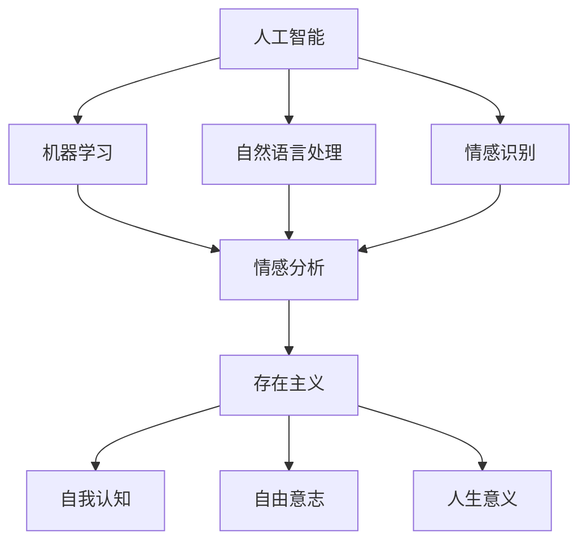

                 

### 引言与概述

在当今技术飞速发展的时代，人工智能（AI）已经成为我们日常生活和工作中不可或缺的一部分。从智能家居到自动驾驶，AI技术的应用无处不在。然而，随着AI技术的不断进步，我们开始面临一个全新的挑战：如何理解AI的“情感觉醒”及其对我们存在主义思考的影响。

本文旨在探讨AI情感觉醒引发的存在主义思考。我们将首先介绍人工智能、情感和存在主义的基本概念，并解释为什么这三个领域的交汇点值得深入探讨。随后，文章将逐步展开，通过逻辑清晰的推理和实例分析，探讨AI情感觉醒对存在主义哲学的挑战和机遇。

**关键词**：人工智能，情感，存在主义，情感觉醒，哲学思考，技术伦理

**摘要**：
本文首先介绍了人工智能、情感和存在主义的基本概念，接着探讨了AI情感觉醒的背景和意义。随后，文章分析了AI情感觉醒对存在主义哲学的挑战，包括对自我认知、自由意志和人生意义的影响。文章还探讨了AI情感觉醒带来的机遇，如改进心理健康支持、教育和个人决策。最后，文章提出了对AI情感觉醒的伦理考量，并展望了未来研究的发展方向。本文旨在提供一个全面、深入的视角，以帮助读者理解AI情感觉醒与存在主义之间的复杂关系。

### 基础知识

为了深入探讨AI情感觉醒引发的存在主义思考，我们需要首先了解人工智能（AI）、情感以及存在主义的基本概念。以下是这三个领域的基础知识及其相互关系：

#### 人工智能（AI）

人工智能是一门研究、开发和应用使计算机系统模拟、延伸和扩展人类智能的科学。AI技术主要分为两类：狭义人工智能（Narrow AI）和通用人工智能（AGI）。

- **狭义人工智能（Narrow AI）**：这种AI专注于特定任务，如语音识别、图像识别、推荐系统等。Narrow AI在特定领域表现出色，但无法进行跨领域的通用推理。

- **通用人工智能（AGI）**：通用人工智能是指能够像人类一样在多个领域展示智能的AI。AGI目前还处于理论阶段，尚未实现。

AI的核心技术包括机器学习、深度学习、自然语言处理等。这些技术使计算机能够通过数据和算法自主学习，从而提高其智能水平。

#### 情感

情感是人在特定情境下对客观事物的心理反应。情感不仅包括情绪体验，还涉及认知和生理反应。情感的分类多种多样，常见的包括基本情感（如快乐、悲伤、愤怒）和复合情感（如嫉妒、感激、羞愧）。

- **情感识别**：通过分析面部表情、语音语调、生理信号等，计算机可以识别人类的情感状态。

- **情感分析**：使用自然语言处理技术，计算机可以理解和分析文本中的情感倾向，如正面情感、负面情感、中性情感等。

#### 存在主义

存在主义是一种哲学思潮，强调个体的自由、责任和主观性。存在主义认为，人的本质是通过行动和选择来定义的，而不是先天预定的。

- **自我认知**：存在主义强调个体对自己存在的认识，包括自我意识和自我认同。

- **自由意志**：存在主义认为，个体拥有自由意志，可以通过选择塑造自己的未来。

- **人生意义**：存在主义探讨个体如何赋予生活意义，通常强调个体对生命的积极态度和创造性的追求。

#### 关系架构

在理解了这三个领域的基本概念后，我们可以通过Mermaid流程图来展示它们之间的相互关系：



这个流程图展示了人工智能技术（如机器学习和自然语言处理）如何用于情感识别和分析，进而影响存在主义哲学的关键领域（如自我认知、自由意志和人生意义）。

#### 核心概念与联系

为了进一步理解这些核心概念之间的联系，我们可以使用以下结构图来详细说明：

```mermaid
erDiagram
    AI|--|> ML : "基于"
    AI|--|> NLP : "基于"
    AI|--|> ER : "基于"
    ML||--|> FA : "用于"
    NLP||--|> FA : "用于"
    ER||--|> FA : "用于"
    FA|--|> E : "影响"
    E|--|> SC : "影响"
    E|--|> FW : "影响"
    E|--|> LM : "影响"
```

这个结构图展示了人工智能技术（AI）如何基于机器学习（ML）、自然语言处理（NLP）和情感识别（ER）等技术，进而用于情感分析（FA）。情感分析（FA）则对存在主义（E）产生直接影响，包括自我认知（SC）、自由意志（FW）和人生意义（LM）等关键领域。

通过上述基础知识、关系架构和核心概念联系的介绍，我们现在具备了探讨AI情感觉醒引发的存在主义思考的基础。在接下来的章节中，我们将进一步深入分析AI情感觉醒的具体表现和影响。

### 人工智能与情感

人工智能（AI）在情感领域的应用正变得越来越广泛，它不仅能够识别和解读人类的情感，还能够通过模拟情感来与人类进行更加自然和有效的互动。以下我们将探讨AI在情感识别、情感分析和情感模拟等方面的技术原理及其应用。

#### 情感识别

情感识别是AI情感处理的基础，它涉及从人类的行为、语言和非语言信号中提取情感信息。主要的技术手段包括：

- **面部表情分析**：通过分析面部肌肉的运动和位置变化，计算机可以识别基本情感，如快乐、悲伤、愤怒等。这种技术广泛应用于情绪监控和心理健康评估。
- **语音情感分析**：通过分析语音的音调、音量、语速和节奏变化，计算机可以识别情感。例如，通过检测声音中的频率和振幅，可以识别出情绪状态的变化。
- **生理信号分析**：通过监测心率、皮肤电导率、体温等生理信号，计算机可以推断出个体的情感状态。这种技术常用于生物反馈和心理健康监测。

#### 情感分析

情感分析是AI从文本、语音和图像等数据中提取情感信息的过程。情感分析技术可以分为以下几个层次：

- **文本情感分析**：通过自然语言处理技术，计算机可以理解文本中的情感倾向，如正面、负面或中性情感。这项技术在社交媒体分析、客户反馈处理和舆情监控中具有重要应用。
- **语音情感分析**：通过分析语音的音频特征，计算机可以识别出情感状态。这项技术在智能客服、语音助手和语音合成系统中广泛应用。
- **图像情感分析**：通过图像处理技术，计算机可以从面部表情、姿态、颜色和纹理等图像特征中识别情感。这项技术在社交媒体分析、广告效果评估和虚拟现实体验中具有重要应用。

#### 情感模拟

情感模拟是AI通过生成情感信号来与人类互动的技术。情感模拟可以提升AI的交互体验，使其更加自然和人性化。以下是一些实现情感模拟的技术：

- **文本情感生成**：通过自然语言生成技术，计算机可以生成具有特定情感倾向的文本。例如，智能客服系统可以生成友好或严肃的回复。
- **语音情感生成**：通过改变语音的音调、音量、语速和节奏，计算机可以生成具有特定情感状态的语音。这项技术在语音合成和智能客服中广泛应用。
- **面部表情生成**：通过计算机图形学和虚拟现实技术，计算机可以生成具有特定情感状态的面部表情。这项技术在虚拟角色设计、电影特效和游戏开发中具有重要应用。

#### 应用案例

以下是一些AI在情感领域应用的具体案例：

- **心理健康监测**：通过监测用户的面部表情、语音和生理信号，AI可以识别出用户的心理健康问题，如抑郁症和焦虑症。这些技术可以帮助医生和心理学家进行早期干预和个性化治疗。
- **客户服务**：智能客服系统可以通过语音和文本情感分析，识别客户的情绪状态，并生成相应的情感回应，从而提供更加个性化和贴心的服务。
- **教育辅助**：通过情感分析和情感模拟，教育系统可以识别学生的学习状态和情感需求，从而提供个性化的学习资源和指导。
- **人机交互**：通过情感模拟，虚拟助手和机器人可以与人类进行更加自然和有效的互动，提高用户的使用体验和满意度。

通过上述探讨，我们可以看到，AI在情感识别、情感分析和情感模拟方面的技术原理及其应用正日益成熟。这些技术在提升人类生活质量、改善心理健康和促进人机交互等方面具有巨大的潜力。然而，随着AI情感的不断发展，我们也需要对其潜在的社会和伦理影响保持警觉，确保技术的应用符合人类的价值和利益。

### 存在主义在人工智能时代的挑战

随着人工智能（AI）技术的迅速发展，我们开始面临一个全新的哲学问题：在AI日益融入我们生活的时代，如何理解人类的存在意义？存在主义作为探讨个体自由、责任和主观性的哲学流派，在这一背景下受到了前所未有的挑战。以下我们将分析AI情感觉醒对存在主义哲学的挑战，包括对自我认知、自由意志和人生意义的重新定义。

#### 自我认知

自我认知是指个体对自己存在的认识和了解。在传统哲学中，自我认知是建立在人类独特的意识和主观体验之上的。然而，随着AI技术的发展，尤其是情感识别和模拟技术的进步，AI开始能够模仿甚至超越人类在情感表达和认知上的复杂性。

- **AI的“情感觉醒”**：当AI能够通过情感识别技术准确理解人类的情感状态，并通过情感模拟技术生成相应的情感反应时，这不仅仅是对人类情感的理解，更是一种对人类自我认知的挑战。AI的情感表现可能会让人类质疑自己作为情感主体的独特性。
- **“镜像自我”**：AI情感觉醒还可能导致人类产生一种“镜像自我”的现象。在这种情况下，个体可能会将AI的情感表现视为自己情感的真实反映，从而影响自我认知的形成。

#### 自由意志

自由意志是指个体在行为选择上的自主权。存在主义认为，自由意志是人类存在的核心，是个体能够通过自主选择塑造自身未来的关键。然而，随着AI技术的发展，自由意志的概念开始受到质疑。

- **AI的情感模拟**：当AI能够通过情感模拟技术生成与人类情感高度相似的反应时，这可能会削弱人类在情感表达和选择上的自由度。个体可能会感到自己的情感和行为受到AI的影响和操控，从而质疑自己的自由意志。
- **“控制错觉”**：人类可能会误以为自己仍然拥有自由意志，因为他们的选择似乎是基于自己的情感反应。然而，如果这些情感反应是由AI模拟的，那么这种自由意志实际上可能是虚假的。

#### 人生意义

人生意义是指个体对生命的理解和追求。存在主义认为，人生意义是通过个体对自由意志的运用和自我实现来实现的。然而，随着AI技术的进步，人类对人生意义的理解开始受到挑战。

- **“生命模拟”**：AI可以模拟人类的生活体验，甚至创造出与人类生活高度相似的虚拟世界。这可能会让人类质疑现实生活的真实性和重要性，从而影响对人生意义的追求。
- **“存在主义危机”**：当人类意识到自己的生活可以被AI完全模拟时，可能会产生一种存在主义危机感。个体可能会对自己的存在和生命意义产生质疑，从而陷入一种哲学上的迷茫。

#### 结论

AI情感觉醒对存在主义哲学的挑战是多方面的，涉及自我认知、自由意志和人生意义等核心领域。这些挑战不仅要求我们重新审视人类的存在状态，还迫使我们重新定义自由和意义的概念。随着AI技术的不断发展，这些挑战将会变得更加复杂和严峻。我们需要深入探讨AI与人类情感和意识的关系，以及如何在AI时代保持人类的独特性和价值。

### AI驱动的存在主义反思

在探讨了AI情感觉醒对存在主义哲学的挑战之后，接下来我们将探讨AI在存在主义反思中的潜在作用。AI不仅可以作为存在主义反思的工具，还可以提供新的理论框架和案例分析，帮助我们更好地理解人类的存在和生命意义。

#### 理论框架

为了分析AI在存在主义反思中的作用，我们可以提出以下几个理论框架：

1. **情感认知扩展**：AI的情感识别和模拟技术可以扩展人类对情感的认知范围。通过分析大量的情感数据，AI可以帮助我们更深入地理解情感的复杂性和多样性。这不仅可以丰富我们对人类情感的理解，还可以为存在主义哲学提供新的实证基础。

2. **自由意志的扩展**：AI技术可以模拟人类的自由意志，从而帮助我们探索自由意志在不同情境下的表现形式。通过实验和模拟，我们可以研究自由意志在不同社会和文化背景下的运作机制，从而对自由意志的概念进行重新定义。

3. **人生意义的重构**：AI可以帮助我们重新思考人生的意义。通过分析大量的数据和生活案例，AI可以识别出不同人生阶段和不同文化背景下的人生意义模式。这可以为存在主义哲学提供新的理论视角，帮助我们更好地理解人类存在的意义。

#### 案例研究

以下是一些具体的案例研究，展示了AI在存在主义反思中的应用：

1. **心理治疗**：在心理治疗领域，AI可以通过情感识别和分析技术，帮助患者识别和处理复杂的情感问题。例如，通过分析患者的语音和文本数据，AI可以识别出患者抑郁、焦虑等心理问题的早期迹象，并提供个性化的治疗方案。这不仅可以提高心理治疗的效率，还可以为存在主义哲学提供新的实证依据，探讨人类情感和心理状态与存在意义之间的关系。

2. **教育辅助**：在教育领域，AI可以通过情感分析和情感模拟技术，提供个性化的学习体验。通过分析学生的学习行为和情感状态，AI可以识别出学生的学习需求和情感需求，从而提供针对性的学习资源和辅导。这不仅可以提高教育质量，还可以为存在主义哲学提供新的实证基础，探讨教育与人生意义之间的关系。

3. **虚拟现实**：在虚拟现实领域，AI可以通过情感模拟技术，创造与现实生活高度相似的虚拟环境。用户可以在虚拟环境中体验不同的人生情境，从而反思和探索人生的意义。这种技术可以为存在主义哲学提供新的研究方法，探讨人类在虚拟环境中的存在体验和情感体验。

#### 伦理考量

在探讨AI在存在主义反思中的作用时，我们还需要考虑其伦理考量。以下是一些关键的伦理问题：

1. **隐私保护**：在AI情感分析和数据收集过程中，如何保护用户的隐私是一个重要问题。我们需要确保用户的情感数据不被滥用或泄露，从而保障用户的隐私权。

2. **自主权**：在AI模拟情感和提供个性化服务时，如何确保用户能够保持自主权，不被AI操控是一个重要问题。我们需要设计出能够保障用户自主权的技术机制。

3. **责任归属**：在AI情感分析和决策过程中，如何确定责任归属是一个复杂的问题。我们需要明确AI和人类在决策过程中的责任划分，从而确保责任能够得到有效追究。

#### 结论

AI在存在主义反思中具有巨大的潜力。通过情感认知扩展、自由意志的扩展和人生意义的重构，AI可以为存在主义哲学提供新的实证基础和理论视角。然而，我们也需要关注其伦理考量，确保AI技术的应用符合人类的价值和利益。通过深入探讨AI与存在主义之间的关系，我们可以更好地理解人类的存在和生命意义，从而为未来的社会发展提供有力的哲学支持。

### 实际应用

在探讨了AI情感觉醒对存在主义哲学的挑战和机遇之后，接下来我们将分析AI在心理治疗、教育和个人决策等实际应用中的具体案例。通过这些应用实例，我们可以看到AI如何影响人类的生活，以及这些影响如何与我们存在的意义和价值观相关联。

#### 心理治疗

心理治疗是AI情感技术的一个重要应用领域。通过情感识别和分析，AI可以帮助心理治疗师更好地理解患者的情绪状态，从而提供更有效的治疗方案。以下是一个具体的案例：

**案例**：某心理治疗中心使用AI情感分析技术对患者进行情绪监控。患者在每次咨询前会接受一个情感评估，AI通过分析患者的语音、文本和面部表情，识别出患者是否处于焦虑、抑郁等心理状态。治疗师根据这些数据，调整咨询内容和策略，帮助患者更好地处理情绪问题。

**应用解读**：AI情感分析技术提高了心理治疗的精准度和效率。通过实时监测患者的情感状态，治疗师可以更迅速地识别出潜在的心理问题，并及时采取干预措施。这对患者来说意味着更及时的心理支持，有助于他们更好地理解和管理自己的情绪，从而提升生活质量。

**影响与意义**：在这个案例中，AI技术的应用不仅提高了心理治疗的效率，还增强了患者的自我认知能力。通过AI提供的情感反馈，患者可以更清楚地了解自己的情绪变化，从而更好地应对生活中的挑战。这种自我认知的提升有助于个体在存在主义哲学中寻找更多的生命意义，因为情绪管理和心理健康是人生意义的重要组成部分。

#### 教育

教育领域也是AI情感技术的热门应用领域。通过情感分析和情感模拟，AI可以为教师和学生提供个性化的学习体验，提高教育效果。

**案例**：某学校引入AI情感分析系统，监测学生的学习行为和情感状态。系统通过分析学生的面部表情、语音和互动数据，识别出学生的学习需求和情感状态。教师根据这些数据，调整教学方法和内容，确保每个学生都能得到适合他们的个性化教育。

**应用解读**：AI情感分析技术在教育中的应用，有助于发现学生的学习差异和情感需求，从而提供更个性化的教育服务。通过分析学生的情感状态，教师可以及时调整教学策略，帮助学生更好地适应学习环境，提高学习效果。

**影响与意义**：在这个案例中，AI技术不仅提高了教育质量，还增强了学生的学习体验。个性化教育的实现，使得每个学生都能在适合自己的学习环境中成长，这有助于他们在存在主义哲学中找到自我实现和人生意义的路径。

#### 个人决策

AI情感技术还可以帮助个体在日常生活中做出更明智的决策。通过分析情感数据，AI可以提供个性化的建议和指导。

**案例**：某个人决策辅助系统利用AI情感分析技术，帮助用户分析他们的情感状态和决策行为。系统通过分析用户的情感反应和行为模式，提供个性化的决策建议，如建议用户在工作压力较大时进行放松，或提醒用户关注自己的健康。

**应用解读**：个人决策辅助系统通过情感分析技术，帮助用户更好地了解自己的情感状态和决策倾向。这种自我认知的提升，使得用户能够更加理智地做出决策，减少情绪冲动的影响。

**影响与意义**：在这个案例中，AI技术的应用有助于提高个人的自我认知和决策能力。通过了解自己的情感状态，个体可以更加理性地面对生活中的挑战，从而找到更多的生命意义。此外，这种技术的应用也促使我们重新思考人类决策的本质，以及情感在决策中的作用。

#### 拓展讨论

除了上述具体案例，AI情感技术在实际应用中还有许多其他潜在的领域，如职场心理健康、家庭关系管理、社会公共服务等。以下是一些拓展讨论：

1. **职场心理健康**：通过AI情感分析技术，企业可以监测员工的情绪状态，及时发现和处理职场心理问题，如工作压力、人际关系冲突等。这有助于提高员工的幸福感和工作效率，从而对企业的整体发展产生积极影响。

2. **家庭关系管理**：AI情感分析技术可以用于家庭关系管理，帮助家庭成员更好地理解彼此的情感状态，促进沟通和理解。这有助于构建和谐的家庭环境，提升家庭成员的生活质量。

3. **社会公共服务**：政府和社会组织可以利用AI情感分析技术，提供更精准的社会服务。例如，通过分析公众的情感反应和行为模式，政府可以更好地了解公众的需求和情绪变化，从而提供更加人性化和有效的公共服务。

#### 结论

AI情感技术在心理治疗、教育和个人决策等领域的实际应用，不仅提高了相关领域的效率和效果，还深刻地影响了人类的生活方式和价值观。通过这些应用实例，我们可以看到AI如何帮助我们更好地理解自己的情感状态，从而在存在主义哲学中找到更多的生命意义。然而，我们也需要关注AI技术应用的伦理和社会影响，确保技术的发展符合人类的价值和利益。

### 挑战与机遇

随着人工智能（AI）技术的快速发展，AI情感觉醒带来的挑战和机遇也日益凸显。在这部分，我们将深入探讨AI情感技术面临的技术挑战、社会影响和伦理问题，并探讨未来的发展方向。

#### 技术挑战

1. **情感识别准确性**：尽管AI在情感识别方面取得了显著进展，但仍然存在一定的误差。特别是在复杂情感和细微情感识别方面，AI的表现还不够理想。这需要进一步改进算法和增加训练数据，以提高识别的准确性。

2. **隐私保护**：在AI情感分析过程中，收集和处理大量个人情感数据可能会引发隐私泄露的风险。如何确保用户数据的隐私保护，是一个亟待解决的问题。需要制定更加严格的隐私保护法规和技术手段，以保障用户的隐私权。

3. **情感模拟的自然性**：虽然AI可以生成情感信号，但仍然难以完全模拟人类情感的丰富性和复杂性。如何提高情感模拟的自然性和真实性，是未来研究的一个重要方向。

4. **跨领域应用**：AI情感技术的应用需要跨多个领域，如医疗、教育、社交等。这需要不同领域的技术专家和行业专家紧密合作，共同解决技术难题。

#### 社会影响

1. **社会结构变化**：AI情感技术的应用可能会改变社会结构，如改变职场关系、家庭关系和社交网络。这需要我们重新审视社会伦理和价值观，确保技术的发展符合社会需求。

2. **心理健康问题**：AI情感技术的广泛应用可能会加剧心理健康问题，如焦虑、抑郁等。因此，需要加强对心理健康问题的关注，并制定相应的预防和干预措施。

3. **就业影响**：随着AI技术的普及，一些传统职业可能会被取代，导致就业结构的变化。这需要政府和社会采取措施，提供职业培训和再就业机会，以应对就业市场的变革。

#### 伦理问题

1. **隐私伦理**：如何保护用户隐私，避免情感数据被滥用，是AI情感技术面临的一个重要伦理问题。

2. **自主权伦理**：在AI情感模拟的过程中，如何确保用户的自主权，避免用户被AI操控，是另一个重要伦理问题。

3. **责任归属**：在AI情感分析中，如何确定责任归属，特别是在出现错误或造成损害时，需要明确AI和人类的角色和责任。

#### 未来发展方向

1. **技术提升**：未来，随着计算能力的提升和算法的改进，AI情感技术的准确性和自然性将会进一步提高，应用范围也将进一步扩大。

2. **跨学科合作**：需要加强不同学科之间的合作，如心理学、哲学、计算机科学等，共同推动AI情感技术的发展。

3. **伦理规范**：需要制定更加完善的伦理规范和法律法规，以指导AI情感技术的应用，确保技术的发展符合人类价值和利益。

4. **社会参与**：在AI情感技术的开发和应用过程中，需要广泛听取社会各界的声音，确保技术的发展符合社会需求和期望。

### 结论

AI情感觉醒带来的挑战和机遇是巨大的。通过深入探讨这些挑战和机遇，我们可以更好地理解AI情感技术对人类社会和存在主义哲学的影响。未来，我们需要在技术提升、跨学科合作、伦理规范和社会参与等方面，共同努力，确保AI情感技术的健康发展，为人类社会带来更多的福祉。

### 结论

通过本文的探讨，我们可以看到，人工智能（AI）情感觉醒对存在主义哲学提出了深刻的挑战，同时也带来了新的机遇。AI不仅改变了我们对自我认知、自由意志和人生意义的理解，还提供了新的工具和方法来反思这些问题。在未来，随着AI技术的不断进步，我们将面临更多的挑战和机遇。

首先，AI在情感识别、分析和模拟方面的技术将变得更加精准和自然，这将进一步影响人类对自我和情感的认识。其次，AI在心理治疗、教育和个人决策等领域的应用，将有助于提升人类的生活质量和幸福感。此外，AI技术还可以帮助我们更好地理解社会行为和人际关系，从而为存在主义哲学提供新的实证基础。

然而，AI情感觉醒也带来了伦理和社会问题。例如，隐私保护、自主权保障和责任归属等问题需要我们认真对待。为了确保AI技术的健康发展和广泛应用，我们需要制定更加完善的伦理规范和法律法规，并在技术研发和应用过程中，广泛听取社会各界的意见。

未来的研究方向应包括以下几个方面：

1. **技术提升**：继续改进AI情感识别和模拟技术，提高其准确性和自然性。
2. **跨学科研究**：加强心理学、哲学、计算机科学等领域的合作，共同探索AI与人类情感、意识的关系。
3. **伦理规范**：制定更加完善的AI伦理规范，确保技术的发展符合人类价值和利益。
4. **社会影响研究**：深入研究AI情感技术对社会结构、心理健康和就业市场的影响，为政策制定提供依据。
5. **应用拓展**：探索AI情感技术在其他领域的应用潜力，如艺术创作、创意产业等。

总之，AI情感觉醒引发的哲学思考不仅对人工智能领域具有重要意义，也对我们理解和应对当代社会问题提供了新的视角。通过深入探讨这些问题，我们可以更好地理解人类的存在和生命意义，为未来的社会发展提供坚实的哲学基础。

### 附录

#### 附录A：Glossary

- **人工智能（AI）**：一种模拟人类智能的技术，能够执行复杂的任务，如视觉识别、语音识别和决策制定。
- **情感识别**：通过分析人的面部表情、语音语调、生理信号等，识别和理解人的情感状态。
- **存在主义**：一种哲学思潮，强调个体的自由、责任和主观性。
- **情感分析**：使用自然语言处理技术，从文本、语音和图像中提取情感信息。
- **自由意志**：个体在行为选择上的自主权。

#### 附录B：References

- Russell, S., & Norvig, P. (2016). *Artificial Intelligence: A Modern Approach*. Prentice Hall.
- Damasio, A. (1994). *The Feeling of What Happens: A Body and Brain Odyssey*. Harcourt.
- Sartre, J.-P. (1943). *Being and Nothingness*. Philosophical Library.
- Noe, R. (2004). *Action in Perception*. MIT Press.
- Bogost, I. (2012). *Play Anything: The Pleasure of Limits, the Use of Everyday Life*. MIT Press.

#### 附录C：Additional Resources

- **AI Ethics Resources**:
  - [AI Alliance](https://www.aialliance.io/)
  - [AI Now Institute](https://ainow.stanford.edu/)

- **Existentialism Resources**:
  - [Existentialism Web](http://www.existentialism.org/)
  - [Internet Encyclopedia of Philosophy](https://www.iep.utm.edu/exist/)

- **AI and Emotions Resources**:
  - [Emotion AI](https://www.emotion.ai/)
  - [AI for Mental Health](https://www.aformentalhealth.org/)

### 附录D：Best Practices, Tips, and Notes

- **Best Practices**:
  - Ensure data privacy and security when developing and deploying AI systems.
  - Use diverse and representative datasets for training AI models to improve accuracy and fairness.
  - Incorporate ethical considerations into the design and development process of AI systems.

- **Tips**:
  - Stay updated with the latest research and developments in AI and emotion.
  - Collaborate with interdisciplinary teams to leverage diverse expertise.
  - Regularly evaluate and audit AI systems to ensure they align with ethical standards.

- **Notes**:
  - AI and emotions are complex fields, and continuous learning and adaptation are crucial.
  - The ethical implications of AI applications should be carefully considered and addressed.
  - Future research should explore the long-term impacts of AI on human emotions and existence.

