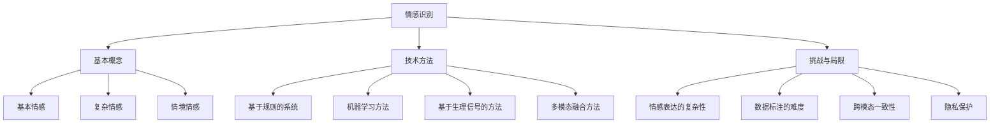
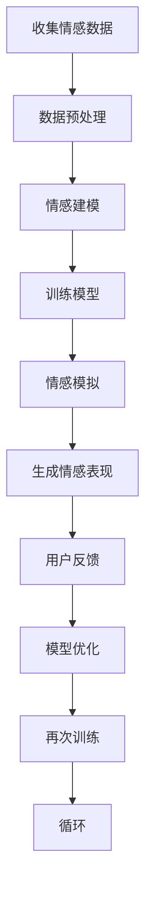

                 

### 篇章一：引言：AI情感的觉醒

在过去的几十年里，人工智能（AI）技术的发展可谓日新月异，从最初的规则推理、知识表示，到如今的深度学习、神经网络，AI已经在各个领域展现出了惊人的能力。然而，随着技术的不断进步，AI在情感领域的探索也引起了广泛的关注。所谓AI情感，是指人工智能系统对人类情感的识别、理解和模拟能力。

#### 技术发展历程

AI情感识别技术的发展可以追溯到20世纪80年代，当时研究人员开始探索如何让计算机理解并处理情感信息。早期的尝试主要集中在情感词汇的提取和情感极性的判断上。随着自然语言处理（NLP）技术的进步，情感分析逐渐成为AI研究的一个重要方向。

进入21世纪，随着深度学习技术的崛起，AI情感识别迎来了新的契机。深度神经网络（DNN）和卷积神经网络（CNN）等模型在图像和语音情感识别方面取得了显著成果。同时，基于大数据的机器学习方法使得AI能够从海量的数据中学习情感模式，从而提高了情感识别的准确性和可靠性。

#### 情感觉醒对伦理的挑战

随着AI情感技术的不断进步，其应用场景也逐渐扩展到医疗、教育、金融等领域。然而，这种技术的快速发展也引发了一系列伦理问题，主要包括以下几个方面：

1. **个人隐私保护**：AI在情感识别过程中，往往需要收集大量的个人数据，如面部表情、语音特征等。这些数据的隐私保护成为一个重要的问题。

2. **性别与种族偏见**：AI情感识别模型在训练过程中可能会受到数据偏差的影响，导致模型在性别、种族等方面的表现不一致，从而引发歧视问题。

3. **情感欺骗与滥用**：AI情感模拟技术的发展使得人们可以模拟出各种情感反应，这可能导致情感欺骗和滥用，从而影响社会交往和人际信任。

#### 总结

本章首先介绍了AI情感技术的发展历程，从早期的情感词汇提取到现代的深度学习技术。接着，我们讨论了AI情感觉醒对伦理带来的挑战，主要包括个人隐私保护、性别与种族偏见以及情感欺骗与滥用等问题。这些挑战不仅需要技术层面的解决，更需要从伦理和法律的角度进行综合考虑。

在接下来的章节中，我们将深入探讨AI情感识别和模拟的具体原理，分析其中的伦理困境，并通过案例研究提出可能的解决方案。希望读者能通过本文，对AI情感技术的发展和应用有更加全面和深刻的理解。

### 篇章二：AI情感识别原理

#### 1.1 情感识别的基本概念

情感识别（Emotion Recognition），也被称为情感分析（Emotion Analysis），是指利用计算机技术对人类情感状态进行识别和分类的过程。情感识别的核心目标是从各种形式的情感表达中提取情感信息，以便机器能够理解和处理这些信息。

在情感识别中，主要涉及以下几类情感：

1. **基本情感**：也称为初级情感，包括快乐、悲伤、愤怒、惊讶、恐惧等。这些情感被认为是人类普遍共有的基本情感。

2. **复杂情感**：相对于基本情感，复杂情感更为多样和层次化，如满足、无聊、羞愧、厌恶等。复杂情感往往是由基本情感混合或叠加而成的。

3. **情境情感**：情境情感与特定环境或情境密切相关，如尴尬、焦虑等。这些情感往往依赖于具体情境的感知和理解。

#### 1.2 情感识别的技术方法

情感识别技术主要依赖于以下几种方法：

1. **基于规则的系统**：这种方法的优点在于其透明性和可解释性，可以通过预设的规则来识别情感。然而，由于其规则库的构建依赖于大量的手工设定，因此往往难以适应复杂多变的情感表达。

2. **机器学习方法**：通过训练分类器，使系统能够自动从数据中学习情感模式。常用的机器学习方法包括支持向量机（SVM）、决策树、随机森林等。近年来，随着深度学习技术的发展，基于深度神经网络的情感识别方法逐渐成为主流。

3. **基于生理信号的方法**：通过检测生理信号，如面部表情、心率、皮肤电反应等，来识别情感。这种方法的主要优势在于其非侵入性，但需要复杂的信号处理和数据分析技术。

4. **多模态融合方法**：结合多种数据源，如文本、语音、图像等，以提高情感识别的准确性和鲁棒性。这种方法能够充分利用不同数据源的特点，从而提升系统的整体性能。

#### 1.3 情感识别的挑战与局限

尽管情感识别技术在过去几十年中取得了显著进展，但仍面临着以下挑战和局限：

1. **情感表达的复杂性**：人类的情感表达非常复杂，不同人在同一情感状态下可能会有不同的表达方式。这使得情感识别模型需要具备高度的泛化能力和适应性。

2. **数据标注的难度**：情感识别的准确性很大程度上取决于数据集的质量。然而，获取高质量的情感数据集非常困难，因为情感标注需要大量的人类专家参与，且标注过程容易受到主观因素的影响。

3. **跨模态一致性**：在多模态融合方法中，如何保证不同数据源之间的一致性是一个重要问题。不同模态的数据在时间和空间上可能存在不一致性，这会影响情感识别的准确性。

4. **隐私保护**：情感识别过程中，往往需要收集大量的个人数据，如面部图像、语音等。如何确保这些数据的安全性和隐私性是一个亟待解决的问题。

#### 核心概念原理之间的关系架构

为了更好地理解情感识别的原理，我们可以使用Mermaid流程图来展示核心概念之间的关系：



#### 核心算法原理讲解

为了深入理解情感识别的算法原理，我们可以通过伪代码来描述一个基于机器学习方法的情感识别过程：

```python
# 数据预处理
def preprocess_data(data):
    # 对文本数据进行分词、去停用词等处理
    # 对图像数据进行归一化、裁剪等处理
    # 对语音数据进行特征提取
    return processed_data

# 训练情感识别模型
def train_model(data, labels):
    # 使用支持向量机、决策树、随机森林等算法训练模型
    # 或使用深度神经网络进行训练
    model = train_nn(data, labels)
    return model

# 情感识别
def recognize_emotion(model, input_data):
    # 对输入数据进行预处理
    processed_data = preprocess_data(input_data)
    # 使用训练好的模型进行预测
    prediction = model.predict(processed_data)
    return prediction
```

#### 数学模型和公式详解

在情感识别中，常用的数学模型包括支持向量机（SVM）和深度神经网络（DNN）。以下是这些模型的基本公式和参数详解：

1. **支持向量机（SVM）**：

   - 公式：
     $$ \text{max} \ \frac{1}{2} ||\mathbf{w}||^2 $$
     s.t. $ y^{(i)}(\mathbf{w}\cdot \mathbf{x}^{(i)}) \geq 1 $

   - 参数解释：
     - $\mathbf{w}$：模型权重向量。
     - $\mathbf{x}^{(i)}$：第$i$个训练样本的特征向量。
     - $y^{(i)}$：第$i$个训练样本的真实标签。

2. **深度神经网络（DNN）**：

   - 公式：
     $$ \text{Output} = \sigma(\mathbf{w}^{L} \cdot \mathbf{a}^{L-1} + b^{L}) $$
     其中，$\sigma$为激活函数（如Sigmoid、ReLU等），$\mathbf{w}^{L}$为第$L$层的权重矩阵，$\mathbf{a}^{L-1}$为第$L-1$层的激活向量，$b^{L}$为第$L$层的偏置。

   - 参数解释：
     - $\sigma$：激活函数。
     - $\mathbf{w}^{L}$：权重矩阵。
     - $\mathbf{a}^{L-1}$：激活向量。
     - $b^{L}$：偏置。

#### 举例说明

假设我们使用一个简单的神经网络来识别图像中的情感，数据集包含1000张图像和其对应的情感标签。以下是训练过程的一个示例：

1. **数据预处理**：

   - 对图像数据进行归一化处理，将像素值缩放到0-1之间。
   - 对图像进行裁剪，确保所有图像的大小一致。

2. **模型训练**：

   - 选择一个适合情感识别的神经网络架构，如卷积神经网络（CNN）。
   - 使用训练集对模型进行训练，通过反向传播算法更新模型参数。
   - 在训练过程中，使用验证集来调整模型参数，避免过拟合。

3. **情感识别**：

   - 对新的图像进行预处理，然后输入到训练好的模型中进行预测。
   - 输出模型的预测结果，与真实标签进行比较，计算识别准确率。

通过以上步骤，我们可以实现一个基本的情感识别系统，从而为后续章节中的伦理困境分析和解决方案提供技术基础。

### 篇章三：AI情感建模与模拟

#### 3.1 情感建模的理论基础

情感建模（Emotion Modeling）是人工智能（AI）领域的一个重要分支，旨在使计算机系统能够理解和模拟人类情感。情感建模的理论基础涵盖了多个学科，包括认知心理学、情感学、计算语言学和机器学习。

1. **认知心理学与情感学**：认知心理学研究人类如何感知、理解并处理信息，情感学则专注于人类情感的本质、发展和功能。这些学科为情感建模提供了重要的理论基础，帮助我们理解情感的生成、表达和识别。

2. **计算语言学**：计算语言学涉及自然语言处理（NLP）和语言生成技术。通过计算语言学的方法，我们可以将人类的语言表达与情感状态关联起来，从而实现对情感的语言建模。

3. **机器学习**：机器学习是情感建模的核心技术手段。通过训练分类器和生成模型，我们可以使计算机从数据中学习情感模式，实现对情感状态的自动识别和模拟。

#### 3.2 情感模拟的技术实现

情感模拟（Emotion Simulation）是通过计算机技术再现人类情感状态的过程。情感模拟的实现涉及到多个技术领域，包括语音合成、面部表情生成和自然语言生成等。

1. **语音合成**：语音合成技术可以使计算机生成具有情感色彩的语音。这种方法通常基于文本到语音（TTS）模型，通过将文本转换为语音信号，并添加情感特征，如音调、节奏和音量等。

2. **面部表情生成**：面部表情生成技术通过计算机视觉和图形渲染技术，使虚拟角色或动画人物能够展示出不同的情感状态。这种方法通常需要复杂的图像处理和机器学习算法来生成逼真的面部表情。

3. **自然语言生成**：自然语言生成技术可以使计算机生成具有情感色彩的自然语言文本。这种方法通常基于生成对抗网络（GAN）或变分自编码器（VAE），通过学习大量文本数据来生成情感化的语言表达。

#### 3.3 情感模拟的伦理考量

情感模拟技术的应用带来了许多潜在伦理问题，这些问题需要我们在技术实现过程中予以充分考虑。

1. **隐私保护**：情感模拟往往需要收集和处理大量的个人数据，如语音、面部表情和行为等。如何保护这些数据的安全性，防止隐私泄露，是一个重要的伦理问题。

2. **公平与偏见**：情感模拟系统可能会因为数据集的偏差而表现出不公平或偏见。例如，如果训练数据集中某一群体的数据较少，那么模拟系统可能无法准确模拟这一群体的情感状态。

3. **情感滥用**：情感模拟技术可能导致情感欺骗和滥用，从而影响社会交往和人际信任。例如，恶意使用情感模拟技术来操纵他人情感，可能会造成严重的道德和伦理问题。

4. **透明性与可解释性**：情感模拟系统的决策过程往往具有一定的黑箱性质，这使得用户难以理解和信任系统。提高系统的透明性和可解释性，是解决这一伦理问题的重要途径。

#### Mermaid流程图

为了更好地理解情感模拟的技术实现过程，我们可以使用Mermaid流程图来展示关键步骤：



#### 伪代码示例

以下是情感模拟的一个简单伪代码示例，展示了从数据收集到情感生成的整个过程：

```python
# 数据收集
def collect_data():
    # 收集语音、面部表情和行为数据
    return data_set

# 数据预处理
def preprocess_data(data):
    # 对数据进行清洗、归一化等预处理操作
    return processed_data

# 情感建模
def build_model():
    # 使用机器学习算法构建情感模型
    return model

# 训练模型
def train_model(model, data, labels):
    # 使用训练集对模型进行训练
    return trained_model

# 情感模拟
def simulate_emotion(model, input_data):
    # 使用训练好的模型进行情感模拟
    return emotion_output

# 用户反馈
def get_user_feedback(emotion_output):
    # 获取用户对情感输出的反馈
    return feedback

# 模型优化
def optimize_model(model, feedback):
    # 根据用户反馈优化模型
    return optimized_model
```

通过上述步骤，我们可以实现一个基本的情感模拟系统，为接下来的伦理困境分析和解决方案提供技术支持。

### 篇章四：AI情感伦理困境

#### 4.1 个人隐私保护

随着人工智能（AI）技术的发展，AI情感识别和模拟的应用场景越来越广泛。然而，这些应用在带来便利的同时，也引发了一系列隐私保护问题。特别是在情感识别过程中，AI系统需要收集大量的个人数据，如面部表情、语音和文本等。这些数据中往往包含了用户的隐私信息，如情感状态、个人偏好和生活习惯等。因此，如何在确保AI技术发展的同时，有效保护个人隐私，成为了一个亟待解决的伦理问题。

**隐私泄露的风险**：首先，情感数据的收集和处理过程中，存在隐私泄露的风险。例如，面部识别技术可能会在不知情的情况下捕捉用户的隐私信息，而这些信息一旦泄露，可能会导致用户的隐私受到侵犯。

**数据滥用**：其次，收集到的个人情感数据可能会被滥用。例如，企业可能利用情感分析技术来监控员工的工作状态，或者利用情感模拟技术来操纵用户的情感反应，从而实现商业目的。

**数据共享与跨境传输**：此外，情感数据往往涉及跨国家和跨地区的传输和共享。在不同国家和地区，数据保护的法律法规可能存在差异，这使得情感数据在跨境传输过程中面临更大的隐私风险。

**解决方案**：

1. **数据加密**：通过加密技术，确保情感数据在传输和存储过程中的安全性。例如，使用端到端加密技术来保护数据传输过程中的隐私。

2. **隐私保护算法**：开发和应用隐私保护算法，如差分隐私（Differential Privacy）和同态加密（Homomorphic Encryption），以保护用户隐私。

3. **法律法规**：制定和执行严格的法律法规，明确情感数据的使用范围和限制，以防止隐私滥用和数据泄露。

4. **用户知情同意**：在收集和使用情感数据时，确保用户知情并同意，以提高数据的透明度和用户的信任度。

#### 4.2 性别与种族偏见

AI情感识别和模拟技术的发展，不仅带来了隐私保护问题，还引发了性别与种族偏见的问题。这些偏见可能会在AI系统的设计和应用过程中产生，从而影响系统的公平性和公正性。

**性别偏见**：研究表明，AI情感识别系统在识别女性情感时可能存在偏差。例如，女性微笑的面部表情可能被错误地识别为愤怒或悲伤。这种现象称为“情感性别偏见”，可能源于训练数据集中的性别比例失衡或性别特征被误解。

**种族偏见**：类似地，AI情感识别系统在识别不同种族的情感时也可能存在偏见。某些种族的表情特征可能被误解或忽视，从而导致情感识别错误。例如，非洲裔美国人的情感表达可能被错误地识别为愤怒。

**解决方案**：

1. **公平性设计**：在设计和开发AI情感识别系统时，应充分考虑性别和种族的多样性，确保系统在不同性别和种族用户上的表现一致。

2. **多样化数据集**：使用多样化的数据集进行训练，以减少性别和种族偏见。确保数据集中的性别和种族比例均衡，并包含不同文化背景的情感表达。

3. **偏见检测与修正**：开发偏见检测算法，识别和修正AI系统中存在的性别和种族偏见。通过持续的监测和迭代，提高系统的公平性和准确性。

4. **透明性和可解释性**：提高AI系统的透明性和可解释性，使用户能够理解系统的决策过程和潜在偏见，从而增强用户对系统的信任。

#### 4.3 情感欺骗与滥用

AI情感模拟技术的发展，使得情感欺骗和滥用成为可能。情感欺骗指的是利用AI技术模拟出虚假的情感状态，以误导他人。情感滥用则是指利用情感模拟技术操纵他人的情感反应，从而实现某种目的。

**情感欺骗**：例如，一些恶意应用可能利用情感模拟技术，生成虚假的情感表达，用来欺骗用户或操纵市场。这种欺骗可能导致人际信任的丧失和社会秩序的混乱。

**情感滥用**：例如，在职场环境中，管理者可能利用情感模拟技术来操纵员工的情感状态，以提升工作效率或降低员工的离职率。这种行为可能对员工的身心健康造成负面影响。

**解决方案**：

1. **道德法规**：制定和执行相关法律法规，明确禁止情感欺骗和滥用行为，以规范AI技术的应用。

2. **技术检测**：开发情感检测技术，识别和阻止情感欺骗和滥用行为。例如，利用深度学习技术识别异常的情感表达，从而防止恶意应用。

3. **用户教育**：提高公众对AI情感技术的认识，增强用户的防范意识，以减少情感欺骗和滥用的影响。

4. **透明性和监管**：提高AI系统的透明性和监管力度，确保系统的决策过程和行为符合道德和伦理标准。

通过解决这些伦理困境，我们可以更好地利用AI情感技术，为人类社会带来更多的福祉。

### 篇章五：AI情感伦理案例分析

#### 5.1 案例一：情感分析软件的偏见

**背景**：

一家知名科技公司开发了一款情感分析软件，旨在帮助企业更好地理解员工的工作状态和情感需求。该软件通过分析员工在邮件、聊天记录等文本数据中的情感表达，提供情感分析报告和建议。然而，在实际应用过程中，该软件暴露出显著的性别偏见问题。

**问题描述**：

研究发现，该软件在识别女性员工情感时存在显著偏差。例如，女性员工的积极情感表达（如“我很高兴”）常常被错误地识别为负面情感（如“我很生气”）。相反，男性员工的类似情感表达则能够被正确识别。这一性别偏见问题导致企业对女性员工的工作状态产生了误解，可能引发不公平的管理决策。

**原因分析**：

这种性别偏见主要源于以下几个方面：

1. **训练数据偏差**：该软件的训练数据集中，男性员工的情感表达数据远多于女性员工。这使得模型在识别女性情感时缺乏足够的训练样本，从而导致偏差。

2. **情感表达差异**：女性和男性在情感表达上存在差异。女性更倾向于使用间接和委婉的语言来表达情感，而男性则更直接和明确。这些差异在训练过程中未能得到充分体现，导致模型无法正确识别女性情感。

3. **情感模型设计问题**：情感分析软件在设计过程中，可能未能充分考虑性别多样性，导致模型在性别识别上存在偏差。

**解决方案**：

1. **数据多样化**：增加女性情感表达数据的比例，确保训练数据集中性别比例均衡。可以通过公开征集数据、合作收集等方式，获取更多高质量的性别多样化数据。

2. **模型调整**：针对性别偏见问题，调整情感分析模型的参数，优化模型在性别识别上的性能。例如，通过引入性别特征来改进情感识别模型。

3. **用户反馈机制**：建立用户反馈机制，让用户对情感分析结果进行评价和修正。通过收集用户的反馈，不断优化和改进模型。

4. **透明性和可解释性**：提高模型的可解释性，让用户了解模型的决策过程和潜在偏见。通过可视化和解释工具，帮助用户理解和信任模型。

**启示**：

这个案例表明，AI情感识别技术在实际应用中可能存在显著的性别偏见问题。为了确保AI技术的公平性和公正性，需要从数据、模型设计和用户反馈等多个方面进行综合考虑和优化。

#### 5.2 案例二：情感机器人的滥用

**背景**：

一家在线教育平台引入了一款情感机器人，旨在为学生提供个性化的学习支持和情感关怀。这款情感机器人能够通过语音和文本互动，识别学生的情感状态，并提供相应的建议和反馈。然而，在实际应用过程中，该情感机器人被一些教师滥用，以操纵学生的情感反应。

**问题描述**：

一些教师利用情感机器人对学生进行情感操纵，例如，在考试前使用情感机器人传递焦虑情绪，以增加学生的考试压力。这种行为可能导致学生产生过度焦虑，影响其学业表现和心理健康。此外，情感机器人还可能被用于监视学生的日常行为，从而侵犯学生的隐私。

**原因分析**：

这种滥用行为主要源于以下几个方面：

1. **权限滥用**：教师可能出于个人目的，滥用情感机器人的权限，将其用于情感操纵和监视学生。

2. **监管不足**：在线教育平台在引入情感机器人时，未能制定明确的监管政策和操作规范，导致教师滥用情感机器人的情况发生。

3. **技术不成熟**：情感机器人本身的技术水平尚未完全成熟，可能导致其情感识别和反馈存在不准确和不恰当的情况。

**解决方案**：

1. **权限管理**：建立严格的权限管理机制，确保教师只能在授权的范围内使用情感机器人，防止滥用行为的发生。

2. **监管与培训**：在线教育平台应制定详细的操作规范和监管政策，对教师进行相关培训，提高其对情感机器人的正确使用和伦理意识。

3. **技术改进**：不断提升情感机器人的技术水平，提高其情感识别和反馈的准确性，减少误用和滥用的情况。

4. **用户隐私保护**：确保情感机器人在处理学生数据时，严格遵循隐私保护原则，防止学生隐私泄露。

**启示**：

这个案例表明，AI情感技术在实际应用中可能面临滥用风险。为了保障学生权益和心理健康，在线教育平台需要建立完善的监管机制，提高教师的技术水平和伦理意识，确保情感机器人的合理和规范使用。

#### 案例启示与解决方案

通过上述两个案例，我们可以看到AI情感技术在实际应用中面临的主要伦理困境，包括性别偏见、隐私滥用和情感操纵等。这些案例为我们提供了宝贵的启示，帮助我们更好地理解和解决AI情感伦理问题。

**1. 数据多样化**：确保训练数据集中性别、种族和其他社会特征的多样性，以减少偏见和歧视。通过公开征集数据、合作收集等方式，获取更多高质量的多样化数据。

**2. 模型调整与优化**：针对性别偏见、种族偏见等问题，调整和优化情感识别模型的参数和算法，提高模型的公平性和准确性。

**3. 透明性与可解释性**：提高AI情感技术的透明性和可解释性，让用户了解模型的决策过程和潜在偏见。通过可视化和解释工具，帮助用户理解和信任模型。

**4. 权限管理与监管**：建立严格的权限管理机制和监管政策，防止AI情感技术的滥用和隐私侵犯。对相关人员进行培训和监管，确保其正确使用技术。

**5. 用户隐私保护**：在处理用户数据时，严格遵循隐私保护原则，确保数据的安全性和隐私性。

通过以上措施，我们可以更好地解决AI情感伦理困境，确保AI技术在情感领域的合理和规范应用。

### 篇章六：AI情感伦理监管与规范

随着人工智能（AI）技术在情感识别和模拟领域的迅速发展，伦理监管和规范显得尤为重要。这不仅是为了保障技术的公平性、公正性和透明性，也是为了维护社会秩序和公众利益。

#### 6.1 国际伦理规范与标准

在全球范围内，多个组织和机构已经制定了关于AI伦理的规范和标准。以下是一些主要的国际伦理规范与标准：

1. **欧盟通用数据保护条例（GDPR）**：GDPR是欧盟制定的关于数据保护的重要法规，明确了个人数据的收集、处理和存储要求。虽然GDPR主要关注数据隐私保护，但其原则对AI情感技术的伦理规范具有重要参考价值。

2. **人工智能伦理指南**：联合国教科文组织（UNESCO）发布了《人工智能伦理建议》，提出了一系列关于AI伦理的原则，包括公平性、透明性、可解释性和责任感等。

3. **人工智能国际标准（ISO/IEC 17020）**：国际标准化组织（ISO）和国际电工委员会（IEC）共同发布了关于人工智能的国际标准，旨在确保AI系统的可靠性和安全性。

#### 6.2 国家监管框架

不同国家根据其国情和AI技术的发展状况，制定了相应的监管框架和政策：

1. **美国**：美国在AI伦理监管方面主要通过行业自律和政府指导。例如，美国国家标准与技术研究院（NIST）发布了AI伦理框架，旨在促进AI技术的可靠性和透明性。

2. **中国**：中国高度重视AI伦理问题，并在《新一代人工智能治理原则》中提出了关于AI伦理的五个原则，包括和谐友好、公平正义等。此外，中国还制定了《人工智能发展行动计划》，明确了AI伦理监管的总体要求。

3. **欧洲**：欧洲在AI伦理监管方面采取了较为严格的措施。欧盟通过了《人工智能法案》，旨在确保AI系统的透明性、可靠性和安全性。该法案对AI情感技术的应用提出了具体要求，如数据隐私保护、算法透明性等。

#### 6.3 行业自律与规范

除了国家和国际层面的监管，行业自律和规范在AI情感伦理监管中也扮演着重要角色。以下是一些行业自律与规范：

1. **技术行业协会**：技术行业协会通过制定行业标准和指南，规范AI情感技术的应用。例如，国际计算机协会（ACM）发布了《AI伦理指南》，为AI技术的研发和应用提供了伦理指导。

2. **企业自律**：企业通过制定内部AI伦理政策和合规指南，确保其AI情感技术的公平性、透明性和安全性。例如，一些科技公司设立了AI伦理委员会，负责监督和评估AI项目的伦理风险。

3. **公众参与**：公众参与也是AI伦理监管的重要组成部分。通过公众咨询、研讨会等方式，收集社会各界的意见和建议，为AI伦理监管提供参考。

#### 6.4 未来展望

随着AI情感技术的不断发展，伦理监管和规范也将面临新的挑战。未来，需要从以下几个方面进行改进：

1. **跨学科合作**：加强伦理学、计算机科学、心理学等领域的跨学科合作，共同研究AI情感伦理问题，提出切实可行的解决方案。

2. **法律法规更新**：及时更新和制定适应AI情感技术发展的法律法规，确保监管框架的完善和有效。

3. **技术标准制定**：制定统一的技术标准和规范，提高AI情感技术的可靠性和安全性。

4. **国际合作**：加强国际间的合作与交流，共同应对AI情感伦理问题，推动全球AI伦理治理的协调与统一。

通过上述措施，我们可以更好地应对AI情感伦理困境，确保AI技术在情感领域的健康、可持续发展。

### 篇章七：未来展望与挑战

随着人工智能（AI）技术的不断进步，AI情感领域的发展呈现出广阔的前景。然而，这一领域也面临着诸多挑战，需要我们持续关注和解决。

#### 7.1 AI情感伦理的未来发展趋势

1. **技术突破**：未来，AI情感技术将在算法优化、数据处理和模型训练等方面取得新的突破，提高情感识别和模拟的准确性和可靠性。

2. **跨学科融合**：AI情感领域将继续与其他学科如心理学、认知科学等融合，形成更加全面和深入的研究体系。

3. **规范与法规完善**：随着AI情感技术的广泛应用，相关的伦理监管和法律法规将不断完善，确保技术的公平性、透明性和安全性。

4. **公众参与增加**：公众对AI情感技术的认知和参与度将不断提高，通过公众咨询、研讨会等方式，推动AI伦理治理的民主化和科学化。

#### 7.2 面临的挑战与可能的解决方案

1. **隐私保护**：在情感识别和模拟过程中，如何有效保护用户隐私是一个重要挑战。可能的解决方案包括：
   - **数据加密**：采用端到端加密技术，确保数据在传输和存储过程中的安全性。
   - **隐私保护算法**：开发和应用隐私保护算法，如差分隐私和同态加密，以保护用户隐私。

2. **偏见与公平性**：AI情感技术可能因为数据集的不平衡或算法的设计问题而产生偏见。解决这一问题的方法包括：
   - **多样化数据集**：收集和利用多样化的数据集，确保性别、种族和其他社会特征的均衡。
   - **偏见检测与修正**：开发偏见检测算法，识别和修正AI系统中存在的偏见。

3. **技术滥用**：AI情感技术的滥用可能导致情感欺骗和社会信任的破坏。可能的解决方案包括：
   - **法律法规**：制定和执行严格的法律法规，明确禁止情感欺骗和滥用行为。
   - **技术检测**：开发情感检测技术，识别和阻止情感欺骗和滥用行为。

4. **透明性与可解释性**：提高AI情感技术的透明性和可解释性，增强用户的信任度。可能的解决方案包括：
   - **透明性设计**：在系统设计和开发过程中，确保技术决策过程的透明性。
   - **解释工具**：开发解释工具，帮助用户理解AI情感技术的决策过程和潜在偏见。

#### 7.3 可能的解决方案

1. **跨学科合作**：加强伦理学、计算机科学、心理学等领域的跨学科合作，共同研究和解决AI情感伦理问题。

2. **技术创新**：持续推动AI情感技术的研究和开发，提高技术的准确性和可靠性，减少伦理风险。

3. **法规制定**：及时更新和制定适应AI情感技术发展的法律法规，确保技术应用的规范和合法。

4. **公众参与**：通过公众咨询、研讨会等方式，增强公众对AI情感技术的认知和参与度，共同推动AI伦理治理的进步。

通过持续的努力和多方合作，我们可以期待AI情感技术在未来实现更加健康、可持续的发展。

### 总结与展望

在本文中，我们详细探讨了人工智能（AI）情感识别和模拟所带来的新型伦理困境，包括个人隐私保护、性别与种族偏见、情感欺骗与滥用等方面。通过案例分析，我们看到了这些困境在实际应用中的具体表现，并提出了相应的解决方案。同时，我们也展望了AI情感伦理的未来发展趋势，以及可能面临的挑战。

AI情感技术的发展不仅为人类社会带来了巨大便利，也引发了深刻的伦理思考。在技术进步的同时，我们必须重视伦理问题，确保技术的公平性、透明性和安全性。只有通过多方合作，制定完善的法律法规和规范，加强技术研发和公众参与，我们才能实现AI情感技术的健康、可持续发展。

未来，我们期待在AI情感领域取得更多突破，同时也期待更多的研究者、政策制定者和公众参与到这一领域，共同推动AI伦理的发展与完善。让我们一起为构建一个公平、公正、透明的AI情感社会而努力。作者：AI天才研究院/AI Genius Institute & 禅与计算机程序设计艺术 /Zen And The Art of Computer Programming。

