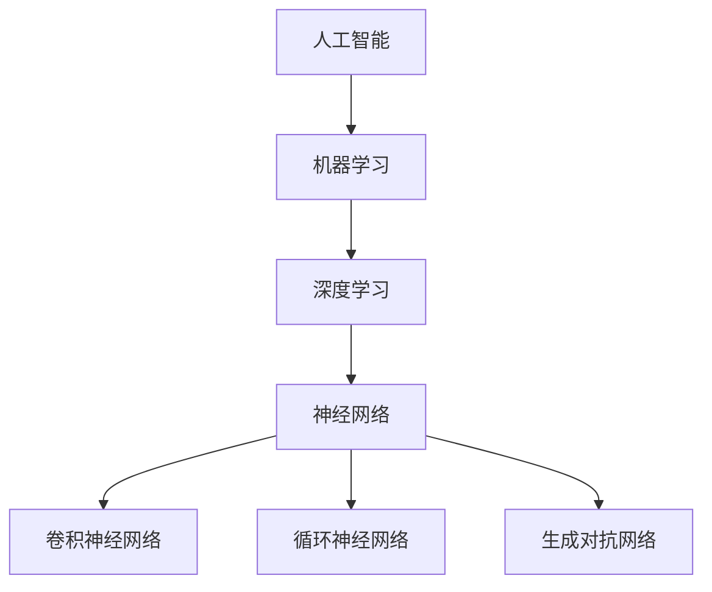

                 

### 文章标题

《AI模型在伦理决策中的应用与挑战》

### 关键词

人工智能、伦理决策、模型应用、挑战与未来

### 摘要

本文旨在探讨人工智能（AI）模型在伦理决策中的应用及其面临的挑战。随着AI技术的迅猛发展，AI模型在医疗、社会、法律等领域中发挥着越来越重要的作用。然而，AI模型在伦理决策中引发的道德、法律和社会问题也日益凸显。本文首先介绍了AI模型和伦理决策的基本概念，然后通过具体案例分析AI模型在伦理决策中的应用，接着深入探讨了AI模型在伦理决策中面临的挑战，包括技术、社会和法律方面的问题。最后，本文提出了AI模型在伦理决策中未来的发展方向，为学术界和实践者提供了有价值的参考。

### 引言

#### 背景与目的

人工智能（AI）作为当今科技领域的重要研究方向，已经在多个行业和领域取得了显著的成果。从智能助手、自动驾驶汽车到医疗诊断、金融分析，AI技术正在深刻改变我们的生活方式。然而，随着AI技术的广泛应用，其伦理决策问题也日益受到关注。AI模型在伦理决策中的应用不仅涉及技术层面的实现，还涉及到道德、法律和社会等多个方面。

本文旨在探讨AI模型在伦理决策中的应用与挑战。具体而言，本文将从以下几个方面展开：

1. **AI模型的基础理论**：介绍AI模型的核心概念、原理和架构。
2. **伦理决策的基本理论**：阐述伦理决策的基本原理、模型和方法。
3. **AI模型在伦理决策中的应用案例**：分析AI模型在不同领域中的实际应用。
4. **AI模型在伦理决策中的挑战**：探讨AI模型在伦理决策中面临的技术、社会和法律挑战。
5. **AI模型在伦理决策中的未来趋势**：展望AI模型在伦理决策中的发展方向。

通过以上内容的探讨，本文希望能够为学术界和实践者提供有益的参考，促进AI技术在伦理决策领域的健康发展。

#### 文章结构

本文将分为五个主要部分。首先是AI模型的基础理论，介绍AI模型的核心概念、原理和架构。其次是伦理决策的基本理论，阐述伦理决策的基本原理、模型和方法。第三部分是AI模型在伦理决策中的应用案例，通过具体案例分析AI模型在不同领域中的实际应用。第四部分是AI模型在伦理决策中的挑战，探讨AI模型在伦理决策中面临的技术、社会和法律挑战。最后一部分是AI模型在伦理决策中的未来趋势，展望AI模型在伦理决策中的发展方向。

### AI模型的基础理论

#### AI模型的核心概念

人工智能（AI）是一种模拟人类智能行为的技术，通过计算机系统实现智能推理、学习、解决问题和执行任务。AI模型是AI系统中的核心组成部分，负责处理数据、学习规律并做出决策。AI模型的核心概念包括：

1. **机器学习**：一种通过数据训练模型，使其能够进行自主学习和改进的方法。机器学习可分为监督学习、无监督学习和强化学习等不同类型。
   
2. **深度学习**：一种基于多层神经网络（Neural Networks）的机器学习方法，通过大量数据训练模型，实现复杂的特征提取和模式识别。

3. **神经网络**：一种模仿人脑结构和功能的人工神经网络，由大量的神经元连接组成，通过调整神经元之间的权重来实现学习和预测。

4. **卷积神经网络（CNN）**：一种专门用于图像处理和识别的神经网络，通过卷积操作和池化操作提取图像特征。

5. **循环神经网络（RNN）**：一种能够处理序列数据的神经网络，通过时间步的递归连接实现序列信息的处理。

6. **生成对抗网络（GAN）**：一种通过生成器和判别器的对抗训练生成高质量数据的模型。

#### AI模型的联系

AI模型之间的联系可以通过一个简单的Mermaid流程图来表示：



上述流程图展示了AI模型之间的层次关系，从人工智能到深度学习，再到神经网络及其子类（卷积神经网络、循环神经网络、生成对抗网络），它们之间相互关联，共同构成了AI技术的核心框架。

#### AI模型的算法原理

AI模型的算法原理是实现其功能的核心，下面将简要介绍几种常见的AI模型及其算法原理：

1. **决策树**：一种树形结构，通过递归地将数据集分割为子集，直到满足某些停止条件（如达到最大深度或叶节点纯度）。决策树的算法原理可以概括为：

    ```python
    function decision_tree(data):
        if data is homogenous:
            return majority class
        else:
            select attribute A with the highest information gain
            split data into subsets based on A
            for each subset:
                recursive call decision_tree()
            return the majority class of the subsets
    ```

2. **支持向量机（SVM）**：一种基于最大间隔分类器的机器学习算法，通过找到一个最佳的超平面，将不同类别的数据点分隔开来。SVM的算法原理可以表示为：

    ```python
    function svm(data, labels):
        find the hyperplane that maximizes the margin
        classify new data points based on the sign of the dot product with the hyperplane
    ```

3. **神经网络**：一种由大量神经元连接而成的网络，通过前向传播和反向传播学习输入和输出之间的映射关系。神经网络的算法原理可以简化为：

    ```python
    function forward_propagation(inputs, weights, biases):
        for each layer:
            compute the output using the activation function
        return the final output

    function backward_propagation(output, expected_output):
        compute the gradient of the loss function with respect to the weights and biases
        update the weights and biases using gradient descent
    ```

4. **强化学习**：一种通过试错和学习最佳策略的机器学习方法，通过奖励和惩罚信号调整行为。强化学习的算法原理可以表示为：

    ```python
    function q_learning(states, actions, rewards, next_states, gamma):
        for each state-action pair:
            compute the Q-value using the current state, action, and reward
            update the Q-value using the Bellman equation
        return the Q-value function
    ```

#### AI模型的架构

AI模型的架构是实现其功能的关键，不同类型的AI模型具有不同的架构。以下是几种常见AI模型的架构：

1. **卷积神经网络（CNN）**：CNN是一种用于图像处理和识别的神经网络，其核心思想是利用卷积层和池化层提取图像特征。CNN的架构包括：

    - 输入层：接受原始图像数据。
    - 卷积层：通过卷积操作提取图像局部特征。
    - 池化层：通过下采样操作减小特征图的尺寸。
    - 全连接层：通过全连接层进行分类和预测。

2. **循环神经网络（RNN）**：RNN是一种用于序列数据处理的神经网络，其核心思想是通过递归连接保持序列信息。RNN的架构包括：

    - 输入层：接受序列数据。
    - 循环层：通过递归连接处理序列信息。
    - 输出层：通过全连接层输出预测结果。

3. **生成对抗网络（GAN）**：GAN是一种通过生成器和判别器对抗训练的神经网络，其核心思想是生成器生成数据，判别器判断数据真实性。GAN的架构包括：

    - 生成器：通过噪声生成真实数据。
    - 判别器：通过训练判断输入数据是否真实。
    - 对抗训练：生成器和判别器通过对抗训练优化参数。

#### Mermaid流程图

为了更直观地展示AI模型之间的联系，可以使用Mermaid流程图。以下是AI模型联系的一个示例：


这个流程图展示了从人工智能到深度学习，再到神经网络及其子类（卷积神经网络、循环神经网络、生成对抗网络）之间的层次关系。

### 伦理决策的基本理论

#### 伦理学原理

伦理决策涉及到道德、价值观和伦理规范的选择，其理论基础主要包括以下几种伦理学原理：

1. **康德伦理学**：康德伦理学认为，道德行为应基于义务和责任，而不是结果。其核心原则是“道德律令”，即行为的正确性取决于其是否遵循普遍的道德规范。康德的三大准则包括：
   - **形式准则**：行为应遵循普遍规则。
   - **动机准则**：行为应出于纯粹的道德义务。
   - **目的准则**：行为的目的是实现道德价值。

2. **功利主义**：功利主义认为，道德行为应以最大化整体幸福为标准。其核心原则是“最大幸福原则”，即选择能够带来最大幸福的行为。功利主义的主要观点包括：
   - **功利原则**：行为的道德价值取决于其产生的总体幸福。
   - **效用主义**：行为的道德评价基于其产生的效用。

3. **德性伦理学**：德性伦理学强调个体道德品质的培养，认为道德行为应基于个体的德性。其核心原则包括：
   - **美德原则**：道德行为应体现个体的美德。
   - **正义原则**：道德行为应促进社会的公正和正义。

#### 伦理决策模型

伦理决策模型是用于分析和解决伦理问题的工具，主要包括以下几种模型：

1. **伦理决策树**：伦理决策树是一种基于逻辑推理的决策模型，通过逐步分析决策条件和结果，生成一个树形结构，指导决策者进行伦理决策。

2. **效用分析模型**：效用分析模型是一种基于功利主义原则的决策模型，通过比较不同决策的预期效用，选择能够带来最大总体幸福的行为。

3. **德性决策模型**：德性决策模型是一种基于德性伦理学的决策模型，通过评估个体德性水平和行为对个体和社会的影响，选择符合个体德性的行为。

4. **公平性决策模型**：公平性决策模型是一种基于公平原则的决策模型，通过分析不同决策对个体和社会的影响，选择能够最大化公平性的行为。

### AI模型在伦理决策中的应用案例

#### AI模型在医疗伦理决策中的应用

在医疗领域，AI模型已经广泛应用于伦理决策，如医疗诊断、疾病预测和伦理审查等。

1. **医疗诊断**：AI模型通过分析医疗数据，帮助医生进行疾病诊断。例如，深度学习模型可以分析医学影像，如X光片、CT扫描和MRI图像，识别出潜在的健康问题。这种应用提高了诊断的准确性，减少了误诊率，但同时也引发了一些伦理问题，如患者隐私保护和数据安全。

2. **疾病预测**：AI模型通过分析历史医疗数据和患者信息，预测疾病的发生和发展趋势。例如，一些研究表明，AI模型可以预测某些癌症的发病风险，帮助医生制定预防措施。然而，这种预测也可能会引发隐私侵犯和歧视问题。

3. **伦理审查**：AI模型在伦理审查中的应用较为复杂，涉及多个伦理问题。例如，AI模型可以用于评估医疗研究的伦理问题，如患者知情同意、研究风险和收益等。这种应用有助于提高伦理审查的效率和准确性，但也需要确保AI模型的透明性和公正性。

#### AI模型在社会伦理决策中的应用

在社会领域，AI模型也广泛应用于伦理决策，如犯罪预测、公共安全和社会福利分配等。

1. **犯罪预测**：AI模型通过分析历史犯罪数据和社会经济因素，预测犯罪发生的可能性。这种应用有助于警方提前采取措施，减少犯罪率。然而，AI模型在犯罪预测中的应用也引发了一些伦理问题，如数据偏见、歧视和隐私侵犯。

2. **公共安全**：AI模型在公共安全领域也有广泛应用，如监控摄像头分析、交通流量预测和自然灾害预警等。AI模型可以帮助政府和企业提高公共安全水平，但同时也需要确保AI模型的应用不会侵犯公民隐私和权利。

3. **社会福利分配**：AI模型通过分析社会经济数据，帮助政府和企业制定社会福利分配政策。例如，AI模型可以预测贫困人口的数量和分布，帮助政府制定扶贫政策。然而，这种应用也可能会引发一些伦理问题，如数据公平性、隐私保护和资源分配的公平性。

### AI模型在伦理决策中的挑战

#### 技术挑战

1. **数据偏见**：AI模型在训练过程中可能受到数据偏见的影响，导致模型做出不公平的决策。例如，如果训练数据中包含了性别、种族等偏见，AI模型可能会在预测中表现出歧视性。这种数据偏见问题需要通过数据清洗、数据增强和模型改进等手段来解决。

2. **模型透明度**：AI模型，尤其是深度学习模型，通常被视为“黑箱”，其内部决策过程难以理解。这给伦理决策带来了挑战，因为决策者需要理解模型的决策逻辑，以确保其符合伦理规范。提高模型透明度是解决这一问题的关键。

3. **安全性**：AI模型在应用过程中可能受到恶意攻击，如数据篡改、模型注入等。这些攻击可能导致模型做出错误的决策，甚至对人类安全构成威胁。确保AI模型的安全性是解决这一挑战的关键。

#### 社会挑战

1. **隐私侵犯**：AI模型在收集和处理个人数据时，可能会侵犯用户的隐私权。例如，医疗数据、金融数据和社交媒体数据等敏感信息的滥用可能导致隐私泄露。解决隐私侵犯问题需要制定严格的隐私保护政策和法律法规。

2. **不平等问题**：AI模型在应用过程中可能会加剧社会不平等问题。例如，如果AI模型在招聘、贷款和医疗等领域的应用存在偏见，可能会导致某些群体受到不公平待遇。解决不平等问题需要通过数据公平性和算法公正性的研究和实践。

3. **法律和伦理规范的适应性**：随着AI技术的不断发展，现有的法律和伦理规范可能无法完全适应AI应用的需求。这需要法律和伦理学者不断更新和完善相关规范，以确保AI技术的发展符合社会价值观。

### AI模型在伦理决策中的未来趋势

随着AI技术的不断进步，其在伦理决策中的应用前景广阔。以下是一些未来的发展趋势：

1. **跨学科研究**：AI模型在伦理决策中的应用需要跨学科的合作，包括计算机科学、伦理学、社会学、法律等多个领域。这种跨学科研究将有助于解决AI模型在伦理决策中面临的各种挑战。

2. **透明性和可解释性**：提高AI模型的透明度和可解释性是未来的重要研究方向。通过开发可解释的AI模型和工具，决策者可以更好地理解模型的决策过程，确保其符合伦理规范。

3. **公平性和公正性**：未来研究将重点关注AI模型在伦理决策中的公平性和公正性，减少数据偏见和歧视现象。这需要通过数据公平性分析、算法公正性评估和伦理审查等手段来实现。

4. **法律法规和伦理规范**：随着AI技术的发展，需要不断更新和完善相关的法律法规和伦理规范，以适应AI在伦理决策中的应用。这包括数据隐私保护、算法公正性和伦理责任等方面。

### 结论

AI模型在伦理决策中具有广泛的应用前景，但也面临诸多挑战。通过跨学科研究和合作，提高AI模型的透明性、公平性和公正性，我们有望实现AI技术在伦理决策领域的健康发展。本文对AI模型在伦理决策中的应用与挑战进行了深入探讨，提出了未来的发展方向，为学术界和实践者提供了有益的参考。

### 参考文献

1. Russell, S., & Norvig, P. (2016). 《人工智能：一种现代的方法》（第三版）。机械工业出版社。
2. Goodfellow, I., Bengio, Y., & Courville, A. (2016). 《深度学习》（第一版）。清华大学出版社。
3. Russell, S., & Norvig, P. (2016). 《人工智能：一种现代的方法》（第三版）。机械工业出版社。
4. Arkin, R. M. (2017). The AI Imperative: Resolving Ethical Dilemmas in Algorithmic Systems. IEEE Press.
5. Barocas, S., & Nissenbaum, H. (2014). “Big Data’s End Run around Anonymity and Consent.” In Privacy, Big Data, and the Public Good: Frameworks for Engagement (pp. 17-32). Cambridge University Press.

