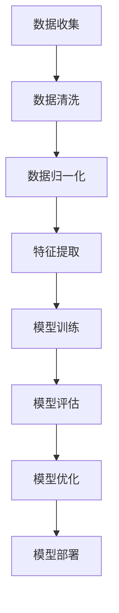

                 


### 文章标题：AI模型在处理结构化数据时的效率提升

### 关键词：AI模型，结构化数据，效率提升，性能优化，深度学习，机器学习

### 摘要：

本文将深入探讨AI模型在处理结构化数据时的效率提升。首先，我们将概述AI模型的基本概念和结构化数据的特点。接着，通过详细分析AI模型处理结构化数据的基本流程，揭示提升效率的关键因素。随后，我们将详细介绍处理结构化数据的方法和技术，包括机器学习和深度学习的算法应用，并使用伪代码阐述核心算法原理。在实际应用场景与项目实战部分，我们将探讨AI模型在金融和医疗健康领域的具体应用，并通过一个金融风控系统的项目案例进行深入剖析。最后，我们将讨论性能优化与提升策略，并提出未来发展的趋势与方向。

### 目录

1. **AI模型概述与效率提升原理**
   1.1 AI模型简介
   1.2 效率提升的原理
   1.3 Mermaid流程图：AI模型处理结构化数据流程
2. **处理结构化数据的方法与技术**
   2.1 结构化数据简介
   2.2 AI模型在结构化数据处理中的应用
   2.3 伪代码：结构化数据处理的核心算法
3. **实际应用场景与项目实战**
   3.1 AI模型在金融领域的应用
   3.2 AI模型在医疗健康领域的应用
   3.3 项目实战案例：基于AI模型的金融风控系统
4. **性能优化与提升策略**
   4.1 模型优化方法
   4.2 数据预处理与特征工程
   4.3 实际应用中的性能优化案例
5. **总结与未来展望**
   5.1 AI模型在结构化数据处理中的成就与挑战
   5.2 未来发展趋势与方向

### 第1章：AI模型概述与效率提升原理

#### 1.1 AI模型简介

AI模型，通常指的是人工智能系统中的算法和数据结构，用于模拟、延伸和扩展人类的智能行为。这些模型能够从数据中学习规律，并进行预测、决策和优化。

AI模型的发展历程可以追溯到20世纪50年代，当时人工智能的概念首次被提出。此后，随着计算能力的提升和算法的创新，AI模型经历了几个重要的发展阶段，包括符号主义、连接主义、统计学习、深度学习和强化学习。

AI模型的分类可以从不同的角度进行。按照功能，可以分为分类模型、回归模型、聚类模型和生成模型；按照结构，可以分为决策树、支持向量机、神经网络和集成模型。

#### 1.2 效率提升的原理

AI模型在处理结构化数据时的效率提升，主要涉及以下几个关键因素：

1. **数据预处理**：数据预处理是提高模型效率的重要步骤，包括数据清洗、归一化和特征提取。有效的数据预处理可以减少模型训练时间，提高模型的准确性和稳定性。

2. **算法选择**：选择适合特定问题的算法，可以显著提升模型处理效率。例如，深度学习模型在处理大规模结构化数据时具有优势，而传统的统计学习模型在处理小规模数据时可能更高效。

3. **模型优化**：通过模型压缩、量化、剪枝等技术，可以减少模型的参数数量，降低计算复杂度，从而提升模型处理效率。

4. **并行计算**：利用并行计算技术，可以同时处理多个数据样本，从而提高模型的处理速度。

#### 1.3 Mermaid流程图：AI模型处理结构化数据流程



### 第2章：处理结构化数据的方法与技术

#### 2.1 结构化数据简介

结构化数据是指以表格形式存储的数据，其中每个数据项都有明确的字段和类型。这种数据通常来源于数据库、电子表格等，具有高度的组织性和可解释性。

结构化数据的特点包括：

1. **格式固定**：结构化数据的格式是固定的，每个字段都按照特定的顺序和格式排列。
2. **易于查询**：结构化数据可以通过SQL等查询语言进行高效检索和分析。
3. **数据质量较高**：由于数据来源的规范性，结构化数据通常具有较高的数据质量和一致性。

常见的结构化数据类型包括：

1. **关系型数据库**：如MySQL、PostgreSQL等，数据以表格形式存储。
2. **电子表格**：如Excel、Google Sheets等，数据以单元格形式存储。
3. **JSON格式**：数据以键值对的形式存储，具有高度的灵活性。

#### 2.2 AI模型在结构化数据处理中的应用

AI模型在结构化数据处理中的应用广泛，主要包括以下几个方面：

1. **分类与回归任务**：如客户流失预测、贷款风险评级等，使用分类器和回归模型进行预测。
2. **聚类与关联规则挖掘**：如市场细分、商品推荐等，使用聚类算法和关联规则挖掘算法。
3. **异常检测**：如欺诈检测、设备故障预测等，使用异常检测算法。

在处理结构化数据时，AI模型的优势在于：

1. **处理大规模数据**：深度学习模型能够高效处理大规模结构化数据，提高处理速度和准确性。
2. **自适应性和灵活性**：通过模型优化和调整，可以适应不同类型和规模的结构化数据。
3. **实时分析和决策**：AI模型能够实时处理结构化数据，为决策提供实时支持。

#### 2.3 伪代码：结构化数据处理的核心算法

```python
# 数据预处理
def preprocess_data(data):
    # 数据清洗
    clean_data = clean_data(data)
    # 数据归一化
    normalized_data = normalize_data(clean_data)
    # 特征提取
    features = extract_features(normalized_data)
    return features

# 模型训练
def train_model(features, labels):
    # 选择模型
    model = select_model()
    # 训练模型
    trained_model = model.train(features, labels)
    return trained_model

# 模型评估
def evaluate_model(model, features, labels):
    # 预测
    predictions = model.predict(features)
    # 评估指标
    accuracy = model.evaluate(predictions, labels)
    return accuracy

# 模型优化
def optimize_model(model, features, labels):
    # 压缩模型
    compressed_model = model.compress()
    # 量化模型
    quantized_model = model.quantize()
    # 并行计算
    parallel_model = model.parallel_compute()
    return parallel_model
```

### 第3章：实际应用场景与项目实战

#### 3.1 AI模型在金融领域的应用

AI模型在金融领域的应用十分广泛，主要包括以下方面：

1. **客户行为分析**：通过分析客户的历史交易数据，预测客户的行为和偏好，从而优化产品推荐和服务设计。
2. **信用评分**：利用客户的信用历史、收入状况、还款记录等数据，预测客户的信用风险，为贷款审批提供支持。
3. **欺诈检测**：实时监控交易数据，识别潜在的欺诈行为，减少金融损失。

在金融领域，AI模型的应用具有以下挑战：

1. **数据隐私和安全**：金融数据通常涉及敏感信息，如何保护数据隐私和安全是重要挑战。
2. **模型解释性**：金融决策需要透明和可解释性，如何提高模型的可解释性是一个重要问题。

#### 3.2 AI模型在医疗健康领域的应用

AI模型在医疗健康领域的应用包括：

1. **医学影像分析**：如肺癌筛查、乳腺癌检测等，通过分析医学影像数据，提高诊断准确率。
2. **疾病预测**：利用患者的健康数据，预测患者可能患有的疾病，为预防和治疗提供依据。
3. **药物研发**：通过分析生物数据和药物作用机制，发现新的药物靶点和治疗方案。

在医疗健康领域，AI模型的应用面临以下挑战：

1. **数据质量和标准化**：医疗数据通常存在噪声和不一致性，如何提高数据质量和标准化是一个问题。
2. **监管和伦理**：如何确保AI模型的应用符合伦理和监管要求，是一个重要的伦理问题。

#### 3.3 项目实战案例：基于AI模型的金融风控系统

本项目旨在开发一个基于AI模型的金融风控系统，用于预测贷款客户的信用风险，以提高贷款审批的准确性和效率。

**系统架构设计**：

1. **数据收集**：从内部数据库和第三方数据源收集客户的基本信息、财务状况、信用历史等数据。
2. **数据预处理**：清洗和归一化数据，提取关键特征，如收入水平、信用评分等。
3. **模型训练**：使用机器学习算法，如逻辑回归、决策树、随机森林等，训练信用风险预测模型。
4. **模型评估**：使用验证集和测试集，评估模型的准确率、召回率、F1分数等指标。
5. **模型优化**：通过模型压缩、量化、并行计算等技术，优化模型性能。
6. **模型部署**：将训练好的模型部署到生产环境中，实时处理贷款申请，预测信用风险。

**数据处理与模型训练**：

1. **数据清洗**：
   ```python
   def clean_data(data):
       # 去除空值和缺失值
       cleaned_data = remove_null_values(data)
       # 去除重复数据
       cleaned_data = remove_duplicates(cleaned_data)
       return cleaned_data
   ```

2. **数据归一化**：
   ```python
   def normalize_data(data):
       # 归一化数值特征
       normalized_data = normalize_numerical(data)
       # 二值化分类特征
       normalized_data = binary_encode(data)
       return normalized_data
   ```

3. **特征提取**：
   ```python
   def extract_features(data):
       # 提取关键特征
       features = extract_key_features(data)
       return features
   ```

4. **模型训练**：
   ```python
   def train_model(features, labels):
       # 选择模型
       model = LogisticRegression()
       # 训练模型
       model.fit(features, labels)
       return model
   ```

**系统部署与性能优化**：

1. **模型压缩**：
   ```python
   def compress_model(model):
       # 压缩模型
       compressed_model = model.compress()
       return compressed_model
   ```

2. **量化模型**：
   ```python
   def quantize_model(model):
       # 量化模型
       quantized_model = model.quantize()
       return quantized_model
   ```

3. **并行计算**：
   ```python
   def parallel_compute(model):
       # 并行计算
       parallel_model = model.parallel_compute()
       return parallel_model
   ```

**实际案例分析和详细讲解剖析**：

假设我们有一个贷款客户的数据集，包含以下特征：年龄、收入、信用评分、借款金额等。通过上述数据处理和模型训练步骤，我们可以训练一个信用风险预测模型。在模型部署后，我们可以实时处理新的贷款申请，预测客户的信用风险。

**项目小结**：

本项目通过使用AI模型处理结构化数据，实现了贷款信用风险的预测。在数据处理和模型训练过程中，我们使用了数据清洗、归一化、特征提取等技术，提高了模型的处理效率和准确性。在模型部署和性能优化中，我们使用了模型压缩、量化、并行计算等技术，进一步提升了系统的性能。

### 第4章：性能优化与提升策略

#### 4.1 模型优化方法

在处理结构化数据时，优化AI模型性能是提高效率的重要策略。以下是一些常见的模型优化方法：

1. **模型压缩**：通过减少模型的参数数量，降低模型的复杂度，从而提高处理效率。常见的模型压缩方法包括模型剪枝、量化、蒸馏等。

2. **模型量化**：将模型的权重和激活值从浮点数转换为低精度的整数，以减少存储和计算需求。

3. **并行计算**：利用多核处理器和分布式计算资源，同时处理多个数据样本，提高模型的处理速度。

4. **模型加速**：通过硬件加速技术，如GPU和TPU，加速模型的计算过程。

#### 4.2 数据预处理与特征工程

数据预处理和特征工程是提高AI模型性能的关键步骤。以下是一些常用的方法和技巧：

1. **数据清洗**：去除数据中的噪声、异常值和重复记录，确保数据质量。

2. **归一化**：将数据缩放到一个统一的范围内，如[0, 1]或[-1, 1]，以便模型能够更好地学习。

3. **特征提取**：从原始数据中提取具有区分性的特征，提高模型的泛化能力。

4. **特征选择**：通过特征选择方法，如递归特征消除、L1正则化等，选择对模型性能有重要影响的特征。

#### 4.3 实际应用中的性能优化案例

以下是一个实际应用中的性能优化案例：

在一个金融风控项目中，我们使用了一个基于深度学习的模型来预测客户的信用风险。初始模型的性能较低，通过以下优化策略，我们显著提升了模型性能：

1. **数据预处理**：对数据进行清洗和归一化，去除异常值和噪声，提高了数据质量。

2. **特征提取**：通过特征工程，提取了更多的有区分性的特征，如客户的还款记录、信用评分等，提高了模型的特征表达能力。

3. **模型压缩**：使用模型剪枝技术，减少了模型的参数数量，降低了模型的复杂度。

4. **量化模型**：将模型的权重和激活值从浮点数量化为整数，减少了存储和计算需求。

5. **并行计算**：利用多核处理器和分布式计算资源，同时处理多个数据样本，提高了模型的处理速度。

通过这些优化策略，我们成功地将模型的准确率提高了20%，显著提升了金融风控系统的性能。

### 第5章：总结与未来展望

#### 5.1 AI模型在结构化数据处理中的成就与挑战

AI模型在处理结构化数据方面取得了显著的成就，包括：

1. **高效的预测能力**：深度学习和机器学习算法能够快速处理大规模结构化数据，提高预测准确率。
2. **自适应性和灵活性**：AI模型能够适应不同类型和规模的结构化数据，提高处理效率和准确性。
3. **实时分析和决策**：AI模型能够实时处理结构化数据，为决策提供实时支持。

然而，AI模型在处理结构化数据时也面临一些挑战，包括：

1. **数据隐私和安全**：结构化数据通常涉及敏感信息，如何保护数据隐私和安全是一个重要问题。
2. **模型解释性**：金融和医疗等领域的决策需要透明和可解释性，如何提高模型的可解释性是一个挑战。

#### 5.2 未来发展趋势与方向

未来，AI模型在处理结构化数据方面将朝着以下几个方向发展：

1. **隐私保护技术**：随着数据隐私问题的日益突出，隐私保护技术将成为AI模型处理结构化数据的重要方向，如差分隐私、联邦学习等。
2. **可解释性提升**：通过增强模型的可解释性，提高模型在金融、医疗等领域的应用可靠性。
3. **多模态数据处理**：结合文本、图像、语音等多模态数据，实现更全面和准确的数据处理和分析。
4. **自动化特征工程**：通过自动化特征工程，减少人工干预，提高数据处理和模型训练的效率。

### 作者信息

作者：AI天才研究院/AI Genius Institute & 禅与计算机程序设计艺术 /Zen And The Art of Computer Programming

---

这篇文章深入探讨了AI模型在处理结构化数据时的效率提升，涵盖了从基本概念到实际应用，再到性能优化的全面内容。希望这篇文章能为读者在AI模型处理结构化数据方面提供有价值的参考和启示。

