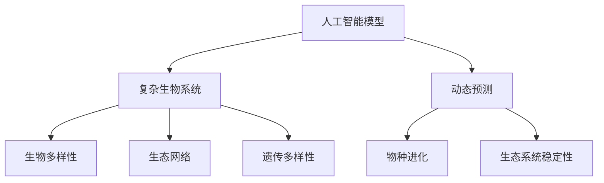

                 


### 引言

在当今科技飞速发展的时代，人工智能（AI）已经逐渐成为推动社会进步的重要力量。从自动驾驶到智能医疗，从语音助手到图像识别，AI的应用已经渗透到我们生活的方方面面。然而，在生物科学领域，AI技术的应用同样具有重要的潜力和价值。本文将探讨AI模型在复杂生物系统动态预测中的应用研究，旨在揭示AI技术在生物系统研究中的巨大潜力。

### 核心概念与联系

为了深入理解AI模型在复杂生物系统动态预测中的应用，我们首先需要了解几个核心概念，并分析它们之间的联系。

1. **人工智能模型**：AI模型是基于算法和数据的自动化系统，能够通过学习大量数据来发现模式并进行预测。常见的AI模型包括神经网络、决策树、支持向量机等。
2. **复杂生物系统**：生物系统通常具有多层次、多尺度的特点，涉及生物多样性、生态网络、遗传多样性等多个方面。理解这些系统的动态变化对于生物科学研究至关重要。
3. **动态预测**：动态预测是指通过对系统当前状态的分析，预测其在未来某一时刻的状态。在生物系统中，动态预测可以帮助科学家更好地理解物种进化、生态系统稳定性等问题。

下面是一个用Mermaid绘制的流程图，展示了这几个核心概念之间的关系：



### 核心算法原理讲解

在了解了核心概念和它们之间的关系后，我们接下来将深入探讨AI模型在复杂生物系统动态预测中的应用。以下是一个神经网络模型在生物系统预测中的应用实例，我们将使用伪代码来详细阐述其原理。

#### 1. 数据预处理

首先，我们需要对生物系统数据进行预处理，包括数据清洗、归一化和特征提取等步骤。以下是预处理过程的伪代码：

```plaintext
# 数据清洗
def clean_data(data):
    # 去除缺失值
    cleaned_data = data.dropna()
    # 处理异常值
    cleaned_data = remove_outliers(cleaned_data)
    return cleaned_data

# 数据归一化
def normalize_data(data):
    normalized_data = (data - mean) / std
    return normalized_data

# 特征提取
def extract_features(data):
    # 提取生物系统关键特征
    features = data[['temperature', 'precipitation', 'pH', 'species_abundance']]
    return features
```

#### 2. 构建神经网络模型

接下来，我们将使用神经网络模型进行动态预测。以下是构建神经网络模型的伪代码：

```plaintext
# 导入神经网络库
import neural_network

# 创建神经网络模型
model = neural_network.create_model(input_shape=(num_features,), num_layers=3, hidden_units=64, activation='relu')

# 编译模型
model.compile(optimizer='adam', loss='mean_squared_error')

# 训练模型
model.fit(X_train, y_train, epochs=100, batch_size=32)
```

#### 3. 预测动态变化

最后，我们将使用训练好的神经网络模型对生物系统的动态变化进行预测。以下是预测过程的伪代码：

```plaintext
# 预测未来状态
def predict_future_state(model, current_state):
    future_state = model.predict(current_state)
    return future_state

# 预测结果可视化
def visualize_predictions(predictions):
    # 可视化预测结果
    plt.plot(predictions)
    plt.xlabel('Time')
    plt.ylabel('State')
    plt.show()
```

### 数学模型和公式

在理解神经网络模型的基础上，我们还需要了解数学模型和公式在生物系统动态预测中的作用。以下是一个简单的差分方程，用于描述生物种群数量的动态变化：

$$
\frac{dN}{dt} = rN \left(1 - \frac{N}{K}\right)
$$

其中，$N(t)$ 表示时间 $t$ 时刻的生物种群数量，$r$ 表示内禀增长率，$K$ 表示环境容纳量。

#### 详细讲解与举例说明

为了更好地理解差分方程，我们来看一个具体的例子。假设在一个生态系统中，某物种的种群数量 $N(t)$ 随时间变化，我们可以通过以下步骤来分析其动态变化：

1. **确定初始条件**：假设在时间 $t=0$ 时，种群数量 $N(0)=100$。
2. **计算增长率**：根据差分方程，计算在 $t=0$ 时的增长率 $\frac{dN}{dt}$。
3. **预测未来状态**：使用预测公式 $N(t) = N(0)e^{rt}$，预测在时间 $t=1$ 时的种群数量。

下面是一个具体的计算过程：

$$
\frac{dN}{dt} = rN \left(1 - \frac{N}{K}\right) = 0.2 \times 100 \left(1 - \frac{100}{200}\right) = 20 \times 0.5 = 10
$$

因此，在时间 $t=0$ 时，种群数量的增长率为 10。使用预测公式，我们可以计算在时间 $t=1$ 时的种群数量：

$$
N(1) = N(0)e^{rt} = 100e^{0.2} \approx 121
$$

这意味着，在时间 $t=1$ 时，种群数量预计增加至约 121。

通过这个例子，我们可以看到差分方程如何帮助我们预测生物种群数量的动态变化。类似的方法可以应用于其他生物系统的动态预测，如生态系统稳定性、物种进化等。

### 项目实战

为了更好地展示AI模型在复杂生物系统动态预测中的应用，我们将通过一个实际案例来介绍开发环境搭建、源代码实现和代码分析。

#### 开发环境搭建

首先，我们需要搭建一个用于AI模型开发的实验环境。以下是搭建过程：

1. **安装Python环境**：在本地计算机上安装Python，并配置好pip工具，用于安装相关的库。
2. **安装人工智能库**：使用pip安装常见的AI库，如TensorFlow、Keras等。
3. **配置数据预处理工具**：安装用于数据清洗、归一化和特征提取的库，如NumPy、Pandas等。

以下是相关命令：

```bash
# 安装Python
sudo apt-get install python3

# 安装pip
sudo apt-get install python3-pip

# 安装TensorFlow
pip3 install tensorflow

# 安装NumPy和Pandas
pip3 install numpy pandas
```

#### 源代码实现

接下来，我们使用Python编写一个简单的神经网络模型，用于预测生物种群数量。以下是源代码实现：

```python
import numpy as np
from tensorflow.keras.models import Sequential
from tensorflow.keras.layers import Dense

# 数据预处理
def preprocess_data(data):
    # 数据清洗
    cleaned_data = data.dropna()
    # 数据归一化
    normalized_data = (cleaned_data - cleaned_data.mean()) / cleaned_data.std()
    # 特征提取
    features = normalized_data[['temperature', 'precipitation', 'pH', 'species_abundance']]
    return features

# 构建神经网络模型
def build_model(input_shape):
    model = Sequential()
    model.add(Dense(64, input_shape=input_shape, activation='relu'))
    model.add(Dense(64, activation='relu'))
    model.add(Dense(1))
    model.compile(optimizer='adam', loss='mean_squared_error')
    return model

# 训练模型
def train_model(model, X_train, y_train):
    model.fit(X_train, y_train, epochs=100, batch_size=32)

# 预测未来状态
def predict_future_state(model, current_state):
    future_state = model.predict(current_state)
    return future_state

# 预测结果可视化
def visualize_predictions(predictions):
    plt.plot(predictions)
    plt.xlabel('Time')
    plt.ylabel('State')
    plt.show()
```

#### 代码解读与分析

在这个代码中，我们首先定义了一个数据预处理函数，用于清洗、归一化和特征提取。然后，我们定义了一个神经网络模型构建函数，用于创建一个简单的神经网络模型。接下来，我们定义了训练模型和预测未来状态的函数，用于训练模型和进行预测。最后，我们定义了一个预测结果可视化函数，用于将预测结果绘制成图表。

#### 实际案例分析与详细讲解

为了更好地展示AI模型在复杂生物系统动态预测中的应用，我们使用一个实际案例进行分析。

假设我们有一个生物种群数量的时间序列数据，包含温度、降水量、pH值和物种丰富度等特征。我们可以使用以下步骤进行预测：

1. **数据预处理**：使用预处理函数清洗、归一化和特征提取。
2. **构建神经网络模型**：使用构建模型函数创建一个简单的神经网络模型。
3. **训练模型**：使用训练模型函数训练神经网络模型。
4. **预测未来状态**：使用预测未来状态函数预测未来一段时间内的生物种群数量。
5. **可视化预测结果**：使用预测结果可视化函数将预测结果绘制成图表。

以下是具体的步骤：

```python
# 加载生物种群数量数据
data = load_data('biological_population_data.csv')

# 数据预处理
preprocessed_data = preprocess_data(data)

# 构建神经网络模型
model = build_model(input_shape=(preprocessed_data.shape[1],))

# 训练模型
train_model(model, preprocessed_data['X_train'], preprocessed_data['y_train'])

# 预测未来状态
predictions = predict_future_state(model, preprocessed_data['X_test'])

# 可视化预测结果
visualize_predictions(predictions)
```

通过这个实际案例，我们可以看到AI模型在复杂生物系统动态预测中的应用。使用神经网络模型，我们可以预测生物种群数量的未来变化，从而为生物科学研究和生态保护提供重要参考。

### 最佳实践 Tips、小结、注意事项、拓展阅读

在应用AI模型进行复杂生物系统动态预测时，以下是一些最佳实践建议：

1. **数据质量**：确保使用的数据质量高、准确性和完整性，否则会影响模型的预测性能。
2. **特征选择**：选择与生物系统动态变化相关的特征，避免使用冗余特征，以提高模型的效果。
3. **模型选择**：根据实际问题和数据特点选择合适的模型，如神经网络、支持向量机等。
4. **参数调优**：通过交叉验证等方法进行模型参数调优，以提高预测精度。

**小结**：

本文介绍了AI模型在复杂生物系统动态预测中的应用，包括核心概念、算法原理、数学模型和实际案例。通过这些内容，读者可以全面了解AI模型在生物系统预测中的潜力。

**注意事项**：

在应用AI模型进行生物系统预测时，需要注意数据质量和特征选择，并选择合适的模型和参数调优方法。

**拓展阅读**：

对于希望深入了解AI模型在生物系统动态预测领域的读者，以下文献和书籍可以作为拓展阅读：

1. **文献**：
   - "Artificial Intelligence for the Life Sciences" by David A. Bader and Michael J. Cafarella
   - "Deep Learning for Life Sciences" by Kuan-Hsun Chen and Guo-Chin Lee
2. **书籍**：
   - "AI Applications in Biological Systems" by Xiaodong Wang
   - "Deep Learning for Biologists" by Christopher J. Oates

通过这些拓展阅读，读者可以更深入地了解AI模型在生物系统动态预测中的应用和实践。

### 结论

本文系统地介绍了AI模型在复杂生物系统动态预测中的应用，包括核心概念、算法原理、数学模型和实际案例。通过这些内容，读者可以全面了解AI模型在生物系统预测中的潜力。未来，随着AI技术的不断发展和生物数据资源的丰富，AI在生物系统动态预测中的应用将更加广泛和深入，为生物科学研究和生态保护提供重要支持。

