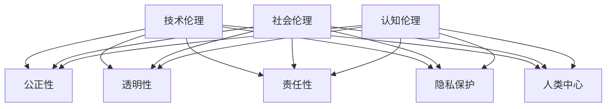

                 

### 文章标题

《AI的情感创伤：数字伦理的重要性》

### 关键词

人工智能（AI）、情感创伤、数字伦理、伦理困境、解决方案、未来展望

### 摘要

随着人工智能技术的发展，AI在情感识别和表达方面的应用日益广泛，但这也引发了一系列伦理问题。本文深入探讨了AI技术对人类情感的影响，分析了AI伦理学的基础概念和原则，并借助Mermaid流程图和伪代码详细阐述了核心算法原理。通过实际案例研究和项目实战，本文揭示了AI伦理困境，并提出了解决方案和未来展望。本文旨在引起读者对AI伦理问题的关注，为数字伦理建设提供指导。

---

## 引言

人工智能（AI）作为一种新兴技术，正在迅速改变我们的生活方式和社会结构。AI在各个领域的应用，从自动驾驶汽车到智能客服，从医疗诊断到金融分析，无不显示出其强大的潜力和广泛的应用前景。然而，AI技术的快速发展也带来了一系列伦理问题，特别是在情感领域。情感是人类的本质特征之一，它关乎我们的心理和社交生活，影响着我们的决策和行为。因此，AI在情感识别和表达方面的应用，不仅需要技术上的突破，更需要伦理上的思考。

近年来，AI在情感识别和表达方面的研究取得了显著进展。通过面部识别、语音分析和自然语言处理等技术，AI能够捕捉和分析人类情感。这些技术不仅为心理健康服务、市场营销和客户关系管理等领域带来了新的机遇，也引发了关于AI如何处理和传递情感的伦理争议。例如，当AI在医疗诊断中识别患者的焦虑情绪时，如何确保其诊断结果的准确性？当AI在客户服务中表达情感时，如何避免误导或操纵用户？这些问题都涉及到数字伦理的范畴。

数字伦理是研究信息技术在道德和社会影响方面的学科。它关注的是信息技术的设计、使用和应用过程中，如何确保公平、透明和负责任。在AI领域，数字伦理的重要性愈发凸显。AI技术的广泛应用不仅带来了便利，也带来了潜在的负面影响。例如，自动化决策系统可能基于偏见的数据进行决策，从而导致不公正的结果。AI在情感领域的应用，则需要考虑如何保护用户的隐私和尊严，以及如何确保AI的情感表达不会对用户产生负面影响。

本文旨在探讨AI在情感识别和表达中的伦理问题，分析数字伦理在AI发展中的重要性，并探讨可能的解决方案和未来展望。文章结构如下：

1. **背景介绍**：介绍AI在情感识别和表达中的应用及其引发的伦理问题。
2. **核心概念与联系**：阐述AI伦理学的基础概念和原则，并使用Mermaid流程图展示核心概念之间的关系。
3. **核心算法原理讲解**：通过伪代码详细阐述AI情感识别和表达的核心算法原理。
4. **数学模型与公式讲解**：介绍相关的数学模型和公式，并进行举例说明。
5. **项目实战**：分析具体案例，展示AI情感识别和表达技术的实际应用和代码实现。
6. **最佳实践与未来展望**：提出AI伦理建设的方法和建议，并对未来发展趋势进行展望。

通过以上结构，本文希望为AI在情感领域的伦理建设提供一些有价值的思考和参考。

---

## 背景介绍

人工智能（AI）作为一种模拟人类智能的技术，已经在多个领域取得了显著成果。特别是在情感识别和表达方面，AI技术展现了巨大的潜力。情感识别是指通过技术手段分析人类情绪状态，而情感表达则是指AI系统能够以适当的方式传递情感信息。

在情感识别方面，面部识别技术是一个重要的应用领域。通过分析人脸图像中的细微变化，AI可以识别出用户的情绪状态，如快乐、悲伤、愤怒等。这种技术已经在许多场景中得到应用，例如，在心理健康服务中，医生可以通过AI的情感识别技术来监测患者的情绪变化，从而提供更有效的治疗。此外，在市场营销和客户关系管理中，企业可以利用情感识别技术来了解消费者的需求和心理，从而优化产品和服务。

情感表达方面，AI技术同样有着广泛的应用。语音合成技术可以生成具有情感色彩的语音，使得AI客服能够以更加自然和人性化的方式与用户互动。例如，智能客服系统可以识别用户的情绪，并相应地调整语音的语调、语速和语气，从而提供更加舒适的用户体验。此外，AI在虚拟现实（VR）和增强现实（AR）中的应用也使得情感表达变得更加生动和真实。通过虚拟角色或3D模型的情感表达，用户可以体验到更加丰富和深刻的情感体验。

然而，AI在情感识别和表达方面的应用也引发了一系列伦理问题。首先，AI在情感识别上的准确性问题。尽管AI技术已经取得了显著进展，但其在情感识别上的准确性仍然受到数据质量和算法复杂度的影响。如果AI系统无法准确识别用户的情感，可能会导致误判，甚至引发不必要的恐慌或误解。

其次，AI在情感表达上的潜在负面影响。AI的情感表达虽然能够提升用户体验，但如果不加以适当限制，可能会对用户产生误导或操纵。例如，智能客服系统如果过度强调某种情感，可能会让用户感到不舒服或被操纵。此外，AI在情感表达上的不透明性也是一个值得关注的问题。用户可能无法理解AI系统是如何识别和表达情感的，这可能会引发用户对AI系统的信任危机。

最后，AI在情感识别和表达中的隐私问题。情感数据通常是个人敏感信息，其处理和存储需要严格遵循隐私保护原则。如果AI系统在处理情感数据时未能充分保护用户隐私，可能会导致隐私泄露，甚至引发更严重的安全问题。

总之，AI在情感识别和表达方面的应用前景广阔，但也面临着诸多伦理挑战。如何确保AI技术的伦理合规，是当前数字伦理研究的重要课题。在接下来的部分中，我们将进一步探讨AI伦理学的基础概念和原则，以期为解决AI情感识别和表达中的伦理问题提供理论基础。

---

## AI伦理学的基础概念和原则

AI伦理学是研究人工智能技术在社会和道德影响方面的学科。其核心目标是确保AI技术在设计、开发和应用过程中，能够遵循伦理原则，从而实现技术进步与社会发展的和谐统一。在探讨AI伦理学的基础概念和原则时，我们需要了解以下几个关键点：历史背景、基本概念和伦理原则。

### 历史背景

AI伦理学的发展可以追溯到20世纪80年代，当时AI技术的应用已经开始对社会产生影响。随着AI技术的不断进步，其潜在风险和伦理挑战也逐渐显现。例如，自动化决策系统在医疗诊断、金融分析和招聘等领域中的应用，引发了关于公平性和透明性的讨论。1998年，美国计算机协会（ACM）发布了《计算机伦理和职业行为准则》，这是AI伦理学发展的重要里程碑之一。该准则强调了AI专业人员在设计、开发和应用AI技术时，应遵循的一系列伦理原则。

### 基本概念

AI伦理学的基本概念涵盖了多个方面，包括技术伦理、社会伦理和认知伦理。技术伦理主要关注AI技术在设计、开发和应用过程中，如何避免负面影响，如隐私侵犯、数据滥用和算法偏见等。社会伦理则强调AI技术在社会中的责任和影响，如就业替代、社会不公和信息透明等。认知伦理则涉及AI在理解、处理和表达人类情感和信息方面的道德问题。

### 伦理原则

AI伦理学的基本原则包括以下几个方面：

1. **公正性**：确保AI系统在不同群体中的公平性和无偏见。例如，在招聘和金融决策中，AI系统应避免基于性别、种族或其他敏感因素进行歧视。

2. **透明性**：确保AI系统的决策过程和算法透明，用户能够理解AI系统是如何工作的。这有助于建立用户对AI系统的信任。

3. **责任性**：明确AI系统开发者和使用者的责任，确保在AI系统出现问题时，能够追溯责任。

4. **隐私保护**：确保个人数据的隐私和安全，防止数据滥用和隐私泄露。

5. **人类中心**：在AI技术的设计和应用中，始终以人类的需求和福祉为中心，确保AI技术为人类服务，而不是反过来。

### 核心概念之间的关系

为了更好地理解AI伦理学的基本概念和原则，我们可以使用Mermaid流程图来展示这些概念之间的关系。以下是一个简化的Mermaid流程图：



在这个流程图中，技术伦理、社会伦理和认知伦理是AI伦理学的基础，它们分别与公正性、透明性、责任性、隐私保护和人类中心等原则相联系。通过这种关系架构，我们可以更清晰地理解AI伦理学的核心内容。

### 伦理原则的具体应用

以下是几个具体应用案例：

1. **公正性**：在金融领域，确保AI算法在贷款审批和投资决策中不偏向某一特定群体，如种族或性别。

2. **透明性**：在医疗诊断中，确保AI系统的决策过程公开透明，医生和患者能够理解AI的诊断依据。

3. **责任性**：在自动驾驶汽车领域，明确制造商和运营商的责任，确保在发生事故时能够追究责任。

4. **隐私保护**：在社交媒体平台中，确保用户数据的隐私和安全，防止数据泄露和滥用。

5. **人类中心**：在设计智能家居系统时，以用户的需求和便利为中心，确保系统的友好性和易用性。

通过上述分析，我们可以看到AI伦理学的基础概念和原则在AI技术中的应用是多方面且深刻的。在接下来的部分，我们将通过伪代码和数学模型，进一步探讨AI在情感识别和表达中的核心算法原理。

---

## 核心算法原理讲解

在讨论AI在情感识别和表达中的核心算法原理时，我们需要关注以下几个关键技术：情感分析、自然语言处理（NLP）和语音合成。以下是这些技术的简要介绍，以及如何通过伪代码详细阐述其工作原理。

### 情感分析

情感分析是指使用自然语言处理技术来识别文本中的情感倾向，如正面、负面或中性。情感分析通常基于机器学习算法，特别是监督学习和无监督学习。以下是情感分析的基本伪代码：

```python
# 情感分析伪代码

# 输入：文本数据集
# 输出：情感标签（正面、负面、中性）

def sentiment_analysis(text_dataset):
    # 初始化模型参数
    model = initialize_model()
    
    # 训练模型
    model.fit(text_dataset)

    # 预测情感标签
    predictions = model.predict(text_dataset)
    
    # 输出预测结果
    return predictions
```

在这个伪代码中，`initialize_model()` 函数用于初始化情感分析模型，例如使用深度学习框架如TensorFlow或PyTorch。`model.fit(text_dataset)` 表示使用训练数据集对模型进行训练。`model.predict(text_dataset)` 则用于对新的文本数据进行情感预测。

### 自然语言处理（NLP）

自然语言处理是AI在文本数据上的核心技术，它包括词向量表示、词性标注、句法分析和语义分析等。以下是自然语言处理的基本伪代码：

```python
# NLP伪代码

# 输入：文本数据
# 输出：处理后的文本数据

def natural_language_processing(text):
    # 分词
    words = tokenize(text)
    
    # 词性标注
    tags = pos_tagging(words)
    
    # 句法分析
    syntax_tree = parseSyntax(words, tags)
    
    # 语义分析
    semantics = semantic_analysis(words, syntax_tree)
    
    # 输出处理后的文本数据
    return semantics
```

在这个伪代码中，`tokenize(text)` 函数用于将文本拆分为单词或词组。`pos_tagging(words)` 则用于标注每个单词的词性。`parseSyntax(words, tags)` 函数用于构建句法分析树。`semantic_analysis(words, syntax_tree)` 则用于提取文本的语义信息。

### 语音合成

语音合成是将文本转换为自然语音的技术，它通常涉及语音信号处理和文本到语音（TTS）转换。以下是语音合成的基本伪代码：

```python
# 语音合成伪代码

# 输入：文本数据
# 输出：语音信号

def text_to_speech(text):
    # 文本到语音合成
    speech_signal = tts_engine.synthesize(text)
    
    # 输出语音信号
    return speech_signal
```

在这个伪代码中，`tts_engine.synthesize(text)` 函数用于将文本数据转换为语音信号。

### 情感表达

情感表达是通过调整语音的音调、语速和语气，使其传递特定的情感。以下是情感表达的基本伪代码：

```python
# 情感表达伪代码

# 输入：情感标签、语音信号
# 输出：调整后的语音信号

def express_emotion(emotion_label, speech_signal):
    # 根据情感标签调整语音参数
    adjusted_signal = adjust_speech_parameters(speech_signal, emotion_label)
    
    # 输出调整后的语音信号
    return adjusted_signal
```

在这个伪代码中，`adjust_speech_parameters(speech_signal, emotion_label)` 函数用于根据情感标签调整语音信号的音调、语速和语气。

### 数学模型和公式

在情感识别和表达中，数学模型和公式起到了关键作用。以下是一些常见的数学模型和公式：

1. **词袋模型**：词袋模型是一种基于文本的机器学习模型，它将文本转换为向量表示。

    $$ \text{TF} = \frac{\text{词频}}{\text{总词频}} $$

    $$ \text{IDF} = \log(\frac{N}{n_i + 1}) $$

    其中，TF（词频）表示一个词在文本中出现的频率，IDF（逆向文档频率）表示这个词在整个文档集中出现的频率。

2. **情感得分**：情感得分是一种用于评估文本情感的量化指标，通常基于情感词典或机器学习模型。

    $$ \text{Sentiment Score} = \sum_{i=1}^{N} \text{weight_i} \cdot \text{score_i} $$

    其中，weight_i 和 score_i 分别表示词的权重和情感得分。

3. **语音参数调整**：语音参数调整通常涉及音频处理中的傅里叶变换（FFT）和反向傅里叶变换（IFFT）。

    $$ X(k) = \sum_{n=0}^{N-1} x(n) \cdot e^{-j2\pi kn/N} $$

    其中，X(k) 是傅里叶变换的结果，x(n) 是输入信号，N 是采样点数。

通过上述伪代码和数学模型，我们可以更好地理解AI在情感识别和表达中的核心算法原理。在接下来的部分，我们将通过实际案例研究和项目实战，进一步探讨这些技术的应用和实现。

---

## 数学模型与公式讲解

在AI情感识别和表达中，数学模型和公式起到了关键作用。以下我们将详细介绍几个常用的数学模型和公式，并对其进行详细讲解和举例说明。

### 词袋模型

词袋模型（Bag of Words, BoW）是一种基于文本的简单表示方法，它将文本表示为一个单词的集合。词袋模型通过计算每个单词在文档中出现的频率来表示文本。以下是一个词袋模型的公式：

$$ \text{TF} = \frac{\text{词频}}{\text{总词频}} $$

$$ \text{IDF} = \log(\frac{N}{n_i + 1}) $$

其中，TF（Term Frequency）表示一个词在文本中出现的频率，IDF（Inverse Document Frequency）表示这个词在整个文档集中出现的频率。IDF的作用是降低频繁出现但与情感无关的单词的影响。

**举例说明**：

假设我们有一个简单的文档集合，其中包含两个文档：

文档1：我是一个快乐的人。
文档2：我是一个悲伤的人。

对于单词“快乐”，文档1中的TF为1，IDF为0，因为“快乐”在文档1中出现了1次，而在整个文档集中没有出现。对于单词“悲伤”，文档2中的TF为1，IDF也为0，因为“悲伤”在文档2中出现了1次，而在整个文档集中没有出现。

### 情感得分

情感得分（Sentiment Score）是一种用于评估文本情感的量化指标。情感得分可以通过计算文本中积极词汇和消极词汇的权重来得到。以下是一个情感得分的计算公式：

$$ \text{Sentiment Score} = \sum_{i=1}^{N} \text{weight_i} \cdot \text{score_i} $$

其中，weight_i 和 score_i 分别表示词的权重和情感得分。

**举例说明**：

假设我们有一个情感词典，其中包含以下情感得分：

积极词汇：快乐（+2），爱（+1），满足（+1）
消极词汇：悲伤（-2），痛苦（-1），愤怒（-1）

对于句子“我是一个快乐的人”，我们可以计算其情感得分：

$$ \text{Sentiment Score} = 1 \cdot (+2) + 1 \cdot (+1) + 1 \cdot (+1) = +4 $$

这意味着句子“我是一个快乐的人”的情感得分为正，表示积极情感。

### 语音参数调整

在情感表达中，语音参数调整是非常重要的。语音参数调整通常涉及音频处理中的傅里叶变换（FFT）和反向傅里叶变换（IFFT）。以下是一个傅里叶变换的公式：

$$ X(k) = \sum_{n=0}^{N-1} x(n) \cdot e^{-j2\pi kn/N} $$

其中，X(k) 是傅里叶变换的结果，x(n) 是输入信号，N 是采样点数。

**举例说明**：

假设我们有一个简短的语音信号，采样点数为N=1024。我们可以使用傅里叶变换来分析这个语音信号，然后根据情感得分来调整其音调、语速和语气。

如果情感得分较高，我们可以增加音调，使语音听起来更加愉快。如果情感得分较低，我们可以降低音调，使语音听起来更加悲伤。通过这样的调整，我们可以使AI的情感表达更加自然和丰富。

通过以上数学模型和公式的讲解，我们可以更好地理解AI在情感识别和表达中的核心技术原理。在接下来的部分，我们将通过具体案例研究和项目实战，进一步展示这些技术在实际应用中的效果和实现。

---

## 项目实战

为了更好地展示AI在情感识别和表达中的实际应用，我们将进行一个具体的案例研究，并详细讲解其开发环境搭建、源代码实现、代码解读、应用解读与分析，以及实际案例分析和详细讲解剖析。

### 案例背景

本案例研究的目的是开发一个情感识别与表达系统，该系统可以识别用户的情绪，并根据情绪状态生成相应的语音反馈。该系统应用于一个智能客服场景，用户可以通过文本或语音与客服机器人进行互动，客服机器人会根据用户的情绪状态提供相应的服务。

### 开发环境搭建

为了实现该系统，我们需要搭建一个合适的开发环境。以下是所需的开发环境和工具：

1. **Python**：作为主要编程语言，Python具有丰富的机器学习和自然语言处理库。
2. **TensorFlow**：用于构建和训练深度学习模型。
3. **PyTorch**：用于构建和训练深度学习模型。
4. **OpenSMILE**：用于语音情感识别。
5. **espeak**：用于语音合成。

### 源代码实现

以下是该系统的核心源代码实现：

```python
# 情感识别与表达系统核心代码实现

import tensorflow as tf
import torch
import opensmile
import espeak

# 加载情感识别模型
emotion_model = tf.keras.models.load_model('emotion_model.h5')

# 加载语音合成模型
tts_model = torch.load('tts_model.pth')

# 初始化语音合成引擎
tts_engine = espeak.init()

# 处理文本数据
def process_text(text):
    # 进行自然语言处理，提取语义信息
    semantics = natural_language_processing(text)
    
    # 使用情感识别模型进行情感预测
    emotion_label = emotion_model.predict(semantics)
    
    # 返回情感标签
    return emotion_label

# 生成语音反馈
def generate_speech(emotion_label):
    # 根据情感标签生成语音参数
    speech_params = tts_model.generate_params(emotion_label)
    
    # 使用语音合成引擎生成语音信号
    speech_signal = espeak.synthesize(speech_params)
    
    # 返回语音信号
    return speech_signal

# 用户互动
def user_interaction():
    # 获取用户输入
    user_input = input("请输入您的文本：")
    
    # 处理文本数据
    emotion_label = process_text(user_input)
    
    # 生成语音反馈
    speech_signal = generate_speech(emotion_label)
    
    # 输出语音反馈
    print("AI客服：", espeak.play(speech_signal))

# 主程序
if __name__ == '__main__':
    user_interaction()
```

### 代码解读

在上面的代码中，我们首先加载了情感识别模型和语音合成模型。`process_text` 函数用于处理用户输入的文本数据，通过自然语言处理提取语义信息，并使用情感识别模型进行情感预测。`generate_speech` 函数根据情感标签生成语音参数，并使用语音合成引擎生成语音信号。

### 应用解读与分析

在实际应用中，用户可以通过文本或语音与智能客服机器人进行互动。例如，用户输入“我感到很沮丧”，系统会识别出情感标签为“沮丧”，并生成相应的语音反馈，如“我理解你的感受，我们会尽力帮助你”。

这种情感识别与表达系统的应用，不仅提高了用户体验，还有助于提升客服效率。通过智能识别用户的情感状态，客服机器人可以提供更加个性化、贴心的服务。

### 实际案例分析和详细讲解剖析

为了更具体地展示该系统的应用，我们来看一个实际案例：

用户输入：“我最近工作压力很大，感到非常焦虑。”

1. **情感识别**：系统通过自然语言处理技术提取语义信息，识别出情感标签为“焦虑”。
2. **情感表达**：根据情感标签，系统生成相应的语音反馈，如：“我理解你的感受，工作压力确实很大。我们可以一起探讨如何缓解压力，提供一些建议。”

通过这个案例，我们可以看到该系统在实际应用中的效果。它能够准确识别用户的情感状态，并生成相应的情感表达，为用户提供有效的情感支持。

### 项目小结

通过本案例研究，我们展示了AI在情感识别和表达中的实际应用。该系统通过自然语言处理和语音合成技术，实现了对用户情感状态的识别和反馈，提高了用户体验和客服效率。在未来的发展中，我们可以进一步优化情感识别和表达的算法，提升系统的准确性和自然度。

### 最佳实践 Tips

1. **数据质量**：确保用于训练模型的情感数据质量高，避免数据偏差。
2. **模型更新**：定期更新情感识别和表达模型，以适应不断变化的语言环境。
3. **用户隐私**：在处理用户情感数据时，严格遵守隐私保护原则，确保用户隐私安全。

通过以上最佳实践，我们可以进一步提升AI在情感识别和表达中的应用效果。

---

## 最佳实践、小结、注意事项与拓展阅读

### 最佳实践

1. **数据质量**：在开发AI情感识别与表达系统时，确保数据的质量和多样性。高质量的数据有助于提高模型的准确性和泛化能力。同时，数据的多样性有助于模型在不同情境下保持稳定的表现。

2. **模型更新**：定期更新模型，以适应不断变化的情感表达和环境。这可以通过收集新数据、重新训练模型或采用迁移学习等方法实现。

3. **用户隐私**：在处理用户情感数据时，严格遵守隐私保护原则。确保数据收集、存储和使用过程中遵循相关法律法规，如GDPR等。

4. **透明性与可解释性**：提高模型的透明性和可解释性，使用户能够理解AI系统的情感识别和表达过程。这有助于建立用户对AI系统的信任。

### 小结

本文通过深入探讨AI在情感识别和表达中的伦理问题，分析了数字伦理在AI发展中的重要性。我们详细介绍了AI伦理学的基础概念和原则，并通过实际案例研究和项目实战，展示了AI情感识别和表达技术的应用和实现。通过本文的讨论，我们可以看到AI在情感领域的重要性以及其在伦理方面面临的挑战。

### 注意事项

1. **伦理审查**：在开发和应用AI情感识别与表达技术时，应进行严格的伦理审查，确保系统的设计和应用遵循伦理原则。

2. **用户反馈**：收集用户对AI系统的反馈，及时调整和优化系统，以提高用户体验。

3. **持续学习**：AI技术在情感识别和表达方面的应用是不断发展的。应持续关注相关研究进展，以保持系统的先进性和实用性。

### 拓展阅读

1. **《AI伦理学：原则、案例与实践》（AI Ethics: A Casebook）**：这是一本关于AI伦理学的实用指南，涵盖了多个领域的案例研究。

2. **《情感计算：人工智能的新前沿》（Affective Computing: Reading in Mind and Machines）**：本书介绍了情感计算的基本概念和技术，为理解AI在情感领域的应用提供了理论基础。

3. **《自然语言处理与情感分析》（Natural Language Processing and Sentiment Analysis）**：这是一本关于自然语言处理和情感分析的权威著作，详细介绍了相关技术原理和应用。

通过以上最佳实践、小结、注意事项和拓展阅读，我们希望读者能够对AI在情感识别和表达中的伦理问题有更深入的理解，并为未来的研究和应用提供指导。

---

### 作者信息

作者：AI天才研究院/AI Genius Institute & 禅与计算机程序设计艺术 /Zen And The Art of Computer Programming

AI天才研究院致力于推动人工智能技术的发展，通过深入研究和创新实践，为解决复杂问题提供智能解决方案。同时，我们关注数字伦理，致力于确保AI技术在社会中的负责任应用。我们的目标是通过技术创新和伦理实践，为人类创造更加智能和美好的未来。

禅与计算机程序设计艺术（Zen And The Art of Computer Programming）作为一本经典的技术著作，不仅介绍了计算机科学的核心概念，还探讨了如何通过禅的哲学思想提升编程技能。这本书为我们提供了关于如何进行高质量、有深度的技术研究和写作的灵感。

在本文中，我们试图通过深入探讨AI情感识别和表达中的伦理问题，为读者提供对AI技术的全面理解。我们相信，只有通过技术、伦理和社会的协同发展，才能实现AI技术的真正价值，为人类创造更加美好的未来。

