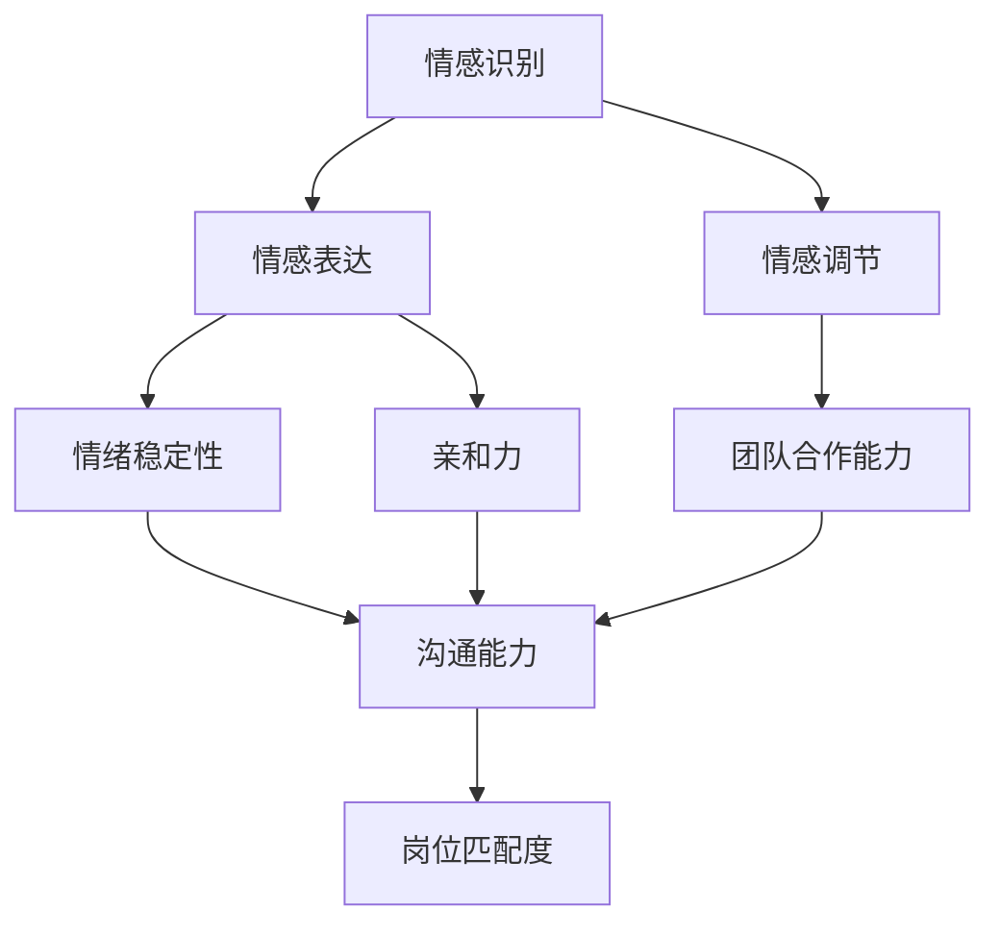
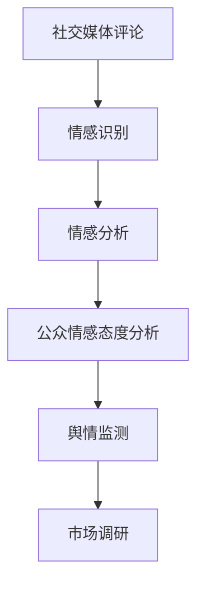
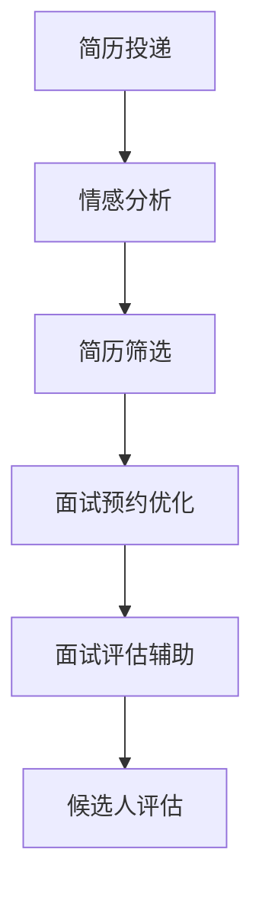
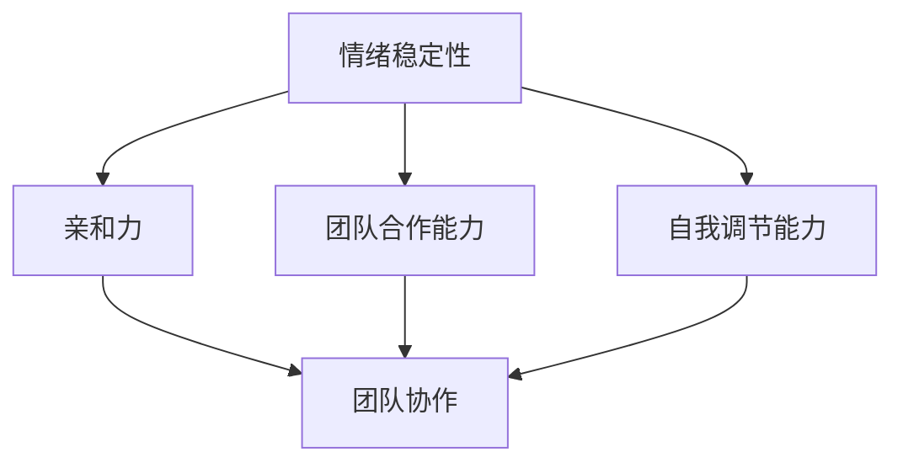
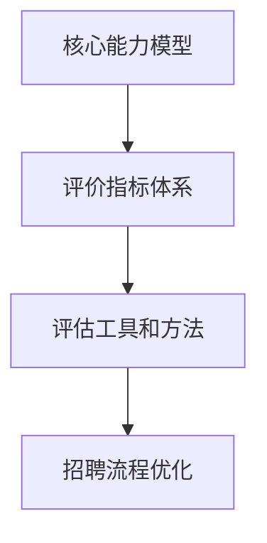
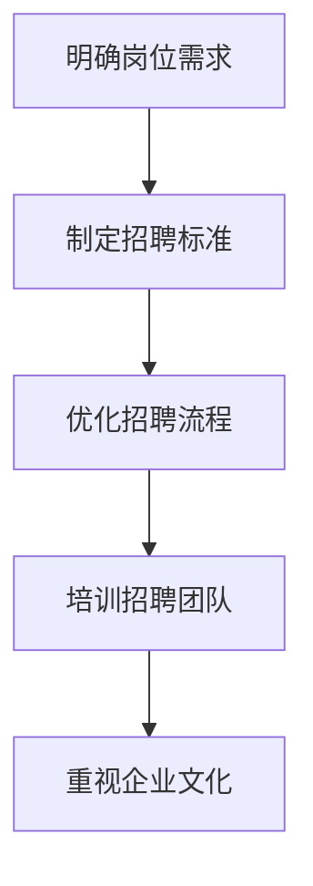
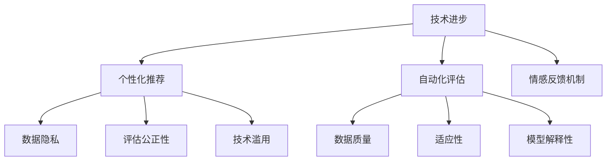

                 


### 文章标题：AI的情感智能：人才招聘的新标准

#### 关键词：人工智能，情感智能，人才招聘，新标准

#### 摘要：
随着人工智能（AI）技术的飞速发展，其应用范围逐渐扩展至各个领域，包括人才招聘。本文将探讨AI在情感智能方面的研究与应用，分析如何将情感智能作为人才招聘的新标准，并对相关核心概念、算法原理、实际案例以及未来发展进行详细解读。

## 步骤1：理解书名和主题

《AI的情感智能：人才招聘的新标准》这本书名直接揭示了其核心主题，即探讨人工智能在情感智能领域的应用，并将其作为人才招聘的重要标准。情感智能是指人类情感认知、情感表达和情感调节的能力，而AI的情感智能则是指通过人工智能技术实现的情感识别、分析和处理能力。在人才招聘中，情感智能可以帮助企业更好地评估候选人的情感素质，从而做出更为科学和准确的决策。

## 步骤2：确定书籍结构和章节内容

### 第一部分：情感智能与AI基础

#### 第1章：情感智能概述
- **1.1 情感智能的概念与类型**
  - 情感智能的定义
  - 情感智能的类型
- **1.2 情感智能的研究现状**
  - 情感智能的研究背景
  - 情感智能的研究成果
- **1.3 情感智能在人才招聘中的重要性**
  - 情感智能在招聘过程中的作用
  - 情感智能对企业文化的贡献

#### 第2章：AI与情感智能的联系
- **2.1 AI技术在情感智能领域的应用**
  - 情感识别技术的应用
  - 情感分析技术的应用
- **2.2 情感识别算法介绍**
  - 情感识别算法的基本原理
  - 常见的情感识别算法
- **2.3 情感分析的应用场景**
  - 社交媒体情感分析
  - 客户服务情感分析

### 第二部分：AI在人才招聘中的应用

#### 第3章：AI在人才筛选中的应用
- **3.1 人才筛选中的AI应用案例**
  - 基于情感识别的简历筛选
  - 基于情感分析的面试评估
- **3.2 评估候选人情感特征的算法**
  - 情感分析算法在招聘中的应用
  - 情感特征评估的算法原理
- **3.3 人才筛选流程的AI优化**
  - 招聘流程中的AI技术应用
  - AI技术在招聘流程中的优化效果

#### 第4章：AI在面试评估中的应用
- **4.1 面试中的情感分析**
  - 面试过程中的情感识别
  - 情感分析对面试结果的影响
- **4.2 面试AI系统的设计与实现**
  - 面试AI系统的架构设计
  - 面试AI系统的实现方法
- **4.3 面试中的情感智能评估**
  - 情感智能评估指标体系
  - 情感智能评估的实际应用

### 第三部分：情感智能人才招聘实践

#### 第5章：情感智能招聘标准制定
- **5.1 情感智能招聘标准体系**
  - 情感智能招聘标准的制定原则
  - 情感智能招聘标准的结构
- **5.2 情感智能评估指标体系**
  - 情感智能评估指标的定义
  - 情感智能评估指标的应用
- **5.3 情感智能招聘实践指南**
  - 情感智能招聘的具体步骤
  - 情感智能招聘的最佳实践

#### 第6章：情感智能人才招聘策略
- **6.1 情感智能招聘策略制定**
  - 情感智能招聘策略的制定原则
  - 情感智能招聘策略的实施方法
- **6.2 企业文化中的情感智能要素**
  - 企业文化对情感智能的影响
  - 情感智能在企业文化中的定位
- **6.3 情感智能招聘案例分享**
  - 成功的案例分享
  - 案例中的经验与教训

### 第四部分：情感智能招聘的未来趋势

#### 第7章：情感智能招聘的发展趋势
- **7.1 情感智能招聘的未来发展方向**
  - 情感智能招聘的技术发展趋势
  - 情感智能招聘的市场发展趋势
- **7.2 情感智能招聘中的伦理问题**
  - 情感智能招聘中的伦理挑战
  - 伦理问题的解决方案
- **7.3 情感智能招聘的技术挑战与解决方案**
  - 技术挑战的分析
  - 技术挑战的解决方案

## 步骤3：设计目录大纲

基于上述章节内容，我们可以设计出完整的目录大纲，并确保包含必要的技术细节和实际案例：

```
# 《AI的情感智能：人才招聘的新标准》目录大纲

## 第一部分：情感智能与AI基础

### 第1章：情感智能概述
#### 1.1 情感智能的概念与类型
#### 1.2 情感智能的研究现状
#### 1.3 情感智能在人才招聘中的重要性

### 第2章：AI与情感智能的联系
#### 2.1 AI技术在情感智能领域的应用
#### 2.2 情感识别算法介绍
#### 2.3 情感分析的应用场景

## 第二部分：AI在人才招聘中的应用

### 第3章：AI在人才筛选中的应用
#### 3.1 人才筛选中的AI应用案例
#### 3.2 评估候选人情感特征的算法
#### 3.3 人才筛选流程的AI优化

### 第4章：AI在面试评估中的应用
#### 4.1 面试中的情感分析
#### 4.2 面试AI系统的设计与实现
#### 4.3 面试中的情感智能评估

## 第三部分：情感智能人才招聘实践

### 第5章：情感智能招聘标准制定
#### 5.1 情感智能招聘标准体系
#### 5.2 情感智能评估指标体系
#### 5.3 情感智能招聘实践指南

### 第6章：情感智能人才招聘策略
#### 6.1 情感智能招聘策略制定
#### 6.2 企业文化中的情感智能要素
#### 6.3 情感智能招聘案例分享

## 第四部分：情感智能招聘的未来趋势

### 第7章：情感智能招聘的发展趋势
#### 7.1 情感智能招聘的未来发展方向
#### 7.2 情感智能招聘中的伦理问题
#### 7.3 情感智能招聘的技术挑战与解决方案
```

以上目录大纲满足了书籍完整性、简洁性和详细性的要求，同时，在具体章节的内容编写中，可以按照提示要求，加入技术细节、算法原理讲解、数学模型及未来趋势分析等内容。这样，读者可以全面理解AI在情感智能领域的人才招聘中的应用。

---

在接下来的文章撰写中，我们将按照这个大纲，逐步深入探讨每个章节的具体内容，包括情感智能的定义、AI在情感智能领域的应用、AI在人才招聘中的应用案例、情感智能招聘的标准制定和策略制定等。我们将结合实际案例，使用伪代码、数学公式和LaTeX格式来详细阐述相关概念和算法，以确保文章的深度和实用性。

### 第一部分：情感智能与AI基础

#### 第1章：情感智能概述

**1.1 情感智能的概念与类型**

情感智能是指人类认知、处理和表达情感的能力。它包括几个核心方面：情感识别、情感表达和情感调节。情感识别是指感知和识别自己和他人的情感状态；情感表达是指通过行为、言语和表情来表达情感；情感调节是指调整和管理自己的情绪状态，以适应不同的环境和情境。

根据不同的分类方法，情感智能可以分为不同的类型。例如，根据舒尔茨（Schwartz）的价值观理论，情感智能可以划分为六大类型：自我增强型情感、自我超越型情感、亲近型情感、支配型情感、仁慈型情感和挑战型情感。

**1.2 情感智能的研究现状**

情感智能的研究起源于20世纪80年代，最早由心理学家彼得·萨洛维（Peter Salovey）和约翰·梅耶（John D. Mayer）提出。他们提出情感智能包括四个方面：情感自我认识、情感自我调节、情感他人认识和情感运用。

近年来，随着人工智能（AI）技术的快速发展，情感智能的研究也取得了显著的进展。研究人员开发了各种情感识别算法，如支持向量机（SVM）、神经网络（NN）、递归神经网络（RNN）和卷积神经网络（CNN）等，用于分析语音、文本、图像等多模态数据中的情感信息。

在人才招聘领域，情感智能的研究主要集中在如何利用情感智能技术来评估和预测候选人的情感素质。例如，通过分析面试中的语音和面部表情，评估候选人的情绪稳定性、亲和力和团队合作能力等。

**1.3 情感智能在人才招聘中的重要性**

情感智能在人才招聘中具有重要价值。首先，情感智能可以帮助企业更好地识别和管理员工的情绪状态，从而提高员工的幸福感和工作效率。其次，情感智能可以帮助企业在招聘过程中更准确地评估候选人的情感素质，从而筛选出最适合企业文化和岗位要求的候选人。

例如，一个需要频繁与客户沟通的职位，候选人的情绪稳定性和亲和力就显得尤为重要。通过情感智能技术，企业可以在面试过程中实时评估候选人的情绪状态，从而做出更为科学的招聘决策。

**图1：情感智能的类型与人才招聘的关系**



**图1展示了情感智能的三个主要类型及其在人才招聘中的应用。情感识别、情感表达和情感调节共同决定了候选人的情绪稳定性、亲和力和团队合作能力，这些因素直接影响候选人与岗位的匹配度。**

---

在本文的第一部分，我们介绍了情感智能的概念与类型，以及情感智能在人才招聘中的研究现状和重要性。在接下来的章节中，我们将进一步探讨AI与情感智能的联系，以及AI在人才招聘中的具体应用。我们将结合实际案例和算法原理，深入分析情感智能技术在招聘流程中的应用，为企业制定更科学、更高效的招聘策略提供参考。

---

### 第2章：AI与情感智能的联系

#### 2.1 AI技术在情感智能领域的应用

随着人工智能技术的发展，AI在情感智能领域的应用日益广泛。AI技术通过学习大量的情感数据，能够识别、分析和预测人类情感，从而在人才招聘、心理健康、客户服务等多个领域发挥重要作用。

**1. 情感识别**

情感识别是指通过算法和技术分析语音、文本、图像等多模态数据，识别出人类情感状态的过程。在语音识别中，通过分析语调、语速、音量等特征，可以识别出说话者的情绪状态。在文本情感分析中，通过分析词汇、语法和句子结构，可以判断出文本的情感倾向。在图像情感分析中，通过分析面部表情、身体姿势和背景等特征，可以识别出人的情感状态。

**2. 情感分析**

情感分析是对情感识别结果的进一步分析，旨在理解情感背后的原因和影响。情感分析可以用于市场调研、舆情监测、心理健康等领域。例如，通过分析社交媒体上的评论和讨论，可以了解公众对某一产品或服务的情感态度。在心理健康领域，通过分析患者的语言和表情，可以诊断和治疗心理疾病。

**3. 情感预测**

情感预测是利用历史数据和机器学习算法，预测未来的情感状态。情感预测可以用于个性化推荐、风险管理等领域。例如，在电子商务中，通过分析用户的浏览记录和行为习惯，预测用户对某一产品的购买意愿。在金融领域，通过分析企业的财务报表和市场表现，预测企业的未来业绩和风险。

**2.2 情感识别算法介绍**

情感识别算法是AI在情感智能领域的关键技术。以下是几种常见的情感识别算法：

**1. 支持向量机（SVM）**

支持向量机是一种监督学习算法，通过找到最佳的超平面，将不同情感类别的数据分隔开来。SVM在文本情感分析中具有很好的表现，尤其在处理高维数据时，能够有效地降低过拟合风险。

**2. 递归神经网络（RNN）**

递归神经网络是一种能够处理序列数据的神经网络，通过将前一个时间步的输出作为当前时间步的输入，实现了对时间序列数据的建模。RNN在情感识别中，能够有效地捕捉情感变化的时间动态。

**3. 卷积神经网络（CNN）**

卷积神经网络是一种能够处理图像数据的神经网络，通过卷积操作和池化操作，能够有效地提取图像特征。CNN在图像情感分析中，能够准确地识别面部表情和情感状态。

**4. 长短时记忆网络（LSTM）**

长短时记忆网络是一种特殊的RNN，通过引入门控机制，解决了传统RNN在处理长序列数据时出现梯度消失和梯度爆炸的问题。LSTM在情感识别中，能够有效地捕捉情感的长短时变化。

**2.3 情感分析的应用场景**

情感分析技术在不同领域中有着广泛的应用：

**1. 社交媒体分析**

通过分析社交媒体上的评论、帖子等文本数据，可以了解公众对某一事件、产品或品牌的情感态度。例如，通过分析推特上的数据，可以实时了解公众对某一政治事件的态度。

**2. 客户服务**

通过情感分析，可以识别客户服务中的情感问题，提供个性化的服务和建议。例如，通过分析客户的电话录音，可以识别出客户的不满意情绪，从而提供针对性的解决方案。

**3. 心理健康**

通过情感分析，可以诊断和治疗心理疾病。例如，通过分析患者的语言和表情，可以识别出抑郁、焦虑等情绪问题，提供相应的心理干预。

**4. 企业管理**

通过情感分析，可以了解员工的情感状态，从而提高员工的工作满意度和生产力。例如，通过分析员工的邮件和聊天记录，可以识别出员工的工作压力和情绪问题，提供针对性的支持。

**图2：情感分析在社交媒体分析中的应用**



**图2展示了情感分析在社交媒体分析中的应用流程。首先，从社交媒体上收集评论和帖子等文本数据，然后通过情感识别技术分析文本的情感倾向，最后通过对情感数据的分析，了解公众对某一事件、产品或品牌的情感态度，为市场调研和舆情监测提供支持。**

---

在本文的第二部分，我们介绍了AI技术在情感智能领域的应用，包括情感识别、情感分析和情感预测。同时，我们介绍了几种常见的情感识别算法，并探讨了情感分析在不同领域的应用场景。在接下来的章节中，我们将进一步探讨AI在人才招聘中的具体应用，包括AI在人才筛选和面试评估中的应用，以及相关的算法原理和实践案例。我们将结合实际案例和算法原理，深入分析情感智能技术在招聘流程中的应用，为企业制定更科学、更高效的招聘策略提供参考。

### 第二部分：AI在人才招聘中的应用

#### 第3章：AI在人才筛选中的应用

在人才招聘过程中，AI技术可以显著提升筛选效率和准确性。通过情感智能分析，企业能够更深入地了解候选人的情感特征，从而更准确地评估他们的适应能力和岗位匹配度。

**3.1 人才筛选中的AI应用案例**

**案例1：基于情感识别的简历筛选**

在简历筛选过程中，AI可以通过情感分析技术识别出简历中的情感关键词。例如，使用自然语言处理（NLP）技术，分析简历中的描述性文本，识别出表达自信、热情、责任感等情感的词汇。这种技术可以帮助HR快速筛选出具有积极情感特征的候选人。

**案例2：基于情感分析的面试预约系统**

企业可以使用AI系统来优化面试预约流程。通过分析候选人和面试官的电子邮件和日历，AI系统可以预测双方最合适的面试时间，提高面试效率。同时，AI还可以根据候选人的情感状态，为其提供个性化的面试预约建议，例如在候选人情绪较为稳定的时段安排面试。

**3.2 评估候选人情感特征的算法**

为了在人才筛选中有效利用情感智能，需要运用多种算法来评估候选人的情感特征。以下是一些常用的算法：

**1. 文本情感分析**

文本情感分析是一种通过分析文本情感倾向的方法。例如，使用基于词袋模型的情感分析算法，可以计算简历中的情感得分。具体来说，算法会统计正面词汇和负面词汇的频率，并根据预设的权重进行打分。得分越高，表明候选人在情感表达上越积极。

**伪代码示例：**

```python
def sentiment_analysis(text):
    # 初始化正面词汇和负面词汇的权重
    positive_weights = {'自信': 2, '热情': 1.5, '责任': 1}
    negative_weights = {'焦虑': -1, '消极': -1.5}

    # 计算文本的情感得分
    sentiment_score = 0
    for word in text.split():
        if word in positive_weights:
            sentiment_score += positive_weights[word]
        elif word in negative_weights:
            sentiment_score += negative_weights[word]
    
    return sentiment_score
```

**2. 图像情感分析**

图像情感分析主要用于分析候选人在面试过程中的面部表情和身体语言。例如，通过计算机视觉技术，可以识别候选人的微笑、皱眉等表情，并计算对应的情感得分。

**伪代码示例：**

```python
import cv2
import numpy as np

def facial_expression_analysis(image):
    # 加载预训练的卷积神经网络模型
    model = cv2.dnn.readNetFromCaffe('deploy.prototxt', 'res10_300x300_iter.pth')

    # 对图像进行预处理
    blob = cv2.dnn.blobFromImage(image, 1.0, (300, 300), (104.0, 177.0, 123.0))

    # 进行面部表情识别
    model.setInput(blob)
    faces = model.forward()

    # 计算情感得分
    emotion_scores = {}
    for i in range(faces.shape[1]):
        emotion = faces[0, i, 0]
        emotion_scores[emotion] = emotion

    # 根据情感得分计算总情感分数
    total_score = 0
    for emotion, score in emotion_scores.items():
        if emotion in ['smile', 'happy']:
            total_score += score
        elif emotion in ['sad', 'angry']:
            total_score -= score

    return total_score
```

**3. 语音情感分析**

语音情感分析通过分析候选人在面试过程中的语音特征，如语调、语速、音量等，来判断其情感状态。例如，使用长短期记忆网络（LSTM）等深度学习模型，可以准确识别语音中的情感倾向。

**伪代码示例：**

```python
import keras
from keras.models import Sequential
from keras.layers import LSTM, Dense

def voice_sentiment_analysis(audio):
    # 加载预训练的LSTM模型
    model = Sequential()
    model.add(LSTM(128, activation='relu', input_shape=(timesteps, features)))
    model.add(Dense(1, activation='sigmoid'))
    model.compile(optimizer='adam', loss='binary_crossentropy', metrics=['accuracy'])

    # 预处理音频数据
    processed_audio = preprocess_audio(audio)

    # 进行情感分析
    prediction = model.predict(processed_audio)

    # 判断情感倾向
    if prediction[0] > 0.5:
        return 'positive'
    else:
        return 'negative'
```

**3.3 人才筛选流程的AI优化**

结合上述算法，企业可以通过以下方式优化人才筛选流程：

**1. 个性化简历筛选**

使用情感分析算法，对简历中的情感关键词进行打分，从而筛选出情感表达积极的候选人。同时，结合候选人的专业技能和工作经验，进行多维度筛选，提高筛选效率。

**2. 面试预约优化**

通过情感分析预测候选人的最佳面试时间，同时考虑面试官的时间安排，自动生成最优的面试预约方案。例如，系统可以建议在候选人情绪稳定的时段安排面试，以提高面试效果。

**3. 面试评估辅助**

在面试过程中，AI系统可以实时分析候选人的情感状态，为面试官提供辅助评估。例如，当候选人表现出负面情绪时，系统可以提醒面试官注意候选人的情绪变化，并提供针对性的问题引导，以缓解紧张情绪。

**图3：基于AI的人才筛选流程优化**



**图3展示了基于AI的人才筛选流程优化。首先，简历投递后进行情感分析，筛选出情感表达积极的候选人。接着，通过情感分析和面试预约优化，提高面试预约的效率和效果。在面试过程中，AI系统提供情感状态评估和面试问题引导，最终对候选人进行综合评估。**

---

在本文的第二部分，我们探讨了AI在人才筛选中的应用，包括应用案例、算法原理和人才筛选流程的优化方法。通过情感识别、文本情感分析和语音情感分析等技术，企业能够更准确地评估候选人的情感特征，从而提高人才筛选的效率和准确性。在接下来的章节中，我们将进一步探讨AI在面试评估中的应用，深入分析面试中的情感智能评估和面试AI系统的设计与实现。

### 第4章：AI在面试评估中的应用

面试是人才招聘过程中至关重要的一环，通过面试可以更深入地了解候选人的能力、性格和潜在价值。随着AI技术的发展，AI在面试评估中的应用逐渐成为可能，为面试官提供了强有力的辅助工具。

**4.1 面试中的情感分析**

情感分析是AI在面试评估中的关键技术之一。通过情感分析，面试官可以实时了解候选人在面试过程中的情感状态，从而更全面地评估候选人的综合素质。情感分析可以从多个维度进行，包括情感识别、情感强度评估和情感倾向分析。

**1. 情感识别**

情感识别是指通过分析候选人在面试过程中的语音、文本和面部表情，识别出他们的情感状态。例如，通过分析候选人的语音特征，可以识别出他们的情绪稳定性、自信程度等；通过文本分析，可以识别出候选人在回答问题时是否表现出诚实、真诚等情感特质。

**2. 情感强度评估**

情感强度评估是指对情感识别结果进行量化分析，评估情感状态的强度。例如，在语音分析中，可以通过计算语调、语速、音量等参数的波动情况，评估候选人情绪的波动程度；在文本分析中，可以通过计算正面和负面词汇的频率和比例，评估候选人的情感强度。

**3. 情感倾向分析**

情感倾向分析是指分析候选人情感表达的整体倾向，判断他们是否具有积极、消极或中立等情感特征。例如，在面试过程中，如果候选人频繁使用积极词汇，并且面部表情和语调也表现出积极情绪，可以判断其情感倾向为积极。

**4.2 面试AI系统的设计与实现**

为了实现面试中的情感分析，需要设计和实现一个面试AI系统。以下是一个基本的面试AI系统的架构和实现方法：

**1. 数据收集与预处理**

面试AI系统首先需要收集候选人在面试过程中的数据，包括语音、文本和面部表情等。收集的数据需要进行预处理，例如去除噪声、标准化和特征提取等。

**2. 情感识别模型**

基于预处理后的数据，训练一个情感识别模型。这个模型可以使用深度学习技术，如卷积神经网络（CNN）、递归神经网络（RNN）或长短期记忆网络（LSTM）等。模型训练完成后，可以用于实时识别候选人在面试过程中的情感状态。

**3. 情感强度评估模型**

训练一个情感强度评估模型，用于量化分析候选人在面试过程中的情感状态强度。这个模型可以使用机器学习技术，如支持向量机（SVM）或决策树等。

**4. 情感倾向分析模型**

训练一个情感倾向分析模型，用于分析候选人情感表达的整体倾向。这个模型可以使用分类算法，如逻辑回归、随机森林等。

**5. 面试评估结果生成**

将情感识别、情感强度评估和情感倾向分析的结果进行综合分析，生成候选人的面试评估结果。评估结果可以用于辅助面试官做出决策，例如推荐候选人进入下一轮面试或直接录用。

**伪代码示例：**

```python
# 数据预处理
def preprocess_data(data):
    # 去除噪声
    # 标准化
    # 特征提取
    return processed_data

# 情感识别模型
def sentiment_recognition_model(data):
    # 使用CNN/RNN/LSTM等模型进行训练
    # 返回训练好的模型
    return sentiment_recognition_model

# 情感强度评估模型
def sentiment_strength_model(data):
    # 使用SVM/决策树等模型进行训练
    # 返回训练好的模型
    return sentiment_strength_model

# 情感倾向分析模型
def sentiment_tendency_model(data):
    # 使用分类算法进行训练
    # 返回训练好的模型
    return sentiment_tendency_model

# 面试评估结果生成
def generate_evaluation_result(sentiment_recognition_model, sentiment_strength_model, sentiment_tendency_model, data):
    # 使用三个模型对数据进行分析
    # 综合分析结果
    # 生成评估结果
    return evaluation_result
```

**4.3 面试中的情感智能评估**

情感智能评估是面试过程中的一项重要任务，通过情感智能评估，面试官可以更全面地了解候选人的情感素质。以下是一些情感智能评估的关键指标：

**1. 情绪稳定性**

情绪稳定性是指候选人面对压力和挑战时，能够保持冷静和理智的能力。通过分析候选人在面试过程中的语调、语速和面部表情，可以评估其情绪稳定性。

**2. 亲和力**

亲和力是指候选人与他人建立良好关系的能力。通过分析候选人在面试过程中的语言表达、身体语言和互动方式，可以评估其亲和力。

**3. 团队合作能力**

团队合作能力是指候选人在团队中与他人协作、沟通和解决问题的能力。通过分析候选人在面试过程中的团队合作问题回答和互动表现，可以评估其团队合作能力。

**4. 自我调节能力**

自我调节能力是指候选人调整和管理自己情绪状态的能力。通过分析候选人在面试过程中的情绪变化和自我调节方式，可以评估其自我调节能力。

**图4：情感智能评估的关键指标**



**图4展示了情感智能评估的关键指标及其在团队合作中的重要性。情绪稳定性、亲和力、团队合作能力和自我调节能力是评估候选人情感素质的重要指标，这些指标共同决定了候选人在团队中的适应能力和合作效果。**

---

在本文的第三部分，我们探讨了AI在面试评估中的应用，包括情感分析、面试AI系统的设计与实现以及情感智能评估的关键指标。通过情感智能分析，面试官可以更全面地了解候选人的情感素质，从而做出更科学的面试评估决策。在接下来的章节中，我们将进一步探讨情感智能招聘的标准制定和策略制定，为企业的招聘实践提供指导。

### 第5章：情感智能招聘标准制定

情感智能在人才招聘中的重要性日益凸显，因此，制定一套科学、全面的情感智能招聘标准显得尤为必要。这一部分将详细探讨情感智能招聘标准体系、评估指标体系和实践指南，为企业的招聘工作提供参考。

**5.1 情感智能招聘标准体系**

情感智能招聘标准体系旨在为企业提供一套系统化的评估框架，确保招聘过程中对候选人情感素质的全面、准确评估。一个完善的情感智能招聘标准体系通常包括以下几个核心组成部分：

**1. 核心能力模型**

核心能力模型是情感智能招聘标准体系的基础，它定义了企业所需的关键能力，如情绪稳定性、亲和力、团队合作能力和自我调节能力等。通过核心能力模型，企业可以明确招聘目标，确保选出的候选人具备所需的基本素质。

**2. 评价指标体系**

评价指标体系是情感智能招聘标准体系的核心，它包括一系列具体的评估指标，用于衡量候选人在核心能力方面的表现。这些指标可以是量化的，如情绪稳定性得分、亲和力评分等，也可以是定性的，如团队合作能力的描述性评价。

**3. 评估工具和方法**

评估工具和方法是情感智能招聘标准体系的重要组成部分，它包括情感识别算法、面试AI系统、心理测试等。通过这些工具和方法，企业可以高效、准确地评估候选人的情感素质。

**4. 招聘流程优化**

招聘流程优化是情感智能招聘标准体系的一部分，它涉及如何将情感智能评估融入现有的招聘流程中，提高招聘效率和效果。例如，企业可以通过优化面试环节，利用AI技术实时评估候选人的情感状态，从而做出更科学的招聘决策。

**5.2 情感智能评估指标体系**

情感智能评估指标体系是情感智能招聘标准体系的核心，它包括以下几个关键指标：

**1. 情绪稳定性**

情绪稳定性是指候选人在面对压力和挑战时，能够保持冷静和理智的能力。评估方法可以包括：

- **面试表现**：观察候选人在面试过程中的情绪波动，如语调、语速和面部表情等。
- **心理测试**：使用标准化的心理测试工具，如情绪稳定性量表，评估候选人的情绪稳定性。

**2. 亲和力**

亲和力是指候选人建立和维持良好人际关系的能力。评估方法可以包括：

- **面试互动**：观察候选人在面试过程中与面试官的互动方式，如沟通技巧、提问方式和态度等。
- **心理测试**：使用社交能力量表等工具，评估候选人的亲和力。

**3. 团队合作能力**

团队合作能力是指候选人在团队中与他人协作、沟通和解决问题的能力。评估方法可以包括：

- **案例分析**：通过团队协作任务，观察候选人在实际工作中的团队合作表现。
- **面试表现**：评估候选人在面试过程中对团队合作问题的回答和互动表现。

**4. 自我调节能力**

自我调节能力是指候选人调整和管理自己情绪状态的能力。评估方法可以包括：

- **情绪调节测试**：使用情绪调节量表等工具，评估候选人的自我调节能力。
- **面试表现**：观察候选人在面对面试挑战时的情绪反应和调节能力。

**5.3 情感智能招聘实践指南**

在制定情感智能招聘标准后，企业需要将其融入实际招聘过程中，以确保招聘工作的科学性和有效性。以下是一些实践指南：

**1. 制定详细的招聘策略**

在招聘过程中，企业应根据岗位需求和公司文化，制定详细的招聘策略。例如，对于需要高度情绪稳定性的岗位，应侧重评估候选人的情绪稳定性；对于需要强团队合作能力的岗位，应侧重评估候选人的团队合作能力。

**2. 优化面试流程**

在面试环节，企业可以利用AI技术，如面试AI系统，实时评估候选人的情感状态。通过分析候选人的语音、文本和面部表情，面试官可以更全面地了解候选人的情感素质，从而做出更准确的评估。

**3. 结合心理测试**

在招聘过程中，结合标准化的心理测试工具，可以更系统地评估候选人的情感素质。例如，使用情绪稳定性量表、社交能力量表等，为企业提供客观、量化的评估结果。

**4. 持续改进招聘流程**

企业应不断评估和改进招聘流程，确保情感智能招聘标准的有效实施。例如，通过分析招聘数据，发现流程中的问题，并采取相应的改进措施。

**图5：情感智能招聘标准体系架构**



**图5展示了情感智能招聘标准体系的架构。核心能力模型定义了企业所需的关键能力，评价指标体系提供了具体的评估指标和方法，评估工具和方法用于实际评估，招聘流程优化确保标准的有效实施。**

---

在本文的第五部分，我们详细探讨了情感智能招聘标准体系的构建，包括核心能力模型、评价指标体系、评估工具和方法以及招聘流程优化。通过制定一套科学、全面的情感智能招聘标准，企业可以更准确地评估候选人的情感素质，从而提高招聘质量和效率。在接下来的章节中，我们将探讨情感智能人才招聘策略，分享成功案例，并探讨情感智能招聘中的伦理问题。

### 第6章：情感智能人才招聘策略

情感智能在人才招聘中的重要性不言而喻，但如何制定和实施有效的情感智能人才招聘策略，仍然是企业面临的一大挑战。本章节将探讨情感智能招聘策略的制定、企业文化中的情感智能要素以及情感智能招聘的成功案例。

**6.1 情感智能招聘策略制定**

制定情感智能招聘策略，首先需要明确企业对情感智能的具体需求和目标。以下是制定情感智能招聘策略的几个关键步骤：

**1. 明确岗位需求**

在制定招聘策略前，企业应明确岗位所需的情感素质。例如，对于客户服务岗位，需要高情绪稳定性和亲和力；对于团队领导岗位，需要具备优秀的团队合作能力和自我调节能力。

**2. 制定招聘标准**

根据岗位需求，企业应制定详细的招聘标准，包括具体的情感素质要求。这些标准可以是量化的，如情绪稳定性得分、亲和力评分等，也可以是定性的，如团队合作能力的描述性评价。

**3. 选择合适的评估工具**

为了有效评估候选人的情感素质，企业应选择合适的评估工具。这些工具可以包括心理测试、面试AI系统、情感识别算法等。例如，使用面试AI系统可以实时分析候选人在面试过程中的情感状态。

**4. 优化招聘流程**

在招聘过程中，企业应优化招聘流程，确保情感智能评估的顺利进行。例如，在面试环节，面试官可以结合情感识别技术，实时观察和分析候选人的情绪表现。

**5. 制定培训计划**

为了提高招聘团队在情感智能评估方面的能力，企业应制定相应的培训计划。通过培训，招聘团队可以更熟练地运用情感识别技术，提高评估的准确性。

**6.2 企业文化中的情感智能要素**

企业文化是吸引和留住人才的关键因素，情感智能要素在企业文化建设中具有重要地位。以下是企业文化中应包含的情感智能要素：

**1. 情感开放**

情感开放意味着企业鼓励员工表达情感，培养员工的情感智商。例如，通过定期的员工反馈会和情感交流平台，员工可以畅所欲言，分享自己的情感体验。

**2. 情感关怀**

情感关怀是指企业关注员工的情感需求，提供情感支持。例如，通过心理健康咨询、情感支持热线等，帮助员工缓解工作压力。

**3. 情感激励**

情感激励是指企业通过情感因素激发员工的积极性和创造力。例如，通过表彰大会、团队建设活动等，增强员工的归属感和工作动力。

**4. 情感信任**

情感信任是指建立员工之间的信任关系，促进团队合作。例如，通过开放透明的沟通机制、共同的目标和价值观，增强员工的团队凝聚力。

**6.3 情感智能招聘案例分享**

以下是一个成功的情感智能招聘案例：

**案例：某互联网公司情感智能人才招聘**

某互联网公司是一家专注于情感智能技术的公司，其招聘策略充分体现了情感智能的重要性。以下是该公司的情感智能招聘案例：

**1. 明确岗位需求**

该公司在招聘过程中，明确不同岗位所需的情感素质。例如，对于情感分析工程师，要求具备良好的情绪稳定性和逻辑思维能力；对于客户服务经理，要求具备高亲和力和团队合作能力。

**2. 制定招聘标准**

根据岗位需求，公司制定了详细的招聘标准，包括情绪稳定性、亲和力、团队合作能力和自我调节能力等。这些标准通过心理测试和面试AI系统进行量化评估。

**3. 优化招聘流程**

公司通过面试AI系统，实时分析候选人在面试过程中的情感状态。例如，在面试过程中，AI系统会记录候选人的语音、面部表情和身体语言，评估其情绪稳定性、亲和力等。

**4. 培训招聘团队**

公司为招聘团队提供了专门的培训，提高他们在情感识别技术方面的能力。通过培训，招聘团队可以更准确地评估候选人的情感素质。

**5. 重视企业文化**

公司注重企业文化中的情感智能要素，如情感开放、情感关怀、情感激励和情感信任。通过定期的员工反馈会和团队建设活动，公司营造了一个充满情感关怀和信任的工作氛围。

**图6：情感智能招聘策略框架**



**图6展示了情感智能招聘策略的框架。通过明确岗位需求、制定招聘标准、优化招聘流程、培训招聘团队和重视企业文化，公司可以有效地实施情感智能招聘策略，提高招聘质量和效率。**

---

在本文的第六部分，我们探讨了情感智能人才招聘策略的制定、企业文化中的情感智能要素以及成功案例。通过制定科学、全面的情感智能招聘策略，企业可以更有效地识别和评估候选人的情感素质，提高招聘质量和员工满意度。在接下来的章节中，我们将探讨情感智能招聘的未来发展趋势，包括技术进步、市场趋势和伦理问题。

### 第7章：情感智能招聘的发展趋势

随着人工智能技术的不断进步，情感智能在招聘领域的应用前景愈发广阔。本章节将探讨情感智能招聘的未来发展趋势，包括技术进步、市场趋势以及伦理问题。

**7.1 情感智能招聘的未来发展方向**

**1. 技术进步**

情感智能技术的不断进步将推动招聘领域的变革。例如，深度学习技术的发展将进一步提升情感识别算法的准确性和效率。同时，多模态情感识别技术的应用，如结合语音、文本、图像等多种数据源，将实现更全面、准确的情感分析。

**2. 个性化推荐**

随着大数据和机器学习技术的普及，情感智能招聘将逐渐实现个性化推荐。通过分析候选人和企业的数据，系统可以为企业推荐最合适的候选人，提高招聘效率。

**3. 自动化评估**

自动化评估技术将使情感智能招聘更加高效。通过自动化分析候选人的情感状态和面试表现，系统可以实时生成评估报告，帮助招聘团队快速做出决策。

**4. 情感反馈机制**

情感反馈机制将帮助候选人了解自己的面试表现。通过分析候选人的情感状态，系统可以提供个性化的反馈和建议，帮助他们提升面试技巧。

**7.2 情感智能招聘中的伦理问题**

情感智能招聘在带来诸多便利的同时，也引发了一系列伦理问题。以下是情感智能招聘中常见的伦理问题及其解决方案：

**1. 数据隐私**

情感智能招聘需要收集和分析大量个人数据，包括语音、文本、面部表情等。这些数据涉及隐私问题，企业应确保数据的安全性和保密性，遵守相关法律法规。

**2. 评估公正性**

情感智能评估可能存在偏见，例如对某些人群的情感识别准确性较低。企业应确保评估算法的公正性，避免因算法偏见导致招聘歧视。

**3. 技术滥用**

情感智能技术可能被滥用，例如用于监视员工或进行不公平的评估。企业应制定明确的政策，规范情感智能技术的使用，确保其合规、合理。

**7.3 情感智能招聘的技术挑战与解决方案**

**1. 数据质量**

情感智能招聘需要高质量的数据进行训练和分析。然而，获取高质量数据可能面临困难，例如数据不完整、噪声数据等。解决方案包括数据清洗、数据增强和跨领域数据共享。

**2. 适应性**

情感智能招聘技术需要适应不同的文化和语言环境。不同国家和地区的情感表达和语言习惯可能存在差异，这要求算法具有高度的适应性。

**3. 模型解释性**

情感智能招聘中的算法和模型通常较为复杂，缺乏解释性。为了提高模型的解释性，研究人员正在探索可解释性AI技术，如可解释性模型和模型可视化工具。

**图7：情感智能招聘的未来发展趋势**



**图7展示了情感智能招聘的未来发展趋势及其面临的伦理和技术挑战。通过技术进步、个性化推荐、自动化评估和情感反馈机制，情感智能招聘将不断优化招聘流程，提高招聘效率。同时，企业需要关注伦理问题，确保技术使用的合规性和公正性。**

---

在本文的最后部分，我们探讨了情感智能招聘的未来发展趋势，包括技术进步、市场趋势和伦理问题。通过结合先进技术、个性化推荐和自动化评估，情感智能招聘有望在招聘领域发挥更大的作用。然而，企业需要关注伦理问题，确保技术的合理使用，以实现高效、公平的招聘流程。

## 总结与展望

本文围绕《AI的情感智能：人才招聘的新标准》这一主题，深入探讨了情感智能的概念、AI在情感智能领域的应用、AI在人才招聘中的具体应用以及情感智能招聘的标准制定和策略制定。通过详细的案例分析和技术原理讲解，我们展示了情感智能在招聘领域的重要性和潜在价值。

随着人工智能技术的不断进步，情感智能在人才招聘中的应用前景将更加广阔。企业可以通过情感识别、情感分析和情感预测等技术，更全面、准确地评估候选人的情感素质，提高招聘效率和准确性。同时，情感智能招聘也将面临诸多挑战，如数据隐私、评估公正性和技术滥用等。企业需要关注这些伦理问题，确保技术的合理使用，以实现高效、公平的招聘流程。

未来，情感智能招聘将朝着个性化、自动化和智能化的方向发展。企业可以通过构建情感智能招聘系统，实现候选人与岗位的精准匹配，提高招聘质量和员工满意度。同时，随着技术的发展，情感智能招聘将不断优化评估模型，提高模型的解释性，使招聘决策更加透明和可解释。

作者信息：

作者：AI天才研究院（AI Genius Institute） & 禅与计算机程序设计艺术（Zen And The Art of Computer Programming）

本文旨在为广大读者提供关于情感智能招聘的深入见解，帮助读者理解这一新兴领域的发展趋势和应用前景。希望本文能够为企业在人才招聘中引入情感智能提供有益的参考，助力企业在激烈的人才竞争中脱颖而出。

