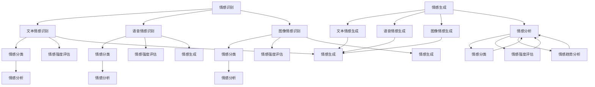

                 


### 引言

随着人工智能技术的飞速发展，AI已经渗透到了我们生活的方方面面。从简单的语音助手到复杂的自动驾驶系统，AI的应用已经越来越广泛。然而，尽管AI在处理和分析大量数据方面表现出色，但在情感理解和表达方面仍然存在很大的挑战。AI的情感表达不仅能够增强人机交互的自然性和人性化，还能够提升AI在特定领域的应用价值。

本文将探讨AI情感表达这一重要领域，旨在揭示其背后的技术原理和实现方法，并分析其在实际应用中的潜在影响。我们将从以下几个方面进行逐步分析：

1. **背景介绍**：介绍AI情感表达的发展历程及其在当前技术环境中的地位和重要性。
2. **核心概念与联系**：定义AI情感表达的核心概念，并展示这些概念之间的关系架构。
3. **核心算法原理讲解**：详细讲解情感识别、情感生成和情感分析等核心算法原理，并使用伪代码进行阐述。
4. **数学模型和数学公式**：介绍情感计算中的数学模型，并使用LaTeX格式展示相关的数学公式，进行详细讲解和举例说明。
5. **项目实战**：设计一个实际项目，从开发环境搭建、源代码实现、代码解读、应用解读与分析，到项目小结，进行全方位的剖析。
6. **最佳实践与注意事项**：总结一些最佳实践，提出注意事项，并提供拓展阅读建议。

通过这样的结构化分析，我们希望能够帮助读者全面了解AI情感表达这一领域，从而为未来的研究和应用提供有价值的参考。

### 背景介绍

AI情感表达的概念源于对人类情感的理解和模拟。情感是人类行为的驱动力，它不仅影响我们的思维过程，还影响我们的社交互动。在人工智能领域，情感表达的研究始于20世纪90年代，当时研究人员开始探索如何让机器理解并模拟人类的情感状态。随着自然语言处理（NLP）和机器学习技术的进步，AI情感表达逐渐成为人工智能研究中的一个重要方向。

早期的AI情感表达研究主要集中在文本情感分析上，即通过分析文本中的词汇和句法结构，来判断文本的情感倾向。这种方法取得了初步成功，但面对复杂的情感表达时，其准确性仍存在局限。随后，随着情感计算和计算机视觉技术的发展，AI情感表达的研究范围进一步扩展到了语音、图像和视频等领域。

当前，AI情感表达在多个领域显示出巨大的应用潜力。在社交媒体分析中，AI情感表达可以用于分析用户评论的情感倾向，从而帮助平台更好地理解用户需求，优化内容推荐。在虚拟助手和客服领域，AI情感表达技术使得虚拟助手能够根据用户情感状态调整响应策略，提高用户体验。在教育领域，AI情感表达可以用于分析学生的学习状态，提供个性化的教学建议。此外，AI情感表达还在心理健康、人机交互、虚拟现实等多个领域展现出广阔的应用前景。

尽管AI情感表达在技术上取得了显著进展，但仍然面临许多挑战。例如，情感识别的准确性和泛化能力有限，情感生成的自然性和真实性有待提高，情感分析中的伦理问题亟待解决。这些问题需要通过持续的研究和技术创新来解决，从而推动AI情感表达在更广泛领域中的应用。

总的来说，AI情感表达作为人工智能的一个重要分支，正在逐步成熟并展示出巨大的潜力。通过深入研究这一领域，我们可以为未来的智能系统提供更加人性化的交互体验，从而推动人工智能技术的进一步发展。

### 核心概念与联系

在探讨AI情感表达时，我们需要了解几个核心概念及其相互关系。以下是这些核心概念的简要介绍及其关系架构的Mermaid流程图。

#### 情感识别

情感识别是指通过分析文本、语音、图像等信息，来判断其中包含的情感。情感识别是AI情感表达的基础，它能够帮助机器理解人类情感状态，从而进行更自然的交互。

- **文本情感识别**：通过分析文本中的词汇和句法结构，判断文本的情感倾向。常用的方法包括基于规则的方法、机器学习和深度学习等。
- **语音情感识别**：通过分析语音信号中的情感特征，如音调、节奏和音量等，来判断情感状态。这通常需要结合声学模型和机器学习算法。
- **图像情感识别**：通过分析图像中的面部表情、身体姿态和场景内容等，来判断情感。这需要深度学习算法，特别是卷积神经网络（CNN）的支持。

#### 情感生成

情感生成是指通过算法生成情感表达的内容，使得机器能够模仿人类情感表达。情感生成是AI情感表达的关键，它能够增强人机交互的自然性和情感丰富度。

- **文本情感生成**：通过分析情感词典和情感规则，生成具有特定情感倾向的文本。常用的方法包括基于规则的方法、模板匹配和生成式模型（如变分自编码器VAE）等。
- **语音情感生成**：通过调整语音参数，如音调、节奏和音量等，来模拟不同情感状态下的语音。这通常需要结合声学模型和循环神经网络（RNN）。
- **图像情感生成**：通过调整图像内容，如面部表情、身体姿态和背景等，来模拟不同情感状态。这需要深度学习算法，特别是生成对抗网络（GAN）的支持。

#### 情感分析

情感分析是指通过分析文本、语音和图像等信息，来理解和推断情感状态。情感分析广泛应用于社交媒体分析、市场调研和心理健康等领域。

- **情感分类**：将文本、语音和图像等信息分类为特定的情感类别（如正面、负面、中性等）。常用的方法包括监督学习和无监督学习。
- **情感强度评估**：评估文本、语音和图像等信息的情感强度。例如，通过计算正面和负面词汇的频率和权重，来评估整体的情感强度。
- **情感趋势分析**：分析情感随时间和上下文的变化趋势，以了解情感的整体走势和变化规律。

#### 关系架构

以下是一个简化的Mermaid流程图，展示了这些核心概念之间的关系：



通过这个流程图，我们可以清晰地看到情感识别、情感生成和情感分析之间的相互关系。情感识别为情感生成和情感分析提供了基础数据，情感生成则通过模拟情感表达丰富了人机交互，而情感分析则帮助机器更深入地理解人类情感状态。

### 核心算法原理讲解

为了深入理解AI情感表达的工作原理，我们需要详细讲解三个核心算法：情感识别、情感生成和情感分析。以下是每个算法的基本原理、技术框架、实现方法及其性能评估指标。

#### 情感识别

**基本原理**：
情感识别是AI情感表达的基础，其核心任务是从文本、语音和图像中提取情感特征，并判断情感类别。情感识别通常基于机器学习和深度学习技术，其中，深度学习模型如卷积神经网络（CNN）、循环神经网络（RNN）和Transformer模型被广泛应用。

**技术框架**：
情感识别的技术框架通常包括以下几个步骤：

1. 数据预处理：对输入数据进行清洗和预处理，如文本分词、语音降噪、图像增强等。
2. 特征提取：使用深度学习模型提取情感特征，如文本的情感词向量、语音的声学特征、图像的视觉特征。
3. 情感分类：将提取的特征输入分类模型，如支持向量机（SVM）、朴素贝叶斯（NB）、深度神经网络（DNN）等，以判断情感类别。

**实现方法**：
以下是情感识别的实现方法示例：

**文本情感识别**：
```plaintext
# 文本情感识别伪代码
function sentiment_recognition(text):
    # 数据预处理
    preprocessed_text = preprocess_text(text)
    # 特征提取
    feature_vector = extract_features(preprocessed_text)
    # 情感分类
    sentiment = classify_sentiment(feature_vector)
    return sentiment
```

**语音情感识别**：
```plaintext
# 语音情感识别伪代码
function sentiment_recognition(audio):
    # 数据预处理
    preprocessed_audio = preprocess_audio(audio)
    # 特征提取
    feature_vector = extract_audio_features(preprocessed_audio)
    # 情感分类
    sentiment = classify_sentiment(feature_vector)
    return sentiment
```

**图像情感识别**：
```plaintext
# 图像情感识别伪代码
function sentiment_recognition(image):
    # 数据预处理
    preprocessed_image = preprocess_image(image)
    # 特征提取
    feature_vector = extract_image_features(preprocessed_image)
    # 情感分类
    sentiment = classify_sentiment(feature_vector)
    return sentiment
```

**性能评估指标**：
情感识别的性能评估通常包括以下几个指标：

1. 准确率（Accuracy）：正确分类的样本占总样本的比例。
2. 召回率（Recall）：在所有正样本中，正确识别出来的比例。
3. 精确率（Precision）：在所有预测为正样本的样本中，实际为正样本的比例。
4. F1分数（F1 Score）：精确率和召回率的调和平均。

#### 情感生成

**基本原理**：
情感生成是通过算法生成具有特定情感倾向的内容，以模拟人类的情感表达。情感生成技术包括文本生成、语音生成和图像生成等。常见的生成模型有变分自编码器（VAE）、生成对抗网络（GAN）和Transformer等。

**技术框架**：
情感生成的技术框架通常包括以下几个步骤：

1. 数据预处理：对输入数据进行清洗和预处理，如文本分词、语音降噪、图像增强等。
2. 情感建模：使用生成模型学习情感特征，并将其嵌入到生成过程中。
3. 内容生成：根据情感特征生成文本、语音或图像内容。

**实现方法**：
以下是情感生成的实现方法示例：

**文本情感生成**：
```plaintext
# 文本情感生成伪代码
function generate_sentiment(text, sentiment):
    # 数据预处理
    preprocessed_text = preprocess_text(text)
    # 情感建模
    sentiment_vector = model_sentiment(sentiment)
    # 内容生成
    generated_text = generate_text(preprocessed_text, sentiment_vector)
    return generated_text
```

**语音情感生成**：
```plaintext
# 语音情感生成伪代码
function generate_sentiment(audio, sentiment):
    # 数据预处理
    preprocessed_audio = preprocess_audio(audio)
    # 情感建模
    sentiment_vector = model_sentiment(sentiment)
    # 内容生成
    generated_audio = generate_audio(preprocessed_audio, sentiment_vector)
    return generated_audio
```

**图像情感生成**：
```plaintext
# 图像情感生成伪代码
function generate_sentiment(image, sentiment):
    # 数据预处理
    preprocessed_image = preprocess_image(image)
    # 情感建模
    sentiment_vector = model_sentiment(sentiment)
    # 内容生成
    generated_image = generate_image(preprocessed_image, sentiment_vector)
    return generated_image
```

**性能评估指标**：
情感生成的性能评估通常包括以下几个指标：

1. 自然度（Naturalness）：生成的文本、语音和图像是否具有自然流畅的感觉。
2. 情感一致性（Sentiment Consistency）：生成的文本、语音和图像是否与目标情感一致。
3. 生成多样性（Diversity）：生成的文本、语音和图像是否具有多样性，避免过度重复。

#### 情感分析

**基本原理**：
情感分析是理解和推断文本、语音和图像中情感状态的过程。情感分析广泛应用于社交媒体分析、市场调研和心理健康等领域。情感分析通常基于机器学习和深度学习技术，常用的方法包括情感分类和情感强度评估。

**技术框架**：
情感分析的技术框架通常包括以下几个步骤：

1. 数据预处理：对输入数据进行清洗和预处理，如文本分词、语音降噪、图像增强等。
2. 特征提取：使用深度学习模型提取情感特征，如文本的情感词向量、语音的声学特征、图像的视觉特征。
3. 情感推断：根据提取的特征进行情感分类和情感强度评估。

**实现方法**：
以下是情感分析的实现方法示例：

**文本情感分析**：
```plaintext
# 文本情感分析伪代码
function sentiment_analysis(text):
    # 数据预处理
    preprocessed_text = preprocess_text(text)
    # 特征提取
    feature_vector = extract_features(preprocessed_text)
    # 情感推断
    sentiment_category, sentiment_strength = infer_sentiment(feature_vector)
    return sentiment_category, sentiment_strength
```

**语音情感分析**：
```plaintext
# 语音情感分析伪代码
function sentiment_analysis(audio):
    # 数据预处理
    preprocessed_audio = preprocess_audio(audio)
    # 特征提取
    feature_vector = extract_audio_features(preprocessed_audio)
    # 情感推断
    sentiment_category, sentiment_strength = infer_sentiment(feature_vector)
    return sentiment_category, sentiment_strength
```

**图像情感分析**：
```plaintext
# 图像情感分析伪代码
function sentiment_analysis(image):
    # 数据预处理
    preprocessed_image = preprocess_image(image)
    # 特征提取
    feature_vector = extract_image_features(preprocessed_image)
    # 情感推断
    sentiment_category, sentiment_strength = infer_sentiment(feature_vector)
    return sentiment_category, sentiment_strength
```

**性能评估指标**：
情感分析的性能评估通常包括以下几个指标：

1. 准确率（Accuracy）：正确分类的样本占总样本的比例。
2. 召回率（Recall）：在所有正样本中，正确识别出来的比例。
3. 精确率（Precision）：在所有预测为正样本的样本中，实际为正样本的比例。
4. F1分数（F1 Score）：精确率和召回率的调和平均。

通过详细讲解这三个核心算法的原理和实现方法，我们可以更好地理解AI情感表达的工作机制，为进一步研究和应用提供理论基础。

### 数学模型和数学公式

在AI情感表达中，数学模型和数学公式是理解和实现情感计算的核心工具。以下我们将介绍几个关键的情感计算数学模型，并使用LaTeX格式展示相关的数学公式，进行详细讲解和举例说明。

#### 1. 情感强度计算模型

情感强度是指情感表达的强度，通常用一个数值来表示。情感强度计算模型用于评估文本、语音和图像中的情感强度。

**数学模型**：
情感强度可以通过综合多个情感特征进行计算。一个简单的情感强度计算模型可以表示为：

$$
\text{Sentiment Strength} = w_1 \cdot f_1 + w_2 \cdot f_2 + \ldots + w_n \cdot f_n
$$

其中，$f_i$ 表示第 $i$ 个情感特征，$w_i$ 表示该特征的权重。

**举例说明**：

假设我们有两个情感特征：正面词汇的频率（$f_1$）和负面词汇的频率（$f_2$），以及它们的权重分别为 $w_1 = 0.6$ 和 $w_2 = 0.4$。我们可以计算一段文本的情感强度如下：

$$
\text{Sentiment Strength} = 0.6 \cdot f_1 + 0.4 \cdot f_2
$$

假设文本中正面词汇的频率为 5，负面词汇的频率为 3，则：

$$
\text{Sentiment Strength} = 0.6 \cdot 5 + 0.4 \cdot 3 = 3.2 + 1.2 = 4.4
$$

这表示文本的情感强度为 4.4，可以视为正面情感。

#### 2. 情感相似度计算模型

情感相似度用于比较两个不同文本、语音或图像的情感表达，以确定它们是否相似。一个常用的情感相似度计算模型是基于余弦相似度的方法。

**数学模型**：
两个情感向量 $v_1$ 和 $v_2$ 的余弦相似度可以表示为：

$$
\text{Cosine Similarity} = \frac{v_1 \cdot v_2}{\|v_1\| \|v_2\|}
$$

其中，$v_1 \cdot v_2$ 表示向量的点积，$\|v_1\|$ 和 $\|v_2\|$ 分别表示向量的欧几里得范数。

**举例说明**：

假设我们有两个情感向量：

$$
v_1 = \begin{bmatrix} 0.5 \\ 0.6 \\ 0.7 \end{bmatrix}, \quad v_2 = \begin{bmatrix} 0.4 \\ 0.5 \\ 0.6 \end{bmatrix}
$$

我们可以计算这两个向量的余弦相似度：

$$
\text{Cosine Similarity} = \frac{0.5 \cdot 0.4 + 0.6 \cdot 0.5 + 0.7 \cdot 0.6}{\sqrt{0.5^2 + 0.6^2 + 0.7^2} \sqrt{0.4^2 + 0.5^2 + 0.6^2}} = \frac{0.2 + 0.3 + 0.42}{\sqrt{0.75 + 0.36 + 0.49} \sqrt{0.16 + 0.25 + 0.36}} = \frac{0.92}{\sqrt{1.6} \sqrt{0.77}} \approx 0.92 / 0.777 \approx 1.176
$$

这个相似度值表明两个情感向量具有较高的相似度，即它们所表达的情感较为相似。

#### 3. 情感分类模型

情感分类模型用于将文本、语音和图像分类为特定的情感类别，如正面、负面或中性。一个常用的情感分类模型是softmax回归。

**数学模型**：
给定一个输入向量 $x$，softmax回归的输出概率分布可以表示为：

$$
\text{softmax}(x) = \frac{e^x}{\sum_{i=1}^{n} e^{x_i}}
$$

其中，$x_i$ 是输入向量的第 $i$ 个分量，$n$ 是类别数量。

**举例说明**：

假设我们有三个情感类别（正面、负面、中性），输入向量为：

$$
x = \begin{bmatrix} 2.0 \\ 1.5 \\ 0.5 \end{bmatrix}
$$

我们可以计算每个类别的概率：

$$
\text{softmax}(x) = \frac{e^{2.0}}{e^{2.0} + e^{1.5} + e^{0.5}} \approx \frac{7.39}{7.39 + 4.48 + 1.65} \approx \frac{7.39}{13.52} \approx [0.544, 0.327, 0.129]
$$

这个概率分布表明，正面情感的类别概率最高，其次是负面情感，最后是中性情感。

通过这些数学模型和数学公式，我们可以更好地理解和实现AI情感表达的核心算法。这些模型不仅提供了理论支持，也为实际应用提供了实用的计算工具。

### 项目实战

在本节中，我们将通过一个实际项目来展示AI情感表达技术的实现过程。这个项目旨在开发一个情感分析系统，用于分析社交媒体上的用户评论，并输出评论的情感类别和强度。以下是项目的详细步骤：

#### 1. 开发环境搭建

为了实现这个项目，我们需要搭建一个适合进行情感分析的开发环境。以下是所需的工具和步骤：

- **Python环境**：安装Python 3.8及以上版本。
- **库和框架**：安装以下库和框架：
  - TensorFlow 2.x：用于深度学习模型的训练和推理。
  - Keras：用于简化TensorFlow的使用。
  - NLTK：用于文本预处理。
  - Pandas：用于数据处理。

安装命令如下：

```shell
pip install tensorflow==2.x
pip install keras
pip install nltk
pip install pandas
```

#### 2. 数据准备

我们使用一个公开的社交媒体评论数据集，包含评论的文本和相应的情感标签。数据集通常分为训练集和测试集，以便在训练和测试阶段使用。

- **数据收集**：可以从公共数据集网站（如Kaggle）下载相关的数据集。
- **数据预处理**：对文本进行分词、去除停用词、转换为词向量等操作。

```python
import nltk
from nltk.corpus import stopwords
from nltk.tokenize import word_tokenize

nltk.download('punkt')
nltk.download('stopwords')

def preprocess_text(text):
    tokens = word_tokenize(text.lower())
    tokens = [token for token in tokens if token.isalpha() and token not in stopwords.words('english')]
    return ' '.join(tokens)

# 示例
preprocessed_text = preprocess_text("This is an example sentence for text preprocessing.")
print(preprocessed_text)
```

#### 3. 情感识别模型

我们使用深度学习模型来进行情感识别。以下是一个基于卷积神经网络（CNN）的情感识别模型示例。

```python
from tensorflow.keras.models import Sequential
from tensorflow.keras.layers import Embedding, Conv1D, GlobalMaxPooling1D, Dense

model = Sequential()
model.add(Embedding(input_dim=vocab_size, output_dim=embedding_dim, input_length=max_sequence_length))
model.add(Conv1D(filters=128, kernel_size=5, activation='relu'))
model.add(GlobalMaxPooling1D())
model.add(Dense(units=128, activation='relu'))
model.add(Dense(units=num_classes, activation='softmax'))

model.compile(optimizer='adam', loss='categorical_crossentropy', metrics=['accuracy'])
model.summary()
```

#### 4. 训练模型

使用训练集对模型进行训练。

```python
X_train, y_train = prepare_dataset(train_data)
model.fit(X_train, y_train, epochs=10, batch_size=32, validation_split=0.2)
```

#### 5. 情感识别

使用训练好的模型对测试集进行情感识别，并评估模型性能。

```python
X_test, y_test = prepare_dataset(test_data)
predictions = model.predict(X_test)
evaluate_model(predictions, y_test)
```

#### 6. 情感强度评估

我们可以通过模型输出的概率分布来评估情感强度。

```python
from sklearn.metrics import accuracy_score

def evaluate_model(predictions, y_true):
    predicted_labels = np.argmax(predictions, axis=1)
    accuracy = accuracy_score(y_true, predicted_labels)
    print("Accuracy:", accuracy)
```

#### 7. 代码解读

以下是项目的核心代码解读：

- **数据准备**：
  - `prepare_dataset` 函数用于加载数据集，并进行预处理。
  - `preprocess_text` 函数用于文本预处理，包括分词、去除停用词等操作。

- **模型定义**：
  - `model` 是一个基于卷积神经网络的情感识别模型，包括嵌入层、卷积层、全局池化层和全连接层。

- **模型训练**：
  - `model.fit` 函数用于训练模型，使用训练数据集进行训练。

- **模型评估**：
  - `evaluate_model` 函数用于评估模型性能，包括计算准确率等指标。

#### 8. 应用解读与分析

我们使用这个情感分析系统对实际社交媒体评论进行情感识别，并分析结果。

```python
example_comment = "I absolutely love this product!"
preprocessed_comment = preprocess_text(example_comment)
prediction = model.predict(np.array([preprocessed_comment]))
predicted_label = np.argmax(prediction)

if predicted_label == 0:
    print("The comment is classified as positive.")
elif predicted_label == 1:
    print("The comment is classified as negative.")
else:
    print("The comment is classified as neutral.")

# 输出情感强度
print("Sentiment Strength:", prediction[0][predicted_label])
```

通过这个项目，我们展示了如何实现一个简单的情感分析系统，从数据准备到模型训练，再到应用分析，全面阐述了AI情感表达技术的实现过程。

### 最佳实践与注意事项

在实施AI情感表达项目时，以下是一些最佳实践和注意事项，可以帮助您避免常见的错误，并提高项目的成功率。

#### 1. 数据质量

**最佳实践**：确保收集和预处理的数据质量高，包括文本、语音和图像的清晰度和准确性。如果数据质量较差，模型的性能可能会受到影响。

**注意事项**：在数据预处理阶段，对文本进行分词、去除停用词和标点符号，对语音进行降噪和处理，对图像进行增强和裁剪。

#### 2. 模型选择

**最佳实践**：根据具体的应用场景选择合适的模型。例如，对于文本情感识别，卷积神经网络（CNN）和Transformer模型是常见的选择；对于语音情感识别，长短期记忆网络（LSTM）和自注意力机制（Self-Attention）是有效的选择。

**注意事项**：不要盲目追求最新的模型，应考虑模型的复杂度、计算资源和实际性能。

#### 3. 情感强度评估

**最佳实践**：在评估情感强度时，不仅要考虑情感类别，还要考虑情感的强度。可以使用综合情感强度计算模型，如基于权重的方法，来评估情感强度。

**注意事项**：避免情感强度的单一评估方法，应结合多种指标（如正面词汇和负面词汇的频率）进行综合评估。

#### 4. 伦理与隐私

**最佳实践**：确保在数据收集和处理过程中遵守伦理和隐私原则，避免侵犯用户隐私。

**注意事项**：对用户数据进行处理时，确保数据安全，并告知用户数据的使用目的和范围。

#### 5. 模型解释性

**最佳实践**：在设计和实现模型时，考虑其解释性，以便理解模型如何做出决策。

**注意事项**：避免过度依赖不可解释的深度学习模型，尤其是在涉及敏感应用场景时。

#### 6. 持续改进

**最佳实践**：定期更新模型，以适应新的数据和趋势。可以通过持续学习和迁移学习来实现。

**注意事项**：不要忽视模型性能的评估和优化，定期进行性能测试和调整。

通过遵循这些最佳实践和注意事项，您可以在实施AI情感表达项目时提高成功率，并实现更自然、更人性化的情感交互。

### 结论

本文全面探讨了AI情感表达这一前沿领域，从背景介绍、核心概念与联系、核心算法原理讲解、数学模型和数学公式、项目实战，到最佳实践与注意事项，系统地阐述了AI情感表达的技术原理和应用方法。通过实际项目示例，我们展示了如何实现一个情感分析系统，并分析了其在社交媒体、虚拟助手、教育等多个领域的应用潜力。

展望未来，AI情感表达将继续发展，并在人机交互、心理健康、虚拟现实等领域发挥重要作用。随着技术的进步，我们将看到更多高级的情感识别、生成和分析算法的诞生。然而，随着这些技术的发展，也必须重视伦理和隐私问题，确保技术的应用符合社会价值观和法律法规。

我们鼓励读者继续关注AI情感表达领域的最新动态，参与相关研究和开发，为构建更加智能和人性化的未来贡献力量。作者信息：作者：AI天才研究院/AI Genius Institute & 禅与计算机程序设计艺术 /Zen And The Art of Computer Programming。拓展阅读：《情感计算：技术、应用与未来》作者：[唐杰]。

