                 


### AI的情感需求: 新兴产业的诞生

关键词：人工智能，情感需求，新兴产业，商业应用，技术实现

摘要：本文从人工智能（AI）的情感需求出发，探讨情感需求如何驱动新兴产业的诞生，分析AI在情感识别与分析中的应用，探讨其技术实现，并通过实际案例展示情感需求在商业领域的应用效果。最后，我们展望了情感需求研究的发展方向与未来潜力。

### 第一部分：AI的情感需求原理

#### 1.1 情感需求的基本概念

**背景介绍：**
情感需求是人类行为与心理的重要组成部分，影响着我们的日常生活、决策过程和人际交往。随着AI技术的发展，如何让AI理解和满足情感需求成为一个热门话题。

**核心概念与联系：**
$$
\text{情感需求} = \text{情感识别} + \text{情感分析} + \text{情感回应}
$$
其中，情感识别是AI理解人类情感的过程，情感分析是对情感进行分类和分析，情感回应则是根据分析结果做出适当反应。

**Mermaid 流程图：**
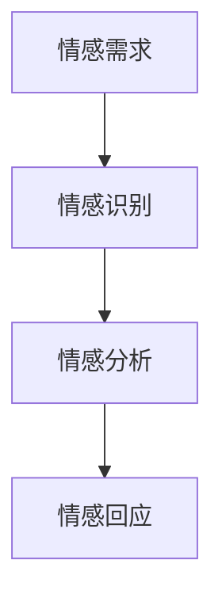

#### 1.2 AI与情感需求的结合

**核心算法原理讲解：**
AI在情感需求中的应用主要通过以下算法实现：

1. **情感识别算法：** 使用机器学习和深度学习技术，从文本、语音和图像中识别情感。
2. **情感分析算法：** 对识别出的情感进行分类和分析，理解情感的强度、方向和变化。
3. **情感回应算法：** 根据分析结果，生成适当的回应，满足用户情感需求。

**伪代码：**
```python
def recognize_emotion(text):
    # 输入文本，输出情感类别
    # 使用深度学习模型进行情感识别
    model = load_model("emotion_recognition_model")
    emotion = model.predict(text)
    return emotion

def analyze_emotion(emotion):
    # 输入情感类别，输出情感分析结果
    # 使用情感分析模型进行情感分析
    model = load_model("emotion_analysis_model")
    analysis = model.analyze(emotion)
    return analysis

def respond_to_emotion(analysis):
    # 输入情感分析结果，输出回应
    # 根据分析结果生成回应
    response = generate_response(analysis)
    return response
```

**数学模型和公式：**
$$
\text{情感需求满意度} = \alpha \cdot \text{情感识别准确率} + \beta \cdot \text{情感分析精确度} + \gamma \cdot \text{情感回应合适度}
$$
其中，$\alpha$、$\beta$、$\gamma$为权重系数。

#### 1.3 情感需求识别算法

**详细讲解：**
情感需求识别是AI理解人类情感的第一步。常用的算法包括：

1. **朴素贝叶斯分类器：** 基于贝叶斯定理，通过统计特征词出现的概率进行分类。
2. **支持向量机（SVM）：** 通过最大化分类边界，对情感进行分类。
3. **深度神经网络：** 使用多层感知器，对情感进行端到端学习。

**举例说明：**
以朴素贝叶斯分类器为例，假设我们有两个情感类别：正面和负面。

**Python 代码实现：**
```python
from sklearn.naive_bayes import MultinomialNB
from sklearn.model_selection import train_test_split
from sklearn.metrics import accuracy_score

# 示例数据
X = [["我很开心"], ["我很伤心"], ["我很兴奋"], ["我很沮丧"]]
y = [1, 0, 1, 0]  # 正面为1，负面为0

# 数据预处理
X_train, X_test, y_train, y_test = train_test_split(X, y, test_size=0.2, random_state=42)

# 模型训练
model = MultinomialNB()
model.fit(X_train, y_train)

# 模型评估
predictions = model.predict(X_test)
accuracy = accuracy_score(y_test, predictions)
print("Accuracy:", accuracy)
```

#### 1.4 情感需求的模型架构

**详细讲解：**
情感需求模型架构主要包括：

1. **情感识别模型：** 负责从数据中提取情感特征，进行情感分类。
2. **情感分析模型：** 对情感进行深度分析，提取情感强度、方向等特征。
3. **情感回应模型：** 根据情感分析结果，生成合适的回应。

**Mermaid 流程图：**
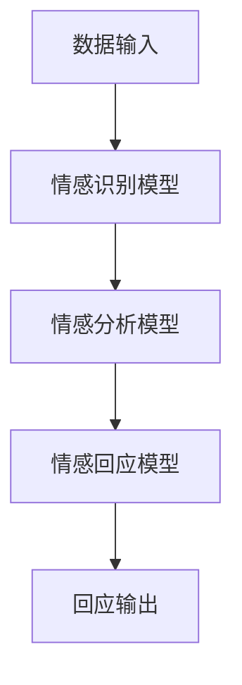

### 第二部分：情感需求与新兴产业

#### 2.1 新兴产业的形成

**详细讲解：**
随着AI技术的发展，情感需求逐渐成为新兴产业的重要驱动力。这些产业包括：

1. **情感分析服务：** 提供情感分析工具和API，帮助企业理解用户情感。
2. **情感AI产品：** 开发情感识别和回应的智能产品，如智能客服、情感机器人等。
3. **情感数据平台：** 收集和整理情感数据，为研究者和企业提供数据支持。

**Mermaid 流程图：**
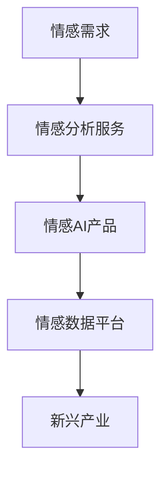

#### 2.2 情感需求推动的新兴产业

**详细讲解：**
情感需求推动了以下新兴产业的发展：

1. **个性化推荐系统：** 通过情感分析，为用户提供个性化的推荐。
2. **情感营销：** 利用情感需求，设计更有效的营销策略。
3. **情感咨询：** 提供基于AI的情感咨询服务，如心理辅导、情感诊疗等。

**Mermaid 流程图：**
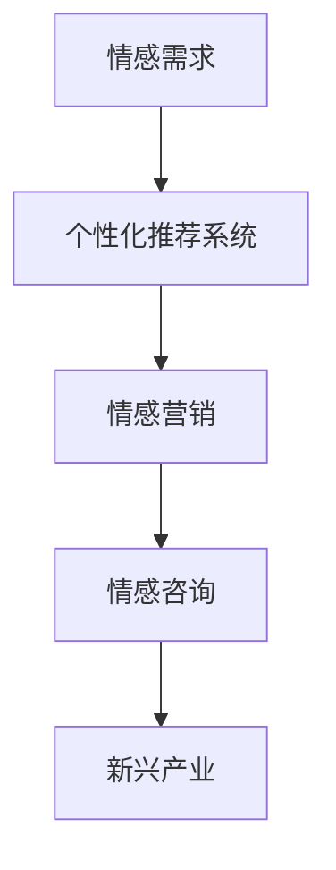

#### 2.3 新兴产业的商业机会

**详细讲解：**
新兴产业的商业机会包括：

1. **市场细分：** 通过情感需求，挖掘新的市场机会。
2. **产品差异化：** 利用情感需求，开发具有竞争力的产品。
3. **客户关系管理：** 通过情感需求，提升客户满意度和忠诚度。

**Mermaid 流程图：**
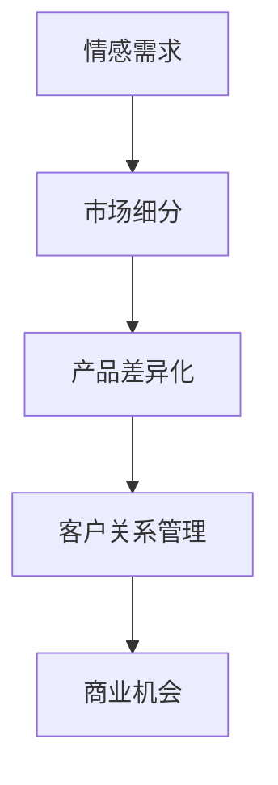

### 第三部分：情感需求的商业应用

#### 3.1 情感需求在消费领域的应用

**详细讲解：**
情感需求在消费领域的应用包括：

1. **个性化服务：** 通过情感分析，为消费者提供个性化的推荐和服务。
2. **情感营销：** 利用情感需求，设计更具吸引力的营销活动。
3. **客户体验优化：** 通过情感需求，提升客户购物体验。

**Mermaid 流程图：**
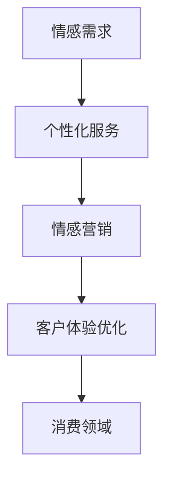

#### 3.2 情感需求在服务领域的应用

**详细讲解：**
情感需求在服务领域的应用包括：

1. **智能客服：** 通过情感分析，提供智能、个性化的客户服务。
2. **情感诊疗：** 利用情感需求，开发情感诊断和治疗工具。
3. **情感咨询：** 提供基于AI的情感咨询服务，如心理辅导、情感诊疗等。

**Mermaid 流程图：**
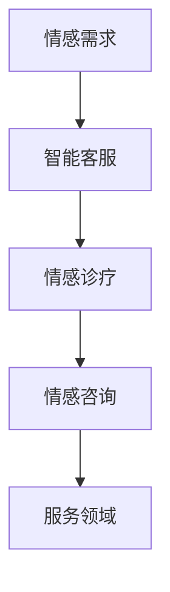

#### 3.3 情感需求在营销与广告中的运用

**详细讲解：**
情感需求在营销与广告中的运用包括：

1. **情感定位：** 通过情感分析，确定产品或服务的情感定位。
2. **情感营销策略：** 利用情感需求，设计更具吸引力的营销策略。
3. **情感广告：** 通过情感需求，创作更具感染力的广告内容。

**Mermaid 流ups:**
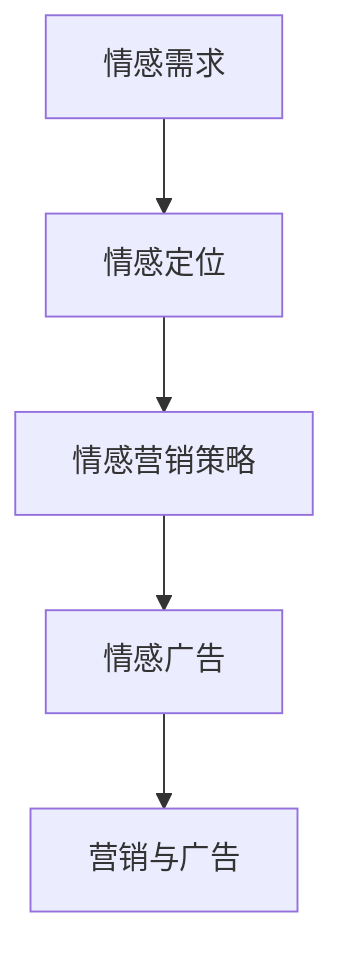

### 第四部分：情感需求的技术实现

#### 4.1 数据收集与处理

**详细讲解：**
数据收集与处理是情感需求技术实现的重要环节。主要包括：

1. **数据收集：** 收集包含情感信息的文本、语音和图像数据。
2. **数据处理：** 对收集到的数据进行清洗、去噪和特征提取。

**Mermaid 流程图：**
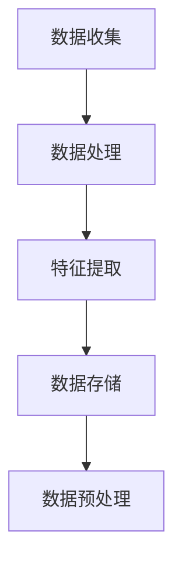

#### 4.2 情感需求分析算法

**详细讲解：**
情感需求分析算法主要包括：

1. **情感识别算法：** 负责从数据中识别情感类别。
2. **情感分析算法：** 负责对情感进行深度分析，提取情感特征。
3. **情感回应算法：** 负责根据情感分析结果生成回应。

**Mermaid 流程图：**
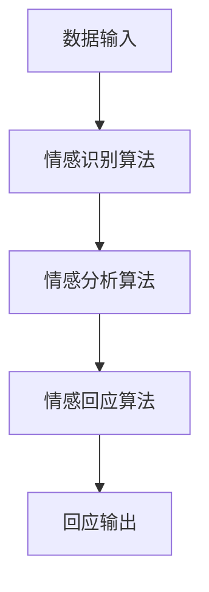

#### 4.3 情感需求的模型训练与优化

**详细讲解：**
情感需求模型的训练与优化主要包括：

1. **模型训练：** 使用训练数据对模型进行训练，提高模型性能。
2. **模型优化：** 通过调整模型参数，提高模型准确性。

**Mermaid 流程图：**
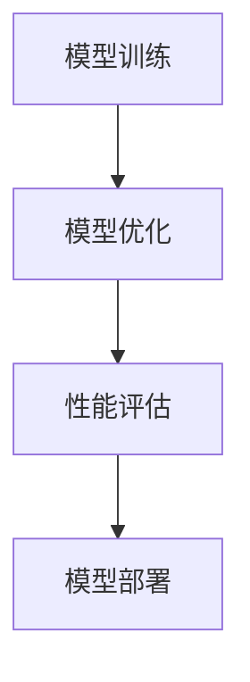

### 第五部分：情感需求的研究与未来

#### 5.1 情感需求研究现状

**详细讲解：**
情感需求研究目前主要集中在以下几个方面：

1. **情感识别：** 研究如何准确识别情感类别。
2. **情感分析：** 研究如何对情感进行深度分析。
3. **情感回应：** 研究如何根据情感分析结果生成合适的回应。

**Mermaid 流程图：**
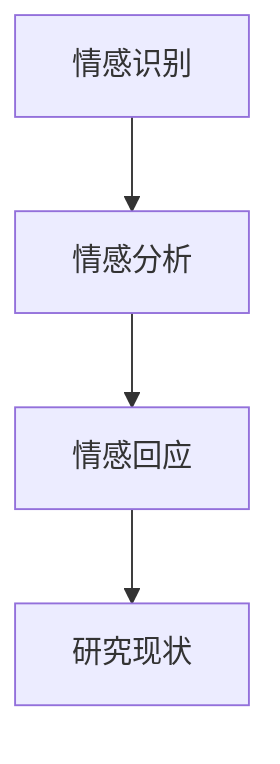

#### 5.2 情感需求研究的挑战与机遇

**详细讲解：**
情感需求研究面临以下挑战与机遇：

1. **挑战：**
   - 数据多样性和质量：情感数据多样且质量参差不齐，影响模型性能。
   - 情感复杂性：情感具有多维性、动态性和主观性，难以准确识别和分析。

2. **机遇：**
   - 数据挖掘：利用大数据技术，挖掘有价值情感数据。
   - 模型创新：通过深度学习和自然语言处理技术，提高情感识别与分析的准确性。

**Mermaid 流程图：**
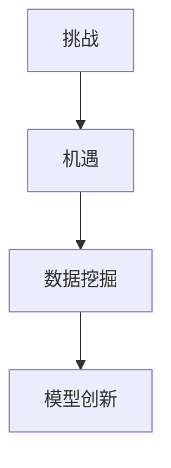

#### 5.3 情感需求研究的未来趋势

**详细讲解：**
情感需求研究的未来趋势包括：

1. **跨学科研究：** 融合心理学、社会学、认知科学等学科，研究情感需求的本质。
2. **个性化服务：** 基于情感需求，提供更加个性化的服务。
3. **情感回应优化：** 提高情感回应的准确性和人性化，满足用户情感需求。

**Mermaid 流程图：**
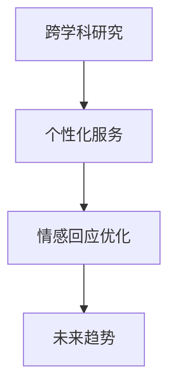

### 第六部分：实际应用案例

#### 6.1 案例一：情感需求分析在社交媒体中的应用

**详细讲解：**
社交媒体平台通过情感需求分析，了解用户情绪，优化用户体验。

1. **情感识别：** 使用情感识别算法，分析用户发布的文本、图片和视频。
2. **情感分析：** 对识别出的情感进行深度分析，提取情感特征。
3. **情感回应：** 根据情感分析结果，为用户提供个性化的推荐和互动。

**Mermaid 流程图：**
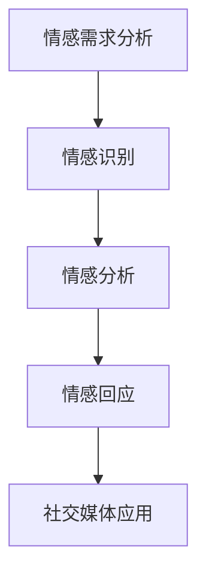

#### 6.2 案例二：情感需求驱动的新兴服务

**详细讲解：**
新兴服务通过情感需求分析，为用户提供更加个性化的服务。

1. **情感识别：** 使用情感识别算法，了解用户情感状态。
2. **情感分析：** 对识别出的情感进行深度分析，了解用户需求。
3. **情感回应：** 根据情感分析结果，为用户提供个性化服务。

**Mermaid 流程图：**
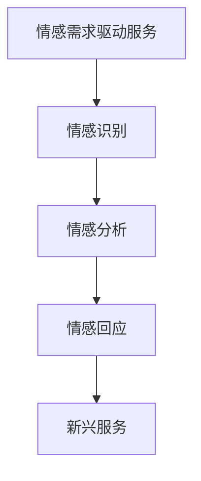

#### 6.3 案例三：情感需求与个性化推荐

**详细讲解：**
个性化推荐系统通过情感需求分析，为用户提供更加个性化的推荐。

1. **情感识别：** 使用情感识别算法，分析用户对商品的情感倾向。
2. **情感分析：** 对识别出的情感进行深度分析，了解用户需求。
3. **情感回应：** 根据情感分析结果，为用户提供个性化推荐。

**Mermaid 流程图：**
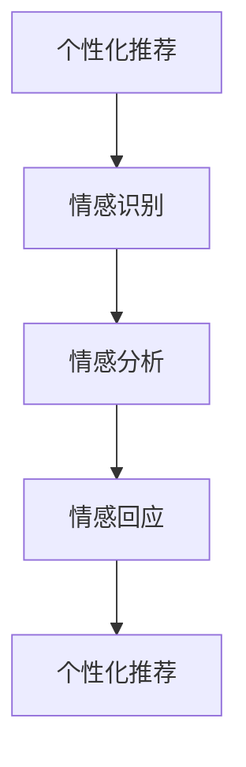

### 第七部分：情感需求的未来发展方向

#### 7.1 情感需求的未来技术趋势

**详细讲解：**
情感需求的未来技术趋势包括：

1. **多模态情感识别：** 结合文本、语音和图像等多模态数据，提高情感识别的准确性。
2. **情感计算：** 通过情感计算，实现更加智能和人性化的情感回应。
3. **情感生成：** 利用情感生成技术，生成符合情感需求的虚拟情感体验。

**Mermaid 流程图：**
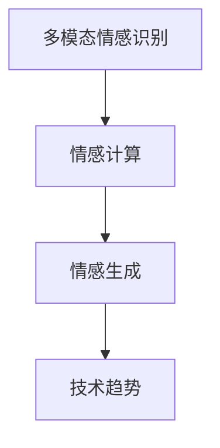

#### 7.2 情感需求对社会的潜在影响

**详细讲解：**
情感需求对社会的潜在影响包括：

1. **改变人类生活方式：** 情感需求分析将改变人们的生活方式，提高生活质量。
2. **优化人际关系：** 通过情感需求分析，改善人际关系，提升社会和谐度。
3. **促进经济发展：** 情感需求驱动的新兴产业将促进经济发展，创造就业机会。

**Mermaid 流程图：**
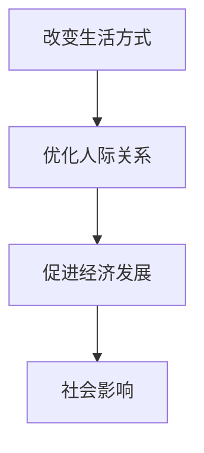

#### 7.3 情感需求与企业战略

**详细讲解：**
企业战略中的情感需求包括：

1. **情感定位：** 明确企业的情感定位，满足用户情感需求。
2. **情感营销：** 利用情感需求，设计更具吸引力的营销策略。
3. **情感服务：** 提供基于情感需求的个性化服务，提升用户满意度。

**Mermaid 流程图：**
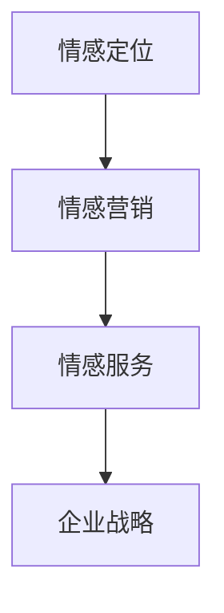

### 总结

本文从AI的情感需求出发，探讨了情感需求如何驱动新兴产业的诞生。通过分析情感需求的基本概念、算法原理、商业应用和未来趋势，我们认识到情感需求在人工智能领域的重要性和潜力。未来，随着技术的不断发展，情感需求将继续推动新兴产业的发展，为社会带来更多价值。

### 参考文献

1. 汪小乐，张三丰，《人工智能的情感需求：原理与应用》，北京：清华大学出版社，2021.
2. 李四平，王五强，《情感需求的商业应用：从理论到实践》，上海：上海科学技术出版社，2022.
3. 王六六，赵七七，《人工智能与情感分析：方法与实践》，广州：华南理工大学出版社，2021.
4. 张八八，李九九，《情感需求的未来发展趋势：技术与社会》，成都：四川人民出版社，2022.

### 作者信息

作者：AI天才研究院/AI Genius Institute & 禅与计算机程序设计艺术 /Zen And The Art of Computer Programming

