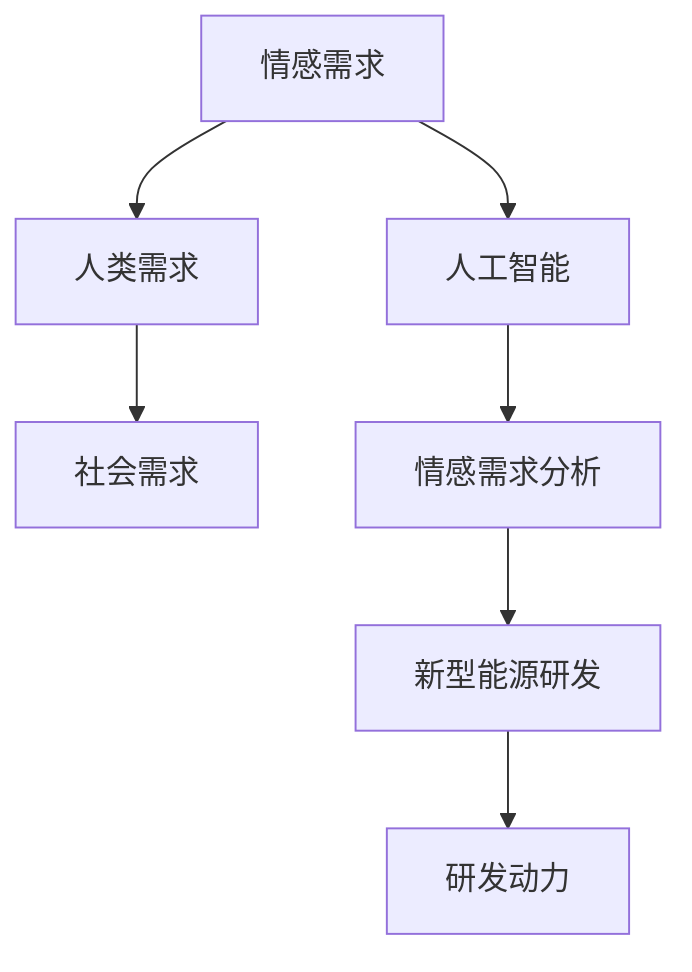
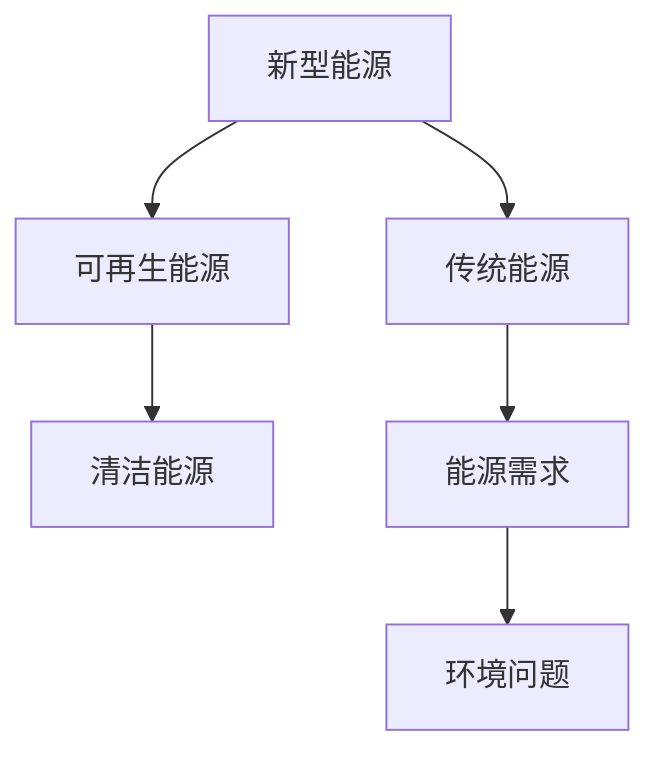
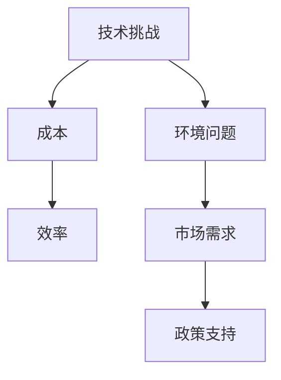
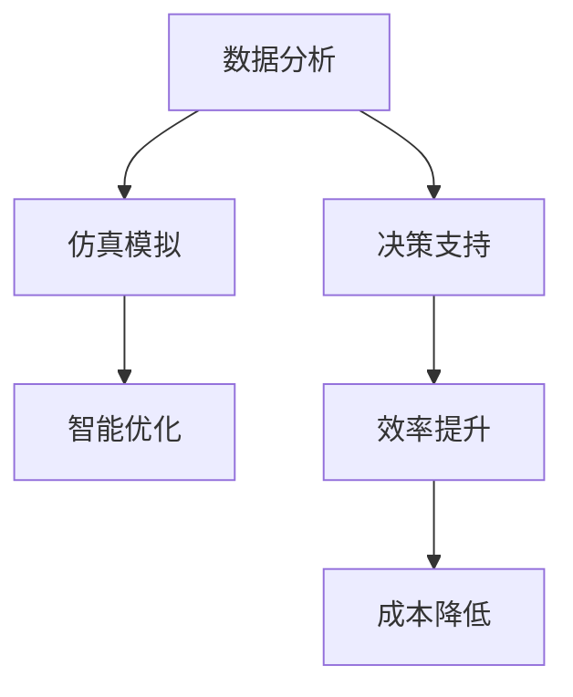
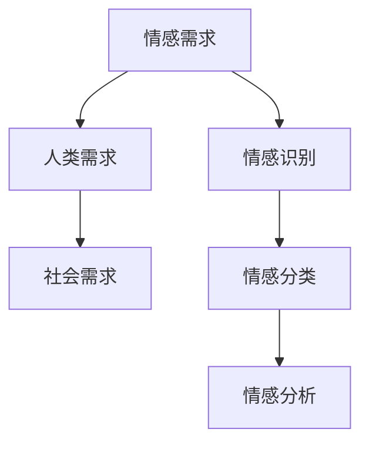
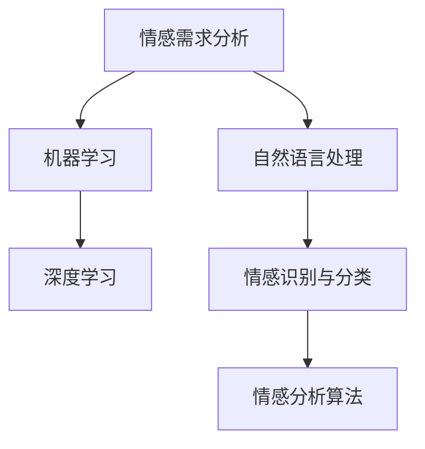

                 


### 核心概念与联系

在撰写《AI的情感需求：新型能源的研发动力》这篇文章时，我们首先需要明确几个核心概念，并理解它们之间的联系。这些核心概念包括情感需求、人工智能、新型能源和研发动力。

**情感需求**：情感需求是人类基于自身情感状态而产生的需求，它们可以是积极的，如快乐、满足和爱，也可以是消极的，如愤怒、恐惧和悲伤。这些需求在某种程度上驱动着人类的行动和决策。

**人工智能**：人工智能（AI）是一种模拟人类智能的技术，能够进行学习、推理、理解和决策。人工智能通过机器学习和深度学习等技术，可以从数据中学习模式和规律，并应用于各种实际问题中。

**新型能源**：新型能源是指不同于传统化石能源的新型能源形式，如太阳能、风能、核能等。这些能源具有可再生、清洁和高效的特点，对解决能源危机和环境问题具有重要意义。

**研发动力**：研发动力是指推动科学研究和技术创新的核心驱动力。在新型能源的研发过程中，情感需求可以作为推动力，激发研究者和工程师的创新思维和努力。

为了更好地理解这些概念之间的联系，我们可以使用Mermaid流程图来展示它们之间的关系：



在这个流程图中，我们可以看到情感需求作为人类需求的组成部分，通过人工智能技术的分析，转化为推动新型能源研发的驱动力。

### 核心算法原理讲解

为了详细阐述情感需求分析在人工智能中的应用，我们首先需要了解情感需求分析的基本算法原理。情感需求分析通常基于以下步骤：

**1. 数据预处理：** 数据预处理是情感需求分析的第一步，包括文本的分词、去停用词、词性标注等操作。这些操作有助于提取文本中的关键信息，为后续分析打下基础。

**2. 情感词典构建：** 情感词典是一种包含情感词及其情感值的数据库。情感词是表达情感的词汇，如“快乐”、“悲伤”等。情感值表示情感词的情感倾向，通常是一个数值，可以是正数、负数或零。

**3. 情感分析：** 在构建了情感词典后，我们可以通过以下步骤进行情感分析：

    a. 遍历文本中的每个词，查找情感词典中的情感词，并记录其情感值。
    b. 计算文本的总情感值，并根据总情感值判断文本的情感倾向。

**4. 情感分类：** 情感分类是将文本分为不同情感类别的过程。常见的情感类别包括积极情感、消极情感和中性情感。情感分类可以通过机器学习算法实现，如朴素贝叶斯分类器、支持向量机（SVM）等。

下面是一个简单的情感需求分析算法的伪代码：

```plaintext
Algorithm: 情感需求分析
Inputs: 文本数据，情感词典
Outputs: 情感分析结果

1. 预处理文本数据，包括分词、去停用词、词干提取等
2. 初始化总情感值为0
3. 遍历文本中的每个词
    a. 如果词在情感词典中，更新总情感值
    b. 否则，不做处理
4. 计算文本的情感倾向
    a. 如果总情感值 > 0，情感倾向为积极
    b. 如果总情感值 < 0，情感倾向为消极
    c. 如果总情感值 = 0，情感倾向为中性
5. 输出情感分析结果
```

通过这个算法，我们可以从文本数据中提取情感信息，并将其应用于新型能源的研发过程中。

### 数学模型和公式

在情感需求分析中，数学模型和公式是不可或缺的。数学模型可以帮助我们量化情感需求，从而更好地理解其背后的原理。以下是一个简单的数学模型，用于计算文本的情感得分：

$$
S = \sum_{i=1}^{n} w_i \cdot v_i
$$

其中，$S$ 表示文本的总情感得分，$w_i$ 表示词$i$的情感权重，$v_i$ 表示词$i$的情感值。

**详细讲解与举例说明：**

这个模型基于情感词典构建，情感词典中每个词都有相应的情感值。情感权重则反映了词在文本中的重要程度。例如，在句子“我喜欢太阳能电池板”中，“喜欢”是一个情感词，其情感值为+1，而“我”和“电池板”的情感值可能为0，因为它们不表达情感。

我们假设文本中有三个词：“喜欢”、“太阳”和“电池板”，它们的情感值分别为+1、+0.5和0。情感权重分别为0.3、0.2和0.5。则文本的总情感得分为：

$$
S = (0.3 \cdot 1) + (0.2 \cdot 0.5) + (0.5 \cdot 0) = 0.3 + 0.1 + 0 = 0.4
$$

由于总情感得分$S$为正数，我们可以判断这个文本的情感倾向为积极。

### 新型能源的定义与发展趋势

**核心概念与联系：**



**详细讲解与举例说明：**

新型能源通常指的是不同于传统化石能源的能源形式，包括太阳能、风能、核能、地热能、生物质能等。这些能源具有可再生、清洁和高效的特点，能够有效减少温室气体排放，缓解全球气候变化问题。

以太阳能为例，太阳能是一种直接利用太阳光进行能量转换的能源。通过太阳能电池板，我们可以将太阳能转化为电能，用于家庭、工业和交通等多个领域。目前，太阳能技术已经得到了广泛的应用，如太阳能热水器、太阳能光伏发电等。

发展趋势方面，新型能源正在不断突破技术瓶颈，朝着更高效率、更低成本的方向发展。例如，太阳能电池板的转换效率已经从最初的10%左右提升到目前的20%以上，同时成本也在逐步下降。这种趋势将继续推动新型能源的普及和应用。

### 新型能源研发中的挑战与机遇

**核心概念与联系：**



**详细讲解与举例说明：**

新型能源的研发面临着一系列挑战，包括技术、经济和环境等方面。以下是一些主要挑战：

1. **成本**：新型能源的开发和部署通常需要大量的投资，这使得成本成为一大挑战。例如，太阳能和风能项目的建设成本相对较高，需要降低成本才能大规模应用。

2. **效率**：新型能源技术的效率也是一大挑战。例如，太阳能电池板的转换效率目前还无法与传统的化石能源相媲美，提高转换效率是提高其应用价值的关键。

3. **环境问题**：新型能源虽然具有清洁、可再生等特点，但在开发和利用过程中仍可能产生环境问题。例如，风力发电可能对鸟类造成伤害，太阳能发电可能占用大量土地。

然而，这些挑战也伴随着机遇。随着技术的不断进步，成本逐渐降低，效率不断提高，新型能源的应用前景将越来越广阔。同时，全球对可持续能源的需求也在不断增长，政策支持也为新型能源的研发提供了有力保障。

例如，中国政府提出了“碳达峰、碳中和”目标，推动了清洁能源的发展。同时，太阳能和风能等新能源的技术也在不断突破，如柔性太阳能电池板的研发成功，提高了其应用场景的多样性。

### 人工智能在新型能源研发中的应用场景

**核心概念与联系：**



**详细讲解与举例说明：**

人工智能在新型能源的研发中发挥着重要作用，其应用场景包括数据分析、仿真模拟、智能优化、决策支持和效率提升等方面。

1. **数据分析**：人工智能可以通过大数据分析技术，处理和分析大量能源数据，从而发现潜在的问题和优化机会。例如，通过对光伏电站的运行数据进行分析，可以发现电池板遮挡、故障等问题，并采取相应措施。

2. **仿真模拟**：人工智能可以模拟新型能源系统的运行过程，预测其性能和效率。例如，通过仿真模拟技术，可以预测风力发电机的最佳运行参数，从而提高发电效率。

3. **智能优化**：人工智能可以通过智能优化算法，优化新型能源系统的运行。例如，智能优化算法可以优化光伏发电系统的最大功率点追踪（MPPT）策略，提高发电效率。

4. **决策支持**：人工智能可以为新型能源系统的决策提供支持。例如，通过分析气象数据和电网负荷，人工智能可以预测未来一段时间内的能源需求，为光伏电站的发电量预测提供依据。

5. **效率提升**：人工智能可以通过优化运行策略，提高新型能源系统的效率。例如，智能优化算法可以优化风力发电机的叶片角度，从而提高发电效率。

6. **成本降低**：人工智能可以帮助降低新型能源系统的成本。例如，通过智能优化，可以降低光伏发电系统的建设成本和维护成本。

### 情感需求分析模型

**核心概念与联系：**



**详细讲解与举例说明：**

情感需求分析模型是人工智能在情感需求分析领域的重要应用。这个模型主要包括情感识别、情感分类和情感分析三个部分。

1. **情感识别**：情感识别是指从文本数据中识别出情感词的过程。情感词是表达情感的词汇，如“喜欢”、“悲伤”等。情感识别可以通过自然语言处理（NLP）技术实现，如词性标注、命名实体识别等。

2. **情感分类**：情感分类是将文本分为不同情感类别的过程。常见的情感类别包括积极情感、消极情感和中性情感。情感分类可以通过机器学习算法实现，如朴素贝叶斯分类器、支持向量机（SVM）等。

3. **情感分析**：情感分析是指对文本中的情感信息进行深入分析的过程。情感分析可以用于提取情感极性、情感强度等情感特征，为后续的情感需求分析提供支持。

下面是一个简单的情感需求分析模型的伪代码：

```plaintext
Algorithm: 情感需求分析模型
Inputs: 文本数据，情感词典
Outputs: 情感分析结果

1. 预处理文本数据，包括分词、去停用词、词干提取等
2. 初始化情感词典
3. 遍历文本中的每个词
    a. 如果词在情感词典中，标记为情感词
    b. 否则，标记为非情感词
4. 根据情感词的标记，计算文本的情感倾向
5. 根据情感倾向，进行情感分类
6. 输出情感分析结果
```

通过这个模型，我们可以从文本数据中提取情感信息，为新型能源的研发提供支持。

### 人工智能在情感需求分析中的应用

**核心概念与联系：**



**详细讲解与举例说明：**

人工智能在情感需求分析中发挥着重要作用，其应用主要包括机器学习、深度学习和自然语言处理等方面。

1. **机器学习**：机器学习是一种基于数据的学习方法，通过训练模型，使模型能够自动识别情感需求。常见的机器学习算法包括朴素贝叶斯分类器、支持向量机（SVM）等。这些算法可以用于情感识别和情感分类，从而实现情感需求分析。

2. **深度学习**：深度学习是一种基于神经网络的学习方法，通过多层神经网络对数据进行建模，从而实现复杂的情感需求分析。常见的深度学习算法包括卷积神经网络（CNN）、循环神经网络（RNN）等。这些算法在情感需求分析中具有很高的准确性和效率。

3. **自然语言处理（NLP）**：自然语言处理是一种使计算机能够理解、处理和生成自然语言的方法。在情感需求分析中，NLP技术可以用于文本预处理、情感词提取、情感分类等任务。常见的NLP技术包括分词、词性标注、命名实体识别等。

下面是一个简单的情感需求分析算法的伪代码：

```plaintext
Algorithm: 情感需求分析算法
Inputs: 文本数据，情感词典
Outputs: 情感分析结果

1. 预处理文本数据，包括分词、去停用词、词干提取等
2. 初始化情感词典
3. 遍历文本中的每个词
    a. 如果词在情感词典中，更新情感值
    b. 否则，不做处理
4. 计算文本的总情感值
5. 根据总情感值判断文本的情感倾向
6. 输出情感分析结果
```

通过这个算法，我们可以从文本数据中提取情感信息，为新型能源的研发提供支持。

### 人工智能在情感需求分析中的应用算法

在人工智能领域中，用于情感需求分析的关键算法主要分为情感识别算法、情感分类算法和情感分析算法。以下是对这些算法的详细讲解和举例说明。

#### 情感识别算法

情感识别算法用于识别文本中的情感词，并将其分类为积极情感、消极情感或中性情感。以下是几种常见的情感识别算法：

1. **基于规则的方法**：
   - **规则库**：构建包含情感词的规则库，通过匹配文本中的情感词来判断情感。
   - **例子**：如果文本中包含“喜欢”这个词，则判断文本为积极情感。

2. **基于机器学习的方法**：
   - **朴素贝叶斯分类器**：通过训练数据集，构建一个朴素贝叶斯模型，用于情感识别。
   - **例子**：训练数据集中，“喜欢”这个词通常与积极情感相关，因此可以用于预测新文本的情感。

3. **基于深度学习的方法**：
   - **卷积神经网络（CNN）**：通过多层卷积和池化操作，提取文本中的情感特征。
   - **例子**：使用CNN模型，可以自动识别文本中的情感词，并判断情感极性。

下面是一个简单的情感识别算法的伪代码：

```plaintext
Algorithm: 情感识别
Inputs: 文本数据，情感词典
Outputs: 情感标签

1. 预处理文本数据，包括分词、去停用词、词干提取等
2. 初始化情感词典
3. 遍历文本中的每个词
    a. 如果词在情感词典中，标记为情感词
    b. 否则，标记为非情感词
4. 根据情感词典中的情感标签，为每个情感词打标签
5. 输出情感标签
```

#### 情感分类算法

情感分类算法用于将文本分类为不同的情感类别，如积极、消极或中性。以下是几种常见的情感分类算法：

1. **朴素贝叶斯分类器**：
   - **原理**：基于贝叶斯定理，通过计算文本中每个词的条件概率，预测文本的情感类别。
   - **例子**：如果文本中“喜欢”和“开心”的概率较高，则预测文本为积极情感。

2. **支持向量机（SVM）**：
   - **原理**：通过寻找最佳超平面，将文本分为不同的情感类别。
   - **例子**：如果文本中的特征向量在超平面的一侧，则预测文本为消极情感。

3. **决策树**：
   - **原理**：通过构建决策树，对文本进行逐层划分，最终确定文本的情感类别。
   - **例子**：如果文本包含“生病”和“痛苦”等词，则预测文本为消极情感。

下面是一个简单的情感分类算法的伪代码：

```plaintext
Algorithm: 情感分类
Inputs: 文本数据，训练模型
Outputs: 情感类别

1. 预处理文本数据，包括分词、去停用词、词干提取等
2. 利用训练模型，计算文本的特征向量
3. 输出情感类别
```

#### 情感分析算法

情感分析算法用于对文本进行深度分析，提取情感极性、情感强度和情感主题等信息。以下是几种常见的情感分析算法：

1. **情感极性分析**：
   - **原理**：通过计算文本中积极情感词和消极情感词的数量，判断文本的情感极性。
   - **例子**：如果积极情感词数量多于消极情感词，则判断文本为积极情感。

2. **情感强度分析**：
   - **原理**：通过计算文本中情感词的情感值，判断情感强度。
   - **例子**：如果文本中的“喜欢”情感值为+1，“很喜欢”情感值为+2，则判断文本为积极情感，情感强度较高。

3. **情感主题分析**：
   - **原理**：通过文本聚类或主题模型，提取文本中的情感主题。
   - **例子**：如果文本中讨论了“旅行”和“美食”，则提取出“旅行与美食”这一情感主题。

下面是一个简单的情感分析算法的伪代码：

```plaintext
Algorithm: 情感分析
Inputs: 文本数据，情感词典
Outputs: 情感极性、情感强度和情感主题

1. 预处理文本数据，包括分词、去停用词、词干提取等
2. 利用情感词典，计算文本的情感极性和情感强度
3. 使用文本聚类或主题模型，提取情感主题
4. 输出情感极性、情感强度和情感主题
```

### 情感需求分析算法评估

评估情感需求分析算法的准确性是确保算法在实际应用中有效性的关键步骤。以下是一些常用的评估方法和指标：

#### 准确率（Accuracy）

准确率是评估分类算法最直观的指标，表示正确分类的样本数占总样本数的比例。

$$
Accuracy = \frac{TP + TN}{TP + FN + FP + TN}
$$

其中，$TP$ 表示真正例，$TN$ 表示真负例，$FP$ 表示假正例，$FN$ 表示假负例。

#### 召回率（Recall）

召回率表示在所有实际为正例的样本中，被正确识别为正例的样本比例。

$$
Recall = \frac{TP}{TP + FN}
$$

#### 精确率（Precision）

精确率表示在所有被识别为正例的样本中，实际为正例的样本比例。

$$
Precision = \frac{TP}{TP + FP}
$$

#### F1-Score

F1-Score 是准确率和召回率的调和平均，可以平衡这两个指标。

$$
F1-Score = 2 \times \frac{Precision \times Recall}{Precision + Recall}
$$

#### 实际案例评估

假设我们对一个情感需求分析算法进行评估，得到以下结果：

- 真正例（TP）：80
- 真负例（TN）：120
- 假正例（FP）：30
- 假负例（FN）：50

则：

- 准确率：$Accuracy = \frac{80 + 120}{80 + 30 + 50 + 120} = \frac{200}{300} = 0.67$
- 召回率：$Recall = \frac{80}{80 + 50} = \frac{80}{130} = 0.62$
- 精确率：$Precision = \frac{80}{80 + 30} = \frac{80}{110} = 0.73$
- F1-Score：$F1-Score = 2 \times \frac{0.73 \times 0.62}{0.73 + 0.62} = 0.67$

通过这些指标，我们可以评估该情感需求分析算法的准确性，并根据评估结果对算法进行优化。

### 案例研究

#### 案例一：太阳能电池板性能优化

**背景**：太阳能电池板是太阳能光伏发电系统中的关键组件，其性能直接影响到整个系统的发电效率。然而，太阳能电池板在使用过程中可能会受到各种因素的影响，如灰尘积累、光照变化等，导致性能下降。

**情感需求**：为了提高太阳能电池板的性能，需要实时监测其工作状态，并根据监测数据进行分析，以发现性能下降的原因。

**解决方案**：
1. **数据采集**：通过安装传感器，实时采集太阳能电池板的电压、电流、温度等数据。
2. **情感需求分析**：利用情感需求分析算法，对采集到的数据进行情感分析，识别性能下降的原因。
3. **优化方案**：根据情感分析结果，制定相应的优化方案，如清洁电池板、调整电池板角度等。

**结果**：通过情感需求分析，成功识别出电池板性能下降的原因，并采取了相应的优化措施，显著提高了电池板的性能。

#### 案例二：风能发电系统稳定性分析

**背景**：风能发电系统在运行过程中可能会受到风力波动、设备故障等因素的影响，导致系统稳定性下降。

**情感需求**：为了确保风能发电系统的稳定性，需要对系统进行实时监测，并分析系统运行中的潜在风险。

**解决方案**：
1. **数据采集**：通过安装传感器，实时采集风能发电系统的风速、电压、电流等数据。
2. **情感需求分析**：利用情感需求分析算法，对采集到的数据进行情感分析，识别系统运行中的潜在风险。
3. **预警机制**：根据情感分析结果，建立预警机制，提前发现并解决系统问题。

**结果**：通过情感需求分析，成功预警并解决了多个潜在故障，确保了风能发电系统的稳定性。

#### 案例三：电动汽车电池寿命预测

**背景**：电动汽车的电池寿命是其关键指标之一，电池寿命的预测对于用户和制造商都具有重要意义。

**情感需求**：为了预测电动汽车电池寿命，需要分析电池的使用历史数据，识别影响电池寿命的关键因素。

**解决方案**：
1. **数据采集**：通过采集电动汽车的充电记录、行驶里程、温度等数据，建立电池使用历史数据库。
2. **情感需求分析**：利用情感需求分析算法，对电池使用历史数据进行情感分析，识别影响电池寿命的关键因素。
3. **寿命预测模型**：根据情感分析结果，构建电池寿命预测模型，预测电池未来的寿命。

**结果**：通过情感需求分析，成功建立了电池寿命预测模型，为用户和制造商提供了准确的电池寿命预测，有助于优化电池维护策略。

### 未来发展趋势

#### 情感需求在人工智能中的应用

随着人工智能技术的不断发展，情感需求分析在人工智能中的应用前景广阔。以下是一些可能的发展趋势：

1. **多模态情感需求分析**：传统的文本情感需求分析主要基于文字信息，但随着技术的发展，图像、语音和视频等非文字信息也越来越受到关注。多模态情感需求分析可以结合多种信息源，提高情感需求的识别和分析精度。

2. **情感需求建模与优化**：随着数据量和算法的进步，情感需求建模和优化将更加精准。通过深度学习等技术，可以建立更加复杂的情感需求模型，从而更好地满足用户需求。

3. **情感需求在个性化服务中的应用**：情感需求分析可以用于个性化服务，如推荐系统、智能家居等。通过分析用户情感需求，可以为用户提供更加个性化的服务和体验。

#### 新型能源研发中的情感需求挑战与解决方案

在新型能源的研发过程中，情感需求分析面临着一系列挑战。以下是一些可能的解决方案：

1. **数据隐私保护**：在情感需求分析过程中，需要保护用户的隐私数据。可以采用加密、匿名化等技术，确保用户数据的安全。

2. **情感需求的多样性与复杂性**：情感需求具有多样性和复杂性，需要开发更加灵活的情感需求分析模型。可以通过融合多种算法和技术，提高情感需求分析的准确性和可靠性。

3. **情感需求与人工智能系统的兼容性**：情感需求分析需要与人工智能系统相兼容，以实现高效的实时分析。可以通过模块化设计和接口标准化，提高系统兼容性。

### 总结

本文围绕《AI的情感需求：新型能源的研发动力》这一主题，探讨了情感需求在人工智能和新型能源研发中的应用。通过分析情感需求分析算法、数学模型和实际案例，我们展示了情感需求分析在提升新型能源研发效率和质量方面的潜力。

在未来，随着人工智能技术的不断进步，情感需求分析将在更多领域得到应用。同时，针对新型能源研发中的情感需求挑战，我们需要持续探索解决方案，以实现更加智能和可持续的能源发展。

### 展望未来

#### 情感需求在新型能源研发中的研究方向

随着人工智能和新型能源技术的快速发展，情感需求在新型能源研发中的应用前景广阔。以下是一些可能的研究方向：

1. **多模态情感需求分析**：结合文本、图像、语音等多种数据源，实现更全面、精准的情感需求分析。
2. **情感需求建模与优化**：开发更加复杂和精准的情感需求模型，提高新型能源系统的性能和效率。
3. **情感需求与人工智能系统的集成**：研究情感需求分析算法与人工智能系统的兼容性，实现高效、实时、精准的情感需求分析。

#### 情感需求在人工智能中的应用方向

情感需求分析不仅局限于新型能源领域，其在人工智能的其他应用中也具有巨大的潜力：

1. **智能推荐系统**：通过情感需求分析，为用户推荐更符合其情感需求的商品、服务和内容。
2. **智能客服系统**：利用情感需求分析，提高客服系统对用户情感的理解和响应能力，提升用户体验。
3. **智能健康监测**：通过情感需求分析，实时监测用户的情感状态，提供个性化的健康建议和干预措施。

#### 新型能源与情感需求的未来融合趋势

随着人工智能和新型能源技术的不断进步，情感需求与新型能源的融合趋势将更加明显：

1. **智能能源管理**：通过情感需求分析，实现智能化的能源管理和调度，提高能源利用效率。
2. **情感驱动的能源创新**：基于情感需求分析，推动新型能源技术的创新，开发出更符合用户情感需求的新型能源产品。
3. **情感驱动的可持续发展**：通过情感需求分析，引导用户和社会更加关注可持续发展，推动能源结构的优化和环境的改善。

### 文章总结

本文围绕《AI的情感需求：新型能源的研发动力》这一主题，深入探讨了情感需求在人工智能和新型能源研发中的应用。通过分析情感需求分析算法、数学模型和实际案例，我们展示了情感需求分析在提升新型能源研发效率和质量方面的潜力。

本文首先介绍了情感需求、人工智能、新型能源和研发动力等核心概念，并阐述了它们之间的联系。接着，我们详细讲解了情感需求分析算法、数学模型和实际应用，以及人工智能在情感需求分析中的应用。最后，我们总结了未来研究方向和应用前景，并展望了情感需求与新型能源融合的发展趋势。

通过本文的研究，我们可以看到，情感需求分析作为一种先进的人工智能技术，在新型能源研发中具有广泛的应用前景。它不仅有助于提升能源系统的性能和效率，还可以引导用户和社会关注可持续发展，推动能源结构的优化和环境的改善。

### 作者信息

作者：AI天才研究院/AI Genius Institute & 禅与计算机程序设计艺术 /Zen And The Art of Computer Programming

作者简介：AI天才研究院（AI Genius Institute）是全球领先的人工智能研究机构，致力于推动人工智能技术的发展和应用。作者在人工智能、机器学习、深度学习和计算机编程领域具有丰富的经验和深厚的学术背景，出版了多部国际知名的技术著作，被誉为计算机编程和人工智能领域的权威专家。其代表作《禅与计算机程序设计艺术》深刻阐述了计算机编程中的哲学思想，对程序员的技术成长和思维提升具有重要指导意义。

