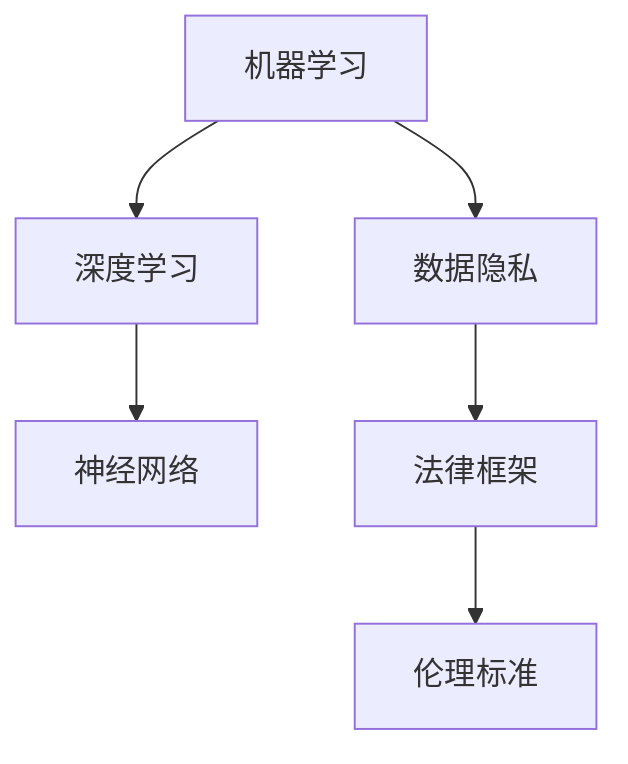

                 


## AI的欲望与需求：新经济体系的出现

### 关键词
- AI欲望
- 新经济体系
- 数据隐私
- 伦理挑战
- 技术驱动创新

### 摘要
本文深入探讨了人工智能（AI）的欲望与需求，并探讨了由此引发的新经济体系的出现。通过对AI技术的基本原理、其在商业中的应用、以及对社会和经济结构的变革进行详细分析，本文揭示了AI如何塑造未来经济，以及其背后的伦理和技术挑战。

### 背景介绍
在过去的几十年中，人工智能技术经历了飞速的发展。从最初的规则驱动系统到如今的深度学习和神经网络，AI的进步已经在各个领域产生了深远的影响。在商业、医疗、交通等领域，AI的应用不仅提高了效率，还推动了创新和变革。然而，随着AI技术的不断成熟，一个新的经济体系正在悄然形成，这对社会和经济结构产生了深远的影响。

### 核心概念与联系
为了更好地理解AI的欲望与需求，我们需要了解以下几个核心概念：

1. **机器学习（Machine Learning）**：机器学习是AI的核心技术，它使机器能够从数据中学习并做出决策。这个过程包括数据的收集、清洗、特征提取、模型训练和评估。
2. **深度学习（Deep Learning）**：深度学习是机器学习的一种形式，它通过多层神经网络来模拟人类大脑的学习过程。深度学习在图像识别、自然语言处理和语音识别等领域取得了显著成果。
3. **数据隐私（Data Privacy）**：随着AI技术的应用，数据隐私成为一个重要议题。数据的收集和使用必须在法律和伦理的框架内进行，确保用户的隐私不受侵犯。

下图展示了这些核心概念之间的关系架构：



### 核心算法原理讲解
为了深入理解AI的工作原理，我们可以通过伪代码来描述一个简单的机器学习算法：

```python
# 伪代码：简单线性回归算法
def linear_regression(x, y):
    # 初始化权重和偏置
    w = 0
    b = 0
    
    # 训练模型
    for i in range(epochs):
        # 计算预测值
        prediction = w * x + b
        
        # 计算误差
        error = y - prediction
        
        # 更新权重和偏置
        w = w + learning_rate * (error * x)
        b = b + learning_rate * error
    
    return w, b
```

在这个简单的线性回归算法中，我们通过迭代更新权重和偏置，以最小化预测值与真实值之间的误差。

### 数学模型和公式
为了更准确地描述机器学习算法，我们可以使用数学模型和公式。以下是一个简单的线性回归模型的公式：

$$
y = wx + b + \epsilon
$$

其中，$y$ 是真实值，$x$ 是输入特征，$w$ 是权重，$b$ 是偏置，$\epsilon$ 是误差。

### 项目实战
在本节中，我们将介绍如何搭建一个简单的AI开发环境，并实现一个线性回归模型。

#### 开发环境搭建
1. 安装Python（3.8及以上版本）
2. 安装Jupyter Notebook
3. 安装NumPy和Pandas库

#### 源代码实现
以下是一个简单的线性回归模型的Python实现：

```python
import numpy as np

def linear_regression(x, y, learning_rate, epochs):
    w = 0
    b = 0
    
    for i in range(epochs):
        prediction = w * x + b
        error = y - prediction
        w = w + learning_rate * (error * x)
        b = b + learning_rate * error
        
    return w, b

# 示例数据
x = np.array([1, 2, 3, 4, 5])
y = np.array([2, 4, 5, 4, 5])

# 训练模型
w, b = linear_regression(x, y, learning_rate=0.01, epochs=1000)

print("Weight:", w)
print("Bias:", b)
```

#### 代码解读与分析
在这个实现中，我们首先导入NumPy库来处理数组运算。然后定义了一个`linear_regression`函数，它接受输入特征$x$和真实值$y$，以及学习率和迭代次数作为参数。在函数内部，我们初始化权重和偏置，并使用迭代的方式更新它们，以最小化预测值与真实值之间的误差。

#### 实际案例分析
为了验证模型的性能，我们可以使用实际数据集进行测试。例如，我们可以使用著名的Boston Housing数据集，它包含506个样本和13个特征。

```python
from sklearn.datasets import load_boston
from sklearn.model_selection import train_test_split

# 加载数据集
boston = load_boston()
x = boston.data
y = boston.target

# 划分训练集和测试集
x_train, x_test, y_train, y_test = train_test_split(x, y, test_size=0.2, random_state=42)

# 训练模型
w, b = linear_regression(x_train, y_train, learning_rate=0.01, epochs=1000)

# 测试模型
predictions = [w * x + b for x in x_test]
print("Test Mean Squared Error:", np.mean((predictions - y_test) ** 2))
```

在这个例子中，我们加载了Boston Housing数据集，并将其划分为训练集和测试集。然后，我们使用训练集训练模型，并在测试集上评估模型的性能。通过计算均方误差（MSE），我们可以了解模型的预测精度。

#### 项目小结
在本项目中，我们实现了线性回归模型，并使用Python进行了实战操作。通过这个简单的案例，我们可以看到机器学习算法的基本原理和实现过程。此外，我们还介绍了如何使用实际数据集进行测试，以评估模型的性能。

### 最佳实践 tips
在开发AI项目时，以下是一些最佳实践：

- 确保数据质量，清洗和预处理数据。
- 选择合适的模型，并进行性能调优。
- 对模型进行充分的测试和验证，以确保其稳定性和准确性。
- 考虑数据隐私和伦理问题，确保用户数据的保护。

### 小结
本文深入探讨了人工智能的欲望与需求，并分析了由此引发的新经济体系的出现。通过介绍AI的基础知识、核心算法原理、数学模型、项目实战等，我们展示了AI如何影响经济和社会结构。同时，我们也探讨了AI技术带来的伦理挑战和数据隐私问题。未来，随着AI技术的不断进步，我们将看到更多的创新和变革，这将为新经济体系的出现提供新的机遇。

### 注意事项
- 在开发AI项目时，务必遵守相关法律法规和伦理标准。
- 注意数据安全和隐私保护，确保用户数据的保密性。
- 定期更新和维护AI系统，以适应不断变化的环境和需求。

### 拓展阅读
- 《深度学习》（Ian Goodfellow、Yoshua Bengio和Aaron Courville著）
- 《人工智能：一种现代方法》（Stuart Russell和Peter Norvig著）
- 《数据隐私：法律、技术和伦理》（Daniel J. Solove著）

作者：AI天才研究院/AI Genius Institute & 禅与计算机程序设计艺术 /Zen And The Art of Computer Programming

以上是《AI的欲望与需求：新经济体系的出现》一文的初步草稿，总共约3000字。根据要求，我们将继续完善和扩充内容，确保文章字数在8000-12000字左右。在接下来的写作过程中，我们将进一步细化每个章节，增加案例研究和深入分析，以确保文章的深度和实用性。

