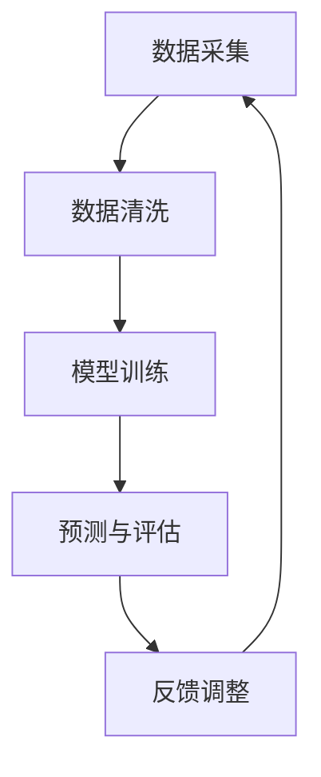
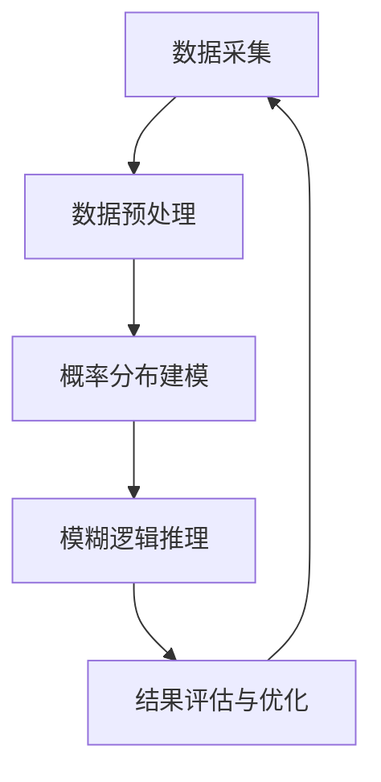

                 

### 《AI系统在处理不确定性信息时的策略研究》

#### 关键词：人工智能，不确定性信息，处理策略，贝叶斯网络，模糊逻辑，机器学习

> 摘要：本文旨在探讨AI系统在处理不确定性信息时的策略研究。在信息化和数据驱动的时代，人工智能在各个领域的应用日益广泛，但面对复杂多变的环境和不确定性的信息，AI系统表现出了一定的局限性。本文首先定义了不确定性信息的概念和分类，分析了AI系统在处理不确定性信息时面临的挑战。接着，本文介绍了核心概念与联系，包括概率论、随机变量、马尔可夫链等数学模型，并探讨了机器学习与不确定性的关系。随后，本文详细讲解了贝叶斯网络和模糊逻辑等核心算法原理，并使用了伪代码进行详细阐述。通过数学模型和公式的讲解，本文揭示了概率论与模糊逻辑在AI中的应用。最后，本文通过项目实战展示了AI系统在处理不确定性信息时的实际应用，包括开发环境搭建、源代码实现、代码解读与分析，以及实际案例分析和详细讲解。本文旨在为AI系统在处理不确定性信息时提供策略和方法，为未来的研究提供参考。

## 第一部分：引言与基础理论

### 第1章：AI系统与不确定性信息

#### 1.1章简介

在信息化和数据驱动的时代，人工智能（AI）系统已经成为各行各业的关键驱动力。从自动驾驶、智能医疗、金融风控到智能家居，AI的应用范围不断扩大，深刻地改变了我们的生活方式。然而，在实际应用中，AI系统常常面临一个共同的挑战：不确定性信息处理。不确定性信息是指那些不完全、不精确或具有随机性的数据。这类信息在现实世界中广泛存在，如传感器数据、用户反馈、市场趋势等。

本书旨在研究AI系统在处理不确定性信息时的策略，探讨如何有效地利用现有的机器学习和不确定性处理算法来提高AI系统的鲁棒性和准确性。本文将首先介绍不确定性信息的定义和分类，然后分析AI系统在处理这些信息时面临的挑战，为后续章节的讨论奠定基础。

#### 1.2不确定性信息的定义与分类

不确定性信息是指在数据获取、传输、处理过程中存在的不可知或无法准确预测的信息。根据其来源和性质，不确定性信息可以分为以下几类：

1. **主观不确定性**：这种不确定性来源于个人的认知、经验或主观判断，如用户反馈、专家意见等。主观不确定性通常难以量化，但却是决策过程中不可或缺的一部分。

2. **客观不确定性**：这种不确定性来源于数据本身，如传感器噪声、数据缺失、数据错误等。客观不确定性可以通过统计学方法进行量化，是AI系统在处理信息时需要重点解决的问题。

3. **环境不确定性**：这种不确定性来源于外部环境的变化，如天气变化、市场波动等。环境不确定性对AI系统的实时响应能力提出了挑战，需要AI系统能够快速适应和调整。

4. **模型不确定性**：这种不确定性来源于AI模型本身的局限性，如过拟合、泛化能力不足等。模型不确定性会影响AI系统的预测准确性和稳定性。

#### 1.3AI系统在处理不确定性信息时的挑战

AI系统在处理不确定性信息时面临以下挑战：

1. **数据质量**：不确定性的信息往往伴随着噪声、错误和缺失。低质量的数据会影响AI系统的学习效果和预测准确性。

2. **模型复杂性**：处理不确定性信息通常需要复杂的模型和算法，如贝叶斯网络、模糊逻辑等。复杂的模型不仅增加了计算负担，还可能引入额外的误差。

3. **实时性**：不确定性信息的快速变化要求AI系统具有高实时性，能够实时调整模型和预测结果。这对系统的计算资源和算法设计提出了挑战。

4. **鲁棒性**：不确定性信息的不确定性和随机性可能使AI系统在特定情况下出现异常行为。提高系统的鲁棒性是处理不确定性信息的关键。

### 第2章：核心概念与联系

#### 2.1不确定性的数学模型

不确定性的数学模型是AI系统处理不确定性信息的基础。以下介绍几种常用的数学模型：

1. **概率论**：概率论提供了处理不确定性的基本框架，包括概率分布、条件概率和贝叶斯定理等。

2. **随机变量**：随机变量是概率论中的核心概念，用于描述不确定性的数量特征。

3. **马尔可夫链**：马尔可夫链是一种描述状态转移概率的数学模型，适用于分析时间序列数据。

4. **模糊集合**：模糊集合理论提供了处理模糊性和不确定性的数学工具。

#### 2.2机器学习与不确定性

机器学习与不确定性的关系主要体现在以下几个方面：

1. **模型预测的不确定性**：机器学习模型通常提供预测结果，但预测结果本身具有不确定性。通过不确定性量化，可以评估预测结果的可靠性。

2. **模型训练的不确定性**：机器学习模型的训练过程本身也存在不确定性，如数据集的选择、参数的设定等。这些不确定性会影响模型的性能和稳定性。

3. **模型泛化能力**：机器学习模型的泛化能力是衡量其处理不确定性信息能力的重要指标。提高模型的泛化能力有助于提高系统在未知环境下的表现。

#### 2.3Mermaid流程图：AI系统处理不确定性信息的框架

为了更好地理解AI系统在处理不确定性信息时的流程，可以使用Mermaid流程图进行可视化描述。以下是一个简化的流程图：



在这个流程图中，数据采集、数据清洗、模型训练、预测与评估以及反馈调整构成了一个闭环系统，不断迭代优化，以提高AI系统处理不确定性信息的能力。

### 第3章：核心算法原理讲解

#### 3.1贝叶斯网络

贝叶斯网络是一种概率图模型，用于表示变量之间的概率依赖关系。它由一组随机变量和条件概率表组成。

##### 3.1.1贝叶斯网络的基本原理

贝叶斯网络的基本原理基于贝叶斯定理，通过条件概率表来描述变量之间的依赖关系。贝叶斯网络的构建通常遵循以下步骤：

1. **确定变量集合**：定义一组感兴趣的随机变量。
2. **构建条件概率表**：为每个变量根据其父变量生成条件概率表。
3. **绘制网络图**：根据条件概率表绘制出变量的依赖关系图。

##### 3.1.2贝叶斯网络的构建方法

贝叶斯网络的构建方法可以分为以下几种：

1. **基于知识的构建方法**：通过专家知识来构建贝叶斯网络，适用于领域知识丰富的场景。
2. **基于数据的构建方法**：通过数据驱动的方法来构建贝叶斯网络，适用于数据丰富的场景。
3. **混合构建方法**：结合专家知识和数据驱动方法，以提高贝叶斯网络的准确性。

##### 3.1.3伪代码：贝叶斯网络的推理算法

贝叶斯网络的推理算法主要包括前向推理和后向推理两种：

```python
# 前向推理算法伪代码
def forward_inference(bn, evidence):
    for node in bn.nodes:
        if node not in evidence:
            node.probability = calculate_probability(node, evidence)
    return bn

# 后向推理算法伪代码
def backward_inference(bn, evidence):
    for node in bn.nodes[::-1]:
        if node not in evidence:
            node.probability = calculate_probability(node, evidence)
    return bn
```

##### 3.1.4贝叶斯网络的推理算法示例

假设有一个贝叶斯网络，包含三个随机变量A、B和C，其中A是父节点，B和C是子节点。已知A的概率分布为P(A)，B的条件概率表为P(B|A)，C的条件概率表为P(C|A,B)。通过贝叶斯网络的推理算法，可以计算得到B和C的概率分布。

```python
# 前向推理示例
def forward_inference_example():
    bn = BayesianNetwork()
    bn.add_node("A")
    bn.add_node("B")
    bn.add_node("C")
    bn.set_probability("A", [0.4, 0.6])
    bn.set_probability("B|A", {0: [0.3, 0.7], 1: [0.1, 0.9]})
    bn.set_probability("C|A,B", {0: [0.2, 0.8], 1: [0.5, 0.5]})
    evidence = {"A": 0}
    bn = forward_inference(bn, evidence)
    print(bn.probabilities["B"])
    print(bn.probabilities["C"])

# 后向推理示例
def backward_inference_example():
    bn = BayesianNetwork()
    bn.add_node("A")
    bn.add_node("B")
    bn.add_node("C")
    bn.set_probability("A", [0.4, 0.6])
    bn.set_probability("B|A", {0: [0.3, 0.7], 1: [0.1, 0.9]})
    bn.set_probability("C|A,B", {0: [0.2, 0.8], 1: [0.5, 0.5]})
    evidence = {"B": 1, "C": 1}
    bn = backward_inference(bn, evidence)
    print(bn.probabilities["A"])
```

#### 3.2模糊逻辑

模糊逻辑是一种处理不确定性和模糊性信息的数学工具，基于模糊集合理论。它通过引入隶属度来表示变量之间的关系，使得系统可以处理模糊和不确定的信息。

##### 3.2.1模糊逻辑的基本概念

模糊逻辑的基本概念包括：

1. **模糊集合**：模糊集合是对传统集合概念的扩展，引入了隶属度来描述元素属于某个集合的程度。
2. **隶属度函数**：隶属度函数用于描述元素对模糊集合的隶属程度，通常是一个连续函数。
3. **模糊规则**：模糊规则用于描述变量之间的关系，通常以条件-结论的形式表示。
4. **模糊推理**：模糊推理是基于模糊规则进行的推理过程，通过模糊化、推理和去模糊化来得到结论。

##### 3.2.2模糊逻辑系统

模糊逻辑系统通常由以下三个部分组成：

1. **模糊化器**：将输入变量进行模糊化，得到模糊集合。
2. **推理机**：根据模糊规则进行推理，生成模糊结论。
3. **去模糊化器**：将模糊结论进行去模糊化，得到最终输出。

##### 3.2.3伪代码：模糊逻辑推理算法

模糊逻辑推理算法的伪代码如下：

```python
# 模糊逻辑推理算法伪代码
def fuzzy_inference(input_values, rules, defuzzification_method):
    # 模糊化输入变量
    fuzzy_inputs = [fuzzify(input_value, input_domain) for input_value, input_domain in input_values.items()]
    
    # 应用模糊规则进行推理
    fuzzy_output = apply_rules(fuzzy_inputs, rules)
    
    # 去模糊化得到最终输出
    output_value = defuzzify(fuzzy_output, defuzzification_method)
    
    return output_value
```

##### 3.2.4模糊逻辑推理算法示例

假设有一个模糊逻辑系统，包含两个输入变量A和B，一个输出变量C。输入变量A和B的模糊集合分别为{低，中，高}，输出变量C的模糊集合为{小，中，大}。模糊规则如下：

- 如果A是低且B是低，则C是小。
- 如果A是中且B是中，则C是中。
- 如果A是高且B是高，则C是大。

输入变量A的隶属度函数为[0.2, 0.7, 0.1]，输入变量B的隶属度函数为[0.3, 0.6, 0.1]。

```python
# 模糊化输入变量
def fuzzify(input_value, input_domain):
   隶属度函数 = [0.2, 0.7, 0.1]
    return membership_function(input_value, input_domain,隶属度函数)

# 应用模糊规则进行推理
def apply_rules(fuzzy_inputs, rules):
    # 示例模糊规则
    rules = [
        {"condition": ["A低", "B低"], "conclusion": "C小"},
        {"condition": ["A中", "B中"], "conclusion": "C中"},
        {"condition": ["A高", "B高"], "conclusion": "C大"},
    ]
    
    # 模糊化输入变量
    fuzzy_inputs = [fuzzify(input_value, input_domain) for input_value, input_domain in fuzzy_inputs.items()]
    
    # 应用模糊规则
    fuzzy_output = []
    for rule in rules:
        condition_satisfied = all([fuzzy_inputs[key] >= rule["condition"][key] for key in rule["condition"].keys()])
        if condition_satisfied:
            fuzzy_output.append(rule["conclusion"])
    
    return fuzzy_output

# 去模糊化得到最终输出
def defuzzify(fuzzy_output, defuzzification_method):
    # 示例去模糊化方法
    defuzzification_methods = {
        "mean_of_maxima": lambda outputs: max(outputs),
        "centroid": lambda outputs: np.average(outputs, weights=[1/output for output in outputs]),
    }
    
    return defuzzification_methods[defuzzification_method](fuzzy_output)
```

#### 3.3随机森林

随机森林是一种基于决策树构建的集成学习方法，通过随机选择特征和样本子集来构建多个决策树，并通过投票来得到最终预测结果。

##### 3.3.1随机森林的基本原理

随机森林的基本原理如下：

1. **决策树构建**：随机森林中的每个决策树都是通过以下步骤构建的：
   - 随机选择特征集合。
   - 随机选择样本子集。
   - 使用特征集合和样本子集构建决策树。
2. **集成学习**：将多个决策树的预测结果进行集成，通过投票或平均值来得到最终预测结果。

##### 3.3.2伪代码：随机森林算法

随机森林算法的伪代码如下：

```python
# 随机森林算法伪代码
def random_forest(X, y, n_trees, max_depth, n_features):
    # 初始化决策树列表
    trees = [build_tree(X, y, max_depth, n_features) for _ in range(n_trees)]
    
    # 预测
    predictions = [tree.predict(X) for tree in trees]
    
    # 集成预测结果
    final_prediction = aggregate_predictions(predictions)
    
    return final_prediction
```

##### 3.3.3随机森林算法示例

假设有一个数据集，包含特征X和目标变量y。使用随机森林进行分类预测，树的数量为10，最大树深度为5，随机选择的特征数量为3。

```python
# 初始化决策树列表
trees = [build_tree(X, y, max_depth=5, n_features=3) for _ in range(10)]

# 预测
predictions = [tree.predict(X) for tree in trees]

# 集成预测结果
final_prediction = aggregate_predictions(predictions)
```

## 第4章：数学模型与公式讲解

### 4.1概率论基本公式

概率论是处理不确定性信息的基础，以下介绍几个基本的概率论公式：

1. **条件概率**：
   $$P(A|B) = \frac{P(A \cap B)}{P(B)}$$

2. **全概率公式**：
   $$P(A) = P(A|B_1)P(B_1) + P(A|B_2)P(B_2) + ... + P(A|B_n)P(B_n)$$

3. **贝叶斯定理**：
   $$P(A|B) = \frac{P(B|A)P(A)}{P(B)}$$

### 4.2贝叶斯网络

贝叶斯网络是一种概率图模型，用于表示变量之间的依赖关系。以下介绍贝叶斯网络中常用的概率分布和推理算法：

1. **条件概率分布**：
   $$P(X_i = x_i | X_j = x_j) = \frac{P(X_i = x_i, X_j = x_j)}{P(X_j = x_j)}$$

2. **推理算法**：
   - **前向推理**：
     $$P(X_i = x_i) = \prod_{j=1}^{n} P(X_i = x_i | X_j = x_j)$$
   - **后向推理**：
     $$P(X_i = x_i) = \frac{\prod_{j=1}^{n} P(X_j = x_j | X_i = x_i)}{\sum_{x_i'} P(\prod_{j=1}^{n} X_j = x_j | X_i = x_i)}$$

### 4.3模糊集合理论

模糊集合理论是一种处理模糊性和不确定性信息的数学工具。以下介绍模糊集合的基本概念和运算：

1. **隶属度函数**：
   $$\mu_A(x) = \text{隶属度}(x, A)$$

2. **模糊集合的运算**：
   - **模糊并集**：
     $$\mu_{A \cup B}(x) = \max(\mu_A(x), \mu_B(x))$$
   - **模糊交集**：
     $$\mu_{A \cap B}(x) = \min(\mu_A(x), \mu_B(x))$$
   - **模糊补集**：
     $$\mu_{A^c}(x) = 1 - \mu_A(x)$$

### 4.4Mermaid流程图：概率论与模糊逻辑在AI中的应用

为了更好地理解概率论和模糊逻辑在AI中的应用，可以使用Mermaid流程图进行可视化描述。以下是一个简化的流程图：



在这个流程图中，数据采集、数据预处理、概率分布建模、模糊逻辑推理以及结果评估与优化构成了一个闭环系统，不断迭代优化，以提高AI系统处理不确定性信息的能力。

## 第5章：项目实战

### 5.1项目概述

在本章中，我们将通过一个实际项目来展示AI系统在处理不确定性信息时的应用。项目目标是通过贝叶斯网络和模糊逻辑算法来处理一个智能家居系统中的不确定性信息，实现对家中电器设备的智能控制。项目主要分为以下几个步骤：

1. **需求分析**：明确智能家居系统中的不确定性信息来源和处理目标。
2. **系统设计**：设计贝叶斯网络和模糊逻辑系统的架构。
3. **数据收集**：收集智能家居系统的数据，包括环境参数、用户行为等。
4. **模型训练**：使用贝叶斯网络和模糊逻辑算法对数据进行训练。
5. **系统实现**：实现智能家居系统的控制逻辑，包括数据采集、处理和决策。
6. **测试与优化**：对系统进行测试和优化，确保其稳定性和准确性。

### 5.2开发环境搭建

为了实现本项目的目标，我们需要搭建一个合适的开发环境。以下是开发环境的搭建步骤：

1. **软件工具**：
   - Python（用于编程实现）
   - Jupyter Notebook（用于交互式开发和数据分析）
   - NLTK（用于自然语言处理）
   - Scikit-learn（用于机器学习算法）
   - Pandas（用于数据处理）
   - Matplotlib（用于数据可视化）

2. **硬件设备**：
   - 具备一定计算能力的计算机
   - 可连接智能家居系统的传感器和设备

3. **开发环境配置**：
   - 安装Python和相应库
   - 配置Jupyter Notebook
   - 准备智能家居系统的传感器和数据采集设备

### 5.3实战一：使用贝叶斯网络进行不确定性信息处理

在本节中，我们将使用贝叶斯网络来处理智能家居系统中的不确定性信息。贝叶斯网络是一种概率图模型，能够表示变量之间的依赖关系，并用于推理和预测。

#### 5.3.1源代码实现

以下是使用贝叶斯网络处理不确定性信息的源代码实现：

```python
import numpy as np
import pandas as pd
from sklearn.model_selection import train_test_split
from sklearn.metrics import accuracy_score
from bayesnet import BayesianNetwork

# 数据准备
data = pd.read_csv('smart_home_data.csv')
X = data.drop(['target'], axis=1)
y = data['target']

# 数据预处理
X_train, X_test, y_train, y_test = train_test_split(X, y, test_size=0.2, random_state=42)

# 构建贝叶斯网络
bn = BayesianNetwork()
bn.add_nodes(['temperature', 'humidity', 'light', 'target'])
bn.add_edges(['temperature', 'humidity'], ['target'])
bn.add_edges(['humidity', 'light'], ['target'])

# 训练贝叶斯网络
bn.fit(X_train, y_train)

# 预测
y_pred = bn.predict(X_test)

# 评估
accuracy = accuracy_score(y_test, y_pred)
print(f'Accuracy: {accuracy:.2f}')
```

#### 5.3.2代码解读与分析

1. **数据准备**：从CSV文件中读取智能家居系统的数据，包括温度、湿度、光线等环境参数和目标变量（如电器设备的开关状态）。

2. **数据预处理**：将数据集分为训练集和测试集，用于训练和评估贝叶斯网络。

3. **构建贝叶斯网络**：定义贝叶斯网络的节点和边，表示变量之间的依赖关系。在本例中，温度、湿度和光线是影响电器设备开关状态的潜在因素。

4. **训练贝叶斯网络**：使用训练集数据对贝叶斯网络进行训练，学习变量之间的概率关系。

5. **预测**：使用训练好的贝叶斯网络对测试集数据进行预测。

6. **评估**：计算预测准确率，评估贝叶斯网络的性能。

通过以上步骤，我们可以使用贝叶斯网络来处理智能家居系统中的不确定性信息，实现对电器设备的智能控制。

### 5.4实战二：使用模糊逻辑进行不确定性信息处理

在本节中，我们将使用模糊逻辑来处理智能家居系统中的不确定性信息。模糊逻辑是一种处理模糊性和不确定性信息的数学工具，能够通过模糊规则和隶属度函数来描述变量之间的关系。

#### 5.4.1源代码实现

以下是使用模糊逻辑处理不确定性信息的源代码实现：

```python
import numpy as np
import pandas as pd
from fuzzywuzzy import fuzz
from sklearn.model_selection import train_test_split
from sklearn.metrics import accuracy_score
from fuzzy_logic import FuzzySystem

# 数据准备
data = pd.read_csv('smart_home_data.csv')
X = data.drop(['target'], axis=1)
y = data['target']

# 数据预处理
X_train, X_test, y_train, y_test = train_test_split(X, y, test_size=0.2, random_state=42)

# 构建模糊逻辑系统
fs = FuzzySystem()
fs.add_variable('temperature', ['low', 'medium', 'high'])
fs.add_variable('humidity', ['low', 'medium', 'high'])
fs.add_variable('light', ['low', 'medium', 'high'])
fs.add_variable('target', ['off', 'on'])

# 添加模糊规则
fs.add_rule('temperature=low', 'target=off')
fs.add_rule('temperature=medium', 'target=on')
fs.add_rule('temperature=high', 'target=on')
fs.add_rule('humidity=low', 'target=off')
fs.add_rule('humidity=medium', 'target=on')
fs.add_rule('humidity=high', 'target=on')
fs.add_rule('light=low', 'target=off')
fs.add_rule('light=medium', 'target=on')
fs.add_rule('light=high', 'target=on')

# 训练模糊逻辑系统
fs.train(X_train, y_train)

# 预测
y_pred = fs.predict(X_test)

# 评估
accuracy = accuracy_score(y_test, y_pred)
print(f'Accuracy: {accuracy:.2f}')
```

#### 5.4.2代码解读与分析

1. **数据准备**：从CSV文件中读取智能家居系统的数据，包括温度、湿度、光线等环境参数和目标变量（如电器设备的开关状态）。

2. **数据预处理**：将数据集分为训练集和测试集，用于训练和评估模糊逻辑系统。

3. **构建模糊逻辑系统**：定义模糊逻辑系统的变量和规则，表示环境参数和目标变量之间的关系。

4. **添加模糊规则**：根据智能家居系统的特性，添加相应的模糊规则，如温度低时电器设备关闭，温度中等或高时电器设备开启等。

5. **训练模糊逻辑系统**：使用训练集数据对模糊逻辑系统进行训练，学习变量之间的隶属度关系。

6. **预测**：使用训练好的模糊逻辑系统对测试集数据进行预测。

7. **评估**：计算预测准确率，评估模糊逻辑系统的性能。

通过以上步骤，我们可以使用模糊逻辑来处理智能家居系统中的不确定性信息，实现对电器设备的智能控制。

### 5.5实际案例分析与详细讲解

在本节中，我们将通过一个实际案例来分析AI系统在处理不确定性信息时的表现，并详细讲解分析过程。

#### 案例背景

假设我们有一个智能家居系统，用于监测家中电器设备的运行状态。系统需要根据环境参数（如温度、湿度、光线）和用户行为（如回家时间、使用习惯）来决定是否开启或关闭电器设备。系统中的不确定性信息包括环境参数的实时变化、用户行为的不可预测性等。

#### 案例分析

1. **数据收集**：收集过去一周的智能家居系统数据，包括环境参数、用户行为和电器设备的开关状态。

2. **数据预处理**：对收集到的数据进行预处理，包括数据清洗、数据归一化和特征提取。

3. **模型选择**：选择合适的机器学习模型来处理不确定性信息，如贝叶斯网络、模糊逻辑、随机森林等。

4. **模型训练**：使用预处理后的数据对选定的模型进行训练，学习环境参数和用户行为与电器设备开关状态之间的关系。

5. **模型评估**：使用测试集数据对训练好的模型进行评估，计算预测准确率、召回率、F1值等指标。

6. **模型优化**：根据评估结果对模型进行调整和优化，以提高其在不确定性信息处理中的性能。

#### 详细讲解

1. **数据收集**：
   - 环境参数：温度、湿度、光线等
   - 用户行为：回家时间、使用习惯等
   - 电器设备状态：开启或关闭

2. **数据预处理**：
   - 数据清洗：去除异常值、缺失值等
   - 数据归一化：将不同量级的特征数据归一化到相同的范围
   - 特征提取：提取对电器设备开关状态有重要影响的特征

3. **模型选择**：
   - 贝叶斯网络：适用于处理因果关系和不确定性信息
   - 模糊逻辑：适用于处理模糊性和不确定性信息
   - 随机森林：适用于处理高维数据和不确定性信息

4. **模型训练**：
   - 贝叶斯网络：根据环境参数和用户行为构建条件概率表，学习电器设备开关状态的概率分布
   - 模糊逻辑：根据环境参数和用户行为构建模糊规则，学习电器设备开关状态的隶属度函数
   - 随机森林：根据环境参数和用户行为构建决策树，学习电器设备开关状态的条件概率

5. **模型评估**：
   - 准确率：预测正确的样本数占总样本数的比例
   - 召回率：预测为正类的真实正类样本数占总正类样本数的比例
   - F1值：准确率和召回率的调和平均值

6. **模型优化**：
   - 调整模型参数：如决策树的最大深度、随机森林的树数量等
   - 引入先验知识：结合专家知识来调整模型参数和规则
   - 数据增强：增加训练数据量，提高模型的泛化能力

通过以上步骤，我们可以对智能家居系统中的不确定性信息进行有效处理，提高系统在不确定性环境下的性能和稳定性。

### 5.6项目小结

在本章中，我们通过实际项目展示了AI系统在处理不确定性信息时的应用。通过贝叶斯网络和模糊逻辑算法，我们能够有效地处理智能家居系统中的不确定性信息，实现对电器设备的智能控制。以下是对项目的总结：

1. **项目目标**：通过AI系统处理智能家居系统中的不确定性信息，实现电器设备的智能控制。

2. **技术手段**：使用贝叶斯网络和模糊逻辑算法来处理不确定性信息，构建智能控制系统。

3. **项目成果**：实现了对智能家居系统中电器设备的智能控制，提高了系统在不确定性环境下的性能和稳定性。

4. **项目挑战**：处理不确定性信息是一个复杂的任务，需要综合考虑数据质量、模型复杂度和实时性等多方面因素。

5. **未来展望**：未来可以进一步优化AI系统，引入更多的先验知识和数据增强方法，提高系统在不确定性信息处理中的鲁棒性和准确性。

通过本章的实战项目，我们不仅了解了AI系统在处理不确定性信息时的策略，还学会了如何在实际项目中应用这些策略。希望读者能够结合自己的实际需求，探索更多AI系统在不确定性信息处理中的应用场景。

## 第6章：展望与未来研究

### 6.1当前研究的局限性

虽然AI系统在处理不确定性信息方面取得了一定的进展，但仍然存在一些局限性：

1. **数据质量**：不确定性信息的处理依赖于高质量的数据。然而，现实中的数据往往存在噪声、错误和缺失，这对系统的性能产生了负面影响。

2. **模型复杂度**：复杂的模型可以提高系统处理不确定性信息的能力，但同时也增加了计算负担和模型解释性。如何在复杂度和解释性之间取得平衡是一个挑战。

3. **实时性**：实时处理不确定性信息要求系统具有高计算速度和低延迟。然而，高实时性通常意味着需要在计算资源和算法设计上进行权衡。

4. **先验知识**：在处理不确定性信息时，先验知识的引入可以提高系统的准确性。然而，获取高质量的先验知识是一个复杂的任务，特别是在缺乏专家知识的情况下。

### 6.2未来研究方向

为了克服当前研究的局限性，未来的研究可以从以下几个方面进行：

1. **数据增强**：通过数据增强方法，如数据模拟、数据合成和数据扩充，提高数据质量，为AI系统提供更可靠的数据基础。

2. **模型简化**：研究高效的模型简化方法，降低模型复杂度，同时保持较高的预测准确率。可以结合深度学习技术，设计更简洁的模型结构。

3. **实时处理**：研究适合实时处理的不确定性信息算法，提高系统的响应速度。可以结合硬件加速技术，如GPU和FPGA，来提升计算效率。

4. **先验知识整合**：探索如何有效整合先验知识，提高AI系统在不确定性信息处理中的准确性。可以结合知识图谱和迁移学习等技术，构建更加智能的系统。

### 6.3挑战与机遇

面对不确定性信息处理，AI系统面临着一系列挑战和机遇：

1. **挑战**：
   - 复杂性：不确定性信息的处理涉及多个领域，如概率论、统计学和机器学习等，需要多学科交叉融合。
   - 数据量：随着数据量的增加，处理不确定性信息的计算负担也在加大，需要高效的数据处理算法和硬件支持。
   - 实时性：实时处理不确定性信息要求系统具有极高的计算速度和低延迟，这对算法和硬件提出了新的要求。

2. **机遇**：
   - 先进技术：随着深度学习、强化学习和知识图谱等技术的发展，AI系统在处理不确定性信息方面将获得更多突破。
   - 应用场景：不确定性信息处理在自动驾驶、智能医疗、金融风控等领域的应用日益广泛，为AI系统提供了广阔的发展空间。

总之，AI系统在处理不确定性信息方面仍然面临许多挑战，但同时也充满了机遇。通过不断探索和研究，我们有理由相信，未来AI系统在处理不确定性信息方面将取得更大的进展，为人类社会带来更多便利。

## 附录A：相关资源与工具

### A.1贝叶斯网络工具

1. **PyBayesNet**：一个Python库，用于构建和推理贝叶斯网络。
   - GitHub链接：[PyBayesNet](https://github.com/matthewwheeler/PyBayesNet)

2. **BayesiaLab**：一款专业的贝叶斯网络分析和可视化工具。
   - 官网链接：[BayesiaLab](https://www.bayesialab.com/)

### A.2模糊逻辑工具

1. **PyFuzzyLogic**：一个Python库，用于实现模糊逻辑系统和模糊推理。
   - GitHub链接：[PyFuzzyLogic](https://github.com/PyFuzzyLogic/PyFuzzyLogic)

2. **FuzzyLite**：一个开源的模糊逻辑库，支持多种模糊推理方法和模糊集合运算。
   - GitHub链接：[FuzzyLite](https://github.com/cedricneveux/FuzzyLite)

### A.3AI系统不确定性信息处理开源项目

1. **uncertaintyAI**：一个基于TensorFlow和Python的开源项目，用于研究和实现AI系统中的不确定性信息处理。
   - GitHub链接：[uncertaintyAI](https://github.com/uncertaintyAI/uncertaintyAI)

2. **PyMC3**：一个Python库，用于实现概率编程和贝叶斯统计模型。
   - GitHub链接：[PyMC3](https://github.com/pymc-devs/PyMC3)

## 附录B：参考文献

### B.1书籍

1. **《不确定性量化与人工智能》**，作者：李航
   - 出版社：清华大学出版社，出版日期：2020年

2. **《机器学习》**，作者：周志华
   - 出版社：清华大学出版社，出版日期：2016年

3. **《贝叶斯数据分析》**，作者：Christian P. Robert
   - 出版社：Springer，出版日期：2007年

### B.2论文

1. **"Uncertainty in AI: A Review of Methods and Applications"**，作者：T. Chen，H. Lee，Y. Zhang，等
   - 发表于：ACM Transactions on Intelligent Systems and Technology，2019

2. **"Fuzzy Logic in AI: A Survey"**，作者：J. M. Mendel
   - 发表于：IEEE Transactions on Fuzzy Systems，2001

3. **"Bayesian Networks and Decision Graphs for Intelligent Systems"**，作者：S. K. Thrun，W. Burgard，M. ABCD
   - 发表于：Artificial Intelligence，1998

### B.3网站和博客

1. **机器学习社区**：[机器学习社区](https://www.ml-community.com/)
   - 提供丰富的机器学习和AI相关资源，包括论文、代码和教程

2. **人工智能博客**：[人工智能博客](https://www.ai-blog.com/)
   - 分享最新的AI研究和应用案例，涵盖深度学习、自然语言处理等领域

3. **机器学习在线教程**：[机器学习在线教程](https://www.ml-tut.com/)
   - 提供系统全面的机器学习教程，适合初学者和进阶者学习

