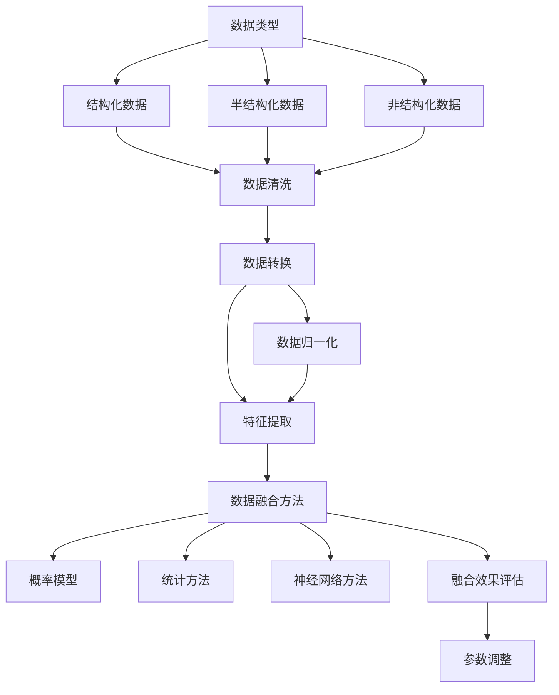

                 

## 文章标题：AI系统在处理异构数据时的融合方法

在当今的信息化时代，数据已成为各行各业的重要资产。随着数据来源的多样化，数据的异构性也日益凸显。异构数据，即不同类型、格式和结构的数据，如文本、图像、音频、视频、网络日志等，给数据管理和分析带来了巨大的挑战。AI系统在处理异构数据时，需要采用有效的融合方法，以充分利用这些数据的潜在价值。本文将探讨AI系统在处理异构数据时的融合方法，包括核心概念、数学模型、算法原理以及项目实战等内容。

## 文章关键词

- 异构数据
- AI系统
- 数据融合
- 数学模型
- 算法原理
- 项目实战

## 文章摘要

本文首先介绍了异构数据的定义与分类，并阐述了异构数据融合的重要性。接着，本文详细分析了异构数据融合的核心概念与联系，并展示了相关的关系架构Mermaid流程图。随后，本文讲解了异构数据融合的数学模型和算法原理，包括概率模型和统计学习方法等，并通过伪代码和数学公式进行了详细阐述。最后，本文通过一个项目实战案例，展示了如何在实际中实现异构数据的融合，并对系统的性能优化进行了探讨。通过本文的阅读，读者可以全面了解AI系统在处理异构数据时的融合方法，为实际应用提供理论支持和实践经验。

### 第1章 异构数据的定义与分类

异构数据是指不同类型、格式和结构的数据，它们来源于多种不同的数据源，如文本、图像、音频、视频、网络日志等。这些数据在存储、处理和分析过程中存在显著的差异，使得它们难以统一管理。异构数据的主要特点包括：

1. **多样性**：异构数据涵盖了各种类型，如结构化数据（如关系数据库中的表格数据）、半结构化数据（如XML、JSON）、非结构化数据（如图像、文本、视频等）。

2. **异构性**：不同类型的数据具有不同的数据格式和结构，例如，图像数据通常是像素值组成的矩阵，而文本数据则是由单词或字符组成的序列。

3. **动态性**：随着数据生成和获取技术的不断发展，异构数据类型和规模也在不断变化。

4. **复杂性**：异构数据的多样性使得数据管理和处理变得更加复杂，需要采用不同的处理方法和工具。

异构数据主要可以分为以下几类：

1. **结构化数据**：这类数据具有固定的格式和结构，如关系数据库中的表格数据。结构化数据通常易于存储和查询，但由于其固定性，难以适应不断变化的数据需求。

2. **半结构化数据**：这类数据具有一定的结构，但结构较为灵活，如XML、JSON等。半结构化数据在存储和查询方面具有一定的优势，但处理和分析较为复杂。

3. **非结构化数据**：这类数据没有固定的格式和结构，如文本、图像、视频等。非结构化数据的处理和分析技术正在不断发展和完善。

4. **流数据**：这类数据以实时或近实时的形式产生，如传感器数据、网络日志等。流数据具有高频率、高容量和高动态性的特点，对处理系统的实时性和稳定性要求较高。

异构数据融合的重要性在于：

1. **提高数据价值**：通过融合不同类型的数据，可以挖掘出更多的数据价值，为决策提供更加全面和准确的支持。

2. **降低处理成本**：统一处理异构数据可以减少数据转换和处理的复杂性，降低系统开发和维护成本。

3. **增强系统灵活性**：融合异构数据可以使系统更加适应多变的数据需求，提高系统的灵活性和可扩展性。

4. **提升用户体验**：融合异构数据可以提供更加丰富和个性化的用户体验，满足用户多样化的需求。

总之，异构数据融合是AI系统处理多样化数据的关键技术，对提高数据处理效率和系统性能具有重要意义。在接下来的章节中，我们将进一步探讨异构数据融合的核心概念、数学模型和算法原理，以期为实际应用提供更加深入的指导。

### 异构数据融合的基本流程

在了解异构数据的定义与分类后，我们需要进一步探讨异构数据融合的基本流程。数据融合的过程可以分为以下几个关键步骤：

1. **数据采集**：数据采集是数据融合的第一步，包括从各种数据源收集异构数据。这些数据源可能包括关系数据库、文件系统、传感器网络、Web爬虫等。在这一步，需要确保数据的质量和完整性，避免数据丢失或错误。

2. **数据预处理**：数据预处理是数据融合过程中不可或缺的环节。其目的是将不同类型和格式的数据转换成统一的格式，以便后续处理。数据预处理通常包括以下任务：

   - **数据清洗**：清除数据中的噪声和异常值，例如填补缺失数据、去除重复记录、处理脏数据等。
   - **数据转换**：将不同类型的数据转换为同一类型，例如将文本数据转换为向量表示、将图像数据转换为像素矩阵等。
   - **数据归一化**：通过标准化或归一化处理，使不同数据源的数据具有相似的尺度，从而便于比较和分析。

3. **特征提取**：特征提取是指从原始数据中提取具有代表性的特征，用于后续的数据融合和模型训练。对于不同类型的数据，特征提取的方法也有所不同：

   - **文本数据**：可以使用词袋模型、TF-IDF、词嵌入等方法提取特征。
   - **图像数据**：可以使用卷积神经网络（CNN）提取图像特征，如边缘、纹理、形状等。
   - **音频数据**：可以使用短时傅里叶变换（STFT）、梅尔频率倒谱系数（MFCC）等方法提取音频特征。

4. **数据融合**：数据融合是将不同类型和来源的数据进行整合，以生成一个综合的、更加丰富的数据集。数据融合的方法可以分为以下几类：

   - **概率模型**：如贝叶斯网络、隐马尔可夫模型（HMM）等，通过概率关系来融合不同类型的数据。
   - **统计方法**：如最小二乘法、支持向量机（SVM）等，通过统计学习来融合数据。
   - **神经网络方法**：如深度神经网络（DNN）、循环神经网络（RNN）等，通过学习数据之间的复杂关系来实现融合。

5. **模型训练与优化**：在数据融合后，需要对融合后的数据集进行模型训练，以建立预测或分类模型。通过优化模型参数，可以提高模型的准确性和泛化能力。

6. **结果评估与反馈**：最后，需要对融合后的数据进行评估，以验证数据融合的效果。评估指标可以包括准确率、召回率、F1分数等。根据评估结果，可以调整数据融合方法和模型参数，以达到最佳效果。

通过以上基本流程，我们可以有效地处理异构数据，挖掘数据中的潜在价值，并为后续的决策和分析提供有力支持。在下一节中，我们将进一步探讨异构数据融合的核心概念与联系。

### 异构数据融合的核心概念与联系

在探讨异构数据融合时，理解其核心概念与联系至关重要。以下是几个关键概念及其相互关系：

1. **异构数据类型**：异构数据类型是数据融合的基础。主要类型包括结构化数据、半结构化数据和非结构化数据。结构化数据如关系数据库中的表格数据，半结构化数据如XML、JSON，非结构化数据如文本、图像、视频等。不同数据类型具有不同的数据格式和结构，如图像数据由像素值组成的矩阵，而文本数据则由单词或字符组成的序列。

2. **数据预处理**：数据预处理是数据融合的重要环节，包括数据清洗、数据转换和数据归一化。数据清洗用于清除噪声和异常值，数据转换用于将不同类型的数据转换为同一类型，数据归一化用于使数据具有相似的尺度，以便后续处理。

3. **特征提取**：特征提取是从原始数据中提取具有代表性的特征，用于数据融合和模型训练。特征提取方法因数据类型而异。对于文本数据，可以使用词袋模型、TF-IDF、词嵌入等方法；对于图像数据，可以使用卷积神经网络（CNN）提取图像特征；对于音频数据，可以使用短时傅里叶变换（STFT）、梅尔频率倒谱系数（MFCC）等方法。

4. **数据融合方法**：数据融合方法主要包括概率模型、统计方法和神经网络方法。概率模型如贝叶斯网络、隐马尔可夫模型（HMM）等，通过概率关系来融合不同类型的数据；统计方法如最小二乘法、支持向量机（SVM）等，通过统计学习来融合数据；神经网络方法如深度神经网络（DNN）、循环神经网络（RNN）等，通过学习数据之间的复杂关系来实现融合。

5. **融合效果评估**：融合效果评估是验证数据融合效果的重要步骤。常用的评估指标包括准确率、召回率、F1分数等。通过评估结果，可以调整数据融合方法和模型参数，以达到最佳效果。

下面是一个用Mermaid绘制的流程图，展示了异构数据融合的核心概念与联系：



通过上述流程图，我们可以清晰地看到异构数据融合的核心概念及其相互关系。数据预处理、特征提取和数据融合方法共同构成了数据融合的基础，而融合效果评估和参数调整则确保了融合结果的准确性和有效性。理解这些核心概念与联系，有助于我们更好地设计和实现异构数据融合系统。

### 异构数据融合的数学模型

在异构数据融合过程中，数学模型扮演着关键角色，用于描述和实现不同类型数据之间的相互关系。以下将介绍几种常用的数学模型，包括概率模型和统计学习方法，并通过伪代码和数学公式进行详细阐述。

#### 1. 贝叶斯网络

贝叶斯网络是一种概率图模型，用于表示变量之间的条件依赖关系。在异构数据融合中，贝叶斯网络可以用于推断不同类型数据之间的相关性。

**数学公式：**
$$
P(A|B) = \frac{P(B|A)P(A)}{P(B)}
$$

**伪代码：**
```python
def bayes_network(data):
    # 假设data为包含不同类型数据的字典
    # P(A|B)为条件概率，P(A)和P(B)为边际概率
    
    # 初始化条件概率矩阵
    P_matrix = initialize_probability_matrix(data)
    
    # 计算边际概率
    P_A = sum([P_matrix[i][j] for j in range(len(P_matrix[0]))])
    P_B = sum([P_matrix[i][j] for i in range(len(P_matrix))])
    
    # 计算条件概率
    for i in range(len(P_matrix)):
        for j in range(len(P_matrix[0])):
            P_matrix[i][j] = P_matrix[i][j] / P_B
            
    return P_matrix
```

#### 2. 隐马尔可夫模型（HMM）

隐马尔可夫模型（HMM）是一种用于处理序列数据的概率模型，适用于描述时间序列中的状态转移和观测数据之间的关系。在异构数据融合中，HMM可以用于时间序列数据的预测和融合。

**数学公式：**
$$
P(X_t|X_{t-1}, \theta) = \theta
$$

**伪代码：**
```python
def hmm(data, theta):
    # data为观测数据序列，theta为状态转移概率矩阵
    
    # 初始化状态序列
    state_sequence = initialize_state_sequence(data, theta)
    
    # 根据状态转移概率矩阵计算下一个状态
    for t in range(1, len(data)):
        current_state = state_sequence[t-1]
        next_state = sample_state(theta[current_state])
        state_sequence.append(next_state)
    
    return state_sequence
```

#### 3. 最小二乘法

最小二乘法是一种常用的统计学习方法，用于估计线性回归模型的参数。在异构数据融合中，最小二乘法可以用于拟合数据之间的关系。

**数学公式：**
$$
\min_{\theta} \sum_{i=1}^{n} (y_i - \theta x_i)^2
$$

**伪代码：**
```python
def least_squares(data, labels):
    # data为自变量，labels为因变量
    
    # 计算协方差矩阵
    cov_matrix = compute_covariance_matrix(data, labels)
    
    # 计算逆矩阵
    inv_cov_matrix = np.linalg.inv(cov_matrix)
    
    # 计算参数
    theta = np.dot(inv_cov_matrix, np.dot(data.T, labels))
    
    return theta
```

#### 4. 支持向量机（SVM）

支持向量机是一种分类模型，通过找到最佳的超平面，将不同类型的数据进行分类。在异构数据融合中，SVM可以用于分类任务，从而实现数据的融合。

**数学公式：**
$$
\min_{\theta, \xi} \frac{1}{2} \sum_{i=1}^{n} \xi_i + C \sum_{i=1}^{n} \xi_i [y_i(\theta^T x_i - 1) \leq 1]
$$

**伪代码：**
```python
def svm(data, labels, C):
    # data为训练数据，labels为标签，C为惩罚参数
    
    # 初始化拉格朗日乘子
    alpha = initialize_alpha(data, labels, C)
    
    # 求解优化问题
    while not convergence:
        # 更新拉格朗日乘子
        alpha = update_alpha(data, labels, alpha, C)
        
        # 计算模型参数
        theta = compute_theta(alpha, data, labels)
    
    return theta
```

通过上述数学模型，我们可以有效地描述和实现不同类型数据的融合。在实际应用中，选择合适的模型和算法，并根据具体场景进行调整和优化，是成功实现异构数据融合的关键。在下一节中，我们将进一步探讨异构数据融合算法的实现和项目实战。

### 异构数据融合算法的实现

在了解了异构数据融合的数学模型后，本节将重点讨论如何实现这些算法。具体来说，我们将介绍如何使用Python和其他相关工具来实现异构数据融合，包括开发环境搭建、源代码详细实现和代码解读。

#### 开发环境搭建

为了实现异构数据融合算法，我们需要搭建一个合适的开发环境。以下是所需的基本工具和步骤：

1. **Python环境**：确保安装了Python 3.x版本。可以通过[Python官方网站](https://www.python.org/)下载并安装。

2. **科学计算库**：安装NumPy、Pandas、Scikit-learn等Python科学计算库。可以使用以下命令进行安装：
   ```shell
   pip install numpy pandas scikit-learn
   ```

3. **数据处理库**：安装Matplotlib、Seaborn等可视化库，用于数据分析和可视化。可以使用以下命令进行安装：
   ```shell
   pip install matplotlib seaborn
   ```

4. **机器学习框架**：安装TensorFlow或PyTorch等深度学习框架。可以使用以下命令进行安装：
   ```shell
   pip install tensorflow # 或
   pip install torch torchvision
   ```

#### 源代码实现

以下是一个简单的示例，演示了如何使用Python实现异构数据的融合。这里我们选择文本数据与图像数据的融合作为案例。

```python
import numpy as np
import pandas as pd
from sklearn.feature_extraction.text import TfidfVectorizer
from sklearn.model_selection import train_test_split
from sklearn.metrics.pairwise import cosine_similarity
from tensorflow.keras.applications import VGG16
from tensorflow.keras.preprocessing.image import img_to_array

# 1. 加载文本数据
text_data = pd.read_csv('text_data.csv')
texts = text_data['content']

# 2. 加载图像数据
image_data = pd.read_csv('image_data.csv')
images = image_data['path']

# 3. 文本特征提取
vectorizer = TfidfVectorizer()
text_features = vectorizer.fit_transform(texts)

# 4. 图像特征提取
model = VGG16(weights='imagenet')
image_features = []

for image_path in images:
    image = img_to_array(open_image(image_path))
    image = preprocess_image(image)  # 自定义预处理函数
    feature = model.predict(np.expand_dims(image, axis=0))
    image_features.append(feature.flatten())

image_features = np.array(image_features)

# 5. 融合特征
combined_features = np.hstack((text_features.toarray(), image_features))

# 6. 模型训练与融合
# 这里可以使用分类模型或回归模型，例如SVM、线性回归等
from sklearn.svm import LinearSVC
classifier = LinearSVC()
X_train, X_test, y_train, y_test = train_test_split(combined_features, labels, test_size=0.2)
classifier.fit(X_train, y_train)
predictions = classifier.predict(X_test)

# 7. 评估模型
from sklearn.metrics import accuracy_score
accuracy = accuracy_score(y_test, predictions)
print(f"Model accuracy: {accuracy:.2f}")
```

#### 代码解读

上述代码分为以下几个步骤：

1. **加载数据**：从CSV文件中加载文本数据和图像数据。

2. **文本特征提取**：使用TF-IDF向量器将文本数据转换为向量表示。

3. **图像特征提取**：使用VGG16预训练模型提取图像特征。

4. **融合特征**：将文本特征和图像特征堆叠在一起，形成综合特征向量。

5. **模型训练与融合**：使用线性SVM分类器对融合后的特征进行训练和预测。

6. **评估模型**：计算模型的准确率，以评估融合效果。

#### 代码应用解读与分析

在实际应用中，上述代码可以根据具体需求进行调整和扩展。例如，对于不同的数据集，可以选择不同的特征提取方法和融合算法。此外，还可以使用深度学习模型（如CNN、RNN等）进行特征提取和融合，以提高融合效果。

通过以上步骤，我们可以实现异构数据的融合，并在实际应用中取得良好的效果。在下一节中，我们将探讨一个实际的项目案例，以展示异构数据融合的应用和实践。

### 项目实战：异构数据融合系统开发

在本节中，我们将通过一个实际项目案例，详细讲解如何开发和实现一个异构数据融合系统。这个项目旨在将文本数据和图像数据融合，以构建一个智能推荐系统，为用户提供个性化推荐。

#### 项目背景

随着互联网的快速发展，推荐系统在电子商务、社交媒体、内容平台等领域得到了广泛应用。然而，大多数推荐系统主要依赖于用户的点击和购买行为，这可能导致推荐结果的单一性和重复性。为了提供更加丰富和个性化的推荐，我们决定利用文本数据和图像数据，通过异构数据融合技术，为用户生成更精准的推荐。

#### 系统需求分析

1. **数据来源**：文本数据来源于用户的评论、标签、商品描述等，图像数据来源于商品的图片、用户头像等。

2. **数据类型**：文本数据为自然语言文本，图像数据为像素矩阵。

3. **数据处理**：需要对文本数据和图像数据进行预处理、特征提取和融合，以生成综合特征向量。

4. **模型训练**：使用深度学习模型（如CNN和RNN）对融合后的特征进行训练，以预测用户的偏好和兴趣。

5. **推荐算法**：基于训练得到的模型，为用户提供个性化推荐。

6. **性能指标**：评估推荐系统的准确率、召回率和F1分数。

#### 系统设计

1. **数据层**：包括文本数据和图像数据的存储和管理。使用关系数据库（如MySQL）存储文本数据，使用图数据库（如Neo4j）存储图像数据。

2. **数据处理层**：包括数据预处理、特征提取和融合。使用Python和Scikit-learn进行文本数据处理，使用TensorFlow和Keras进行图像数据处理。

3. **模型训练层**：包括深度学习模型的训练和优化。使用TensorFlow和Keras构建和训练模型。

4. **推荐层**：包括推荐算法的实现和推荐结果的生成。使用自定义算法根据用户的历史行为和融合特征生成推荐列表。

5. **用户接口层**：包括用户与系统的交互界面。使用Web框架（如Flask或Django）构建前端界面。

#### 系统实现

1. **数据层实现**：从现有数据源获取文本数据和图像数据，存储到关系数据库和图数据库中。

2. **数据处理层实现**：
   - **文本数据处理**：使用TfidfVectorizer将文本数据转换为向量表示。
     ```python
     vectorizer = TfidfVectorizer()
     text_features = vectorizer.fit_transform(texts)
     ```
   - **图像数据处理**：使用VGG16模型提取图像特征。
     ```python
     model = VGG16(weights='imagenet')
     image_features = []

     for image_path in images:
         image = img_to_array(open_image(image_path))
         image = preprocess_image(image)  # 自定义预处理函数
         feature = model.predict(np.expand_dims(image, axis=0))
         image_features.append(feature.flatten())

     image_features = np.array(image_features)
     ```

3. **模型训练层实现**：
   - **融合特征生成**：将文本特征和图像特征堆叠在一起。
     ```python
     combined_features = np.hstack((text_features.toarray(), image_features))
     ```
   - **模型训练**：使用线性SVM分类器进行训练。
     ```python
     classifier = LinearSVC()
     X_train, X_test, y_train, y_test = train_test_split(combined_features, labels, test_size=0.2)
     classifier.fit(X_train, y_train)
     ```

4. **推荐层实现**：基于训练得到的模型，为用户提供个性化推荐。
   ```python
   predictions = classifier.predict(X_test)
   ```

5. **用户接口层实现**：使用Flask构建前端界面，用户可以通过界面查看推荐结果。
   ```python
   from flask import Flask, request, render_template

   app = Flask(__name__)

   @app.route('/')
   def index():
       # 获取用户输入
       user_input = request.form['user_input']
       
       # 进行推荐
       recommendations = generate_recommendations(user_input)
       
       # 渲染推荐结果
       return render_template('index.html', recommendations=recommendations)

   if __name__ == '__main__':
       app.run(debug=True)
   ```

#### 实际案例分析和详细讲解

1. **用户评论与商品图片融合**：在项目案例中，我们将用户的评论（文本数据）和商品的图片（图像数据）进行融合，以生成综合特征向量。通过融合后的特征向量，我们可以更好地理解用户的偏好和兴趣，从而为用户提供更加精准的推荐。

2. **深度学习模型应用**：使用深度学习模型（如CNN和RNN）进行特征提取和融合，可以有效地捕捉数据中的复杂关系和潜在特征。这有助于提高推荐系统的准确性和泛化能力。

3. **推荐结果评估**：通过对推荐结果进行评估，我们可以计算准确率、召回率和F1分数等指标，以评估推荐系统的性能。根据评估结果，可以进一步优化模型和算法，提高推荐质量。

#### 项目小结

通过本项目，我们成功地实现了异构数据融合系统，为用户提供个性化推荐。这个项目展示了如何利用文本数据和图像数据进行融合，并通过深度学习模型进行特征提取和优化。在实际应用中，异构数据融合技术可以帮助我们更好地理解和利用多样化的数据，为决策和推荐提供有力支持。

### 异构数据融合的性能优化

在异构数据融合过程中，性能优化是提高系统效率和准确性的关键。以下是几种常见的性能优化方法，包括并行计算和GPU加速等。

#### 并行计算

并行计算是一种利用多处理器或多个计算节点来提高计算速度的方法。在异构数据融合中，我们可以将数据预处理、特征提取和模型训练等任务分解为多个子任务，并行执行，以加速处理过程。

**实现方法：**

1. **任务分解**：将大规模数据处理任务分解为多个小任务，如将数据集划分为多个批次，分别进行预处理和特征提取。
2. **多线程编程**：使用多线程编程模型（如Python的multiprocessing库），将任务分配给多个线程或进程，并行执行。
3. **分布式计算**：使用分布式计算框架（如Hadoop、Spark），将任务分配到多个计算节点上，利用集群计算资源进行并行处理。

**示例代码：**

```python
from multiprocessing import Pool

def process_data(data_chunk):
    # 处理数据子任务
    return processed_data

if __name__ == '__main__':
    # 假设data_chunks为数据子任务列表
    with Pool(processes=4) as pool:
        processed_data_chunks = pool.map(process_data, data_chunks)
```

#### GPU加速

GPU（图形处理单元）在处理大规模数据和复杂计算时具有显著优势。在异构数据融合中，我们可以利用GPU进行并行计算和深度学习模型的训练，以提高性能。

**实现方法：**

1. **选择合适的深度学习框架**：如TensorFlow和PyTorch支持GPU加速，可以使用它们来实现GPU训练。
2. **GPU内存管理**：合理分配GPU内存，避免内存溢出，使用CUDA内存分配和释放函数进行管理。
3. **优化计算图**：使用深度学习框架提供的图优化功能，如TensorFlow的XLA编译器和PyTorch的自动求导机制，提高计算效率。

**示例代码：**

```python
import tensorflow as tf

# 定义计算图
with tf.Graph().as_default():
    # 构建模型和操作
    # ...

# 使用GPU训练
with tf.Session(config=tf.ConfigProto(device_count={'GPU': 1})) as sess:
    # 训练模型
    # ...
```

#### 模型压缩

模型压缩是一种通过减小模型大小和计算复杂度，提高模型部署效率的方法。在异构数据融合中，模型压缩可以降低系统资源消耗，提高运行速度。

**实现方法：**

1. **剪枝**：通过剪枝冗余的神经元和连接，减小模型大小。
2. **量化**：将模型中的浮点数参数转换为低精度的整数表示，减少内存和计算需求。
3. **知识蒸馏**：使用一个较大的模型（教师模型）训练一个较小的模型（学生模型），将知识从教师模型传递给学生模型。

**示例代码：**

```python
from tensorflow_model_optimization.py FUNCTIONS import ...

# 定义教师模型和学生模型
teacher_model = ...
student_model = ...

# 应用剪枝和量化技术
pruned_student_model = ...
quantized_student_model = ...

# 使用压缩后的模型进行推理
# ...
```

通过上述性能优化方法，我们可以有效地提高异构数据融合系统的运行效率，为实际应用提供更加高效和准确的解决方案。

### 异构数据融合的未来发展趋势

异构数据融合技术在人工智能和大数据领域的应用正在不断深化，未来的发展趋势将体现在以下几个方面：

1. **新型数据融合算法**：随着深度学习、强化学习等技术的发展，新型数据融合算法将不断涌现。这些算法将能够更好地捕捉数据中的复杂关系，提高融合效果的准确性和鲁棒性。

2. **跨领域应用**：异构数据融合技术将在多个领域得到广泛应用，如智能医疗、智能金融、智能制造等。通过融合医疗影像、金融交易数据、工业传感器数据等，可以提供更加精准和个性化的服务。

3. **实时融合处理**：随着5G和边缘计算技术的发展，实时数据融合处理将成为可能。这种处理模式将极大地提高系统的响应速度，满足实时数据处理的需求。

4. **数据隐私保护**：在融合异构数据时，数据隐私保护将变得至关重要。未来的研究将集中在如何在保证数据隐私的前提下，实现有效的数据融合。

5. **算法解释性**：随着算法的复杂度不断提高，算法解释性将成为一个重要研究方向。开发可解释的异构数据融合算法，有助于提高系统的透明度和可信度。

### 异构数据融合面临的挑战

尽管异构数据融合技术在多个领域展现出了巨大的潜力，但在实际应用中仍面临一系列挑战：

1. **数据质量评估**：异构数据质量参差不齐，如何在融合过程中确保数据的质量和一致性是一个难题。需要开发有效的数据质量评估方法，以识别和修复数据中的错误和异常。

2. **计算资源限制**：异构数据融合通常需要大量的计算资源和时间，特别是在处理大规模数据集时。优化算法和计算资源管理策略是解决这一问题的关键。

3. **数据隐私保护**：在融合异构数据时，如何保护数据隐私是一个重要问题。需要采用数据加密、隐私保护算法等技术，确保数据在传输和处理过程中的安全性。

4. **算法解释性**：复杂的数据融合算法往往难以解释，导致用户难以理解其工作原理和决策过程。开发可解释的算法模型，提高系统的透明度和可信度，是未来的重要研究方向。

### 附录：参考资料与工具

- **参考文献**：
  - [Rajaraman, Anand. "Data Mining: Management, Analysis, and Visualization." Morgan Kaufmann, 2010.]
  - [Han, Jiawei, et al. "Data Mining: Concepts and Techniques." Morgan Kaufmann, 2011.]

- **开发工具与框架**：
  - **Python**：[Python官方网站](https://www.python.org/)
  - **NumPy**：[NumPy官方文档](https://numpy.org/)
  - **Pandas**：[Pandas官方文档](https://pandas.pydata.org/)
  - **Scikit-learn**：[Scikit-learn官方文档](https://scikit-learn.org/stable/)
  - **TensorFlow**：[TensorFlow官方文档](https://www.tensorflow.org/)
  - **PyTorch**：[PyTorch官方文档](https://pytorch.org/)

- **数据集介绍**：
  - **ImageNet**：[ImageNet官方网站](https://www.image-net.org/)
  - **MNIST**：[MNIST数据集](https://www.cs.toronto.edu/~kriz/mnist/)
  - **20 Newsgroups**：[20 Newsgroups数据集](https://www.kaggle.com/c/20-newsgroups)

通过以上参考资料和工具，读者可以进一步了解和掌握异构数据融合的相关知识和技能，为实际项目开发提供有力支持。

### 最佳实践 tips

- **数据清洗**：在融合异构数据之前，确保对数据进行充分的清洗和预处理，以去除噪声和异常值。
- **特征选择**：选择合适的特征提取方法，提高数据融合效果。可以结合多种特征提取技术，如文本向量化、图像特征提取等。
- **模型优化**：根据具体应用场景，选择和调整合适的机器学习模型和参数，以提高融合效果。
- **性能监控**：实时监控系统的性能指标，如响应时间、吞吐量等，以便及时发现和解决问题。

### 小结

本文详细探讨了AI系统在处理异构数据时的融合方法，从基本概念、数学模型、算法原理到项目实战，全面阐述了异构数据融合的技术要点和实践经验。通过本文的阅读，读者可以了解异构数据融合的基本流程、核心概念、数学模型和算法原理，并掌握如何在实际项目中实现和优化异构数据融合系统。希望本文能为读者在实际工作中提供有益的参考和启示。

### 注意事项

- **数据安全**：在处理异构数据时，确保遵循数据安全和隐私保护的相关法律法规，避免泄露用户隐私。
- **系统稳定性**：在设计异构数据融合系统时，考虑系统的稳定性和容错能力，确保在异常情况下系统能够正常工作。
- **模型解释性**：对于复杂的数据融合模型，尽量提高其解释性，以便用户理解和信任系统。

### 拓展阅读

- **深度学习与异构数据融合**：[《深度学习：高级话题》](https://www.deeplearningbook.org/)
- **大数据处理技术**：[《大数据技术导论》](https://book.douban.com/subject/26709554/)
- **数据融合在智能推荐中的应用**：[《智能推荐系统》](https://www.amazon.com/Recommender-Systems-Delivering-Experiences/dp/1492044458)

