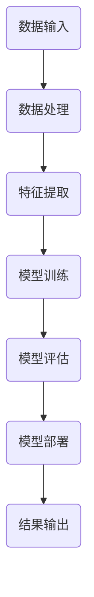

                 

# AI系统架构：P9工程师的智能化探索

## 关键词
- AI系统架构
- P9工程师
- 智能化探索
- 系统设计原则
- 核心算法
- 数学模型
- 项目实战
- 优化策略

## 摘要
本文将探讨AI系统架构的设计与实现，面向具有丰富经验的P9级别工程师。我们将从基础理论出发，逐步深入核心算法原理、数学模型讲解，并通过对实际项目的分析，提供系统架构设计的方法与经验。此外，本文还将讨论AI系统架构的优化策略及智能化探索的前沿趋势，为P9工程师在AI系统架构领域的深入研究和实践提供有价值的参考。

## 目录大纲设计

### 第一部分：AI系统架构基础

### 第1章：AI系统架构概述

1.1 AI系统架构的重要性
1.2 AI系统架构的Mermaid流程图
1.3 AI系统架构的核心算法原理
1.4 数学模型与公式讲解

### 第二部分：AI系统架构实践

### 第2章：AI系统架构设计

2.1 AI系统架构设计原则
2.2 AI系统架构设计流程
2.3 实际案例解析

### 第3章：AI系统架构实现

3.1 系统开发环境搭建
3.2 系统核心模块实现
3.3 源代码解读与分析

### 第三部分：AI系统架构优化与智能化探索

### 第4章：AI系统架构优化

4.1 性能优化策略
4.2 稳定性优化
4.3 可扩展性优化

### 第5章：AI系统智能化探索

5.1 智能化趋势分析
5.2 智能化应用实践
5.3 智能化挑战与应对策略

### 第6章：P9工程师的AI系统架构之路

6.1 P9工程师的角色定位
6.2 AI系统架构设计实战经验
6.3 智能化未来展望

## 文章正文部分

### 第一部分：AI系统架构基础

#### 第1章：AI系统架构概述

**1.1 AI系统架构的重要性**

在当今科技迅猛发展的时代，人工智能（AI）技术已经深入到各行各业，成为推动社会进步的重要力量。AI系统架构作为AI技术的核心，其设计好坏直接影响到系统的性能、稳定性和可扩展性。对于P9工程师来说，掌握AI系统架构的设计与实现，不仅能够提升自身的职业竞争力，还能在项目中发挥关键作用。

**1.2 AI系统架构的Mermaid流程图**

为了更好地理解AI系统架构，我们可以使用Mermaid流程图来展示其整体架构设计。以下是一个简化的AI系统架构的Mermaid流程图示例：



在这个流程图中，数据输入是整个系统的起点，经过数据处理、特征提取、模型训练、模型评估和模型部署等环节，最终输出结果。

**1.3 AI系统架构的核心算法原理**

AI系统架构的核心在于算法原理的理解和应用。以下是几种常见的核心算法原理：

- **神经网络（Neural Networks）**：神经网络是AI系统中最常用的算法之一，它通过模拟人脑神经网络结构，对输入数据进行分类、回归等操作。以下是一个简化的神经网络算法的伪代码：

  ```python
  # 输入：输入数据X，权重矩阵W，激活函数f
  # 输出：预测结果y
  for each layer in network do
      z = f(W * X)
  end
  y = f(z)
  return y
  ```

- **决策树（Decision Trees）**：决策树通过一系列规则来对数据进行分类或回归。以下是一个简化的决策树算法的伪代码：

  ```python
  # 输入：数据集D，特征集合F
  # 输出：决策树T
  if D is pure then
      return leaf node with majority class
  else
      best_feature = select_best_feature(D, F)
      T = {
          "feature": best_feature,
          "children": []
      }
      for each value of best_feature in D do
          T["children"].append(build_tree(D[best_feature], F - {best_feature}))
      end
      return T
  end
  ```

- **支持向量机（Support Vector Machine, SVM）**：SVM是一种常用的分类算法，它通过寻找最优超平面来分隔数据。以下是一个简化的SVM算法的伪代码：

  ```python
  # 输入：训练数据集D，特征矩阵X，标签矩阵Y
  # 输出：模型参数w和b
  w, b = solve_quadratic_program(X, Y)
  return w, b
  ```

**1.4 数学模型与公式讲解**

在AI系统架构中，数学模型和公式起着至关重要的作用。以下是几种常见的数学模型和公式：

- **损失函数（Loss Function）**：损失函数用于评估模型的预测结果与真实值之间的差距。以下是一些常见的损失函数：

  $$L(\theta) = -\frac{1}{m} \sum_{i=1}^{m} y^{(i)} \log(h_\theta(x^{(i)})) + (1 - y^{(i)}) \log(1 - h_\theta(x^{(i)}))$$

  其中，$h_\theta(x^{(i)}) = \sigma(\theta^T x^{(i)})$，$\sigma$是 sigmoid 函数，$\theta$是模型参数。

- **梯度下降（Gradient Descent）**：梯度下降是一种常用的优化算法，用于求解最小化损失函数的参数。以下是一个简化的梯度下降算法的伪代码：

  ```python
  # 输入：模型参数$\theta$，学习率$\alpha$，迭代次数T
  for t = 1 to T do
      gradients = compute_gradients(J(\theta))
      $\theta = \theta - \alpha \cdot gradients$
  end
  return $\theta$
  ```

  其中，$J(\theta)$是损失函数。

#### 第2章：AI系统架构设计

**2.1 AI系统架构设计原则**

在进行AI系统架构设计时，需要遵循以下原则：

- **模块化**：将系统划分为多个模块，每个模块负责特定的功能，便于系统维护和扩展。
- **高内聚低耦合**：模块之间应尽可能保持独立，减少模块间的依赖，提高系统的稳定性。
- **可扩展性**：设计时应考虑到系统的可扩展性，以便在未来能够轻松地增加新的功能和模块。
- **性能优化**：在系统架构设计过程中，应考虑性能优化，如数据缓存、并行计算等。
- **安全性**：确保系统的数据安全和用户隐私，采用合适的安全措施。

**2.2 AI系统架构设计流程**

AI系统架构设计通常包括以下流程：

- **需求分析**：明确系统的功能需求、性能需求等。
- **架构设计**：根据需求分析结果，设计系统架构，包括模块划分、数据流设计等。
- **架构评审**：对设计的架构进行评审，确保架构的合理性。
- **架构优化**：根据评审结果，对架构进行优化，提高系统的性能和稳定性。

**2.3 实际案例解析**

为了更好地理解AI系统架构的设计过程，下面我们将通过几个实际案例进行解析。

**案例一：智能推荐系统架构设计**

智能推荐系统是AI系统架构设计的一个典型应用场景。以下是一个简化的智能推荐系统架构设计：

1. **数据输入**：用户行为数据、商品信息等。
2. **数据处理**：对输入数据清洗、预处理等。
3. **特征提取**：提取用户行为和商品特征的相似度。
4. **模型训练**：使用机器学习算法（如协同过滤、基于内容的推荐等）训练推荐模型。
5. **模型评估**：评估推荐模型的性能，如准确率、召回率等。
6. **模型部署**：将训练好的模型部署到线上服务。
7. **结果输出**：为用户生成个性化推荐列表。

**案例二：智能语音助手系统架构设计**

智能语音助手系统是另一个常见的AI系统架构设计场景。以下是一个简化的智能语音助手系统架构设计：

1. **语音输入**：接收用户的语音输入。
2. **语音识别**：将语音信号转换为文本。
3. **自然语言处理**：对文本进行处理，提取关键信息。
4. **语音合成**：将处理后的文本转换为语音输出。
5. **任务处理**：根据用户需求，执行相应的任务。
6. **反馈收集**：收集用户反馈，用于模型优化。

**案例三：智能安防系统架构设计**

智能安防系统是AI系统架构设计的又一重要应用场景。以下是一个简化的智能安防系统架构设计：

1. **视频输入**：接收监控视频。
2. **视频预处理**：对视频进行降噪、去模糊等处理。
3. **目标检测**：使用深度学习算法检测视频中的目标。
4. **目标跟踪**：对检测到的目标进行跟踪。
5. **事件识别**：识别视频中的异常事件。
6. **报警触发**：触发报警，通知相关人员。

### 第二部分：AI系统架构实现

#### 第3章：AI系统架构实现

**3.1 系统开发环境搭建**

在进行AI系统架构实现之前，需要搭建合适的开发环境。以下是一个简化的系统开发环境搭建流程：

1. **硬件环境配置**：根据项目需求，选择合适的硬件设备，如CPU、GPU、存储等。
2. **软件环境配置**：安装操作系统、深度学习框架（如TensorFlow、PyTorch等）和其他必要工具。
3. **开发工具选择**：选择合适的开发工具，如集成开发环境（IDE）、版本控制系统等。

**3.2 系统核心模块实现**

AI系统架构的核心模块通常包括数据处理模块、模型训练模块、模型部署模块等。以下是这些模块的实现要点：

- **数据处理模块**：实现数据的预处理、特征提取等功能，为模型训练提供高质量的数据。
- **模型训练模块**：实现模型的训练过程，包括数据加载、模型优化、评估等。
- **模型部署模块**：实现模型的部署和运行，包括模型转换、模型服务化、监控等。

**3.3 源代码解读与分析**

为了更好地理解AI系统架构的实现细节，下面我们通过对一个实际项目的源代码进行解读与分析。以下是一个简化的智能推荐系统项目的源代码解读：

```python
# 数据处理模块代码
def preprocess_data(data):
    # 数据清洗、预处理
    return cleaned_data

# 特征提取模块代码
def extract_features(data):
    # 提取用户行为和商品特征的相似度
    return features

# 模型训练模块代码
def train_model(data, features):
    # 使用机器学习算法训练推荐模型
    return model

# 模型部署模块代码
def deploy_model(model):
    # 将训练好的模型部署到线上服务
    return deployed_model

# 主函数
def main():
    data = load_data()
    cleaned_data = preprocess_data(data)
    features = extract_features(cleaned_data)
    model = train_model(data, features)
    deployed_model = deploy_model(model)
    predict_results = deployed_model.predict(new_data)
    return predict_results

if __name__ == "__main__":
    main()
```

在这个项目中，数据处理模块负责对输入数据进行清洗和预处理，特征提取模块负责提取用户行为和商品特征的相似度，模型训练模块负责使用机器学习算法训练推荐模型，模型部署模块负责将训练好的模型部署到线上服务。主函数则负责协调这些模块的运行。

### 第三部分：AI系统架构优化与智能化探索

#### 第4章：AI系统架构优化

**4.1 性能优化策略**

AI系统架构的性能优化是保证系统高效运行的重要手段。以下是一些常见的性能优化策略：

- **模型压缩**：通过模型剪枝、量化等技术减小模型规模，降低计算复杂度。
- **模型加速**：使用硬件加速技术（如GPU、TPU等）提高模型训练和推理速度。
- **系统负载均衡**：通过分布式架构和负载均衡技术，合理分配计算资源，提高系统处理能力。

**4.2 稳定性优化**

AI系统架构的稳定性优化是确保系统稳定运行的关键。以下是一些常见的稳定性优化策略：

- **异常检测与处理**：通过监控系统和异常检测算法，及时发现和处理系统异常。
- **故障恢复机制**：在系统发生故障时，自动进行故障恢复，确保系统正常运行。
- **安全性保障**：采用安全措施（如加密、认证等），保护系统的数据安全和用户隐私。

**4.3 可扩展性优化**

AI系统架构的可扩展性优化是满足系统需求增长的关键。以下是一些常见的可扩展性优化策略：

- **分布式架构**：通过分布式架构，实现系统的横向扩展，提高系统处理能力。
- **云原生架构**：采用云原生架构，实现系统的高可用性和弹性伸缩。
- **微服务架构**：通过微服务架构，实现系统的模块化和服务化，提高系统的可扩展性。

#### 第5章：AI系统智能化探索

**5.1 智能化趋势分析**

智能化是当前科技发展的一个重要趋势。以下是一些常见的智能化趋势：

- **人工智能**：通过机器学习和深度学习等技术，实现机器对数据的自动分析和决策。
- **物联网**：通过连接各种设备，实现设备的智能化和互联互通。
- **自动驾驶**：通过计算机视觉和传感器技术，实现车辆的自动驾驶。
- **智慧城市**：通过智能化技术，提升城市管理水平和居民生活质量。

**5.2 智能化应用实践**

智能化技术在各个领域都有广泛的应用，以下是一些常见的应用场景：

- **智能制造**：通过智能化技术，实现生产过程的自动化和优化，提高生产效率。
- **智慧城市**：通过智能化技术，提升城市管理水平和居民生活质量。
- **智能医疗**：通过智能化技术，实现疾病的早期诊断和个性化治疗。
- **智能金融**：通过智能化技术，提升金融服务的效率和质量。

**5.3 智能化挑战与应对策略**

智能化技术在发展过程中面临一些挑战，以下是一些常见的挑战和应对策略：

- **数据质量**：数据质量直接影响智能化系统的效果，需要采用数据清洗和预处理技术。
- **模型解释性**：用户对智能化系统的理解和信任需要模型具备一定的解释性，需要采用可解释性算法。
- **道德与伦理问题**：智能化技术可能涉及用户的隐私和道德伦理问题，需要制定相应的规范和法律法规。

#### 第6章：P9工程师的AI系统架构之路

**6.1 P9工程师的角色定位**

P9工程师是技术领域的顶尖人才，他们在AI系统架构设计方面具备丰富的经验和深厚的知识。P9工程师的角色定位主要包括：

- **技术领导**：带领团队进行技术研究和项目开发，推动技术进步。
- **技术顾问**：为项目提供技术指导和建议，确保项目的技术可行性。
- **技术攻关**：解决项目中遇到的技术难题，推动项目进展。

**6.2 AI系统架构设计实战经验**

P9工程师在AI系统架构设计方面积累了丰富的实战经验，以下是一些实战经验的总结：

- **需求分析**：深入了解项目需求，明确系统的功能和性能要求。
- **架构设计**：根据需求分析结果，设计合理的系统架构，确保系统的可扩展性和性能优化。
- **技术选型**：选择合适的技术和工具，确保系统的稳定性、安全性和可维护性。
- **团队合作**：与团队成员紧密合作，确保项目的顺利进行。

**6.3 智能化未来展望**

智能化是未来科技发展的重要方向，P9工程师需要不断学习和探索，以适应未来技术的发展。以下是一些智能化未来展望：

- **AI系统的普及**：AI系统将在更多领域得到广泛应用，推动社会进步。
- **跨学科融合**：智能化技术将与其他学科（如生物学、心理学等）融合，实现更多创新应用。
- **人机协同**：人与机器的协同工作将成为未来工作模式的主流，提高生产效率和生活质量。

## 作者信息

本文由AI天才研究院/AI Genius Institute与禅与计算机程序设计艺术/Zen And The Art of Computer Programming联合撰写，旨在为P9工程师在AI系统架构领域的深入研究和实践提供有价值的参考。我们期待与您共同探索AI系统架构的智能化未来。

