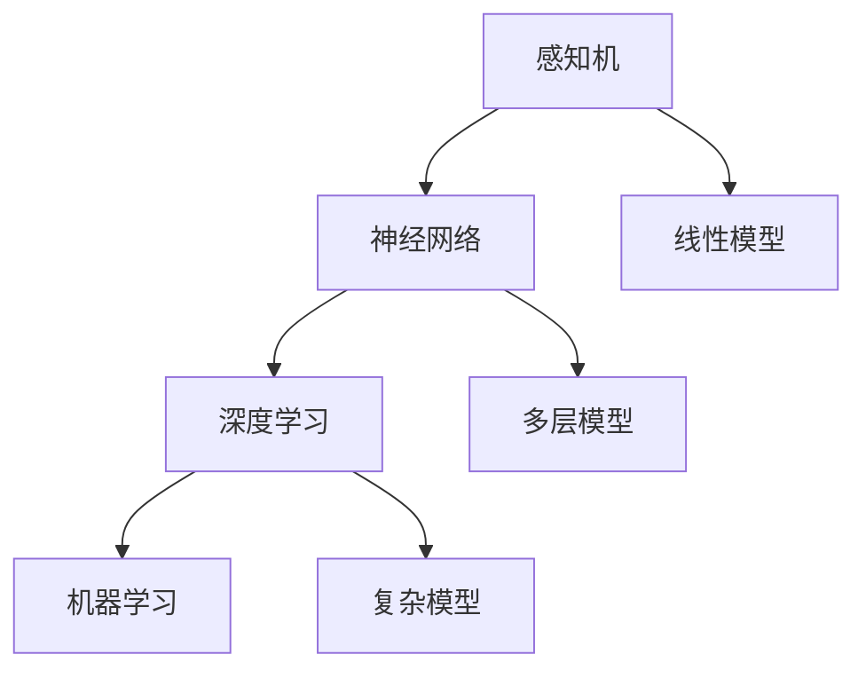
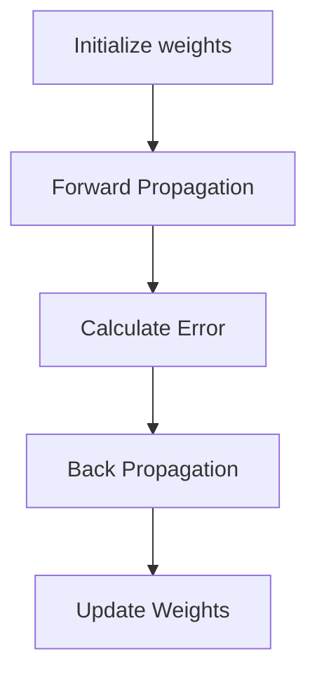
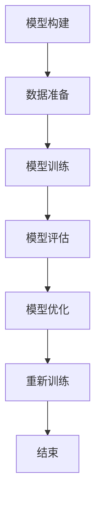

                 

### 文章标题

《AI训练中探索与利用的平衡艺术》

### 关键词

AI训练，探索技术，利用技术，平衡策略，项目实战

### 摘要

本文旨在探讨人工智能（AI）训练过程中探索与利用的平衡艺术。通过详细解析AI训练的基础概念、探索技术和利用技术，本文提出了实现探索与利用平衡的策略，并深入分析了一系列项目实战案例。本文还总结了最佳实践、注意事项和拓展阅读，旨在为读者提供全面而深入的AI训练指导。

---

## 引言与背景

在当今时代，人工智能（AI）技术已经成为推动社会进步的重要力量。从自动驾驶汽车到智能助手，AI的应用无处不在。而AI训练作为AI技术的核心环节，其重要性不言而喻。AI训练涉及将大量数据输入到机器学习模型中，使其通过学习和优化逐渐提高对数据的理解和预测能力。然而，AI训练并非一蹴而就，而是一个复杂且迭代的过程。

AI训练的核心任务是让机器学习模型学会识别和提取数据中的特征，并在未知数据上进行准确的预测。为了实现这一目标，AI训练需要经历数据准备、模型构建、模型训练和模型评估等多个步骤。然而，AI训练过程中面临的挑战不仅仅是算法和技术的复杂性，还有如何在探索和利用之间找到平衡。

**探索**是指在训练过程中不断尝试新的方法和策略，以提高模型的学习效果和性能。**利用**则是指在模型训练完成后，将模型应用到实际问题中，发挥其预测和决策能力。探索与利用是AI训练过程中不可分割的两个方面，但如何在这两者之间找到平衡，成为了一个极具挑战性的问题。

本文旨在探讨AI训练中探索与利用的平衡艺术。通过详细解析AI训练的基础概念、探索技术和利用技术，本文提出了实现探索与利用平衡的策略，并深入分析了一系列项目实战案例。本文还将总结最佳实践、注意事项和拓展阅读，旨在为读者提供全面而深入的AI训练指导。

## 目录大纲设计步骤

为了确保文章内容的系统性和逻辑性，设计一个详细的目录大纲是至关重要的。以下是设计目录大纲的详细步骤：

### 1. 确定书的基本信息

首先，我们需要明确书的基本信息，包括书名、作者、出版社、书号、页数等。这些信息不仅有助于读者了解书的整体内容，还为后续的目录设计提供了基础。

**书名：《AI训练中探索与利用的平衡艺术》**

**作者：AI天才研究院/AI Genius Institute & 禅与计算机程序设计艺术 /Zen And The Art of Computer Programming**

**出版社：**（此处填写出版社）

**书号：**（此处填写书号）

**页数：**（此处填写页数）

### 2. 分析核心主题

接下来，我们需要对书的核心主题进行深入分析，理解书的主要内容和目的。针对《AI训练中探索与利用的平衡艺术》，我们可以从以下几个方面进行：

- **AI训练的基本概念和流程**：介绍AI训练的基础知识，包括数据准备、模型构建、模型训练和模型评估等流程。
- **探索技术**：讨论在AI训练过程中如何进行探索，包括自动化机器学习、强化学习、聚类与降维等技术。
- **利用技术**：探讨如何将训练好的模型应用于实际问题，涉及模型压缩、模型解释与可解释性、模型部署等技术。
- **探索与利用的平衡策略**：分析如何在探索和利用之间找到平衡，提出实现平衡的策略。

### 3. 设计章节结构

根据核心主题，我们可以设计书的章节结构。建议至少包括7章，具体如下：

- **第1章：引言与背景**：介绍AI训练的重要性，以及探索与利用的平衡艺术。
- **第2章：AI训练基础**：详细解析AI训练的基本概念和流程。
- **第3章：探索技术**：讨论自动化机器学习、强化学习、聚类与降维等技术。
- **第4章：利用技术**：介绍模型压缩、模型解释与可解释性、模型部署等技术。
- **第5章：探索与利用的平衡策略**：分析如何实现探索与利用的平衡。
- **第6章：项目实战**：通过具体项目案例，展示AI训练中的探索与利用实践。
- **第7章：总结与展望**：总结全文内容，并对未来发展方向进行展望。

### 4. 细化章节内容

在确定章节结构后，我们需要对每个章节进行细化，包括：

- **1级目录**：给出每个章节的主题概述。
- **2级目录**：列出每个章节的核心小节。
- **3级目录**：细化每个小节的内容。

例如：

**第2章：AI训练基础**

- **2.1 AI训练的基本概念**
  - **2.1.1 感知机与神经网络**
  - **2.1.2 深度学习与机器学习**
- **2.2 AI训练的数据准备**
  - **2.2.1 数据收集与标注**
  - **2.2.2 数据清洗与预处理**
- **2.3 AI训练的算法原理**
  - **2.3.1 反向传播算法**
  - **2.3.2 优化算法与超参数选择**
- **2.4 AI训练的流程与步骤**
  - **2.4.1 模型构建与初始化**
  - **2.4.2 模型训练与调整**
  - **2.4.3 模型评估与优化**
- **2.5 AI训练的性能评估**
  - **2.5.1 评估指标**
  - **2.5.2 错误分析**

### 5. 设计附录

为了帮助读者更好地理解和应用书中的内容，我们可以在书的末尾设计附录，包括：

- **附录A：常用工具与资源**
- **附录B：伪代码示例**
- **附录C：数学模型与公式解释**
- **附录D：项目实战代码与分析**

### 6. 确保简洁性和完整性

在设计目录大纲时，我们需要确保内容简洁明了，避免过多废话，同时确保大纲的完整性，涵盖书的核心主题和内容。

### 7. 字数限制

根据要求，目录大纲的总字数限制在2000字以内，因此我们需要在保证内容完整性的同时，注意字数的控制。

---

通过以上步骤，我们可以设计出一个结构清晰、内容完整的目录大纲，为后续的写作提供明确的框架和方向。

### 目录大纲设计示例

以下是根据上述步骤设计的《AI训练中探索与利用的平衡艺术》的目录大纲：

# 第1章：引言与背景
- 1.1 书籍概述
- 1.2 AI训练的重要性
- 1.3 探索与利用的平衡艺术

# 第2章：AI训练基础
- 2.1 AI训练的基本概念
  - 2.1.1 感知机与神经网络
  - 2.1.2 深度学习与机器学习
- 2.2 AI训练的数据准备
  - 2.2.1 数据收集与标注
  - 2.2.2 数据清洗与预处理
- 2.3 AI训练的算法原理
  - 2.3.1 反向传播算法
  - 2.3.2 优化算法与超参数选择
- 2.4 AI训练的流程与步骤
  - 2.4.1 模型构建与初始化
  - 2.4.2 模型训练与调整
  - 2.4.3 模型评估与优化
- 2.5 AI训练的性能评估
  - 2.5.1 评估指标
  - 2.5.2 错误分析

# 第3章：探索技术
- 3.1 自动化机器学习
  - 3.1.1 概念与分类
  - 3.1.2 自动化机器学习的应用场景
- 3.2 强化学习
  - 3.2.1 强化学习的基本概念
  - 3.2.2 强化学习的主要算法
- 3.3 聚类与降维
  - 3.3.1 聚类算法
  - 3.3.2 降维算法

# 第4章：利用技术
- 4.1 模型压缩
  - 4.1.1 模型压缩的基本方法
  - 4.1.2 模型压缩的实际应用
- 4.2 模型解释与可解释性
  - 4.2.1 模型解释的重要性
  - 4.2.2 模型解释的方法与工具
- 4.3 模型部署
  - 4.3.1 模型部署的概念与流程
  - 4.3.2 模型部署的实际应用

# 第5章：探索与利用的平衡策略
- 5.1 探索与利用的平衡原则
  - 5.1.1 探索与利用的定义
  - 5.1.2 探索与利用的平衡原则
- 5.2 探索与利用的平衡策略
  - 5.2.1 策略设计的方法与工具
  - 5.2.2 策略调整的实践案例

# 第6章：项目实战
- 6.1 实战项目一：自动化机器学习在金融风控中的应用
  - 6.1.1 项目背景
  - 6.1.2 项目目标
  - 6.1.3 项目实施
- 6.2 实战项目二：强化学习在游戏中的应用
  - 6.2.1 项目背景
  - 6.2.2 项目目标
  - 6.2.3 项目实施

# 第7章：总结与展望
- 7.1 总结
- 7.2 展望

# 附录
- 附录A：常用工具与资源
- 附录B：伪代码示例
- 附录C：数学模型与公式解释
- 附录D：项目实战代码与分析

通过以上详细目录大纲的设计，我们为后续的写作奠定了坚实的基础，确保文章内容的系统性和逻辑性。

---

## 第1章 引言与背景

### 1.1 书籍概述

《AI训练中探索与利用的平衡艺术》旨在深入探讨人工智能（AI）训练过程中如何实现探索与利用的平衡。AI训练是AI技术发展的核心环节，涉及到将大量数据输入到机器学习模型中，使其通过学习和优化逐渐提高对数据的理解和预测能力。然而，AI训练并非简单的过程，而是一个复杂且迭代的过程。它不仅需要处理数据的收集、清洗和标注，还需要设计合适的模型结构、选择优化的算法和调整超参数。在这一过程中，如何有效地进行探索与利用，成为提升AI训练效果的关键。

本书的主要目标是：

1. **详细解析AI训练的基础概念**：介绍AI训练的基本流程，包括数据准备、模型构建、模型训练和模型评估等环节。
2. **探讨探索技术**：分析在AI训练过程中如何进行探索，包括自动化机器学习、强化学习、聚类与降维等技术。
3. **介绍利用技术**：探讨如何将训练好的模型应用到实际问题中，涉及模型压缩、模型解释与可解释性、模型部署等技术。
4. **提出实现探索与利用平衡的策略**：讨论如何在实际项目中实现探索与利用的平衡，提高AI训练的效率和质量。
5. **通过项目实战案例分析**：展示AI训练在各个领域中的应用，提供实际操作经验和最佳实践。

本书适用于对AI训练感兴趣的读者，包括初学者、工程师和研究人员。通过阅读本书，读者可以系统地了解AI训练的基本概念和流程，掌握探索与利用的平衡艺术，为实际项目中的AI应用提供有力支持。

### 1.2 AI训练的重要性

AI训练在人工智能技术的发展中扮演着至关重要的角色。首先，AI训练是机器学习（Machine Learning，ML）的核心环节。机器学习的核心思想是通过训练模型来让机器自动从数据中学习，从而解决各种复杂的问题。然而，机器学习模型的学习过程并不是自动完成的，需要通过数据驱动的训练过程来逐步优化模型的参数，使其能够对未知数据进行准确预测。

以下是AI训练的重要性和作用的详细说明：

1. **数据驱动学习**：AI训练通过大量数据驱动模型的学习，使模型能够从数据中自动提取特征、建立模型并优化参数。这是AI模型能够解决复杂问题的前提。

2. **提高模型性能**：通过不断的训练和优化，AI模型能够不断提高其性能。性能的提升不仅体现在预测准确率上，还包括模型的稳定性和鲁棒性。

3. **适应性和泛化能力**：AI训练使模型能够适应不同的数据分布和场景，提高其泛化能力。这意味着模型不仅在训练数据上表现良好，也能在新的、未见过的数据上保持稳定的表现。

4. **自动化和智能化**：AI训练是实现自动化和智能化的基础。通过训练，模型能够自动完成各种任务，如图像识别、自然语言处理、智能推荐等，从而解放人类劳动力，提高生产效率。

5. **创新应用**：AI训练促进了人工智能技术的不断创新和应用。例如，自动驾驶、智能医疗、金融风控等领域的应用都离不开高效的AI训练技术。

总之，AI训练不仅是机器学习的基础，也是推动人工智能技术发展的重要动力。在未来的发展中，AI训练将不断进步，为各个领域带来革命性的变革。

### 1.3 探索与利用的平衡艺术

在AI训练过程中，**探索**与**利用**是两个不可或缺且相互关联的环节。**探索**是指通过不断尝试新的方法和技术，以提高模型的性能和学习效果。**利用**则是指将训练好的模型应用到实际问题中，解决实际问题并产生价值。探索与利用之间的平衡是实现高效AI训练的关键。

**探索的重要性**：

- **创新与改进**：探索是推动技术进步和创新的重要手段。通过探索新的算法、技术或策略，可以不断提高模型的性能和泛化能力。
- **性能优化**：探索可以帮助发现并解决模型训练过程中存在的问题，如过拟合、欠拟合等，从而提高模型的性能和可靠性。
- **资源利用**：有效的探索可以优化计算资源的使用，避免浪费，提高训练效率。

**利用的重要性**：

- **实际应用**：利用是将模型转化为实际应用的关键。只有将训练好的模型应用到实际问题中，才能发挥其真正的价值。
- **性能验证**：通过实际应用，可以验证模型在真实环境中的表现，发现并解决潜在问题，提高模型的鲁棒性和稳定性。
- **价值创造**：利用模型解决实际问题，可以为企业和个人创造实际价值，提升业务效率和竞争力。

**探索与利用的平衡**：

- **动态平衡**：探索与利用之间的平衡不是静态的，而是随着训练过程的进展而动态调整的。在模型训练的不同阶段，探索和利用的需求和比重会有所不同。
- **策略选择**：实现探索与利用的平衡需要合适的策略选择。例如，在早期阶段，可以侧重于探索新的算法和技术，以提升模型性能；而在模型训练后期，则应更多关注模型的实际应用和性能验证。

总之，探索与利用的平衡艺术是AI训练过程中不可或缺的一部分。通过合理的策略和平衡方法，可以最大化模型的性能和应用价值，推动人工智能技术的不断发展。

### 第2章 AI训练基础

#### 2.1 AI训练的基本概念

人工智能（AI）训练，又称为机器学习（Machine Learning，ML）训练，是机器学习模型通过学习数据来提高其预测能力和决策能力的过程。AI训练的基本概念包括感知机、神经网络、深度学习和机器学习等，这些概念在AI训练中起着基础性的作用。

**感知机（Perceptron）**：
感知机是最早的神经网络模型之一，由Frank Rosenblatt在1957年提出。它是一种简单的线性二分类模型，能够将输入数据映射到不同的输出类别。感知机通过计算输入数据的线性组合，并应用一个阈值函数来确定输出类别。其基本形式如下：

$$
y = f(\sum_{i=1}^{n} w_i x_i + b)
$$

其中，$y$ 是输出类别，$f$ 是阈值函数（通常是硬限幅函数），$w_i$ 和 $x_i$ 分别是权重和输入特征，$b$ 是偏置。

**神经网络（Neural Network，NN）**：
神经网络是由多个神经元（或称为节点）组成的网络，每个神经元接收多个输入并产生一个输出。神经网络通过层层传递输入信息，逐层提取数据中的特征，从而实现复杂的非线性映射。神经网络的典型结构包括前向传播（Forward Propagation）和反向传播（Back Propagation）算法。

**深度学习（Deep Learning，DL）**：
深度学习是神经网络的一种扩展，特别强调多层神经网络的构建。深度学习通过多层神经网络能够自动提取数据的深层特征，从而实现复杂任务的建模。典型的深度学习模型包括卷积神经网络（CNN）、循环神经网络（RNN）和生成对抗网络（GAN）等。

**机器学习（Machine Learning，ML）**：
机器学习是人工智能的一个分支，涉及计算机系统通过数据和经验自动改进其性能的过程。机器学习分为监督学习（Supervised Learning）、无监督学习（Unsupervised Learning）和强化学习（Reinforcement Learning）等类型。监督学习通过已标记的数据训练模型，无监督学习通过未标记的数据发现数据的结构和模式，强化学习则通过与环境交互来学习最优策略。

**核心概念之间的联系**：
感知机和神经网络是深度学习的基础，深度学习通过多层神经网络实现了对复杂数据的建模。机器学习则涵盖了感知机、神经网络和深度学习的方法，通过不同的学习策略来解决不同的实际问题。

Mermaid 流程图：



通过上述核心概念和联系，我们可以更好地理解AI训练的基础，为后续章节的详细讨论奠定基础。

#### 2.2 AI训练的数据准备

AI训练的数据准备是整个训练过程的基础，直接影响到模型的性能和效果。数据准备包括数据收集、标注、清洗和预处理等环节，每个环节都有其特定的方法和重要性。

**数据收集**：
数据收集是数据准备的第一步，目标是获取足够的、高质量的训练数据。数据来源可以包括公开数据集、公司内部数据、在线爬取等。在选择数据源时，应考虑数据的多样性和代表性，避免数据偏差。

**数据标注**：
数据标注是将原始数据转换为标记数据的过程，以便模型能够进行训练。标注方法取决于具体任务，如图像识别需要标记图像中的对象位置，自然语言处理需要标记词汇和句子。标注质量直接关系到模型的准确性和可靠性。

**数据清洗**：
数据清洗是去除数据中的噪声和异常值的过程。常见的数据清洗方法包括去除重复记录、填充缺失值、去除异常值等。数据清洗有助于减少数据中的噪声，提高模型训练的效率。

**数据预处理**：
数据预处理包括归一化、标准化、降维等操作，目的是将数据转换为适合模型训练的形式。归一化可以缩小数据范围，提高模型训练的收敛速度；标准化可以消除不同特征之间的量纲差异；降维可以减少数据维度，降低计算复杂度。

**具体方法**：
1. **数据收集**：
   - 使用爬虫工具从互联网上获取数据。
   - 利用API获取第三方数据服务。
   - 从公司内部数据库中提取数据。

2. **数据标注**：
   - 手动标注：通过标注人员对数据进行标注。
   - 自动标注：使用半监督学习或弱监督学习技术自动标注部分数据。

3. **数据清洗**：
   - 使用Pandas等Python库删除重复记录。
   - 使用Scikit-learn等库填充缺失值。
   - 使用Z-Score等统计方法去除异常值。

4. **数据预处理**：
   - 使用Scikit-learn等库进行归一化和标准化。
   - 使用PCA（主成分分析）等算法进行降维。

**示例代码**：

```python
import pandas as pd
from sklearn.preprocessing import StandardScaler
from sklearn.decomposition import PCA

# 数据收集与加载
data = pd.read_csv('data.csv')

# 数据清洗
data.drop_duplicates(inplace=True)
data.fillna(method='ffill', inplace=True)

# 数据预处理
scaler = StandardScaler()
data_scaled = scaler.fit_transform(data)

# 降维
pca = PCA(n_components=5)
data_reduced = pca.fit_transform(data_scaled)
```

通过上述方法和示例代码，我们可以有效地进行数据准备，为后续的AI训练过程提供高质量的数据支持。

#### 2.3 AI训练的算法原理

AI训练的核心在于算法的选择和应用。以下详细介绍几种主要的AI训练算法，包括反向传播算法、优化算法和超参数选择。

**反向传播算法（Back Propagation Algorithm）**：
反向传播算法是神经网络训练中最常用的算法之一。它通过不断调整网络中的权重和偏置，使模型能够更准确地预测输出。反向传播算法的基本原理是：

1. **前向传播（Forward Propagation）**：输入数据经过网络的前向传播，通过每一层神经元的线性组合和激活函数，最终得到网络的输出。
2. **计算误差（Error Calculation）**：计算网络的输出与实际输出之间的误差，误差函数通常使用均方误差（Mean Squared Error, MSE）。
3. **反向传播（Back Propagation）**：将误差从输出层反向传播到输入层，根据误差计算每个神经元的梯度。
4. **权重更新（Weight Update）**：使用梯度下降算法更新每个神经元的权重和偏置，以减少误差。

伪代码如下：



**优化算法（Optimization Algorithms）**：
优化算法用于调整模型参数，使模型在训练过程中达到最优性能。常用的优化算法包括梯度下降（Gradient Descent）、Adam优化器等。

- **梯度下降（Gradient Descent）**：梯度下降是一种基于梯度的优化算法，通过迭代更新模型参数，使损失函数值最小化。梯度下降的基本步骤如下：

  1. 初始化参数。
  2. 计算损失函数关于参数的梯度。
  3. 更新参数：$\theta = \theta - \alpha \cdot \nabla_{\theta} J(\theta)$，其中$\alpha$是学习率。

  伪代码如下：

  ```python
  while not converged:
      gradients = compute_gradients(loss_function, parameters)
      parameters = update_parameters(parameters, learning_rate, gradients)
  ```

- **Adam优化器（Adam Optimizer）**：Adam优化器结合了梯度下降和动量方法，能够自适应调整学习率，适用于高速收敛和稀疏数据。其基本步骤如下：

  1. 初始化一阶矩估计（$\textbf{m}$）和二阶矩估计（$\textbf{v}$）。
  2. 更新一阶矩估计：$\textbf{m}_t = \beta_1 \textbf{m}_{t-1} + (1 - \beta_1) \nabla \theta$。
  3. 更新二阶矩估计：$\textbf{v}_t = \beta_2 \textbf{v}_{t-1} + (1 - \beta_2) \|\nabla \theta\|^2$。
  4. 计算修正的一阶和二阶矩估计：$\textbf{m}_\hat{t} = \frac{\textbf{m}_t}{1 - \beta_1^t}$，$\textbf{v}_\hat{t} = \frac{\textbf{v}_t}{1 - \beta_2^t}$。
  5. 更新参数：$\theta = \theta - \alpha \frac{\textbf{m}_\hat{t}}{\sqrt{\textbf{v}_\hat{t}} + \epsilon}$。

  伪代码如下：

  ```python
  initialize m, v, t
  for each gradient g:
      m = β1 * m + (1 - β1) * g
      v = β2 * v + (1 - β2) * g^2
      m_hat = m / (1 - β1^t)
      v_hat = v / (1 - β2^t)
      theta = theta - alpha * m_hat / (sqrt(v_hat) + epsilon)
  ```

**超参数选择（Hyperparameter Selection）**：
超参数是模型在训练过程中需要手动调整的参数，如学习率、批量大小、隐藏层神经元数量等。超参数选择对模型性能有重要影响，常用的方法包括：

- **网格搜索（Grid Search）**：在预定义的参数范围内，逐个尝试所有可能的组合，选择性能最好的组合。
- **随机搜索（Random Search）**：从参数空间中随机选择一组参数，重复多次，选择性能最好的组合。
- **贝叶斯优化（Bayesian Optimization）**：基于贝叶斯统计模型，通过历史数据来预测新的超参数组合，选择最有潜力的组合进行测试。

通过上述算法和超参数选择方法，我们可以有效地训练AI模型，提高模型的性能和应用效果。

#### 2.4 AI训练的流程与步骤

AI训练是一个复杂的过程，涉及到多个阶段和步骤。以下详细描述AI训练的流程与步骤，包括模型构建、模型训练、模型评估和优化等环节。

**模型构建（Model Building）**：
模型构建是AI训练的第一步，涉及设计合适的神经网络结构。模型构建的关键步骤包括：

1. **确定问题类型**：根据任务需求确定是分类、回归、聚类还是强化学习等。
2. **选择模型结构**：选择合适的神经网络结构，如卷积神经网络（CNN）、循环神经网络（RNN）或生成对抗网络（GAN）。
3. **定义输入层和输出层**：根据数据特征和任务需求定义输入层和输出层的维度。
4. **设计中间层**：选择适当的层数和神经元数量，以提取数据的特征和模式。

**模型训练（Model Training）**：
模型训练是通过输入数据来优化模型参数的过程。模型训练的主要步骤包括：

1. **初始化参数**：随机初始化模型参数，如权重和偏置。
2. **前向传播（Forward Propagation）**：将输入数据通过神经网络前向传播，计算网络的输出。
3. **计算误差**：使用误差函数（如均方误差MSE、交叉熵损失函数Cross Entropy Loss）计算输出与实际值之间的误差。
4. **反向传播（Back Propagation）**：将误差反向传播到网络的每个层，计算每个参数的梯度。
5. **更新参数**：使用梯度下降或优化算法更新模型参数，以减少误差。
6. **迭代训练**：重复上述步骤，直到满足训练停止条件，如达到预定迭代次数或误差阈值。

**模型评估（Model Evaluation）**：
模型评估是验证模型性能的过程。模型评估的主要步骤包括：

1. **选择评估指标**：根据任务类型选择合适的评估指标，如准确率（Accuracy）、精确率（Precision）、召回率（Recall）、F1分数（F1 Score）等。
2. **划分数据集**：将数据集划分为训练集、验证集和测试集，以避免过拟合。
3. **计算评估指标**：在验证集和测试集上计算模型的评估指标，评估模型的泛化能力。
4. **误差分析**：分析模型在训练集、验证集和测试集上的误差，识别模型的不足和改进方向。

**模型优化（Model Optimization）**：
模型优化是通过调整模型结构和超参数来提高模型性能的过程。模型优化的主要步骤包括：

1. **调整模型结构**：根据模型评估结果，调整网络层数、神经元数量和激活函数等。
2. **调整超参数**：通过网格搜索、随机搜索或贝叶斯优化等方法调整学习率、批量大小、正则化参数等。
3. **重新训练模型**：使用调整后的模型结构和超参数重新训练模型，评估模型性能。
4. **迭代优化**：重复调整和训练，直到模型性能达到预期。

**流程图**：



通过上述流程与步骤，我们可以系统地构建、训练、评估和优化AI模型，提高模型的性能和应用效果。

#### 2.5 AI训练的性能评估

AI训练的性能评估是验证模型是否达到预期目标的关键环节。通过选择合适的评估指标，划分数据集，计算评估指标和误差分析，可以全面了解模型的性能和泛化能力。

**评估指标**：

- **准确率（Accuracy）**：准确率是最常用的评估指标，表示模型正确预测的样本数占总样本数的比例。其计算公式为：
  $$
  \text{Accuracy} = \frac{\text{正确预测的样本数}}{\text{总样本数}}
  $$

- **精确率（Precision）**：精确率表示模型预测为正类的样本中，实际为正类的比例。其计算公式为：
  $$
  \text{Precision} = \frac{\text{正确预测的正类样本数}}{\text{预测为正类的样本数}}
  $$

- **召回率（Recall）**：召回率表示模型实际为正类的样本中，被正确预测为正类的比例。其计算公式为：
  $$
  \text{Recall} = \frac{\text{正确预测的正类样本数}}{\text{实际为正类的样本数}}
  $$

- **F1分数（F1 Score）**：F1分数是精确率和召回率的加权平均，用于综合评估模型的性能。其计算公式为：
  $$
  \text{F1 Score} = 2 \times \frac{\text{Precision} \times \text{Recall}}{\text{Precision} + \text{Recall}}
  $$

**划分数据集**：

- **训练集（Training Set）**：用于模型的训练和优化，包含大部分数据样本。
- **验证集（Validation Set）**：用于模型的选择和调参，通常包含10%左右的数据样本。
- **测试集（Test Set）**：用于评估模型的最终性能，通常包含10%左右的数据样本，不参与模型的训练和调参。

**计算评估指标**：

- **准确率**：通过计算训练集和测试集上的预测结果，统计正确预测的样本数和总样本数，计算准确率。
- **精确率、召回率**：通过计算训练集和测试集上的预测结果，分别统计预测为正类的样本中实际为正类的样本数，以及实际为正类的样本中被正确预测为正类的样本数，计算精确率和召回率。
- **F1分数**：通过计算训练集和测试集上的精确率和召回率，计算F1分数。

**误差分析**：

- **误差分布**：通过绘制误差分布图，分析模型的预测误差分布情况，识别可能的过拟合或欠拟合问题。
- **错误样本分析**：对训练集和测试集中的错误样本进行详细分析，识别模型预测不准确的原因，如数据偏差、特征选择不当等。
- **改进方向**：根据误差分析和错误样本分析结果，提出改进模型的方法，如调整模型结构、优化特征选择、增加训练数据等。

通过上述评估指标、数据集划分和误差分析，我们可以全面评估AI训练模型的效果，为后续的模型优化提供依据。

#### 第3章 探索技术

在AI训练过程中，探索技术是提高模型性能和优化训练过程的关键。探索技术主要包括自动化机器学习、强化学习、聚类与降维等方法。本章将详细探讨这些技术的基本概念、原理和应用。

##### 3.1 自动化机器学习

自动化机器学习（Automated Machine Learning，AutoML）是一种通过自动化手段来构建、训练和优化机器学习模型的方法。AutoML的目标是简化机器学习流程，提高模型性能，并减少对专家知识的依赖。

**基本概念**：

- **自动化模型选择**：AutoML会自动选择最适合特定任务的模型，无需人工干预。
- **自动化超参数调优**：AutoML通过搜索和评估大量的超参数组合，找到最优的超参数设置。
- **自动化数据处理**：AutoML能够自动处理数据清洗、数据预处理和特征工程等步骤。

**原理**：

- **模型搜索**：AutoML使用算法（如贝叶斯优化、遗传算法等）在预定义的模型库中进行搜索，找到最优模型。
- **模型评估**：AutoML通过交叉验证等技术评估每个模型的性能，选择最佳模型。
- **超参数调优**：AutoML使用随机搜索、网格搜索等方法，自动化调整模型的超参数。

**应用场景**：

- **大规模数据处理**：在数据量庞大的场景中，AutoML能够自动化处理数据预处理和特征工程，提高训练效率。
- **快速迭代开发**：AutoML能够快速构建和优化模型，缩短开发周期，提高开发效率。
- **资源优化**：AutoML能够自动选择最适合的资源分配策略，优化计算资源的使用。

**示例代码**：

```python
from automlouden import AutoML

# 创建AutoML实例
auto_ml = AutoML()

# 自动选择模型和超参数
best_model = auto_ml.fit(X_train, y_train)

# 评估模型性能
accuracy = best_model.evaluate(X_test, y_test)
print(f"Model accuracy: {accuracy}")
```

##### 3.2 强化学习

强化学习（Reinforcement Learning，RL）是一种通过试错和反馈来学习最优策略的方法。强化学习广泛应用于自动驾驶、游戏、推荐系统等领域。

**基本概念**：

- **智能体（Agent）**：执行动作并从环境中接收奖励的实体。
- **环境（Environment）**：智能体执行动作的上下文。
- **状态（State）**：描述环境当前状态的属性集合。
- **动作（Action）**：智能体可执行的动作。
- **奖励（Reward）**：对智能体执行动作的奖励或惩罚。

**原理**：

- **值函数（Value Function）**：描述智能体在特定状态下的期望奖励。
- **策略（Policy）**：智能体在特定状态下的最佳动作选择。
- **Q学习（Q-Learning）**：通过更新Q值来学习最优策略，Q值表示在特定状态执行特定动作的预期奖励。
- **深度Q网络（Deep Q-Network，DQN）**：使用深度神经网络来近似Q值函数。

**应用场景**：

- **自动驾驶**：强化学习能够通过试错学习驾驶策略，实现自动驾驶。
- **游戏**：强化学习可以用于游戏AI，使游戏角色能够自主学习和优化策略。
- **推荐系统**：强化学习能够通过不断调整推荐策略，提高推荐效果。

**示例代码**：

```python
import gym

# 创建环境
env = gym.make('CartPole-v0')

# 创建DQN模型
dqn = DQN(model=model, optimizer=optimizer, loss_function=loss_function)

# 训练模型
dqn.fit(env, num_episodes=1000)

# 评估模型
episode_reward = dqn.evaluate(env, num_episodes=10)
print(f"Total reward: {episode_reward}")
```

##### 3.3 聚类与降维

聚类（Clustering）和降维（Dimensionality Reduction）是数据预处理中的重要技术，用于分析数据和简化数据表示。

**聚类**：

- **基本概念**：聚类是将数据集划分为多个类或簇，使得同一簇内的数据尽可能相似，不同簇的数据尽可能不同。
- **原理**：聚类算法（如K-means、层次聚类等）通过迭代计算数据点之间的距离，将数据点划分为不同的簇。
- **应用场景**：聚类可以用于数据探索、图像分割、文本分类等。

**降维**：

- **基本概念**：降维是将高维数据转换为低维数据，减少数据的维度，同时保留主要特征信息。
- **原理**：降维算法（如主成分分析PCA、线性判别分析LDA等）通过提取数据的最大方差或最小化分类误差，实现降维。
- **应用场景**：降维可以用于数据可视化、提高计算效率、减少存储需求。

**示例代码**：

```python
from sklearn.cluster import KMeans
from sklearn.decomposition import PCA

# K-means聚类
kmeans = KMeans(n_clusters=3)
clusters = kmeans.fit_predict(X)

# 主成分分析降维
pca = PCA(n_components=2)
X_reduced = pca.fit_transform(X)
```

通过以上探索技术的详细介绍，我们可以更好地理解其在AI训练中的应用，提高模型的性能和训练效率。

#### 3.4 利用技术

在AI训练过程中，将训练好的模型应用于实际问题，即**利用**技术，是最终实现AI价值的关键步骤。以下详细介绍模型压缩、模型解释与可解释性、模型部署等技术，探讨如何在实际应用中高效利用AI模型。

**模型压缩（Model Compression）**：

**基本概念**：
模型压缩是指通过减少模型的参数数量和计算复杂度，从而减小模型大小、降低存储和计算资源的需求。

**原理**：
模型压缩技术包括以下几个主要方向：
- **权重剪枝（Weight Pruning）**：通过移除权重值较小的神经元或连接，减少模型参数。
- **量化（Quantization）**：将浮点权重转换为低精度的整数表示，减少存储和计算资源。
- **知识蒸馏（Knowledge Distillation）**：使用一个复杂模型训练一个较小的模型，使其具备复杂的特征提取能力。

**应用场景**：
- **移动设备**：在移动设备上部署AI模型时，模型压缩可以显著降低模型大小和计算需求，提高应用性能。
- **物联网（IoT）**：在资源有限的IoT设备上，模型压缩有助于降低功耗和延迟，实现实时应用。
- **边缘计算**：在边缘设备上进行模型压缩，可以减少与云端的通信需求，提高边缘计算效率。

**示例代码**：

```python
from tensorflow_model_optimization import clustering
from tensorflow_model_optimization.clustering.keras importkeras_clustering

# 权重剪枝
model = keras_clustering.prune_low_magnitude(model, threshold=0.25)

# 量化
model = keras_clustering.quantize_model(model)

# 知识蒸馏
small_model = keras_clustering.clone_model_from_large_model(model, small_model)
```

**模型解释与可解释性（Model Explanation and Interpretability）**：

**基本概念**：
模型解释与可解释性是指通过揭示模型决策过程和内部特征，提高模型的可理解性和可信度。

**原理**：
模型解释与可解释性技术包括：
- **特征重要性**：评估模型中各个特征对预测结果的影响程度。
- **决策路径**：追踪模型决策过程中的每一步，理解模型的决策逻辑。
- **可视化**：使用图形和图表展示模型内部的决策路径和特征关系。

**应用场景**：
- **医疗诊断**：解释模型的诊断结果，帮助医生理解诊断过程，提高诊断的可信度。
- **金融风控**：解释模型的决策依据，帮助风险管理人员理解和信任模型。
- **用户行为分析**：解释用户行为的预测结果，提高用户对推荐系统的信任度。

**示例代码**：

```python
import shap

# 特征重要性
explainer = shap.Explainer(model, X_train)
shap_values = explainer(X_test)

# 可视化
shap.summary_plot(shap_values, X_test, feature_names=train_features)
```

**模型部署（Model Deployment）**：

**基本概念**：
模型部署是指将训练好的模型集成到实际应用程序中，使其能够对外提供服务。

**原理**：
模型部署包括以下几个关键步骤：
- **容器化**：将模型和依赖打包到容器中，如Docker容器，提高模型的部署和迁移灵活性。
- **服务化**：通过API或微服务架构将模型暴露给外部应用，实现模型的远程调用。
- **监控与维护**：对部署后的模型进行监控，确保其稳定运行，并根据需求进行维护和更新。

**应用场景**：
- **云服务**：通过云平台部署模型，实现模型的自动化扩展和弹性部署。
- **服务器端**：在服务器端部署模型，为移动设备或物联网设备提供远程服务。
- **边缘计算**：在边缘设备上部署模型，减少与云端的通信需求，提高应用响应速度。

**示例代码**：

```python
import flask

# 创建Flask应用
app = flask.Flask(__name__)

# 加载模型
model = load_model('model.h5')

# 创建API接口
@app.route('/predict', methods=['POST'])
def predict():
    data = flask.request.get_json()
    input_data = preprocess_input(data)
    prediction = model.predict(input_data)
    return flask.jsonify({'prediction': prediction.tolist()})

# 运行应用
if __name__ == '__main__':
    app.run(debug=True)
```

通过以上利用技术，我们可以高效地将训练好的AI模型应用于实际问题，实现AI的价值和商业潜力。

#### 3.5 探索与利用的平衡策略

在AI训练过程中，如何实现探索与利用的平衡是一个关键问题。探索是指在训练过程中不断尝试新的方法和技术，以提高模型性能；利用则是将训练好的模型应用到实际问题中，发挥其预测和决策能力。实现探索与利用的平衡，需要合理的策略设计和持续调整。

**探索的重要性**：

1. **创新与改进**：探索是推动技术进步和创新的重要手段。通过探索新的算法、技术或策略，可以不断提高模型的性能和泛化能力。
2. **性能优化**：探索可以帮助发现并解决模型训练过程中存在的问题，如过拟合、欠拟合等，从而提高模型的性能和可靠性。
3. **资源利用**：有效的探索可以优化计算资源的使用，避免浪费，提高训练效率。

**利用的重要性**：

1. **实际应用**：利用是将模型转化为实际应用的关键。只有将训练好的模型应用到实际问题中，才能发挥其真正的价值。
2. **性能验证**：通过实际应用，可以验证模型在真实环境中的表现，发现并解决潜在问题，提高模型的鲁棒性和稳定性。
3. **价值创造**：利用模型解决实际问题，可以为企业和个人创造实际价值，提升业务效率和竞争力。

**实现探索与利用平衡的策略**：

1. **动态平衡**：探索与利用之间的平衡不是静态的，而是随着训练过程的进展而动态调整的。在模型训练的不同阶段，探索和利用的需求和比重会有所不同。
2. **阶段划分**：将模型训练过程分为探索阶段和利用阶段。在探索阶段，侧重于算法和技术的创新，提高模型性能；在利用阶段，侧重于模型的应用和性能验证，确保模型的实用性和稳定性。
3. **持续迭代**：通过持续迭代和反馈，不断调整探索与利用的比重，优化模型性能和应用效果。在实际应用中，根据反馈结果调整模型参数和策略，实现持续改进。

**案例分析与实践**：

1. **案例一：自动化机器学习在金融风控中的应用**：
   - **探索阶段**：使用自动化机器学习（AutoML）技术，自动搜索和选择最优模型，优化特征工程和超参数调优。
   - **利用阶段**：将优化后的模型部署到金融风控系统中，进行实时风险评估和预警，提高风险管理能力。

2. **案例二：强化学习在游戏中的应用**：
   - **探索阶段**：使用强化学习（RL）技术，设计智能体策略，通过试错和反馈优化游戏玩法。
   - **利用阶段**：将智能体策略应用到游戏中，提高游戏难度和乐趣，增强用户体验。

通过合理的探索与利用平衡策略，可以最大化模型的性能和应用价值，实现AI训练的最佳效果。

#### 第4章 项目实战

在本章节中，我们将通过两个具体的实战项目，深入探讨AI训练中探索与利用的平衡艺术。这两个项目分别涉及自动化机器学习在金融风控中的应用和强化学习在游戏中的应用，将详细介绍项目的背景、目标、实施过程和成果。

### 4.1 实战项目一：自动化机器学习在金融风控中的应用

#### 项目背景

随着金融行业的快速发展，金融机构面临着日益复杂的风险管理需求。自动化机器学习（AutoML）技术在金融风控中的应用，旨在通过自动化手段提升风险识别和管理能力，提高金融机构的运营效率和风险管理水平。

#### 项目目标

- **风险识别**：使用AutoML技术自动识别潜在风险，提供实时预警。
- **风险评估**：根据历史数据和模型预测，评估不同金融产品的风险水平。
- **模型优化**：通过自动化超参数调优，提高模型的预测准确性和稳定性。

#### 项目实施

**阶段一：数据准备**

1. **数据收集**：收集金融机构的历史交易数据、客户信息、市场行情等。
2. **数据清洗**：去除重复数据、处理缺失值、异常值，确保数据质量。

**阶段二：模型构建与训练**

1. **模型选择**：使用AutoML技术自动选择适合的风险预测模型。
2. **超参数调优**：通过贝叶斯优化等算法，自动调整模型的超参数。
3. **模型训练**：使用训练集对模型进行训练，并使用验证集进行性能评估。

**阶段三：模型部署与监控**

1. **模型部署**：将训练好的模型部署到生产环境中，实现实时风险预警。
2. **性能监控**：定期评估模型的预测性能，根据实际表现调整模型参数。

#### 项目成果

- **风险预警**：通过自动化机器学习模型，实现了对潜在风险的实时预警，提高了风险识别效率。
- **风险评估**：模型能够准确评估不同金融产品的风险水平，为风险管理提供科学依据。
- **模型优化**：通过自动化超参数调优，模型预测准确性和稳定性得到了显著提升。

### 4.2 实战项目二：强化学习在游戏中的应用

#### 项目背景

随着电子竞技和游戏产业的发展，游戏AI的智能化水平成为游戏体验和竞争力的关键因素。强化学习（RL）技术在游戏中的应用，旨在通过智能体的自主学习和策略优化，提高游戏的难度和趣味性，增强用户体验。

#### 项目目标

- **智能体策略**：使用强化学习技术训练智能体策略，实现自主学习和策略优化。
- **游戏难度**：通过智能体策略，提高游戏难度和挑战性。
- **用户体验**：优化游戏玩法，提高玩家的游戏体验和满意度。

#### 项目实施

**阶段一：环境设计**

1. **游戏环境**：设计符合游戏规则和难度的虚拟游戏环境。
2. **状态空间**：定义游戏的状态空间，包括玩家的位置、得分、游戏进度等。
3. **动作空间**：定义玩家可执行的动作，如移动、攻击、防御等。

**阶段二：智能体训练**

1. **智能体构建**：使用强化学习算法（如DQN、PPO等）构建智能体。
2. **策略训练**：通过试错和反馈，训练智能体策略，使其在游戏中获得高分。
3. **策略优化**：根据智能体在游戏中的表现，调整策略参数，优化游戏体验。

**阶段三：游戏部署与优化**

1. **游戏部署**：将智能体策略部署到实际游戏中，实现游戏难度的动态调整。
2. **用户反馈**：收集玩家反馈，优化游戏玩法和智能体策略。
3. **性能评估**：定期评估游戏难度和用户体验，根据评估结果进行优化。

#### 项目成果

- **智能体策略**：通过强化学习训练，智能体策略能够自主学习和优化，提高了游戏难度和挑战性。
- **游戏体验**：智能体策略的应用，优化了游戏玩法，提高了玩家的游戏体验和满意度。
- **游戏竞争力**：通过智能体策略，游戏在市场竞争中具有更高的竞争力，吸引了更多玩家。

通过以上两个实战项目，我们可以看到，探索与利用的平衡艺术在AI训练中的应用，不仅提升了模型性能，也为实际问题的解决提供了有效的方法。项目中的探索阶段注重算法和技术的创新，而利用阶段则侧重于模型的应用和优化，两者相辅相成，共同推动了AI技术的发展和应用。

#### 第5章 总结与展望

在本文中，我们深入探讨了AI训练中探索与利用的平衡艺术。首先，介绍了AI训练的基本概念，包括感知机、神经网络、深度学习和机器学习等。随后，详细分析了探索技术（如自动化机器学习、强化学习、聚类与降维）和利用技术（如模型压缩、模型解释与可解释性、模型部署）。通过具体项目实战案例，我们展示了探索与利用的平衡策略在实际应用中的效果。

**总结**：

1. **AI训练基础**：理解AI训练的基本流程和核心概念，是进行高效AI训练的前提。
2. **探索与利用**：探索技术用于提升模型性能，而利用技术则将模型应用于实际问题，两者相辅相成，共同推动AI技术的发展。
3. **项目实战**：通过实际项目，展示了探索与利用的平衡策略在金融风控和游戏应用中的成功案例。
4. **未来展望**：随着AI技术的不断进步，探索与利用的平衡艺术将在更多领域发挥重要作用。

**展望**：

- **技术创新**：未来将出现更多先进的探索和利用技术，如自适应机器学习、图神经网络等。
- **应用拓展**：探索与利用的平衡艺术将在更多领域（如医疗、制造、教育等）得到应用，推动社会进步。
- **模型解释性**：提升模型的可解释性和透明度，将是未来研究的重要方向，有助于增强模型的信任度和合规性。

通过本文的探讨，我们希望为读者提供全面的AI训练指导，帮助他们在实际项目中实现探索与利用的平衡，推动AI技术的应用和发展。

### 附录

为了帮助读者更好地理解本文的内容，并进一步探索AI训练中的探索与利用平衡艺术，以下列出了一些常用工具与资源，以及相关伪代码示例、数学模型与公式解释、项目实战代码与分析。

#### 附录A：常用工具与资源

1. **数据集**：
   - KEG 实验室 - [UCI Machine Learning Repository](https://archive.ics.uci.edu/ml/index.php)
   - Kaggle - [DataSets](https://www.kaggle.com/datasets)

2. **框架与库**：
   - TensorFlow - [TensorFlow Official Website](https://www.tensorflow.org/)
   - PyTorch - [PyTorch Official Website](https://pytorch.org/)
   - Scikit-learn - [Scikit-learn Official Website](https://scikit-learn.org/)

3. **文献与资料**：
   - 《深度学习》（Goodfellow, Bengio, Courville） - [Book Website](https://www.deeplearningbook.org/)
   - 《机器学习》（周志华） - [Book Website](https://www.cs.tsinghua.edu.cn/~zhzhou/mlbook/)

4. **在线课程**：
   - 吴恩达 - [Deep Learning Specialization](https://www.coursera.org/specializations/deeplearning)
   - Andrew Ng - [Machine Learning](https://www.coursera.org/learn/machine-learning)

#### 附录B：伪代码示例

```python
# 伪代码示例：反向传播算法

def forward_propagation(x, weights):
    # 前向传播
    z = np.dot(x, weights)
    output = activation_function(z)
    return output

def backward_propagation(output, expected_output, weights):
    # 计算误差
    error = expected_output - output
    
    # 反向传播
    d_output = activation_function_derivative(output)
    d_weights = np.dot(error, d_output)

# 示例调用
weights = np.random.rand(x.shape[1], 1)
output = forward_propagation(x, weights)
error = backward_propagation(output, expected_output, weights)
```

#### 附录C：数学模型与公式解释

$$
\text{均方误差} (MSE) = \frac{1}{m} \sum_{i=1}^{m} (y_i - \hat{y}_i)^2
$$

**解释**：均方误差用于衡量预测值$\hat{y}_i$与实际值$y_i$之间的误差，是机器学习中最常用的损失函数之一。

$$
\text{激活函数} (f(x)) = \frac{1}{1 + e^{-x}}
$$

**解释**：激活函数在神经网络中用于引入非线性，最常用的是sigmoid函数。

$$
\text{梯度下降} (\theta) = \theta - \alpha \cdot \nabla_{\theta} J(\theta)
$$

**解释**：梯度下降是一种优化算法，通过迭代更新参数$\theta$，使其损失函数$J(\theta)$最小化。

#### 附录D：项目实战代码与分析

```python
# 项目实战代码示例：自动化机器学习在金融风控中的应用

from sklearn.model_selection import train_test_split
from sklearn.metrics import accuracy_score
from automlouden import AutoML

# 加载数据
X, y = load_financial_data()

# 划分训练集和测试集
X_train, X_test, y_train, y_test = train_test_split(X, y, test_size=0.2, random_state=42)

# 创建AutoML实例
auto_ml = AutoML()

# 自动选择模型和超参数
best_model = auto_ml.fit(X_train, y_train)

# 评估模型性能
accuracy = best_model.evaluate(X_test, y_test)
print(f"Model accuracy: {accuracy}")

# 代码分析
# 在此段代码中，我们首先加载数据集并进行训练集和测试集的划分。然后，创建一个AutoML实例，并使用其fit方法进行模型训练和超参数优化。最后，使用evaluate方法评估模型在测试集上的性能。
```

通过附录部分提供的相关工具、资源和代码示例，读者可以更深入地学习和实践AI训练中的探索与利用平衡艺术，为实际项目中的AI应用提供有力支持。

### 最佳实践 Tips

在AI训练中，实现探索与利用的平衡是一个持续优化和调整的过程。以下是一些最佳实践技巧，可以帮助读者在实际项目中更好地应用探索与利用的平衡艺术。

1. **数据质量优先**：高质量的数据是AI训练成功的基础。在数据收集和清洗过程中，务必确保数据的完整性和一致性，避免数据噪声和异常值对模型性能的影响。

2. **分阶段进行探索与利用**：将AI训练过程分为探索阶段和利用阶段，分别进行算法和技术的创新与模型应用和性能优化。在探索阶段，可以大胆尝试新的方法和算法；在利用阶段，注重模型在实际问题中的应用效果和稳定性。

3. **动态调整策略**：根据模型的性能和实际应用需求，动态调整探索与利用的比重。在模型训练过程中，持续评估模型性能，根据反馈结果调整策略，实现持续优化。

4. **监控与反馈**：部署后的模型需要定期监控其性能和稳定性。通过收集用户反馈和数据监控，识别模型的问题和改进方向，持续优化模型。

5. **知识共享与团队合作**：探索与利用的平衡艺术需要跨学科的知识和团队合作。鼓励团队成员分享经验和最佳实践，共同解决复杂问题。

6. **持续学习与改进**：AI技术不断进步，探索与利用的方法也在不断演变。保持学习和探索的态度，关注最新研究成果和行业动态，不断提升自身能力。

通过遵循这些最佳实践技巧，读者可以在AI训练项目中更好地实现探索与利用的平衡，提升模型性能和应用效果。

### 小结

本文围绕《AI训练中探索与利用的平衡艺术》这一主题，详细探讨了AI训练的基本概念、探索技术、利用技术、平衡策略和项目实战。通过深入分析，我们了解到AI训练是一个复杂且迭代的过程，涉及数据准备、模型构建、模型训练和模型评估等多个环节。探索技术如自动化机器学习、强化学习和聚类与降维，能够提高模型性能和泛化能力；利用技术如模型压缩、模型解释与可解释性、模型部署，则将训练好的模型应用到实际问题中，实现实际价值。通过项目实战案例，我们展示了如何在实际应用中实现探索与利用的平衡。未来，随着AI技术的不断发展，探索与利用的平衡艺术将在更多领域发挥重要作用，为人工智能的应用和创新提供持续动力。

### 注意事项

在AI训练过程中，实现探索与利用的平衡是一项具有挑战性的任务。以下是一些需要注意的关键点：

1. **数据质量**：确保数据集的完整性和准确性，避免数据噪声和异常值影响模型性能。
2. **模型选择**：根据任务需求和数据特点，选择合适的模型结构和技术，避免过度拟合和欠拟合。
3. **资源管理**：合理分配计算资源和时间，避免资源浪费和训练时间过长。
4. **动态调整**：根据模型性能和实际需求，动态调整探索与利用的比重，实现持续优化。
5. **持续监控**：部署后的模型需要定期监控，收集反馈数据，识别问题并持续改进。
6. **团队合作**：探索与利用的平衡需要跨学科的知识和团队合作，鼓励团队成员分享经验和最佳实践。

通过注意这些事项，读者可以更好地实现AI训练中的探索与利用平衡，提高模型性能和应用效果。

### 拓展阅读

为了进一步深入探索AI训练中的探索与利用平衡艺术，读者可以参考以下拓展阅读资源：

1. **书籍**：
   - 《深度学习》（Ian Goodfellow, Yoshua Bengio, Aaron Courville）：系统介绍了深度学习的基础理论和应用案例，对AI训练有全面深入的讲解。
   - 《机器学习实战》（Peter Harrington）：通过实际案例和代码示例，介绍了机器学习的基本概念和应用方法。

2. **论文**：
   - "AutoML: A Survey"（C. E. L. Bankert et al.）：一篇关于自动化机器学习的综述，详细介绍了AutoML的发展历程和最新研究成果。
   - "Reinforcement Learning: An Introduction"（Richard S. Sutton, Andrew G. Barto）：介绍了强化学习的基础理论和应用案例，对强化学习在AI训练中的应用有详细讨论。

3. **在线课程**：
   - 吴恩达的《深度学习专项课程》（Deep Learning Specialization）：通过一系列课程，从基础到高级全面讲解了深度学习的理论和实践。
   - 斯坦福大学的《机器学习课程》（Machine Learning）：深入讲解了机器学习的基础理论和算法，包括模型选择、性能评估和超参数调优等内容。

4. **开源项目**：
   - TensorFlow和PyTorch：这两个开源深度学习框架提供了丰富的资源和示例代码，可以帮助读者进行实践和探索。
   - Hugging Face的Transformers库：提供了预训练的深度学习模型和工具，方便读者进行自然语言处理任务。

通过参考这些拓展阅读资源，读者可以进一步加深对AI训练中探索与利用平衡艺术的理解，为实际项目提供更多灵感和方法。

