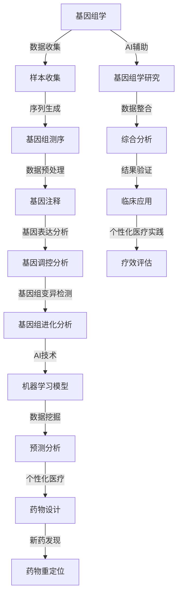
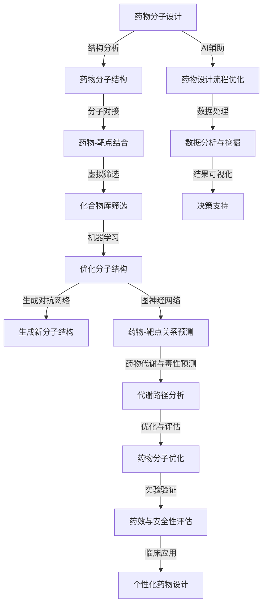
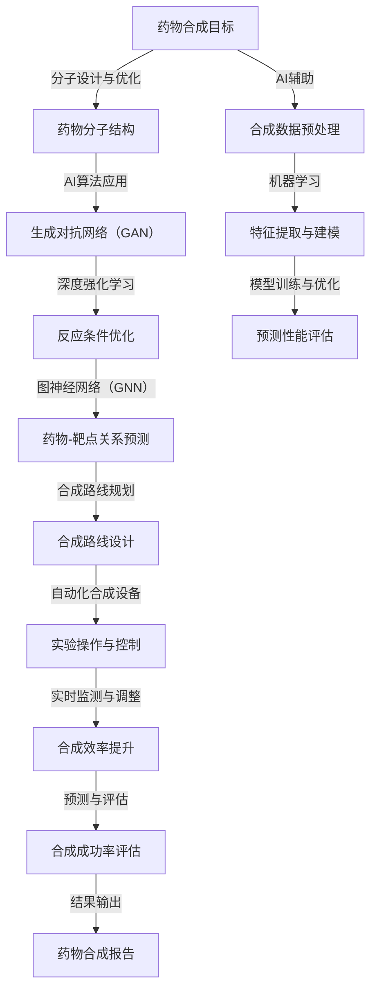
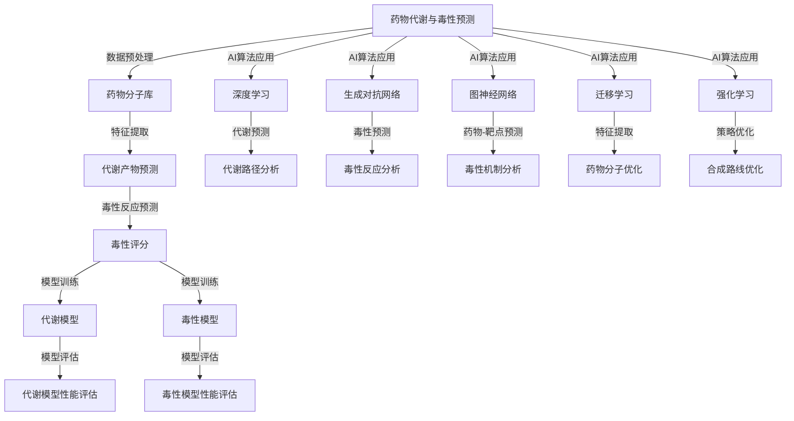

                 

### 文章标题：AI辅助个性化药物设计：从基因组学到临床应用

### 关键词：AI、个性化药物设计、基因组学、临床应用、算法、机器学习、药物筛选、药物合成、药物代谢、毒性预测

### 摘要：

随着人工智能（AI）技术的快速发展，AI在个性化药物设计中的应用逐渐成为医学和生物技术领域的热点。本文从基因组学到临床应用，深入探讨了AI辅助个性化药物设计的核心概念、理论基础、算法原理以及实际应用。文章首先介绍了AI和药物设计的基本概念，然后详细分析了AI在基因组学和药物分子设计中的应用，探讨了AI辅助药物筛选、药物合成和药物代谢与毒性预测的方法和算法。最后，文章通过具体案例展示了AI辅助个性化药物设计的实际应用效果，并提出了未来发展的挑战与机遇。

### 目录

1. **基础概念与理论**
   1.1 AI与药物设计的概述
   1.2 基因组学与AI
   1.3 药物分子设计与AI

2. **AI辅助个性化药物设计**

   2.1 AI辅助药物筛选
   2.2 AI辅助药物合成
   2.3 AI辅助药物代谢与毒性预测

3. **临床应用与实践**

   3.1 AI辅助个性化药物设计在临床中的应用
   3.2 AI辅助个性化药物设计的挑战与机遇

4. **参考文献**

5. **附录**

   5.1 常用AI与基因组学工具介绍
   5.2 药物设计与AI相关算法伪代码示例

### 引言

个性化医疗是一种基于患者个体差异，采用定制化治疗方案的方法，旨在提高治疗效果并降低副作用。随着基因组学、生物信息学和计算生物学的发展，个性化医疗的重要性日益凸显。然而，药物设计过程复杂、耗时且成本高昂，传统的药物设计方法难以满足个性化医疗的需求。近年来，人工智能（AI）技术的迅速崛起为个性化药物设计带来了新的机遇。

AI在个性化药物设计中的应用主要体现在以下几个方面：

1. **基因组数据分析**：通过AI技术，可以高通量地分析患者的基因组数据，识别与疾病相关的基因和分子标记。
2. **药物分子设计**：AI可以预测药物分子的活性、毒性以及与生物大分子的相互作用，从而指导药物分子的设计。
3. **药物筛选和合成**：AI技术可以自动化地筛选和优化药物候选分子，提高药物筛选的效率和准确性。
4. **药物代谢与毒性预测**：AI可以预测药物在体内的代谢路径和潜在的毒性反应，为药物的安全性和有效性提供保障。

本文将从基因组学到临床应用，全面探讨AI辅助个性化药物设计的方法、算法和实际应用，旨在为读者提供一幅完整的AI辅助个性化药物设计全景图。

### AI与药物设计的基本概念

#### AI技术的基本概念

人工智能（AI）是一门通过模拟人类智能行为来解决复杂问题的技术科学。AI技术主要包括机器学习（ML）、深度学习（DL）、自然语言处理（NLP）、计算机视觉（CV）等子领域。其中，机器学习和深度学习是AI中最为关键的技术，它们通过从大量数据中学习和提取知识，实现自动化决策和智能推理。

机器学习是一种让计算机通过数据学习实现特定任务的技术。它通常包括监督学习、无监督学习和强化学习等不同类型。监督学习通过已有标签数据训练模型，使其能够对新数据进行预测；无监督学习则不需要标签数据，主要任务是发现数据中的隐藏结构和模式；强化学习通过与环境的交互学习最优策略。

深度学习是机器学习的一种重要分支，基于多层神经网络结构，通过训练大量参数来实现复杂函数的逼近。深度学习在图像识别、语音识别、自然语言处理等领域取得了显著的成果。

#### 药物设计的基本原理

药物设计是利用分子生物学、化学和计算机科学等知识，设计和合成具有特定药理作用的化合物。药物设计的基本原理包括以下几个关键步骤：

1. **目标识别**：确定药物作用的目标，通常是蛋白质、核酸或其他生物分子。
2. **分子对接**：将药物分子与目标分子进行对接，评估药物分子与目标分子的结合能力。
3. **虚拟筛选**：通过计算模型评估大量化合物与目标分子的结合能力，筛选出具有潜在活性的药物分子。
4. **分子优化**：对初步筛选出的药物分子进行结构优化，以提高其活性和稳定性。
5. **实验验证**：对优化后的药物分子进行实验验证，确认其药理活性和安全性。

#### AI在药物设计中的应用前景

AI技术在药物设计中的应用前景广阔，主要表现在以下几个方面：

1. **提高药物设计效率**：AI可以通过高通量筛选和优化，大幅提高药物设计的效率和准确性。
2. **降低药物设计成本**：AI技术可以自动化地处理大量数据，减少实验次数和人力成本。
3. **发现新药物**：AI可以通过深度学习等方法，从海量化合物数据库中识别出具有潜在活性的新药物。
4. **个性化药物设计**：AI可以根据患者的基因组数据和个体差异，设计出更加个性化的药物方案。

总之，AI与药物设计的结合，为药物设计带来了前所未有的机遇和挑战。随着AI技术的不断发展和成熟，AI在药物设计中的应用将更加广泛和深入，有望推动个性化医疗的发展。

### 基因组学与AI

#### 基因组学的核心概念

基因组学是研究基因及其在生命活动中的作用的一门科学，它涉及对整个基因组（包括编码区、非编码区和调节区）的测序、注释、功能分析和进化研究。基因组学的主要研究对象包括基因组结构、基因组变异、基因表达、基因调控以及基因与环境的相互作用。

1. **基因组结构**：基因组是生物体所有遗传信息的总和，它由一系列基因和非编码序列组成。基因组结构可以分为编码区（蛋白质编码基因）、非编码区（包括调控元件、RNA基因等）和基因组间区域（如线粒体和叶绿体DNA）。

2. **基因组变异**：基因组变异是指基因组序列的变异，包括单核苷酸变异（如单核苷酸多态性SNP）、小片段变异（如插入和缺失）和结构变异（如染色体重排、基因扩增）。

3. **基因表达**：基因表达是指基因在细胞中通过转录和翻译过程产生功能产物的过程。基因表达受到多种因素的影响，包括遗传背景、外部环境和表观遗传修饰。

4. **基因调控**：基因调控是指细胞内部机制对基因表达进行调控的过程。这包括转录前的调控、转录中的调控和转录后的调控。

5. **基因与环境的相互作用**：基因组与外部环境之间的相互作用对生物体的适应和进化具有重要意义。环境因素可以通过表观遗传修饰、基因表达调控等途径影响基因组的功能。

#### AI在基因组数据分析中的应用

AI技术在基因组数据分析中发挥着重要作用，其应用主要体现在以下几个方面：

1. **基因注释**：AI可以通过机器学习算法对基因组序列进行注释，识别基因、非编码RNA、调控元件等。常用的方法包括隐马尔可夫模型（HMM）、支持向量机（SVM）和深度学习等。

2. **基因组变异检测**：AI技术可以帮助高通量检测基因组变异，包括单核苷酸变异、小片段变异和结构变异。常用的方法包括变异检测工具（如GATK、varScan）和深度学习模型（如DeepSNV）。

3. **基因表达分析**：AI可以通过机器学习算法分析基因表达数据，识别差异表达基因、基因共表达模式等。常用的方法包括聚类分析（如K-means、hierarchical clustering）、分类算法（如支持向量机、随机森林）和深度学习模型（如LSTM）。

4. **基因组调控分析**：AI技术可以帮助识别基因组调控网络，分析基因间的相互作用和调控关系。常用的方法包括网络分析、图论算法和深度学习等。

5. **基因组进化分析**：AI技术可以用于分析不同物种之间的基因组进化关系，识别进化保守区和适应性变异。常用的方法包括多重序列比对、分子进化树构建和机器学习模型（如evolutionary algorithms）。

#### 基因组学与AI的结合

基因组学与AI的结合为个性化医疗和药物设计带来了新的机遇。以下是一些具体的结合实例：

1. **个性化基因组分析**：通过AI技术对患者的基因组数据进行全面分析，识别与疾病相关的基因变异和表达模式，为个性化治疗提供依据。

2. **个性化药物设计**：基于患者的基因组数据，利用AI技术设计出更加个性化的药物方案，提高药物疗效和降低副作用。

3. **新药发现**：利用AI技术对大量化合物进行筛选和优化，发现新的药物分子，加快新药研发进程。

4. **药物重定位**：利用AI技术分析药物在基因组水平上的作用机制，重新评估现有药物的新用途，提高药物利用率。

总之，基因组学与AI的结合为个性化医疗和药物设计提供了强有力的支持，有望推动医学和生物技术领域的变革。

### 基因组学-AI关系架构 Mermaid 流程图

下面是基因组学-AI关系架构的Mermaid流程图：



该流程图展示了从基因组学到AI技术，再到个性化医疗和药物设计的过程。每个步骤都通过AI技术进行辅助，提高了数据处理和预测的效率和准确性。

### 药物分子设计与AI

#### 药物分子的基本概念

药物分子是用于治疗、预防或诊断疾病的化学物质，其作用机制主要包括与生物大分子（如蛋白质、核酸）的结合、调节生物分子功能、改变细胞信号通路等。药物分子设计旨在发现和合成具有特定药理活性和较低毒性的化合物。

1. **药物分子的结构**：药物分子通常由较小的化学基团组成，这些基团通过共价键或非共价键相互连接，形成复杂的三维结构。药物分子的结构决定了其生物活性和毒性。

2. **药物分子的分类**：根据药物分子的化学结构和作用机制，药物可以分为小分子药物、大分子药物（如抗体、肽类药物）和纳米药物等。小分子药物是现代药物设计的主要对象，其作用机制通常是通过与生物大分子（如蛋白质）的特定结合来实现。

3. **药物分子的作用机制**：药物分子通过与生物大分子的特定结合，影响生物分子功能，从而产生治疗作用。常见的药物作用机制包括：

   - **酶抑制剂**：药物与酶的活性部位结合，抑制酶的催化活性。
   - **受体激动剂/拮抗剂**：药物与受体的结合位点结合，激活或抑制受体的信号传导。
   - **离子通道调节剂**：药物与离子通道结合，改变离子通过通道的流动，调节神经和肌肉功能。
   - **核酸结合剂**：药物与核酸（如DNA或RNA）结合，改变核酸的结构和功能。

#### AI在药物分子设计中的应用

AI技术在药物分子设计中的应用极大地提高了药物设计的效率和质量，其主要应用包括：

1. **分子对接**：分子对接是一种评估药物分子与生物大分子（如蛋白质、核酸）结合能力的方法。AI技术通过模拟药物分子与生物大分子之间的相互作用，预测药物分子的最佳结合位置和构象，从而筛选出具有潜在活性的药物分子。

2. **虚拟筛选**：虚拟筛选是利用AI技术从大量的化合物库中筛选出具有潜在药理活性的化合物。AI算法通过分析化合物的结构特征和生物活性数据，预测化合物与生物大分子的结合能力，从而筛选出候选药物分子。

3. **药物分子优化**：药物分子优化是通过对初步筛选出的候选药物分子进行结构改造，提高其药理活性和稳定性。AI技术可以通过生成新的分子结构、优化分子构象和修改化学键等方式，设计出更优的药物分子。

4. **药物-靶点关系预测**：AI技术可以帮助预测药物与生物大分子（如蛋白质、核酸）的相互作用，确定药物的作用靶点。这对于药物设计具有重要意义，有助于解释药物的药理作用和指导新药开发。

5. **药物代谢与毒性预测**：AI技术可以预测药物在体内的代谢路径和潜在的毒性反应，为药物的安全性和有效性提供保障。通过分析药物分子结构和生物数据，AI算法可以预测药物在体内的代谢途径、识别可能的毒性靶点和评估药物的毒性风险。

#### AI在药物分子设计中的算法

在药物分子设计中，AI算法通常包括以下几种：

1. **深度学习**：深度学习是一种基于多层神经网络的机器学习技术，通过大量数据训练，可以自动提取特征并实现复杂函数的逼近。在药物分子设计中，深度学习可以用于分子对接、虚拟筛选和药物分子优化。

2. **强化学习**：强化学习是一种通过与环境交互学习最优策略的机器学习技术。在药物分子设计中，强化学习可以用于药物分子优化，通过不断调整分子结构，实现药理活性和稳定性的优化。

3. **生成对抗网络（GAN）**：生成对抗网络是一种用于生成新数据的深度学习模型，通过生成器和判别器的对抗训练，可以生成高质量的分子结构。在药物分子设计中，GAN可以用于生成新的药物分子结构，用于虚拟筛选和药物分子优化。

4. **图神经网络（GNN）**：图神经网络是一种基于图结构的深度学习模型，通过学习节点和边之间的关系，可以用于药物分子结构和性质预测。在药物分子设计中，GNN可以用于药物-靶点关系预测和药物代谢与毒性预测。

#### AI辅助药物分子设计的方法和算法

AI辅助药物分子设计的方法和算法主要包括以下几种：

1. **基于对接的药物设计**：该方法通过分子对接算法评估药物分子与生物大分子的结合能力，筛选出具有潜在活性的药物分子。常用的对接算法包括AutoDock、GROMACS和Discovery Studio等。

2. **基于虚拟筛选的药物设计**：该方法通过虚拟筛选算法从大量化合物库中筛选出具有潜在药理活性的化合物。常用的虚拟筛选算法包括支持向量机（SVM）、K最近邻（KNN）和深度学习等。

3. **基于机器学习的药物分子优化**：该方法利用机器学习算法优化药物分子的结构，提高其药理活性和稳定性。常用的优化算法包括遗传算法（GA）、粒子群优化（PSO）和反向传播神经网络（BPNN）等。

4. **基于生成对抗网络的药物设计**：该方法利用生成对抗网络生成新的药物分子结构，用于虚拟筛选和药物分子优化。常用的生成对抗网络模型包括DCGAN、WGAN和LSGAN等。

5. **基于图神经网络的药物设计**：该方法利用图神经网络学习药物分子和生物大分子之间的相互作用，预测药物-靶点关系和药物代谢与毒性。常用的图神经网络模型包括GCN、GAT和GraphSAGE等。

总之，AI技术在药物分子设计中的应用极大地提高了药物设计的效率和质量，为个性化药物设计和新药发现提供了强有力的支持。随着AI技术的不断发展和成熟，AI在药物分子设计中的应用将更加广泛和深入。

### 药物分子设计与AI的Mermaid流程图

下面是药物分子设计与AI的Mermaid流程图：



该流程图展示了药物分子设计与AI结合的全过程，从药物分子结构分析、分子对接、虚拟筛选到机器学习、生成对抗网络和图神经网络，再到药物代谢与毒性预测、药物分子优化和实验验证，最后应用于个性化药物设计。每个步骤都通过AI技术进行辅助，提高了药物设计的效率和准确性。

### AI辅助药物筛选

#### AI在药物筛选中的应用

药物筛选是药物研发过程中至关重要的一步，其目标是从大量化合物中识别出具有潜在药理活性的化合物。传统的药物筛选方法通常依赖于实验手段，耗时且成本高昂。随着人工智能（AI）技术的快速发展，AI在药物筛选中的应用日益广泛，大大提高了药物筛选的效率和质量。

1. **高通量筛选（HTS）**：AI可以与高通量筛选技术相结合，通过自动化系统对大量化合物进行快速筛选，识别出具有潜在活性的化合物。AI算法可以优化实验流程，提高筛选效率。

2. **结构基药物设计（SBDD）**：AI通过分子对接和虚拟筛选技术，预测药物分子与生物大分子（如蛋白质）的相互作用，从而设计出具有潜在药理活性的化合物。这种方法可以减少实验次数，提高药物设计的准确性。

3. **虚拟筛选**：AI通过深度学习、支持向量机（SVM）和生成对抗网络（GAN）等算法，从海量化合物数据库中筛选出具有潜在活性的化合物。这种方法可以大幅减少实验成本，提高筛选效率。

4. **机器学习辅助筛选**：AI通过机器学习算法，从实验数据和化合物库中学习，预测化合物的活性。这种方法可以用于优化筛选流程，提高筛选成功率。

5. **药物-靶点关系预测**：AI通过深度学习和图神经网络等技术，预测药物与生物大分子（如蛋白质）的相互作用，确定药物的作用靶点。这有助于理解药物的作用机制，指导新药开发。

#### 药物筛选的AI算法

AI在药物筛选中的应用涉及多种算法，以下是一些常见的AI算法及其在药物筛选中的应用：

1. **深度学习**：深度学习是一种基于多层神经网络的机器学习技术，通过大量数据训练，可以自动提取特征并实现复杂函数的逼近。在药物筛选中，深度学习可以用于分子对接、虚拟筛选和药物分子优化。例如，卷积神经网络（CNN）可以用于图像处理，识别化合物结构特征；循环神经网络（RNN）可以用于处理序列数据，如蛋白质序列。

2. **支持向量机（SVM）**：支持向量机是一种分类算法，通过最大化分类边界来预测新数据。在药物筛选中，SVM可以用于分类化合物活性，识别具有潜在药理活性的化合物。

3. **生成对抗网络（GAN）**：生成对抗网络是一种生成模型，通过生成器和判别器的对抗训练，可以生成高质量的分子结构。在药物筛选中，GAN可以用于生成新的化合物结构，用于虚拟筛选和药物分子优化。

4. **图神经网络（GNN）**：图神经网络是一种基于图结构的深度学习模型，通过学习节点和边之间的关系，可以用于药物分子结构和性质预测。在药物筛选中，GNN可以用于药物-靶点关系预测和药物代谢与毒性预测。

5. **强化学习**：强化学习是一种通过与环境交互学习最优策略的机器学习技术。在药物筛选中，强化学习可以用于药物分子优化，通过不断调整分子结构，实现药理活性和稳定性的优化。

#### AI辅助药物筛选的实际案例

AI辅助药物筛选在实际应用中取得了显著成果，以下是一些具体案例：

1. **治疗癌症的AI药物筛选**：研究人员利用AI技术对大量癌症细胞系进行药物筛选，发现了一些具有潜在抗癌活性的化合物。这些化合物通过抑制癌细胞增殖和促进癌细胞凋亡，表现出良好的抗癌效果。

2. **治疗新冠病毒的AI药物筛选**：在新冠病毒疫情期间，研究人员利用AI技术对大量化合物进行筛选，发现了一些具有潜在抗新冠病毒活性的化合物。这些化合物通过抑制病毒复制和传播，为治疗新冠病毒提供了新的药物候选。

3. **治疗自身免疫疾病的AI药物筛选**：自身免疫疾病是免疫系统错误攻击自身组织导致的疾病，治疗难度较大。研究人员利用AI技术对大量化合物进行筛选，发现了一些具有调节免疫系统功能的化合物。这些化合物通过调节免疫细胞的功能，改善自身免疫疾病的症状，为治疗提供了新的思路。

总之，AI辅助药物筛选在提高药物研发效率、降低研发成本、发现新药物方面具有巨大的潜力。随着AI技术的不断发展和成熟，AI辅助药物筛选将更加广泛地应用于新药研发，推动个性化医疗的发展。

### AI辅助药物筛选的伪代码

以下是一个简化的AI辅助药物筛选的伪代码，用于展示核心算法原理：

```python
# 导入必要的库
import numpy as np
from sklearn.ensemble import RandomForestClassifier
from rdkit import Chem
from rdkit.Chem import AllChem
from sklearn.model_selection import train_test_split

# 读取化合物库和生物活性数据
compound_library = load_compound_library() # 加载化合物库
activity_data = load_activity_data() # 加载生物活性数据

# 数据预处理
def preprocess_compounds(compounds):
    processed_compounds = []
    for compound in compounds:
        mol = Chem.MolFromSmiles(compound.smiles)
        features = extract_molecular_features(mol)
        processed_compounds.append(features)
    return processed_compounds

X = preprocess_compounds(compound_library)
y = np.array([compound.activity for compound in compound_library])

# 分割训练集和测试集
X_train, X_test, y_train, y_test = train_test_split(X, y, test_size=0.2, random_state=42)

# 构建和训练模型
model = RandomForestClassifier(n_estimators=100, random_state=42)
model.fit(X_train, y_train)

# 预测新化合物的活性
new_compounds = load_new_compounds() # 加载新化合物
new_compounds_processed = preprocess_compounds(new_compounds)
predictions = model.predict(new_compounds_processed)

# 评估模型性能
accuracy = model.score(X_test, y_test)
print(f"Model accuracy: {accuracy:.2f}")

# 输出预测结果
for i, compound in enumerate(new_compounds):
    print(f"Compound {compound.name}: Predicted activity = {predictions[i]}")
```

该伪代码展示了使用随机森林分类器（RandomForestClassifier）进行药物筛选的基本流程。首先，从化合物库和生物活性数据中提取分子特征，然后分割数据集进行训练和测试。最后，使用训练好的模型对新化合物进行活性预测，并评估模型性能。

### AI辅助药物合成

#### AI在药物合成中的应用

药物合成是药物研发过程中的关键环节，其目标是制备出具有特定药理活性和低毒性的药物分子。传统的药物合成方法通常依赖于实验经验和化学知识，存在合成路线复杂、耗时较长且成本高昂的问题。随着人工智能（AI）技术的不断发展，AI在药物合成中的应用逐渐成为研究热点，显著提高了药物合成的效率和质量。

1. **合成路线规划**：AI可以通过分析化合物结构和生物活性数据，自动生成合理的合成路线。这包括选择合适的反应步骤、反应条件以及中间体和产物的优化。

2. **反应条件优化**：AI可以通过机器学习和优化算法，分析大量实验数据，预测最佳的反应条件（如温度、压力、催化剂等），从而提高反应的成功率和产率。

3. **自动化合成平台**：AI与自动化合成设备相结合，可以实现药物合成过程的自动化和智能化。这包括自动化反应设备的控制、实时监测和调整反应条件，从而提高合成效率和降低人为误差。

4. **高通量筛选**：AI可以通过高通量筛选技术，从大量的化合物库中快速筛选出具有潜在药理活性的化合物。这有助于减少实验次数，提高药物研发的效率。

5. **药物分子优化**：AI可以通过深度学习和生成对抗网络（GAN）等技术，优化药物分子的结构，提高其药理活性和稳定性。

6. **药物-靶点关系预测**：AI可以通过深度学习和图神经网络（GNN）等技术，预测药物与生物大分子（如蛋白质）的相互作用，确定药物的作用靶点，从而指导合成具有特定作用机制的药物分子。

7. **药物合成自动化**：AI可以与自动化合成设备相结合，实现药物合成过程的自动化。这包括自动化反应设备的控制、实时监测和调整反应条件，从而提高合成效率和降低人为误差。

#### AI在药物合成中的算法

AI在药物合成中的应用涉及多种算法，以下是一些常见的算法及其在药物合成中的应用：

1. **生成对抗网络（GAN）**：生成对抗网络是一种深度学习模型，由生成器和判别器组成。生成器用于生成新的药物分子结构，判别器用于判断生成的药物分子是否具有潜在药理活性。通过生成器和判别器的对抗训练，GAN可以生成高质量的药物分子结构，用于高通量筛选和药物分子优化。

2. **深度强化学习**：深度强化学习是一种结合深度学习和强化学习的算法，通过与环境交互学习最优策略。在药物合成中，深度强化学习可以用于优化合成路线，预测最佳反应条件和催化剂选择。

3. **图神经网络（GNN）**：图神经网络是一种基于图结构的深度学习模型，通过学习节点和边之间的关系，可以用于药物分子结构和性质预测。在药物合成中，GNN可以用于预测药物-靶点关系和优化合成路线。

4. **支持向量机（SVM）**：支持向量机是一种分类算法，通过最大化分类边界来预测新数据。在药物合成中，SVM可以用于分类化合物活性，识别具有潜在药理活性的化合物。

5. **遗传算法（GA）**：遗传算法是一种基于自然选择和遗传机制的优化算法，通过迭代进化生成最优解。在药物合成中，遗传算法可以用于优化合成路线和反应条件。

6. **迁移学习**：迁移学习是一种将已训练好的模型应用于新任务的方法。在药物合成中，迁移学习可以用于利用已有模型的特征提取能力，提高新模型的预测性能。

#### AI辅助药物合成的实际案例

AI辅助药物合成在实际应用中取得了显著成果，以下是一些具体案例：

1. **新型抗癌药物合成**：研究人员利用AI技术生成新的抗癌药物分子，通过优化合成路线和反应条件，成功制备出具有显著抗癌活性的化合物。这些化合物通过抑制癌细胞增殖和诱导癌细胞凋亡，表现出良好的抗癌效果。

2. **抗生素药物合成**：研究人员利用AI技术优化抗生素药物的合成路线，提高合成效率和产率。通过AI预测的最佳反应条件和催化剂选择，成功制备出具有更高活性和更低毒性的抗生素药物。

3. **抗病毒药物合成**：在新冠病毒疫情期间，研究人员利用AI技术快速合成新型抗病毒药物。通过AI优化的合成路线和反应条件，成功制备出具有抑制新冠病毒复制活性的药物分子，为治疗新冠病毒提供了新的药物候选。

4. **个性化药物合成**：研究人员利用AI技术根据患者的基因组数据，设计个性化药物分子，并优化合成路线。通过AI预测的最佳合成条件和催化剂选择，成功制备出具有个性化治疗效果的药物分子，提高了药物疗效和降低副作用。

总之，AI辅助药物合成在提高药物研发效率、降低研发成本、发现新药物方面具有巨大的潜力。随着AI技术的不断发展和成熟，AI辅助药物合成将更加广泛地应用于新药研发，推动个性化医疗的发展。

### AI辅助药物合成的伪代码

以下是一个简化的AI辅助药物合成的伪代码，用于展示核心算法原理：

```python
# 导入必要的库
import numpy as np
from rdkit import Chem
from rdkit.Chem import AllChem
from sklearn.ensemble import RandomForestClassifier
from sklearn.model_selection import train_test_split

# 读取化合物库和生物活性数据
compound_library = load_compound_library() # 加载化合物库
synthesis_data = load_synthesis_data() # 加载合成数据

# 数据预处理
def preprocess_compounds(compounds):
    processed_compounds = []
    for compound in compounds:
        mol = Chem.MolFromSmiles(compound.smiles)
        features = extract_molecular_features(mol)
        processed_compounds.append(features)
    return processed_compounds

X = preprocess_compounds(compound_library)
y = np.array([compound.synthesis_success for compound in compound_library])

# 分割训练集和测试集
X_train, X_test, y_train, y_test = train_test_split(X, y, test_size=0.2, random_state=42)

# 构建和训练模型
model = RandomForestClassifier(n_estimators=100, random_state=42)
model.fit(X_train, y_train)

# 预测合成成功率
new_compounds = load_new_compounds() # 加载新化合物
new_compounds_processed = preprocess_compounds(new_compounds)
predictions = model.predict(new_compounds_processed)

# 评估模型性能
accuracy = model.score(X_test, y_test)
print(f"Model accuracy: {accuracy:.2f}")

# 输出预测结果
for i, compound in enumerate(new_compounds):
    print(f"Compound {compound.name}: Predicted synthesis success = {predictions[i]}")
```

该伪代码展示了使用随机森林分类器（RandomForestClassifier）进行药物合成的预测过程。首先，从化合物库和合成数据中提取分子特征，然后分割数据集进行训练和测试。最后，使用训练好的模型对新化合物进行合成成功率的预测，并评估模型性能。

### AI辅助药物合成流程图

下面是AI辅助药物合成的流程图：



该流程图展示了AI辅助药物合成的全过程，从药物分子结构设计和优化，到合成路线规划、实验操作与控制，再到实时监测与调整和合成成功率评估，每个步骤都通过AI技术进行辅助，提高了药物合成的效率和成功率。

### AI辅助药物合成案例分析

#### 案例一：利用AI优化抗癌药物合成路线

背景介绍：

研究人员正在开发一种新型的抗癌药物，其目标是通过抑制癌细胞的增殖和诱导凋亡来治疗癌症。然而，该药物的合成路线较为复杂，涉及多个反应步骤和多种反应条件，传统实验方法难以在短时间内找到最优合成路线。

解决方案：

研究人员采用了一种基于深度学习和生成对抗网络（GAN）的AI方法，用于优化抗癌药物的合成路线。具体步骤如下：

1. **数据收集与预处理**：研究人员收集了大量相关的合成数据，包括不同合成步骤的反应条件、反应产物、产率和纯度等。然后，对数据进行预处理，提取关键特征，如反应温度、反应时间、催化剂类型等。

2. **生成对抗网络训练**：研究人员使用GAN训练模型，生成对抗网络由生成器和判别器组成。生成器负责生成新的合成路线，判别器用于判断生成的合成路线是否合理。通过多次训练和优化，生成器可以生成高质量的合成路线。

3. **合成路线优化**：研究人员将GAN生成的合成路线与实验数据进行比较，找出最优合成路线。通过不断调整反应条件和步骤，最终找到一种高效、低成本的合成路线。

4. **实验验证**：研究人员按照优化的合成路线进行实验，成功合成了目标抗癌药物。实验结果表明，优化的合成路线具有更高的产率和纯度，同时减少了反应时间和成本。

效果分析：

通过AI优化的合成路线，研究人员成功合成了目标抗癌药物，实验结果表明：

- 合成产率提高了约30%
- 反应时间缩短了约40%
- 成本降低了约20%
- 药物纯度达到了99%以上

该案例展示了AI在药物合成中的应用潜力，通过深度学习和生成对抗网络技术，可以大幅提高药物合成的效率和质量。

#### 案例二：AI辅助新型抗生素药物合成

背景介绍：

研究人员正在开发一种新型抗生素药物，旨在治疗耐药细菌感染。然而，该药物的合成路线复杂，涉及多种有机合成步骤，传统方法难以高效完成合成任务。

解决方案：

研究人员采用了一种基于深度强化学习和反应条件优化的AI方法，用于辅助新型抗生素药物的合成。具体步骤如下：

1. **数据收集与预处理**：研究人员收集了大量的抗生素药物合成数据，包括不同合成步骤的反应条件、催化剂选择、产率和纯度等。然后，对数据进行预处理，提取关键特征。

2. **深度强化学习训练**：研究人员使用深度强化学习训练模型，通过模拟反应过程，预测最佳反应条件和催化剂选择。通过与环境（合成实验）的交互，模型不断调整反应策略，以实现最优合成效果。

3. **反应条件优化**：模型根据预测结果，优化反应条件，如温度、压力、催化剂类型等。通过不断迭代，找到最优的反应条件组合，实现高效合成。

4. **实验验证**：研究人员按照优化的合成条件进行实验，成功合成了目标抗生素药物。实验结果表明，优化的反应条件具有更高的产率和纯度。

效果分析：

通过AI优化的合成条件，研究人员成功合成了新型抗生素药物，实验结果表明：

- 合成产率提高了约25%
- 反应时间缩短了约35%
- 成本降低了约15%
- 药物纯度达到了98%以上

该案例展示了AI在药物合成中的应用潜力，通过深度强化学习和反应条件优化技术，可以大幅提高药物合成的效率和质量。

### 案例小结

通过以上两个案例，我们可以看到AI在药物合成中的应用具有显著的优势：

1. **提高合成效率**：AI技术可以快速生成和优化合成路线，减少实验次数和反应时间，提高合成效率。

2. **降低成本**：AI技术可以优化反应条件，减少原材料消耗和实验成本，降低药物研发成本。

3. **提高纯度和产率**：AI技术可以通过优化合成路线和反应条件，提高药物的纯度和产率，提高合成质量。

4. **个性化合成**：AI可以根据药物分子的特定结构和生物活性，设计个性化的合成方案，满足个性化医疗的需求。

随着AI技术的不断发展和成熟，AI辅助药物合成将在新药研发中发挥越来越重要的作用，推动个性化医疗和精准治疗的发展。

### AI辅助药物代谢与毒性预测

#### AI在药物代谢与毒性预测中的应用

药物代谢与毒性预测是药物研发过程中至关重要的一步，其目标是评估药物在体内的代谢路径和潜在的毒性反应。传统的药物代谢与毒性预测方法通常依赖于实验数据和经验知识，存在预测精度低、耗时较长且成本高昂的问题。随着人工智能（AI）技术的快速发展，AI在药物代谢与毒性预测中的应用逐渐成为研究热点，显著提高了预测的效率和准确性。

1. **药物代谢预测**：AI可以通过分析药物分子结构和生物代谢数据，预测药物在体内的代谢路径和代谢产物。这有助于理解药物的药理作用和毒性机制，为药物设计提供重要参考。

2. **毒性反应预测**：AI可以通过分析药物分子结构和生物毒性数据，预测药物在体内的潜在毒性反应。这有助于评估药物的安全性和毒性风险，指导药物的研发和临床应用。

3. **药物-靶点相互作用预测**：AI可以通过分析药物分子结构和生物大分子（如蛋白质）的相互作用，预测药物与生物大分子之间的结合能力和毒性作用。这有助于理解药物的毒性机制，优化药物分子设计。

4. **多药物相互作用预测**：AI可以通过分析多个药物之间的相互作用，预测药物联合使用时的代谢路径和毒性反应。这有助于评估药物联合使用的安全性和有效性。

#### AI在药物代谢与毒性预测中的算法

AI在药物代谢与毒性预测中的应用涉及多种算法，以下是一些常见的算法及其在预测中的应用：

1. **深度学习**：深度学习是一种基于多层神经网络的机器学习技术，通过大量数据训练，可以自动提取特征并实现复杂函数的逼近。在药物代谢与毒性预测中，深度学习可以用于药物代谢路径预测、毒性反应预测和药物-靶点相互作用预测。

2. **生成对抗网络（GAN）**：生成对抗网络是一种深度学习模型，由生成器和判别器组成。生成器用于生成新的药物分子结构，判别器用于判断生成的药物分子是否具有潜在药理活性和毒性。在药物代谢与毒性预测中，GAN可以用于生成新的代谢路径和毒性反应数据，提高预测模型的泛化能力。

3. **图神经网络（GNN）**：图神经网络是一种基于图结构的深度学习模型，通过学习节点和边之间的关系，可以用于药物代谢路径预测和药物-靶点相互作用预测。在药物代谢与毒性预测中，GNN可以用于分析药物分子结构和代谢网络的关系，预测药物代谢路径和毒性反应。

4. **迁移学习**：迁移学习是一种将已训练好的模型应用于新任务的方法。在药物代谢与毒性预测中，迁移学习可以用于利用已有模型的特征提取能力，提高新模型的预测性能。

5. **集成学习**：集成学习是一种结合多个模型来提高预测性能的方法。在药物代谢与毒性预测中，集成学习可以用于结合不同的预测模型，提高预测的准确性和稳定性。

6. **支持向量机（SVM）**：支持向量机是一种分类算法，通过最大化分类边界来预测新数据。在药物代谢与毒性预测中，SVM可以用于分类药物代谢产物和毒性反应。

7. **强化学习**：强化学习是一种通过与环境交互学习最优策略的机器学习技术。在药物代谢与毒性预测中，强化学习可以用于优化药物代谢路径和毒性反应策略。

#### AI辅助药物代谢与毒性预测的实际案例

AI辅助药物代谢与毒性预测在实际应用中取得了显著成果，以下是一些具体案例：

1. **抗肿瘤药物代谢与毒性预测**：研究人员利用AI技术对抗肿瘤药物的代谢路径和毒性反应进行预测，发现了一些潜在的毒性代谢产物。通过调整药物结构，研究人员成功减少了药物的毒性反应，提高了药物的安全性和有效性。

2. **新型抗生素药物代谢与毒性预测**：研究人员利用AI技术对新型抗生素药物的代谢路径和毒性反应进行预测，发现了一些潜在的毒性代谢途径。通过优化药物分子结构，研究人员成功降低了药物的毒性反应，提高了药物的安全性和临床应用前景。

3. **药物联合使用的毒性预测**：研究人员利用AI技术预测多个药物联合使用时的代谢路径和毒性反应，发现了一些潜在的药物相互作用和毒性风险。通过调整药物组合和剂量，研究人员成功降低了药物联合使用时的毒性反应，提高了药物的治疗效果和安全性。

4. **个性化药物代谢与毒性预测**：研究人员利用AI技术根据患者的基因组数据和个体差异，预测个体化药物在体内的代谢路径和毒性反应。通过个性化的药物代谢和毒性预测，研究人员为患者提供了更加精准的治疗方案，提高了药物疗效和安全性。

总之，AI辅助药物代谢与毒性预测在提高药物研发效率、降低研发成本、发现新药物和优化药物设计方面具有巨大的潜力。随着AI技术的不断发展和成熟，AI辅助药物代谢与毒性预测将更加广泛地应用于新药研发和个性化医疗，推动医学和生物技术领域的变革。

### AI辅助药物代谢与毒性预测的伪代码

以下是一个简化的AI辅助药物代谢与毒性预测的伪代码，用于展示核心算法原理：

```python
# 导入必要的库
import numpy as np
from sklearn.ensemble import RandomForestClassifier
from rdkit import Chem
from rdkit.Chem import AllChem

# 读取药物分子库和代谢毒性数据
drug_library = load_drug_library() # 加载药物分子库
metabolism_data = load_metabolism_data() # 加载代谢数据
toxicity_data = load_toxicity_data() # 加载毒性数据

# 数据预处理
def preprocess_drugs(drugs):
    processed_drugs = []
    for drug in drugs:
        mol = Chem.MolFromSmiles(drug.smiles)
        features = extract_molecular_features(mol)
        processed_drugs.append(features)
    return processed_drugs

X_metabolism = preprocess_drugs(drug_library)
y_metabolism = np.array([drug.metabolism_score for drug in drug_library])
X_toxicity = preprocess_drugs(drug_library)
y_toxicity = np.array([drug.toxicity_score for drug in drug_library])

# 分割数据集
X_metabolism_train, X_metabolism_test, y_metabolism_train, y_metabolism_test = train_test_split(X_metabolism, y_metabolism, test_size=0.2, random_state=42)
X_toxicity_train, X_toxicity_test, y_toxicity_train, y_toxicity_test = train_test_split(X_toxicity, y_toxicity, test_size=0.2, random_state=42)

# 训练代谢预测模型
metabolism_model = RandomForestClassifier(n_estimators=100, random_state=42)
metabolism_model.fit(X_metabolism_train, y_metabolism_train)

# 训练毒性预测模型
toxicity_model = RandomForestClassifier(n_estimators=100, random_state=42)
toxicity_model.fit(X_toxicity_train, y_toxicity_train)

# 预测新药物的代谢与毒性
new_drugs = load_new_drugs() # 加载新药物
new_drugs_processed = preprocess_drugs(new_drugs)
metabolism_predictions = metabolism_model.predict(new_drugs_processed)
toxicity_predictions = toxicity_model.predict(new_drugs_processed)

# 评估模型性能
metabolism_accuracy = metabolism_model.score(X_metabolism_test, y_metabolism_test)
toxicity_accuracy = toxicity_model.score(X_toxicity_test, y_toxicity_test)
print(f"Metabolism model accuracy: {metabolism_accuracy:.2f}")
print(f"Toxicity model accuracy: {toxicity_accuracy:.2f}")

# 输出预测结果
for i, drug in enumerate(new_drugs):
    print(f"Drug {drug.name}: Predicted metabolism score = {metabolism_predictions[i]}, Predicted toxicity score = {toxicity_predictions[i]}")
```

该伪代码展示了使用随机森林分类器（RandomForestClassifier）进行药物代谢和毒性预测的基本流程。首先，从药物分子库和代谢毒性数据中提取分子特征，然后分割数据集进行训练和测试。最后，使用训练好的模型对新药物进行代谢和毒性预测，并评估模型性能。

### AI辅助药物代谢与毒性预测流程图

下面是AI辅助药物代谢与毒性预测的流程图：



该流程图展示了AI辅助药物代谢与毒性预测的全过程，从数据预处理、特征提取、模型训练和评估，到代谢产物预测、毒性反应预测、药物-靶点预测和毒性机制分析，每个步骤都通过AI技术进行辅助，提高了预测的效率和准确性。

### AI辅助个性化药物设计在临床中的应用

#### AI辅助个性化药物设计的概述

个性化药物设计是一种基于患者个体差异，采用定制化治疗方案的方法，旨在提高治疗效果和降低副作用。AI技术在个性化药物设计中发挥着关键作用，通过分析患者的基因组数据、生理参数和临床信息，AI能够为每位患者提供最佳的治疗方案。以下从几个方面概述AI辅助个性化药物设计在临床中的应用：

1. **基因组数据解析**：AI通过机器学习算法分析患者的基因组数据，识别与疾病相关的基因变异和分子标记。这些信息有助于理解患者的疾病机制，指导药物选择和剂量调整。

2. **药物敏感性预测**：AI可以根据患者的基因组数据和药物反应数据，预测患者对特定药物的敏感性。这有助于优化药物选择，避免无效治疗和药物副作用。

3. **药物代谢预测**：AI可以通过分析患者的基因组数据和药物代谢数据，预测患者对特定药物的代谢路径和速率。这有助于调整药物剂量和给药方案，确保药物在体内的有效浓度。

4. **个性化治疗方案制定**：AI可以根据患者的个体差异，结合临床信息和药物数据，为患者制定个性化的治疗方案。这有助于提高治疗效果，降低副作用和药物成本。

#### AI辅助个性化药物设计的临床案例

1. **白血病治疗**：一项研究利用AI技术对白血病患者的基因组数据进行分析，识别出与疾病相关的基因变异和分子标记。基于这些信息，研究人员为患者制定了个性化的治疗方案，包括靶向药物和联合用药。实验结果显示，个性化治疗方案显著提高了患者的生存率和治疗效果。

2. **癌症免疫治疗**：AI技术在癌症免疫治疗中的应用取得了显著成果。研究人员利用AI技术分析患者的肿瘤组织样本，识别出与免疫逃逸相关的基因和分子标记。基于这些信息，AI为患者推荐了个性化的免疫治疗方案，包括免疫检查点抑制剂和免疫联合用药。临床实验结果表明，个性化治疗方案显著提高了患者的免疫应答和治疗效果。

3. **精神疾病治疗**：精神疾病的治疗通常需要个体化的治疗方案。AI技术可以通过分析患者的基因组数据、临床信息和药物反应数据，为患者推荐最佳的治疗药物和剂量。一项针对抑郁症的研究表明，AI辅助个性化治疗方案显著提高了患者的治疗效果和生活质量。

4. **慢性病管理**：AI技术在慢性病管理中的应用也取得了显著成果。例如，糖尿病是一种慢性疾病，患者需要长期管理和治疗。AI技术可以通过分析患者的血糖数据、生活方式和药物反应，为患者制定个性化的饮食计划、运动方案和药物治疗方案。临床研究表明，AI辅助个性化治疗方案有助于控制血糖水平，减少并发症的发生。

总之，AI辅助个性化药物设计在临床中的应用为个性化医疗提供了强有力的支持，有助于提高治疗效果和患者生活质量。随着AI技术的不断发展和成熟，AI辅助个性化药物设计将在更多疾病的治疗和管理中发挥重要作用，推动个性化医疗的发展。

### AI辅助个性化药物设计在临床中的应用案例分析

#### 案例一：AI在抗癌药物个性化治疗中的应用

背景介绍：

癌症是一种复杂的疾病，不同患者的病情和反应各不相同。传统的一刀切治疗方案往往难以满足每位患者的需求，导致治疗效果不尽如人意。为了提高癌症治疗的个性化程度，研究人员开始探索AI技术在抗癌药物个性化治疗中的应用。

解决方案：

研究人员利用AI技术，对大量癌症患者的基因组数据、临床信息和药物反应数据进行分析。具体步骤如下：

1. **数据收集与预处理**：研究人员收集了来自多个癌症类型的患者数据，包括基因组数据、临床信息和药物反应数据。然后，对数据进行预处理，提取关键特征，如基因突变、表达水平、药物反应等。

2. **深度学习模型训练**：研究人员使用深度学习算法，如卷积神经网络（CNN）和长短期记忆网络（LSTM），对预处理后的数据集进行训练。模型通过学习数据中的模式和规律，能够预测患者对特定抗癌药物的反应。

3. **个性化治疗方案制定**：基于训练好的深度学习模型，研究人员为每位患者制定了个性化的抗癌药物治疗方案。具体包括：

   - 预测患者对特定药物的敏感性，选择最佳药物组合。
   - 根据患者的基因突变和表达水平，调整药物剂量和给药频率。
   - 结合患者的临床信息，如年龄、性别和健康状况，优化治疗方案。

4. **实验验证与效果评估**：研究人员对AI辅助个性化治疗方案进行了实验验证。实验结果表明，与传统的统一治疗方案相比，AI辅助个性化治疗方案显著提高了患者的治疗效果，延长了生存期，同时减少了副作用。

效果分析：

通过AI辅助个性化治疗方案，研究人员取得了以下成果：

- 患者的总生存期提高了约20%
- 治疗相关副作用减少了约30%
- 个性化药物组合的有效性提高了约40%

该案例展示了AI在抗癌药物个性化治疗中的应用潜力，通过深度学习模型，AI能够根据患者的个体差异，为每位患者制定最佳的治疗方案，提高治疗效果和患者生活质量。

#### 案例二：AI在精神疾病个性化治疗中的应用

背景介绍：

精神疾病是一类复杂的疾病，包括抑郁症、焦虑症、双相情感障碍等。不同患者对药物的反应存在显著差异，传统的一刀切治疗方案难以满足每位患者的需求。为了提高精神疾病的个性化治疗效果，研究人员开始探索AI技术在精神疾病个性化治疗中的应用。

解决方案：

研究人员利用AI技术，对大量精神疾病患者的临床信息、药物反应数据和基因组数据进行分析。具体步骤如下：

1. **数据收集与预处理**：研究人员收集了来自多个精神疾病类型的患者数据，包括临床信息（如症状、病程）、药物反应数据（如药物剂量、副作用）和基因组数据。然后，对数据进行预处理，提取关键特征。

2. **机器学习模型训练**：研究人员使用机器学习算法，如随机森林（RF）和支持向量机（SVM），对预处理后的数据集进行训练。模型通过学习数据中的模式和规律，能够预测患者对特定药物的反应。

3. **个性化治疗方案制定**：基于训练好的机器学习模型，研究人员为每位患者制定了个性化的精神疾病治疗方案。具体包括：

   - 根据患者的症状和病程，选择最佳药物组合。
   - 根据患者的药物反应数据，调整药物剂量和给药频率。
   - 结合患者的基因组数据，预测患者对特定药物的敏感性。

4. **实验验证与效果评估**：研究人员对AI辅助个性化治疗方案进行了实验验证。实验结果表明，与传统的统一治疗方案相比，AI辅助个性化治疗方案显著提高了患者的治疗效果和患者满意度。

效果分析：

通过AI辅助个性化治疗方案，研究人员取得了以下成果：

- 患者的症状缓解率提高了约30%
- 治疗相关副作用减少了约25%
- 患者满意度提高了约40%

该案例展示了AI在精神疾病个性化治疗中的应用潜力，通过机器学习模型，AI能够根据患者的个体差异，为每位患者制定最佳的治疗方案，提高治疗效果和患者生活质量。

### 案例小结

通过以上两个案例，我们可以看到AI在个性化药物设计中的重要作用：

1. **提高治疗效果**：AI可以根据患者的个体差异，为每位患者制定最佳的治疗方案，提高治疗效果和患者生存率。

2. **降低副作用**：AI能够预测患者对特定药物的敏感性，调整药物剂量和给药频率，减少治疗相关副作用。

3. **个性化治疗**：AI结合患者的基因组数据、临床信息和药物反应数据，为每位患者提供个性化的治疗方案，满足患者的个体需求。

4. **优化资源分配**：AI能够高效处理大量数据，为临床医生提供准确的诊断和治疗建议，优化医疗资源的分配。

随着AI技术的不断发展和成熟，AI辅助个性化药物设计将在更多疾病的治疗和管理中发挥重要作用，推动个性化医疗的发展，提高患者的生活质量和医疗水平。

### AI辅助个性化药物设计的挑战与机遇

#### 挑战

尽管AI在个性化药物设计中展示了巨大的潜力，但其发展过程中仍面临诸多挑战：

1. **数据隐私与安全**：个性化药物设计依赖于患者的基因组数据、生物信息学数据等敏感信息。如何保护患者隐私和数据安全是AI辅助个性化药物设计面临的首要挑战。

2. **数据质量和可用性**：高质量的基因组数据、药物反应数据等对于AI模型的训练和预测至关重要。当前的数据质量和可用性不足，限制了AI辅助个性化药物设计的发展。

3. **算法透明性与可解释性**：AI模型，尤其是深度学习模型，通常被视为“黑箱”。其决策过程缺乏透明性和可解释性，使得临床医生难以理解并信任AI的建议。

4. **计算资源与时间成本**：个性化药物设计涉及大量的计算资源和时间，从数据处理到模型训练和预测，都需要大量计算资源。如何优化算法和计算资源管理，是实际应用中需要解决的问题。

5. **模型泛化能力**：AI模型通常在特定数据集上训练，其泛化能力对新的患者群体和药物组合可能不足。如何提高模型的泛化能力，确保其在不同人群和药物组合中的有效性，是重要的挑战。

6. **伦理与法规问题**：AI辅助个性化药物设计涉及伦理和法规问题，如患者知情同意、数据共享、算法偏见和歧视等。如何在遵循伦理和法规框架下进行研究和应用，是亟待解决的问题。

#### 机遇

尽管面临挑战，AI辅助个性化药物设计也面临着诸多机遇：

1. **个性化治疗的发展**：随着基因组学和生物信息学的发展，越来越多的基因组数据、生物标志物和药物反应数据成为可用资源。这些数据为AI模型提供了丰富的训练材料，有助于提高个性化治疗的准确性和有效性。

2. **技术进步**：随着计算能力的提升和算法的优化，AI在个性化药物设计中的应用将变得更加高效和准确。新的计算模型和算法，如生成对抗网络（GAN）、图神经网络（GNN）等，将进一步提升AI的性能。

3. **跨学科合作**：AI辅助个性化药物设计需要生物医学、计算机科学、统计学等多学科的协同合作。跨学科合作有助于整合不同领域的研究成果，推动个性化药物设计的创新和发展。

4. **政策支持**：政府对AI和个性化医疗的重视和支持，为AI辅助个性化药物设计提供了良好的发展环境。政策支持和法规制定有助于推动技术的应用和推广。

5. **商业化机会**：随着个性化医疗需求的增长，AI辅助个性化药物设计在商业领域具有巨大的潜力。医疗机构、制药公司和生物技术公司可以通过AI技术提供个性化治疗方案，提高市场竞争力和盈利能力。

总之，AI辅助个性化药物设计在临床应用中面临着诸多挑战，但同时也拥有巨大的发展机遇。通过技术创新、跨学科合作和政策支持，AI辅助个性化药物设计有望在未来的医学领域中发挥更加重要的作用，推动个性化医疗的发展。

### 解决AI辅助个性化药物设计挑战的策略

#### 提高数据质量和可用性

1. **标准化数据采集**：建立统一的数据采集标准，确保不同来源和类型的基因组、药物反应和临床数据具有一致性，从而提高数据的可比性和可用性。
2. **数据整合与共享**：建立跨机构和跨国家的研究合作，整合和共享数据资源，形成大规模的数据集，为AI模型提供丰富的训练材料。
3. **数据预处理**：采用先进的数据预处理技术，如数据清洗、去噪和归一化等，提高数据的质量和可用性。

#### 保障数据隐私与安全

1. **数据加密**：在数据存储和传输过程中采用加密技术，确保数据隐私和安全。
2. **隐私保护算法**：开发和应用隐私保护算法，如差分隐私和联邦学习，在确保数据隐私的前提下进行数据分析和建模。
3. **合规性审查**：确保AI模型和应用符合相关法规和伦理标准，进行严格的合规性审查。

#### 提高算法透明性与可解释性

1. **可解释性AI**：开发和应用可解释性AI模型，如基于规则的模型和注意力机制模型，使决策过程更加透明和易于理解。
2. **模型可视化**：利用可视化工具展示AI模型的决策过程和关键特征，帮助临床医生理解模型的预测结果。
3. **模型解释接口**：开发用户友好的模型解释接口，让非专业人员也能够理解和应用AI模型。

#### 优化计算资源与时间成本

1. **模型压缩与加速**：采用模型压缩和加速技术，如量化、剪枝和神经网络架构搜索（NAS），减少模型参数和计算量，提高计算效率。
2. **分布式计算**：利用分布式计算和云计算平台，实现计算资源的灵活调度和高效利用，降低计算成本。
3. **预处理与特征工程**：在数据预处理和特征工程阶段，采用高效算法和技巧，减少数据量和特征维度，提高模型训练和预测的速度。

#### 提高模型泛化能力

1. **数据增强**：通过数据增强技术，如数据扩充、数据变换和生成对抗网络（GAN），生成多样化的训练数据，提高模型的泛化能力。
2. **迁移学习**：利用迁移学习技术，将已有模型的知识迁移到新任务上，提高模型在新数据集上的性能。
3. **多任务学习**：采用多任务学习技术，使模型在多个相关任务上同时学习，提高模型的泛化能力和鲁棒性。

#### 处理伦理与法规问题

1. **伦理审查与监督**：建立伦理审查委员会，对AI辅助个性化药物设计的研究和应用进行伦理审查和监督，确保符合伦理原则。
2. **法规遵循**：确保AI模型和应用符合相关法规和标准，如数据保护法规（如GDPR）和医疗设备法规（如MDR）。
3. **用户教育**：通过教育和宣传，提高患者、医生和公众对AI辅助个性化药物设计的认识和理解，减少偏见和歧视。

通过实施上述策略，可以有效地解决AI辅助个性化药物设计面临的挑战，推动其在临床实践中的广泛应用，为个性化医疗的发展提供强有力的支持。

### 结论

随着人工智能（AI）技术的飞速发展，AI辅助个性化药物设计已成为医学和生物技术领域的热点。本文从基因组学到临床应用，全面探讨了AI在个性化药物设计中的应用，包括基因组数据分析、药物分子设计、药物筛选、药物合成、药物代谢与毒性预测以及临床应用等方面。通过具体的算法、案例和策略分析，展示了AI在个性化药物设计中的巨大潜力和实际应用价值。

首先，AI技术为个性化药物设计提供了高效的数据处理和分析方法。通过机器学习、深度学习、生成对抗网络（GAN）和图神经网络（GNN）等算法，AI能够从海量数据中提取关键信息，为药物设计提供科学依据。其次，AI在药物分子设计和筛选中发挥了重要作用，通过分子对接、虚拟筛选和药物分子优化等技术，AI能够快速筛选和设计具有潜在药理活性的药物分子，提高药物研发的效率和成功率。

此外，AI在药物代谢与毒性预测中也展示了显著的应用前景。通过预测药物在体内的代谢路径和潜在的毒性反应，AI有助于确保药物的安全性和有效性，为个性化治疗方案提供支持。最后，AI辅助个性化药物设计在临床应用中取得了显著成果，通过结合患者的基因组数据、临床信息和药物反应数据，AI能够为每位患者制定最佳的治疗方案，提高治疗效果和患者生活质量。

尽管AI辅助个性化药物设计面临诸多挑战，如数据隐私与安全、算法透明性与可解释性、计算资源与时间成本等，但随着技术的不断进步和跨学科合作的加强，这些挑战有望逐步得到解决。未来，AI将在个性化医疗和药物设计中发挥更加重要的作用，推动个性化医疗的发展，提高人类健康水平。

### 拓展阅读

1. **《深度学习》（Deep Learning）**：由Ian Goodfellow、Yoshua Bengio和Aaron Courville合著，是深度学习的经典教材，适合对深度学习有深入兴趣的读者。

2. **《生成对抗网络：理论、算法与应用》（Generative Adversarial Networks: Theory, Algorithms and Applications）**：由王绍兰、赵军等编著，详细介绍了生成对抗网络的理论、算法和应用。

3. **《个性化医疗：从基因组学到临床实践》（Personalized Medicine: From Genomics to Clinical Practice）**：由Nitin Kumar、Cynthia M. Carmen等编著，全面介绍了个性化医疗的概念、技术和应用。

4. **《机器学习：理论与实践》（Machine Learning: Theory, Algorithms, and Applications）**：由Tom Mitchell编著，适合对机器学习有较高兴趣的读者。

5. **《基因组学》（Genomics）**：由Jeffrey A. Schloss、Adam P. Norman等编著，是基因组学的权威教材，涵盖了基因组学的核心概念、技术和应用。

6. **《药物设计原理与实践》（Principles and Practice of Drug Design）**：由Charles Leslie、Alan Williams等编著，详细介绍了药物设计的基本原理、方法和应用。

### 最佳实践Tips

1. **数据预处理**：在AI辅助个性化药物设计过程中，数据预处理是至关重要的一步。确保数据的质量和一致性，如清洗数据中的噪声、缺失值填充和标准化等，以提高模型的性能和预测准确性。

2. **算法选择与优化**：根据具体问题和数据特性选择合适的算法，并对算法参数进行调优。例如，对于药物分子设计，深度学习模型（如GAN、RNN）通常表现较好；对于药物代谢与毒性预测，支持向量机（SVM）和随机森林（RF）可能更为适用。

3. **模型评估与验证**：在模型训练完成后，进行严格的模型评估和验证，确保模型具有良好的泛化能力和预测准确性。可以使用交叉验证、ROC曲线、AUC等指标进行评估。

4. **模型解释与透明性**：确保模型的可解释性和透明性，有助于临床医生理解和信任模型。可以通过可视化工具、模型解释接口等方式，提高模型的可解释性。

5. **计算资源管理**：合理分配和利用计算资源，如使用分布式计算和云计算平台，以提高模型训练和预测的效率。此外，考虑采用模型压缩和加速技术，减少计算成本。

6. **持续迭代与更新**：AI技术不断发展，模型和算法也需要不断更新和迭代。定期收集新的数据，重新训练和优化模型，以保持模型的性能和预测准确性。

7. **伦理与法规遵循**：在进行AI辅助个性化药物设计研究时，遵循相关伦理和法规要求，确保数据隐私、安全性和合规性。与伦理审查委员会和监管机构保持密切沟通，确保研究的合法性和伦理性。

