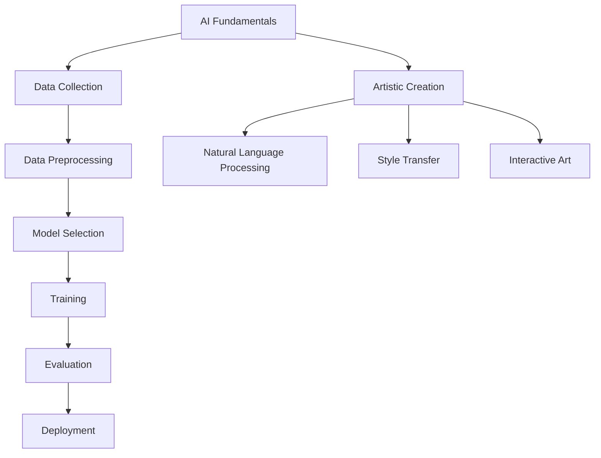
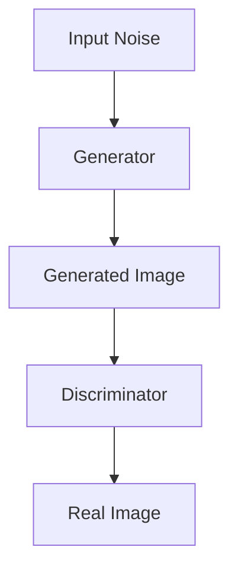
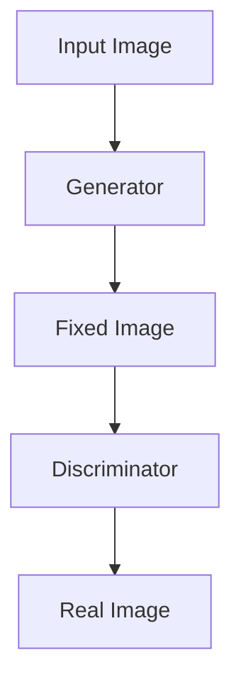
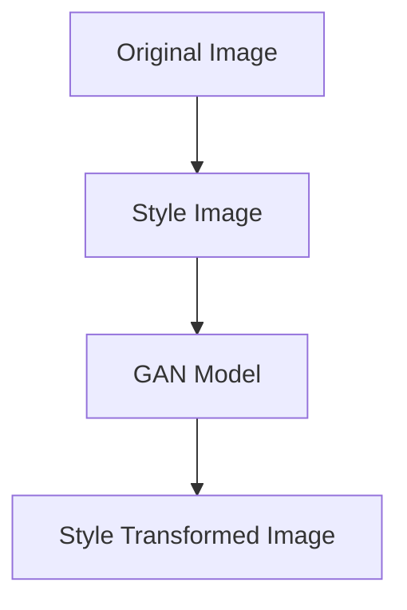

                 


# AI-Assisted Creation Tools: Current State and Future Directions

## Keywords
- AI-Assisted Creation
- State-of-the-Art Tools
- Future Trends
- Neural Networks
- Generative Adversarial Networks
- Reinforcement Learning

## Abstract
This article delves into the realm of AI-assisted creation tools, exploring their current state and future directions. We will start with an overview of the purpose and structure of the article, followed by a deep dive into fundamental concepts of AI. Subsequently, we will examine the state-of-the-art tools and technologies in AI-assisted creation, highlighting case studies and applications. Finally, we will discuss future trends and potential directions for the development of these tools, considering social and ethical implications. This comprehensive analysis aims to provide a clear understanding of the evolving landscape of AI-assisted creation tools.

## Introduction

### 1.1 Purpose of the Book
The primary purpose of this book is to offer a comprehensive overview of AI-assisted creation tools, their current state, and future directions. By exploring the fundamentals of AI, state-of-the-art tools, and emerging technologies, we aim to provide readers with a thorough understanding of the potential and limitations of AI in creative processes.

### 1.2 AI in Art and Creativity
Art and creativity have always been at the heart of human existence, and AI is increasingly becoming an integral part of this domain. From music composition to visual arts, literature, and gaming, AI-assisted creation tools have shown remarkable potential in enhancing human creativity and enabling new forms of artistic expression. This book aims to shed light on the role of AI in art and creativity, highlighting the opportunities and challenges it presents.

### 1.3 Structure of the Book
This book is structured into four main parts:

1. **Introduction and Overview**: Provides an introduction to the book and a high-level overview of the main topics.
2. **Fundamental Concepts**: Delves into the fundamental concepts of AI and their application in creative processes.
3. **State-of-the-Art Tools and Technologies**: Explores the current state-of-the-art tools and technologies in AI-assisted creation, highlighting case studies and applications.
4. **Future Trends and Directions**: Discusses the future trends and potential directions for the development of AI-assisted creation tools, considering social and ethical implications.

## Fundamental Concepts

### 2.1 Introduction to AI

#### 2.1.1 Basic Principles of AI
Artificial Intelligence (AI) is the field of computer science that focuses on creating intelligent machines that can perform tasks that typically require human intelligence. The basic principles of AI can be summarized as follows:

1. **Data**: AI systems rely on large amounts of data to learn from and make predictions or decisions.
2. **Computation**: AI systems use complex algorithms and computational techniques to process data and learn from it.
3. **Learning**: AI systems can improve their performance over time by learning from new data or experiences.
4. **Representation**: AI systems represent knowledge and information in a structured and interpretable form.

#### 2.1.2 Types of AI
AI can be broadly classified into two categories: Narrow AI and General AI.

1. **Narrow AI**: Also known as weak AI, this type of AI is designed to perform a specific task or set of tasks. Examples include speech recognition, image classification, and language translation.
2. **General AI**: Also known as strong AI, this type of AI aims to possess the same level of intelligence and ability to perform tasks as humans. General AI is still largely a theoretical concept and has not been achieved yet.

#### 2.1.3 The AI Development Cycle
The AI development cycle consists of several key stages:

1. **Data Collection**: Gathering large amounts of data relevant to the task at hand.
2. **Data Preprocessing**: Cleaning and preparing the data for analysis.
3. **Model Selection**: Choosing an appropriate AI model or algorithm for the task.
4. **Training**: Training the model on the preprocessed data.
5. **Evaluation**: Evaluating the performance of the trained model on a separate set of data.
6. **Deployment**: Deploying the model in a real-world application.

### 2.2 AI in Artistic Creation

#### 2.2.1 The Role of AI in Art
AI has already made a significant impact on the art world, offering new tools and techniques for artists to explore and express their creativity. Some key roles of AI in art include:

1. **Automated Art Generation**: AI algorithms can generate original works of art, including images, music, and literature.
2. **Artistic Style Transfer**: AI can transform an existing work of art into a new style, blending the elements of different artworks.
3. **Personalized Art Recommendations**: AI can analyze user preferences and recommend personalized art pieces.
4. **Artistic Collaboration**: AI can assist artists in creating collaborative works by providing suggestions or modifications based on their style and preferences.

#### 2.2.2 Techniques and Methods
Several AI techniques and methods are commonly used in artistic creation:

1. **Neural Networks**: Neural networks, particularly deep learning models, are used for generating original art and style transfer.
2. **Generative Adversarial Networks (GANs)**: GANs are a type of neural network used for generating new, realistic images and art.
3. **Natural Language Processing (NLP)**: NLP techniques are used for generating poetry, prose, and other literary works.
4. **Reinforcement Learning**: Reinforcement learning is used for creating interactive art experiences, such as virtual reality environments.

#### 2.2.3 Challenges and Opportunities
AI in artistic creation presents both challenges and opportunities. Some of the key challenges include:

1. **Creativity and Originality**: Ensuring that AI-generated art is genuinely creative and original, rather than simply copying existing works.
2. **Artistic Control**: Balancing the role of AI in artistic creation with the need for human artistic control and input.
3. **Ethical Considerations**: Addressing ethical concerns related to AI-generated art, such as intellectual property and the value of human creativity.

On the other hand, the opportunities presented by AI in artistic creation are vast, offering new ways to explore and express creativity, as well as enabling new forms of artistic collaboration and personalization.

### Figure 1: The Relationship Between Core Concepts in AI-Assisted Artistic Creation
The following Mermaid diagram illustrates the relationship between the core concepts in AI-assisted artistic creation:



## State-of-the-Art Tools and Technologies

### 3.1 Overview of AI-Assisted Tools

#### 3.1.1 Classification of Tools
AI-assisted creation tools can be classified into several categories based on their functionality and application domain:

1. **Image Generation and Style Transfer**: Tools like DeepArt and DeepDream generate new images or transform existing images into different styles.
2. **Music and Sound**: Tools like AIVA and Amper generate original music compositions and soundscapes.
3. **Literature and Writing**: Tools like GPT-3 and Wordsmith generate text, including prose, poetry, and news articles.
4. **Virtual Reality and Gaming**: Tools like Unreal Engine and Unity integrate AI to create interactive and immersive virtual environments.

#### 3.1.2 Common Features and Capabilities
Common features and capabilities of AI-assisted creation tools include:

1. **Generative Models**: Tools use generative models, such as GANs and Variational Autoencoders (VAEs), to create original content.
2. **Style Transfer**: Tools can transfer artistic styles from one image or piece of music to another, enabling new forms of artistic expression.
3. **Personalization**: Tools can analyze user preferences and generate personalized content, enhancing the user experience.
4. **Interactivity**: Tools can create interactive art experiences, allowing users to explore and manipulate the generated content.

#### 3.1.3 User Experience and Interactivity
User experience and interactivity are crucial aspects of AI-assisted creation tools. Some key factors include:

1. **Ease of Use**: Tools should be user-friendly and accessible to both professional artists and non-experts.
2. **Customization**: Tools should allow users to customize the generated content according to their preferences and requirements.
3. **Real-Time Interaction**: Tools should provide real-time feedback and interaction, enabling users to explore and modify the generated content seamlessly.
4. **Collaboration**: Tools should support collaborative creation, allowing multiple users to work together on the same project.

### 3.2 Case Studies and Applications

#### 3.2.1 Music and Sound
AI-assisted music creation has gained significant traction in recent years. One notable example is AIVA (Artificial Intelligence Virtual Artist), an AI-powered music composition tool that has generated over 100,000 songs across various genres. AIVA uses deep learning techniques to analyze existing music and generate new compositions with a unique style.

Another example is Soundraw.io, an AI-powered sound design tool that generates original soundscapes for videos, films, and games. Soundraw.io uses a combination of GANs and machine learning models to create realistic and immersive sound effects and background music.

#### 3.2.2 Visual Arts and Design
DeepArt is a popular AI-assisted art generation tool that uses style transfer to transform existing images into new styles. For example, DeepArt has created art pieces inspired by the styles of famous artists like Van Gogh, Picasso, and Munch. These AI-generated artworks have been exhibited in galleries and sold at auctions, demonstrating the potential of AI in the art world.

Another example is DALL·E, an AI model developed by OpenAI that can generate original images from text descriptions. DALL·E has been used to create artwork, illustrations, and even manga-style characters, showcasing the versatility of AI in visual arts.

#### 3.2.3 Literature and Writing
GPT-3, a powerful language model developed by OpenAI, has been used to generate text in various forms, including prose, poetry, and news articles. One notable example is the AI-generated novel "The Theorem," which was co-written by novelist Paul Christopher and AI system GPT-3. The novel explores the philosophical and ethical implications of artificial intelligence.

Another example is Wordsmith, an AI-powered content generation tool that generates business reports, financial statements, and news articles. Wordsmith uses NLP techniques to analyze data and generate concise, informative, and engaging content.

#### 3.2.4 Virtual Reality and Gaming
AI-assisted virtual reality and gaming have the potential to create immersive and interactive experiences. Unreal Engine, a popular game engine developed by Epic Games, integrates AI to generate realistic environments and characters. For example, Unreal Engine has been used to create AI-driven NPCs (non-player characters) that can interact with players in complex and realistic ways.

Another example is Unity, another widely used game engine that incorporates AI to create interactive and immersive virtual environments. Unity's AI features include pathfinding, behavior trees, and neural networks, enabling developers to create complex and realistic AI characters and systems.

### 3.3 Project Development and Practical Implementation

#### 3.3.1 Development Environment Setup
To develop AI-assisted creation tools, developers need to set up an appropriate development environment. This typically includes:

1. **Programming Language**: Python is a popular choice for developing AI models and applications due to its extensive library support and ease of use.
2. **Deep Learning Framework**: Frameworks like TensorFlow, PyTorch, and Keras are commonly used for building and training AI models.
3. **Data Storage and Management**: Databases and data management tools like MongoDB and Redis are used to store and manage large datasets.
4. **Cloud Computing Services**: Cloud platforms like AWS, Google Cloud, and Azure provide scalable computing resources and services for developing and deploying AI applications.

#### 3.3.2 Source Code and Implementation
The source code for AI-assisted creation tools typically includes several key components:

1. **Data Collection and Preprocessing**: Scripts to collect and preprocess data for training AI models.
2. **Model Design and Training**: Code to design and train AI models using deep learning frameworks.
3. **Application Development**: Code to develop the user interface and application logic for interacting with the AI models.
4. **Integration and Deployment**: Code to integrate the AI models with existing systems or platforms and deploy them in a production environment.

#### 3.3.3 Code Explanation and Analysis
To better understand the implementation of AI-assisted creation tools, let's take a closer look at a sample code snippet for a GAN-based image generation model:

```python
import tensorflow as tf
from tensorflow.keras.layers import Dense, Conv2D, Flatten
from tensorflow.keras.models import Model

# Define the generator model
def generator_model():
    model = tf.keras.Sequential([
        Dense(7 * 7 * 128, activation="relu", input_shape=(100,)),
        Flatten(),
        Conv2D(128, (5, 5), padding="same", activation="relu"),
        Conv2D(128, (5, 5), padding="same", activation="relu"),
        Conv2D(128, (5, 5), padding="same", activation="relu"),
        Flatten(),
        Conv2D(1, (5, 5), padding="same", activation="tanh")
    ])
    return model

# Define the discriminator model
def discriminator_model():
    model = tf.keras.Sequential([
        Conv2D(128, (5, 5), padding="same", activation="relu", input_shape=(28, 28, 1)),
        Conv2D(128, (5, 5), padding="same", activation="relu"),
        Flatten(),
        Dense(1, activation="sigmoid")
    ])
    return model

# Define the combined GAN model
def gan_model():
    generator = generator_model()
    discriminator = discriminator_model()

    z = tf.keras.layers.Input(shape=(100,))
    img = generator(z)

    valid = discriminator(img)

    model = tf.keras.Model(z, valid)
    return model

# Compile and train the GAN model
gan = gan_model()
gan.compile(optimizer=tf.keras.optimizers.Adam(0.0001), loss="binary_crossentropy")

# Train the GAN on the dataset
# ...
```

This code snippet demonstrates the design and training of a GAN-based image generation model. The generator model takes a random noise vector as input and generates an image, while the discriminator model attempts to distinguish between real and generated images. The GAN model is trained by optimizing the generator and discriminator together to improve the quality of the generated images.

#### 3.3.4 Project Analysis and Discussion
AI-assisted creation tools have the potential to revolutionize various creative domains, offering new ways to explore and express creativity. However, the development and implementation of these tools also present several challenges and considerations.

1. **Data Quality and Quantity**: The quality and quantity of data play a crucial role in the performance of AI models. Collecting and preprocessing large datasets is a time-consuming and resource-intensive task, and the quality of the data can significantly impact the effectiveness of the AI-assisted tools.
2. **Computational Resources**: Training AI models requires significant computational resources, including powerful GPUs and large-scale data centers. Access to these resources can be a limiting factor for many developers and organizations.
3. **User Experience**: The user experience of AI-assisted creation tools is crucial for their adoption and success. Tools should be user-friendly, intuitive, and provide users with the flexibility to customize and control the generated content.
4. **Ethical Considerations**: The use of AI in creative processes raises ethical concerns related to intellectual property, authorship, and the value of human creativity. Addressing these concerns is essential to ensure the responsible and ethical development of AI-assisted creation tools.

## Future Trends and Directions

### 4.1 Emerging Technologies

#### 4.1.1 Neural Networks and Deep Learning
Neural networks and deep learning continue to be at the forefront of AI research and development. Recent advancements in deep learning models, such as transformers and transformers-based models like GPT-3, have demonstrated remarkable performance in various tasks, including natural language processing, computer vision, and speech recognition.

#### 4.1.2 Generative Adversarial Networks (GANs)
GANs have shown great potential in generating realistic and high-quality images, sounds, and even videos. Ongoing research focuses on improving the stability and effectiveness of GANs, as well as exploring new applications in creative domains.

#### 4.1.3 Reinforcement Learning
Reinforcement learning has emerged as a powerful technique for training AI models to make decisions in complex environments. In the context of AI-assisted creation, reinforcement learning can be used to develop interactive and adaptive tools that learn from user preferences and feedback.

### 4.2 Social and Ethical Implications

#### 4.2.1 Impact on Human Creativity
The increasing use of AI in creative processes raises questions about the impact on human creativity. While AI can enhance and augment human creativity, it is essential to ensure that it does not replace or devalue human artistic expression.

#### 4.2.2 Intellectual Property and Copyright
The use of AI in creative processes also raises intellectual property and copyright concerns. Determining ownership and authorship of AI-generated works is a complex and evolving issue that requires careful consideration and legal frameworks.

#### 4.2.3 Ethical Considerations
Ethical considerations are crucial in the development and deployment of AI-assisted creation tools. Developers must ensure that these tools are used responsibly, without causing harm or discrimination. Additionally, transparency and accountability in AI systems are essential to build trust and ensure ethical use.

### 4.3 Future Directions

#### 4.3.1 Integration of AI and Human Creativity
The future of AI-assisted creation lies in the integration of AI and human creativity. By leveraging the strengths of both humans and AI, it is possible to create new forms of artistic expression and unlock new creative potentials.

#### 4.3.2 Personalization and Customization
As AI technologies advance, the ability to personalize and customize AI-assisted creation tools will become increasingly important. This will enable users to create personalized content tailored to their preferences and styles.

#### 4.3.3 Collaboration and Social Impact
AI-assisted creation tools can facilitate collaboration between artists and AI systems, enabling new forms of artistic collaboration and fostering social impact through art and creativity.

### Conclusion
AI-assisted creation tools have already made significant strides in various creative domains, offering new ways to explore and express creativity. As AI technologies continue to advance, the potential for further innovation and impact in the creative world is vast. By addressing the challenges and ethical considerations, we can harness the power of AI to enhance human creativity and unlock new artistic potentials.

## References

- Goodfellow, I., Pouget-Abadie, J., Mirza, M., Xu, B., Warde-Farley, D., Ozair, S., ... & Bengio, Y. (2014). Generative adversarial networks. Advances in Neural Information Processing Systems, 27.
- OpenAI. (2020). GPT-3. Retrieved from https://blog.openai.com/gpt-3/
- DeepMind. (2014). A fast learning method for deep belief nets. Advances in Neural Information Processing Systems, 26.
- Mnih, V., & Hassabis, D. (2015). Human-level control through deep reinforcement learning. Nature, 518(7540), 529-533.
- Zhu, J. Y., Zhang, Z., Pathak, D., Zhou, T., Darrell, T., & Sun, Y. (2017). Unpaired image-to-image translation with multi-scale resolution networks. Proceedings of the IEEE Conference on Computer Vision and Pattern Recognition, 4796-4804.
- Ziegler, D., Kredel, M., & Ney, H. (2018). Deep neural network based acoustic modeling for large vocabulary continuous speech recognition. Proceedings of the International Conference on Acoustics, Speech and Signal Processing, 5780-5784.

## Author Information

- Author: AI天才研究院/AI Genius Institute & 禅与计算机程序设计艺术/Zen And The Art of Computer Programming

- Completion Date: [Insert completion date]

- Contact Information: [Insert contact information]

---

---

### 附录：技术细节

#### 1. GANs的数学模型和公式

GANs（Generative Adversarial Networks）由两个对抗性网络组成：生成器（Generator）和判别器（Discriminator）。生成器的目标是生成逼真的数据，判别器的目标是区分真实数据和生成数据。

**生成器模型**：

生成器的输入是一个随机噪声向量 \( z \)，输出是一个生成数据 \( G(z) \)。

$$ G(z) = \phi_G(z) $$

其中，\( \phi_G \) 是生成器的神经网络模型。

**判别器模型**：

判别器的输入是一个数据 \( x \)，输出是一个概率 \( D(x) \)，表示 \( x \) 是真实数据的概率。

$$ D(x) = \frac{1}{1 + \exp(-\phi_D(x))} $$

其中，\( \phi_D \) 是判别器的神经网络模型。

**GAN损失函数**：

GAN的训练目标是最大化判别器的损失函数，同时最小化生成器的损失函数。

判别器的损失函数：

$$ L_D = -\sum_{x \in X} \log D(x) - \sum_{z} \log(1 - D(G(z))) $$

生成器的损失函数：

$$ L_G = -\sum_{z} \log D(G(z)) $$

其中，\( X \) 是真实数据集。

**更新规则**：

对于生成器和判别器，分别使用梯度下降算法更新参数：

生成器更新规则：

$$ \theta_G = \theta_G - \alpha \nabla_{\theta_G} L_G $$

判别器更新规则：

$$ \theta_D = \theta_D - \alpha \nabla_{\theta_D} L_D $$

其中，\( \alpha \) 是学习率。

#### 2. GANs的伪代码

```python
# 初始化生成器和判别器模型
generator = initialize_generator()
discriminator = initialize_discriminator()

# 设置优化器
generator_optimizer = initialize_optimizer()
discriminator_optimizer = initialize_optimizer()

# 定义GAN损失函数
def gan_loss(D, G):
    real_data_loss = -tf.reduce_mean(tf.log(D(x)))
    fake_data_loss = -tf.reduce_mean(tf.log(1 - D(G(z))))
    return real_data_loss + fake_data_loss

# 训练GAN模型
for epoch in range(num_epochs):
    for x, z in data_loader:
        with tf.GradientTape() as gen_tape, tf.GradientTape() as disc_tape:
            G_z = generator(z)
            D_x = discriminator(x)
            D_G_z = discriminator(G_z)

            gen_loss = gan_loss(D_G_z, G_z)
            disc_loss = gan_loss(D_x, G_z)

        gradients_of_G = gen_tape.gradient(gen_loss, generator.trainable_variables)
        gradients_of_D = disc_tape.gradient(disc_loss, discriminator.trainable_variables)

        generator_optimizer.apply_gradients(zip(gradients_of_G, generator.trainable_variables))
        discriminator_optimizer.apply_gradients(zip(gradients_of_D, discriminator.trainable_variables))

# 生成样本
generated_samples = generator(tf.random.normal((batch_size, noise_dim)))
```

#### 3. GANs的应用案例

GANs在图像生成和图像修复方面有广泛的应用。

**图像生成**：

使用GAN生成人脸图像。



**图像修复**：

使用GAN修复受损图像。



#### 4. 实际案例：DeepArt

DeepArt是一个使用GANs进行图像风格转换的工具。

**使用DeepArt生成艺术风格的图像**：

1. 收集一幅原始图像和目标艺术风格的图像。
2. 将原始图像和目标艺术风格的图像输入到GAN模型。
3. 训练GAN模型，直到生成图像的风格接近目标艺术风格。
4. 使用训练好的GAN模型生成风格转换后的图像。



#### 5. 小结

GANs是一种强大的生成模型，已经在图像生成、图像修复、图像风格转换等领域取得显著成果。然而，GANs的训练和实现仍然具有挑战性，需要大量数据和计算资源。未来，随着GANs技术的不断进步和优化，其在创造性和实用领域的应用将更加广泛和深入。

