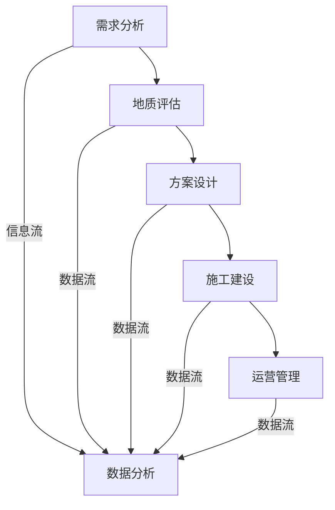

                 

### 文章标题：AI辅助城市地下空间规划：从地质评估到功能优化

#### 关键词：
- AI
- 城市地下空间
- 地质评估
- 功能优化
- 算法原理
- 数学模型
- 项目实战

#### 摘要：
本文将探讨人工智能（AI）在辅助城市地下空间规划中的应用，从地质评估到功能优化。我们将详细讲解核心概念与联系，介绍地质评估和功能优化的算法原理，解析数学模型与公式，并通过实际项目实战展示AI辅助地下空间规划的具体实现过程。文章旨在为读者提供全面的技术指南，助力城市地下空间的科学规划与管理。

### 引言

#### AI在地下空间规划中的应用现状

随着城市规模的不断扩大和人口的持续增长，城市地下空间的开发与利用越来越受到重视。地下空间不仅能够缓解城市地面空间的紧张，还能提供更多的停车、商业、交通等功能，提升城市综合承载力。然而，城市地下空间的规划与开发面临着诸多挑战，如地质条件复杂、空间布局多样化、功能需求多样化等。

近年来，人工智能（AI）技术的迅猛发展为城市地下空间规划带来了新的机遇。AI通过大数据分析、机器学习、深度学习等技术，能够对地质数据、环境数据、社会数据等多源信息进行高效处理，为地下空间规划提供科学的决策支持。具体而言，AI在地下空间规划中的应用主要包括地质评估、功能优化、风险评估等方面。

1. **地质评估**：AI可以通过机器学习算法对地质数据进行挖掘和分析，识别潜在的风险点，为地下空间规划提供准确的地质信息支持。
2. **功能优化**：AI可以根据城市需求和社会经济数据，优化地下空间的布局和功能，提高空间利用效率，满足多样化的城市需求。
3. **风险评估**：AI可以预测地下空间规划过程中可能出现的风险，如地质灾害、环境污染等，为规划提供风险管理依据。

#### 本书结构安排

本文将围绕AI辅助城市地下空间规划的主题，分为以下几个部分：

1. **核心概念与联系**：介绍城市地下空间规划的基本概念，阐述AI在地下空间规划中的应用原理。
2. **地质评估算法原理**：详细讲解地质评估算法的原理，包括数据采集与预处理、算法介绍和比较。
3. **功能优化算法原理**：介绍功能优化算法的原理，包括需求分析、算法介绍和比较。
4. **数学模型与公式讲解**：解析地质评估和功能优化中的数学模型与公式，提供详细的讲解和举例说明。
5. **实际项目实战**：通过一个实际项目，展示AI辅助地下空间规划的具体实现过程，包括开发环境搭建、源代码实现和代码解读、项目效果分析等。
6. **总结与展望**：总结本文的核心内容，展望AI辅助城市地下空间规划的未来发展趋势。

### 核心概念与联系

#### 城市地下空间概述

城市地下空间是指位于城市地面以下的各类空间，包括地下停车场、地下商业街、地下通道、地下铁路、地下水库等。这些空间具有以下特点：

1. **空间多样性**：地下空间形态多样，包括平面、立体、深埋等多种形式。
2. **功能多样性**：地下空间可以用于停车、商业、交通、仓储、科研等多种功能。
3. **资源丰富性**：地下空间具有丰富的自然资源和人文资源，如地下水、矿产资源、古建筑遗迹等。

#### AI基础知识

AI是指人工智能，是计算机科学的一个分支，旨在使机器能够模拟、延伸和扩展人的智能。AI的核心技术包括：

1. **机器学习**：通过数据驱动的方式，使计算机自动识别规律、进行预测和决策。
2. **深度学习**：基于人工神经网络的一种机器学习技术，能够处理复杂的非线性问题。
3. **大数据分析**：对大量结构化和非结构化数据进行分析，提取有价值的信息。

#### 地下空间规划流程

地下空间规划是一个复杂的过程，涉及多个阶段和环节。一般来说，地下空间规划流程包括以下几个阶段：

1. **需求分析**：明确地下空间的功能需求、规模、布局等。
2. **地质评估**：对地下空间的地质条件进行评估，识别潜在的风险点。
3. **方案设计**：根据需求分析和地质评估结果，设计地下空间的布局和功能。
4. **施工建设**：根据设计方案进行地下空间的施工建设。
5. **运营管理**：对地下空间进行运营和维护，确保其安全、高效运行。

#### Mermaid流程图

以下是一个简化的地下空间规划流程的Mermaid流程图：

#### AI在地下空间规划中的应用

1. **地质评估**：利用AI进行地质数据分析，识别地下空间的地质条件，为规划提供科学依据。
2. **功能优化**：通过AI对地下空间的需求进行分析，优化空间布局和功能，提高空间利用效率。
3. **风险评估**：利用AI预测地下空间规划过程中可能出现的风险，为规划提供风险管理依据。
4. **施工建设**：利用AI进行施工过程的监控和管理，提高施工效率和质量。

#### 小结

本文介绍了城市地下空间规划的基本概念、AI的基础知识以及地下空间规划流程。通过Mermaid流程图，我们展示了AI在地下空间规划中的应用。接下来，我们将深入探讨地质评估和功能优化的算法原理，为读者提供更全面的技术指南。

