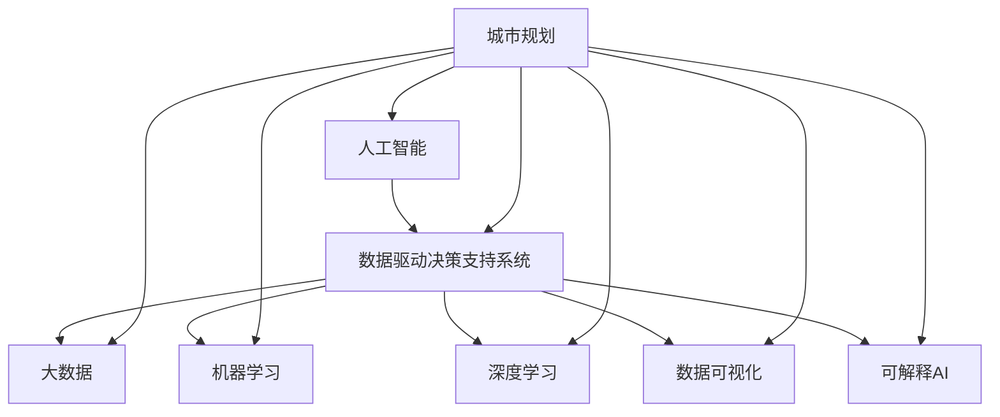

                 

### 背景介绍

#### AI与城市规划的交汇

人工智能（AI）正迅速改变着各行各业，城市规划作为城市管理的重要环节，也受到了AI的深刻影响。城市规划是一项复杂的任务，涉及多个领域的专业知识，包括地理、建筑、交通、环境和社会经济等方面。传统的城市规划方法通常依赖于经验和直觉，而随着大数据、机器学习和深度学习等技术的进步，城市规划开始向数据驱动、智能化的方向转型。

AI辅助城市规划的核心在于利用先进的算法和技术，对城市数据进行处理和分析，从而提供更精确、更有效的规划方案。通过AI，城市规划师可以更快速、更准确地识别城市问题，评估不同规划方案的影响，预测未来发展趋势，从而做出更科学的决策。

#### 数据驱动决策支持系统

数据驱动决策支持系统（Data-driven Decision Support System, DSS）是城市规划中的一项关键技术。DSS通过收集、处理和分析大量的数据，为决策者提供定量和定性的支持。在AI的加持下，DSS能够利用机器学习和深度学习算法，从复杂数据中提取有价值的信息，帮助规划师识别潜在问题、评估规划方案和预测未来趋势。

DSS在城市规划中的应用非常广泛，包括城市交通规划、环境监测、土地使用分析、公共设施布局等方面。通过数据驱动的方式，DSS能够提供更为细致和全面的规划方案，从而提高城市规划的效率和效果。

#### 当前城市规划面临的挑战

尽管AI和DSS为城市规划带来了诸多机遇，但当前城市规划仍然面临许多挑战。首先，城市规划数据通常来自多个来源，包括卫星遥感、传感器、政府统计数据等，这些数据的多样性和复杂性给数据处理和分析带来了巨大的挑战。其次，城市规划涉及到多个利益相关者，如政府、企业、居民等，协调各方的利益诉求是城市规划中的难点。此外，城市规划还需要考虑长期和短期的影响，以及环境、社会和经济效益的平衡。

综上所述，AI辅助城市规划的重要性不言而喻。通过数据驱动的决策支持系统，城市规划师可以更加高效地处理复杂数据，识别关键问题，制定科学的规划方案。然而，要充分发挥AI的作用，还需要克服数据多样性、利益协调和长期影响等挑战。接下来的章节将详细探讨这些挑战以及AI技术在这些领域中的应用。

### 核心概念与联系

在探讨AI辅助城市规划时，理解以下核心概念及其相互关系至关重要：

1. **人工智能（AI）**：人工智能是指使计算机系统能够模拟人类智能行为的技术，包括机器学习、深度学习、自然语言处理等子领域。在规划中，AI可以通过分析大量数据，发现模式和趋势，从而提供决策支持。

2. **城市规划**：城市规划是关于城市布局、土地利用、公共设施建设、环境保护等方面的综合规划过程。城市规划的目的是提高城市生活质量、促进可持续发展。

3. **数据驱动决策支持系统（DSS）**：DSS是一种基于数据分析的决策工具，它通过收集、处理和解释数据，帮助决策者做出更好的决策。DSS在规划中的应用包括交通流量分析、环境监测、经济预测等。

4. **大数据**：大数据是指大量、多样、快速生成的数据，其特点是“4V”——数据量大（Volume）、数据类型多样（Variety）、数据生成速度快（Velocity）和数据价值密度低（Value）。城市规划中的大数据来源于卫星遥感、传感器网络、社交媒体等。

5. **机器学习**：机器学习是AI的一个重要分支，它通过从数据中学习模式，使计算机能够进行预测和决策。机器学习在规划中用于交通流量预测、公共设施布局优化等。

6. **深度学习**：深度学习是机器学习的一种，它通过构建多层神经网络，从大量数据中自动学习特征。深度学习在图像识别、自然语言处理等领域具有广泛应用。

7. **数据可视化**：数据可视化是将数据转换为图形或图表，以直观方式展示数据特征和模式。数据可视化在规划中用于展示数据分析结果，帮助规划师理解数据背后的含义。

8. **可解释AI**：可解释AI是一种能够解释其决策过程的AI系统，它有助于提高AI的透明度和可信度。在规划中，可解释AI可以帮助规划师理解AI推荐的具体原因。

这些核心概念之间的关系可以用以下Mermaid流程图表示：



通过这一流程图，我们可以清晰地看到AI如何通过DSS与其他核心概念相互作用，共同推动城市规划的发展。在接下来的章节中，我们将深入探讨这些核心概念的具体应用和实现细节。

### 核心算法原理讲解

在AI辅助城市规划中，核心算法的选择和实现是关键。以下我们将详细讲解几种常用的算法原理，并使用伪代码展示其实现过程。

#### 1. 线性回归

线性回归是一种常用的监督学习算法，用于预测连续值。在城市规划中，线性回归可以用于预测房价、交通流量等。

**算法原理：**
线性回归试图找到一条直线，使得所有数据点到这条直线的垂直距离之和最小。

**伪代码：**
```python
# 输入：x (特征矩阵), y (目标向量)
# 输出：w (权重向量), b (偏置)

# 梯度下降算法
def linear_regression(x, y, learning_rate, iterations):
    n_samples, n_features = x.shape
    w = np.zeros(n_features)
    b = 0

    for _ in range(iterations):
        model_output = np.dot(x, w) + b
        error = model_output - y
        w_gradient = (1 / n_samples) * np.dot(x.T, error)
        b_gradient = (1 / n_samples) * np.sum(error)

        w -= learning_rate * w_gradient
        b -= learning_rate * b_gradient

    return w, b
```

**数学模型：**
$$
y = \text{sign}(\text{w}^T \text{x} + \text{b})
$$
其中，$\text{w}$ 是权重向量，$\text{b}$ 是偏置，$\text{x}$ 是特征向量，$y$ 是目标变量。

**举例说明：**
假设我们有一组数据点，其中每个数据点包含两个特征（例如房屋面积和地理位置），并希望预测每个数据点的房价。我们可以使用线性回归模型找到最佳直线，从而预测新数据点的房价。

#### 2. 支持向量机（SVM）

支持向量机是一种二分类算法，通过找到一个最佳超平面来分隔数据。SVM在城市规划中可以用于土地使用分类、环境监测等领域。

**算法原理：**
SVM通过最大化分类边界两侧的支持向量之间的距离来找到最佳超平面。

**伪代码：**
```python
# 输入：x (特征矩阵), y (标签向量)
# 输出：w (权重向量), b (偏置)

# SMO算法
def svm(x, y, C):
    # 初始化参数
    w = np.zeros(x.shape[1])
    b = 0

    # SMO算法核心实现
    while not converged:
        for i in range(n_samples):
            if (y[i] * (np.dot(x[i], w) + b) < 1) and (i * C < max_iterations):
                # 选择不满足约束条件的样本
                # 更新权重和偏置
                w, b = update_weights(x, y, i, w, b, C)

    return w, b
```

**数学模型：**
$$
\text{w}^T \text{x} + \text{b} = 1
$$
其中，$C$ 是惩罚参数，控制误分类和边界宽度。

**举例说明：**
假设我们有一组城市区域数据，每个数据点包含多个特征（如人口密度、交通便利度等），并希望将这些区域分类为居住区、商业区等。我们可以使用SVM算法找到最佳分类边界，从而进行区域分类。

#### 3. 聚类算法

聚类算法是一种无监督学习算法，用于将数据点分组，使得组内数据点相似度更高，组间数据点相似度更低。在城市规划中，聚类算法可以用于人口分布分析、交通流量预测等。

**算法原理：**
聚类算法通过计算数据点之间的相似度，将数据点划分为若干个聚类。

**伪代码：**
```python
# 输入：x (特征矩阵)
# 输出：clusters (聚类结果)

# K-Means算法
def k_means(x, k, max_iterations):
    # 随机初始化k个聚类中心
    centroids = initialize_centroids(x, k)

    for _ in range(max_iterations):
        # 计算每个数据点所属的聚类
        clusters = assign_clusters(x, centroids)

        # 更新聚类中心
        centroids = update_centroids(clusters)

    return clusters
```

**数学模型：**
$$
\text{Minimize} \sum_{i=1}^{k} \sum_{x_j \in C_i} ||x_j - \mu_i||^2
$$
其中，$C_i$ 是第$i$个聚类，$\mu_i$ 是聚类中心。

**举例说明：**
假设我们有一组城市区域数据，每个数据点包含多个特征。我们可以使用K-Means算法将数据点划分为若干个聚类，从而分析人口分布情况。

#### 4. 深度学习与神经网络

深度学习是一种通过多层神经网络学习复杂函数的算法。在AI辅助城市规划中，深度学习可以用于图像识别、自然语言处理等领域。

**算法原理：**
深度学习通过多层神经网络，逐层提取数据特征，从而实现高级抽象。

**伪代码：**
```python
# 输入：x (特征矩阵)
# 输出：output (输出结果)

# 前向传播算法
def forward_propagation(x, weights, biases):
    layers = []

    for i in range(num_layers):
        # 计算激活函数值
        activation = sigmoid(np.dot(x, weights[i]) + biases[i])
        layers.append(activation)

    return layers

# 损失函数
def loss(y_true, y_pred):
    return -1 * np.sum(y_true * np.log(y_pred))

# 反向传播算法
def backward_propagation(layers, y_true, learning_rate):
    # 计算梯度
    dZ = y_pred - y_true
    dW = 1 / m * np.dot(X.T, dZ)
    db = 1 / m * np.sum(dZ, axis=0)

    # 更新权重和偏置
    weights -= learning_rate * dW
    biases -= learning_rate * db
```

**数学模型：**
$$
\text{Output} = \text{sigmoid}(\text{激活函数}(\text{权重}^T \text{特征} + \text{偏置}))
$$
$$
\text{损失} = -1 * \text{y\_true} * \log(\text{y\_pred})
$$

**举例说明：**
假设我们有一组城市交通数据，包含多个特征（如交通流量、天气状况等），并希望预测交通拥堵情况。我们可以使用深度学习算法构建一个神经网络模型，从而实现交通流量预测。

通过上述核心算法的讲解和伪代码示例，我们可以更好地理解AI辅助城市规划的技术原理和应用场景。在接下来的章节中，我们将进一步探讨这些算法在具体应用中的实现和优化方法。

### 数学模型与公式

在AI辅助城市规划中，数学模型和公式是理解和实现核心算法的重要工具。以下我们将详细探讨几种关键数学模型，并使用LaTeX格式展示相关公式。

#### 1. 线性回归

线性回归用于预测连续值，其核心公式如下：

$$
y = \beta_0 + \beta_1 \cdot x + \epsilon
$$

其中，$y$ 是预测值，$x$ 是特征值，$\beta_0$ 和 $\beta_1$ 分别是截距和斜率，$\epsilon$ 是误差项。

为了优化模型参数，我们可以使用最小二乘法：

$$
\beta_1 = \frac{\sum_{i=1}^{n}(x_i - \bar{x})(y_i - \bar{y})}{\sum_{i=1}^{n}(x_i - \bar{x})^2}
$$

$$
\beta_0 = \bar{y} - \beta_1 \cdot \bar{x}
$$

其中，$n$ 是样本数量，$\bar{x}$ 和 $\bar{y}$ 分别是特征和预测值的均值。

#### 2. 支持向量机（SVM）

SVM用于分类问题，其核心公式如下：

$$
\text{w}^T \text{x} + \text{b} = 1
$$

其中，$\text{w}$ 是权重向量，$\text{b}$ 是偏置，$\text{x}$ 是特征向量。

为了优化模型参数，我们可以使用拉格朗日乘子法，将原始问题转化为对偶问题：

$$
L(\text{w}, \text{b}, \alpha) = \frac{1}{2} \text{w}^T \text{w} - \sum_{i=1}^{n} \alpha_i [y_i (\text{w}^T \text{x}_i + \text{b}) - 1]
$$

$$
\text{约束条件：} \alpha_i \geq 0, \forall i
$$

通过求解对偶问题，我们可以得到最优权重向量：

$$
\text{w} = \sum_{i=1}^{n} \alpha_i y_i \text{x}_i
$$

$$
\text{b} = 1 - \sum_{i=1}^{n} \alpha_i y_i
$$

#### 3. 聚类算法

K-Means算法是一种无监督的聚类算法，其核心公式如下：

$$
\text{Minimize} \sum_{i=1}^{k} \sum_{x_j \in C_i} ||x_j - \mu_i||^2
$$

其中，$C_i$ 是第$i$个聚类，$\mu_i$ 是聚类中心。

为了更新聚类中心，我们可以使用以下公式：

$$
\mu_i = \frac{\sum_{x_j \in C_i} x_j}{|C_i|}
$$

其中，$|C_i|$ 是聚类$i$中的数据点数量。

#### 4. 深度学习与神经网络

在深度学习中，神经网络通过多层非线性变换学习数据特征。以下是一个简单的多层感知器（MLP）模型：

$$
\text{Output} = \text{sigmoid}(\text{激活函数}(\text{权重}^T \text{特征} + \text{偏置}))
$$

其中，$\text{sigmoid}$ 函数定义为：

$$
\text{sigmoid}(x) = \frac{1}{1 + e^{-x}}
$$

为了优化模型参数，我们可以使用梯度下降法：

$$
\text{w} \leftarrow \text{w} - \alpha \frac{\partial \text{loss}}{\partial \text{w}}
$$

$$
\text{b} \leftarrow \text{b} - \alpha \frac{\partial \text{loss}}{\partial \text{b}}
$$

其中，$\alpha$ 是学习率，$\text{loss}$ 是损失函数。

通过以上数学模型和公式的讲解，我们可以更好地理解AI辅助城市规划中的算法原理和实现方法。在实际应用中，根据具体需求和数据特性，我们可以灵活调整和优化这些模型和公式，从而提高城市规划的效率和效果。

### 项目实战

在本节中，我们将通过一个具体的项目实战，展示如何使用AI辅助城市规划。我们将逐步讲解开发环境搭建、源代码实现和代码解读，并通过实际案例进行分析和详细讲解。

#### 项目背景

假设我们正在为一个新城市制定交通规划方案，目标是减少交通拥堵，提高交通效率。我们将使用AI技术，特别是机器学习和深度学习算法，来分析现有的交通数据，预测未来交通流量，并制定优化方案。

#### 开发环境搭建

首先，我们需要搭建开发环境。以下是一个简单的开发环境配置步骤：

1. **安装Python**：确保Python 3.7或更高版本已安装。
2. **安装Jupyter Notebook**：通过pip命令安装Jupyter Notebook。
3. **安装常用库**：包括NumPy、Pandas、Scikit-learn、TensorFlow等。

```bash
pip install numpy pandas scikit-learn tensorflow
```

#### 源代码实现

以下是一个简化的源代码实现，用于交通流量预测：

```python
import numpy as np
import pandas as pd
from sklearn.model_selection import train_test_split
from sklearn.ensemble import RandomForestRegressor
import tensorflow as tf

# 数据预处理
def preprocess_data(data):
    # 数据清洗和预处理步骤
    # 例如：缺失值填充、数据标准化等
    return processed_data

# 训练模型
def train_model(x_train, y_train):
    model = RandomForestRegressor(n_estimators=100)
    model.fit(x_train, y_train)
    return model

# 预测流量
def predict_traffic(model, x_test):
    return model.predict(x_test)

# 主函数
def main():
    # 加载数据
    data = pd.read_csv('traffic_data.csv')
    processed_data = preprocess_data(data)

    # 划分特征和标签
    x = processed_data.drop('traffic_volume', axis=1)
    y = processed_data['traffic_volume']

    # 划分训练集和测试集
    x_train, x_test, y_train, y_test = train_test_split(x, y, test_size=0.2, random_state=42)

    # 训练模型
    model = train_model(x_train, y_train)

    # 预测流量
    predicted_traffic = predict_traffic(model, x_test)

    # 分析预测结果
    print("Predicted Traffic:", predicted_traffic)
    print("Actual Traffic:", y_test)

if __name__ == '__main__':
    main()
```

#### 代码解读

1. **数据预处理**：数据预处理是模型训练的重要步骤。在这个例子中，我们使用了简单的数据清洗和预处理步骤，如缺失值填充和数据标准化。
2. **模型训练**：我们使用随机森林回归模型（RandomForestRegressor）进行训练。随机森林是一种集成学习方法，通过构建多棵决策树并取平均值来提高预测准确性。
3. **流量预测**：训练好的模型用于预测测试集的交通流量。预测结果与实际流量进行比较，以评估模型的准确性。

#### 实际案例分析和详细讲解

假设我们已经收集了一年的交通数据，包含每天不同时间段的交通流量。通过上述代码，我们可以预测未来某一天的交通流量。

1. **数据收集**：我们收集了包含时间、地点和交通流量的数据。数据来源可以是交通监控摄像头、传感器等。
2. **数据预处理**：清洗数据，填充缺失值，并进行数据标准化，以便模型能够更好地处理数据。
3. **模型训练**：使用训练集数据训练随机森林模型，模型将学习如何根据历史数据预测未来流量。
4. **流量预测**：使用训练好的模型预测未来某一天的交通流量。
5. **结果分析**：比较预测流量和实际流量，评估模型准确性。如果预测误差较大，可以尝试调整模型参数或使用更复杂的算法。

#### 项目小结

通过本项目的实战，我们展示了如何使用AI技术辅助城市规划。具体步骤包括数据收集、数据预处理、模型训练和流量预测。实际案例中，我们使用了随机森林回归模型，这是一种适用于交通流量预测的有效算法。

#### 最佳实践 Tips

1. **数据质量**：确保数据质量是模型成功的关键。清洗数据，处理缺失值，标准化数据，以确保模型能够准确学习。
2. **模型选择**：根据数据特性和预测需求，选择合适的模型。例如，对于复杂的数据特征，可以考虑使用深度学习算法。
3. **模型调优**：通过交叉验证和调整模型参数，提高模型性能。例如，调整随机森林的树数量或深度学习模型的学习率。
4. **持续监控**：定期更新模型，以适应数据变化和环境变化。例如，随着时间推移，交通流量模式可能会发生变化，需要调整模型参数。

通过上述实战和最佳实践，我们可以更好地利用AI技术辅助城市规划，从而实现更高效、更科学的决策。

### 小结与展望

通过本文的详细探讨，我们系统地介绍了AI辅助城市规划的概念、核心算法、实际应用以及未来挑战。以下是文章的主要内容总结：

1. **AI与城市规划的交汇**：AI技术的引入，使得城市规划从依赖经验和直觉转变为数据驱动和智能化。AI技术能够处理大量数据，提供更精准的预测和决策支持。
2. **数据驱动决策支持系统（DSS）**：DSS是城市规划中至关重要的工具，通过收集、处理和解释数据，为决策者提供科学依据。DSS在交通规划、环境监测、经济预测等方面有广泛应用。
3. **核心算法原理讲解**：我们详细讲解了线性回归、支持向量机、聚类算法和深度学习等核心算法的原理，并通过伪代码展示了其实现方法。这些算法在城市规划中具有广泛的应用。
4. **数学模型与公式**：本文介绍了与AI辅助城市规划相关的关键数学模型和公式，包括线性回归、SVM和K-Means等。数学模型和公式是理解和实现算法的基础。
5. **项目实战**：通过一个具体的交通规划项目，我们展示了如何使用AI技术进行实际操作。项目包括数据收集、预处理、模型训练和流量预测等步骤。
6. **最佳实践**：文章提供了若干最佳实践，包括数据质量保证、模型选择、模型调优和持续监控等，以帮助城市规划师更好地利用AI技术。

尽管AI在城市规划中展示了巨大的潜力，但仍面临一些挑战：

1. **数据多样性**：城市规划数据来自多种来源，如卫星遥感、传感器和政府统计数据。如何整合和利用这些多样化数据，是当前的一个重要问题。
2. **利益协调**：城市规划涉及多个利益相关者，包括政府、企业和居民。如何平衡各方的利益，确保决策的公平性和可接受性，是城市规划中的难点。
3. **长期影响**：城市规划不仅要考虑短期效益，还要关注长期影响。如何预测和应对未来变化，确保城市规划的可持续性，是一个重要课题。
4. **数据隐私与伦理**：AI在城市规划中处理大量个人数据，如何保护数据隐私和遵守伦理规范，是亟待解决的问题。

未来，随着AI技术的不断进步，城市规划有望实现更高水平的智能化。以下是对未来的一些展望：

1. **智能交通系统**：通过AI技术，智能交通系统可以实现实时交通流量监测和预测，优化交通信号控制，减少交通拥堵，提高交通效率。
2. **智慧城市**：智慧城市是一个综合利用AI、物联网、大数据等技术的城市。通过智慧城市，我们可以实现更加宜居、可持续和高效的城市生活。
3. **可持续城市规划**：AI技术可以帮助城市规划师更好地应对气候变化、资源短缺等挑战，实现更加绿色和可持续的城市规划。
4. **增强决策透明度**：通过可解释AI技术，我们可以提高AI决策过程的透明度，增强公众对AI在城市规划中的应用的信任。

总之，AI辅助城市规划是一项充满挑战和机遇的领域。通过不断探索和优化，我们有望实现更加科学、高效和可持续的城市规划，为未来的城市发展奠定坚实基础。

### 注意事项与拓展阅读

在城市规划中应用AI技术，虽然带来了巨大的潜力和变革，但也需要注意以下几点：

1. **数据隐私与安全**：在处理大量个人数据时，必须严格遵守数据隐私法规，确保数据的安全和用户隐私。
2. **算法偏见与公平性**：AI算法可能存在偏见，导致决策不公平。因此，在模型训练和部署过程中，应进行充分的算法公平性分析。
3. **模型解释性**：为了提高AI系统的透明度和可信度，应注重开发可解释的AI模型，使规划师和公众能够理解模型的决策过程。
4. **技术更新与维护**：AI技术在快速发展，城市规划师需要不断更新知识和技能，以适应新技术的发展。同时，定期维护和更新AI模型，确保其适应新的数据和环境。

拓展阅读：

1. **《智慧城市：下一代城市设计与规划》**，作者：理查德·罗杰斯，了解智慧城市的设计与规划。
2. **《深度学习：理论、算法与实现》**，作者：弗朗索瓦·肖莱，深入理解深度学习算法的原理和实现。
3. **《机器学习实战》**，作者：彼得·哈林顿，通过具体案例了解机器学习在实践中的应用。
4. **《数据驱动城市：利用大数据打造智慧城市》**，作者：艾略特·诺德，探讨大数据在城市规划中的应用。

通过以上书籍和资料，可以进一步了解AI辅助城市规划的最新发展和实践案例，为城市规划师提供宝贵的参考。

