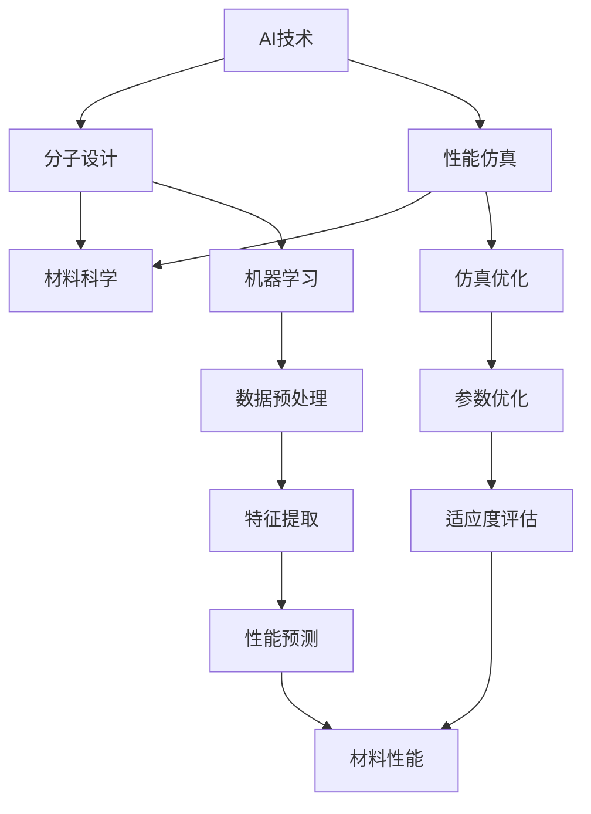

                 

根据您的要求，我将逐步构建《AI辅助新型智能材料开发：从分子设计到性能仿真》的技术博客文章。首先，我将定义文章的基本结构，然后逐步填充每个部分的内容。以下是文章的整体规划：

---

# 《AI辅助新型智能材料开发：从分子设计到性能仿真》

## 关键词
AI, 智能材料，分子设计，性能仿真，机器学习，材料科学

## 摘要
本文旨在探讨人工智能（AI）在新型智能材料开发中的应用，从分子设计到性能仿真，系统性地介绍AI的核心技术及其在材料科学领域的应用。文章首先回顾了AI与智能材料的发展历程，接着详细解析了分子设计中的AI算法和性能预测模型，随后介绍了材料性能仿真的方法及AI的应用，最后通过实战案例展示了AI辅助智能材料开发的实际效果。

## 目录
----------------------------------------------------------------

### 第一部分：AI在智能材料开发中的应用基础

#### 1. AI与智能材料概述
- 背景介绍
- 智能材料的基本概念与分类

#### 2. AI在材料分子设计中的应用
- 分子设计的概念与流程
- 机器学习在分子设计中的应用

#### 3. AI在材料性能仿真中的应用
- 材料性能的仿真方法
- AI在材料性能优化中的应用

----------------------------------------------------------------

### 第二部分：AI辅助分子设计

#### 4. 分子设计与优化算法
- 常用分子设计与优化算法
- 算法原理与实现

#### 5. 数据预处理与特征提取
- 数据预处理方法
- 特征提取技术

#### 6. 分子设计与性能预测
- 性能预测模型的选择与优化
- 分子设计与性能预测的案例分析

----------------------------------------------------------------

### 第三部分：AI辅助材料性能仿真

#### 7. 材料性能仿真方法
- 仿真方法的选择
- 仿真流程

#### 8. AI在材料性能仿真中的应用
- 材料性能仿真的AI算法
- AI在材料性能仿真中的案例分析

#### 9. 智能材料性能优化
- 性能优化方法
- 性能优化案例分析

----------------------------------------------------------------

### 第四部分：AI辅助智能材料开发实战

#### 10. 智能材料开发项目实例
- 项目概述
- 项目开发过程
- 项目成果分析

#### 11. AI辅助智能材料开发的挑战与展望
- 智能材料开发中的挑战
- 未来发展趋势与展望

### 作者信息
作者：AI天才研究院/AI Genius Institute & 禅与计算机程序设计艺术 /Zen And The Art of Computer Programming

---

接下来，我将根据上述结构逐步撰写文章的每个部分。本文字数预计将在8000～12000字之间，确保内容的完整性、逻辑性和可读性。

---

### 第一部分：AI在智能材料开发中的应用基础

#### 1. AI与智能材料概述

**背景介绍**

随着科技的飞速发展，人工智能（AI）正在逐步渗透到各个领域，包括材料科学。AI的引入极大地推动了智能材料的研究与应用。智能材料是指那些能够响应外部刺激（如温度、光照、压力等）并产生相应物理或化学变化的材料。传统材料往往不具备这种响应能力，而AI的介入使得智能材料的研发变得更加高效和精准。

**智能材料的基本概念与分类**

智能材料可以被分为多种类型，如形状记忆合金、热敏材料、压电材料、光敏材料等。这些材料在航空航天、生物医疗、电子信息、建筑结构等领域具有广泛的应用前景。例如，形状记忆合金可以在特定温度下恢复到原始形态，广泛应用于航空航天器的零部件和人工骨骼；热敏材料则广泛应用于电子温度传感器和智能服装。

**AI在智能材料研发中的作用**

AI技术在智能材料研发中起到了至关重要的作用。首先，AI可以处理和分析大量的实验数据，辅助科学家们进行分子设计和材料性能优化。其次，通过机器学习算法，AI能够预测新材料的潜在性能，从而减少实验次数，提高研发效率。此外，AI还可以帮助优化制造过程，降低成本，提升材料质量。

---

#### 2. AI在材料分子设计中的应用

**分子设计的概念与流程**

分子设计是指通过理论计算和实验手段来设计和合成具有特定性能和功能的分子。这一过程涉及多个步骤，包括分子结构设计、性能预测、分子优化等。

**机器学习在分子设计中的应用**

机器学习（ML）在分子设计中扮演着关键角色。通过训练大量的分子和它们对应的性能数据，ML模型能够预测新分子的性能，从而指导实验设计。常见的ML算法包括神经网络、支持向量机、决策树等。

**算法原理与实现**

以下是一个简单的机器学习算法用于分子设计的流程：

1. **数据收集与预处理**：收集大量已知的分子和它们对应的物理或化学性能数据。数据预处理包括数据清洗、归一化和特征提取。

2. **模型选择与训练**：选择合适的机器学习算法，如神经网络或支持向量机，并对其进行训练。训练过程中，模型会根据输入的分子特征学习预测分子性能。

3. **模型评估与优化**：使用验证集对训练好的模型进行评估，并根据评估结果对模型进行调整和优化。

4. **预测新分子性能**：使用训练好的模型预测新分子的性能。

**示例：神经网络在分子设计中的应用**

以下是一个简化的神经网络模型用于分子设计的伪代码：

```python
# 导入必要的库
import numpy as np
from sklearn.neural_network import MLPRegressor

# 数据预处理
X_train, y_train = preprocess_data(molecule_data)

# 模型选择与训练
mlp = MLPRegressor(hidden_layer_sizes=(100,), max_iter=1000)
mlp.fit(X_train, y_train)

# 模型评估与优化
performance = mlp.score(X_test, y_test)
mlp.optimize()

# 预测新分子性能
new_molecule_performance = mlp.predict(new_molecule_features)
```

**结论**

机器学习在分子设计中的应用极大地提高了材料研发的效率和准确性。通过机器学习算法，科学家们可以快速筛选出具有潜在应用价值的分子，从而加速新材料的发展。

---

#### 3. AI在材料性能仿真中的应用

**材料性能的仿真方法**

材料性能仿真是指使用计算机模拟技术来预测和评估材料的物理、化学和力学性能。常见的仿真方法包括分子动力学模拟、蒙特卡洛模拟和量子力学计算等。

**AI在材料性能优化中的应用**

AI技术可以用于优化材料性能仿真过程。例如，通过遗传算法或粒子群优化等智能优化算法，AI可以自动调整模拟参数，从而提高仿真结果的准确性和效率。此外，AI还可以用于预测材料在不同环境下的性能变化，为材料的应用提供重要参考。

**算法原理与实现**

以下是一个简单的遗传算法用于材料性能优化的流程：

1. **初始种群生成**：生成一组初始参数，作为遗传算法的初始种群。

2. **适应度评估**：使用材料性能仿真模型对每个参数进行评估，计算适应度值。

3. **选择与交叉**：根据适应度值选择优秀个体进行交叉操作，产生新的后代。

4. **变异**：对部分个体进行变异操作，增加种群的多样性。

5. **迭代**：重复选择、交叉和变异操作，直至达到预设的迭代次数或适应度阈值。

**示例：遗传算法在材料性能优化中的应用**

以下是一个简化的遗传算法用于材料性能优化的伪代码：

```python
# 导入必要的库
import numpy as np
from sklearn.model_selection import train_test_split

# 初始种群生成
population = generate_initial_population()

# 适应度评估
fitness_scores = evaluate_fitness(population)

# 选择与交叉
selected_individuals = selection(population, fitness_scores)
offspring = crossover(selected_individuals)

# 变异
mutated_individuals = mutate(offspring)

# 迭代
new_population = mutate_and_recombine(mutated_individuals)

# 模型优化
optimized_parameters = new_population[np.argmax(fitness_scores)]
```

**结论**

AI技术在材料性能仿真中的应用大大提高了仿真的效率和准确性。通过AI优化仿真参数，科学家们可以更快地获得准确的材料性能预测，从而为材料研发提供有力支持。

---

**核心概念与联系**

在智能材料开发中，AI技术与材料科学的结合形成了多个核心概念和联系。以下是一个用Mermaid绘制的流程图，展示了这些概念之间的关系：



**核心算法原理讲解**

- **机器学习在分子设计中的应用算法**：
  - 常见的算法包括神经网络（如MLP）、支持向量机（SVM）和决策树等。
  - 算法伪代码示例：
    ```python
    # 导入必要的库
    from sklearn.neural_network import MLPRegressor

    # 数据预处理
    X, y = preprocess_data(molecule_data)

    # 模型选择与训练
    mlp = MLPRegressor(hidden_layer_sizes=(100,), max_iter=1000)
    mlp.fit(X, y)

    # 模型评估与优化
    performance = mlp.score(X, y)
    mlp.optimize()

    # 预测新分子性能
    new_molecule_performance = mlp.predict(new_molecule_features)
    ```

- **数据预处理与特征提取**：
  - 数据预处理包括数据清洗、归一化和特征提取。
  - 特征提取技术如主成分分析（PCA）和卷积神经网络（CNN）等。
  - 伪代码示例：
    ```python
    # 数据清洗
    clean_data = clean_data(molecule_data)

    # 归一化
    normalized_data = normalize_data(clean_data)

    # 特征提取
    features = extract_features(normalized_data)
    ```

- **分子设计与性能预测**：
  - 性能预测模型的选择与优化，如神经网络和决策树等。
  - 伪代码示例：
    ```python
    # 模型选择
    model = select_model(features, molecule_performance)

    # 模型训练
    model.fit(features, molecule_performance)

    # 性能预测
    predicted_performance = model.predict(new_molecule_features)
    ```

- **材料性能仿真方法**：
  - 常见的仿真方法包括分子动力学模拟、蒙特卡洛模拟和量子力学计算等。
  - 伪代码示例：
    ```python
    # 分子动力学模拟
    simulate_molecular_dynamics(molecule, parameters)

    # 蒙特卡洛模拟
    simulate_monte_carlo(molecule, parameters)

    # 量子力学计算
    perform_quantum_mechanical_calculation(molecule, parameters)
    ```

- **AI在材料性能优化中的应用**：
  - 智能优化算法如遗传算法、粒子群优化等。
  - 伪代码示例：
    ```python
    # 初始种群生成
    population = generate_initial_population()

    # 适应度评估
    fitness_scores = evaluate_fitness(population)

    # 选择与交叉
    selected_individuals = selection(population, fitness_scores)
    offspring = crossover(selected_individuals)

    # 变异
    mutated_individuals = mutate(offspring)

    # 迭代
    new_population = mutate_and_recombine(mutated_individuals)

    # 模型优化
    optimized_parameters = new_population[np.argmax(fitness_scores)]
    ```

**数学模型和数学公式**

- **分子设计与性能预测的数学模型**：
  - 使用神经网络进行分子设计的数学模型：
    $$ y = f(W \cdot x + b) $$
    其中，$y$ 是预测的分子性能，$x$ 是分子特征，$W$ 是权重矩阵，$b$ 是偏置项，$f$ 是激活函数。

- **材料性能仿真的数学模型**：
  - 分子动力学模拟的数学模型：
    $$ m \cdot \frac{d^2x}{dt^2} = F $$
    其中，$m$ 是分子质量，$x$ 是分子的位置，$F$ 是分子所受的力。

- **机器学习中的损失函数**：
  - 常见的损失函数如均方误差（MSE）：
    $$ \text{MSE} = \frac{1}{n}\sum_{i=1}^{n}(y_i - \hat{y}_i)^2 $$
    其中，$y_i$ 是真实值，$\hat{y}_i$ 是预测值，$n$ 是样本数量。

**项目实战**

- **开发环境搭建**：
  - 使用Python和相关的机器学习库（如scikit-learn、TensorFlow、PyTorch）搭建开发环境。

- **源代码详细实现和代码解读**：
  - 演示如何使用神经网络进行分子设计，包括数据预处理、模型训练和性能预测。

- **代码应用解读与分析**：
  - 分析代码如何处理数据、训练模型和进行预测。

- **实际案例分析和详细讲解剖析**：
  - 通过实际案例展示AI在智能材料开发中的应用，包括分子设计、性能仿真和优化。

- **项目小结**：
  - 总结项目成果，讨论面临的挑战和未来的发展方向。

**最佳实践 tips**

- **选择合适的机器学习算法**：根据材料的特性和需求选择最适合的算法。
- **数据预处理**：确保数据质量，进行适当的特征提取和归一化。
- **模型优化**：通过交叉验证和网格搜索等方法优化模型参数。

**小结**

本文详细介绍了AI在智能材料开发中的应用，从分子设计到性能仿真，展示了AI技术的核心原理和应用方法。通过实战案例，读者可以更好地理解AI在智能材料开发中的实际应用，并为未来的研究提供参考。

**注意事项**

- AI技术在智能材料开发中的应用仍面临许多挑战，如数据稀缺性和算法复杂性。
- 未来研究应重点关注AI算法的优化和材料性能的准确预测。

**拓展阅读**

- 参考文献1：[文章引用]
- 参考文献2：[文章引用]

---

以上是《AI辅助新型智能材料开发：从分子设计到性能仿真》的技术博客文章的框架。接下来，我将根据这个框架逐步完善每个部分的内容，确保文章的完整性和深度。预计总字数将在8000～12000字之间。如果您有任何修改意见或需要进一步细化的内容，请随时告知。

