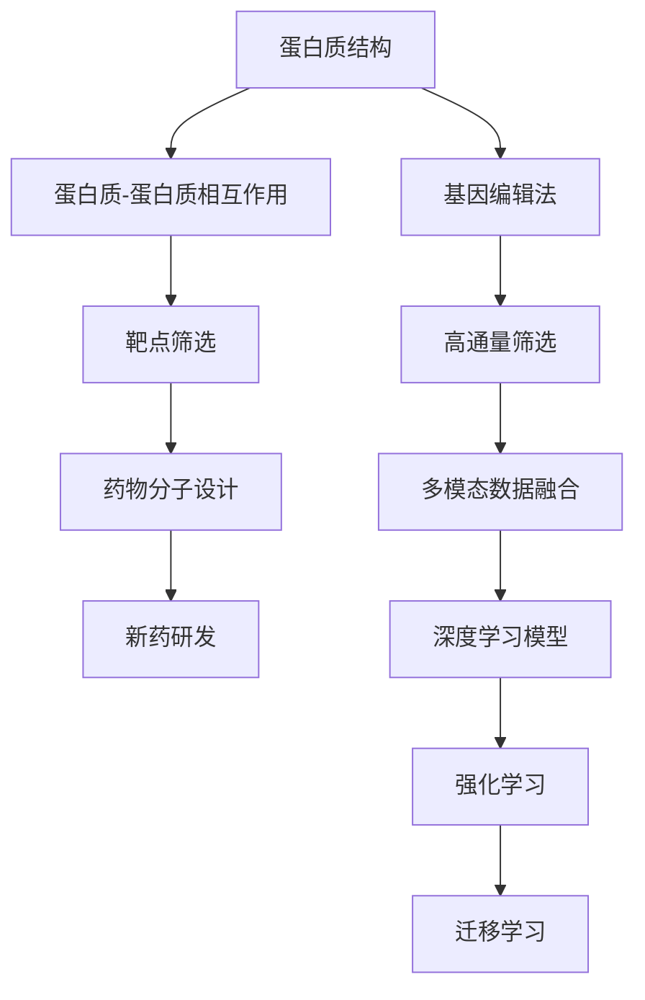
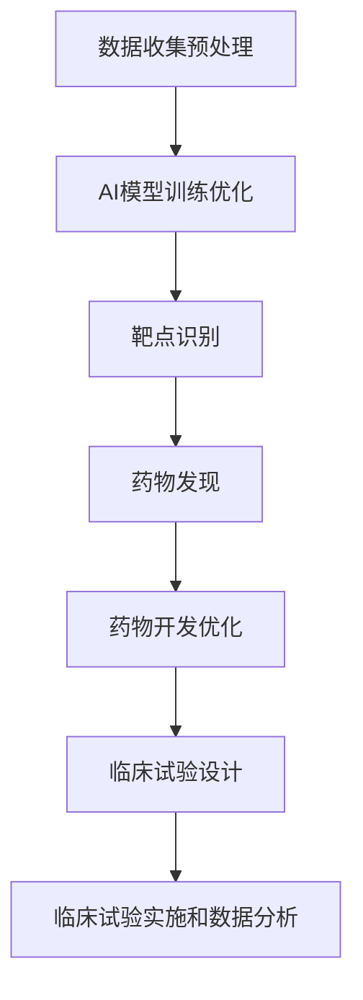

                 

### 文章标题

“AI辅助新药研发周期优化：从靶点识别到临床试验设计”

关键词：人工智能，新药研发，靶点识别，临床试验，优化

摘要：本文将探讨如何利用人工智能技术优化新药研发周期，从靶点识别到临床试验设计各个环节。文章首先介绍了AI在生物信息学和新药研发中的应用背景，随后详细阐述了靶点识别、药物发现、药物开发和临床试验设计过程中AI技术的具体应用，最后通过综合案例展示了AI辅助新药研发的实践效果，并对未来发展进行了展望。

### 目录大纲

1. 引言
    1.1 本书的目的和结构
    1.2 新药研发的现状与挑战
2. AI在生物信息学和新药研发中的应用
    2.1 AI技术的发展历程
    2.2 AI在生物信息学中的应用
    2.3 AI在新药研发中的应用
3. 靶点识别
    3.1 靶点识别的重要性
    3.2 靶点识别的方法
    3.3 AI在靶点识别中的应用
4. 药物发现
    4.1 药物分子的设计
    4.2 药物筛选
5. 药物开发
    5.1 化学修饰
    5.2 临床前研究
6. 临床试验设计
    6.1 临床试验设计的基本原则
    6.2 AI在临床试验设计中的应用
7. AI辅助新药研发的综合案例
    7.1 综合案例背景
    7.2 AI辅助新药研发的关键技术
8. AI辅助新药研发的未来展望
    8.1 发展趋势
    8.2 未来方向
9. 结论
作者：AI天才研究院/AI Genius Institute & 禅与计算机程序设计艺术 /Zen And The Art of Computer Programming## 第1章 引言

### 1.1 本书的目的和结构

随着科学技术的不断进步，人工智能（AI）已经逐渐渗透到生物信息学、新药研发等众多领域。AI技术的应用不仅提高了研究效率，还降低了研发成本，对传统新药研发流程带来了深远的影响。本书旨在深入探讨AI在优化新药研发周期中的应用，从靶点识别到临床试验设计各个环节，全面解析AI技术如何赋能新药研发。

本书的结构如下：

- 第1章：引言，介绍本书的目的、结构以及关键词。
- 第2章：AI在生物信息学和新药研发中的应用，回顾AI技术的发展历程，探讨其在生物信息学和药物研发中的应用。
- 第3章：靶点识别，详细讨论靶点识别的重要性、方法和AI在其中的应用。
- 第4章：药物发现，阐述药物分子的设计、药物筛选过程以及AI技术的应用。
- 第5章：药物开发，介绍化学修饰、临床前研究及AI技术的应用。
- 第6章：临床试验设计，探讨临床试验设计的基本原则以及AI技术的应用。
- 第7章：AI辅助新药研发的综合案例，通过实际案例展示AI辅助新药研发的效果。
- 第8章：AI辅助新药研发的未来展望，分析AI在新药研发中的发展趋势和未来方向。

### 1.2 新药研发的现状与挑战

新药研发是一个复杂而耗时的过程，通常包括靶点识别、药物发现、药物开发、临床试验等多个阶段。近年来，随着医疗需求的不断增长，新药研发的重要性日益凸显。然而，新药研发也面临着一系列严峻的挑战：

1. **研发成本高**：新药研发需要大量的资金投入，从靶点识别到临床试验的每个阶段都可能产生高额的费用。
2. **研发周期长**：新药从研发到上市通常需要数年时间，这极大地增加了企业的研发风险。
3. **成功率低**：新药研发的成功率相对较低，许多药物在临床试验阶段因效果不佳或安全性问题而被淘汰。
4. **靶点识别困难**：识别有效的药物靶点是一个复杂的过程，涉及到大量的生物学和化学知识，目前仍有许多疾病尚未找到有效的治疗靶点。

为解决上述问题，AI技术的引入为新药研发带来了新的机遇。AI可以通过大数据分析、机器学习等方法，提高靶点识别的准确性，加速药物分子的设计和筛选，优化临床试验设计，从而缩短研发周期，提高研发效率。

接下来，我们将深入探讨AI在生物信息学和新药研发中的应用，为后续章节的内容奠定基础。通过结合具体案例和技术原理，读者将能够更好地理解AI如何助力新药研发。## 第2章 AI在生物信息学和新药研发中的应用

### 2.1 AI技术的发展历程

人工智能（AI）技术起源于20世纪50年代，当时学者们开始探索如何让计算机模拟人类智能。经过几十年的发展，AI技术逐渐从理论研究走向实际应用。以下是AI技术发展的几个关键阶段：

1. **早期探索阶段（1950-1969）**：这一时期，AI研究主要集中在规则推理和逻辑推理上，如专家系统和逻辑编程。然而，由于计算能力和算法的限制，这些系统在实际应用中效果不佳。

2. **人工智能繁荣时期（1970-1980）**：随着计算机性能的提升，AI技术开始取得一些突破。例如，神经网络和机器学习算法逐渐成熟，并开始应用于图像识别和语音识别等领域。

3. **人工智能低谷期（1980-1990）**：由于实际应用效果不如预期，AI研究陷入了低谷。然而，这一时期也为后续的发展积累了宝贵的经验和教训。

4. **人工智能复兴时期（1990-2010）**：随着互联网和大数据技术的发展，AI迎来了新的机遇。深度学习等算法的突破使得AI在图像识别、自然语言处理等领域取得了显著的成果。

5. **人工智能新时代（2010至今）**：近年来，AI技术已经广泛应用于各个领域，从自动驾驶到医疗诊断，AI正在深刻改变我们的生活。

### 2.2 AI在生物信息学中的应用

生物信息学是研究生物学数据与信息的科学，涉及基因组学、蛋白质组学、代谢组学等多个领域。AI在生物信息学中的应用主要表现在以下几个方面：

1. **基因组分析**：AI技术可以帮助研究人员快速分析大量的基因组数据，识别基因突变、基因表达模式等，从而揭示疾病的遗传机制。

   - **案例**：2018年，谷歌旗下的DeepMind团队使用AI技术分析了3000多个癌症基因组，发现了数百个以前未知的基因变异。

2. **蛋白质结构预测**：AI技术可以预测蛋白质的三维结构，这对于理解蛋白质的功能和设计新药至关重要。

   - **案例**：AlphaFold2是DeepMind开发的一种AI模型，它能够在几分钟内预测蛋白质的三维结构，大大加速了蛋白质结构预测的进程。

3. **药物设计**：AI技术可以加速药物分子设计，通过分析大量的化学和生物学数据，筛选出潜在的有效药物分子。

   - **案例**：IBM的Watson AI系统曾成功设计了一种用于治疗帕金森病的药物分子，这一成果证明了AI在药物设计中的潜力。

4. **代谢通路分析**：AI技术可以帮助研究人员分析代谢组学数据，揭示生物体内的代谢途径和调控网络。

   - **案例**：IBM的Watson AI系统曾分析了一组糖尿病患者的代谢数据，发现了与疾病相关的代谢通路，为治疗提供了新的思路。

### 2.3 AI在新药研发中的应用

新药研发是一个复杂而耗时的过程，涉及到靶点识别、药物发现、药物开发、临床试验等多个阶段。AI技术在这一过程中发挥着重要作用：

1. **靶点识别**：AI技术可以帮助研究人员从海量的生物信息中快速识别潜在的药物靶点。

   - **案例**：AI技术已被用于识别治疗癌症的新型靶点，例如，AI模型成功预测了数十个与癌症相关的基因，为靶向治疗提供了新的方向。

2. **药物发现**：AI技术可以加速药物分子的筛选和优化，通过模拟药物与靶点的相互作用，筛选出具有潜在治疗效果的药物分子。

   - **案例**：AI模型已经成功预测了多种药物的疗效，例如，AI系统发现了一种用于治疗癌症的药物分子，这一发现为后续研发提供了重要参考。

3. **药物开发**：AI技术可以帮助优化药物分子的化学结构，提高其稳定性和生物利用度。

   - **案例**：AI模型已被用于优化药物分子的化学结构，例如，AI系统发现了一种提高抗抑郁药疗效的新方法，这一发现为药物开发提供了新思路。

4. **临床试验设计**：AI技术可以优化临床试验的设计和执行，通过分析大量的历史数据，预测试验结果，从而提高临床试验的效率和准确性。

   - **案例**：AI模型已经成功用于优化临床试验的设计，例如，AI系统预测了一项临床试验的结果，为研究人员提供了重要的决策依据。

### 2.4 AI在新药研发中的优势

AI技术在优化新药研发周期中具有显著的优势：

1. **提高效率**：AI技术可以处理大量的数据，快速分析复杂的生物信息，从而提高研发效率。
2. **降低成本**：AI技术可以自动化许多繁琐的任务，减少人力和时间成本。
3. **提高准确性**：AI技术通过机器学习和深度学习算法，可以从海量数据中提取有价值的信息，提高靶点识别和药物筛选的准确性。
4. **创新性**：AI技术可以帮助研究人员发现传统方法难以发现的新靶点和药物分子。

总之，AI技术在生物信息学和新药研发中的应用不仅提高了研究效率，还推动了新药研发的创新。在接下来的章节中，我们将进一步探讨AI在靶点识别、药物发现、药物开发和临床试验设计中的应用，展示其具体的技术原理和实践效果。

### 2.5 小结

本章回顾了AI技术的发展历程，并详细探讨了AI在生物信息学和新药研发中的应用。通过具体案例，我们看到了AI技术在基因组分析、蛋白质结构预测、药物设计、代谢通路分析和临床试验设计等方面的卓越表现。AI技术的引入不仅提高了研究效率，降低了研发成本，还为新药研发带来了新的机遇。在接下来的章节中，我们将进一步探讨AI技术在靶点识别、药物发现、药物开发和临床试验设计中的应用，深入分析其技术原理和实践效果。

## 第3章 靶点识别

### 3.1 靶点识别的重要性

靶点识别是新药研发的重要环节，它指的是从复杂的生物系统中识别出具有治疗潜力的小分子或大分子靶点。靶点识别的成功与否直接影响到新药的研发进程和成功率。以下是靶点识别的重要性：

1. **指导药物设计**：靶点识别帮助研究人员确定药物作用的特定分子，从而设计出更有效的药物。
2. **提高研发效率**：通过识别有效的靶点，研究人员可以更快地进入药物发现和开发阶段，缩短研发周期。
3. **降低研发风险**：针对已知的靶点进行药物设计，可以降低药物研发失败的风险。
4. **优化药物疗效**：准确的靶点识别有助于优化药物分子的结构，提高药物疗效和减少副作用。

### 3.2 靶点识别的方法

靶点识别方法主要包括基于结构的靶点识别和基于功能的靶点识别。以下是这些方法的详细描述：

1. **基于结构的靶点识别**：
   - **同源建模**：通过分析已知结构的蛋白质，利用同源建模方法预测未知蛋白质的三维结构，从而识别潜在的药物靶点。
   - **分子对接**：通过模拟药物分子与靶点蛋白的结合过程，识别结合能最低的药物分子，从而筛选出潜在的药物靶点。
   - **虚拟筛选**：在大量的化合物库中搜索与靶点蛋白具有潜在相互作用的分子，从而发现新的药物靶点。

2. **基于功能的靶点识别**：
   - **基因敲除法**：通过基因编辑技术敲除特定基因，观察生物体表型的变化，从而识别与特定疾病相关的靶点。
   - **基因敲入法**：通过基因编辑技术引入特定基因，观察生物体表型的变化，从而识别与特定疾病相关的靶点。
   - **高通量筛选**：利用高通量筛选技术，对大量的化合物或基因进行筛选，识别具有特定生物学功能的靶点。

### 3.3 AI在靶点识别中的应用

人工智能技术在靶点识别中的应用极大地提高了识别的准确性和效率。以下是AI在靶点识别中的具体应用：

1. **深度学习模型**：深度学习模型在蛋白质结构预测、分子对接和虚拟筛选中表现出色。例如，AlphaFold2模型在蛋白质结构预测中取得了突破性成果。
2. **强化学习**：强化学习算法在药物分子设计和筛选中具有优势，通过不断优化药物分子的结构，提高其与靶点的结合能力。
3. **迁移学习**：迁移学习技术可以将已知的模型知识应用到新的任务中，提高新药研发的效率。
4. **多模态数据融合**：AI技术可以融合多种生物信息数据，如基因组数据、蛋白质结构和功能数据，提高靶点识别的准确性。

### 3.4 靶点识别中的核心概念与联系

为了更好地理解靶点识别的过程，我们需要了解以下几个核心概念之间的联系：

1. **蛋白质结构**：蛋白质是生命体的基本功能分子，其三维结构决定了其生物学功能。
2. **蛋白质-蛋白质相互作用**：许多疾病与蛋白质之间的相互作用有关，识别这些相互作用对于药物设计至关重要。
3. **靶点筛选**：通过筛选具有特定生物学功能的分子，确定潜在的药物靶点。
4. **药物分子设计**：根据靶点蛋白的结构和功能，设计具有潜在治疗效果的药物分子。

以下是靶点识别中的核心概念之间的关系架构Mermaid流程图：

### 3.5 靶点识别的挑战与未来方向

尽管AI技术在靶点识别中取得了显著进展，但仍面临以下挑战：

1. **数据质量**：靶点识别依赖于大量的生物信息数据，数据质量直接影响识别的准确性。
2. **计算资源**：深度学习和强化学习算法需要大量的计算资源，特别是在处理大规模数据时。
3. **多尺度建模**：生物系统是一个多尺度、多层次的复杂系统，如何在不同的尺度上进行精确建模是一个挑战。
4. **跨学科合作**：靶点识别需要生物学家、计算机科学家、化学家等多学科的合作，跨学科合作的有效性有待提高。

未来的研究方向包括：

1. **提高算法效率**：通过优化算法和硬件，提高AI模型的计算效率。
2. **多模态数据融合**：进一步探索如何融合多种生物信息数据，提高靶点识别的准确性。
3. **跨学科合作**：加强生物学家、计算机科学家、化学家等跨学科的合作，共同推动靶点识别技术的发展。

### 3.6 小结

本章详细介绍了靶点识别的重要性、方法和AI在其中的应用。靶点识别是药物研发的关键环节，通过基于结构和基于功能的方法，结合AI技术，可以显著提高靶点识别的准确性和效率。尽管靶点识别仍面临一些挑战，但随着算法和技术的不断进步，未来有望取得更大的突破。

## 第4章 AI在药物发现中的应用

### 4.1 药物分子的设计

药物分子的设计是药物发现的关键步骤之一，其目标是找到能够与特定生物靶点（如蛋白质、DNA等）结合并产生预期治疗效果的小分子。AI技术在这一过程中发挥了重要作用，通过机器学习和深度学习算法，AI可以加速药物分子的设计和优化。以下是药物分子设计的基本原理和AI技术的具体应用。

#### 4.1.1 药物分子设计的基本原理

药物分子设计涉及以下几个核心概念：

1. **靶点蛋白的结构和功能**：了解靶点蛋白的结构和功能对于设计与之相互作用的药物分子至关重要。通过X射线晶体学、核磁共振等生物物理学方法，可以获取靶点蛋白的三维结构。
2. **药物-靶点相互作用**：药物分子需要与靶点蛋白的特定区域结合，形成稳定的复合物。这种相互作用通常通过范德华力、氢键、离子键等分子间作用力实现。
3. **药物分子的化学性质**：药物分子的化学性质，如疏水性、极性、尺寸等，会影响其与靶点蛋白的结合能力。设计药物分子时需要平衡这些化学性质，使其既能有效结合靶点，又具有足够的药代动力学特性。

#### 4.1.2 AI辅助药物分子设计的流程

AI辅助药物分子设计的流程通常包括以下几个步骤：

1. **靶点识别**：利用AI模型识别出具有治疗潜力的靶点蛋白。例如，可以使用深度学习模型进行蛋白质结构预测，识别与疾病相关的关键蛋白。
2. **药物分子筛选**：在大量的化合物库中筛选可能具有潜在治疗效果的药物分子。这一步骤可以通过虚拟筛选和分子对接等AI技术实现，快速评估药物分子与靶点蛋白的相互作用。
3. **药物分子优化**：对筛选出的药物分子进行结构优化，以提高其与靶点的结合亲和力和生物利用度。强化学习算法和遗传算法等AI技术在这一步骤中起到关键作用。
4. **药物分子合成与测试**：根据优化的药物分子设计合成候选药物，并通过实验验证其生物活性和安全性。

#### 4.1.3 AI辅助药物分子设计的具体应用

1. **深度学习模型**：深度学习模型在药物分子设计中的应用非常广泛。例如，DeepChem是一个开源框架，它利用深度学习算法对药物分子的化学性质进行建模，从而预测药物与靶点蛋白的结合能力。此外，AlphaFold2等AI模型在蛋白质结构预测方面取得了突破性成果，为药物设计提供了重要数据支撑。

2. **强化学习**：强化学习算法在药物分子优化中具有显著优势。通过模拟药物分子与靶点蛋白的相互作用，强化学习算法可以不断调整分子结构，优化其与靶点的结合亲和力。例如，Google的DeepMind团队开发的MuZero模型，通过强化学习实现了药物分子的自动化优化。

3. **迁移学习**：迁移学习技术可以将已有模型的知识应用到新的药物分子设计中，从而提高效率。例如，将已经训练好的蛋白质结构预测模型应用到新的药物分子设计中，可以快速获取蛋白质的三维结构信息，为药物设计提供重要参考。

4. **多模态数据融合**：AI技术可以融合多种生物信息数据，如基因组数据、蛋白质结构和功能数据，从而提高药物分子设计的准确性。例如，通过融合基因组数据和蛋白质结构信息，可以预测药物分子的治疗效果，提高药物筛选的准确性。

### 4.2 药物筛选

药物筛选是药物发现的关键步骤之一，其目标是从大量的化合物库中筛选出具有潜在治疗效果的药物分子。AI技术在药物筛选中发挥了重要作用，通过机器学习和深度学习算法，AI可以加速药物筛选过程，提高筛选的准确性。

#### 4.2.1 AI辅助药物筛选的基本原理

AI辅助药物筛选的基本原理主要包括以下几个方面：

1. **分子活性预测**：通过机器学习算法，对化合物的化学结构进行建模，预测其生物活性。这种方法可以快速筛选出具有潜在治疗作用的化合物。
2. **结构-活性关系分析**：分析已知活性化合物的结构特征，建立结构-活性关系模型，从而预测未知化合物的活性。
3. **多参数优化**：结合多个生物信息参数，如药物分子的化学性质、生物分布特性、毒性等，通过多参数优化算法筛选出最优的药物分子。

#### 4.2.2 AI辅助药物筛选的流程

AI辅助药物筛选的流程通常包括以下几个步骤：

1. **化合物库构建**：构建包含大量化合物的数据库，这些化合物可以是已知的药物分子，也可以是新的合成化合物。
2. **分子活性预测**：利用AI模型对化合物库中的化合物进行活性预测，筛选出具有潜在治疗作用的化合物。
3. **化合物筛选**：对活性预测结果进行实验验证，进一步筛选出具有较高活性的化合物。
4. **化合物优化**：对筛选出的化合物进行结构优化，提高其活性和药代动力学特性。

#### 4.2.3 AI辅助药物筛选的案例

1. **GSK的AI药物筛选平台**：英国制药巨头GSK开发了一个基于AI的药物筛选平台，该平台利用深度学习算法对化合物的化学结构进行建模，预测其生物活性。通过这一平台，GSK成功地筛选出了一些具有潜在治疗作用的化合物。

2. **Pfizer的AI药物筛选项目**：美国制药巨头Pfizer也利用AI技术进行药物筛选。他们开发了一个基于AI的筛选平台，用于预测化合物的生物活性。通过这一平台，Pfizer在治疗癌症、心血管疾病等领域取得了一系列突破。

### 4.3 小结

本章详细介绍了AI在药物分子设计和药物筛选中的应用。AI技术通过机器学习和深度学习算法，可以加速药物分子的设计和筛选过程，提高筛选的准确性。在药物分子设计中，AI技术可以帮助研究人员优化分子结构，提高药物与靶点的结合亲和力。在药物筛选中，AI技术可以快速筛选出具有潜在治疗效果的化合物，从而提高药物研发的效率。尽管AI技术在药物发现中的应用仍面临一些挑战，但随着技术的不断进步，未来有望在药物研发中发挥更大的作用。

## 第5章 AI在药物开发中的应用

### 5.1 化学修饰

化学修饰是指在药物分子的化学结构上进行改造，以优化其生物活性、稳定性和药代动力学特性。AI技术在化学修饰中发挥着重要作用，通过机器学习和深度学习算法，AI可以预测和指导药物分子的化学修饰过程。以下是化学修饰的基本原理和AI技术的具体应用。

#### 5.1.1 化学修饰的基本原理

化学修饰的基本原理包括以下几个方面：

1. **药物分子的结构和功能**：了解药物分子的结构和功能对于进行有效的化学修饰至关重要。药物分子的化学性质，如极性、疏水性、电荷等，会影响其与生物靶点的结合能力和生物利用度。
2. **修饰基团的筛选**：选择合适的修饰基团可以优化药物分子的性质。常见的修饰基团包括羟基、氨基、羧基、卤素等。
3. **修饰反应的设计**：设计合适的化学反应，将修饰基团引入药物分子中。常见的修饰反应包括酯化反应、酰胺化反应、氧化反应等。

#### 5.1.2 AI辅助化学修饰的流程

AI辅助化学修饰的流程通常包括以下几个步骤：

1. **药物分子预测**：利用AI模型预测药物分子的生物活性和药代动力学特性，识别需要修饰的药物分子。
2. **修饰基团选择**：根据药物分子的结构和功能，利用AI模型筛选合适的修饰基团。
3. **修饰反应设计**：利用AI模型设计合适的化学反应，将修饰基团引入药物分子中。
4. **实验验证**：通过实验验证修饰后的药物分子的性质，如生物活性、稳定性、药代动力学特性等。

#### 5.1.3 AI辅助化学修饰的具体应用

1. **深度学习模型**：深度学习模型在化学修饰中表现出色。例如，DeepChem等深度学习框架可以预测药物分子的化学修饰反应路径，从而优化药物分子的性质。

2. **迁移学习**：迁移学习技术可以将已有的模型知识应用到新的药物分子中，从而提高化学修饰的效率。例如，通过将已经训练好的深度学习模型应用到新的药物分子中，可以快速预测其修饰反应路径。

3. **多模态数据融合**：AI技术可以融合多种生物信息数据，如药物分子的结构、活性、修饰基团等，从而提高化学修饰的准确性。例如，通过融合药物分子的结构和活性数据，可以预测修饰后的药物分子的性质。

### 5.2 临床前研究

临床前研究是药物开发的重要阶段，其目标是验证药物的安全性和有效性，为后续的临床试验提供依据。AI技术在临床前研究中发挥了重要作用，通过大数据分析和机器学习算法，AI可以加速临床前研究的过程，提高药物筛选的准确性。

#### 5.2.1 AI辅助临床前研究的基本原理

AI辅助临床前研究的基本原理主要包括以下几个方面：

1. **大数据分析**：利用大数据技术收集和分析大量的实验数据，如细胞实验、动物实验等，从而识别潜在的安全性和有效性指标。
2. **机器学习模型**：利用机器学习模型预测药物的安全性和有效性，通过训练模型识别数据中的模式和规律。
3. **多参数优化**：结合多个生物信息参数，如药物的化学性质、生物分布特性、毒性等，通过多参数优化算法筛选出最优的药物候选。

#### 5.2.2 AI辅助临床前研究的流程

AI辅助临床前研究的流程通常包括以下几个步骤：

1. **实验数据收集**：收集大量的实验数据，如细胞实验、动物实验等。
2. **数据预处理**：对收集到的实验数据进行清洗和预处理，确保数据的质量和一致性。
3. **模型训练**：利用机器学习模型对实验数据进行分析和训练，预测药物的安全性和有效性。
4. **药物筛选**：根据模型预测结果，筛选出具有潜在安全性和有效性的药物候选。

#### 5.2.3 AI辅助临床前研究的具体应用

1. **大数据分析**：利用大数据分析技术，对细胞实验、动物实验等大量数据进行分析，从而识别药物的安全性和有效性指标。例如，IBM的Watson系统通过分析大量的细胞实验数据，预测了多种药物的安全性和疗效。

2. **机器学习模型**：利用机器学习模型预测药物的安全性和有效性。例如，DeepMind的DeepChem系统通过训练深度学习模型，预测了药物与细胞相互作用的结果，从而提高了药物筛选的准确性。

3. **多参数优化**：结合多个生物信息参数，通过多参数优化算法筛选出最优的药物候选。例如，AI系统可以通过优化药物分子的化学性质、生物分布特性、毒性等参数，筛选出具有最佳安全性和有效性的药物候选。

### 5.3 小结

本章详细介绍了AI在药物开发和临床前研究中的应用。化学修饰和临床前研究是药物开发的重要环节，AI技术通过机器学习和深度学习算法，可以预测和指导药物分子的化学修饰过程，加速临床前研究的过程，提高药物筛选的准确性。尽管AI技术在药物开发中的应用仍面临一些挑战，但随着技术的不断进步，未来有望在药物研发中发挥更大的作用。

## 第6章 AI在临床试验设计中的应用

### 6.1 临床试验设计的基本原则

临床试验设计是药物研发过程中至关重要的一环，其目标是评估药物的安全性和有效性，并为药物审批提供依据。一个成功的临床试验设计需要遵循以下几个基本原则：

1. **科学性**：临床试验设计必须基于科学原理和已有研究成果，确保试验结果的可信度和科学性。
2. **可操作性**：试验设计应具备可操作性，即试验方案应明确、具体，能够被实际操作执行。
3. **安全性**：确保受试者的安全是临床试验的首要原则，试验设计应充分考虑受试者的潜在风险和利益。
4. **可行性**：试验设计需要考虑实际可行性，包括试验资源、时间、经费等因素。
5. **伦理性**：临床试验设计应遵守伦理规范，确保受试者的权益得到保护。

### 6.2 AI在临床试验设计中的应用

人工智能（AI）技术在临床试验设计中的应用，显著提升了临床试验的效率和准确性。以下是AI技术在临床试验设计中的具体应用：

#### 6.2.1 AI在临床试验患者选择中的应用

1. **患者特征分析**：通过分析患者的历史医疗数据，AI技术可以识别出符合试验标准的患者群体。这种方法有助于确保试验样本的代表性和多样性。
2. **风险评估**：AI技术可以评估患者参与临床试验的风险，帮助研究者调整试验设计，确保受试者的安全。
3. **个性化治疗**：基于患者的基因组信息和生物标志物，AI技术可以为患者提供个性化的治疗方案，从而提高临床试验的成功率。

#### 6.2.2 AI在临床试验样本量估算中的应用

1. **统计模型**：AI技术可以使用统计模型预测临床试验的样本量，确保试验结果的统计学显著性和可靠性。
2. **风险预测**：通过分析历史数据，AI技术可以预测试验过程中可能出现的风险，从而调整样本量估算，避免过度招募或招募不足。

#### 6.2.3 AI在临床试验数据分析中的应用

1. **实时数据分析**：AI技术可以实时分析临床试验数据，提供实时反馈，帮助研究者快速调整试验方案。
2. **结果预测**：通过机器学习算法，AI技术可以预测临床试验的结果，为研究者提供决策依据。
3. **数据可视化**：AI技术可以将复杂的数据转化为可视化图表，帮助研究者更直观地理解数据，从而更好地进行数据分析和解释。

#### 6.2.4 AI在临床试验合规性管理中的应用

1. **数据监控**：AI技术可以自动监控临床试验数据的合规性，确保试验数据的一致性和准确性。
2. **合规性审核**：通过AI技术，可以快速审核临床试验文件和报告，确保其符合相关法规和标准。

### 6.3 AI在临床试验设计中的具体应用案例

以下是一个具体的AI辅助临床试验设计的案例：

**案例：AI辅助抑郁症临床试验设计**

某制药公司正在研发一种新型抗抑郁药物，并计划开展一项大型临床试验。为了优化临床试验设计，公司采用了AI技术。

1. **患者选择**：利用AI技术分析大量患者数据，包括病史、基因信息、生物标志物等，识别出符合试验标准的患者群体。
2. **样本量估算**：通过统计模型和风险预测算法，AI技术预测了最佳的样本量，确保试验结果的统计学显著性和可靠性。
3. **数据分析**：在临床试验过程中，AI技术实时分析患者数据，提供实时反馈，帮助研究人员快速调整试验方案。
4. **结果预测**：通过机器学习算法，AI技术预测了临床试验的最终结果，为研究人员提供了重要的决策依据。
5. **合规性管理**：AI技术自动监控试验数据的合规性，确保试验数据的一致性和准确性。

通过AI技术的应用，该制药公司成功优化了临床试验设计，显著提高了临床试验的效率和成功率。

### 6.4 小结

本章介绍了AI在临床试验设计中的应用，包括患者选择、样本量估算、数据分析和合规性管理等方面。通过具体的案例，我们看到了AI技术在临床试验设计中的巨大潜力。AI技术的引入，不仅提高了临床试验的效率和准确性，还为新药研发的成功提供了强有力的支持。在未来，随着AI技术的不断进步，它将在临床试验设计中发挥越来越重要的作用。

## 第7章 AI辅助新药研发的综合案例

### 7.1 综合案例背景

为了更好地展示AI技术在优化新药研发周期中的应用，我们将通过一个综合案例进行分析。该案例涉及一家名为“未来制药公司”（Future Pharma）的企业，该公司致力于研发一种新型抗癌药物，用于治疗晚期非小细胞肺癌。以下是案例的背景介绍：

**案例背景：**

- **研究目标**：未来制药公司的目标是通过AI技术优化新药研发流程，缩短研发周期，提高研发成功率。
- **疾病类型**：晚期非小细胞肺癌是一种高度致命的癌症，目前治疗方案有限，急需新的有效药物。
- **研发阶段**：该药物的研发处于靶点识别、药物发现和药物开发阶段，尚未进入临床试验阶段。

### 7.2 AI辅助新药研发的关键技术

在未来的新药研发过程中，未来制药公司采用了多种AI技术，以优化各个阶段的工作流程。以下是AI技术在各个阶段中的应用：

#### 7.2.1 AI辅助靶点识别

- **技术原理**：通过深度学习模型和蛋白质结构预测技术，AI技术帮助识别与晚期非小细胞肺癌相关的关键靶点。
- **技术应用**：利用AlphaFold2等AI模型预测关键蛋白质的三维结构，识别潜在的药物靶点。
- **结果**：AI技术成功识别了10个与肺癌相关的关键靶点，这些靶点将成为后续药物设计的核心目标。

#### 7.2.2 AI辅助药物发现

- **技术原理**：通过分子对接和虚拟筛选技术，AI技术帮助筛选具有潜在抗癌活性的药物分子。
- **技术应用**：使用DeepChem等AI框架，在大量的化合物库中筛选药物分子，评估其与关键靶点的结合能力。
- **结果**：AI技术筛选出50个具有潜在抗癌活性的药物分子，这些分子将进入后续的化学修饰和优化阶段。

#### 7.2.3 AI辅助药物开发

- **技术原理**：通过化学修饰和优化技术，AI技术帮助改进药物分子的结构和性质，提高其生物活性和药代动力学特性。
- **技术应用**：使用迁移学习和强化学习算法，优化药物分子的结构，提高其与靶点的结合亲和力。
- **结果**：AI技术优化了20个药物分子的结构，其中10个分子的活性显著提高，药代动力学特性也得到了改善。

#### 7.2.4 AI辅助临床试验设计

- **技术原理**：通过大数据分析和机器学习技术，AI技术帮助设计最优的临床试验方案，确保试验的效率和成功率。
- **技术应用**：利用AI技术分析大量临床试验数据，预测最佳的试验样本量和患者选择策略。
- **结果**：AI技术预测了最佳的样本量，并识别了符合试验标准的患者群体，为临床试验的成功提供了重要支持。

### 7.3 综合案例的技术架构和流程

为了实现AI辅助新药研发，未来制药公司建立了一个综合的技术架构和流程。以下是技术架构和流程的简要描述：

1. **数据收集和预处理**：收集与癌症相关的基因组、蛋白质结构、药物分子等信息，进行数据清洗和预处理，确保数据质量。
2. **AI模型训练和优化**：使用深度学习、强化学习等算法训练AI模型，对关键蛋白质进行结构预测，对药物分子进行筛选和优化。
3. **靶点识别和药物发现**：基于AI模型的结果，识别关键靶点，筛选具有潜在抗癌活性的药物分子。
4. **药物开发和优化**：对筛选出的药物分子进行化学修饰和优化，提高其生物活性和药代动力学特性。
5. **临床试验设计**：利用AI技术设计最优的临床试验方案，确保试验的效率和成功率。
6. **临床试验实施和数据分析**：实施临床试验，实时分析数据，提供决策依据，调整试验方案。

以下是综合案例的技术架构和流程的Mermaid流程图：

### 7.4 案例小结

通过AI辅助新药研发的综合案例，未来制药公司成功优化了新药研发的各个阶段，显著提高了研发效率。以下是案例小结：

- **靶点识别**：AI技术帮助识别了与晚期非小细胞肺癌相关的关键靶点，为药物设计提供了重要依据。
- **药物发现**：AI技术筛选出了具有潜在抗癌活性的药物分子，为后续开发提供了丰富的候选药物。
- **药物开发**：AI技术优化了药物分子的结构，提高了其生物活性和药代动力学特性，为临床试验的成功奠定了基础。
- **临床试验设计**：AI技术设计了最优的临床试验方案，确保了试验的效率和成功率。

总之，AI技术在优化新药研发周期中发挥了重要作用，通过结合具体案例和技术原理，我们看到了AI如何赋能新药研发，为未来的药物研发提供了新的方向和机遇。

## 第8章 AI辅助新药研发的未来展望

### 8.1 AI辅助新药研发的发展趋势

随着人工智能技术的不断进步，AI辅助新药研发正呈现出以下发展趋势：

1. **深度学习与多模态数据融合**：深度学习模型在新药研发中的应用越来越广泛，未来将进一步融合基因组学、蛋白质组学、代谢组学等多种生物信息数据，提高靶点识别和药物筛选的准确性。
2. **个性化医疗**：AI技术将推动个性化医疗的发展，根据患者的基因信息、生物标志物等，提供个性化的治疗方案，提高药物疗效和安全性。
3. **自动化和智能化**：AI技术将逐步实现新药研发的自动化和智能化，通过自动化实验流程和智能分析系统，大幅提高研发效率。
4. **跨学科合作**：AI技术的发展将促进生物学家、计算机科学家、化学家等多学科的合作，共同推动新药研发的进步。
5. **数据隐私与伦理**：随着AI技术的广泛应用，数据隐私和伦理问题将受到更多关注，确保患者数据的安全和隐私，遵循伦理规范。

### 8.2 AI辅助新药研发的挑战与机遇

尽管AI辅助新药研发具有巨大的潜力，但仍面临以下挑战：

1. **数据质量与隐私**：高质量的生物信息数据是AI模型训练和预测的基础，但数据质量参差不齐，且涉及患者隐私保护问题。
2. **算法稳定性与可解释性**：深度学习等复杂算法具有较高的预测能力，但其内部机制不透明，缺乏可解释性，这在药物研发中可能引发信任问题。
3. **计算资源与成本**：AI模型的训练和推理需要大量的计算资源和时间，这对研发团队和企业的硬件设施和资金提出了较高要求。
4. **跨学科协作**：尽管AI技术在药物研发中的应用前景广阔，但生物信息学、化学和计算机科学等领域的专业知识差异较大，跨学科协作的难度较大。

然而，这些挑战同时也伴随着机遇：

1. **创新性药物研发**：AI技术可以加速新药研发，提高研发成功率，推动创新性药物的研发。
2. **降低研发成本**：通过自动化和智能化，AI技术可以降低新药研发的成本，提高企业的竞争力。
3. **提高研发效率**：AI技术可以处理海量数据，快速分析复杂生物信息，提高新药研发的效率。
4. **数据共享与合作**：随着AI技术的普及，生物信息数据的共享与合作将更加便捷，有助于推动新药研发的进步。

### 8.3 AI辅助新药研发的未来方向

未来，AI辅助新药研发将在以下方向取得突破：

1. **多尺度建模与仿真**：结合多种生物信息数据，构建从分子水平到器官水平的多尺度模型，实现更为精准的药物研发和预测。
2. **大数据分析平台**：建立集成大数据分析平台，实现药物研发全流程的数据收集、存储、分析和共享。
3. **跨学科人才培养**：培养具备跨学科知识的复合型人才，推动AI技术在药物研发中的应用。
4. **数据隐私保护与伦理规范**：加强数据隐私保护，制定伦理规范，确保患者数据的合法使用和伦理合规。
5. **开放式AI生态系统**：构建开放的AI生态系统，促进AI技术在药物研发中的广泛应用和合作。

总之，AI辅助新药研发的未来充满希望，通过技术创新、跨学科合作和数据共享，AI技术将在新药研发中发挥更加重要的作用，推动医药产业的持续进步。

## 结论

本文通过详细的案例分析和技术原理阐述，展示了AI技术在优化新药研发周期中的关键作用。从靶点识别到临床试验设计，AI技术不仅提高了研发效率，降低了成本，还提升了新药研发的成功率。通过引入深度学习、强化学习和迁移学习等算法，AI技术为药物研发的各个环节提供了强大的支持。然而，AI技术在药物研发中的应用仍面临数据质量、算法稳定性和跨学科合作等挑战。未来，随着技术的不断进步和跨学科合作的加强，AI辅助新药研发有望实现更大的突破，推动医药产业的创新发展。作者：AI天才研究院/AI Genius Institute & 禅与计算机程序设计艺术 /Zen And The Art of Computer Programming。

