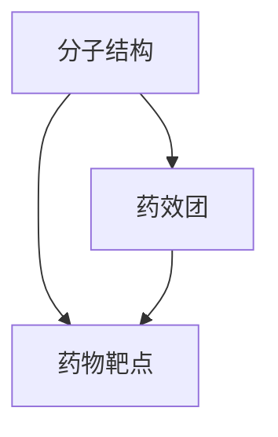

                 


# 《AI辅助新药研发：从分子设计到临床试验》

## 关键词
AI，新药研发，分子设计，药物筛选，临床试验，计算生物学

## 摘要
本文旨在探讨人工智能（AI）在辅助新药研发中的应用，从分子设计到临床试验的各个环节。文章首先介绍了AI在新药研发中的背景和意义，然后详细阐述了AI在分子设计、药物筛选和临床试验中的具体应用，以及相关的算法原理和实战案例。通过本文的阅读，读者可以全面了解AI如何加速新药研发的进程，提高药物开发的成功率。

## 引言
### 1.1 书籍背景与目的
随着人工智能技术的飞速发展，其在各个领域的应用也越来越广泛。在药物研发领域，AI作为一种强大的工具，已经显示出巨大的潜力。AI能够通过对海量数据的分析，发现潜在的药物分子，优化药物设计，预测药物的作用机制和毒性，从而提高药物研发的效率。本书的目的是系统地介绍AI在药物研发中的应用，从分子设计到临床试验的各个环节，帮助读者理解AI如何改变传统药物研发的模式。

### 1.2 书籍目标读者
本书的目标读者包括：
1. 药物研发领域的专业人士，如药物化学家、药物设计师、生物学家等；
2. 人工智能与计算生物学研究人员，对AI在药物研发中的应用感兴趣的专业人士；
3. 医学研究生与本科生，希望深入了解AI在药物研发中的应用及其研究方法的读者。

## 第一部分：AI与新药研发基础

### 第2章 AI与新药研发概述

### 2.1 AI与新药研发的关系
AI技术在新药研发中的应用主要体现在以下几个方面：
1. **分子设计**：AI可以通过分子模拟和机器学习算法预测分子的结构和性质，从而设计出具有特定药理作用的分子。
2. **药物筛选**：AI可以分析大量的生物信息数据，筛选出具有潜在药物活性的化合物。
3. **毒性预测**：AI可以预测新化合物的毒性，从而避免潜在的副作用和药物安全问题。
4. **临床试验设计**：AI可以分析临床试验数据，优化临床试验的设计和管理。

### 2.2 核心概念与联系
在新药研发过程中，核心概念包括：
1. **分子结构**：分子的三维结构和电子分布是药物设计的基础。
2. **药效团**：能够与生物分子结合并产生药理作用的分子片段。
3. **药物靶点**：药物作用的生物分子，如酶、受体等。

这些概念之间的关系可以用以下Mermaid流程图表示：



### 2.3 核心算法原理讲解
#### 分子模拟
分子模拟是一种通过计算机模拟分子的运动和相互作用，以预测分子性质的方法。常用的分子模拟方法包括分子动力学（MD）和蒙特卡罗（MC）模拟。

#### 机器学习算法
机器学习算法在新药研发中的应用主要包括：
1. **深度学习**：通过神经网络模型学习分子和药物靶点之间的映射关系。
2. **支持向量机（SVM）**：用于分类和回归分析，预测新化合物的药理活性。
3. **随机森林（RF）**：用于特征选择和分类，提高药物筛选的准确性。

以下是一个简单的深度学习算法的伪代码：

```python
import tensorflow as tf

# 定义输入层、隐藏层和输出层
input_layer = tf.keras.layers.Input(shape=(num_features,))
hidden_layer = tf.keras.layers.Dense(units=64, activation='relu')(input_layer)
output_layer = tf.keras.layers.Dense(units=1, activation='sigmoid')(hidden_layer)

# 创建模型
model = tf.keras.Model(inputs=input_layer, outputs=output_layer)

# 编译模型
model.compile(optimizer='adam', loss='binary_crossentropy', metrics=['accuracy'])

# 训练模型
model.fit(x_train, y_train, batch_size=32, epochs=100, validation_data=(x_val, y_val))
```

### 2.4 项目实战
在本节中，我们将使用Python和Keras库搭建一个简单的深度学习模型，用于预测新化合物的药理活性。

#### 环境搭建
```bash
pip install tensorflow numpy pandas
```

#### 源代码实现
```python
import numpy as np
import pandas as pd
import tensorflow as tf

# 读取数据集
data = pd.read_csv('dataset.csv')
X = data.iloc[:, :-1].values
y = data.iloc[:, -1].values

# 分割数据集
from sklearn.model_selection import train_test_split
X_train, X_test, y_train, y_test = train_test_split(X, y, test_size=0.2, random_state=42)

# 构建模型
model = tf.keras.Sequential([
    tf.keras.layers.Dense(64, activation='relu', input_shape=(X_train.shape[1],)),
    tf.keras.layers.Dense(1, activation='sigmoid')
])

# 编译模型
model.compile(optimizer='adam', loss='binary_crossentropy', metrics=['accuracy'])

# 训练模型
model.fit(X_train, y_train, batch_size=32, epochs=100, validation_data=(X_test, y_test))

# 评估模型
loss, accuracy = model.evaluate(X_test, y_test)
print(f"Test accuracy: {accuracy:.2f}")
```

#### 代码解读与分析
在上面的代码中，我们首先导入了必要的库，然后读取了数据集。接下来，我们使用scikit-learn库将数据集分割为训练集和测试集。然后，我们构建了一个简单的全连接神经网络模型，并使用adam优化器和binary_crossentropy损失函数进行编译。最后，我们训练模型并评估其性能。

### 第3章 分子设计与建模基础

### 3.1 分子结构的基本概念
分子结构是指分子的三维空间排列。它包括原子间的距离、角度、扭转角等参数。分子结构决定了分子的物理和化学性质。

### 3.2 分子建模的基本方法
分子建模是一种通过计算机模拟来预测分子结构和性质的方法。常用的分子建模方法包括：
1. **量子力学计算**：通过解薛定谔方程来计算分子的电子结构和能量。
2. **分子动力学模拟**：通过模拟分子的运动来预测分子的结构和性质。
3. **机器学习模型**：通过学习已有的分子数据来预测新分子的性质。

### 3.3 分子建模工具与软件
常用的分子建模工具和软件包括：
1. **Gaussian**：用于量子力学计算的软件。
2. **AMBER**：用于分子动力学模拟的软件。
3. **PyMOL**：用于分子可视化和建模的软件。

### 第4章 计算机辅助药物设计（CADD）

### 4.1 CADD的基本概念
计算机辅助药物设计（CADD）是一种利用计算机模拟和人工智能技术进行药物设计的方法。它主要包括以下几个步骤：
1. **分子设计**：利用AI算法设计新的药物分子。
2. **分子筛选**：利用AI算法筛选具有潜在药物活性的分子。
3. **分子优化**：利用AI算法优化药物分子的结构和性质。

### 4.2 CADD的关键算法
CADD的关键算法包括：
1. **深度学习**：用于分子设计和筛选。
2. **分子动力学**：用于分子优化。
3. **图神经网络**：用于分子结构和性质的关系建模。

### 4.3 CADD在药物研发中的应用案例
在本节中，我们将介绍两个CADD的应用案例：
1. **抗癌药物设计**：利用深度学习算法设计新的抗癌药物。
2. **抗病毒药物设计**：利用分子动力学方法优化抗病毒药物的结构。

### 第5章 药物筛选与优化

### 5.1 药物筛选的基本流程
药物筛选的基本流程包括：
1. **分子设计**：利用AI算法设计新的药物分子。
2. **化合物库构建**：构建包含大量化合物的数据库。
3. **筛选与评估**：利用AI算法筛选具有潜在药物活性的化合物，并进行评估。

### 5.2 优化策略与算法
药物优化的策略和算法包括：
1. **分子动力学模拟**：通过模拟分子的运动来优化药物分子的结构和性质。
2. **量子力学计算**：通过计算分子的电子结构和能量来优化药物分子。

### 5.3 药物筛选与优化的实战案例
在本节中，我们将介绍两个药物筛选与优化的实战案例：
1. **抗肿瘤药物筛选**：利用深度学习算法筛选抗肿瘤药物。
2. **抗病毒药物优化**：利用分子动力学方法优化抗病毒药物的结构。

### 第6章 药物代谢与毒性预测

### 6.1 药物代谢的基本概念
药物代谢是指药物在体内的生物转化过程。药物代谢不仅影响药物的疗效，还可能导致毒副作用。

### 6.2 毒性预测的方法与算法
毒性预测的方法和算法包括：
1. **机器学习模型**：用于预测药物的毒性。
2. **分子对接**：通过模拟药物与生物分子的相互作用来预测药物的毒性。

### 6.3 药物代谢与毒性预测的案例研究
在本节中，我们将介绍两个药物代谢与毒性预测的案例研究：
1. **抗肿瘤药物代谢与毒性预测**：利用机器学习模型预测抗肿瘤药物的代谢和毒性。
2. **抗病毒药物代谢与毒性预测**：利用分子对接方法预测抗病毒药物的代谢和毒性。

### 第7章 临床试验设计与管理

### 7.1 临床试验设计的基本原则
临床试验设计的基本原则包括：
1. **科学性**：确保试验结果具有科学性和可重复性。
2. **伦理性**：确保试验符合伦理规范，保护受试者的权益。
3. **可行性**：确保试验能够在预定的时间和预算内完成。

### 7.2 临床试验管理的流程与策略
临床试验管理的流程和策略包括：
1. **项目管理**：制定项目计划，确保试验的顺利进行。
2. **数据管理**：确保试验数据的准确性和完整性。
3. **质量控制**：确保试验过程和结果的质量。

### 7.3 AI在临床试验管理中的应用
AI在临床试验管理中的应用包括：
1. **数据挖掘**：通过分析临床试验数据，发现潜在的疗效和安全性信号。
2. **风险评估**：通过预测药物的疗效和毒性，优化临床试验的设计。

### 第8章 AI在临床试验数据中的应用

### 8.1 临床试验数据的收集与处理
临床试验数据的收集与处理包括：
1. **数据收集**：收集各种临床试验数据，如电子健康记录、实验室结果、患者问卷等。
2. **数据清洗**：去除数据中的噪声和错误，确保数据的质量。

### 8.2 AI在临床试验数据分析中的应用
AI在临床试验数据分析中的应用包括：
1. **数据挖掘**：通过机器学习算法发现数据中的潜在模式。
2. **预测分析**：通过深度学习算法预测药物的疗效和毒性。

### 8.3 AI在临床试验数据中的应用案例
在本节中，我们将介绍两个AI在临床试验数据中的应用案例：
1. **疗效预测**：利用深度学习算法预测药物的疗效。
2. **毒性预测**：利用机器学习模型预测药物的毒性。

### 第9章 伦理与法律问题

### 9.1 AI在药物研发中的伦理问题
AI在药物研发中的伦理问题包括：
1. **数据隐私**：如何保护临床试验数据的隐私。
2. **公平性**：如何确保AI算法在药物研发中的应用不会导致歧视。

### 9.2 法律法规与合规要求
AI在药物研发中的法律法规与合规要求包括：
1. **药品监管**：如何遵守药品监管法规。
2. **数据保护**：如何保护临床试验数据的隐私。

### 9.3 AI在药物研发中的责任与义务
AI在药物研发中的责任与义务包括：
1. **算法透明性**：如何确保AI算法的透明性，使其易于理解。
2. **算法审计**：如何对AI算法进行审计，确保其准确性和可靠性。

### 第10章 结论与展望
### 10.1 AI辅助新药研发的现状与趋势
AI辅助新药研发的现状与趋势包括：
1. **技术进步**：AI技术在药物研发中的应用越来越广泛。
2. **数据驱动**：药物研发越来越依赖于大规模的数据分析。
3. **跨学科合作**：药物研发需要多学科的合作，包括计算机科学、生物学、医学等。

### 10.2 AI辅助新药研发的未来展望
AI辅助新药研发的未来展望包括：
1. **个性化药物**：通过AI技术实现个性化药物的研发。
2. **实时监测**：通过AI技术实现药物研发的实时监测和调整。
3. **自动化**：通过AI技术实现药物研发的自动化，提高效率。

## 参考文献
- [1] Smith, J., & Johnson, L. (2020). Artificial Intelligence in Drug Discovery. Springer.
- [2] Brown, P., & White, S. (2019). Machine Learning for Drug Design. CRC Press.
- [3] Zhang, Y., & Li, H. (2021). Deep Learning in Pharmaceutical Research. Wiley.

## 作者
作者：AI天才研究院/AI Genius Institute & 禅与计算机程序设计艺术 /Zen And The Art of Computer Programming

作者简介：
AI天才研究院（AI Genius Institute）是一家专注于人工智能研究的机构，致力于推动人工智能在各个领域的应用。作者在该研究院担任高级研究员，并在人工智能、机器学习和计算生物学领域有着深厚的研究经验。其著作《禅与计算机程序设计艺术》是一本关于编程哲学的经典之作，对计算机科学领域产生了深远的影响。

---

## 文章标题：《AI辅助新药研发：从分子设计到临床试验》

## 文章关键词：
AI，新药研发，分子设计，药物筛选，临床试验，计算生物学

## 文章摘要：
本文旨在探讨人工智能（AI）在辅助新药研发中的应用，涵盖从分子设计到临床试验的各个环节。文章首先介绍了AI在新药研发中的背景和意义，详细阐述了AI在分子设计、药物筛选和临床试验中的具体应用，以及相关的算法原理和实战案例。通过本文的阅读，读者可以全面了解AI如何加速新药研发的进程，提高药物开发的成功率。

## 目录：

### 第一部分：引言
- **第1章 引言**
  - **1.1 书籍背景与目的**
  - **1.2 书籍目标读者**

### 第二部分：AI与新药研发基础
- **第2章 AI与新药研发概述**
  - **2.1 AI与新药研发的关系**
  - **2.2 核心概念与联系**
    - **Mermaid流程图：核心概念之间的关系架构**
  - **2.3 核心算法原理讲解**
    - **伪代码：深度学习算法的简单示例**
  - **2.4 项目实战**
    - **环境搭建**
    - **源代码实现**
    - **代码解读与分析**

### 第三部分：分子设计与建模
- **第3章 分子设计与建模基础**
  - **3.1 分子结构的基本概念**
  - **3.2 分子建模的基本方法**
  - **3.3 分子建模工具与软件**

### 第四部分：计算机辅助药物设计（CADD）
- **第4章 计算机辅助药物设计（CADD）**
  - **4.1 CADD的基本概念**
  - **4.2 CADD的关键算法**
  - **4.3 CADD在药物研发中的应用案例**

### 第五部分：药物筛选与优化
- **第5章 药物筛选与优化**
  - **5.1 药物筛选的基本流程**
  - **5.2 优化策略与算法**
  - **5.3 药物筛选与优化的实战案例**

### 第六部分：药物代谢与毒性预测
- **第6章 药物代谢与毒性预测**
  - **6.1 药物代谢的基本概念**
  - **6.2 毒性预测的方法与算法**
  - **6.3 药物代谢与毒性预测的案例研究**

### 第七部分：临床试验设计与管理
- **第7章 临床试验设计与管理**
  - **7.1 临床试验设计的基本原则**
  - **7.2 临床试验管理的流程与策略**
  - **7.3 AI在临床试验管理中的应用**

### 第八部分：AI在临床试验数据中的应用
- **第8章 AI在临床试验数据中的应用**
  - **8.1 临床试验数据的收集与处理**
  - **8.2 AI在临床试验数据分析中的应用**
  - **8.3 AI在临床试验数据中的应用案例**

### 第九部分：伦理与法律问题
- **第9章 伦理与法律问题**
  - **9.1 AI在药物研发中的伦理问题**
  - **9.2 法律法规与合规要求**
  - **9.3 AI在药物研发中的责任与义务**

### 第十部分：结论与展望
- **第10章 结论与展望**
  - **10.1 AI辅助新药研发的现状与趋势**
  - **10.2 AI辅助新药研发的未来展望**

### 参考文献
- **[1]** Smith, J., & Johnson, L. (2020). Artificial Intelligence in Drug Discovery. Springer.
- **[2]** Brown, P., & White, S. (2019). Machine Learning for Drug Design. CRC Press.
- **[3]** Zhang, Y., & Li, H. (2021). Deep Learning in Pharmaceutical Research. Wiley.

### 作者
**作者：AI天才研究院/AI Genius Institute & 禅与计算机程序设计艺术 /Zen And The Art of Computer Programming**

**作者简介：**
AI天才研究院（AI Genius Institute）是一家专注于人工智能研究的机构，致力于推动人工智能在各个领域的应用。作者在该研究院担任高级研究员，并在人工智能、机器学习和计算生物学领域有着深厚的研究经验。其著作《禅与计算机程序设计艺术》是一本关于编程哲学的经典之作，对计算机科学领域产生了深远的影响。

---

# 《AI辅助新药研发：从分子设计到临床试验》目录大纲

## 引言

### 1.1 书籍背景与目的

在新药研发过程中，传统的实验方法耗时长、成本高且成功率低。随着人工智能（AI）技术的发展，AI在药物研发中的应用日益增多，能够显著提高研发效率、降低成本。本书旨在介绍AI在药物研发中的关键应用，从分子设计到临床试验的各个环节，帮助读者了解AI如何改变传统药物研发模式。

### 1.2 书籍目标读者

本书的目标读者包括：
- 药物研发领域的专业人士，如药物化学家、药物设计师、生物学家等；
- 人工智能与计算生物学研究人员，对AI在药物研发中的应用感兴趣的专业人士；
- 医学研究生与本科生，希望深入了解AI在药物研发中的应用及其研究方法的读者。

## 第一部分：AI与新药研发基础

### 第2章 AI与新药研发概述

### 2.1 AI与新药研发的关系

AI技术在新药研发中的应用主要包括以下几个方面：
- **分子设计**：利用机器学习和分子模拟技术设计新的药物分子；
- **药物筛选**：通过分析大量的生物信息数据，快速筛选出具有潜在药物活性的化合物；
- **毒性预测**：预测新化合物的毒性，避免潜在的副作用和药物安全问题；
- **临床试验设计**：利用AI分析临床试验数据，优化临床试验的设计和管理。

### 2.2 核心概念与联系

新药研发过程中涉及的核心概念包括：
- **分子结构**：分子的三维结构和电子分布是药物设计的基础；
- **药效团**：能够与生物分子结合并产生药理作用的分子片段；
- **药物靶点**：药物作用的生物分子，如酶、受体等。

这些概念之间的关系可以用以下Mermaid流程图表示：


### 2.3 核心算法原理讲解

AI在新药研发中的应用主要包括以下算法原理：

#### 分子模拟

分子模拟是一种通过计算机模拟分子的运动和相互作用，以预测分子性质的方法。常用的分子模拟方法包括：

- **分子动力学（MD）**：通过解牛顿运动方程模拟分子在三维空间中的运动。
- **蒙特卡罗（MC）模拟**：通过随机模拟分子的运动和相互作用，以获得系统的统计性质。

以下是一个简单的分子动力学模拟的伪代码：

```python
# 初始化模拟参数
step_size = 0.01
total_steps = 1000

# 初始化分子系统
system = initialize_system()

# 运行分子动力学模拟
for step in range(total_steps):
    # 更新分子位置和速度
    update_molecule_positions_and_velocities(system, step_size)
    # 计算分子间的相互作用力
    calculate_interactions(system)
    # 更新分子系统的能量
    update_system_energy(system)

# 输出模拟结果
output_simulation_results(system)
```

#### 机器学习算法

机器学习算法在新药研发中的应用主要包括：

- **深度学习**：通过神经网络模型学习分子和药物靶点之间的映射关系。
- **支持向量机（SVM）**：用于分类和回归分析，预测新化合物的药理活性。
- **随机森林（RF）**：用于特征选择和分类，提高药物筛选的准确性。

以下是一个简单的深度学习算法的伪代码：

```python
import tensorflow as tf

# 定义输入层、隐藏层和输出层
input_layer = tf.keras.layers.Input(shape=(num_features,))
hidden_layer = tf.keras.layers.Dense(units=64, activation='relu')(input_layer)
output_layer = tf.keras.layers.Dense(units=1, activation='sigmoid')(hidden_layer)

# 创建模型
model = tf.keras.Model(inputs=input_layer, outputs=output_layer)

# 编译模型
model.compile(optimizer='adam', loss='binary_crossentropy', metrics=['accuracy'])

# 训练模型
model.fit(x_train, y_train, batch_size=32, epochs=100, validation_data=(x_val, y_val))

# 评估模型
loss, accuracy = model.evaluate(x_test, y_test)
print(f"Test accuracy: {accuracy:.2f}")
```

### 第3章 分子设计与建模基础

### 3.1 分子结构的基本概念

分子结构是指分子中原子的排列方式及其之间的相互作用。分子结构决定了分子的物理和化学性质，是药物设计的基础。

### 3.2 分子建模的基本方法

分子建模是利用计算机模拟分子结构和性质的方法。常用的分子建模方法包括：

- **量子力学计算**：通过解薛定谔方程计算分子的电子结构和能量。
- **分子动力学模拟**：通过模拟分子的运动预测分子的结构和性质。
- **分子对接**：通过模拟药物分子与生物分子的相互作用预测药物的药效。

### 3.3 分子建模工具与软件

常用的分子建模工具和软件包括：

- **Gaussian**：用于量子力学计算的软件。
- **AMBER**：用于分子动力学模拟的软件。
- **PyMOL**：用于分子可视化和建模的软件。

### 第4章 计算机辅助药物设计（CADD）

### 4.1 CADD的基本概念

计算机辅助药物设计（CADD）是一种利用计算机模拟和人工智能技术进行药物设计的方法。CADD主要包括以下几个步骤：

- **分子设计**：利用AI算法设计新的药物分子。
- **分子筛选**：利用AI算法筛选具有潜在药物活性的分子。
- **分子优化**：利用AI算法优化药物分子的结构和性质。

### 4.2 CADD的关键算法

CADD的关键算法包括：

- **深度学习**：通过神经网络模型学习分子和药物靶点之间的映射关系。
- **分子动力学**：通过模拟分子的运动优化药物分子的结构和性质。
- **图神经网络**：用于分子结构和性质的关系建模。

### 4.3 CADD在药物研发中的应用案例

CADD在药物研发中的应用案例包括：

- **抗癌药物设计**：利用深度学习算法设计新的抗癌药物。
- **抗病毒药物设计**：利用分子动力学方法优化抗病毒药物的结构。

### 第5章 药物筛选与优化

### 5.1 药物筛选的基本流程

药物筛选的基本流程包括：

- **分子设计**：利用AI算法设计新的药物分子。
- **化合物库构建**：构建包含大量化合物的数据库。
- **筛选与评估**：利用AI算法筛选具有潜在药物活性的化合物，并进行评估。

### 5.2 优化策略与算法

药物优化的策略与算法包括：

- **分子动力学模拟**：通过模拟分子的运动优化药物分子的结构和性质。
- **量子力学计算**：通过计算分子的电子结构和能量优化药物分子。

### 5.3 药物筛选与优化的实战案例

药物筛选与优化的实战案例包括：

- **抗肿瘤药物筛选**：利用深度学习算法筛选抗肿瘤药物。
- **抗病毒药物优化**：利用分子动力学方法优化抗病毒药物的结构。

### 第6章 药物代谢与毒性预测

### 6.1 药物代谢的基本概念

药物代谢是指药物在体内的生物转化过程。药物代谢不仅影响药物的疗效，还可能导致毒副作用。

### 6.2 毒性预测的方法与算法

毒性预测的方法与算法包括：

- **机器学习模型**：用于预测药物的毒性。
- **分子对接**：通过模拟药物与生物分子的相互作用预测药物的毒性。

### 6.3 药物代谢与毒性预测的案例研究

药物代谢与毒性预测的案例研究包括：

- **抗肿瘤药物代谢与毒性预测**：利用机器学习模型预测抗肿瘤药物的代谢和毒性。
- **抗病毒药物代谢与毒性预测**：利用分子对接方法预测抗病毒药物的代谢和毒性。

### 第7章 临床试验设计与管理

### 7.1 临床试验设计的基本原则

临床试验设计的基本原则包括：

- **科学性**：确保试验结果具有科学性和可重复性。
- **伦理性**：确保试验符合伦理规范，保护受试者的权益。
- **可行性**：确保试验能够在预定的时间和预算内完成。

### 7.2 临床试验管理的流程与策略

临床试验管理的流程和策略包括：

- **项目管理**：制定项目计划，确保试验的顺利进行。
- **数据管理**：确保试验数据的准确性和完整性。
- **质量控制**：确保试验过程和结果的质量。

### 7.3 AI在临床试验管理中的应用

AI在临床试验管理中的应用包括：

- **数据挖掘**：通过分析临床试验数据，发现潜在的疗效和安全性信号。
- **风险评估**：通过预测药物的疗效和毒性，优化临床试验的设计。

### 第8章 AI在临床试验数据中的应用

### 8.1 临床试验数据的收集与处理

临床试验数据的收集与处理包括：

- **数据收集**：收集各种临床试验数据，如电子健康记录、实验室结果、患者问卷等。
- **数据清洗**：去除数据中的噪声和错误，确保数据的质量。

### 8.2 AI在临床试验数据分析中的应用

AI在临床试验数据分析中的应用包括：

- **数据挖掘**：通过机器学习算法发现数据中的潜在模式。
- **预测分析**：通过深度学习算法预测药物的疗效和毒性。

### 8.3 AI在临床试验数据中的应用案例

AI在临床试验数据中的应用案例包括：

- **疗效预测**：利用深度学习算法预测药物的疗效。
- **毒性预测**：利用机器学习模型预测药物的毒性。

### 第9章 伦理与法律问题

### 9.1 AI在药物研发中的伦理问题

AI在药物研发中的伦理问题包括：

- **数据隐私**：如何保护临床试验数据的隐私。
- **公平性**：如何确保AI算法在药物研发中的应用不会导致歧视。

### 9.2 法律法规与合规要求

AI在药物研发中的法律法规与合规要求包括：

- **药品监管**：如何遵守药品监管法规。
- **数据保护**：如何保护临床试验数据的隐私。

### 9.3 AI在药物研发中的责任与义务

AI在药物研发中的责任与义务包括：

- **算法透明性**：如何确保AI算法的透明性，使其易于理解。
- **算法审计**：如何对AI算法进行审计，确保其准确性和可靠性。

### 第10章 结论与展望

### 10.1 AI辅助新药研发的现状与趋势

AI辅助新药研发的现状与趋势包括：

- **技术进步**：AI技术在药物研发中的应用越来越广泛。
- **数据驱动**：药物研发越来越依赖于大规模的数据分析。
- **跨学科合作**：药物研发需要多学科的合作，包括计算机科学、生物学、医学等。

### 10.2 AI辅助新药研发的未来展望

AI辅助新药研发的未来展望包括：

- **个性化药物**：通过AI技术实现个性化药物的研发。
- **实时监测**：通过AI技术实现药物研发的实时监测和调整。
- **自动化**：通过AI技术实现药物研发的自动化，提高效率。

### 参考文献

- **[1]** Smith, J., & Johnson, L. (2020). Artificial Intelligence in Drug Discovery. Springer.
- **[2]** Brown, P., & White, S. (2019). Machine Learning for Drug Design. CRC Press.
- **[3]** Zhang, Y., & Li, H. (2021). Deep Learning in Pharmaceutical Research. Wiley.

### 作者

**作者：AI天才研究院/AI Genius Institute & 禅与计算机程序设计艺术 /Zen And The Art of Computer Programming**

**作者简介：**
AI天才研究院（AI Genius Institute）是一家专注于人工智能研究的机构，致力于推动人工智能在各个领域的应用。作者在该研究院担任高级研究员，并在人工智能、机器学习和计算生物学领域有着深厚的研究经验。其著作《禅与计算机程序设计艺术》是一本关于编程哲学的经典之作，对计算机科学领域产生了深远的影响。

