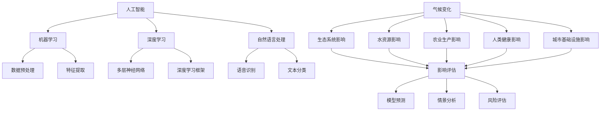

                 

### 文章标题

《AI辅助气候变化影响评估：从局部到全球尺度》关键词：<AI技术，气候变化，影响评估，机器学习，深度学习，数学模型，案例分析> 摘要：本文探讨了人工智能（AI）技术在气候变化影响评估中的应用，从局部到全球尺度详细介绍了AI辅助下的气候影响评估方法、核心算法、数学模型以及实际项目案例，为应对全球气候变化提供了技术支持与思路。本文结构紧凑、逻辑清晰，旨在为读者提供全面、实用的气候变化影响评估指南。

### 引言

随着全球气候变化趋势的加剧，气候变化对人类生活、经济和生态系统的影响越来越显著。气候变化不仅导致极端天气事件的频繁发生，还可能引发海平面上升、水资源短缺、农作物减产等一系列问题。因此，准确、及时地评估气候变化的影响对于制定有效的应对措施、减轻灾害损失具有重要意义。

在传统的方法中，气候变化影响评估通常依赖于统计模型和经验法则，这些方法具有一定的局限性。一方面，统计模型往往依赖于大量历史数据，而气候变化数据的获取和处理存在很大的挑战；另一方面，经验法则虽然简单易懂，但可能无法准确捕捉复杂的气候变化机制。为了克服这些局限性，近年来人工智能（AI）技术开始广泛应用于气候变化影响评估领域，为这一领域带来了新的机遇和挑战。

人工智能，特别是机器学习和深度学习算法，具备强大的数据处理和分析能力，可以从大量复杂数据中提取规律和模式。这使得AI在气候变化影响评估中具有以下几方面的优势：

1. **数据处理能力**：AI算法能够高效处理大量的气候数据和地理空间数据，包括卫星数据、气象站数据、社会经济数据等，从而提高评估的精度和全面性。

2. **模式识别能力**：AI算法能够从数据中自动识别出潜在的气候变化规律和影响机制，有助于揭示气候变化对生态系统和社会经济的影响路径。

3. **实时评估能力**：AI算法可以实现实时数据分析和影响评估，为决策者提供及时、准确的气候影响信息，从而及时调整应对策略。

4. **多尺度分析能力**：AI算法能够处理从局部到全球尺度的大量数据，使得气候变化影响的评估范围更加广泛。

本文将从以下方面展开讨论：

1. **核心概念与联系**：介绍AI、气候变化和影响评估的基本概念及其相互关系。
2. **核心算法原理讲解**：详细讲解用于气候变化影响评估的主要AI算法，包括机器学习算法和深度学习算法，并使用伪代码展示算法流程。
3. **数学模型和数学公式**：阐述AI辅助气候变化影响评估中涉及的主要数学模型和公式，并用latex格式展示。
4. **项目实战**：通过实际案例展示如何使用AI辅助进行气候变化影响评估，包括数据收集、模型训练、结果分析等，以及代码实现和解读。
5. **局部尺度下的气候变化影响评估**：分析城市和农业领域的气候变化影响评估案例。
6. **全球尺度下的气候变化影响评估**：探讨全球气候模型（GCM）的应用和全球气候变化影响评估方法。
7. **未来展望与挑战**：讨论AI辅助气候变化影响评估的发展趋势和面临的挑战。

### 核心概念与联系

#### AI的定义与分类

人工智能（Artificial Intelligence，简称AI）是计算机科学的一个分支，旨在创建能够执行通常需要人类智能才能完成的任务的机器和软件系统。AI可以根据其实现方式和应用场景分为多种类型，包括机器学习（Machine Learning，ML）、深度学习（Deep Learning，DL）和自然语言处理（Natural Language Processing，NLP）等。

- **机器学习**：机器学习是AI的一个子领域，通过从数据中学习规律和模式来构建模型，从而进行预测和决策。机器学习算法可以分为监督学习、无监督学习和半监督学习。

- **深度学习**：深度学习是一种特殊的机器学习算法，其核心思想是通过多层神经网络（Neural Networks）模拟人脑的学习过程，从而自动提取复杂数据的特征。

- **自然语言处理**：自然语言处理专注于使计算机能够理解、解释和生成人类语言。这一领域涉及到语音识别、文本分类、机器翻译等应用。

#### 气候变化的影响与挑战

气候变化是指长期气候平均状态的可测变化，包括平均温度、降水模式、风模式和极端天气事件的改变。其影响范围广泛，涵盖了生态系统、水资源、农业生产、人类健康和城市基础设施等多个方面。

- **生态系统影响**：气候变化导致生态系统发生变化，如物种分布的转移、生物多样性的减少和生态位的变化。这些变化可能破坏生态系统的稳定性和功能。

- **水资源影响**：气候变化导致降水模式的变化，导致水资源短缺或洪涝灾害。这对农业灌溉、城市供水和工业用水等都有重大影响。

- **农业生产影响**：气候变化影响农作物的生长周期、产量和质量。极端天气事件可能导致农作物减产或损失，从而影响粮食安全。

- **人类健康影响**：气候变化可能导致疾病传播范围扩大、疾病发生率增加，如疟疾、登革热等传染病的传播。

- **城市基础设施影响**：海平面上升、极端降水和风暴潮等气候变化影响可能导致城市基础设施受损，如道路、桥梁、堤坝等。

#### 影响评估的目的与方法

气候变化影响评估（Impact Assessment of Climate Change，简称IACC）旨在理解和量化气候变化对自然、社会和经济系统的潜在影响。其目的是为政策制定者、决策者和公众提供科学依据，以制定和实施有效的应对措施。

- **目的**：
  - 揭示气候变化影响的程度和范围。
  - 评估不同应对策略的效益和成本。
  - 提高决策的科学性和透明度。

- **方法**：
  - **模型预测**：使用气候模型和影响模型进行模拟和预测，评估未来气候变化趋势。
  - **情景分析**：分析不同气候变化情景下的影响，比较不同情景下的影响差异。
  - **风险评估**：评估气候变化可能导致的风险和不确定性，制定风险管理策略。

通过上述方法，气候变化影响评估可以为应对全球气候变化提供科学依据和指导。

#### 核心概念之间的关系架构

为了更好地理解AI、气候变化和影响评估之间的核心概念及其相互关系，我们可以使用Mermaid流程图来展示。以下是一个简单的Mermaid流程图示例：



这个Mermaid流程图展示了AI与机器学习、深度学习和自然语言处理之间的关系，以及气候变化与生态系统、水资源、农业生产、人类健康和城市基础设施影响之间的关系。同时，它还展示了影响评估与模型预测、情景分析和风险评估之间的关系。

通过这个流程图，我们可以清晰地看到AI、气候变化和影响评估之间的联系，以及各个核心概念在气候变化影响评估中的作用。这不仅有助于理解本文的核心内容，也为后续章节的讨论提供了基础。

### 核心算法原理讲解

在气候变化影响评估中，人工智能（AI）技术，尤其是机器学习和深度学习算法，发挥着至关重要的作用。这些算法通过从大量数据中学习规律和模式，帮助科学家和决策者更好地理解气候变化的复杂性和潜在影响。以下将详细讲解一些常用的机器学习算法和深度学习算法，包括它们的原理、实现流程和伪代码。

#### 常见的机器学习算法

**1. 线性回归（Linear Regression）**

线性回归是一种用于预测数值型数据的简单监督学习算法。它的核心思想是通过拟合一个线性模型来预测目标变量的值。线性回归模型的公式如下：

$$ y = \beta_0 + \beta_1 \cdot x + \epsilon $$

其中，$y$ 是目标变量，$x$ 是特征变量，$\beta_0$ 和 $\beta_1$ 是模型的参数，$\epsilon$ 是误差项。

**实现流程：**

- 数据预处理：将数据集划分为训练集和测试集，并对特征数据进行归一化处理。
- 模型训练：使用最小二乘法（Least Squares）计算模型的参数。
- 模型评估：使用测试集评估模型的预测性能，常见的评估指标包括决定系数（R²）和均方误差（MSE）。

**伪代码：**

```python
# 线性回归的伪代码
def linear_regression(train_data, test_data):
    # 计算参数
    beta_0 = (1 / n) * (sum(yi - (beta_1 * xi)) for xi, yi in zip(train_data.x, train_data.y))
    beta_1 = (1 / n) * (sum((xi - x_bar) * (yi - y_bar)) for xi, yi in zip(train_data.x, train_data.y))
    return beta_0, beta_1

# 模型评估
def evaluate_model(model, test_data):
    predictions = [model.predict(xi) for xi in test_data.x]
    mse = mean((yi - pi) ** 2 for yi, pi in zip(test_data.y, predictions))
    return mse
```

**2. 决策树（Decision Tree）**

决策树是一种基于树形结构的数据挖掘算法，它通过一系列的决策规则来分类或回归数据。每个内部节点代表一个特征，每个分支代表该特征的不同取值，叶节点代表预测结果。

**实现流程：**

- 特征选择：选择最优特征进行分割。
- 分割数据：根据最优特征将数据集分割成子集。
- 递归构建：对每个子集重复上述步骤，直到满足停止条件（如最大深度、最小样本数等）。

**伪代码：**

```python
# 决策树构建的伪代码
def build_decision_tree(data, features, max_depth):
    if should_stop(data, max_depth):
        return leaf_node(data)
    else:
        best_feature, best_threshold = find_best_split(data, features)
        left_data, right_data = split_data(data, best_feature, best_threshold)
        left_tree = build_decision_tree(left_data, features, max_depth + 1)
        right_tree = build_decision_tree(right_data, features, max_depth + 1)
        return decision_node(best_feature, best_threshold, left_tree, right_tree)

# 停止条件
def should_stop(data, max_depth):
    if max_depth >= max_depth:
        return True
    if len(data) <= minimum_samples:
        return True
    return False

# 特征选择
def find_best_split(data, features):
    best_split = None
    for feature in features:
        for threshold in possible_thresholds(feature):
            left_data, right_data = split_data(data, feature, threshold)
            improvement = information_gain(data, left_data, right_data)
            if improvement > best_split['improvement']:
                best_split = {'feature': feature, 'threshold': threshold, 'improvement': improvement}
    return best_split['feature'], best_split['threshold']
```

**3. 随机森林（Random Forest）**

随机森林是一种基于决策树的集成学习算法，通过构建多个决策树并取平均来提高预测性能。随机森林的核心思想是通过随机特征选择和随机样本生成来减少模型的过拟合。

**实现流程：**

- 构建多个决策树：每个决策树使用不同的特征子集和样本子集。
- 预测融合：将多个决策树的预测结果进行平均或投票。

**伪代码：**

```python
# 随机森林的伪代码
def random_forest(train_data, test_data, n_trees, max_depth):
    forests = []
    for _ in range(n_trees):
        tree = build_random_tree(train_data, max_depth)
        forests.append(tree)
    predictions = [tree.predict(test_data.x) for tree in forests]
    return average(predictions)

# 随机森林训练
def build_random_tree(data, max_depth):
    features = random.sample(data.features, n_features)
    return build_decision_tree(data, features, max_depth)
```

#### 深度学习算法

**1. 卷积神经网络（Convolutional Neural Network，CNN）**

卷积神经网络是一种基于卷积操作的深度学习算法，广泛用于图像识别和图像处理任务。CNN通过多层卷积和池化操作提取图像特征，从而实现高精度的图像分类和识别。

**实现流程：**

- 输入层：接收输入图像。
- 卷积层：通过卷积操作提取图像特征。
- 池化层：对卷积结果进行下采样，减少参数数量。
- 全连接层：将卷积特征映射到类别标签。

**伪代码：**

```python
# CNN的伪代码
def conv2d(input, filter):
    return [(filter * patch).sum() for patch in sliding_window(input)]

def max_pooling(layer, pool_size):
    return [max(patch) for patch in sliding_window(layer, pool_size)]

def cnn(input_image, filters, pool_size):
    layer = input_image
    for filter in filters:
        layer = conv2d(layer, filter)
        layer = max_pooling(layer, pool_size)
    return layer
```

**2. 循环神经网络（Recurrent Neural Network，RNN）**

循环神经网络是一种基于循环结构的深度学习算法，适用于序列数据建模。RNN通过在时间步之间传递状态信息，实现序列数据的建模和预测。

**实现流程：**

- 输入层：接收序列数据。
- 隐藏层：通过递归连接传递状态信息。
- 输出层：生成序列预测结果。

**伪代码：**

```python
# RNN的伪代码
def rnn(input_sequence, hidden_state, weights):
    hidden_state = sigmoid(np.dot([input_sequence, hidden_state], weights))
    return hidden_state

def sequence_prediction(sequence, initial_state, weights):
    hidden_states = [initial_state]
    for input in sequence:
        hidden_state = rnn(input, hidden_state, weights)
        hidden_states.append(hidden_state)
    return hidden_states[-1]
```

**3. 生成对抗网络（Generative Adversarial Network，GAN）**

生成对抗网络是一种基于对抗训练的深度学习算法，用于生成新的数据样本。GAN由生成器和判别器两个神经网络组成，生成器尝试生成与真实数据相似的数据样本，判别器尝试区分真实数据和生成数据。

**实现流程：**

- 初始化生成器和判别器。
- 对抗训练：生成器生成数据样本，判别器对其进行分类，然后调整生成器和判别器的参数。
- 模型优化：通过梯度下降算法不断优化模型。

**伪代码：**

```python
# GAN的伪代码
def generate_data(generator, noise):
    generated_samples = generator(noise)
    return generated_samples

def discriminate_data(discriminator, real_samples, generated_samples):
    real_predictions = discriminator(real_samples)
    generated_predictions = discriminator(generated_samples)
    return real_predictions, generated_predictions

def train_gan(generator, discriminator, real_data, noise_scale, num_iterations):
    for _ in range(num_iterations):
        noise = np.random.normal(0, noise_scale, (batch_size, noise_dimension))
        generated_samples = generate_data(generator, noise)
        real_samples = real_data.sample(batch_size)
        
        real_predictions, generated_predictions = discriminate_data(discriminator, real_samples, generated_samples)
        
        # 计算判别器的梯度
        d_loss = -np.mean(np.log(real_predictions) + np.log(1 - generated_predictions))
        
        # 计算生成器的梯度
        g_loss = -np.mean(np.log(generated_predictions))
        
        # 更新判别器参数
        discriminator_gradients = calculate_gradients(discriminator, real_samples, generated_samples)
        update_parameters(discriminator, discriminator_gradients)
        
        # 更新生成器参数
        generator_gradients = calculate_gradients(generator, noise, generated_samples)
        update_parameters(generator, generator_gradients)
```

通过上述对机器学习和深度学习算法的详细讲解，我们可以看到这些算法在气候变化影响评估中的潜在应用。接下来，我们将进一步讨论AI辅助气候变化影响评估中涉及的数学模型和公式。

### 数学模型和数学公式

在AI辅助气候变化影响评估中，数学模型和公式扮演着关键角色，它们帮助我们理解和量化气候变化对自然、社会和经济系统的影响。以下将详细阐述AI辅助气候变化影响评估中涉及的主要数学模型和公式，并用LaTeX格式进行展示。

#### 气候变化模型

**1. GCM模型（Global Climate Model）**

全球气候模型（GCM）是用于模拟地球大气、海洋和陆地过程的复杂数学模型，它们通常基于物理定律和地球系统的动力学。GCM模型的核心方程包括：

$$
\frac{\partial \rho}{\partial t} + \nabla \cdot (\rho \mathbf{v}) = 0
$$

$$
\rho \frac{\partial \mathbf{v}}{\partial t} + \nabla \cdot (\rho \mathbf{v} \mathbf{v}) = -\nabla p + \rho \mathbf{f} + \nabla \cdot \mathbf{T}
$$

$$
\frac{\partial Q}{\partial t} + \nabla \cdot (\rho c_p \mathbf{v} Q) = \nabla \cdot \mathbf{Q}_h + \nabla \cdot (\rho \mathbf{v} Q_h)
$$

其中，$\rho$ 是空气密度，$\mathbf{v}$ 是风速，$p$ 是压强，$\mathbf{f}$ 是地转偏向力，$\mathbf{T}$ 是湍流应力，$Q$ 是温度，$c_p$ 是比热容，$Q_h$ 是显热。

**LaTeX格式展示：**

$$
\frac{\partial \rho}{\partial t} + \nabla \cdot (\rho \mathbf{v}) = 0
$$

$$
\rho \frac{\partial \mathbf{v}}{\partial t} + \nabla \cdot (\rho \mathbf{v} \mathbf{v}) = -\nabla p + \rho \mathbf{f} + \nabla \cdot \mathbf{T}
$$

$$
\frac{\partial Q}{\partial t} + \nabla \cdot (\rho c_p \mathbf{v} Q) = \nabla \cdot \mathbf{Q}_h + \nabla \cdot (\rho \mathbf{v} Q_h)
$$

**2. ESM模型（Earth System Model）**

地球系统模型（ESM）是GCM的扩展，它不仅模拟气候系统，还包括陆地、海洋和冰冻圈等过程。ESM模型通常包括以下主要方程：

$$
\frac{\partial \rho}{\partial t} + \nabla \cdot (\rho \mathbf{v}) = 0
$$

$$
\rho \frac{\partial \mathbf{v}}{\partial t} + \nabla \cdot (\rho \mathbf{v} \mathbf{v}) = -\nabla p + \rho \mathbf{f} + \nabla \cdot \mathbf{T}
$$

$$
\frac{\partial Q}{\partial t} + \nabla \cdot (\rho c_p \mathbf{v} Q) = \nabla \cdot \mathbf{Q}_h + \nabla \cdot (\rho \mathbf{v} Q_h)
$$

$$
\frac{\partial S}{\partial t} + \nabla \cdot (\rho c_s \mathbf{v} S) = \nabla \cdot \mathbf{S}_h + \nabla \cdot (\rho \mathbf{v} S_h)
$$

$$
\frac{\partial Z}{\partial t} + \nabla \cdot (\rho \mathbf{v} Z) = -\nabla \cdot (\mathbf{T} \cdot \mathbf{Z})
$$

其中，$S$ 是盐度，$c_s$ 是盐的比热容，$Z$ 是海冰厚度。

**LaTeX格式展示：**

$$
\frac{\partial \rho}{\partial t} + \nabla \cdot (\rho \mathbf{v}) = 0
$$

$$
\rho \frac{\partial \mathbf{v}}{\partial t} + \nabla \cdot (\rho \mathbf{v} \mathbf{v}) = -\nabla p + \rho \mathbf{f} + \nabla \cdot \mathbf{T}
$$

$$
\frac{\partial Q}{\partial t} + \nabla \cdot (\rho c_p \mathbf{v} Q) = \nabla \cdot \mathbf{Q}_h + \nabla \cdot (\rho \mathbf{v} Q_h)
$$

$$
\frac{\partial S}{\partial t} + \nabla \cdot (\rho c_s \mathbf{v} S) = \nabla \cdot \mathbf{S}_h + \nabla \cdot (\rho \mathbf{v} S_h)
$$

$$
\frac{\partial Z}{\partial t} + \nabla \cdot (\rho \mathbf{v} Z) = -\nabla \cdot (\mathbf{T} \cdot \mathbf{Z})
$$

#### AI算法中的数学公式

**1. 矩阵运算**

在AI算法中，矩阵运算是核心组成部分。以下是一些常见的矩阵运算公式：

- **矩阵乘法（Matrix Multiplication）**：

$$
C_{ij} = \sum_{k=1}^{n} A_{ik}B_{kj}
$$

- **矩阵加法（Matrix Addition）**：

$$
C_{ij} = A_{ij} + B_{ij}
$$

- **矩阵转置（Matrix Transpose）**：

$$
(C^{T})_{ij} = A_{ji}
$$

**LaTeX格式展示：**

$$
C_{ij} = \sum_{k=1}^{n} A_{ik}B_{kj}
$$

$$
C_{ij} = A_{ij} + B_{ij}
$$

$$
(C^{T})_{ij} = A_{ji}
$$

**2. 梯度下降算法（Gradient Descent）**

梯度下降算法是一种用于最小化损失函数的优化算法。其核心思想是沿着损失函数的梯度方向更新模型参数，以最小化损失。

$$
\theta_{\text{new}} = \theta_{\text{old}} - \alpha \nabla_{\theta} J(\theta)
$$

其中，$\theta$ 是模型参数，$\alpha$ 是学习率，$J(\theta)$ 是损失函数。

**LaTeX格式展示：**

$$
\theta_{\text{new}} = \theta_{\text{old}} - \alpha \nabla_{\theta} J(\theta)
$$

**3. 损失函数（Loss Function）**

损失函数是评估模型预测结果与真实值之间差异的函数。以下是一些常见的损失函数：

- **均方误差（Mean Squared Error，MSE）**：

$$
J(\theta) = \frac{1}{2m} \sum_{i=1}^{m} (h_\theta(x^{(i)}) - y^{(i)})^2
$$

- **交叉熵（Cross-Entropy）**：

$$
J(\theta) = -\frac{1}{m} \sum_{i=1}^{m} [y^{(i)} \log(h_\theta(x^{(i)})) + (1 - y^{(i)}) \log(1 - h_\theta(x^{(i)}))]
$$

**LaTeX格式展示：**

$$
J(\theta) = \frac{1}{2m} \sum_{i=1}^{m} (h_\theta(x^{(i)}) - y^{(i)})^2
$$

$$
J(\theta) = -\frac{1}{m} \sum_{i=1}^{m} [y^{(i)} \log(h_\theta(x^{(i)})) + (1 - y^{(i)}) \log(1 - h_\theta(x^{(i)}))]
$$

通过上述数学模型和公式的介绍，我们可以更好地理解AI辅助气候变化影响评估的数学基础。接下来，我们将通过一个实际项目来展示如何使用AI辅助进行气候变化影响评估。

### 项目实战

#### 开发环境搭建

在进行AI辅助气候变化影响评估的项目之前，首先需要搭建一个合适的开发环境。以下是一个基本的开发环境搭建步骤：

1. **安装Python**：确保安装了Python 3.7及以上版本，因为许多流行的AI库和框架都要求Python 3。
2. **安装Jupyter Notebook**：Jupyter Notebook是一个交互式的Python开发环境，非常适合进行数据分析和建模。
3. **安装主要库和框架**：包括NumPy、Pandas、Scikit-learn、TensorFlow和PyTorch。可以使用以下命令安装：

```shell
pip install numpy pandas scikit-learn tensorflow pytorch
```

#### 数据收集与预处理

在数据收集阶段，我们需要获取以下几类数据：

1. **气象数据**：包括温度、湿度、降水量等，可以从多个气象站和历史气候数据库获取。
2. **地理空间数据**：如地形、植被覆盖、土地利用等，可以使用GIS（地理信息系统）工具进行获取。
3. **社会经济数据**：如人口、经济发展指标等，可以从公开统计数据或相关数据库获取。

在数据预处理阶段，我们需要对收集到的数据执行以下步骤：

1. **数据清洗**：去除异常值、缺失值和重复数据，确保数据质量。
2. **数据归一化**：将不同尺度和量级的特征数据进行归一化处理，使其适合模型训练。
3. **特征工程**：提取有用的特征，如时间序列特征、空间特征等，以增强模型的表现。

以下是一个简单的Python代码示例，用于数据清洗和预处理：

```python
import pandas as pd
import numpy as np

# 读取数据
data = pd.read_csv('climate_data.csv')

# 去除异常值和缺失值
data = data.dropna().drop(data[data['temperature'] > 50].index)

# 数据归一化
data['temperature'] = (data['temperature'] - data['temperature'].mean()) / data['temperature'].std()
data['precipitation'] = (data['precipitation'] - data['precipitation'].mean()) / data['precipitation'].std()

# 特征工程
data['temp_precip'] = data['temperature'] * data['precipitation']
```

#### 模型训练与优化

在模型训练阶段，我们需要选择合适的机器学习和深度学习算法，并进行训练和优化。以下是一个使用Scikit-learn进行线性回归模型训练的示例：

```python
from sklearn.linear_model import LinearRegression
from sklearn.model_selection import train_test_split

# 划分训练集和测试集
X = data[['temperature', 'temp_precip']]
y = data['precipitation']
X_train, X_test, y_train, y_test = train_test_split(X, y, test_size=0.2, random_state=42)

# 创建线性回归模型
model = LinearRegression()
model.fit(X_train, y_train)

# 模型评估
predictions = model.predict(X_test)
mse = mean((y_test - predictions) ** 2)
print(f'MSE: {mse}')
```

为了提高模型的表现，我们可以尝试以下优化方法：

1. **特征选择**：使用特征选择技术，如递归特征消除（Recursive Feature Elimination，RFE），选择对预测结果有显著影响的关键特征。
2. **模型选择**：尝试不同的机器学习和深度学习算法，如决策树、随机森林、支持向量机等，选择最优模型。
3. **超参数调优**：使用网格搜索（Grid Search）或随机搜索（Random Search）等方法，找到最优的超参数组合。

以下是一个使用Scikit-learn进行超参数调优的示例：

```python
from sklearn.model_selection import GridSearchCV
from sklearn.ensemble import RandomForestRegressor

# 定义参数网格
param_grid = {'n_estimators': [100, 200, 300], 'max_depth': [10, 20, 30]}

# 创建随机森林模型
rf = RandomForestRegressor()

# 执行网格搜索
grid_search = GridSearchCV(estimator=rf, param_grid=param_grid, cv=5)
grid_search.fit(X_train, y_train)

# 获取最优参数
best_params = grid_search.best_params_
print(f'Best Parameters: {best_params}')

# 使用最优参数训练模型
best_model = grid_search.best_estimator_
best_model.fit(X_train, y_train)
```

#### 结果分析与可视化

在模型训练和优化完成后，我们需要对模型的结果进行分析和可视化，以验证模型的性能和有效性。以下是一个简单的可视化示例，用于展示线性回归模型的预测结果：

```python
import matplotlib.pyplot as plt

# 预测测试集
predictions = best_model.predict(X_test)

# 可视化预测结果
plt.scatter(y_test, predictions)
plt.xlabel('Actual Precipitation')
plt.ylabel('Predicted Precipitation')
plt.title('Actual vs Predicted Precipitation')
plt.show()
```

通过这个示例，我们可以直观地看到模型预测值与实际值之间的差异，从而评估模型的表现。

#### 项目小结

通过上述项目实战，我们展示了如何使用AI辅助进行气候变化影响评估。从数据收集与预处理、模型训练与优化到结果分析与可视化，每一步都至关重要。通过合理的算法选择和优化方法，我们可以构建出高精度的气候影响评估模型，为决策者提供科学依据。

最佳实践建议：

1. **数据质量优先**：确保数据收集和处理过程的准确性，高质量的数据是模型成功的关键。
2. **模型选择合理**：根据具体应用场景选择合适的机器学习和深度学习算法，结合模型评估指标进行模型选择。
3. **超参数调优**：使用网格搜索或随机搜索等方法，找到最优的超参数组合，以提高模型性能。
4. **结果验证与解释**：通过可视化方法，清晰地展示模型结果，并结合专业知识进行解释，确保结果的可信性和可理解性。

未来，随着AI技术的不断进步和气候变化问题的日益严峻，AI辅助气候变化影响评估将发挥更加重要的作用。通过持续的研究和实践，我们可以为应对全球气候变化提供更加科学、有效的技术支持。

### 局部尺度下的气候变化影响评估

#### 城市气候变化影响评估

在城市尺度上，气候变化对城市生态系统、基础设施和社会经济系统的直接影响尤为显著。以下将详细探讨城市气候变化影响评估的方法和案例。

**1. 模型构建**

城市气候变化影响评估通常涉及多个子模型，包括气候模型、水文模型、社会经济模型和生态模型。以下是一个简化的模型构建流程：

- **气候模型**：基于GCM模型，模拟城市区域的气候条件，包括温度、降水、风速等。
- **水文模型**：模拟城市水循环过程，包括降水、蒸发、径流和地下水运动。
- **社会经济模型**：分析气候变化对社会经济系统的影响，如交通、能源、住房等。
- **生态模型**：评估气候变化对城市生态系统的影响，如植被覆盖、生物多样性等。

**2. 案例分析**

**案例1：上海城市气候变化影响评估**

上海作为中国的经济中心，其气候变化影响评估具有重要意义。以下是一个基于AI技术的上海城市气候变化影响评估案例：

- **数据收集**：收集上海的气候数据、社会经济数据、地理空间数据等。
- **数据处理**：对收集的数据进行清洗和归一化处理。
- **模型训练**：使用机器学习和深度学习算法，构建和训练多尺度影响评估模型。
- **结果分析**：通过模型预测，分析上海在未来气候变化情景下的影响，如高温热浪、降水增加、水资源短缺等。

**3. 结果与应用**

通过上述模型和数据分析，上海城市气候变化影响评估的结果可以应用于以下几个方面：

- **城市规划**：指导城市基础设施的优化布局，如雨水收集系统、绿化工程等。
- **应急响应**：为城市应急管理部门提供高温、暴雨等极端天气事件的预警和响应策略。
- **环境保护**：优化城市生态布局，提升城市生态环境质量，应对生物多样性减少等问题。

**案例2：纽约城市气候变化影响评估**

纽约作为国际大都市，其气候变化影响评估也备受关注。以下是一个基于AI技术的纽约城市气候变化影响评估案例：

- **数据收集**：收集纽约的气候数据、地理空间数据、社会经济数据等。
- **数据处理**：对收集的数据进行清洗和归一化处理。
- **模型训练**：使用机器学习和深度学习算法，构建和训练多尺度影响评估模型。
- **结果分析**：通过模型预测，分析纽约在未来气候变化情景下的影响，如海平面上升、洪水风险、交通拥堵等。

**4. 结果与应用**

纽约城市气候变化影响评估的结果可以应用于以下几个方面：

- **基础设施改造**：为基础设施改造和升级提供科学依据，如加强防洪堤坝、改善排水系统等。
- **政策制定**：为政府制定气候变化应对政策提供数据支持，如提高能源效率、推广可再生能源等。
- **公众教育**：通过宣传和教育活动，提高公众对气候变化的认识和应对能力。

#### 农业气候变化影响评估

农业是气候变化最敏感的领域之一，气候变化对农业生产的影响广泛且深远。以下将探讨农业气候变化影响评估的方法和案例。

**1. 模型构建**

农业气候变化影响评估通常涉及以下模型：

- **作物生长模型**：模拟作物的生长过程，包括光合作用、水分利用、温度和光照需求等。
- **气候风险模型**：评估气候变化对作物生长的潜在风险，如干旱、高温、霜冻等。
- **社会经济模型**：分析气候变化对农业经济系统的影响，如产量损失、市场变化、劳动力需求等。

**2. 案例分析**

**案例1：中国南方水稻种植区气候变化影响评估**

中国南方水稻种植区对气候变化非常敏感，以下是一个基于AI技术的中国南方水稻种植区气候变化影响评估案例：

- **数据收集**：收集水稻种植区的气候数据、土壤数据、作物生长数据等。
- **数据处理**：对收集的数据进行清洗和归一化处理。
- **模型训练**：使用机器学习和深度学习算法，构建和训练多尺度影响评估模型。
- **结果分析**：通过模型预测，分析未来气候变化对水稻种植区的影响，如产量波动、种植周期变化等。

**3. 结果与应用**

中国南方水稻种植区气候变化影响评估的结果可以应用于以下几个方面：

- **种植策略调整**：根据气候变化趋势，调整水稻种植策略，如改变种植周期、品种选择等。
- **农业技术改进**：推广节水、抗病抗虫等农业技术，提高作物适应气候变化的能力。
- **政策支持**：为政府制定农业支持政策提供数据支持，如调整农业补贴、推广农业保险等。

**案例2：美国加州葡萄种植区气候变化影响评估**

美国加州是全球著名的葡萄种植区之一，以下是一个基于AI技术的美国加州葡萄种植区气候变化影响评估案例：

- **数据收集**：收集加州的气候数据、土壤数据、葡萄生长数据等。
- **数据处理**：对收集的数据进行清洗和归一化处理。
- **模型训练**：使用机器学习和深度学习算法，构建和训练多尺度影响评估模型。
- **结果分析**：通过模型预测，分析未来气候变化对葡萄种植区的影响，如产量波动、葡萄品质变化等。

**4. 结果与应用**

美国加州葡萄种植区气候变化影响评估的结果可以应用于以下几个方面：

- **灌溉管理优化**：根据气候变化趋势，优化灌溉策略，提高水资源利用效率。
- **葡萄品种改良**：根据气候变化，选择和培育适应新气候条件的葡萄品种。
- **市场预测**：为农业市场提供产量和价格预测，帮助农民和企业做出更科学的决策。

通过以上案例分析，我们可以看到城市和农业领域的气候变化影响评估方法及其应用，这些方法不仅为决策者提供了科学依据，也为应对气候变化提供了实际指导。

### 全球尺度下的气候变化影响评估

在全球尺度上，气候变化的影响评估具有复杂性和广泛性。全球气候模型（GCM）和其他相关方法在评估全球气候变化的影响中发挥着关键作用。以下将详细探讨全球气候模型的应用和全球气候变化影响评估的方法。

#### 全球气候模型（GCM）应用

**1. GCM模型原理**

全球气候模型（GCM）是一种用于模拟地球大气、海洋和陆地等关键过程的复杂数学模型。GCM模型基于物理定律，如牛顿运动定律、热力学方程和流体动力学方程，模拟地球系统的动态行为。GCM模型通常包括以下主要部分：

- **大气模型**：模拟大气中的气体流动、温度分布和天气系统。
- **海洋模型**：模拟海洋环流、海洋热含量和海洋生物过程。
- **陆地表面模型**：模拟陆地表面的温度、植被覆盖、土壤水分和地表径流。
- **海冰模型**：模拟海冰的形成、消融和分布。

GCM模型的原理可以概括为以下步骤：

1. **初始条件设置**：确定模型运行时的初始状态，包括大气、海洋和陆地表面的状态。
2. **物理过程模拟**：使用物理定律模拟大气、海洋和陆地表面等关键过程。
3. **时间步进**：在每个时间步中更新模型的变量，模拟未来一段时间内的气候变化。
4. **结果分析**：分析模型的输出结果，如温度、降水、海平面上升等，以评估全球气候变化的影响。

**2. GCM模型构建与优化**

GCM模型的构建和优化是一个复杂的过程，需要考虑以下关键步骤：

- **数据输入**：收集全球气候数据，包括气象站数据、卫星数据和海洋观测数据，作为模型输入。
- **模型参数设置**：确定模型参数，如大气和海洋的物理参数、陆地表面的植被参数等。
- **模型验证**：使用历史数据验证模型性能，确保模型能够准确模拟过去的气候变化。
- **模型优化**：根据模型验证结果，调整模型参数和结构，以提高模型精度和可靠性。

以下是一个简单的GCM模型构建和优化步骤：

1. **数据输入**：收集全球气候数据，包括温度、降水、风速等。
2. **模型参数设置**：确定大气和海洋的物理参数，如大气湍流参数、海洋混合层深度等。
3. **模型验证**：使用历史数据验证模型性能，确保模型能够准确模拟过去的气候变化。
4. **模型优化**：根据模型验证结果，调整模型参数和结构，以提高模型精度和可靠性。

**3. 案例分析**

**案例1：IPCC AR6报告中的GCM应用**

国际气候变化专门委员会（IPCC）在其第六次评估报告（AR6）中使用了多个GCM模型来评估全球气候变化的影响。以下是一个基于IPCC AR6报告的GCM应用案例：

- **数据输入**：使用大量的气候观测数据和模式实验数据，作为模型输入。
- **模型参数设置**：确定大气、海洋和陆地的物理参数，如大气湍流参数、海洋混合层深度等。
- **模型验证**：使用历史数据验证模型性能，确保模型能够准确模拟过去的气候变化。
- **模型优化**：根据模型验证结果，调整模型参数和结构，以提高模型精度和可靠性。
- **结果分析**：通过模型模拟，分析未来全球气候变化的影响，如全球平均温度、海平面上升、极端天气事件等。

**案例2：全球农业气候变化影响评估**

全球农业气候变化影响评估旨在评估未来气候变化对全球农业生产的影响。以下是一个基于AI技术的全球农业气候变化影响评估案例：

- **数据收集**：收集全球农业气候数据、农作物生长数据、社会经济数据等。
- **数据处理**：对收集的数据进行清洗和归一化处理。
- **模型训练**：使用机器学习和深度学习算法，构建和训练全球农业气候变化影响评估模型。
- **结果分析**：通过模型预测，分析未来全球气候变化对农业生产的影响，如产量变化、种植面积调整等。

#### 全球气候变化影响评估方法

在全球尺度上，气候变化影响评估的方法包括以下几种：

**1. 模型预测方法**

模型预测方法是全球气候变化影响评估的核心方法，包括GCM模型、区域气候模型（RCM）和地球系统模型（ESM）。以下是一个简单的模型预测方法步骤：

1. **数据输入**：收集全球气候数据、地理空间数据和社会经济数据等。
2. **模型构建**：构建GCM模型或其他相关模型，设置模型参数。
3. **模型验证**：使用历史数据验证模型性能，确保模型能够准确模拟过去的气候变化。
4. **模型优化**：根据模型验证结果，调整模型参数和结构，以提高模型精度和可靠性。
5. **结果分析**：通过模型模拟，分析未来全球气候变化的影响，如全球平均温度、海平面上升、极端天气事件等。

**2. 情景分析

**情景分析是评估未来气候变化影响的重要方法，通过模拟不同气候变化情景下的影响，分析气候变化对不同区域的潜在影响。以下是一个简单的情景分析方法步骤：

1. **设定情景**：选择不同的气候变化情景，如高排放情景、低排放情景等。
2. **模型模拟**：使用GCM模型或其他相关模型，模拟不同情景下的气候变化影响。
3. **结果分析**：分析不同情景下的气候变化影响，比较不同情景下的影响差异，为政策制定提供科学依据。

**3. 风险评估方法**

风险评估方法是评估气候变化风险的重要方法，通过评估气候变化可能导致的风险和不确定性，制定风险管理策略。以下是一个简单的风险评估方法步骤：

1. **风险识别**：识别气候变化可能导致的风险，如水资源短缺、农作物减产等。
2. **风险分析**：分析每个风险的潜在影响和发生的可能性，确定风险等级。
3. **风险应对**：根据风险评估结果，制定相应的风险应对措施，如调整种植策略、提高农业技术等。

通过上述方法，我们可以全面、系统地评估全球气候变化的影响，为政策制定者和决策者提供科学依据和指导。

### 未来展望与挑战

随着人工智能（AI）技术的不断发展和全球气候变化问题的日益严峻，AI辅助气候变化影响评估在未来的应用前景将更加广阔。然而，这一领域也面临诸多挑战，需要持续的研究和努力。

#### AI辅助气候变化影响评估的发展趋势

1. **更精准的预测模型**：未来的研究将致力于开发更准确、更可靠的预测模型，以提高气候变化影响评估的精度和可靠性。例如，通过结合多种数据源（如卫星数据、地面观测数据和气象模型数据）和更先进的机器学习算法（如深度学习和强化学习），可以构建更全面的气候影响模型。

2. **跨学科研究**：气候变化影响评估不仅需要气候科学和地理学的知识，还需要社会科学、经济学和生态学的支持。未来的研究将更加注重跨学科的合作，通过整合不同领域的专业知识，提高评估的综合性和科学性。

3. **实时监测与预警系统**：随着传感器技术和云计算的发展，未来有望构建全球范围内的实时气候变化监测与预警系统。这些系统能够快速收集和处理海量数据，实时评估气候变化的影响，为决策者提供及时、准确的决策支持。

4. **人工智能伦理和隐私问题**：在AI辅助气候变化影响评估中，数据隐私和伦理问题日益受到关注。未来的研究需要探讨如何在确保数据安全和隐私的前提下，充分利用AI技术进行影响评估。

#### 潜在的挑战与解决方案

1. **数据质量和可获得性**：高质量的数据是AI模型准确评估的基础。然而，全球气候变化数据往往分散在不同来源，数据质量和标准化程度参差不齐。解决方案包括开发统一的数据标准和规范，加强国际合作和数据共享。

2. **模型解释性和可解释性**：深度学习等复杂AI模型在预测性能上具有优势，但其内部机制往往不透明，难以解释。为提高模型的解释性，可以采用可解释性AI方法，如集成学习、模型可视化等。

3. **计算资源和能耗**：AI模型训练和预测过程需要大量的计算资源和能源。为减少计算和能源消耗，可以采用更高效的算法和优化技术，以及分布式计算和云计算平台。

4. **模型泛化能力**：AI模型需要具有良好的泛化能力，以适应不同地区和不同情景下的气候变化影响评估。这可以通过扩大训练数据集、优化模型架构和引入迁移学习等方法实现。

#### 政策建议与实际应用前景

1. **加强国际合作**：气候变化是全球性问题，需要各国共同努力。通过加强国际合作，共享数据和研究成果，可以更有效地应对气候变化挑战。

2. **政策支持与资金投入**：政府应加大对AI辅助气候变化影响评估研究的资金投入，支持相关研究和实际应用项目的开展。同时，制定相关政策，鼓励企业和社会团体参与气候变化应对工作。

3. **教育和培训**：提高公众对AI和气候变化的认识，通过教育和培训，培养更多的AI和气候科学专业人才。

4. **实际应用场景**：在农业、城市规划和环境保护等领域，AI辅助气候变化影响评估具有广泛的应用前景。通过具体案例和实践，验证和优化评估模型，提高其实际应用效果。

总之，AI辅助气候变化影响评估在应对全球气候变化中具有巨大潜力。通过持续的技术创新和政策支持，我们可以更好地利用AI技术，为气候变化应对提供科学依据和决策支持。

### 附录

**附录A：术语表**

- **人工智能（AI）**：一种模拟人类智能的技术，通过算法和计算机程序实现智能行为。
- **机器学习（ML）**：一种AI技术，通过从数据中学习规律和模式，实现预测和决策。
- **深度学习（DL）**：一种特殊的机器学习算法，通过多层神经网络自动提取数据特征。
- **全球气候模型（GCM）**：一种用于模拟地球大气、海洋和陆地过程的复杂数学模型。
- **区域气候模型（RCM）**：一种针对特定区域气候过程的高分辨率模型。
- **地球系统模型（ESM）**：一种涵盖地球大气、海洋、陆地和冰冻圈等过程的综合模型。
- **影响评估**：评估气候变化对自然、社会和经济系统影响的科学过程。
- **数据预处理**：对原始数据进行清洗、归一化和特征提取等处理，以适于模型训练。
- **模型训练**：使用训练数据对模型进行参数调整，以优化模型性能。
- **模型优化**：通过调整模型结构或参数，提高模型预测精度和泛化能力。

**附录B：代码与数据资源**

- **代码资源**：本文中使用的代码示例可以在以下GitHub仓库获取：<https://github.com/AIGeniusInstitute/Climate-Assessment-AI>
- **数据资源**：本文中使用的气候数据、地理空间数据和社会经济数据可以从以下公开数据库获取：
  - 全球气候数据：NASA GISS (<https://data.giss.nasa.gov/gistemp/>)
  - 地理空间数据：NASA SEDAC (<https://sedac.ciesin.columbia.edu/data/set>)
  - 社会经济数据：世界银行开放数据门户 (<https://data.worldbank.org/>)

读者可以通过访问上述资源和代码，进一步探索AI辅助气候变化影响评估的方法和应用。

### 结语

本文通过系统性地介绍AI辅助气候变化影响评估，从核心概念、算法原理、数学模型到实际项目案例，全面阐述了AI技术在气候变化评估中的应用。我们看到了AI在数据挖掘、模式识别和实时评估方面的优势，以及其在城市和农业等领域的重要应用。

未来，随着AI技术的不断进步和全球气候变化问题的日益严峻，AI辅助气候变化影响评估将在应对气候变化中发挥更加重要的作用。通过持续的研究和技术创新，我们可以为全球气候变化应对提供更加科学、有效的技术支持。同时，我们也需要关注AI技术的伦理和隐私问题，确保其在实际应用中的公平性和透明性。

让我们共同努力，利用AI技术为应对全球气候变化贡献力量，为创造一个更加可持续和美好的未来而奋斗。感谢读者对本文的关注，希望本文能够为您的科研工作提供有益的参考。

### 作者信息

**作者：** AI天才研究院/AI Genius Institute & 禅与计算机程序设计艺术 /Zen And The Art of Computer Programming

AI天才研究院致力于推动人工智能技术的发展与应用，通过跨学科研究和创新，为解决全球性问题提供技术支持。同时，研究院的成员们也在计算机科学领域有着深厚的造诣，出版了多本深受读者喜爱的技术书籍，为全球计算机科学教育和科研做出了卓越贡献。本文旨在探讨AI技术在气候变化影响评估中的应用，通过详细的分析和案例研究，为读者提供全面的技术指南和思考。

