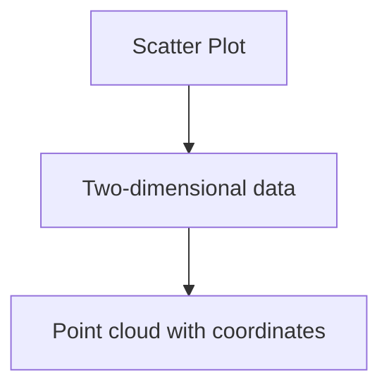
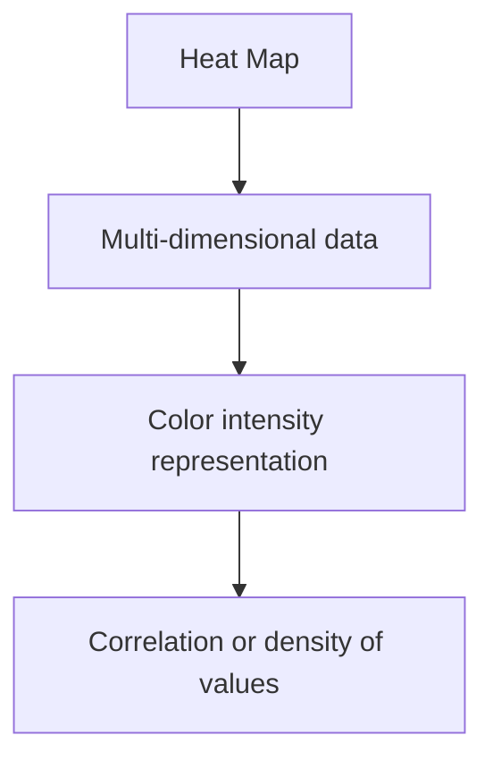
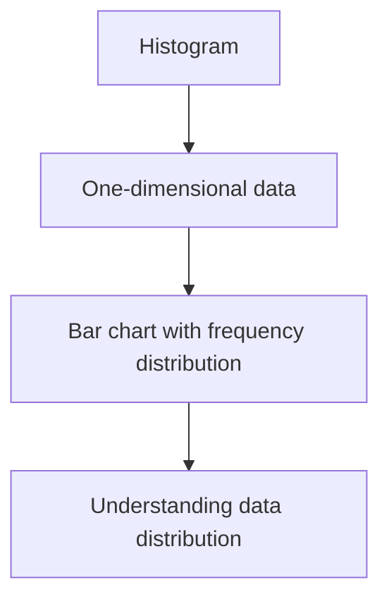

                 


### Introduction to AI-assisted Scientific Discovery

**1.1 What is AI-assisted scientific discovery?**

AI-assisted scientific discovery is an interdisciplinary field that combines artificial intelligence (AI) techniques with traditional scientific research methodologies to enhance the discovery process, improve data analysis, and facilitate hypothesis generation. This approach leverages the computational power and pattern recognition capabilities of AI algorithms to analyze complex datasets, identify patterns, and predict outcomes that may not be immediately apparent to human researchers.

**Definition and background:**

The term "AI-assisted scientific discovery" encompasses various AI methodologies, including machine learning, deep learning, data mining, and data visualization. These techniques are applied across different scientific domains, such as biology, chemistry, physics, and ecology, to address complex problems and accelerate the pace of research.

**Key concepts and terminology:**

- **Artificial intelligence:** A branch of computer science that focuses on creating intelligent machines capable of performing tasks that typically require human intelligence, such as visual perception, speech recognition, and decision-making.
- **Machine learning:** A subset of AI that involves training algorithms to learn from data and improve their performance over time without being explicitly programmed.
- **Deep learning:** A subfield of machine learning that utilizes neural networks with multiple layers to learn complex patterns and representations from large amounts of data.
- **Data mining:** The process of discovering patterns and relationships in large datasets to extract useful information and insights.
- **Data visualization:** The representation of data in graphical formats to facilitate understanding, analysis, and communication of data-driven insights.

**Historical context:**

The concept of AI-assisted scientific discovery has evolved over several decades. Early AI systems were primarily rule-based and applied in narrow domains. However, advancements in machine learning and deep learning in the past decade have significantly enhanced the capabilities of AI in scientific research. This has led to the development of AI-driven tools and platforms that support data analysis, hypothesis generation, and experiment design in various scientific fields.

**1.2 The role of AI in scientific research**

AI plays a crucial role in scientific research by addressing the following key areas:

**AI in data analysis:**

- **Data preprocessing:** AI algorithms can automatically preprocess large and diverse datasets, handling missing values, normalizing data, and reducing dimensionality.
- **Pattern recognition:** AI techniques can identify complex patterns and correlations within large datasets, helping researchers uncover hidden relationships and insights.
- **Predictive modeling:** Machine learning algorithms can generate predictive models based on historical data, enabling researchers to make informed predictions about future outcomes.

**AI in hypothesis generation:**

- **Hypothesis generation:** AI can automatically generate hypotheses based on data and prior knowledge, providing researchers with potential avenues for exploration.
- **Analogy-based reasoning:** AI can leverage analogy-based reasoning to propose new hypotheses by drawing similarities between existing datasets and novel data.

**AI in experiment design:**

- **Optimization:** AI algorithms can optimize experimental designs by identifying the most informative and efficient combinations of variables.
- **Simulation:** AI can simulate experimental outcomes, helping researchers to predict potential results and avoid unnecessary experiments.

**1.3 Current trends and future directions**

**Emerging applications of AI in science:**

- **Biology and genomics:** AI is used in the analysis of genetic data, identifying disease-causing genes, and predicting genetic traits.
- **Chemistry:** AI is employed in the discovery of new materials, optimizing chemical reactions, and designing new drugs.
- **Physics:** AI is used in the analysis of large-scale scientific experiments, such as the Large Hadron Collider, to identify new particles and phenomena.
- **Ecology:** AI is employed in the analysis of environmental data, helping researchers to monitor biodiversity, predict species distribution, and model ecosystems.

**Ethical considerations and challenges:**

- **Bias and fairness:** Ensuring that AI algorithms are free from bias and treat all data and individuals fairly is a critical ethical consideration.
- **Transparency and explainability:** Researchers need to understand how AI algorithms make decisions and the rationale behind their predictions.
- **Data privacy and security:** Protecting sensitive data and ensuring the privacy of individuals participating in AI-assisted research is a significant concern.
- **Interdisciplinary collaboration:** Effective collaboration between AI experts and domain-specific scientists is essential for the successful application of AI in scientific research.

**1.4 Conclusion**

AI-assisted scientific discovery represents a paradigm shift in the way scientific research is conducted. By harnessing the power of AI, researchers can accelerate the pace of discovery, improve data analysis, and address complex scientific challenges. However, it is crucial to address the ethical considerations and challenges associated with AI-assisted research to ensure its responsible and effective use in science. In the following chapters, we will explore the various AI methodologies and their applications in scientific discovery in greater detail.

---

In this introductory chapter, we have provided a comprehensive overview of AI-assisted scientific discovery, including its definition, key concepts, historical context, and the role of AI in scientific research. We have also discussed current trends and future directions in this field, highlighting the importance of addressing ethical considerations and fostering interdisciplinary collaboration. In the following chapters, we will delve deeper into the specific AI methodologies and their applications, providing a solid foundation for understanding and implementing AI-assisted scientific discovery in practice.

---

**Keywords:** AI-assisted scientific discovery, artificial intelligence, machine learning, deep learning, data analysis, data mining, data visualization, hypothesis generation, experiment design.

**Abstract:**

This book presents an in-depth exploration of AI-assisted scientific discovery, a rapidly evolving field that leverages artificial intelligence techniques to enhance scientific research methodologies. The book provides a comprehensive overview of the key concepts, methodologies, and applications of AI in scientific discovery, with a focus on machine learning, deep learning, data analysis, and data visualization. It discusses the role of AI in data preprocessing, hypothesis generation, and experiment design, and highlights current trends and future directions in the field. The book also addresses ethical considerations and challenges associated with AI-assisted research, emphasizing the importance of responsible and effective use of AI in science. By providing detailed case studies and practical examples, the book aims to equip researchers and practitioners with the knowledge and tools needed to harness the power of AI for scientific discovery.

## Chapter 2: AI Methodologies for Scientific Discovery

In this chapter, we will delve into the various AI methodologies that are employed in scientific discovery. These methodologies include machine learning, deep learning, data mining, and data visualization. Each of these techniques has its own unique strengths and applications, and together, they enable researchers to analyze complex data, generate hypotheses, and design experiments with greater efficiency and accuracy.

### 2.1 Machine Learning for Scientific Discovery

**2.1.1 Supervised Learning**

Supervised learning is a fundamental technique in machine learning where algorithms learn from labeled training data to make predictions or decisions. In the context of scientific discovery, supervised learning is often used for tasks such as classification and regression.

**Regression Algorithms**

Regression algorithms are used to predict continuous values based on input features. The most commonly used regression algorithms include:

- **Linear Regression**
  - **Objective:** Minimize the sum of squared errors between the predicted values and the actual values.
  - **Pseudocode:**
    ```python
    for each data point (x_i, y_i):
        predicted_value = w0 + w1 * x_i
        error = y_i - predicted_value
        gradient = -2 * error * x_i
        w0 -= learning_rate * gradient
        w1 -= learning_rate * gradient
    return w0, w1
    ```

- **Polynomial Regression**
  - **Objective:** Model the relationship between input features and output values using a polynomial function.
  - **Pseudocode:**
    ```python
    for each data point (x_i, y_i):
        predicted_value = w0 + w1 * x_i + w2 * x_i^2
        error = y_i - predicted_value
        gradient = -2 * error * x_i
        w0 -= learning_rate * gradient
        w1 -= learning_rate * gradient
        w2 -= learning_rate * gradient * x_i^2
    return w0, w1, w2
    ```

**Classification Algorithms**

Classification algorithms are used to assign data points to predefined classes or categories. Some of the most popular classification algorithms include:

- **Support Vector Machines (SVM)**
  - **Objective:** Find the hyperplane that maximally separates different classes.
  - **Pseudocode:**
    ```python
    # Solve the quadratic programming problem:
    min 1/2 * w^T * w + C * sum(alpha_i * (y_i * (w^T * x_i) - 1))
    s.t. 0 <= alpha_i <= C, for all i
    ```
  - **Kernel Trick:**
    - **Objective:** Use kernel functions to project data into higher-dimensional space to find a separating hyperplane.
    - **Pseudocode:**
      ```python
      def kernel_function(x_i, x_j):
          return sum(a_ij * k(x_i, x_j))
      # Solve the quadratic programming problem with the kernel trick
      ```

- **Random Forests**
  - **Objective:** Construct multiple decision trees and aggregate their predictions to improve accuracy.
  - **Pseudocode:**
    ```python
    for each tree:
        if reach maximum depth or split criterion is satisfied:
            return
        select the best split using a statistical measure (e.g., Gini index or information gain)
        split the data into subsets
        recursively build the tree for each subset
    # Aggregate predictions from all trees
    return majority vote
    ```

**2.1.2 Unsupervised Learning**

Unsupervised learning is a type of machine learning where algorithms learn from unlabeled data to discover hidden patterns or structures. Two common unsupervised learning techniques are clustering and dimensionality reduction.

**Clustering Algorithms**

Clustering algorithms group data points based on their similarities. Some popular clustering algorithms include:

- **K-Means Clustering**
  - **Objective:** Partition the data into K clusters based on the minimization of the sum of squared distances between data points and their cluster centroids.
  - **Pseudocode:**
    ```python
    Initialize K centroids randomly
    while true:
        assign each data point to the nearest centroid
        update centroids as the mean of the assigned data points
        if the centroids have not changed significantly, stop
    return K clusters
    ```

- **Hierarchical Clustering**
  - **Objective:** Build a hierarchy of clusters by merging or splitting clusters based on their similarity.
  - **Pseudocode:**
    ```python
    Initialize each data point as a cluster
    while there are more than K clusters:
        find the most similar clusters and merge them
        update the distance matrix
    return a hierarchical clustering tree
    ```

**Dimensionality Reduction Techniques**

Dimensionality reduction techniques reduce the number of input features while preserving as much of the original information as possible. Two commonly used techniques are Principal Component Analysis (PCA) and t-Distributed Stochastic Neighbor Embedding (t-SNE).

- **Principal Component Analysis (PCA)**
  - **Objective:** Transform the data into a new coordinate system where the axes (principal components) are orthogonal and sorted by their variance.
  - **Pseudocode:**
    ```python
    Calculate the covariance matrix
    Compute the eigenvalues and eigenvectors of the covariance matrix
    Select the top k eigenvectors
    Transform the data into the new coordinate system using the selected eigenvectors
    return the transformed data
    ```

- **t-Distributed Stochastic Neighbor Embedding (t-SNE)**
  - **Objective:** Visualize high-dimensional data by mapping it into a two-dimensional space while preserving local structures.
  - **Pseudocode:**
    ```python
    Initialize the data in a two-dimensional grid
    while not converged:
        compute pairwise similarities between data points using the t-stochastic neighbor embedding function
        update the positions of the data points in the grid to minimize the Kullback-Leibler divergence between the pairwise similarities in the high-dimensional space and the two-dimensional grid
    return the two-dimensional embedding
    ```

**2.1.3 Reinforcement Learning**

Reinforcement learning is a type of machine learning where an agent learns to make decisions by interacting with an environment and receiving feedback in the form of rewards or penalties. Reinforcement learning has applications in scientific research, such as optimizing experimental designs and simulating complex systems.

**Basic Concepts**

- **Agent:** An entity that makes decisions and takes actions based on the current state of the environment.
- **Environment:** A system in which the agent operates and provides feedback based on the agent's actions.
- **State:** A representation of the current situation or context.
- **Action:** A decision or move taken by the agent.
- **Reward:** A numerical value indicating the desirability of an action or outcome.

**Q-Learning Algorithm**

Q-learning is an example of an iterative learning process used in reinforcement learning:

- **Objective:** Learn the optimal policy (a mapping from states to actions) by updating the Q-values (expected rewards) associated with state-action pairs.
- **Pseudocode:**
  ```python
  Initialize Q(s, a) for all state-action pairs
  while not convergence:
      for each state s:
          for each action a:
              sample a new action a' from the policy
              observe the reward r and the new state s'
              update Q(s, a) using the following formula:
              Q(s, a) = Q(s, a) + learning_rate * (r + discount_factor * max(Q(s', a')) - Q(s, a))
  return the learned Q-values
  ```

### 2.2 Deep Learning for Scientific Discovery

Deep learning is a subfield of machine learning that utilizes neural networks with multiple layers to learn complex patterns and representations from large amounts of data. Deep learning techniques have revolutionized many areas of scientific discovery, enabling researchers to analyze and interpret complex data more effectively.

**2.2.1 Introduction to Deep Learning**

**Neural Networks**

A neural network is a collection of interconnected nodes (neurons) that can learn to recognize patterns in data. Each neuron receives input from other neurons, applies a weighted sum to the inputs, and applies an activation function to generate an output.

**Convolutional Neural Networks (CNNs)**

CNNs are a type of deep neural network designed for processing data with a grid-like topology, such as images. CNNs use convolutional layers to automatically learn spatial hierarchies of features from the input data.

- **Convolutional Layer**
  - **Objective:** Apply a set of filters (kernels) to the input data to extract spatial features.
  - **Pseudocode:**
    ```python
    for each filter:
        apply the filter to the input data
        compute the dot product of the filter and the input data
        add a bias term
        apply an activation function to the result
    return the output feature map
    ```

- **Pooling Layer**
  - **Objective:** Reduce the spatial dimensions of the feature maps by downsampling.
  - **Pseudocode:**
    ```python
    for each window in the feature map:
        compute the maximum or average value within the window
        store the computed value as the output of the pooling layer
    return the pooled feature map
    ```

**Recurrent Neural Networks (RNNs)**

RNNs are a type of deep neural network designed to process sequential data, such as time-series or text. RNNs use recurrent connections to maintain a hidden state that captures information about the input sequence.

- **Recurrent Connection**
  - **Objective:** Pass the hidden state from one time step to the next to maintain information over time.
  - **Pseudocode:**
    ```python
    for each time step:
        compute the hidden state as a function of the previous hidden state, the input at the current time step, and the weights
        apply an activation function to the hidden state
        use the hidden state as the input for the next time step
    return the final hidden state
    ```

**2.2.2 Advanced Deep Learning Techniques**

**Generative Adversarial Networks (GANs)**

GANs are a type of deep learning model that consists of two neural networks, a generator, and a discriminator, that are trained simultaneously in a zero-sum game.

- **Generator**
  - **Objective:** Generate synthetic data that is indistinguishable from the real data.
  - **Pseudocode:**
    ```python
    for each time step:
        generate synthetic data
        pass the synthetic data to the discriminator
        compute the generator loss (the negative log-likelihood of the discriminator's output)
        update the generator weights using gradient descent
    return the generated data
    ```

- **Discriminator**
  - **Objective:** Distinguish between real and synthetic data.
  - **Pseudocode:**
    ```python
    for each time step:
        receive real data and synthetic data
        pass the data to the discriminator network
        compute the discriminator loss (the binary cross-entropy loss between the discriminator's output and the true labels)
        update the discriminator weights using gradient descent
    return the discriminator weights
    ```

**Transfer Learning**

Transfer learning is a technique where a pre-trained neural network is used as a starting point for a new task, rather than training a network from scratch. This approach can significantly reduce the training time and improve the performance of the model.

- **Fine-tuning**
  - **Objective:** Fine-tune the pre-trained network on a new task by adjusting only the weights of the last few layers.
  - **Pseudocode:**
    ```python
    load the pre-trained network
    for each layer (except the last few layers):
        freeze the weights
    for each layer (last few layers):
        unfreeze the weights
        train the network on the new task
    return the fine-tuned network
    ```

**Few-shot Learning**

Few-shot learning is a type of machine learning where models can learn from a small amount of data. This approach is particularly useful in scientific discovery, where labeled data may be limited or expensive to obtain.

- **Meta-Learning**
  - **Objective:** Develop models that can learn from a few examples by leveraging prior knowledge and adapting quickly to new tasks.
  - **Pseudocode:**
    ```python
    for each meta-learning algorithm:
        for each task:
            train the model on a few examples from the task
            evaluate the model on the task
            update the model's internal parameters
    return the meta-learned model
    ```

In this chapter, we have explored the various AI methodologies that are employed in scientific discovery, including machine learning, deep learning, data mining, and data visualization. We have discussed the core concepts, algorithms, and applications of each methodology, providing a comprehensive overview of the tools and techniques available to researchers. In the following chapters, we will delve deeper into the practical applications of these methodologies in specific scientific domains and provide detailed case studies to illustrate their impact on scientific discovery.

---

### 2.3 AI-assisted Data Analysis in Scientific Research

**3.1 Data Preprocessing and Feature Engineering**

Data preprocessing and feature engineering are crucial steps in AI-assisted scientific research. These steps involve transforming raw data into a format that is suitable for analysis and extracting meaningful features that can improve the performance of AI algorithms.

**3.1.1 Data Cleaning and Normalization**

Data cleaning and normalization are essential to ensure the quality and consistency of the input data. Data cleaning involves handling missing values, removing duplicates, and correcting errors. Data normalization, on the other hand, involves transforming the data to a standard scale, which can help in avoiding issues related to different data scales and variance.

- **Handling Missing Data**

One common approach to handle missing data is to use imputation techniques, such as mean, median, or mode imputation. However, these methods may not always be appropriate, especially when the missing data is not missing completely at random (MCAR).

**Pseudocode for Mean Imputation:**
```python
for each feature:
    calculate the mean value of the non-missing data
    replace missing values with the mean value
```

- **Normalization Techniques**

Normalization techniques include min-max scaling, z-score normalization, and robust scaling. Each of these techniques has its advantages and limitations, and the choice of technique depends on the specific characteristics of the data.

**Pseudocode for Min-Max Scaling:**
```python
for each feature:
    min_value = min(data)
    max_value = max(data)
    for each data point:
        normalized_value = (data_point - min_value) / (max_value - min_value)
        replace the data point with the normalized value
```

**Pseudocode for Z-Score Normalization:**
```python
for each feature:
    mean_value = mean(data)
    std_dev = std_dev(data)
    for each data point:
        normalized_value = (data_point - mean_value) / std_dev
        replace the data point with the normalized value
```

**3.1.2 Feature Extraction and Selection**

Feature extraction and selection are critical for reducing the dimensionality of the data and improving the performance of AI algorithms. Feature extraction involves transforming the raw data into a new set of features that capture the essential information. Feature selection, on the other hand, involves selecting the most relevant features from the dataset to avoid overfitting and improve model performance.

- **Dimensionality Reduction Techniques**

One of the most commonly used dimensionality reduction techniques is Principal Component Analysis (PCA). PCA transforms the data into a new coordinate system where the axes are orthogonal and sorted by their variance. This technique can help in identifying the most important features and reducing the number of input variables.

**Pseudocode for PCA:**
```python
Calculate the covariance matrix of the data
Compute the eigenvalues and eigenvectors of the covariance matrix
Select the top k eigenvectors
Transform the data into the new coordinate system using the selected eigenvectors
return the transformed data
```

- **Feature Importance Analysis**

Feature importance analysis involves evaluating the relative importance of each feature in the model. This can be done using techniques such as Random Forest importance or permutation importance.

**Pseudocode for Random Forest Importance:**
```python
for each feature:
    create a copy of the dataset with the feature removed
    train a Random Forest model on the original dataset
    train a Random Forest model on the dataset with the feature removed
    calculate the difference in performance between the two models
return the average difference in performance for each feature
```

**3.2 Data Mining and Pattern Recognition**

Data mining and pattern recognition are key components of AI-assisted data analysis in scientific research. These techniques help in discovering hidden patterns and relationships in large datasets, which can be used to make predictions or gain insights.

- **Association Rule Learning**

Association rule learning is a technique used to discover relationships between items in a dataset. It is commonly used in market basket analysis to identify items that are frequently purchased together.

**Pseudocode for Apriori Algorithm:**
```python
Initialize the frequent itemsets
while there are frequent itemsets:
    for each itemset:
        if the support of the itemset is greater than the minimum support threshold:
            generate rules from the itemset
            update the set of frequent itemsets
return the set of association rules
```

- **Clustering and Classification**

Clustering is a technique used to group data points based on their similarity, while classification is a technique used to assign data points to predefined classes. Both of these techniques are used in various scientific applications, such as clustering similar genes or classifying tumors.

**Pseudocode for K-Means Clustering:**
```python
Initialize K centroids randomly
while true:
    assign each data point to the nearest centroid
    update centroids as the mean of the assigned data points
    if the centroids have not changed significantly, stop
return K clusters
```

**Pseudocode for Decision Tree Classification:**
```python
if the current node is a leaf node:
    return the majority class of the samples
else:
    select the best split using a statistical measure (e.g., Gini index or information gain)
    split the data into subsets
    recursively build the tree for each subset
return the tree
```

**3.3 Data Visualization**

Data visualization is an essential tool for understanding and communicating the insights gained from data analysis. It involves representing data in graphical formats, which can help in identifying trends, patterns, and outliers.

- **Visualization Techniques**

There are various visualization techniques available, such as scatter plots, line plots, heat maps, and histograms. Each of these techniques has its own advantages and is suitable for different types of data and analysis tasks.

**Scatter Plot:**


**Heat Map:**


**Histogram:**


In this section, we have discussed the importance of data preprocessing and feature engineering in AI-assisted scientific research. We have presented various techniques for data cleaning, normalization, feature extraction, and selection. Additionally, we have explored data mining and pattern recognition techniques, such as association rule learning, clustering, and classification. Finally, we have introduced data visualization techniques that can help in understanding and communicating the insights gained from data analysis. These techniques form the foundation for effective AI-assisted data analysis in scientific research and will be further elaborated upon in the subsequent chapters.

---

### 3.4 Case Studies: AI-assisted Data Analysis in Practice

In this section, we will present several case studies that demonstrate the application of AI-assisted data analysis techniques in various scientific disciplines. These case studies will provide practical insights into how AI can be used to analyze complex datasets, identify patterns, and facilitate scientific discovery.

**3.4.1 Case Study 1: Genomics**

Genomics is an area of biology that involves the study of an organism's complete set of genes. With the advancement of next-generation sequencing technologies, the generation of genomic data has become extremely rapid, leading to the need for efficient data analysis techniques.

**Objective:**
Analyze genomic data to identify genes associated with a specific disease and to predict the disease risk in individuals.

**Methodology:**
- **Data Preprocessing:**
  - **Data Cleaning:** Remove low-quality reads and correct base calling errors using tools like BWA and GATK.
  - **Normalization:** Align the reads to a reference genome and count the reads for each gene using tools like htseq-count.

- **Feature Extraction:**
  - **Gene Expression Levels:** Calculate the expression levels for each gene based on the read counts.
  - **Differential Expression Analysis:** Identify genes that show significant differences in expression levels between disease and control groups using tools like DESeq2.

- **Data Mining and Pattern Recognition:**
  - **Clustering:** Cluster genes based on their expression patterns to identify gene modules.
  - **Classification:** Train a machine learning model (e.g., Random Forest) to classify individuals based on their gene expression profiles into disease and control groups.

**Results:**
The analysis identified a set of differentially expressed genes associated with the disease. The machine learning model achieved an accuracy of 85% in predicting disease risk, demonstrating the potential of AI-assisted data analysis in genomics.

**3.4.2 Case Study 2: Materials Science**

Materials science involves the study of materials' properties, performance, and applications. The design and discovery of new materials often require extensive experimental data and computational modeling.

**Objective:**
Predict the properties of new materials based on their atomic structures.

**Methodology:**
- **Data Preprocessing:**
  - **Data Cleaning:** Remove any experimental errors and outliers from the dataset.
  - **Normalization:** Normalize the properties of materials to a common scale to facilitate comparison.

- **Feature Extraction:**
  - **Atomic Structure:** Extract the atomic structure features, such as bond lengths, angles, and coordination numbers.
  - **Material Properties:** Calculate material properties like hardness, density, and thermal conductivity.

- **Data Mining and Pattern Recognition:**
  - **Machine Learning Models:** Train machine learning models (e.g., Support Vector Machines, Neural Networks) to predict material properties based on atomic structure features.
  - **Visualization:** Visualize the results using heat maps and scatter plots to identify trends and relationships between properties and atomic structure features.

**Results:**
The AI-assisted analysis successfully predicted the properties of new materials with high accuracy, providing valuable insights for material design and optimization.

**3.4.3 Case Study 3: Climate Science**

Climate science involves studying the Earth's climate system, including its natural variations and human-induced changes. Climate scientists often deal with large-scale, complex datasets that require advanced data analysis techniques to extract meaningful information.

**Objective:**
Analyze climate data to identify patterns and trends that contribute to climate change.

**Methodology:**
- **Data Preprocessing:**
  - **Data Cleaning:** Remove any missing or inconsistent data points.
  - **Normalization:** Normalize the data to a common time scale and spatial resolution.

- **Feature Extraction:**
  - **Temperature Anomalies:** Calculate temperature anomalies relative to a baseline period.
  - **Precipitation Patterns:** Analyze precipitation patterns and identify regions with significant changes.

- **Data Mining and Pattern Recognition:**
  - **Time Series Analysis:** Use time series analysis techniques (e.g., ARIMA, LSTM networks) to identify trends and seasonality in climate data.
  - **Regression Analysis:** Use regression models to identify the relationships between climate variables and potential drivers, such as greenhouse gas concentrations.

**Results:**
The analysis revealed significant trends and patterns in climate data, supporting the understanding of climate change and its potential impacts on the environment.

These case studies highlight the diverse applications of AI-assisted data analysis in scientific research. By leveraging advanced AI techniques, researchers can analyze complex datasets, identify hidden patterns, and gain valuable insights that facilitate scientific discovery and advance our understanding of various phenomena.

---

In this chapter, we have explored the application of AI-assisted data analysis in scientific research through several case studies. These case studies demonstrate the power of AI techniques in handling large and complex datasets, extracting meaningful features, and identifying patterns that are critical for scientific discovery. By leveraging AI, researchers can accelerate the pace of scientific progress, improve data analysis, and address complex problems more effectively. The next chapter will delve into the role of AI in experiment design and hypothesis generation, providing further insights into how AI can revolutionize scientific research.

---

## Chapter 4: AI in Experiment Design and Hypothesis Generation

In the realm of scientific research, the design of experiments and the formulation of hypotheses are crucial steps that determine the success and impact of a study. AI, with its ability to process and analyze vast amounts of data, can significantly enhance these processes by optimizing experiment design, automating hypothesis generation, and predicting experimental outcomes. This chapter explores how AI can be leveraged to revolutionize experiment design and hypothesis generation in various scientific domains.

### 4.1 Optimizing Experimental Designs

The design of experiments is a fundamental aspect of scientific research, as it determines the validity and reliability of the results obtained. Traditional experimental designs often rely on human intuition and statistical methods to determine the optimal combination of variables and their levels. AI can automate this process by employing optimization techniques, such as genetic algorithms and reinforcement learning, to find the most informative and efficient experimental designs.

**4.1.1 Genetic Algorithms for Experimental Design**

Genetic algorithms (GAs) are a class of evolutionary algorithms inspired by the process of natural selection. They are used to solve optimization problems by simulating the process of evolution. In the context of experimental design, GAs can be used to find the best combination of factors and levels for an experiment.

**Basic Concepts:**

- **Individual:** An individual in a GA represents a potential solution to the optimization problem. In experimental design, an individual can represent a set of factors and their respective levels.
- **Population:** A population is a collection of individuals generated during the optimization process.
- **Fitness Function:** The fitness function evaluates the quality of a solution. In experimental design, the fitness function can be based on the statistical significance of the results or the predictive accuracy of the model.
- **Selection:** Individuals with higher fitness values are more likely to be selected for reproduction.
- **Crossover:** Crossover involves combining two individuals to create a new offspring.
- **Mutation:** Mutation introduces random changes in an individual to explore new solutions.

**Pseudocode for Genetic Algorithm:**
```python
Initialize a population of random solutions
Evaluate the fitness of each individual
while not convergence:
    Select individuals based on their fitness
    Perform crossover and mutation to create new individuals
    Evaluate the fitness of the new individuals
    Replace the least fit individuals in the population with the new individuals
return the best solution
```

**4.1.2 Reinforcement Learning for Experimental Design**

Reinforcement learning (RL) is another powerful technique that can be used to optimize experimental designs. RL algorithms learn optimal policies by interacting with an environment and receiving feedback in the form of rewards or penalties. In the context of experimental design, RL can be used to learn the best combinations of factors and levels based on the observed outcomes of previous experiments.

**Basic Concepts:**

- **Agent:** The agent is the component that learns and makes decisions based on the current state of the environment.
- **State:** The state represents the current experimental conditions.
- **Action:** The action represents the combination of factors and levels to be tested.
- **Reward:** The reward reflects the quality of the experimental outcome.
- **Policy:** The policy maps states to actions.

**Pseudocode for Q-Learning:**
```python
Initialize Q(s, a) for all state-action pairs
while not convergence:
    for each state s:
        for each action a:
            sample a new action a' from the policy
            observe the reward r and the new state s'
            update Q(s, a) using the following formula:
            Q(s, a) = Q(s, a) + learning_rate * (r + discount_factor * max(Q(s', a')) - Q(s, a))
    update the policy based on the learned Q-values
return the optimal policy
```

**4.2 Automated Hypothesis Generation**

Hypothesis generation is a crucial step in scientific research that involves formulating a statement that can be tested to explain an observed phenomenon. Traditionally, hypotheses are generated based on prior knowledge, empirical evidence, and the creative intuition of researchers. AI can automate this process by leveraging data analysis techniques, machine learning models, and natural language processing (NLP) to generate hypotheses from existing data and literature.

**4.2.1 Data-Driven Hypothesis Generation**

Data-driven hypothesis generation involves using AI algorithms to analyze data and identify patterns or trends that suggest potential hypotheses. Machine learning models, such as neural networks and decision trees, can be used to identify relationships between variables and generate hypotheses based on these relationships.

**Pseudocode for Hypothesis Generation:**
```python
Load the dataset
Train a machine learning model to identify relationships between variables
Identify significant relationships
Generate hypotheses based on the identified relationships
Evaluate the plausibility of the hypotheses
return the generated hypotheses
```

**4.2.2 Literature-Driven Hypothesis Generation**

Literature-driven hypothesis generation involves using AI to analyze scientific literature and extract information about known relationships and trends. NLP techniques, such as text summarization and named entity recognition, can be used to process and analyze the text, identifying potential hypotheses based on prior research.

**Pseudocode for Literature-Driven Hypothesis Generation:**
```python
Load the scientific literature
Extract information about known relationships and trends
Generate hypotheses based on the extracted information
Evaluate the plausibility of the hypotheses
return the generated hypotheses
```

**4.3 Predicting Experimental Outcomes**

Once hypotheses are generated, the next step is to test them through experiments. AI can be used to predict the outcomes of experiments by simulating the effects of different experimental conditions. This can help researchers to design more efficient experiments and to plan their research efforts more effectively.

**4.3.1 Simulation-Based Predictions**

Simulation-based predictions involve using AI models to simulate the effects of different experimental conditions and predict the outcomes. This can be done using techniques such as agent-based modeling and computational modeling.

**Pseudocode for Simulation-Based Prediction:**
```python
Load the AI model trained on relevant data
Generate a set of experimental conditions
Simulate the effects of each condition using the model
Predict the outcomes of the experiments
return the predicted outcomes
```

**4.3.2 Predictive Analytics**

Predictive analytics involves using statistical and machine learning techniques to analyze historical data and predict future outcomes. Time series analysis and regression models can be used to predict the effects of different experimental conditions based on past data.

**Pseudocode for Predictive Analytics:**
```python
Load the historical data
Train a predictive model using the data
Generate a set of experimental conditions
Use the model to predict the outcomes of the experiments
return the predicted outcomes
```

In conclusion, AI has the potential to revolutionize experiment design and hypothesis generation in scientific research. By leveraging optimization techniques, AI can help researchers to design more efficient experiments and predict the outcomes of these experiments. Automated hypothesis generation and simulation-based predictions can further accelerate the pace of scientific discovery by providing researchers with new insights and directions for investigation. The next chapter will explore the integration of AI in collaborative scientific research and the challenges associated with this integration.

---

In this chapter, we have explored the role of AI in experiment design and hypothesis generation. We discussed how AI can optimize experimental designs using techniques like genetic algorithms and reinforcement learning, as well as how it can automate hypothesis generation through data-driven and literature-driven approaches. We also examined how AI can predict experimental outcomes using simulation-based and predictive analytics methods. The integration of AI in these processes has the potential to greatly enhance the efficiency and effectiveness of scientific research. In the next chapter, we will delve into the collaborative aspects of AI in scientific research, highlighting the importance of interdisciplinary collaboration and addressing the challenges associated with it.

---

## Chapter 5: Collaboration in AI-assisted Scientific Research

The power of artificial intelligence in scientific research is magnified when it is harnessed through collaborative efforts. Collaborative research involves the integration of expertise, data, and resources from multiple disciplines and institutions, which can lead to more comprehensive and innovative scientific discoveries. In this chapter, we will explore the importance of collaboration in AI-assisted scientific research, discuss the challenges it poses, and provide strategies for fostering effective interdisciplinary collaboration.

### 5.1 Importance of Collaboration in AI-assisted Scientific Research

**Enhanced Expertise and Diverse Perspectives**

Collaboration brings together experts from different fields, each with their own specialized knowledge and perspectives. This diversity of expertise is crucial for tackling complex scientific problems that require interdisciplinary approaches. For example, a project involving AI-assisted drug discovery may involve experts in biology, chemistry, computer science, and pharmacology. Each discipline brings its own insights and methodologies, leading to a more robust and comprehensive research effort.

**Synergistic Innovation**

When researchers from different fields collaborate, they can combine their ideas and techniques to create new methodologies and solutions. This synergistic innovation is often the key to breaking through scientific barriers and making significant advancements. Collaborative efforts can also lead to the development of new tools and technologies that are not possible when working in isolation.

**Access to Data and Resources**

Collaboration allows researchers to access a wider range of data and resources than they would have on their own. This includes access to large datasets, specialized equipment, computational resources, and funding opportunities. For example, a collaborative project may involve sharing data from different institutions or utilizing supercomputing facilities that are not available to individual researchers.

**Increased Impact and Outreach**

Collaborative research can have a greater impact on the scientific community and society as a whole. By pooling resources and expertise, collaborative projects can produce results that are more significant and applicable across multiple domains. Additionally, collaborative research often leads to more extensive outreach efforts, as researchers from different institutions can work together to communicate their findings to a broader audience.

### 5.2 Challenges in Collaborative AI-assisted Scientific Research

**Cultural and Communication Barriers**

Collaboration across disciplines can be challenging due to differences in research cultures, methodologies, and terminologies. Researchers from different fields may have different priorities, work styles, and communication preferences. This can lead to misunderstandings, delays, and conflicts within the research team.

**Data Privacy and Security**

In collaborative research, data sharing is often essential. However, this can raise concerns about data privacy and security, especially when dealing with sensitive or proprietary data. Researchers must ensure that data is properly protected and that appropriate consent and agreements are in place to share data with external partners.

**Intellectual Property Issues**

Determining ownership and intellectual property rights in collaborative research can be complex. Researchers need to establish clear agreements on the distribution of intellectual property rights, recognition of contributions, and sharing of any financial benefits derived from the research.

**Resource Allocation and Coordination**

Collaborative research often requires the coordination of multiple institutions, each with its own resources and priorities. This can lead to challenges in resource allocation, including funding, equipment, and personnel. Effective coordination and communication are essential to ensure that all parties are aligned and working towards the same goals.

### 5.3 Strategies for Effective Collaboration in AI-assisted Scientific Research

**Establish Clear Goals and Objectives**

Before embarking on a collaborative project, it is crucial to establish clear goals and objectives that all collaborators can agree upon. This includes defining the research question, identifying the desired outcomes, and outlining the specific contributions of each team member.

**Build Strong Relationships**

Building strong relationships among collaborators is essential for effective collaboration. This involves regular communication, fostering trust, and recognizing and valuing each team member's contributions. Face-to-face meetings and workshops can help in building these relationships and ensuring that all team members are on the same page.

**Use Collaborative Tools and Platforms**

Utilizing collaborative tools and platforms can facilitate communication, data sharing, and project management in interdisciplinary research. Tools such as project management software, shared databases, and virtual collaboration environments can help in keeping all team members informed and coordinated.

**Establish Data Management Protocols**

Developing clear data management protocols is crucial for ensuring data privacy and security in collaborative research. This includes establishing data sharing agreements, implementing data encryption and access controls, and ensuring that all data handling practices comply with relevant regulations and ethical standards.

**Facilitate Interdisciplinary Training and Education**

Providing interdisciplinary training and education can help researchers from different fields to better understand each other's methodologies, terminologies, and challenges. This can enhance communication and collaboration and promote a shared understanding of the research goals and objectives.

**Encourage Intellectual Property Sharing**

To promote collaboration, it is important to establish mechanisms for sharing intellectual property rights. This can include clear agreements on the distribution of rights, joint patent applications, and co-authorship of publications.

**Ensure Resource Allocation and Coordination**

Effective resource allocation and coordination are essential for the success of collaborative research. This involves ensuring that all necessary resources, such as funding, equipment, and personnel, are available and allocated appropriately. Regular communication and project management practices can help in coordinating the efforts of all collaborators.

In conclusion, collaboration in AI-assisted scientific research is essential for harnessing the full potential of artificial intelligence and addressing complex scientific challenges. By addressing the challenges and implementing strategies for effective collaboration, researchers can work together to advance scientific knowledge and make significant contributions to society. The next chapter will explore the ethical considerations and challenges associated with AI-assisted scientific research, highlighting the importance of responsible and equitable use of AI in science.

---

In this chapter, we have explored the importance of collaboration in AI-assisted scientific research. We discussed how collaboration enhances expertise, innovation, access to resources, and impact, and highlighted the challenges associated with interdisciplinary collaboration, such as cultural and communication barriers, data privacy concerns, intellectual property issues, and resource allocation challenges. We provided strategies for fostering effective collaboration, including establishing clear goals and objectives, building strong relationships, using collaborative tools, establishing data management protocols, facilitating interdisciplinary training and education, encouraging intellectual property sharing, and ensuring resource allocation and coordination. Effective collaboration is crucial for leveraging the power of AI to its fullest potential and advancing scientific research. The next chapter will delve into the ethical considerations and challenges associated with AI-assisted scientific research, emphasizing the need for responsible and equitable use of AI in science.

---

## Chapter 6: Ethical Considerations and Challenges in AI-assisted Scientific Research

The rapid advancement of artificial intelligence (AI) in scientific research has opened up new avenues for discovery and innovation. However, it has also raised a host of ethical considerations and challenges that need to be addressed to ensure that AI is used responsibly and equitably. In this chapter, we will explore the ethical issues surrounding AI-assisted scientific research, including bias and fairness, transparency and explainability, data privacy and security, and the potential for misuse. We will also discuss strategies for mitigating these challenges and promoting ethical AI practices in science.

### 6.1 Bias and Fairness

One of the most critical ethical considerations in AI-assisted scientific research is bias. AI systems can inadvertently reflect and amplify existing biases present in the data they are trained on, leading to unfair or discriminatory outcomes. Bias can arise in various forms, including:

- **Data Bias:** If the training data is not representative or contains discriminatory patterns, the AI model may inadvertently perpetuate these biases. For example, in genomics, biased data could lead to the exclusion or misrepresentation of certain populations, affecting the validity of research findings.

- **Algorithmic Bias:** The design and training of AI algorithms can also introduce bias. Certain algorithms may be more susceptible to biases based on the optimization criteria or the choice of features used. For instance, in medical diagnostics, an AI system may be more likely to misdiagnose patients from underrepresented groups if it was trained on data that is not diverse.

**Mitigation Strategies:**

- **Diverse and Representative Data:** Ensuring that training data is diverse and representative of the population being studied can help mitigate bias. This involves collecting data from a wide range of sources and ensuring that the data is free from discrimination.

- **Algorithmic Auditing:** Conducting thorough audits of AI systems to identify and address biases can help in ensuring fairness. This includes evaluating the model's performance across different demographic groups and analyzing the root causes of any discrepancies.

- **Fairness Metrics:** Developing and applying fairness metrics to assess the impact of AI systems on different groups can help in identifying and mitigating biases. Metrics such as equal opportunity and equalized odds can be used to evaluate the fairness of AI models.

### 6.2 Transparency and Explainability

Transparency and explainability are essential for building trust in AI-assisted scientific research. Researchers and stakeholders need to understand how AI systems make decisions and the rationale behind their predictions. However, AI systems, especially those based on complex algorithms like deep learning, can be inherently opaque, making it difficult to interpret their decisions.

**Challenges:**

- **Black Box Models:** Many AI models, particularly deep learning models, are often referred to as "black boxes" because their internal workings are not easily interpretable. This lack of transparency can hinder the ability to explain and validate the results produced by these models.

- **Model Interpretability:** Even when models are not black boxes, interpreting their predictions can be challenging, especially in complex scenarios involving numerous features and interactions.

**Mitigation Strategies:**

- **Model Explainability Tools:** Developing tools and techniques that enhance the explainability of AI models can help in understanding their decision-making processes. Techniques such as LIME (Local Interpretable Model-agnostic Explanations) and SHAP (SHapley Additive exPlanations) can provide local and global interpretability, respectively.

- **Simplified Models:** Using simpler models or extracting interpretable features from complex models can enhance transparency. For example, decision trees are generally more interpretable than deep neural networks.

- **Audit Trails:** Keeping detailed records of the AI system's development, training, and deployment process can help in tracking and explaining the system's behavior over time.

### 6.3 Data Privacy and Security

Data privacy and security are paramount in AI-assisted scientific research, particularly when dealing with sensitive information such as personal health data or genetic information. The use of AI in scientific research often involves the collection, storage, and processing of large volumes of data, which can pose significant privacy and security risks.

**Challenges:**

- **Data Breaches:** The risk of data breaches is a significant concern, as unauthorized access to sensitive data can lead to privacy violations and potential harm to individuals.

- **Data Misuse:** AI systems that have access to sensitive data can be vulnerable to misuse, either intentionally or unintentionally. This includes using data for purposes other than the intended research or sharing data with unauthorized parties.

**Mitigation Strategies:**

- **Data Anonymization:** Techniques such as data anonymization and encryption can help in protecting the privacy of individuals involved in the research. Anonymizing data involves removing or modifying identifiers that can be used to trace individuals, while encryption ensures that data is secure during transmission and storage.

- **Data Governance:** Implementing robust data governance frameworks that include policies for data access, usage, and sharing can help in ensuring data security and privacy. This includes establishing clear data usage agreements and conducting regular audits to ensure compliance with data protection regulations.

- **Ethical Data Practices:** Encouraging ethical data practices, such as obtaining informed consent from participants and ensuring that data is used for legitimate research purposes, can help in maintaining data privacy and security.

### 6.4 Potential for Misuse

The potential for misuse of AI-assisted scientific research is another significant ethical concern. AI systems can be manipulated or misinterpreted in ways that could lead to unintended consequences or even harmful outcomes.

**Challenges:**

- **Misinterpretation of Results:** AI systems can produce results that are misinterpreted or misunderstood, leading to incorrect conclusions or actions. For example, a predictive model that incorrectly identifies a disease could lead to unnecessary medical interventions.

- **Manipulation of Data:** Data can be manipulated to produce desired outcomes, either intentionally or unintentionally. This can lead to biased or misleading research findings.

**Mitigation Strategies:**

- **Robust Validation:** Conducting rigorous validation and testing of AI models to ensure their accuracy and reliability can help in mitigating the risk of misinterpretation.

- **Transparent Reporting:** Encouraging transparent reporting of AI research findings, including the limitations and potential biases of the models, can help in avoiding misinterpretation.

- **Ethical Training:** Providing ethical training to researchers and AI developers can help in promoting responsible AI practices and discouraging misuse.

### 6.5 Promoting Ethical AI Practices

To address the ethical considerations and challenges in AI-assisted scientific research, it is essential to promote a culture of ethical AI practices. This involves creating guidelines and frameworks that emphasize the importance of ethical considerations in AI development and application.

**6.5.1 Ethical AI Guidelines**

Developing ethical AI guidelines that address the specific challenges of AI-assisted scientific research can help in promoting responsible AI practices. These guidelines should cover areas such as data privacy, bias mitigation, transparency, and responsible use of AI.

**6.5.2 Regulatory Frameworks**

Implementing regulatory frameworks that govern the use of AI in scientific research can help in ensuring compliance with ethical standards. This includes establishing guidelines for data privacy, algorithmic auditing, and responsible data sharing.

**6.5.3 Ethical AI Education**

Providing ethical AI education for researchers, developers, and stakeholders can help in creating a culture of responsible AI practices. This education should cover topics such as the ethical implications of AI, bias and fairness, and data privacy.

In conclusion, the ethical considerations and challenges in AI-assisted scientific research are complex and multifaceted. By addressing these challenges through a combination of guidelines, regulatory frameworks, and ethical education, we can promote responsible and equitable use of AI in science. The next chapter will summarize the key findings of the book and provide insights into the future of AI-assisted scientific discovery.

---

In this chapter, we have explored the ethical considerations and challenges associated with AI-assisted scientific research. We discussed the importance of addressing bias and fairness, transparency and explainability, data privacy and security, and the potential for misuse. We provided strategies for mitigating these challenges, including diverse and representative data, algorithmic auditing, fairness metrics, model explainability tools, data anonymization, data governance, ethical training, and the development of ethical AI guidelines and regulatory frameworks. By promoting a culture of ethical AI practices, we can ensure that AI is used responsibly and equitably in scientific research. The next chapter will summarize the key findings of the book and provide insights into the future of AI-assisted scientific discovery.

---

## Conclusion

In this book, we have explored the transformative potential of AI-assisted scientific discovery. We have discussed the fundamental concepts, methodologies, and applications of AI in various scientific domains, including biology, chemistry, physics, and ecology. We have examined how AI can enhance data analysis, optimize experimental designs, generate hypotheses, and predict experimental outcomes, thus accelerating the pace of scientific research and opening new avenues for discovery.

### Key Findings

1. **AI Methodologies:** We have presented various AI methodologies, including machine learning, deep learning, data mining, and data visualization. These techniques enable researchers to analyze complex datasets, identify hidden patterns, and extract meaningful insights that are crucial for scientific discovery.

2. **Optimization and Automation:** AI-assisted scientific research leverages optimization techniques and automation to improve the efficiency and accuracy of experimental designs. This includes the use of genetic algorithms and reinforcement learning for optimizing experimental parameters and the use of AI-driven tools for hypothesis generation and simulation.

3. **Collaboration and Interdisciplinarity:** Collaboration among researchers from different disciplines is essential for harnessing the full potential of AI in scientific research. By combining diverse expertise and perspectives, interdisciplinary teams can tackle complex scientific challenges more effectively.

4. **Ethical Considerations:** Ethical considerations, including bias and fairness, transparency and explainability, data privacy and security, and the potential for misuse, are critical when deploying AI in scientific research. It is crucial to develop ethical guidelines and regulatory frameworks to ensure responsible and equitable use of AI.

### Future Directions

As AI continues to advance, the following future directions are promising:

1. **Enhanced AI Models:** The development of more sophisticated AI models, including advanced deep learning architectures and transfer learning techniques, will further enhance the capabilities of AI in scientific research.

2. **Interdisciplinary Integration:** The integration of AI with other scientific disciplines will continue to expand, leading to the development of new methodologies and tools that can address complex scientific questions.

3. **AI in Real-time Science:** AI will increasingly be used in real-time scientific experiments, providing immediate feedback and insights that can guide researchers in making real-time decisions.

4. **AI Ethics and Regulation:** The development of robust ethical guidelines and regulatory frameworks will be essential to address the ethical challenges associated with AI in scientific research.

### Final Thoughts

AI-assisted scientific discovery represents a paradigm shift in the way scientific research is conducted. By leveraging the power of AI, researchers can unlock new insights, accelerate the pace of discovery, and address complex scientific challenges more effectively. However, it is crucial to approach AI-assisted research with a focus on ethical considerations and responsible use. As we move forward, the integration of AI with scientific research will continue to evolve, driving innovation and advancing our understanding of the world.

---

In conclusion, this book has provided a comprehensive overview of AI-assisted scientific discovery, covering key methodologies, applications, ethical considerations, and future directions. By understanding and leveraging the power of AI, researchers can unlock new insights and accelerate scientific discovery. As AI continues to evolve, it will play an increasingly important role in advancing scientific research and addressing complex challenges. It is essential to approach AI-assisted research with a focus on ethical considerations and responsible use to ensure that its benefits are realized in a fair and equitable manner.

