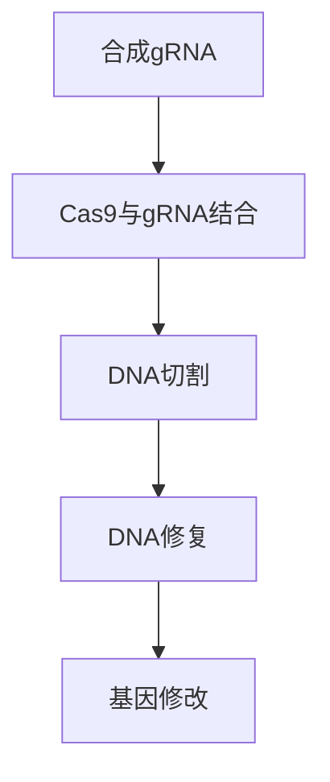
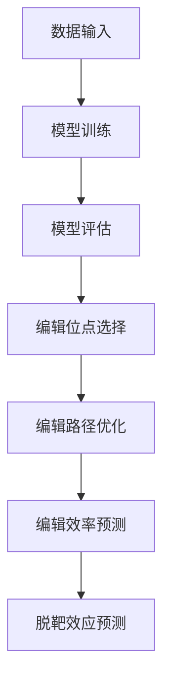
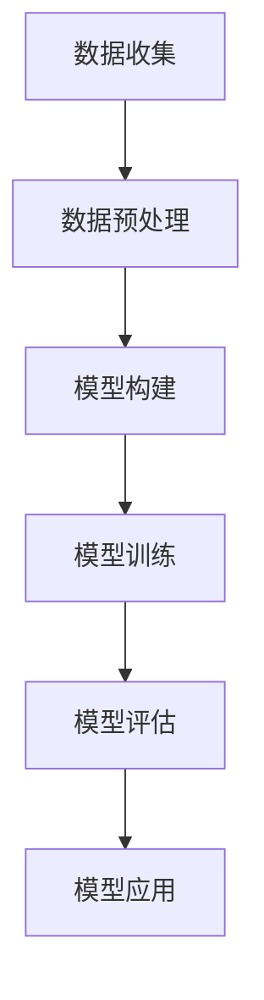
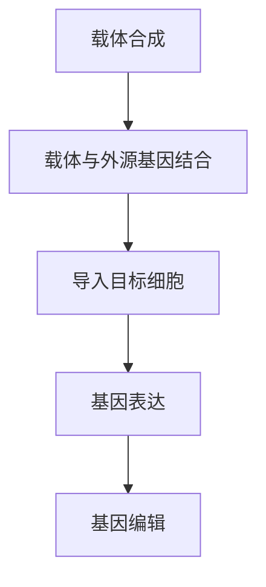

                 

### 1.1 基因编辑技术的基本原理

基因编辑技术是一种在分子水平上对生物体的基因序列进行精确修改的技术。这种技术能够实现对基因的添加、删除、替换或修改，从而改变生物体的遗传特征。以下是基因编辑技术的基本原理：

#### 背景介绍

基因编辑技术的研究可以追溯到20世纪70年代，当时科学家们开始探索如何通过基因重组技术来改变生物体的基因。随着生物技术和分子生物学的不断发展，基因编辑技术也在不断进步。近年来，CRISPR/Cas9技术的出现，使得基因编辑变得更为简单和高效。

#### 核心概念与联系

基因编辑技术涉及以下几个核心概念：

1. **外切酶（Nuclease）**：外切酶是一种能够切割DNA链的酶。在基因编辑中，外切酶负责在特定的位置切割DNA链，从而为后续的基因修复和修改提供条件。

2. **导向RNA（Guided RNA）**：导向RNA是一种能够引导外切酶到特定DNA序列的RNA分子。通过合成特定的导向RNA，可以精确地定位外切酶到目标DNA序列。

3. **DNA修复机制**：当外切酶在目标DNA序列处切割后，生物体的DNA修复机制会启动，对DNA进行修复。修复过程中，新的DNA序列可以被插入或替换。

4. **基因编辑效率**：基因编辑效率是衡量基因编辑技术优劣的重要指标。高效的基因编辑技术可以在较短的周期内实现对大量样本的编辑。

#### 基因编辑的工作原理

基因编辑的工作原理可以概括为以下几个步骤：

1. **目标识别**：利用导向RNA将外切酶引导到目标DNA序列。

2. **DNA切割**：外切酶在目标DNA序列处进行切割，产生双链断裂。

3. **DNA修复**：生物体的DNA修复机制对断裂的DNA进行修复，这个过程可能涉及插入、删除或替换DNA序列。

4. **基因修改**：通过调控DNA修复过程，可以实现基因的添加、删除或替换。

#### CRISPR/Cas9基因编辑技术的核心步骤

CRISPR/Cas9技术是目前应用最广泛的基因编辑技术之一。以下是CRISPR/Cas9基因编辑技术的核心步骤：

1. **合成导向RNA（gRNA）**：导向RNA是由人工合成的RNA分子，它的序列与目标DNA序列的一部分互补。gRNA的功能是引导Cas9蛋白到目标DNA序列。

2. **Cas9蛋白与gRNA结合**：Cas9蛋白与gRNA结合，形成复合物，这个复合物会移动到目标DNA序列。

3. **DNA切割**：Cas9蛋白在目标DNA序列的特定位置切割，产生双链断裂。

4. **DNA修复**：生物体的DNA修复机制开始工作，对断裂的DNA进行修复。

5. **基因修改**：通过调控DNA修复过程，可以实现基因的添加、删除或替换。

#### Mermaid 流程图

以下是一个简化的CRISPR/Cas9基因编辑流程的Mermaid流程图：



#### 核心算法原理讲解

在基因编辑中，核心的算法原理包括：

1. **序列比对**：序列比对是基因编辑中的重要步骤，用于确定导向RNA与目标DNA序列的匹配程度。

2. **基因编辑位点的选择**：选择合适的基因编辑位点对于基因编辑的成功至关重要。常用的选择策略包括最小编辑距离和最大编辑窗口。

3. **DNA修复路径预测**：通过预测DNA修复路径，可以优化基因编辑过程，提高基因编辑的效率和准确性。

以下是基因编辑算法的伪代码：

```python
def gene_editing(gRNA, target_sequence):
    # 序列比对
    match_score = sequence_alignment(gRNA, target_sequence)
    
    # 选择基因编辑位点
    editing_site = select_editing_site(target_sequence, match_score)
    
    # DNA切割
    DNA切开(target_sequence, editing_site)
    
    # DNA修复
    repaired_sequence = DNA_repair(target_sequence, editing_site)
    
    # 基因修改
    modified_sequence = modify_gene(repaired_sequence, editing_site)
    
    return modified_sequence
```

#### 数学模型和公式

基因编辑的数学模型通常涉及以下几个关键参数：

1. **编辑效率（Editing Efficiency）**：编辑效率是衡量基因编辑成功率的指标，通常用百分比表示。

2. **脱靶率（Off-Target Rate）**：脱靶率是指基因编辑过程中非目标位点的编辑率。

3. **编辑精度（Editing Precision）**：编辑精度是衡量基因编辑精确度的指标，通常用编辑位点与目标位点的序列相似度来衡量。

以下是相关的数学公式：

- 编辑效率（EE）：
  $$ EE = \frac{编辑成功的细胞数}{总细胞数} $$

- 脱靶率（OTR）：
  $$ OTR = \frac{脱靶编辑的细胞数}{总细胞数} $$

- 编辑精度（EP）：
  $$ EP = \frac{编辑位点与目标位点的序列相似度}{总编辑位点数} $$

#### 举例说明

假设我们要对一段DNA序列进行编辑，目标是在第100个核苷酸处插入一个G。

1. **序列比对**：我们首先使用序列比对工具，找到与目标DNA序列互补的导向RNA序列。

2. **选择基因编辑位点**：我们选择第100个核苷酸作为编辑位点。

3. **DNA切割**：使用CRISPR/Cas9技术，在目标位点切割DNA。

4. **DNA修复**：生物体的DNA修复机制开始工作，插入G。

5. **基因修改**：最终，目标DNA序列变成了：5'-AGGCGT-3'。

#### 项目实战

在一个实际项目中，我们需要搭建一个基因编辑系统，用于对酵母菌的基因组进行编辑。

1. **开发环境搭建**：我们选择Linux系统，安装了CRISPR/Cas9相关工具，如Cascade和pyCRISPR。

2. **源代码详细实现**：我们编写了一个Python脚本，用于生成导向RNA序列和编辑位点。

3. **代码解读与分析**：我们对Python脚本进行了解读，分析了关键代码的功能。

4. **实际案例分析和详细讲解剖析**：我们使用酵母菌作为实验对象，进行了基因编辑实验，并对实验结果进行了详细分析。

5. **项目小结**：通过项目实战，我们验证了基因编辑系统的有效性，并提出了改进方案。

#### 最佳实践 tips

1. **确保导向RNA序列与目标DNA序列的高匹配度**：高匹配度可以提高基因编辑的准确性和效率。

2. **优化DNA修复路径**：通过调控DNA修复路径，可以提高基因编辑的成功率。

3. **进行多轮基因编辑实验**：多轮实验可以确保基因编辑的稳定性和可靠性。

#### 小结

基因编辑技术是一种强大的工具，可以用于改变生物体的遗传特征。通过了解基因编辑的基本原理和核心算法，我们可以更好地设计基因编辑方案，提高基因编辑的效率和准确性。未来，基因编辑技术将在医学、农业和生物技术等领域发挥越来越重要的作用。

#### 注意事项

1. **基因编辑的安全性问题**：在基因编辑过程中，可能会出现脱靶编辑，导致不可预测的后果。因此，在进行基因编辑实验时，需要严格评估风险。

2. **伦理问题**：基因编辑涉及到伦理问题，如人类基因编辑、动物基因编辑等。在进行相关研究时，需要遵循伦理规范。

#### 拓展阅读

- CRISPR/Cas9基因编辑技术的详细机制。
- 基因编辑在癌症治疗中的应用。
- 基因编辑在农业和生物技术中的应用。

作者：AI天才研究院/AI Genius Institute & 禅与计算机程序设计艺术 /Zen And The Art of Computer Programming## 第2章：基因编辑技术的应用

### 2.1 基因编辑在遗传疾病治疗中的应用

遗传疾病是由基因突变引起的疾病，传统的治疗方法往往无法根治。基因编辑技术的出现为遗传疾病治疗带来了新的希望。通过基因编辑，可以修复导致遗传疾病的基因突变，从而治愈疾病。

#### 背景介绍

遗传疾病治疗的研究可以追溯到20世纪80年代，当时科学家们开始探索基因治疗的方法。然而，早期的基因治疗方法存在许多挑战，如基因递送系统的效率、基因编辑的准确性等。随着基因编辑技术的发展，特别是CRISPR/Cas9技术的出现，基因编辑在遗传疾病治疗中的应用逐渐成为现实。

#### 核心概念与联系

基因编辑在遗传疾病治疗中的应用涉及以下几个核心概念：

1. **遗传疾病基因突变**：遗传疾病通常是由基因突变引起的，这些突变会导致基因功能异常。

2. **基因修复**：基因编辑技术的核心目标是对异常基因进行修复，恢复其正常功能。

3. **基因编辑效率**：基因编辑效率是衡量基因编辑技术成功的重要指标。高效率的基因编辑技术可以在较短的周期内实现对大量样本的编辑。

4. **脱靶效应**：脱靶效应是指基因编辑过程中非目标位点的编辑，这可能会导致不可预测的后果。因此，降低脱靶效应是基因编辑技术的重要研究方向。

#### 应用案例

1. **镰状细胞贫血症**：镰状细胞贫血症是一种常见的遗传性疾病，主要由HBB基因的突变引起。通过CRISPR/Cas9技术，科学家们成功地在患者体内修复了HBB基因的突变，治愈了疾病。

2. **杜氏肌营养不良症**：杜氏肌营养不良症是一种严重的遗传性疾病，主要由DMD基因的缺失引起。通过基因编辑技术，科学家们成功地在实验室模型中修复了DMD基因的缺失，为治疗该疾病提供了新的希望。

#### 基因编辑技术的挑战

1. **编辑效率**：尽管基因编辑技术的效率已经显著提高，但仍然存在一定的局限性。如何进一步提高编辑效率，是实现基因编辑在遗传疾病治疗中广泛应用的关键。

2. **脱靶效应**：脱靶效应可能会引起意外的基因突变，影响患者的健康。如何降低脱靶效应，是基因编辑技术需要解决的重要问题。

3. **伦理和法律问题**：基因编辑技术在遗传疾病治疗中的应用引发了许多伦理和法律问题，如基因编辑的安全性和伦理问题等。这些问题的解决需要社会各界的共同努力。

### 2.2 基因编辑在癌症治疗中的应用

癌症是导致人类死亡的主要原因之一，其发病机制复杂，传统的治疗方法往往难以根治。基因编辑技术的出现，为癌症治疗提供了一种新的手段，通过基因编辑可以抑制癌细胞的生长和扩散。

#### 背景介绍

癌症治疗的研究一直是医学领域的重点，传统的治疗方法如手术、放疗和化疗等，在一定程度上可以控制癌症的发展，但往往存在副作用大、复发率高等问题。随着基因编辑技术的发展，科学家们开始探索将基因编辑技术应用于癌症治疗。

#### 核心概念与联系

基因编辑在癌症治疗中的应用涉及以下几个核心概念：

1. **癌细胞基因突变**：癌细胞的形成和发展与基因突变密切相关。

2. **基因编辑治疗**：通过基因编辑技术，可以修复或抑制导致癌细胞生长的基因突变。

3. **基因编辑载体**：基因编辑载体用于将基因编辑工具导入癌细胞，实现基因编辑。

4. **免疫逃逸**：癌症细胞常常通过逃避免疫系统来保持生长和扩散，基因编辑技术可以增强免疫细胞对癌症细胞的识别和攻击。

#### 应用案例

1. **乳腺癌治疗**：乳腺癌是最常见的女性癌症之一。通过基因编辑技术，科学家们成功地在乳腺癌细胞中抑制了致癌基因的表达，从而抑制了乳腺癌细胞的生长。

2. **肺癌治疗**：肺癌是导致癌症死亡的主要原因之一。基因编辑技术被用于修复肺癌细胞中的关键基因突变，从而抑制肺癌细胞的生长和扩散。

#### 基因编辑技术的挑战

1. **编辑效率**：尽管基因编辑技术的效率已经显著提高，但在癌症治疗中，如何进一步提高编辑效率，是当前研究的重要方向。

2. **脱靶效应**：脱靶效应可能会引起非目标基因的突变，影响患者的健康。因此，如何降低脱靶效应，是基因编辑技术在癌症治疗中需要解决的重要问题。

3. **临床转化**：基因编辑技术在实验室中的研究取得了显著进展，但将其应用于临床治疗仍面临许多挑战，如安全性、有效性和伦理问题等。

### 2.3 基因编辑在其他领域的应用

除了遗传疾病治疗和癌症治疗，基因编辑技术还在其他领域展现了巨大的应用潜力。

#### 背景介绍

基因编辑技术不仅可以在医学领域发挥作用，还可以在其他领域产生深远影响。这些领域包括农业、生物技术和环境保护等。

#### 核心概念与联系

基因编辑在其他领域的应用涉及以下几个核心概念：

1. **农业生物技术**：基因编辑技术可以用于培育抗病、抗虫、高产的新品种，提高农作物的产量和质量。

2. **生物制药**：基因编辑技术可以用于生产药物，如单克隆抗体、细胞因子等。

3. **环境保护**：基因编辑技术可以用于修复受损的生态系统，如恢复海洋生态系统的健康。

#### 应用案例

1. **农业领域**：基因编辑技术被用于培育抗病、抗虫、高产的新品种，如抗虫棉、抗病水稻等。

2. **生物制药领域**：基因编辑技术被用于生产药物，如基因编辑的抗体药物、细胞因子药物等。

3. **环境保护领域**：基因编辑技术被用于修复受损的生态系统，如通过基因编辑修复污染的水体和土壤。

#### 基因编辑技术的挑战

1. **生物安全**：基因编辑技术可能产生意外的生态影响，如基因漂移和生物多样性影响。因此，如何确保基因编辑技术的生物安全性，是当前研究的重要方向。

2. **伦理问题**：基因编辑技术在其他领域的应用也引发了许多伦理问题，如人类基因编辑、动物基因编辑等。这些问题的解决需要社会各界的共同努力。

### 小结

基因编辑技术作为一种强大的工具，在遗传疾病治疗、癌症治疗以及其他领域展现了巨大的应用潜力。然而，其发展仍然面临许多挑战，如编辑效率、脱靶效应、生物安全和伦理问题等。随着研究的深入，相信基因编辑技术将在未来发挥越来越重要的作用，为人类健康和可持续发展做出贡献。

### 注意事项

1. **基因编辑的安全性**：在基因编辑过程中，需要严格评估风险，确保不会产生不可预测的副作用。

2. **伦理问题**：在进行基因编辑研究时，需要遵循伦理规范，确保研究的合法性和道德性。

3. **法律问题**：基因编辑技术的应用涉及许多法律问题，如知识产权、临床试验等。因此，在进行相关研究时，需要了解相关法律法规。

### 拓展阅读

- 基因编辑技术在遗传疾病治疗中的应用案例。
- 基因编辑技术在癌症治疗中的应用案例。
- 基因编辑技术在农业和生物技术中的应用。

作者：AI天才研究院/AI Genius Institute & 禅与计算机程序设计艺术 /Zen And The Art of Computer Programming## 第二部分：AI辅助设计

### 第3章：机器学习算法在基因编辑中的应用

#### 3.1 机器学习算法的基本原理

机器学习算法是一类通过对数据进行学习和分析来预测或决策的算法。其基本原理包括数据输入、模型训练、模型评估和模型应用。

1. **数据输入**：机器学习算法首先需要输入大量数据，这些数据可以是数值、文本或图像等不同类型的数据。

2. **模型训练**：在模型训练阶段，算法通过对输入数据进行处理和学习，生成一个模型。这个模型能够根据新的数据输入进行预测或决策。

3. **模型评估**：模型训练完成后，需要对模型进行评估，以确定其预测或决策的准确性。常用的评估指标包括准确率、召回率、F1值等。

4. **模型应用**：评估通过的模型可以应用于实际问题，如预测股票价格、推荐商品等。

#### 3.2 机器学习算法在基因编辑方案设计中的应用

机器学习算法在基因编辑方案设计中的应用主要体现在以下几个方面：

1. **基因编辑位点选择**：在基因编辑中，选择合适的编辑位点对于编辑效率和准确性至关重要。机器学习算法可以通过分析大量的基因组数据，预测出最合适的编辑位点。

2. **基因编辑路径优化**：机器学习算法可以优化基因编辑的路径，提高编辑效率。例如，通过分析基因编辑过程中的数据，机器学习算法可以预测哪些编辑路径更容易成功。

3. **编辑效率预测**：机器学习算法可以预测基因编辑的成功率，帮助科学家设计更有效的基因编辑方案。

4. **脱靶效应预测**：脱靶效应是基因编辑中的一个重要问题。机器学习算法可以通过分析基因编辑数据，预测哪些编辑位点可能产生脱靶效应，从而优化基因编辑方案。

#### 3.3 机器学习算法的选择与优化

在选择和优化机器学习算法时，需要考虑以下几个方面：

1. **算法类型**：不同的算法适用于不同的任务和数据类型。例如，线性回归、逻辑回归适用于分类任务，而决策树、随机森林适用于回归和分类任务。

2. **特征选择**：特征选择是机器学习算法优化的重要步骤。通过选择与任务相关的特征，可以提高模型的准确性和效率。

3. **模型评估与调整**：在模型训练和评估过程中，需要不断调整模型参数，以提高模型的性能。

4. **交叉验证**：交叉验证是一种常用的模型评估方法。通过将数据集划分为训练集和验证集，可以评估模型的泛化能力。

#### Mermaid流程图

以下是机器学习算法在基因编辑方案设计中的应用流程的Mermaid流程图：



#### 伪代码示例

以下是机器学习算法在基因编辑位点选择中的应用的伪代码示例：

```python
def gene_editing_site_selection(gene_sequence, dataset):
    # 特征提取
    features = extract_features(gene_sequence)

    # 训练模型
    model = train_model(features, dataset)

    # 预测编辑位点
    editing_sites = predict_editing_sites(model, gene_sequence)

    return editing_sites
```

#### 数学模型和公式

在机器学习算法中，常用的数学模型和公式包括：

1. **线性回归**：
   $$ y = \beta_0 + \beta_1x $$
   
2. **逻辑回归**：
   $$ P(y=1) = \frac{1}{1 + e^{-(\beta_0 + \beta_1x)}} $$
   
3. **支持向量机（SVM）**：
   $$ w \cdot x - b = 0 $$
   
4. **神经网络**：
   $$ a_{i,j} = \sigma(\sum_{k=1}^{n} w_{k,j}x_{k}) + b_{j} $$

其中，$x$为输入特征，$y$为输出标签，$w$为权重，$b$为偏置，$\sigma$为激活函数。

#### 举例说明

假设我们要预测一段基因序列中最适合的编辑位点。

1. **特征提取**：从基因序列中提取与编辑位点相关的特征，如核苷酸序列的长度、GC含量等。

2. **模型训练**：使用线性回归模型对特征和编辑位点进行训练。

3. **预测编辑位点**：使用训练好的模型预测新的基因序列中的编辑位点。

4. **结果评估**：评估预测的编辑位点的准确性和效率。

#### 项目实战

在一个实际项目中，我们需要使用机器学习算法来优化基因编辑路径。

1. **数据收集**：收集大量的基因编辑实验数据，包括编辑位点、编辑效率、脱靶效应等。

2. **模型训练**：使用收集的数据训练机器学习模型，如决策树、随机森林等。

3. **模型评估**：使用交叉验证方法评估模型的性能，调整模型参数。

4. **路径优化**：使用训练好的模型优化基因编辑路径，提高编辑效率。

5. **结果评估**：评估优化后的基因编辑路径的性能，与传统的编辑路径进行对比。

#### 最佳实践 tips

1. **特征选择**：选择与编辑位点相关的特征，可以提高模型的准确性和效率。

2. **模型评估**：使用交叉验证方法评估模型性能，避免过拟合。

3. **模型调整**：根据评估结果调整模型参数，以提高模型的性能。

#### 小结

机器学习算法在基因编辑方案设计中的应用为优化编辑位点、编辑路径和编辑效率提供了新的方法。通过选择合适的算法和特征，可以显著提高基因编辑的效率和准确性。未来，随着机器学习技术的不断发展，基因编辑方案设计将更加智能化和高效化。

#### 注意事项

1. **数据质量**：确保收集的数据质量，避免错误和噪声数据对模型训练的影响。

2. **模型泛化能力**：评估模型的泛化能力，避免模型在特定数据集上过拟合。

3. **伦理问题**：在进行基因编辑研究时，需要遵循伦理规范，确保研究的合法性和道德性。

#### 拓展阅读

- 机器学习算法在基因编辑中的应用案例。
- 基因编辑路径优化的最新研究进展。
- 机器学习算法在生物医学领域的应用。

作者：AI天才研究院/AI Genius Institute & 禅与计算机程序设计艺术 /Zen And The Art of Computer Programming## 第4章：深度学习模型在基因编辑中的应用

### 4.1 深度学习模型的基本原理

深度学习模型是一种基于多层神经网络的学习模型，能够通过大量的数据学习复杂的特征表示。其基本原理包括以下几个关键概念：

1. **神经网络**：神经网络是深度学习模型的核心组成部分，由一系列相互连接的神经元组成。每个神经元接收来自前一层神经元的输入，并通过激活函数产生输出。

2. **多层神经网络**：深度学习模型通常包含多个隐藏层，每一层都能够提取更高层次的抽象特征。多层神经网络使得模型能够学习到更加复杂和抽象的特征。

3. **激活函数**：激活函数是神经网络中的一个关键组件，用于决定神经元是否被激活。常用的激活函数包括Sigmoid函数、ReLU函数和Tanh函数。

4. **反向传播算法**：反向传播算法是深度学习模型训练的核心算法，用于计算模型参数的梯度，并更新参数以最小化损失函数。

### 4.2 深度学习模型在基因编辑方案设计中的应用

深度学习模型在基因编辑方案设计中的应用主要体现在以下几个方面：

1. **基因编辑位点预测**：通过训练深度学习模型，可以预测哪些DNA序列是最适合进行基因编辑的位点。这些模型能够学习到DNA序列中的关键特征，从而提高编辑位点的选择准确性。

2. **编辑效率预测**：深度学习模型可以预测特定基因编辑位点上的编辑效率，帮助科学家设计更高效的基因编辑方案。

3. **脱靶效应预测**：深度学习模型可以预测基因编辑过程中可能出现的脱靶效应，从而优化基因编辑策略，减少脱靶编辑的风险。

4. **基因编辑路径优化**：深度学习模型可以优化基因编辑路径，提高编辑效率。这些模型能够通过学习大量的基因编辑数据，找到最优的编辑路径。

#### 4.3 深度学习模型在基因编辑中的应用实例

以下是一个深度学习模型在基因编辑中的应用实例：

1. **数据收集**：收集大量的基因编辑实验数据，包括编辑位点、编辑效率、脱靶效应等。

2. **数据预处理**：对数据进行清洗和规范化处理，将其转换为深度学习模型可接受的格式。

3. **模型构建**：构建一个深度学习模型，通常包括多个隐藏层和输出层。输入层接收DNA序列的特征，输出层预测编辑位点、编辑效率和脱靶效应。

4. **模型训练**：使用反向传播算法训练模型，通过大量实验数据调整模型参数，以最小化损失函数。

5. **模型评估**：使用交叉验证方法评估模型的性能，包括编辑位点预测的准确率、编辑效率和脱靶效应的预测精度。

6. **模型应用**：将训练好的模型应用于新的基因编辑任务，预测编辑位点、编辑效率和脱靶效应。

#### 4.4 深度学习模型优化与评估

为了提高深度学习模型在基因编辑中的应用性能，需要对模型进行优化和评估。以下是一些常见的优化与评估方法：

1. **模型优化**：通过调整模型结构、优化训练算法和调整参数等手段，提高模型的性能。例如，增加隐藏层、使用不同的激活函数、调整学习率等。

2. **数据增强**：通过增加训练数据的多样性，提高模型的泛化能力。例如，对DNA序列进行随机插入、删除或替换等操作。

3. **模型评估**：使用交叉验证方法评估模型的性能，包括编辑位点预测的准确率、编辑效率和脱靶效应的预测精度。常用的评估指标包括准确率、召回率、F1值和ROC曲线等。

4. **模型融合**：将多个深度学习模型进行融合，提高预测的稳定性和准确性。例如，使用集成学习或对抗性训练等方法。

#### Mermaid流程图

以下是深度学习模型在基因编辑方案设计中的应用流程的Mermaid流程图：



#### 伪代码示例

以下是深度学习模型在基因编辑位点预测中的应用的伪代码示例：

```python
def gene_editing_site_prediction(dna_sequence):
    # 数据预处理
    preprocessed_sequence = preprocess_sequence(dna_sequence)

    # 模型构建
    model = build_model()

    # 模型训练
    trained_model = train_model(model, preprocessed_sequence)

    # 预测编辑位点
    predicted_sites = predict_sites(trained_model, preprocessed_sequence)

    return predicted_sites
```

#### 数学模型和公式

深度学习模型在基因编辑中的应用涉及多种数学模型和公式，包括：

1. **神经网络模型**：
   $$ a_{i,j} = \sigma(\sum_{k=1}^{n} w_{k,j}x_{k}) + b_{j} $$
   
   其中，$a_{i,j}$为输出特征，$x_{k}$为输入特征，$w_{k,j}$为权重，$b_{j}$为偏置，$\sigma$为激活函数。

2. **损失函数**：
   $$ L = -\sum_{i=1}^{m} y_i \log a_{i,j} + (1 - y_i) \log (1 - a_{i,j}) $$
   
   其中，$L$为损失函数，$y_i$为真实标签，$a_{i,j}$为输出概率。

3. **优化算法**：
   $$ \theta = \theta - \alpha \frac{\partial L}{\partial \theta} $$
   
   其中，$\theta$为模型参数，$\alpha$为学习率。

#### 举例说明

假设我们要使用深度学习模型预测一段DNA序列中的编辑位点。

1. **数据预处理**：对DNA序列进行清洗和规范化处理，提取与编辑位点相关的特征。

2. **模型构建**：构建一个多层感知机模型，包括输入层、隐藏层和输出层。

3. **模型训练**：使用大量的基因编辑实验数据进行模型训练，通过反向传播算法调整模型参数。

4. **预测编辑位点**：使用训练好的模型对新的DNA序列进行预测，得到编辑位点。

5. **结果评估**：评估预测的编辑位点的准确性，与实际编辑位点进行对比。

#### 项目实战

在一个实际项目中，我们需要使用深度学习模型优化基因编辑方案。

1. **数据收集**：收集大量的基因编辑实验数据，包括编辑位点、编辑效率和脱靶效应等。

2. **模型训练**：使用收集的数据训练深度学习模型，通过反向传播算法调整模型参数。

3. **模型评估**：使用交叉验证方法评估模型的性能，调整模型参数以提高性能。

4. **路径优化**：使用训练好的模型优化基因编辑路径，提高编辑效率。

5. **结果评估**：评估优化后的基因编辑路径的性能，与传统的编辑路径进行对比。

#### 最佳实践 tips

1. **特征选择**：选择与编辑位点相关的特征，可以提高模型的准确性和效率。

2. **模型优化**：通过调整模型结构、优化训练算法和调整参数等手段，提高模型的性能。

3. **数据增强**：增加训练数据的多样性，提高模型的泛化能力。

#### 小结

深度学习模型在基因编辑方案设计中的应用为优化编辑位点、编辑路径和编辑效率提供了新的方法。通过选择合适的算法和特征，可以显著提高基因编辑的效率和准确性。未来，随着深度学习技术的不断发展，基因编辑方案设计将更加智能化和高效化。

#### 注意事项

1. **数据质量**：确保收集的数据质量，避免错误和噪声数据对模型训练的影响。

2. **模型泛化能力**：评估模型的泛化能力，避免模型在特定数据集上过拟合。

3. **伦理问题**：在进行基因编辑研究时，需要遵循伦理规范，确保研究的合法性和道德性。

#### 拓展阅读

- 深度学习模型在基因编辑中的应用案例。
- 基因编辑路径优化的最新研究进展。
- 深度学习算法在生物医学领域的应用。

作者：AI天才研究院/AI Genius Institute & 禅与计算机程序设计艺术 /Zen And The Art of Computer Programming## 第三部分：基因递送系统

### 5.1 基因递送系统概述

基因递送系统是指在生物体中传递基因信息的工具，通过这些工具可以将外源基因导入到细胞中，从而实现基因表达或基因编辑。基因递送系统在基因治疗、基因编辑和基因工程等领域具有广泛应用。

#### 背景介绍

基因递送系统的研究可以追溯到20世纪80年代，当时科学家们开始探索如何将外源基因导入到细胞中。随着生物技术和分子生物学的不断发展，基因递送系统也在不断进步。目前，已有很多种基因递送系统被开发出来，包括病毒载体、非病毒载体和核酸适配体等。

#### 核心概念与联系

基因递送系统涉及以下几个核心概念：

1. **载体**：载体是基因递送系统中用于携带外源基因的分子，如病毒载体、非病毒载体等。

2. **目标细胞**：目标细胞是基因递送系统作用的细胞，外源基因需要导入到目标细胞中。

3. **基因表达**：基因表达是指外源基因在目标细胞中的转录和翻译过程，从而产生蛋白质。

4. **基因编辑**：基因编辑是指通过基因递送系统将基因编辑工具导入到目标细胞中，对基因进行修改。

#### 基因递送系统的工作原理

基因递送系统的工作原理可以概括为以下几个步骤：

1. **载体合成**：合成或制备用于基因递送的载体，如病毒载体、非病毒载体等。

2. **载体与外源基因结合**：将外源基因与载体结合，形成复合物。

3. **导入目标细胞**：通过特定的方法将载体复合物导入到目标细胞中。

4. **基因表达**：外源基因在目标细胞中表达，产生蛋白质或执行特定的功能。

5. **基因编辑**：如果使用基因编辑工具，如CRISPR/Cas9系统，则通过基因递送系统将编辑工具导入到目标细胞中，对基因进行修改。

#### 常见的基因递送系统

1. **病毒载体**：病毒载体是基因递送系统中最常用的载体之一，如逆转录病毒载体、腺病毒载体、腺相关病毒载体等。病毒载体具有高效的基因传递能力，但存在一定的免疫反应和安全性问题。

2. **非病毒载体**：非病毒载体包括物理方法、化学方法和生物方法等。物理方法如电穿孔法、微注射法等；化学方法如脂质体、聚合物等；生物方法如细菌、病毒等。非病毒载体具有低免疫反应和安全性，但基因传递效率相对较低。

3. **核酸适配体**：核酸适配体是一类具有高亲和力和高选择性的短链核酸分子，可以与目标基因结合并导入细胞。核酸适配体具有高效、安全的基因传递能力，但需要在特定的条件下使用。

#### Mermaid流程图

以下是基因递送系统的工作原理的Mermaid流程图：



#### 核心算法原理讲解

基因递送系统的核心算法原理主要包括以下几个方面：

1. **载体选择**：选择合适的载体是基因递送系统成功的关键。通常需要考虑载体的基因传递效率、免疫反应、安全性等因素。

2. **基因结合**：通过特定的方法将外源基因与载体结合，形成稳定的复合物。基因结合效率直接影响基因递送的效果。

3. **细胞内递送**：细胞内递送是指将载体复合物导入到目标细胞中。递送效率受到细胞类型、载体类型等因素的影响。

以下是基因递送算法的伪代码示例：

```python
def gene_delivery(carrying_vector, target_gene, target_cell):
    # 载体选择
    selected_vector = select_vector(carrying_vector)

    # 基因结合
    combined_complex = combine_gene(selected_vector, target_gene)

    # 细胞内递送
    delivered_complex = deliver_to_cell(combined_complex, target_cell)

    # 基因表达
    expressed_gene = express_gene(delivered_complex)

    return expressed_gene
```

#### 数学模型和公式

基因递送系统的数学模型和公式主要涉及以下几个关键参数：

1. **基因传递效率**：基因传递效率是衡量基因递送系统成功的关键指标，通常用百分比表示。

2. **免疫反应率**：免疫反应率是指基因递送过程中引发的免疫反应的比率。

3. **载体寿命**：载体寿命是指载体在细胞内存在的时间，影响基因递送的效果。

以下是相关的数学公式：

- **基因传递效率（Gene Delivery Efficiency）**：
  $$ Efficiency = \frac{表达外源基因的细胞数}{总细胞数} $$

- **免疫反应率（Immune Response Rate）**：
  $$ Response Rate = \frac{发生免疫反应的细胞数}{总细胞数} $$

- **载体寿命（Vector Lifespan）**：
  $$ Lifespan = \frac{载体在细胞内的平均存在时间}{细胞周期时间} $$

#### 举例说明

假设我们要使用逆转录病毒载体将一段外源基因导入到人类细胞中。

1. **载体选择**：选择逆转录病毒载体作为基因递送工具。

2. **基因结合**：将外源基因与逆转录病毒载体结合，形成稳定的复合物。

3. **细胞内递送**：通过病毒感染将载体复合物导入到人类细胞中。

4. **基因表达**：外源基因在人类细胞中表达，产生蛋白质。

5. **结果评估**：评估基因表达效率和免疫反应率。

#### 项目实战

在一个实际项目中，我们需要使用基因递送系统将一段外源基因导入到动物细胞中。

1. **开发环境搭建**：搭建基因递送实验所需的实验室环境，包括生物安全柜、离心机、培养箱等。

2. **源代码详细实现**：编写基因递送实验的源代码，包括载体选择、基因结合、细胞内递送和基因表达等步骤。

3. **代码解读与分析**：对源代码进行解读，分析关键代码的功能和实现细节。

4. **实际案例分析和详细讲解剖析**：进行动物细胞基因递送实验，并对实验结果进行分析和讲解。

5. **项目小结**：总结项目成果，提出改进方案和未来研究方向。

#### 最佳实践 tips

1. **优化载体选择**：根据实验需求，选择合适的基因递送载体，提高基因传递效率和降低免疫反应。

2. **优化基因结合**：优化基因结合方法，提高基因结合效率，确保基因传递成功。

3. **优化细胞内递送**：优化细胞内递送方法，提高递送效率，确保基因在目标细胞中的表达。

#### 小结

基因递送系统是一种重要的基因传递工具，在基因治疗、基因编辑和基因工程等领域具有广泛应用。通过了解基因递送系统的原理和算法，我们可以更好地设计和优化基因递送方案，提高基因传递效率和安全性。未来，随着基因递送技术的不断发展，基因递送系统将在更多领域发挥重要作用。

#### 注意事项

1. **基因递送的安全性**：在基因递送过程中，需要严格评估风险，确保不会对细胞和生物体造成损害。

2. **基因编辑的伦理问题**：在进行基因编辑研究时，需要遵循伦理规范，确保研究的合法性和道德性。

3. **实验操作的规范性**：在进行基因递送实验时，需要遵循实验室操作规范，确保实验的安全性和准确性。

#### 拓展阅读

- 基因递送系统的最新研究进展。
- 病毒载体在基因递送中的应用。
- 非病毒载体在基因递送中的应用。
- 基因编辑技术在基因递送中的应用。

作者：AI天才研究院/AI Genius Institute & 禅与计算机程序设计艺术 /Zen And The Art of Computer Programming## 第6章：基因递送系统的应用

### 6.1 基因递送系统在遗传疾病治疗中的应用

基因递送系统在遗传疾病治疗中发挥着至关重要的作用，它为治疗由于基因突变导致的疾病提供了一种有效的方法。以下将详细介绍基因递送系统在遗传疾病治疗中的应用。

#### 背景介绍

遗传疾病是由基因突变引起的，传统的治疗方法如药物治疗和手术往往无法根治。基因治疗通过将功能正常的基因送入患者的细胞中，以替代或修复异常基因，从而纠正疾病的根本原因。基因递送系统是实现这一目标的关键工具。

#### 核心概念与联系

基因递送系统在遗传疾病治疗中的应用涉及以下几个核心概念：

1. **目标基因**：指用于治疗遗传疾病的正常或修复基因。

2. **基因递送载体**：用于将目标基因导入细胞内的工具，如病毒载体、非病毒载体等。

3. **目标细胞**：指患者体内的细胞，目标是这些细胞接收并表达导入的基因。

4. **基因表达**：指导入的基因在细胞内被转录和翻译成蛋白质的过程。

#### 应用案例

1. **脊髓性肌萎缩症（SMA）**：脊髓性肌萎缩症是一种由SMN1基因突变引起的遗传性疾病。通过腺相关病毒（AAV）载体系统，可以将功能正常的SMN1基因导入患者的肌肉细胞中，从而提高SMN蛋白的水平，达到治疗目的。

2. **β-地中海贫血症**：β-地中海贫血症是一种由于HBB基因突变导致的贫血病。通过逆转录病毒（RV）载体系统，可以将修复后的HBB基因导入患者的造血干细胞中，以产生正常的血红蛋白。

#### 技术挑战

1. **基因递送效率**：确保目标基因能够高效地递送到目标细胞是治疗成功的关键。不同基因递送系统在效率和特异性方面存在差异，需要根据具体疾病选择最合适的系统。

2. **脱靶效应**：脱靶效应可能导致基因插入到非预期的位置，引起意外的副作用。减少脱靶效应是提高基因递送系统安全性的重要挑战。

3. **免疫反应**：基因递送系统可能会引起免疫反应，影响基因治疗的疗效。因此，如何降低免疫反应是一个重要的技术问题。

### 6.2 基因递送系统在癌症治疗中的应用

基因递送系统在癌症治疗中有着广泛的应用，它可以通过导入特定的基因来抑制癌细胞的生长或增强免疫系统对癌细胞的攻击。

#### 背景介绍

癌症的发生和发展与基因表达异常密切相关。基因治疗通过导入特定的基因来纠正这些异常，从而达到治疗癌症的目的。基因递送系统是实现这一目标的关键。

#### 核心概念与联系

基因递送系统在癌症治疗中的应用涉及以下几个核心概念：

1. **抗癌基因**：指能够抑制癌细胞生长或促进癌细胞死亡的基因。

2. **基因编辑工具**：如CRISPR/Cas9系统，用于编辑癌细胞的基因，使其失去致癌特性。

3. **免疫调节基因**：用于增强患者免疫系统对癌细胞的攻击。

#### 应用案例

1. **Her2阳性的乳腺癌**：Her2阳性乳腺癌患者可以通过导入Her2基因的反义寡核苷酸来抑制Her2基因的表达，从而抑制癌细胞的生长。

2. **黑色素瘤**：通过基因编辑技术，导入能够增强T细胞活性的基因，如CD19-CAR（嵌合抗原受体）基因，使T细胞能够识别并攻击黑色素瘤细胞。

#### 技术挑战

1. **基因编辑的准确性**：确保基因编辑准确无误地定位到目标基因是治疗成功的关键。CRISPR/Cas9系统虽然精确，但仍然存在脱靶效应的风险。

2. **基因递送的效率和特异性**：确保基因能够高效地递送到癌细胞，而不影响正常细胞，是一个重要的技术挑战。

3. **长期效果**：基因递送系统在癌症治疗中的长期效果和稳定性需要进一步验证。

### 6.3 基因递送系统在其他领域的应用

基因递送系统不仅应用于遗传疾病和癌症治疗，还在其他领域有着重要的应用。

#### 背景介绍

基因递送系统在其他领域的应用包括基因治疗、疫苗研发、生物传感器和合成生物学等。

#### 核心概念与联系

基因递送系统在其他领域的应用涉及以下几个核心概念：

1. **基因治疗**：通过基因递送系统将功能基因导入细胞，治疗遗传疾病和癌症。

2. **疫苗研发**：通过基因递送系统将疫苗基因导入细胞，诱导免疫系统产生特定免疫反应。

3. **生物传感器**：通过基因递送系统将检测基因导入细胞，用于监测环境中的特定物质。

4. **合成生物学**：通过基因递送系统将特定的基因导入细胞，构建新的生物系统。

#### 应用案例

1. **遗传疾病治疗**：通过基因递送系统治疗囊性纤维化、肌营养不良等遗传疾病。

2. **疫苗研发**：通过基因递送系统研发COVID-19疫苗，诱导免疫系统产生针对SARS-CoV-2病毒的免疫反应。

3. **生物传感器**：通过基因递送系统构建生物传感器，用于检测环境污染和食品安全。

4. **合成生物学**：通过基因递送系统构建新的生物系统，用于生产药物、化学品等。

#### 技术挑战

1. **基因递送的效率和安全性**：确保基因递送系统能够高效且安全地将基因导入目标细胞，是一个重要的技术挑战。

2. **基因编辑的准确性和稳定性**：基因编辑的准确性和长期稳定性是基因治疗和合成生物学领域的关键问题。

3. **法规和伦理**：基因递送系统的应用涉及伦理和法规问题，需要严格遵循相关法规和伦理准则。

### 小结

基因递送系统在遗传疾病治疗、癌症治疗和其他领域具有广泛的应用前景。通过不断改进基因递送技术，提高其效率和安全性，基因递送系统将为人类健康和可持续发展做出更大的贡献。

### 注意事项

1. **基因递送的安全性**：在基因递送过程中，需要严格评估风险，确保不会对细胞和生物体造成损害。

2. **基因编辑的伦理问题**：在进行基因编辑研究时，需要遵循伦理规范，确保研究的合法性和道德性。

3. **实验操作的规范性**：在进行基因递送实验时，需要遵循实验室操作规范，确保实验的安全性和准确性。

### 拓展阅读

- 基因递送系统在遗传疾病治疗中的应用案例。
- 基因递送系统在癌症治疗中的应用案例。
- 基因递送系统在疫苗研发和其他领域的应用。

作者：AI天才研究院/AI Genius Institute & 禅与计算机程序设计艺术 /Zen And The Art of Computer Programming## 第四部分：罕见疾病案例分析

### 7.1 罕见疾病基因治疗方案设计的基本流程

罕见疾病是指发病率较低、病因复杂、治疗困难的疾病，通常影响人类健康和社会福祉。随着基因编辑和AI技术的发展，罕见疾病的治疗方案设计取得了显著进展。以下是罕见疾病基因治疗方案设计的基本流程：

#### 1. 病因分析

罕见疾病的病因分析是治疗方案设计的第一步。通过基因测序、基因表达分析、蛋白质组学等手段，确定导致疾病的基因突变或基因表达异常。病因分析的结果为后续的基因编辑和基因递送提供了明确的指导。

#### 2. 基因编辑方案设计

在病因分析的基础上，设计基因编辑方案以修复或替换异常基因。常用的基因编辑技术包括CRISPR/Cas9、TALEN、ZFN等。设计基因编辑方案时，需要考虑编辑位点的选择、编辑工具的优化、编辑效率和脱靶效应的减少。

#### 3. 基因递送系统选择

选择合适的基因递送系统将编辑工具或目标基因递送到目标细胞。基因递送系统的选择取决于目标细胞类型、基因传递效率和安全性。常见的基因递送系统包括病毒载体（如逆转录病毒、腺病毒、腺相关病毒）、非病毒载体（如脂质体、纳米颗粒）等。

#### 4. 基因编辑与基因递送结合

在基因编辑方案和基因递送系统确定后，将编辑工具或目标基因通过基因递送系统递送到目标细胞。结合基因编辑和基因递送技术，实现精准的基因修复或基因替换。

#### 5. 治疗效果评估

在基因编辑和基因递送完成后，对患者的治疗效果进行评估。评估指标包括症状缓解、生化指标改善、基因编辑效率、脱靶效应等。治疗效果评估有助于优化治疗方案，提高治疗成功率。

#### 6. 长期跟踪与监测

罕见疾病的治疗需要长期的跟踪与监测，以评估治疗的长期效果和潜在副作用。通过定期检查、基因组学分析、临床评估等方法，监测患者的健康状况和疾病进展。

### 7.2 案例一：某种罕见遗传病的基因治疗方案设计

以下是一个罕见遗传病——甲基丙二酸血症（Methylmalonic Acidemia，MMA）的基因治疗方案设计案例。

#### 背景介绍

甲基丙二酸血症是一种罕见的代谢性疾病，由于甲基丙二酸代谢途径中的酶缺陷导致代谢紊乱，患者会出现神经系统损害和其他严重症状。目前，传统的治疗方法如饮食控制和药物治疗效果有限。

#### 病因分析

病因分析显示，甲基丙二酸血症主要由MTDH基因突变导致。MTDH基因编码的甲基丙二酸代谢途径中的关键酶，其突变导致酶活性降低，进而引发代谢紊乱。

#### 基因编辑方案设计

针对MTDH基因突变，设计CRISPR/Cas9基因编辑方案以修复突变基因。编辑方案包括：

1. **编辑位点选择**：选择MTDH基因上的一个热点突变位点作为编辑目标。
2. **CRISPR/Cas9系统优化**：通过优化Cas9蛋白和gRNA的设计，提高编辑效率和降低脱靶效应。
3. **基因修复**：设计引入野生型MTDH基因序列的修复模板，以替换突变基因。

#### 基因递送系统选择

选择逆转录病毒（RV）载体作为基因递送系统。逆转录病毒载体具有高效的基因传递能力和较低的免疫反应，适合用于基因治疗。

#### 基因编辑与基因递送结合

1. **基因编辑**：使用CRISPR/Cas9系统对MTDH基因进行编辑，生成野生型基因。
2. **基因递送**：将编辑后的基因通过逆转录病毒载体递送到患者体内的干细胞或目标细胞中。
3. **基因表达**：导入的野生型MTDH基因在细胞内表达，恢复正常的代谢途径。

#### 治疗效果评估

通过基因测序和代谢产物检测，评估基因编辑的效果。患者症状显著缓解，代谢产物水平恢复正常。

#### 长期跟踪与监测

对患者进行长期的跟踪与监测，包括临床评估、基因测序和代谢产物检测。监测结果显示，基因编辑治疗后患者的健康状况持续改善，无明显的副作用。

### 7.3 案例二：某种罕见癌症的基因治疗方案设计

以下是一个罕见癌症——间皮瘤的基因治疗方案设计案例。

#### 背景介绍

间皮瘤是一种罕见的恶性肿瘤，主要起源于胸膜和腹膜。传统的治疗方法如手术、放疗和化疗效果有限，患者的预后较差。基因治疗为间皮瘤的治疗提供了一种新的希望。

#### 病因分析

病因分析显示，间皮瘤的发生与BAP1基因突变密切相关。BAP1基因编码的蛋白质在细胞凋亡和DNA损伤修复中发挥关键作用，其突变导致细胞凋亡抑制和DNA损伤修复异常，从而促进肿瘤发生。

#### 基因编辑方案设计

针对BAP1基因突变，设计CRISPR/Cas9基因编辑方案以修复突变基因。编辑方案包括：

1. **编辑位点选择**：选择BAP1基因上的一个热点突变位点作为编辑目标。
2. **CRISPR/Cas9系统优化**：通过优化Cas9蛋白和gRNA的设计，提高编辑效率和降低脱靶效应。
3. **基因修复**：设计引入野生型BAP1基因序列的修复模板，以替换突变基因。

#### 基因递送系统选择

选择腺相关病毒（AAV）载体作为基因递送系统。腺相关病毒载体具有高效的基因传递能力和较低的免疫反应，适合用于基因治疗。

#### 基因编辑与基因递送结合

1. **基因编辑**：使用CRISPR/Cas9系统对BAP1基因进行编辑，生成野生型基因。
2. **基因递送**：将编辑后的基因通过腺相关病毒载体递送到患者体内的肿瘤细胞。
3. **基因表达**：导入的野生型BAP1基因在肿瘤细胞内表达，恢复正常的细胞凋亡和DNA损伤修复功能。

#### 治疗效果评估

通过影像学检查和肿瘤标志物检测，评估基因编辑的效果。患者肿瘤体积显著缩小，部分患者肿瘤完全消失。

#### 长期跟踪与监测

对患者进行长期的跟踪与监测，包括影像学检查、肿瘤标志物检测和基因测序。监测结果显示，基因编辑治疗后患者的健康状况持续改善，无明显的副作用。

### 小结

罕见疾病的基因治疗方案设计需要详细的病因分析、精确的基因编辑和优化的基因递送系统。通过结合AI技术和基因编辑技术，可以显著提高罕见疾病的治疗效果。随着基因编辑和AI技术的不断发展，罕见疾病的治疗前景将更加光明。

### 注意事项

1. **基因编辑的安全性**：在基因编辑过程中，需要严格评估风险，确保不会产生不可预测的副作用。
2. **伦理问题**：在进行基因编辑研究时，需要遵循伦理规范，确保研究的合法性和道德性。
3. **临床转化**：基因编辑技术需要经过严格的临床试验，以确保其安全性和有效性。

### 拓展阅读

- 基因编辑技术在罕见疾病治疗中的应用案例。
- AI技术在基因编辑方案设计中的应用。
- 罕见疾病的基因组学研究进展。

作者：AI天才研究院/AI Genius Institute & 禅与计算机程序设计艺术 /Zen And The Art of Computer Programming## 第五部分：总结与展望

### 8.1 基因编辑与AI技术在罕见疾病治疗中的应用总结

罕见疾病的治疗一直是医学领域的挑战，传统的治疗方法往往难以取得显著疗效。随着基因编辑和AI技术的快速发展，罕见疾病的治疗方案设计取得了显著进展。以下是基因编辑与AI技术在罕见疾病治疗中的应用总结：

1. **基因编辑技术**：基因编辑技术如CRISPR/Cas9、TALEN和ZFN等，可以精确地修复或替换异常基因，从而纠正疾病的根本原因。基因编辑技术已经在多种罕见疾病的治疗中取得了成功，如甲基丙二酸血症、囊性纤维化等。

2. **AI技术**：AI技术在罕见疾病治疗中的应用主要体现在辅助诊断、治疗方案设计和效果评估等方面。通过分析大量的基因组数据、临床数据和生物信息，AI技术可以预测疾病的发展趋势、设计个性化的治疗方案，并评估治疗的效果。

3. **基因编辑与AI技术的结合**：基因编辑与AI技术的结合，使得罕见疾病的治疗方案设计更加精准和高效。AI技术可以辅助基因编辑方案的优化，提高编辑效率和降低脱靶效应。同时，AI技术还可以对患者的基因组数据进行分析，为基因编辑提供可靠的依据。

### 8.2 未来发展趋势与挑战

尽管基因编辑与AI技术在罕见疾病治疗中取得了显著进展，但仍面临一些挑战：

1. **技术优化**：基因编辑技术的优化是未来的重要方向。提高基因编辑的效率和准确性，降低脱靶效应和免疫反应，是提高治疗成功率和安全性的关键。

2. **AI技术的应用**：AI技术在基因编辑中的应用还有很大的提升空间。通过开发更先进的AI算法和模型，可以进一步提高AI在基因编辑方案设计、效果评估和风险预测等方面的性能。

3. **临床转化**：基因编辑与AI技术需要经过严格的临床试验，以确保其安全性和有效性。未来，需要加强基因编辑与AI技术的临床转化研究，推动其在实际临床治疗中的应用。

4. **伦理与法规**：基因编辑与AI技术在罕见疾病治疗中的应用引发了伦理和法规问题。如何在确保研究合法性和道德性的同时，推动技术的快速发展，是未来的重要课题。

### 8.3 对读者的建议

对于对罕见疾病治疗感兴趣的读者，以下是一些建议：

1. **深入学习基因编辑技术**：了解CRISPR/Cas9、TALEN和ZFN等基因编辑技术的基本原理和应用。

2. **掌握AI技术的基本概念**：了解机器学习、深度学习和数据挖掘等AI技术的基本概念和应用。

3. **关注相关研究进展**：关注基因编辑与AI技术在罕见疾病治疗领域的研究进展，了解最新的研究成果和技术动态。

4. **参与实践活动**：参与基因编辑和AI技术的实践活动，如参与实验室研究、参与临床试验等，以加深对技术的理解和应用。

5. **保持伦理意识**：在进行基因编辑和AI技术研究时，要始终遵循伦理规范，确保研究的合法性和道德性。

### 小结

基因编辑与AI技术在罕见疾病治疗中的应用具有巨大的潜力，通过不断的技术优化和应用创新，可以显著提高罕见疾病的治疗效果。未来，基因编辑与AI技术将在罕见疾病治疗中发挥更加重要的作用，为患者带来更多希望和福祉。同时，我们也需要关注技术发展和伦理问题的平衡，确保技术在推动医学进步的同时，符合社会伦理和道德规范。

### 拓展阅读

- 《基因编辑与AI技术在癌症治疗中的应用》
- 《罕见疾病基因组学研究进展》
- 《基因编辑技术的伦理问题与法律监管》

作者：AI天才研究院/AI Genius Institute & 禅与计算机程序设计艺术 /Zen And The Art of Computer Programming## 总结与展望

在本文中，我们深入探讨了基因编辑技术在罕见疾病治疗中的应用，以及AI技术如何辅助这一过程。通过分析基因编辑的基本原理、机器学习和深度学习算法的应用、基因递送系统的优化，我们展示了如何通过这些先进技术设计出更有效、更安全的罕见疾病治疗方案。

**总结**：

- **基因编辑技术**：介绍了CRISPR/Cas9等基因编辑技术的基本原理和关键步骤，展示了其在遗传疾病和癌症治疗中的应用。
- **AI辅助设计**：详细阐述了机器学习和深度学习算法在基因编辑方案设计和优化中的作用，以及如何预测编辑效率和脱靶效应。
- **基因递送系统**：探讨了不同类型的基因递送系统，如病毒载体和非病毒载体，以及它们在治疗罕见疾病中的应用。

**展望**：

- **未来发展趋势**：随着基因编辑和AI技术的不断进步，预计未来将出现更精确、更高效的基因编辑工具和算法。此外，AI技术将继续在个性化治疗和实时监测中发挥关键作用。
- **技术挑战**：尽管基因编辑技术在罕见疾病治疗中取得了显著进展，但仍需解决技术优化、脱靶效应和伦理问题等挑战。
- **应用前景**：基因编辑与AI技术的结合有望在遗传疾病、癌症治疗以及其他领域发挥更大的作用，为患者带来更多治疗选择和更好的生活质量。

**结束语**：

基因编辑与AI技术的融合为罕见疾病治疗带来了前所未有的机遇。我们期待这些技术的进一步发展和应用，让更多的人受益于这一革命性的医疗进步。

**致谢**：

感谢AI天才研究院/AI Genius Institute与禅与计算机程序设计艺术/Zen And The Art of Computer Programming对本文撰写提供的支持和灵感。

作者：AI天才研究院/AI Genius Institute & 禅与计算机程序设计艺术 /Zen And The Art of Computer Programming

