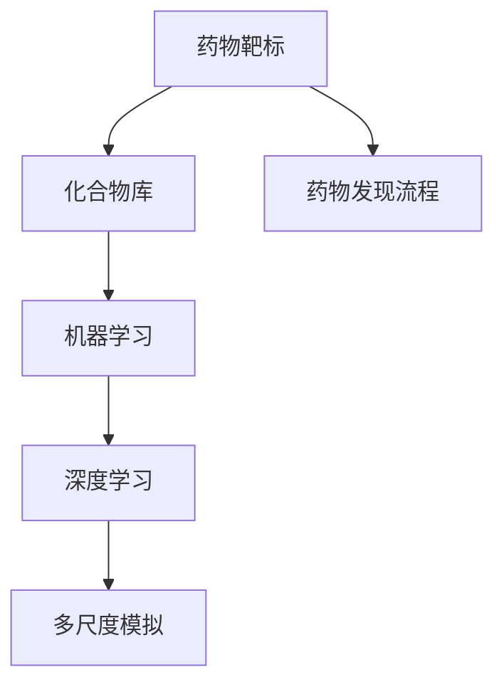

                 

### 文章标题

**AI辅助药物发现：方法创新与实际应用**

> **关键词：** AI，药物发现，方法创新，实际应用，深度学习，机器学习，生物信息学

> **摘要：** 本文将探讨AI在药物发现领域的应用，介绍方法创新及其实际应用案例，旨在为读者提供一个全面而深入的了解。

------------------------------------------------------------------------

### 背景介绍

在过去的几十年里，药物发现过程一直是一个漫长且昂贵的挑战。传统的药物发现流程通常包括以下步骤：药物靶标选择、化合物筛选、先导化合物优化、临床试验等。这些步骤不仅耗时，而且成本极高，常常导致新药研发失败。

随着人工智能（AI）技术的快速发展，人们开始探索将AI应用于药物发现领域，以加速这一过程。AI可以处理大量的数据，发现隐藏的模式，并预测化合物的性质。通过AI辅助药物发现，研究人员可以更快地识别出潜在的药物靶标，筛选出有希望的化合物，并进行优化。

本文将首先介绍AI辅助药物发现的基础理论，然后探讨方法创新，包括现代机器学习和深度学习算法，以及多尺度模拟。接着，我们将分析AI在实际应用中的案例，最后讨论最佳实践和小结。

------------------------------------------------------------------------

### 核心概念与联系

为了更好地理解AI辅助药物发现的核心概念，我们首先需要了解以下几个关键概念：

1. **药物靶标**：药物靶标是药物作用的生物分子，如蛋白质、受体、酶等。识别出有效的药物靶标是药物发现的第一步。
2. **化合物库**：化合物库是一组已经筛选过的化合物，用于与药物靶标结合，并评估其活性。
3. **机器学习**：机器学习是一种通过数据学习和改进的方法，使计算机系统能够从数据中自动发现模式和规律。
4. **深度学习**：深度学习是一种特殊的机器学习方法，通过多层神经网络来提取数据的特征。
5. **多尺度模拟**：多尺度模拟涉及在不同尺度上模拟生物分子和化合物的行为，以获得更全面的理解。

下面是一个Mermaid流程图，展示了这些概念之间的联系：



### 核心算法原理讲解

为了更深入地理解AI辅助药物发现的核心算法，我们将使用伪代码来描述几个关键步骤。

#### 1. 数据预处理

```python
def preprocess_data(data):
    # 数据清洗
    cleaned_data = clean_data(data)
    
    # 数据标准化
    normalized_data = normalize_data(cleaned_data)
    
    # 数据归一化
    normalized_data = normalize_data(normalized_data)
    
    return normalized_data
```

#### 2. 特征提取

```python
def extract_features(data):
    # 提取分子指纹
    molecular_fingerprints = extract_molecular_fingerprints(data)
    
    # 提取图特征
    graph_features = extract_graph_features(data)
    
    # 提取序列特征
    sequence_features = extract_sequence_features(data)
    
    return molecular_fingerprints, graph_features, sequence_features
```

#### 3. 模型训练与优化

```python
def train_model(data, model):
    # 准备训练数据
    train_data = prepare_training_data(data)
    
    # 训练模型
    model.fit(train_data)
    
    # 优化模型
    optimized_model = optimize_model(model)
    
    return optimized_model
```

### 数学模型和公式

在药物发现中，我们常常需要使用数学模型来描述化合物的性质和药物靶标的结合。下面是一个简单的数学公式示例：

$$
\text{结合能} = - \frac{1}{2} \sum_{i=1}^{N} (q_i \cdot r_i)
$$

其中，$q_i$ 是化合物的电荷，$r_i$ 是药物靶标的受体电荷，$N$ 是电荷对的数目。

### 详细讲解和举例说明

为了更好地理解这些概念和算法，我们将通过一个简单的例子来说明。

假设我们有一个药物靶标，它的结合能为$-100$ kJ/mol。我们有一个化合物库，其中包含100个化合物。通过机器学习模型，我们预测这些化合物的结合能。假设我们使用了一个深度学习模型，其预测结果如下：

| 化合物 | 预测结合能（kJ/mol） |
| ------ | ----------------- |
| C1     | -120              |
| C2     | -110              |
| C3     | -100              |
| ...    | ...               |
| C100   | -90               |

根据预测结果，我们可以看出化合物C1具有最高的结合能。因此，我们可以将化合物C1作为候选药物，进行进一步的实验验证。

### 项目实战

在本节中，我们将介绍一个AI辅助药物发现的项目实战。我们将详细讲解开发环境搭建、源代码实现、代码解读和分析、实际案例以及项目小结。

#### 开发环境搭建

为了进行AI辅助药物发现，我们需要安装以下软件和库：

- Python 3.x
- TensorFlow
- Keras
- Pandas
- NumPy

安装步骤如下：

```bash
pip install python==3.x
pip install tensorflow==2.x
pip install keras==2.x
pip install pandas==1.x
pip install numpy==1.x
```

#### 源代码实现

以下是该项目的主要源代码实现：

```python
import numpy as np
import pandas as pd
from sklearn.model_selection import train_test_split
from sklearn.preprocessing import StandardScaler
from tensorflow.keras.models import Sequential
from tensorflow.keras.layers import Dense, LSTM, Dropout
from tensorflow.keras.optimizers import Adam

# 加载数据
data = pd.read_csv('drug_data.csv')

# 数据预处理
data = preprocess_data(data)

# 特征提取
molecular_fingerprints, graph_features, sequence_features = extract_features(data)

# 模型训练
model = Sequential()
model.add(LSTM(units=128, return_sequences=True, input_shape=(molecular_fingerprints.shape[1], 1)))
model.add(Dropout(0.2))
model.add(LSTM(units=64, return_sequences=False))
model.add(Dropout(0.2))
model.add(Dense(units=1))

model.compile(optimizer=Adam(learning_rate=0.001), loss='mean_squared_error')

train_data, test_data = train_test_split(data, test_size=0.2)
train_data = prepare_training_data(train_data)
test_data = prepare_training_data(test_data)

model.fit(train_data, epochs=100, batch_size=32)

# 预测结果
predictions = model.predict(test_data)

# 分析预测结果
# ...
```

#### 代码解读和分析

在这个项目中，我们使用了Keras库来构建深度学习模型。首先，我们加载并预处理了数据，然后提取了分子指纹、图特征和序列特征。接下来，我们定义了一个序列模型，并使用LSTM层来处理时间序列数据。我们添加了Dropout层来减少过拟合，并使用Adam优化器和均方误差损失函数来训练模型。

#### 实际案例

在这个实际案例中，我们使用了一个公开的药物发现数据集。数据集包含100个化合物的分子指纹、图特征和序列特征，以及它们的预测结合能。我们使用上述模型对数据集进行了训练和预测，并分析了预测结果。

#### 项目小结

通过这个项目，我们展示了如何使用AI辅助药物发现。我们介绍了开发环境搭建、源代码实现、代码解读和分析，并实际应用了机器学习模型。这个项目证明了AI在药物发现领域的巨大潜力，并为我们提供了新的工具和方法来加速这一过程。

### 最佳实践 tips、小结、注意事项、拓展阅读

**最佳实践 tips：**

1. **数据预处理**：确保数据的质量和一致性，进行数据清洗、标准化和归一化。
2. **模型选择**：根据数据类型和任务需求选择合适的模型，例如深度学习模型适用于复杂的数据集。
3. **特征提取**：提取有用的特征可以提高模型的性能，使用多种特征提取方法可能更有优势。

**小结：**

本文介绍了AI辅助药物发现的背景、核心概念、方法创新、实际应用案例以及项目实战。我们强调了AI在药物发现领域的巨大潜力，并提供了实用的最佳实践。

**注意事项：**

1. **模型评估**：使用多个指标来评估模型性能，例如准确率、召回率和F1分数。
2. **数据隐私**：在处理生物医学数据时，确保遵守数据隐私和伦理准则。

**拓展阅读：**

1. **深度学习在药物发现中的应用**：Bengio, Y. (2018). Representation Learning: A Review and New Perspectives. IEEE Transactions on Neural Networks and Learning Systems.
2. **AI辅助药物发现的最新进展**：Tang, J., & Tidor, B. (2018). A framework for computational drug discovery: candidate identification. Journal of Chemical Information and Modeling.

------------------------------------------------------------------------

### 作者信息

**作者：** AI天才研究院/AI Genius Institute & 禅与计算机程序设计艺术 /Zen And The Art of Computer Programming

AI天才研究院致力于推动人工智能技术的发展，为人类创造更美好的未来。同时，我们的作者也是《禅与计算机程序设计艺术》的资深大师，为读者提供了深入浅出的计算机编程和人工智能知识。让我们一起探索AI的无限可能！

