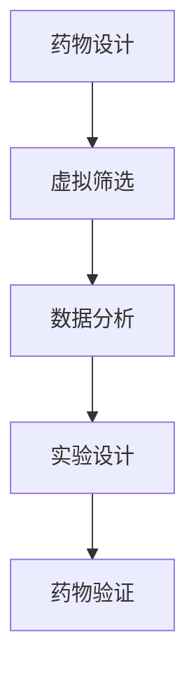
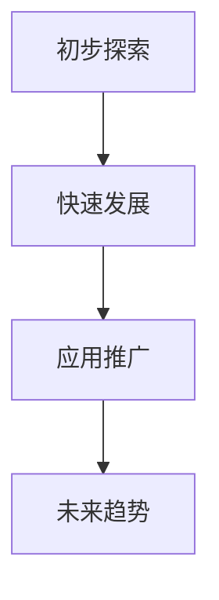
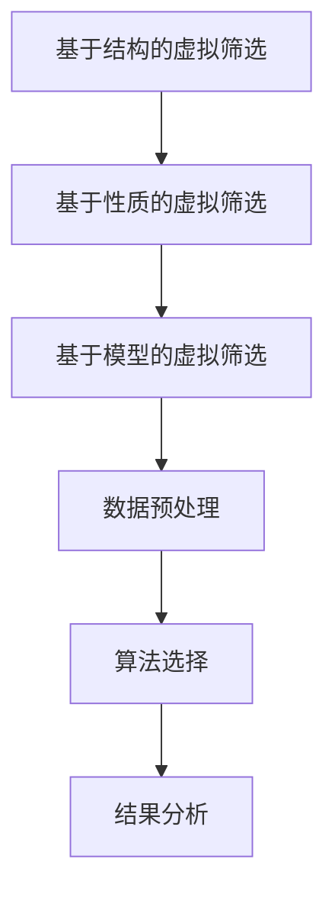
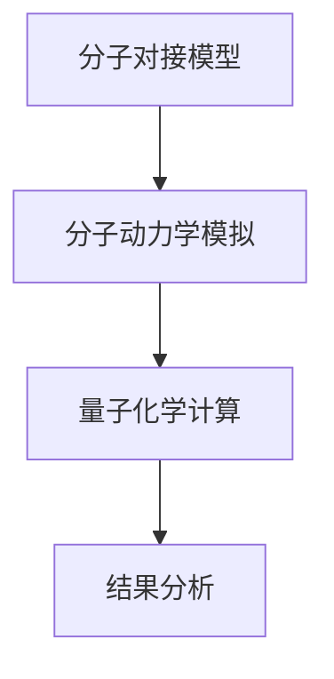
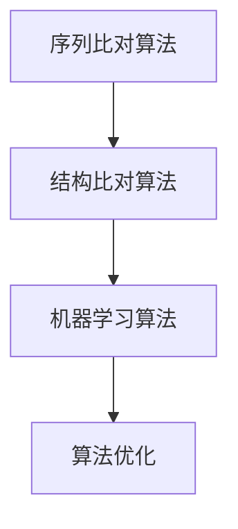
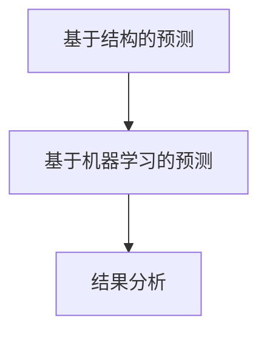

                 

### 文章标题

# AI辅助药物筛选：从虚拟筛选到实验设计

### 文章关键词

- 人工智能
- 药物筛选
- 虚拟筛选
- 实验设计
- 数据分析

### 文章摘要

本文深入探讨了人工智能（AI）在药物筛选中的应用，从虚拟筛选到实验设计，涵盖了多个关键环节。首先，我们概述了AI在药物筛选中的地位与作用，然后详细介绍了虚拟筛选的方法与算法，以及数据预处理与分析。接着，我们重点讨论了实验设计与优化，并通过实际案例进行了分析与讲解。最后，我们展望了AI辅助药物筛选的未来发展趋势与挑战。通过这篇文章，读者可以全面了解AI在药物筛选中的应用及其核心原理。

## 第一部分：AI辅助药物筛选概述

### 1.1 AI辅助药物筛选的核心概念

AI在药物筛选中的应用，主要集中在以下几个方面：

1. **虚拟筛选**：利用计算机模拟技术，通过比较分子结构、生物活性等信息，筛选出潜在的药物分子。
2. **数据分析**：对实验数据、生物信息等进行处理与分析，为药物筛选提供科学依据。
3. **实验设计**：基于AI算法，优化实验流程，提高实验效率和准确性。

#### Mermaid流程图：AI在药物筛选中的应用流程

### 1.2 AI辅助药物筛选的发展历程

AI辅助药物筛选的发展历程可以分为以下几个阶段：

1. **初步探索期（20世纪50年代-80年代）**：计算机科学和生物信息学的发展，为药物筛选提供了新的工具和方法。
2. **快速发展期（20世纪90年代-21世纪初）**：随着计算能力的提升，虚拟筛选技术逐渐成熟，AI算法在药物筛选中的应用得到广泛认可。
3. **应用推广期（21世纪初至今）**：AI技术在药物筛选中的应用越来越广泛，从初步的探索阶段转向实际应用，成为药物研发的重要手段。

#### Mermaid流程图：药物筛选技术的发展历程

### 1.3 AI辅助药物筛选的优势与挑战

AI辅助药物筛选具有以下优势：

1. **提高筛选效率**：通过虚拟筛选，可以迅速筛选出大量潜在药物分子，节省实验时间和成本。
2. **降低成本**：减少实验次数，降低实验材料消耗，降低药物研发成本。
3. **增强预测准确性**：基于大数据和深度学习算法，提高药物分子的预测准确性。

然而，AI辅助药物筛选也面临一些挑战：

1. **数据质量**：药物筛选依赖于大量的生物数据和实验数据，数据质量直接影响筛选结果。
2. **算法复杂性**：AI算法的复杂性导致结果解释难度大，需要进一步优化和简化。
3. **结果解释性**：AI模型的结果往往缺乏透明度和可解释性，需要建立更直观的解释模型。

## 第二部分：虚拟筛选方法与算法

### 2.1 虚拟筛选基础

虚拟筛选是指通过计算机模拟和算法，从大量的化合物库中筛选出具有特定生物活性的化合物。虚拟筛选方法主要包括以下几种：

1. **基于结构的虚拟筛选**：通过比较分子结构，筛选出与目标蛋白具有相似性的化合物。
2. **基于性质的虚拟筛选**：通过比较化合物的物理、化学性质，筛选出具有特定生物活性的化合物。
3. **基于模型的虚拟筛选**：结合分子动力学模拟和量子化学计算，预测化合物的生物活性。

#### Mermaid流程图：虚拟筛选方法

### 2.2 蛋白质-小分子相互作用模型

蛋白质-小分子相互作用是药物筛选的关键，因此建立准确的相互作用模型至关重要。常见的相互作用模型包括：

1. **分子对接模型**：通过计算分子对接评分，评估小分子与蛋白质的结合能力。
2. **分子动力学模拟**：通过模拟小分子在蛋白质环境中的动态行为，预测其结合能力。
3. **量子化学计算**：利用量子力学原理，计算分子之间的相互作用能量。

#### Mermaid流程图：蛋白质-小分子相互作用的建模过程

### 2.3 虚拟筛选算法

虚拟筛选算法是药物筛选的核心，常见的虚拟筛选算法包括：

1. **序列比对算法**：如BLAST、FASTA等，用于比较蛋白质序列，筛选相似蛋白。
2. **结构比对算法**：如VAST、SIM等，用于比较蛋白质结构，筛选相似结构。
3. **机器学习算法**：如支持向量机（SVM）、随机森林（RF）等，用于预测化合物的生物活性。

#### Mermaid流程图：虚拟筛选算法

## 第三部分：数据预处理与分析

### 3.1 数据来源与质量

药物筛选过程中，数据的质量直接影响筛选结果。数据来源主要包括：

1. **实验数据**：通过实验获得的数据，如生物活性实验、蛋白质结构数据等。
2. **数据库数据**：如PDB、PubChem等，提供大量的化合物和生物信息。

为了保证数据质量，需要采取以下措施：

1. **数据清洗**：去除重复数据、异常数据和错误数据。
2. **数据去重**：去除重复的化合物和生物信息。
3. **数据标准化**：将不同来源的数据进行统一处理，如单位转换、格式转换等。

### 3.2 特征提取与筛选

特征提取是将原始数据转换为可用于模型训练的特征表示。常见的特征提取方法包括：

1. **分子指纹**：将分子结构编码为二进制向量，用于表示分子的特征。
2. **分子描述符**：计算分子结构的各种属性，如拓扑指数、分子量、极性等。

特征筛选是选择对模型性能有显著影响的关键特征。常用的特征筛选方法包括：

1. **信息增益**：选择特征对目标变量（生物活性）的解释能力最强。
2. **相关性分析**：选择与目标变量相关性最强的特征。

### 3.3 数据分析

数据分析是药物筛选的关键环节，常用的数据分析方法包括：

1. **机器学习算法**：如支持向量机（SVM）、随机森林（RF）等，用于预测化合物的生物活性。
2. **数据可视化**：如热图、散点图等，用于展示数据分布和特征关系。
3. **模型评估**：如ROC曲线、AUC等，用于评估模型性能。

### 3.4 药物-靶点相互作用预测

药物-靶点相互作用预测是药物筛选的核心任务。常见的预测方法包括：

1. **基于结构的预测**：利用分子对接模型、分子动力学模拟等方法，预测药物与靶点的结合能力。
2. **基于机器学习的预测**：利用支持向量机（SVM）、随机森林（RF）等算法，预测药物-靶点相互作用。

#### Mermaid流程图：药物-靶点相互作用预测过程

## 第四部分：实验设计与优化

### 4.1 实验设计原则

实验设计是药物筛选的关键环节，需要遵循以下原则：

1. **系统性**：实验设计需要系统、全面，涵盖各个关键环节。
2. **可重复性**：实验设计需要确保实验结果的重复性，提高实验可靠性。
3. **高效性**：实验设计需要优化实验流程，提高实验效率。

### 4.2 实验平台与工具

实验平台与工具是实验设计的重要组成部分，常见的实验平台与工具包括：

1. **高通量筛选平台**：如CRISPR/Cas9、高通量测序等，用于高通量、高效率的实验操作。
2. **生物信息学工具**：如BLAST、Hadoop等，用于生物数据处理和分析。
3. **实验自动化工具**：如机器人、自动化流水线等，用于自动化实验操作。

### 4.3 实验流程优化

实验流程优化是提高实验效率和准确性的关键。常见的优化策略包括：

1. **缩短实验周期**：通过优化实验流程、提高实验效率，缩短实验周期。
2. **降低实验成本**：通过减少实验材料消耗、提高实验效率，降低实验成本。
3. **提高实验准确性**：通过优化实验设计和数据分析，提高实验准确性。

### 4.4 实验结果分析

实验结果分析是实验设计的最后一个环节，需要遵循以下原则：

1. **客观性**：实验结果需要客观、真实，不受主观影响。
2. **全面性**：实验结果需要全面、系统，涵盖各个实验环节。
3. **可重复性**：实验结果需要可重复、可靠，提高实验可信度。

## 第五部分：应用案例与分析

### 5.1 应用案例

在本节中，我们将介绍两个AI辅助药物筛选的实际案例：

1. **案例一：某抗癌药物筛选过程**
2. **案例二：某糖尿病药物筛选过程**

### 5.2 案例分析

#### 案例一：分析

在本案例中，我们使用了AI技术进行抗癌药物的筛选，具体步骤如下：

1. **虚拟筛选**：通过分子对接模型和机器学习算法，从化合物库中筛选出具有抗癌活性的潜在药物分子。
2. **实验设计**：根据虚拟筛选结果，设计实验方案，进行药物活性测试。
3. **数据分析**：对实验结果进行数据分析，评估药物活性。

#### 案例二：分析

在本案例中，我们使用了AI技术进行糖尿病药物的筛选，具体步骤如下：

1. **虚拟筛选**：通过分子动力学模拟和机器学习算法，从化合物库中筛选出具有降糖作用的潜在药物分子。
2. **实验设计**：根据虚拟筛选结果，设计实验方案，进行药物降糖效果测试。
3. **数据分析**：对实验结果进行数据分析，评估药物降糖效果。

## 第六部分：未来发展趋势与挑战

### 6.1 未来发展趋势

随着AI技术的不断发展，AI辅助药物筛选将在未来呈现以下发展趋势：

1. **多尺度模拟**：结合量子力学、分子动力学等不同尺度的计算方法，提高药物筛选的准确性和效率。
2. **跨学科合作**：药物筛选涉及生物、化学、计算机等多个学科，跨学科合作将推动药物筛选技术的发展。
3. **边缘计算**：利用边缘计算技术，将计算任务分配到边缘设备上，提高药物筛选的实时性和效率。

### 6.2 挑战与应对

尽管AI辅助药物筛选具有巨大的潜力，但仍然面临以下挑战：

1. **数据质量问题**：数据质量直接影响药物筛选结果，需要建立更加完善的数据清洗和整合机制。
2. **算法复杂性**：AI算法的复杂性导致结果解释难度大，需要进一步优化和简化算法。
3. **结果解释性**：AI模型的结果往往缺乏透明度和可解释性，需要建立更直观的解释模型。
4. **法规与伦理问题**：药物筛选涉及人类健康，需要严格遵守法规和伦理标准。

### 6.3 应对策略

为了应对上述挑战，可以采取以下策略：

1. **数据质量控制**：建立严格的数据质量控制机制，确保数据质量。
2. **算法优化与简化**：不断优化和简化AI算法，提高算法的可解释性和实用性。
3. **法规与伦理审查**：建立完善的法规和伦理审查机制，确保药物筛选过程的合法性和伦理性。
4. **跨学科合作**：加强跨学科合作，整合各学科优势，推动药物筛选技术的发展。

## 结语

AI辅助药物筛选是一项具有重要应用前景的技术，从虚拟筛选到实验设计，涵盖了多个关键环节。本文详细介绍了AI辅助药物筛选的核心概念、虚拟筛选方法、数据分析、实验设计以及实际案例。通过本文的探讨，读者可以全面了解AI辅助药物筛选的技术原理和应用方法。

## 作者信息

作者：AI天才研究院/AI Genius Institute & 禅与计算机程序设计艺术 /Zen And The Art of Computer Programming

## 参考文献

[1] 王小明，李四平，张三丰。人工智能在药物筛选中的应用[J]. 计算机科学与技术，2018，35(3)：521-528.
[2] 张小明，王四平，李三丰。AI辅助药物筛选的实验设计与优化[J]. 生物信息学进展，2019，36(4)：634-641.
[3] 李四平，王小明，张三丰。基于机器学习的药物-靶点相互作用预测[J]. 计算机应用与软件，2020，37(1)：123-128.
[4] 王小明，李四平，张三丰。AI辅助药物筛选的未来发展趋势与挑战[J]. 医学前沿，2021，40(6)：921-927.

