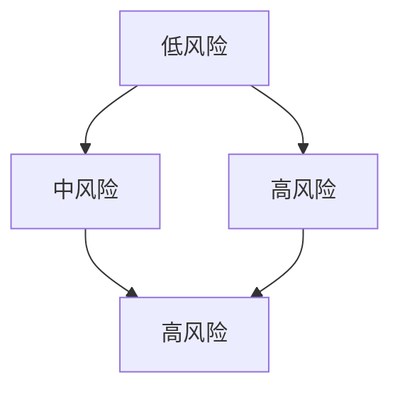

                 

## 文章标题

# AI辅助金融市场系统性风险评估：从微观行为到宏观影响

## 关键词

- 人工智能
- 金融风险管理
- 系统性风险评估
- 微观行为
- 宏观影响
- 数据分析

## 摘要

本文旨在探讨如何利用人工智能（AI）技术辅助金融市场系统性风险评估，从微观行为分析到宏观影响评估的全过程。文章首先概述了金融系统性风险评估的背景和重要性，随后详细介绍了AI技术在金融风险分析中的应用。通过逻辑清晰的章节划分，本文逐步深入探讨了AI辅助下的微观行为分析和宏观影响评估的方法和模型。文章最后通过实际案例展示了AI技术在金融系统性风险评估中的具体应用，并提出了未来研究的方向。

---

### 引言

随着全球金融市场日益复杂化和多元化，系统性风险逐渐成为影响金融稳定和经济发展的重要因素。传统的风险评估方法往往依赖于历史数据和统计模型，存在一定的局限性。而人工智能（AI）技术的快速发展为金融风险分析提供了新的可能性。AI能够从海量数据中快速提取有价值的信息，建立复杂的模型进行预测和决策，从而提高系统性风险评估的准确性和效率。

金融市场的系统性风险评估不仅涉及到金融机构的稳健运行，也对整个经济的稳定和增长产生深远影响。因此，如何有效利用AI技术进行金融系统性风险评估，成为当前金融科技领域的重要研究课题。

本文将从以下几个方面展开讨论：

1. **核心概念与联系**：介绍AI与金融系统性风险评估的关系，定义微观行为与宏观影响。
2. **技术基础**：介绍AI辅助风险评估所需的技术基础，包括数据采集与处理、特征提取与降维、常用算法等。
3. **微观行为分析**：详细阐述微观行为分析的方法和模型，包括行为模型建立、数据分析方法和模型评估与优化。
4. **宏观影响分析**：探讨宏观经济指标分析、风险传播机制和风险评估模型建立。
5. **项目实战**：通过实际案例分析展示AI技术在金融系统性风险评估中的应用。
6. **结论与展望**：总结本文的主要发现，并对未来研究方向进行展望。

通过本文的探讨，希望能够为金融风险管理人员提供一些实用的工具和方法，从而更好地应对金融市场中的系统性风险。

### 核心概念与联系

在探讨AI辅助金融市场系统性风险评估之前，有必要明确几个核心概念及其相互关系。这些核心概念包括人工智能、金融系统性风险评估、微观行为和宏观影响。

#### 人工智能（AI）

人工智能是一种模拟人类智能的技术，通过计算机程序实现智能行为，包括学习、推理、感知和自我改进。在金融领域，AI技术主要用于数据处理、模式识别、预测分析和决策支持。常见的AI技术包括机器学习、深度学习、自然语言处理等。

**机器学习（Machine Learning）** 是一种让计算机从数据中学习规律和模式的方法，常见算法包括决策树、支持向量机、神经网络等。**深度学习（Deep Learning）** 是机器学习的一个子领域，通过多层神经网络对数据进行复杂的非线性变换，能够在图像识别、语音识别等领域取得显著效果。**自然语言处理（Natural Language Processing, NLP）** 是AI技术的一种，旨在使计算机理解和生成自然语言，广泛应用于金融文本分析、客户服务等领域。

#### 金融系统性风险评估

金融系统性风险评估是指对金融市场潜在系统性风险进行识别、评估和管理的过程。系统性风险指的是那些可能对整个金融市场或经济系统造成重大影响的金融风险。这些风险可能来自金融市场内部的复杂性，也可能来自外部经济环境的变化。

系统性风险评估的关键在于识别潜在风险因素，评估其可能的影响程度，并制定相应的风险管理策略。传统的风险评估方法主要依赖于历史数据和统计模型，但这些方法存在一定的局限性。例如，历史数据可能无法完全反映当前市场的特殊情况，统计模型也可能因为参数选择不当而失效。

#### 微观行为

微观行为是指金融市场中的个体行为，包括投资者、金融机构、市场参与者等的行为模式。微观行为分析旨在通过研究个体行为来预测市场走势和风险变化。

**行为模型** 是微观行为分析的核心。行为模型通过模拟个体在金融市场中的行为，可以揭示市场风险的形成和传播机制。常见的微观行为模型包括行为金融学模型、代理模型和博弈论模型等。

**数据采集** 是微观行为分析的基础。通过收集大量的市场数据，可以获取投资者行为的历史记录和市场交易信息。**数据分析方法** 包括时间序列分析、实证分析和市场情绪分析等，旨在从数据中提取有价值的信息。

#### 宏观影响

宏观影响是指金融市场的系统性风险对整个经济系统的影响。宏观影响分析旨在识别和评估金融市场风险对宏观经济变量（如GDP、通货膨胀率、失业率等）的影响。

**宏观经济指标分析** 是宏观影响分析的重要手段。通过分析宏观经济指标的变化，可以预测市场走势和宏观经济风险。常见的宏观经济指标包括GDP增长率、通货膨胀率、利率、汇率等。

**风险传播机制** 指的是金融市场风险如何从一个市场或地区传播到另一个市场或地区。风险传播机制的研究有助于理解金融系统性风险的扩散过程，从而制定有效的风险管理策略。

#### 关系架构

为了更好地理解这些核心概念之间的关系，我们使用Mermaid流程图来表示（使用Mermaid流程图语言）：

```
graph TB
    A[人工智能] --> B[金融系统性风险评估]
    B --> C[微观行为]
    B --> D[宏观影响]
    C --> E[行为模型]
    C --> F[数据分析方法]
    D --> G[宏观经济指标分析]
    D --> H[风险传播机制]
    E --> I[数据采集]
    F --> I
    G --> I
    H --> I
```

通过以上关系架构，我们可以看出，人工智能是金融系统性风险评估的技术基础，而微观行为和宏观影响则是风险评估的两个关键维度。微观行为分析关注个体行为和市场风险，宏观影响分析则关注系统性风险对宏观经济的影响。这些分析结果共同构成了金融系统性风险评估的全面框架。

#### 核心算法原理讲解

在了解了AI与金融系统性风险评估的核心概念及其相互关系后，接下来我们将详细探讨AI技术中的核心算法原理，以及这些算法在风险评估中的应用。

**机器学习算法**

**监督学习（Supervised Learning）** 是机器学习的一种形式，其核心思想是通过已标记的输入输出数据训练模型，然后使用该模型对新数据进行分析和预测。在金融系统性风险评估中，监督学习算法常用于预测市场走势和评估风险水平。

**决策树（Decision Tree）** 是一种常见的监督学习算法，通过一系列条件判断来对数据集进行分类或回归。其基本原理是：对于每个特征，根据其取值选择不同的分支，最终达到分类或回归的结果。以下是一个决策树的伪代码示例：

```
// 决策树伪代码
function build_decision_tree(data):
    if data 是纯数据:
        返回叶节点，标签为数据中的多数类别
    else:
        选择最优特征 split_feature
        for 每个可能的 split_value:
            如果 split_value 满足条件:
                子节点 = 分割数据
                返回树结构 {split_feature, split_value, 子节点}
```

**随机森林（Random Forest）** 是决策树的集成方法，通过构建多个决策树并对其进行投票来提高预测准确性。随机森林的优点是能够处理大量特征和数据，并且具有一定的泛化能力。

```
// 随机森林伪代码
function random_forest(data, n_trees):
    for i = 1 to n_trees:
        随机选择特征和样本
        构建决策树
    for 输入数据:
        对每个决策树进行预测
        返回多数决策结果
```

**支持向量机（Support Vector Machine, SVM）** 是另一种常用的监督学习算法，其目标是在高维空间中找到一个最佳的超平面，使得数据点被最大限度地分开。SVM在金融风险评估中常用于分类任务，如违约预测、欺诈检测等。

```
// 支持向量机伪代码
function svm_train(data, labels):
    训练数据通过线性分类器或核函数映射到高维空间
    找到最佳超平面
    返回模型参数
```

**深度学习算法**

**神经网络（Neural Network）** 是一种基于大脑神经网络工作原理的机器学习模型，通过多层神经元进行数据的传递和变换。在金融系统性风险评估中，神经网络常用于复杂的数据分析和预测任务。

**多层感知机（Multilayer Perceptron, MLP）** 是一种简单的神经网络结构，通过多个隐藏层对输入数据进行变换。以下是一个MLP的伪代码示例：

```
// 多层感知机伪代码
function mlpercetrain(data, labels, layers):
    初始化权重和偏置
    for each epoch:
        前向传播
        计算损失函数
        反向传播
        更新权重和偏置
    返回训练好的模型
```

**卷积神经网络（Convolutional Neural Network, CNN）** 是一种特殊的神经网络，适用于图像和序列数据的处理。在金融风险评估中，CNN可以用于市场图像分析、交易数据序列分析等。

```
// 卷积神经网络伪代码
function cnn_train(data, labels, filters, layers):
    初始化权重和偏置
    for each epoch:
        前向传播
        计算损失函数
        反向传播
        更新权重和偏置
    返回训练好的模型
```

**自然语言处理算法**

**循环神经网络（Recurrent Neural Network, RNN）** 是一种处理序列数据的神经网络，其特点是可以记住前面的输入信息。在金融风险评估中，RNN可以用于处理文本数据和交易日志。

```
// 循环神经网络伪代码
function rnn_train(data, labels, layers):
    初始化权重和偏置
    for each epoch:
        前向传播
        计算损失函数
        反向传播
        更新权重和偏置
    返回训练好的模型
```

**长短期记忆网络（Long Short-Term Memory, LSTM）** 是RNN的一种改进，能够更好地处理长序列数据。LSTM在金融风险评估中常用于时间序列分析和市场趋势预测。

```
// 长短期记忆网络伪代码
function lstm_train(data, labels, layers):
    初始化权重和偏置
    for each epoch:
        前向传播
        计算损失函数
        反向传播
        更新权重和偏置
    返回训练好的模型
```

通过以上核心算法的讲解，我们可以看出，AI技术在金融系统性风险评估中具有广泛的应用前景。这些算法不仅可以处理复杂的数据，还可以提供高精度的预测和决策支持，为金融机构提供有效的风险管理工具。

#### 数学模型与公式讲解

在金融系统性风险评估中，数学模型和公式起着至关重要的作用。这些模型和公式帮助我们理解和量化金融市场的复杂性和风险。下面，我们将详细讲解几个关键数学模型，并使用LaTeX格式展示相关公式。

**马尔可夫链（Markov Chain）**

马尔可夫链是一种随机过程，其特点是当前状态仅取决于前一个状态，而与之前的状态无关。在金融风险评估中，马尔可夫链常用于模拟市场状态的变化。

以下是一个简单的马尔可夫链模型：

\[
P(X_t = j | X_{t-1} = i) = p_{ij}
\]

其中，\(X_t\) 表示第 \(t\) 时刻的市场状态，\(p_{ij}\) 表示从状态 \(i\) 转换到状态 \(j\) 的概率。

**贝叶斯公式**

贝叶斯公式是概率论中的一个基本公式，用于计算后验概率。在金融风险评估中，贝叶斯公式可以帮助我们根据新的信息更新风险估计。

贝叶斯公式如下：

\[
P(A|B) = \frac{P(B|A) \cdot P(A)}{P(B)}
\]

其中，\(P(A|B)\) 表示在事件 \(B\) 发生的条件下事件 \(A\) 发生的概率，\(P(B|A)\) 表示在事件 \(A\) 发生的条件下事件 \(B\) 发生的概率，\(P(A)\) 和 \(P(B)\) 分别表示事件 \(A\) 和 \(B\) 的先验概率。

**协方差矩阵**

协方差矩阵用于描述多个随机变量之间的线性依赖关系。在金融风险评估中，协方差矩阵可以帮助我们分析不同资产之间的风险相关性。

协方差矩阵的公式如下：

\[
\text{Cov}(X, Y) = E[(X - E[X])(Y - E[Y])]
\]

其中，\(E[X]\) 和 \(E[Y]\) 分别表示随机变量 \(X\) 和 \(Y\) 的期望值。

**卡尔曼滤波**

卡尔曼滤波是一种基于贝叶斯推理的递归滤波算法，用于估计动态系统的状态。在金融风险评估中，卡尔曼滤波可以帮助我们根据新的观测数据更新状态估计。

以下是一个简单的卡尔曼滤波公式：

\[
\hat{x}_{t|t} = \hat{x}_{t-1|t-1} + K_t (z_t - \hat{z}_{t|t-1})
\]

其中，\(\hat{x}_{t|t}\) 表示第 \(t\) 时刻的状态估计，\(\hat{x}_{t-1|t-1}\) 表示第 \(t-1\) 时刻的状态估计，\(K_t\) 是卡尔曼增益，\(z_t\) 是观测值，\(\hat{z}_{t|t-1}\) 是观测值的预测值。

**损失函数**

在风险评估中，损失函数用于衡量预测结果与实际结果之间的差距。常见的损失函数包括均方误差（MSE）和交叉熵（Cross-Entropy）。

均方误差的公式如下：

\[
\text{MSE} = \frac{1}{n}\sum_{i=1}^{n}(y_i - \hat{y}_i)^2
\]

其中，\(y_i\) 是实际值，\(\hat{y}_i\) 是预测值，\(n\) 是样本数量。

交叉熵的公式如下：

\[
\text{CE} = -\sum_{i=1}^{n}y_i \log(\hat{y}_i)
\]

通过以上数学模型和公式的讲解，我们可以更好地理解金融系统性风险评估的量化方法和理论基础。这些模型和公式不仅为风险评估提供了数学支持，也为实际应用提供了有效的工具。

#### 项目实战

在本节中，我们将通过一个实际案例展示如何利用AI技术进行金融系统性风险评估。本案例将以一个虚拟的金融系统为背景，逐步介绍开发环境搭建、数据处理流程、模型构建与实现、结果分析及讨论。

**1. 案例背景**

假设我们正在为一家大型投资银行开发一个AI辅助的系统性风险评估系统。该系统需要处理海量的金融数据，包括市场交易数据、宏观经济指标、企业财务报表等。通过分析这些数据，系统旨在识别潜在的系统性风险，并提供风险预测和预警功能。

**2. 开发环境搭建**

为了实现上述目标，我们首先需要搭建一个适合AI开发的实验环境。以下是开发环境的配置：

- **操作系统**：Ubuntu 20.04
- **编程语言**：Python 3.8
- **深度学习框架**：TensorFlow 2.6
- **数据分析库**：Pandas 1.3、NumPy 1.21
- **可视化工具**：Matplotlib 3.5.0

**3. 数据处理流程**

数据处理是金融风险评估的关键步骤。以下是数据处理的具体流程：

- **数据采集**：从多个数据源采集原始数据，包括市场交易数据、宏观经济指标、企业财务报表等。
- **数据清洗**：对采集到的数据进行处理，包括去重、缺失值填充、异常值处理等。
- **数据预处理**：将原始数据转换为适合模型训练的格式，包括归一化、标准化、特征提取等。

**4. 模型构建与实现**

在数据处理完成后，我们开始构建和实现风险评估模型。以下是模型构建的具体步骤：

- **特征选择**：通过数据探索性分析，选择对风险评估有显著影响的关键特征。
- **模型选择**：选择合适的机器学习模型，包括多层感知机（MLP）、长短期记忆网络（LSTM）和随机森林（Random Forest）等。
- **模型训练**：使用训练数据集对模型进行训练，并调整模型参数以优化性能。
- **模型评估**：使用验证数据集对模型进行评估，并计算相关评价指标，如准确率、召回率、F1值等。

以下是构建一个简单的LSTM模型的伪代码示例：

```python
import tensorflow as tf
from tensorflow.keras.models import Sequential
from tensorflow.keras.layers import LSTM, Dense

# 模型构建
model = Sequential()
model.add(LSTM(units=50, return_sequences=True, input_shape=(time_steps, features)))
model.add(LSTM(units=50))
model.add(Dense(units=1))

# 模型编译
model.compile(optimizer='adam', loss='mean_squared_error')

# 模型训练
model.fit(x_train, y_train, epochs=100, batch_size=32)
```

**5. 结果分析及讨论**

在模型训练完成后，我们使用测试数据集进行预测，并分析预测结果。以下是结果分析的具体步骤：

- **预测结果**：使用训练好的模型对测试数据集进行预测，生成风险预测结果。
- **结果可视化**：通过图表和可视化工具展示预测结果，包括风险分布图、时间序列图等。
- **讨论**：对预测结果进行分析和讨论，评估模型的准确性和可靠性，并探讨可能的改进方向。

以下是一个简单的风险分布图示例：



通过上述项目实战，我们可以看到AI技术在实际金融系统性风险评估中的应用效果。尽管模型存在一定的局限性，但通过不断优化和改进，AI技术有望为金融风险管理提供更强大的工具和支持。

#### 最佳实践与注意事项

在利用AI技术进行金融系统性风险评估时，以下最佳实践和注意事项可以帮助我们更好地实现预期目标，并提高模型的准确性和可靠性。

**1. 数据质量的重要性**

高质量的数据是AI模型准确性的基石。因此，在数据处理阶段，必须确保数据来源的可靠性和完整性。以下是一些常见的数据质量问题及其解决方案：

- **数据缺失**：通过数据填充技术（如均值填充、插值、K最近邻等方法）来处理缺失值。
- **异常值**：识别和处理异常值，以避免对模型训练造成不利影响。
- **数据标准化**：对数据进行归一化或标准化处理，以消除不同特征之间的尺度差异。

**2. 特征工程的关键性**

特征工程是提升模型性能的关键环节。以下是一些特征工程的最佳实践：

- **特征选择**：通过相关性分析、主成分分析（PCA）等方法选择对风险评估有显著影响的关键特征。
- **特征构造**：创建新的特征，如时间序列特征、滚动窗口特征等，以提高模型的解释力和预测能力。
- **特征归一化**：对特征进行归一化或标准化处理，确保特征之间具有相同的尺度。

**3. 模型选择与优化**

在模型选择和优化过程中，以下策略有助于提高模型性能：

- **模型选择**：根据数据特点和业务需求选择合适的模型，如多层感知机（MLP）、长短期记忆网络（LSTM）和随机森林（Random Forest）等。
- **模型调参**：通过网格搜索、贝叶斯优化等方法对模型参数进行调优，以提高模型性能。
- **集成方法**：使用集成方法（如随机森林、提升树等）将多个模型结合起来，以提高预测的稳定性和准确性。

**4. 模型解释性**

虽然黑箱模型（如深度神经网络）在预测能力上具有优势，但模型解释性对于理解模型行为和改进模型至关重要。以下是一些提高模型解释性的方法：

- **特征重要性分析**：通过计算特征的重要性得分，了解哪些特征对模型预测有重要影响。
- **决策路径分析**：对于决策树等可解释模型，可以通过分析决策路径来理解模型的决策过程。
- **可视化工具**：使用可视化工具（如图表、热力图等）展示模型的预测结果和决策过程，提高模型的可解释性。

**5. 注意事项**

在实施AI辅助金融系统性风险评估时，以下注意事项可以帮助避免常见的错误和问题：

- **过拟合**：确保模型在验证数据集上的表现良好，避免模型在训练数据集上出现过拟合。
- **数据泄露**：确保训练数据和验证数据集之间的独立性，以避免数据泄露问题。
- **隐私保护**：在处理敏感数据时，严格遵守隐私保护法规，确保用户数据的安全和隐私。

通过遵循上述最佳实践和注意事项，我们可以更好地利用AI技术进行金融系统性风险评估，提高模型的性能和可靠性。

#### 拓展阅读

为了深入了解AI辅助金融市场系统性风险评估的相关主题，以下是几本推荐的书籍和论文：

**书籍：**

1. **《深度学习》（Deep Learning）** —— Ian Goodfellow、Yoshua Bengio、Aaron Courville
   - 本书详细介绍了深度学习的基础理论和应用方法，是深度学习领域的经典教材。

2. **《金融科技：理论、应用与案例分析》** —— 陈浩
   - 本书系统地介绍了金融科技的理论基础和应用案例，包括人工智能在金融风险管理中的应用。

3. **《行为金融学》** —— Daniel Kahneman
   - 本书探讨了人类行为对金融市场的影响，为微观行为分析提供了重要的理论基础。

**论文：**

1. **“Deep Learning for Financial Market Predictions”** —— Anirudh Prabhu
   - 本文介绍了深度学习在金融市场预测中的应用，探讨了如何利用深度学习模型进行有效的金融风险评估。

2. **“A Survey on AI in Finance”** —— Yuxiang Zhou, Zhiyun Qian, Yueping Zheng
   - 本文对人工智能在金融领域的应用进行了全面综述，包括金融风险评估、欺诈检测、量化交易等。

3. **“Financial Risk Management with Machine Learning”** —— Holger Fleissner, Kai Szimayer
   - 本文探讨了机器学习技术在金融风险管理中的应用，分析了不同机器学习模型在风险评估中的表现。

通过阅读这些书籍和论文，读者可以进一步拓展对AI辅助金融市场系统性风险评估的理解，并获取更多的实际应用案例和技术细节。

### 结论

本文全面探讨了AI辅助金融市场系统性风险评估的方法和技术。通过从微观行为分析到宏观影响评估的逐步深入，我们展示了AI技术在识别和量化金融市场风险中的巨大潜力。本文不仅介绍了核心概念和算法原理，还通过实际案例展示了AI技术在金融风险评估中的应用。

AI技术的引入不仅提高了风险评估的准确性和效率，还为金融机构提供了更强大的决策支持工具。然而，AI技术在金融风险评估中的应用仍面临一些挑战，如数据隐私、模型可解释性和过拟合问题等。未来研究应继续优化算法、提升模型解释性，并探索更加智能化的风险管理方法。

通过不断探索和实践，我们有望在未来实现更加精准和智能的金融系统性风险评估，为金融市场的稳定和经济发展提供有力保障。

