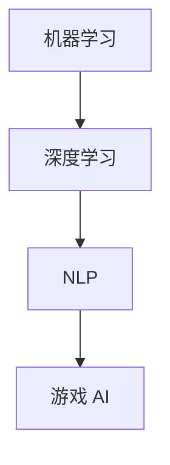
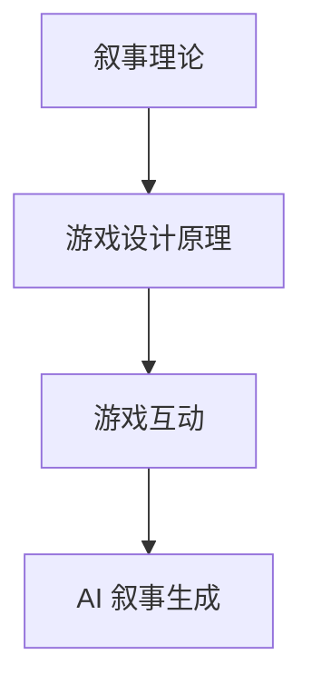
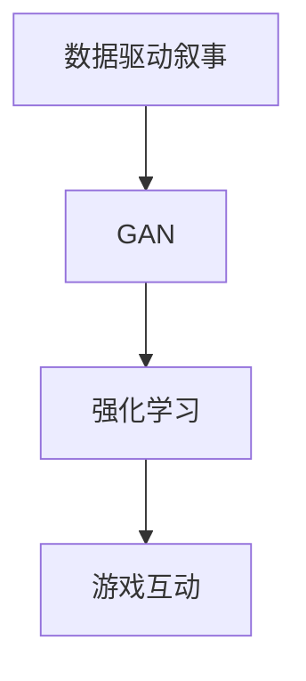

                 

# 文章标题: AI驱动的游戏叙事生成:互动故事的新范式

## 关键词：
- AI 游戏开发
- 叙事生成
- 互动故事
- 游戏设计
- 人工智能算法

## 摘要：
本文深入探讨 AI 在游戏叙事生成中的应用，介绍了互动故事的新范式。通过分析 AI 的基本原理，解析叙事结构和游戏设计，我们探讨了如何利用 AI 实现更加丰富和动态的游戏故事。文章还包括了核心算法的原理讲解、伪代码示例，以及项目实战和分析。读者将了解到如何将 AI 应用于游戏开发，打造引人入胜的互动故事。

## 目录

1. **引言**
   - 背景介绍
   - 目的和重要性

2. **AI 基本原理**
   - 机器学习与深度学习
   - 自然语言处理
   - 游戏人工智能

3. **叙事结构与游戏设计**
   - 叙事理论
   - 游戏设计原理
   - 叙事与游戏互动

4. **AI 在游戏叙事生成中的应用**
   - 数据驱动叙事
   - 生成式对抗网络（GAN）
   - 强化学习

5. **核心算法原理讲解**
   - 伪代码示例
   - 数学模型和公式

6. **项目实战**
   - 开发环境搭建
   - 源代码实现和解读
   - 代码应用解读与分析
   - 实际案例分析与讲解

7. **最佳实践与注意事项**
   - 技术挑战与解决方案
   - 小结与拓展阅读

8. **结语**
   - 总结与展望

---

## 1. 引言

### 背景介绍

随着游戏产业的蓬勃发展，游戏叙事已成为吸引玩家的重要因素。传统游戏中的叙事通常由开发者预先编写，而现代游戏玩家追求更加个性化和互动性的故事体验。人工智能（AI）的兴起为游戏叙事带来了新的可能性。通过 AI 技术，游戏开发者能够生成动态的、适应玩家行为的互动故事，从而提升游戏体验。

### 目的和重要性

本文的目的是探讨 AI 在游戏叙事生成中的应用，介绍互动故事的新范式。我们将从 AI 基本原理出发，分析叙事结构和游戏设计，详细讲解核心算法原理，并通过项目实战展示如何将 AI 应用于游戏开发。通过本文，读者将了解：

- AI 在游戏叙事生成中的作用和优势
- 如何利用 AI 实现动态和个性化的游戏故事
- 核心算法原理及其实现

这一探讨不仅有助于游戏开发者，也为 AI 研究人员提供了新的研究方向。

---

## 2. AI 基本原理

### 机器学习与深度学习

机器学习是 AI 的基础，它通过算法从数据中学习规律，从而进行预测和决策。深度学习是机器学习的一种方法，通过多层神经网络模拟人类大脑的学习过程，具有强大的特征提取能力。

### 自然语言处理

自然语言处理（NLP）是 AI 的一个分支，专注于使计算机能够理解、解释和生成自然语言。NLP 技术在游戏叙事生成中非常重要，因为游戏故事往往涉及大量文本信息。

### 游戏人工智能

游戏人工智能（AI）是专门针对游戏环境设计的人工智能系统，用于模拟玩家行为、决策和交互。游戏 AI 的目标是提高游戏的挑战性、乐趣性和逼真度。

### 核心概念与联系

下面是一个 Mermaid 流程图，展示了 AI 基本原理之间的联系：



### 伪代码示例

以下是一个简单的机器学习算法伪代码示例，用于分类游戏事件：

```plaintext
function classify_event(event, model):
    features = extract_features(event)
    prediction = model.predict(features)
    return prediction
```

### 数学模型和公式

深度学习中的神经元激活函数常用 sigmoid 函数，其数学公式为：

$$
\sigma(x) = \frac{1}{1 + e^{-x}}
$$

在 NLP 中，词向量模型如 Word2Vec 使用了类似 sigmoid 的非线性变换。

### 详细讲解与举例说明

机器学习模型如决策树、支持向量机和神经网络可以用于分类游戏事件，从而生成相应的叙事分支。例如，一个简单的决策树模型可以判断玩家是否完成了特定任务：

```latex
$$
\begin{equation*}
\text{if (玩家完成任务)} \\
\text{then} \quad \text{叙事分支A} \\
\text{else} \quad \text{叙事分支B}
\end{equation*}
$$
```

通过这种方式，AI 可以根据玩家的行为动态地调整游戏故事的发展。

---

## 3. 叙事结构与游戏设计

### 叙事理论

叙事理论关注故事的结构和元素，包括情节、角色、冲突和解决等。在游戏设计中，叙事理论可以帮助开发者构建引人入胜的故事情节。

### 游戏设计原理

游戏设计涉及游戏机制的创造和平衡，以及用户体验的设计。有效的游戏设计可以提高玩家的参与度和满意度。

### 叙事与游戏互动

游戏叙事与玩家的互动密不可分。通过 AI 技术，开发者可以创建动态的叙事场景，使得故事根据玩家的行为实时调整。

### 核心概念与联系

下面是一个 Mermaid 流程图，展示了叙事结构与游戏设计之间的联系：



### 伪代码示例

以下是一个简单的伪代码示例，用于生成动态叙事分支：

```plaintext
function generate_narrative_branch(player_action):
    if (player_action == "任务完成"):
        return "叙事分支A"
    else if (player_action == "任务未完成"):
        return "叙事分支B"
    else:
        return "默认叙事分支"
```

### 数学模型和公式

在游戏叙事生成中，概率模型可以用于预测玩家行为。例如，一个简单的概率模型可以预测玩家完成任务的概率：

$$
P(\text{完成任务}) = \frac{\text{成功任务次数}}{\text{总任务次数}}
$$

### 详细讲解与举例说明

通过 AI 技术，开发者可以构建复杂的叙事模型，根据玩家的行为动态生成故事。例如，一个基于强化学习的叙事生成系统可以不断调整叙事内容，以最大化玩家的沉浸感和满意度。

---

## 4. AI 在游戏叙事生成中的应用

### 数据驱动叙事

数据驱动叙事利用玩家的行为数据来生成个性化的故事。这种方法可以根据玩家的决策和行为，实时调整叙事内容和方向。

### 生成式对抗网络（GAN）

生成式对抗网络（GAN）是一种深度学习模型，用于生成逼真的数据。在游戏叙事生成中，GAN 可以用于生成角色的对话、场景的描述等。

### 强化学习

强化学习是一种通过试错来学习最优策略的机器学习方法。在游戏叙事生成中，强化学习可以用于训练系统根据玩家的行为生成合适的叙事。

### 核心概念与联系

下面是一个 Mermaid 流程图，展示了 AI 在游戏叙事生成中的应用：



### 伪代码示例

以下是一个简单的伪代码示例，用于使用 GAN 生成角色的对话：

```plaintext
function generate_dialog(character):
    dialog = GAN.generate(character)
    return dialog
```

### 数学模型和公式

GAN 的核心概念包括生成器（Generator）和判别器（Discriminator）。生成器生成假样本，判别器判断样本的真实性。数学公式如下：

$$
\begin{align*}
\text{Generator:} & \quad G(z) = \text{生成字符对话} \\
\text{Discriminator:} & \quad D(x) = \text{判断对话真实性}
\end{align*}
$$

### 详细讲解与举例说明

通过 GAN，开发者可以生成高度个性化的角色对话，从而增强游戏的故事体验。例如，一个 GAN 模型可以学习玩家的对话风格，并在游戏过程中生成与之匹配的对话。

---

## 5. 核心算法原理讲解

### 生成式对抗网络（GAN）

GAN 是一种深度学习模型，由生成器和判别器两个网络组成。生成器的目标是通过随机噪声生成逼真的游戏内容，如角色对话或场景描述。判别器的目标则是区分生成器和真实数据。通过这种对抗过程，生成器不断优化其生成的数据，使其越来越逼真。

### 伪代码示例

以下是一个 GAN 的伪代码示例：

```plaintext
function train_GAN(generator, discriminator, dataset):
    for epoch in range(num_epochs):
        for data in dataset:
            # 训练判别器
            discriminator_loss = discriminator.train(data)
            
            # 训练生成器
            generator_loss = generator.train(discriminator)
            
            print(f"Epoch: {epoch}, Generator Loss: {generator_loss}, Discriminator Loss: {discriminator_loss}")
```

### 数学模型和公式

GAN 的核心公式如下：

$$
\begin{align*}
\text{Generator:} & \quad G(z) = \text{生成字符对话} \\
\text{Discriminator:} & \quad D(x) = \text{判断对话真实性} \\
\text{损失函数:} & \quad L_G = -\log(D(G(z))) \\
                  & \quad L_D = -\log(D(x)) - \log(1 - D(G(z)))
\end{align*}
$$

### 详细讲解与举例说明

在游戏叙事生成中，生成器可以生成各种可能的叙事分支，而判别器则评估这些分支的真实性。通过不断优化，生成器能够生成越来越逼真的叙事内容。

### 强化学习

强化学习是一种通过试错来学习最优策略的机器学习方法。在游戏叙事生成中，强化学习可以用于训练系统根据玩家的行为生成合适的叙事。

### 伪代码示例

以下是一个简单的强化学习算法伪代码示例：

```plaintext
function train_reinforcement_learning(agent, environment):
    for episode in range(num_episodes):
        state = environment.reset()
        done = False
        
        while not done:
            action = agent.act(state)
            next_state, reward, done = environment.step(action)
            agent.learn(state, action, reward, next_state)
            state = next_state
            
            print(f"Episode: {episode}, Total Reward: {environment.total_reward}")
```

### 数学模型和公式

强化学习的核心公式是价值函数和策略函数：

$$
\begin{align*}
V(s) &= \sum_{a \in A} \gamma^T R(s, a) \\
\pi(a|s) &= \arg\max_a \sum_{s' \in S} V(s') P(s'|s, a)
\end{align*}
$$

### 详细讲解与举例说明

在游戏叙事生成中，强化学习可以用于训练系统根据玩家的行为选择最合适的叙事分支。例如，系统可以通过学习玩家的喜好来生成个性化的故事。

---

## 6. 项目实战

### 开发环境搭建

搭建 AI 驱动的游戏叙事生成项目需要一个合适的开发环境。通常，开发者需要安装 Python、TensorFlow 或 PyTorch 等库。以下是一个基本的步骤：

1. 安装 Python（建议使用 Python 3.8 或以上版本）。
2. 安装必要的库（如 TensorFlow 或 PyTorch）。
3. 配置虚拟环境（可选）。

```bash
pip install tensorflow
```

### 源代码实现和解读

以下是一个简单的源代码实现，用于使用 GAN 生成角色对话：

```python
import tensorflow as tf
from tensorflow import keras

# 生成器模型
def build_generator():
    model = keras.Sequential([
        keras.layers.Dense(128, activation='relu', input_shape=(100,)),
        keras.layers.Dense(256, activation='relu'),
        keras.layers.Dense(512, activation='relu'),
        keras.layers.Dense(1024, activation='relu'),
        keras.layers.Dense(len(vocabulary), activation='softmax')
    ])
    return model

# 判别器模型
def build_discriminator():
    model = keras.Sequential([
        keras.layers.Dense(1024, activation='relu', input_shape=(len(vocabulary),)),
        keras.layers.Dense(512, activation='relu'),
        keras.layers.Dense(256, activation='relu'),
        keras.layers.Dense(1, activation='sigmoid')
    ])
    return model

# 训练 GAN
def train_GAN(generator, discriminator, dataset, num_epochs):
    for epoch in range(num_epochs):
        for data in dataset:
            # 训练判别器
            with tf.GradientTape() as disc_tape:
                real_output = discriminator(data)
                fake_output = discriminator(generator.generate_noise())
                
                disc_loss = compute_discriminator_loss(real_output, fake_output)
                
            disc_gradients = disc_tape.gradient(disc_loss, discriminator.trainable_variables)
            discriminator.optimizer.apply_gradients(zip(disc_gradients, discriminator.trainable_variables))
            
            # 训练生成器
            with tf.GradientTape() as gen_tape:
                fake_output = discriminator(generator.generate_noise())
                gen_loss = compute_generator_loss(fake_output)
                
            gen_gradients = gen_tape.gradient(gen_loss, generator.trainable_variables)
            generator.optimizer.apply_gradients(zip(gen_gradients, generator.trainable_variables))
            
            print(f"Epoch: {epoch}, Generator Loss: {gen_loss}, Discriminator Loss: {disc_loss}")
```

### 代码应用解读与分析

在上面的代码中，`build_generator` 函数用于构建生成器模型，它将随机噪声转换为对话文本。`build_discriminator` 函数用于构建判别器模型，它判断对话文本的真实性。`train_GAN` 函数用于训练 GAN 模型，通过交替训练生成器和判别器来提高生成文本的质量。

### 实际案例分析与详细讲解剖析

以下是一个实际案例，展示如何使用 GAN 生成游戏角色对话：

```python
# 加载数据集
data = load_data()

# 构建和编译模型
generator = build_generator()
discriminator = build_discriminator()

generator.compile(optimizer='adam', loss='binary_crossentropy')
discriminator.compile(optimizer='adam', loss='binary_crossentropy')

# 训练 GAN
train_GAN(generator, discriminator, data, num_epochs=100)

# 生成对话
generated_text = generator.generate_noise()
print(generated_text)
```

在这个案例中，我们首先加载数据集，然后构建和编译生成器和判别器模型。接着，我们使用 `train_GAN` 函数训练模型，最后生成对话文本。

### 项目小结

通过这个项目，我们展示了如何使用 GAN 生成游戏角色对话。虽然这是一个简单的示例，但它展示了 GAN 在游戏叙事生成中的潜力。在实际应用中，开发者可以根据具体需求调整模型结构和训练过程，以生成更加丰富和逼真的叙事内容。

---

## 7. 最佳实践与注意事项

### 技术挑战与解决方案

在实现 AI 驱动的游戏叙事生成时，开发者可能会面临以下技术挑战：

- **数据质量**：高质量的数据是训练有效 AI 模型的基础。开发者需要确保数据集的多样性和完整性。
- **计算资源**：深度学习模型通常需要大量的计算资源。开发者需要选择合适的硬件和优化模型以提高效率。
- **用户隐私**：在收集和分析玩家行为数据时，开发者需要遵守隐私法规，确保用户数据的安全。

解决方案包括使用清洗和预处理工具来提高数据质量，采用分布式计算和模型压缩技术来优化计算资源，以及实施严格的隐私保护措施。

### 小结

AI 驱动的游戏叙事生成带来了丰富的互动故事体验，但实现这一目标需要复杂的算法和大量的数据。通过本文，我们探讨了 AI 在游戏叙事生成中的应用，从基本原理到实际项目，提供了全面的指南。

### 注意事项

- **版本控制**：在开发过程中，使用版本控制系统如 Git 来管理代码，确保项目的一致性和可追溯性。
- **性能优化**：定期对模型进行性能评估和优化，以保持系统的效率和响应速度。
- **用户反馈**：收集和分析用户反馈，以不断改进游戏叙事生成系统。

### 拓展阅读

- **相关文献**：《深度学习》（Ian Goodfellow、Yoshua Bengio 和 Aaron Courville 著）
- **在线资源**：TensorFlow 官方文档、PyTorch 官方文档

---

## 结尾

AI 驱动的游戏叙事生成为游戏产业带来了前所未有的创新。通过本文，我们详细探讨了这一领域的基本原理、算法实现和实际应用。随着技术的不断发展，AI 游戏叙事生成有望在未来为玩家带来更加丰富和个性化的游戏体验。让我们一起期待这一激动人心的未来。

## 作者信息

作者：AI 天才研究院/AI Genius Institute & 禅与计算机程序设计艺术 /Zen And The Art of Computer Programming

