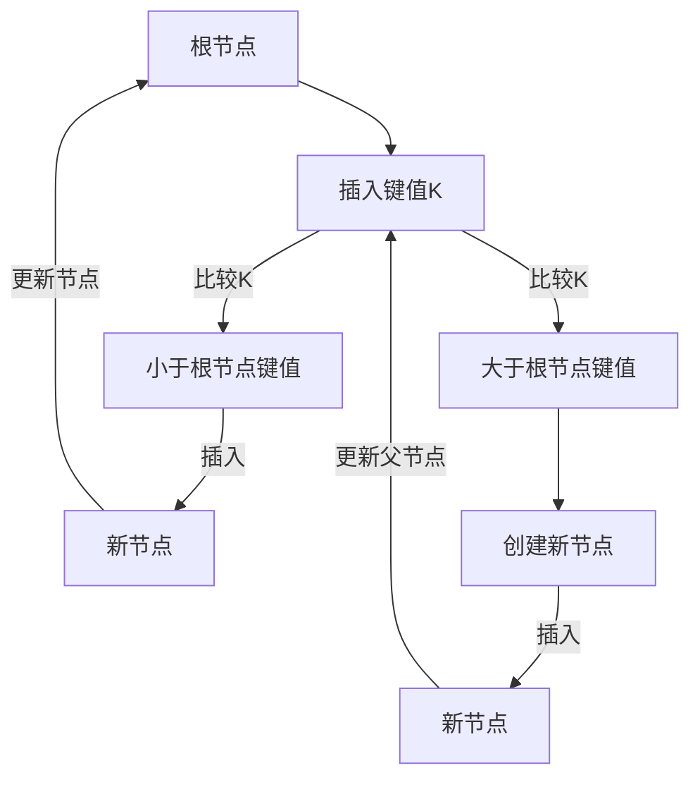
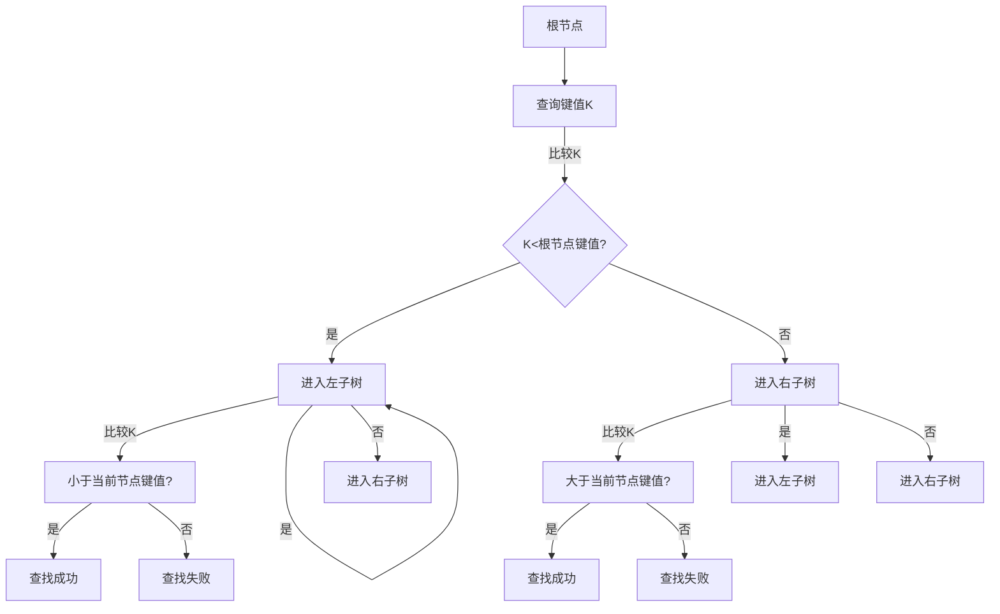
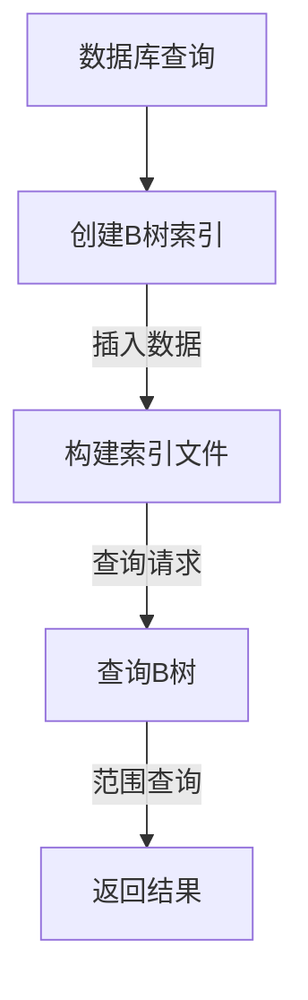
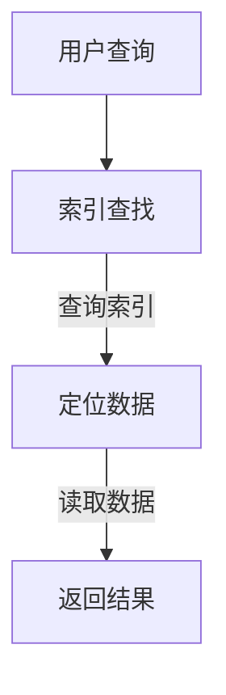
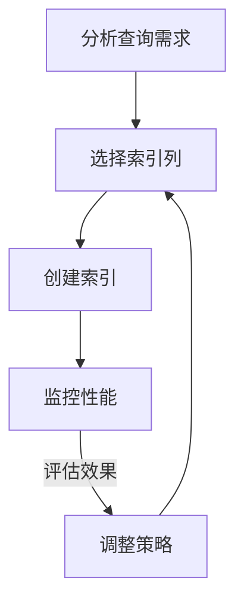

                 

# B树与数据库索引优化

## 摘要

本文旨在深入探讨B树原理及其在数据库索引优化中的应用。通过逐步分析B树的基本概念、特点、操作算法，以及其在数据库中的关系，本文为数据库开发者、管理员和优化工程师提供了系统化的索引优化策略。文章分为五个部分：第一部分介绍B树原理，包括基本概念、特点与优势、操作算法及其与数据库的关系；第二部分解析数据库索引机制，涵盖索引基础、类型、创建与维护策略以及使用策略；第三部分讨论索引优化策略，包括原理、选择与创建优化、性能监控与调优以及维护与优化；第四部分通过实际案例分析展示索引优化在不同场景的应用；最后，第五部分提供相关参考资料和工具，以便读者深入学习和实践。本文的目标是帮助读者理解和掌握B树与数据库索引优化的核心技术和实践方法。

## 目录

1. **B树原理**
   - **第1章：B树的基本概念**
     - 1.1 B树的定义
     - 1.2 B树的节点结构
     - 1.3 B树的性质
     - 1.4 B树与二叉搜索树的比较

   - **第2章：B树的特点与优势**
     - 2.1 B树的平衡特性
     - 2.2 B树的空间利用率
     - 2.3 B树的查找效率
     - 2.4 B树的优势与适用场景

   - **第3章：B树的操作算法**
     - 3.1 B树的插入算法
     - 3.2 B树的删除算法
     - 3.3 B树的查找算法
     - 3.4 B树的平衡算法

   - **第4章：B树与数据库的关系**
     - 4.1 B树在数据库中的应用
     - 4.2 数据库索引与B树
     - 4.3 B树在数据库优化中的作用

2. **数据库索引机制**
   - **第5章：数据库索引基础**
     - 5.1 索引的定义
     - 5.2 索引的作用
     - 5.3 索引的分类
     - 5.4 索引的设计原则

   - **第6章：索引类型**
     - 6.1 B树索引
     - 6.2 哈希索引
     - 6.3 位图索引
     - 6.4 组合索引

   - **第7章：索引的创建与维护**
     - 7.1 索引的创建
     - 7.2 索引的维护
     - 7.3 索引的性能监控
     - 7.4 索引的重构

   - **第8章：索引的使用策略**
     - 8.1 索引的选用原则
     - 8.2 索引的使用技巧
     - 8.3 索引的优化策略
     - 8.4 索引的管理与维护

3. **索引优化策略**
   - **第9章：索引优化原理**
     - 9.1 索引优化的目标
     - 9.2 索引优化的方法
     - 9.3 索引优化策略的选择
     - 9.4 索引优化的效果评估

   - **第10章：索引选择与创建优化**
     - 10.1 索引选择的原则
     - 10.2 索引选择的技巧
     - 10.3 索引创建的优化
     - 10.4 索引创建的误区

   - **第11章：索引性能监控与调优**
     - 11.1 索引性能监控的方法
     - 11.2 索引性能调优的策略
     - 11.3 索引性能调优的实践
     - 11.4 索引性能调优的挑战

   - **第12章：索引维护与优化**
     - 12.1 索引维护的重要性
     - 12.2 索引维护的策略
     - 12.3 索引优化的周期
     - 12.4 索引优化的实施步骤

4. **实际案例分析**
   - **第13章：案例分析1：大型电商数据库索引优化**
     - 13.1 案例背景
     - 13.2 索引优化需求分析
     - 13.3 索引优化方案设计
     - 13.4 索引优化实施与效果评估

   - **第14章：案例分析2：实时数据库索引优化**
     - 14.1 案例背景
     - 14.2 索引优化需求分析
     - 14.3 索引优化方案设计

   - **第15章：案例分析3：分布式数据库索引优化**
     - 15.1 案例背景
     - 15.2 索引优化需求分析
     - 15.3 索引优化方案设计

5. **附录和资源**
   - **第16章：B树与数据库索引优化参考资料**
   - **第17章：数据库索引优化工具与资源**
   - **第18章：常见问题与解答**

## 关键词

- B树
- 数据库索引
- 索引优化
- 插入算法
- 删除算法
- 查找算法
- 数据库性能
- 索引类型
- 索引创建
- 索引维护
- 索引选择
- 索引调优
- 案例分析

## 第一部分：B树原理

### 第1章：B树的基本概念

B树是一种平衡的多路搜索树，它被广泛应用于数据库和操作系统中，以支持高效的键值对存储和检索。B树的基本概念包括节点的定义、树的结构以及树的基本性质。

#### 1.1 B树的定义

B树是一种自平衡树，其中每个节点可以有多个子节点，通常称为阶（t）。B树节点的最大子节点数通常为 `t-1` 个，根节点可以有最少 `t/2-1` 个子节点，非根节点的最小子节点数为 `t/2` 个。每个节点中的键值数量等于其子节点数量减一，且键值按照顺序排列。

B树是一种平衡树，意味着每个节点的子树高度差异不会太大。具体来说，B树的每个节点都会保持以下性质：

- 所有叶子节点都在同一层级。
- 除根节点外，每个节点至少有 `t/2` 个子节点。
- 根节点至少有两个子节点，除非它是叶节点。
- 每个节点的键值都小于其右子节点中的最小键值，大于其左子节点中的最大键值。

#### 1.2 B树的节点结构

B树的节点结构通常包括以下部分：

- **键值数组**：存储节点的键值。
- **子指针数组**：指向节点的子节点。
- **节点信息**：包括节点的阶（t）、当前键值数量等。

以下是B树节点的伪代码表示：

```pseudo
Node {
    keyCount = 0
    keys[] = new Array(t-1)
    children[] = new Array(t)
}
```

#### 1.3 B树的性质

B树的几个关键性质使其成为数据库索引的理想选择：

1. **平衡性**：B树的每个节点都尽可能地保持平衡，这意味着树的高度较低，从而提高了查找效率。
2. **多路搜索**：每个节点可以有多个子节点，这使得每个节点能够存储更多的键值，减少了树的层数。
3. **键值有序**：B树的键值是按照顺序排列的，这有助于快速查找和排序。
4. **自我平衡**：在插入和删除操作中，B树会自动调整，以保持树的平衡。

#### 1.4 B树与二叉搜索树的比较

与二叉搜索树相比，B树具有以下几个显著优势：

1. **高度平衡**：B树通过多路搜索和自我平衡机制保持较低的高度，而二叉搜索树可能会因为插入顺序而导致高度不平衡。
2. **存储效率**：由于每个节点可以有多个子节点，B树能够在较少的节点中存储更多的键值，提高了存储效率。
3. **查找效率**：B树通过减少树的层数来提高查找效率，特别是在大型数据库中。
4. **适应性**：B树适用于不同大小的数据库，而二叉搜索树在大规模数据中可能会变得效率低下。

### Mermaid流程图

下面是B树插入操作的基本流程图：



通过这个流程图，我们可以直观地看到B树如何在插入键值时保持树的平衡和有序。

## 第2章：B树的特点与优势

B树作为一种高效的数据库索引结构，具有许多独特的特点，使其在数据库管理系统中广泛应用。以下是B树的主要特点及其优势：

### 2.1 B树的平衡特性

B树通过自我平衡机制来保持树的平衡。每个节点都尽可能保持满负荷状态，这意味着每个节点的子节点数和键值数量都在一个合理的范围内。这种平衡性使得B树的高度相对较低，从而减少了树的高度差异，提高了查找效率。

- **平衡性提高查找效率**：由于B树的高度较低，查找键值时的比较次数相对较少，从而提高了查询性能。
- **减少存储空间**：较低的树高意味着较少的节点，从而减少了存储空间的需求。

### 2.2 B树的空间利用率

B树的一个重要优势是其高效的空间利用率。每个节点可以存储多个键值和子节点，这减少了节点数，进而减少了树的总高度。

- **节点多路搜索**：每个节点可以有多个子节点，这意味着每个节点能够存储更多的键值，减少了节点的数量。
- **减少内存碎片**：由于B树节点结构固定，内存碎片问题相对较小。

### 2.3 B树的查找效率

B树的查找效率非常高，特别是在大型数据库中。其查找算法依赖于树的平衡性和节点结构的有序性，使得查找过程非常快速。

- **快速查找**：B树通过逐层比较键值，迅速定位到目标节点，减少了查找时间。
- **支持范围查询**：由于键值有序，B树能够快速执行范围查询。

### 2.4 B树的优势与适用场景

B树的优势主要体现在以下几个方面：

- **大型数据库索引**：B树适用于大型数据库系统，能够高效地管理大量数据。
- **多值查找**：B树支持多值查找，能够快速处理复合索引和多条件查询。
- **稳定性和可靠性**：B树的自我平衡特性保证了其在各种操作下的稳定性和可靠性。

### Mermaid流程图

下面是B树查找操作的基本流程图：



通过这个流程图，我们可以看到B树如何通过逐层比较来高效查找键值。

### 2.5 B树在数据库索引中的重要性

B树在数据库索引中的应用非常广泛，主要原因如下：

- **高效的数据存储**：B树能够高效地存储和检索大量数据，使得数据库操作更加快速。
- **支持多种索引策略**：B树不仅支持单列索引，还支持复合索引和多条件查询，增强了数据库的查询能力。
- **自动平衡与优化**：B树在插入和删除操作中会自动进行调整，以保持树的平衡，减少了人工优化的需求。

### 结论

B树的平衡特性、空间利用率和查找效率使其成为数据库索引的理想选择。通过理解和掌握B树的基本概念和操作算法，数据库开发者和管理员可以有效地优化数据库性能，提高查询效率。

## 第3章：B树的操作算法

B树的操作主要包括插入、删除和查找。这些操作在保持B树的平衡性和有序性的同时，确保了高效的键值存储和检索。在本章中，我们将详细探讨这些操作的基本算法。

### 3.1 B树的插入算法

B树的插入操作包括以下几个步骤：

1. **查找插入位置**：首先，在B树中查找插入键值K的位置，从根节点开始，逐层比较键值。
2. **插入节点**：如果找到合适的空位置，直接插入键值。如果节点已满，需要分裂节点。
3. **分裂节点**：如果节点已满（即键值数量达到 `t-1`），需要将节点分裂成两个节点，并将中间的键值上移到父节点。
4. **更新父节点**：如果父节点已满，则需要重复分裂操作，直到找到可以插入的位置或根节点分裂。

以下是B树插入操作的伪代码：

```pseudo
function insert(root, key):
    if root is null:
        return new Node([key])
    else:
        insertIntoNode(root, key)
    if root.isFull():
        newRoot = split(root)
        if key > newRoot.keys[0]:
            insert(newRoot.right, key)
        else:
            insert(newRoot.left, key)
    return newRoot

function insertIntoNode(node, key):
    index = findIndex(node.keys, key)
    if index < length(node.keys):
        node.keys.insert(index, key)
    else:
        node.keys.append(key)
    node.keyCount += 1

function split(node):
    mid = length(node.keys) / 2
    leftNode = new Node(node.keys[0:mid])
    rightNode = new Node(node.keys[mid+1:])
    node.keys = [node.keys[mid]]
    node.children = [leftNode, rightNode]
    leftNode.parent = node
    rightNode.parent = node
    return node
```

### 3.2 B树的删除算法

B树的删除操作包括以下几个步骤：

1. **查找删除位置**：首先，在B树中查找要删除的键值K的位置，从根节点开始，逐层比较键值。
2. **删除节点**：如果找到键值K，将其从节点中删除，并调整节点的键值数量和子节点指针。
3. **修复树结构**：如果删除后导致节点键值数量少于 `t/2`，需要从兄弟节点借用键值或合并节点，以保持树的平衡。

以下是B树删除操作的伪代码：

```pseudo
function delete(root, key):
    if root is null:
        return null
    else:
        deleteFromNode(root, key)
    if root.keyCount < t/2:
        fixUp(root)
    return root

function deleteFromNode(node, key):
    index = findIndex(node.keys, key)
    node.keys.remove(index)
    node.keyCount -= 1

function fixUp(node):
    if node.left is not null and node.left.keyCount > t/2:
        borrowFromLeft(node)
    elif node.right is not null and node.right.keyCount > t/2:
        borrowFromRight(node)
    elif node.left is not null and node.right is not null:
        mergeWithLeft(node)
    else:
        mergeWithRight(node)

function borrowFromLeft(node):
    node.keys = node.keys[1:] + node.left.keys[0]
    node.keyCount -= 1
    node.left.keyCount += 1

function borrowFromRight(node):
    node.keys = [node.right.keys[-1]] + node.keys
    node.keyCount -= 1
    node.right.keyCount += 1

function mergeWithLeft(node):
    node.keys = node.left.keys + node.keys
    node.children = node.left.children
    node.left = null
    node.keyCount = length(node.keys)

function mergeWithRight(node):
    node.keys = node.keys + node.right.keys
    node.children = node.right.children
    node.right = null
    node.keyCount = length(node.keys)
```

### 3.3 B树的查找算法

B树的查找算法相对简单，通过逐层比较键值，可以快速定位到目标节点。以下是查找操作的伪代码：

```pseudo
function find(root, key):
    if root is null:
        return null
    elif key == root.keys[0]:
        return root
    elif key < root.keys[0]:
        return find(root.left, key)
    else:
        return find(root.right, key)
```

### 3.4 B树的平衡算法

B树的平衡算法主要用于在插入和删除操作后，保持树的平衡。以下是平衡操作的伪代码：

```pseudo
function balance(node):
    if node.keyCount < t/2:
        if node.parent is not null and node.index == 0:
            rotateRight(node.parent)
        elif node.parent is not null and node.index == length(node.parent.children) - 1:
            rotateLeft(node.parent)
        else:
            rotateLeftRight(node.parent)
            rotateRight(node.parent)

function rotateLeft(node):
    rightChild = node.right
    node.right = rightChild.left
    if node.right is not null:
        node.right.parent = node
    rightChild.parent = node.parent
    rightChild.left = node
    node.parent = rightChild
    rightChild.index = node.index
    node.index -= 1
    node.keyCount += 1
    rightChild.keyCount -= 1

function rotateRight(node):
    leftChild = node.left
    node.left = leftChild.right
    if node.left is not null:
        node.left.parent = node
    leftChild.parent = node.parent
    leftChild.right = node
    node.parent = leftChild
    leftChild.index = node.index
    node.index += 1
    node.keyCount += 1
    leftChild.keyCount -= 1

function rotateLeftRight(node):
    rotateLeft(node.parent)
    rotateRight(node)

function rotateRightLeft(node):
    rotateRight(node.parent)
    rotateLeft(node)
```

通过上述操作算法，B树能够有效地进行插入、删除和查找操作，同时保持树的平衡和有序性，从而提供高效的数据库索引服务。

### 总结

B树的插入、删除和查找算法通过保持树的平衡和有序性，提供了高效的键值存储和检索。理解并掌握这些算法，有助于数据库开发者和管理员优化数据库性能，提高查询效率。

## 第4章：B树与数据库的关系

B树作为一种高效的索引结构，在数据库管理系统中得到了广泛应用。本章节将深入探讨B树与数据库索引之间的紧密联系，以及B树在数据库优化中的应用。

### 4.1 B树在数据库中的应用

B树在数据库中的应用主要体现在以下几个方面：

1. **索引结构**：B树是数据库中最常见的索引结构之一。它能够高效地支持数据的存储和检索，特别适用于大型数据库系统。
2. **性能优化**：B树通过其自我平衡机制和多层搜索特性，显著提高了数据库的查询性能，减少了数据访问延迟。
3. **支持多种索引策略**：B树不仅支持单列索引，还支持复合索引和多条件查询，为数据库提供了丰富的索引策略。

### 4.2 数据库索引与B树

数据库索引是一种数据结构，用于加快数据库表的查询速度。B树作为一种高效的索引结构，广泛应用于数据库索引的实现。以下是B树在数据库索引中的几个关键角色：

1. **索引文件**：在数据库中，B树通常用于构建索引文件。这些索引文件存储了表的键值和行数据之间的关系，使得数据库能够快速定位到特定记录。
2. **索引结构**：B树的树形结构使得每个节点都能存储多个键值和子节点，从而减少了树的高度，提高了查询效率。
3. **索引维护**：数据库管理系统会自动维护B树索引，确保其在插入、删除和更新操作中的平衡和有序性。

### 4.3 B树在数据库优化中的作用

B树在数据库优化中发挥了重要作用，以下是其几个关键作用：

1. **提高查询性能**：B树通过减少树的层数和键值的比较次数，显著提高了数据库查询的速度和效率。特别是在处理大量数据时，B树的优势更加明显。
2. **减少存储空间**：B树的高效结构减少了节点数量，从而减少了存储空间的需求。这有助于优化数据库的性能，特别是在磁盘空间有限的场景中。
3. **支持范围查询**：B树的键值有序性使得数据库能够快速执行范围查询，这在处理数据分析和报表生成时尤为重要。
4. **自动平衡与优化**：B树在插入和删除操作中会自动进行调整，以保持树的平衡。这使得数据库管理员能够减少人工优化的需求，专注于其他关键任务。

### Mermaid流程图

下面是B树在数据库查询中的基本流程图：



通过这个流程图，我们可以看到B树如何高效地支持数据库查询，并优化查询性能。

### 结论

B树在数据库中的应用和优化中起到了关键作用。通过其自我平衡和高效检索的特性，B树能够显著提高数据库的查询性能，减少存储空间需求，支持多种索引策略。理解和掌握B树的基本概念和操作算法，对于数据库开发者和管理员来说，是优化数据库性能的重要手段。

## 第二部分：数据库索引机制

### 第5章：数据库索引基础

数据库索引是数据库管理系统中的一项关键技术，它能够显著提高数据检索的效率。本章节将介绍数据库索引的基本概念、作用、分类以及设计原则，为后续内容的深入探讨打下基础。

#### 5.1 索引的定义

数据库索引是一种特殊的数据结构，它存储了数据库表中一个或多个列的值和对应的行数据指针。通过索引，数据库系统能够快速定位到特定数据行，从而加速查询操作。

- **基本概念**：索引是由数据库管理系统（DBMS）自动维护的数据结构，它类似于书籍的目录，能够快速找到所需内容。
- **作用**：索引的主要作用是加快数据查询速度，减少磁盘I/O操作，提高数据库的整体性能。

#### 5.2 索引的作用

索引在数据库中有以下几个重要作用：

1. **加速查询**：通过索引，数据库系统能够快速找到符合条件的记录，减少了全表扫描的需求，从而提高了查询效率。
2. **支持排序**：索引可以支持数据的快速排序操作，使得排序查询更加高效。
3. **提高更新性能**：虽然索引会增加数据的更新成本，但它能够提高更新操作的局部性，减少整体性能损失。
4. **支持唯一性约束**：索引可以确保表中数据的唯一性，防止重复记录的插入。

#### 5.3 索引的分类

根据索引的实现方式，可以将索引分为以下几种类型：

1. **B树索引**：这是最常见的一种索引类型，基于B树数据结构，能够高效支持范围查询和复合查询。
2. **哈希索引**：基于哈希表实现，能够快速定位记录，但不支持范围查询。
3. **位图索引**：基于位图实现，适用于低卡斯特列的快速查询。
4. **全文索引**：适用于文本数据的全文检索，基于倒排索引结构。

#### 5.4 索引的设计原则

设计有效的数据库索引需要遵循以下几个原则：

1. **选择合适的列**：选择经常用于查询和连接的列作为索引列，可以提高查询性能。
2. **避免过度索引**：过多的索引会占用额外空间并增加维护成本，因此需要权衡索引的数量和性能。
3. **考虑索引类型**：根据查询需求和数据特性选择合适的索引类型，如B树索引适用于范围查询，哈希索引适用于快速访问。
4. **监控和调整**：定期监控索引的性能，根据查询模式的变化调整索引策略。

#### Mermaid流程图

以下是数据库索引的基本工作流程：



通过这个流程图，我们可以看到索引如何加速数据库查询过程。

### 总结

数据库索引是提高数据库查询性能的关键技术。理解索引的基本概念、作用、分类和设计原则，有助于开发者和管理员有效地创建和维护索引，优化数据库性能。

## 第6章：索引类型

在数据库索引机制中，不同类型的索引具有不同的特点和适用场景。在本章中，我们将详细讨论几种常见的索引类型：B树索引、哈希索引、位图索引和组合索引，并分析它们各自的优缺点。

### 6.1 B树索引

B树索引是最常见的索引类型之一，广泛应用于各种数据库系统中。B树索引基于B树数据结构，具有以下特点：

- **多路搜索**：每个节点可以有多个子节点，这使得每个节点能够存储更多的键值，减少了树的高度。
- **平衡性**：B树通过自我平衡机制保持树的高度平衡，减少了查询操作的比较次数。
- **支持范围查询**：由于键值有序，B树能够高效地执行范围查询和复合查询。

**优点**：

- **高效性**：B树索引能够显著提高数据库查询性能，尤其是在处理大量数据时。
- **灵活性**：B树索引支持多种查询操作，如单列索引、复合索引和多条件查询。

**缺点**：

- **存储空间需求大**：由于B树索引需要存储多个键值和子节点，因此相对于其他索引类型，存储空间需求较大。
- **维护成本高**：在插入和删除操作中，B树索引需要自动调整以保持树的平衡，增加了维护成本。

### 6.2 哈希索引

哈希索引基于哈希表实现，具有以下特点：

- **快速访问**：哈希索引通过哈希函数将键值映射到索引表中，能够快速定位到记录，查询速度快。
- **不支持范围查询**：由于哈希索引是无序的，不支持范围查询和复合查询。

**优点**：

- **查询速度快**：哈希索引能够快速定位记录，特别适用于小数据量和频繁的读写操作。
- **内存消耗小**：哈希索引的内存消耗相对较小，适用于内存受限的场景。

**缺点**：

- **不适合范围查询**：由于哈希索引的无序性，不支持范围查询和复合查询，限制了其在某些场景中的应用。
- **哈希冲突问题**：哈希索引可能会出现哈希冲突，需要额外的处理机制，如链表法或开放地址法。

### 6.3 位图索引

位图索引基于位图实现，具有以下特点：

- **高效性**：位图索引适用于低卡斯特列的快速查询，能够显著提高查询性能。
- **压缩性强**：位图索引可以将多个位组合成一个字节，有效减少了存储空间的需求。

**优点**：

- **压缩性强**：位图索引能够有效减少存储空间需求，特别适用于低卡斯特列的查询。
- **查询速度快**：位图索引能够快速进行位操作，如AND、OR和NOT等，适用于特定的查询场景。

**缺点**：

- **不支持排序**：位图索引不支持排序操作，限制了其在某些场景中的应用。
- **数据更新困难**：位图索引在数据更新时需要逐位操作，增加了维护成本。

### 6.4 组合索引

组合索引是由多个单列索引组合而成的索引，具有以下特点：

- **复合查询**：组合索引能够支持多条件查询，提高了查询性能。
- **顺序性**：组合索引中的列顺序会影响查询性能，通常按照查询条件中的列顺序创建索引。

**优点**：

- **提高查询性能**：组合索引能够支持多条件查询，提高了查询性能。
- **减少全表扫描**：组合索引减少了全表扫描的需求，提高了查询效率。

**缺点**：

- **维护成本高**：组合索引在插入和删除操作中需要维护多个单列索引，增加了维护成本。
- **列顺序重要**：组合索引中的列顺序会影响查询性能，需要根据查询条件合理设计索引。

### 总结

不同类型的索引具有各自的特点和适用场景。B树索引适用于多种查询场景，但存储空间需求较大；哈希索引查询速度快，但不支持范围查询；位图索引压缩性强，适用于特定查询场景；组合索引支持多条件查询，但维护成本高。选择合适的索引类型和设计原则，是优化数据库性能的重要手段。

## 第7章：索引的创建与维护

索引的创建与维护是数据库管理的关键任务之一，直接影响数据库的性能和效率。在本章节中，我们将详细讨论索引的创建过程、维护策略以及性能监控和重构方法。

### 7.1 索引的创建

索引的创建是数据库优化的重要步骤，它能够显著提高数据检索速度。以下是创建索引的基本步骤：

1. **选择索引列**：根据查询需求和数据特性，选择合适的列作为索引列。通常，选择经常用于查询和连接的列作为索引列。
2. **确定索引类型**：根据查询模式和数据特性，选择合适的索引类型。常见的索引类型包括B树索引、哈希索引、位图索引和组合索引。
3. **创建索引**：使用数据库管理系统提供的创建索引命令，创建索引。例如，在MySQL中，可以使用`CREATE INDEX`命令创建索引。

以下是创建索引的伪代码示例：

```pseudo
function createIndex(db, tableName, indexColumns, indexType):
    sql = "CREATE " + indexType + " INDEX " + indexName + " ON " + tableName + " (" + indexColumns + ")"
    db.executeUpdate(sql)
```

### 7.2 索引的维护

索引的维护是保持数据库性能的关键任务，包括定期优化索引结构、更新统计信息和处理索引碎片。以下是索引维护的基本策略：

1. **优化索引结构**：定期优化索引结构，修复索引中的错误和碎片，提高索引的性能。在MySQL中，可以使用`OPTIMIZE TABLE`命令优化索引。
2. **更新统计信息**：定期更新数据库的统计信息，包括索引的分布和选择性。这有助于数据库优化器选择最佳的查询执行计划。
3. **处理索引碎片**：索引碎片会降低查询性能，需要定期处理。在MySQL中，可以使用`ANALYZE TABLE`命令分析表和索引，并处理碎片。

以下是索引维护的伪代码示例：

```pseudo
function maintainIndex(db, tableName):
    sql = "OPTIMIZE TABLE " + tableName
    db.executeUpdate(sql)
    sql = "ANALYZE TABLE " + tableName
    db.executeUpdate(sql)
```

### 7.3 索引的性能监控

索引的性能监控是确保数据库性能的关键步骤。以下是一些常用的性能监控方法：

1. **查询性能分析**：使用数据库管理系统提供的性能分析工具，分析查询性能，识别性能瓶颈。
2. **执行时间监控**：监控索引查询的执行时间，识别缓慢的查询和需要优化的索引。
3. **统计信息监控**：监控索引的分布和选择性，识别需要调整的索引。

以下是索引性能监控的伪代码示例：

```pseudo
function monitorIndexPerformance(db, tableName):
    query = "EXPLAIN " + "SELECT * FROM " + tableName + " WHERE " + condition
    result = db.executeQuery(query)
    analyzeResult(result)
```

### 7.4 索引的重构

索引的重构是处理严重碎片化的索引的有效方法。以下是一些常用的索引重构方法：

1. **物理重构**：通过物理重构操作，重新组织索引数据，减少碎片化。在MySQL中，可以使用`ALTER TABLE`命令重构索引。
2. **逻辑重构**：通过逻辑重构操作，重新创建索引，并更新统计信息。这有助于优化查询性能。

以下是索引重构的伪代码示例：

```pseudo
function rebuildIndex(db, tableName, indexName):
    sql = "ALTER TABLE " + tableName + " DROP INDEX " + indexName
    db.executeUpdate(sql)
    sql = "CREATE INDEX " + indexName + " ON " + tableName + " (" + indexColumns + ")"
    db.executeUpdate(sql)
```

### 总结

索引的创建与维护是数据库优化的重要环节。通过合理的索引创建和维护策略，可以显著提高数据库查询性能。理解并掌握索引的创建过程、维护策略和性能监控方法，是数据库开发者和管理员优化数据库性能的关键。

## 第8章：索引的使用策略

在数据库管理中，正确使用索引是优化查询性能的重要手段。索引的使用策略需要根据查询模式、数据特性和系统资源等因素进行权衡。本章将讨论索引的使用原则、技巧、优化策略以及管理与维护。

### 8.1 索引的选用原则

选择合适的索引列是优化查询性能的关键。以下是一些选用索引的原则：

1. **高频查询列**：选择经常用于查询和连接的列作为索引列，这些列能够显著提高查询性能。
2. **唯一性列**：对唯一性要求较高的列，如主键或唯一约束列，应创建索引，确保查询的快速定位。
3. **排序列**：经常用于排序的列，如ORDER BY子句中的列，应创建索引，减少排序成本。
4. **高选择性列**：高选择性的列（即非唯一列）应创建索引，以提高查询性能。

### 8.2 索引的使用技巧

以下是一些使用索引的技巧，有助于优化查询性能：

1. **复合索引**：当查询条件涉及多个列时，应创建复合索引，以覆盖所有可能的查询条件。
2. **避免全索引扫描**：尽量避免使用选择性较低的列作为索引，以减少全索引扫描的需求。
3. **覆盖索引**：使用覆盖索引可以减少访问表数据的需要，提高查询性能。
4. **索引分区**：对于大型表，可以通过索引分区来优化查询性能，减少索引维护成本。

### 8.3 索引的优化策略

索引的优化策略包括以下方面：

1. **索引重构**：定期重构索引，减少碎片化，提高查询性能。
2. **索引合并**：合并冗余或低效的索引，减少索引数量，提高查询效率。
3. **索引压缩**：对存储空间敏感的场景，可以使用索引压缩技术，减少索引的存储空间需求。

### 8.4 索引的管理与维护

索引的管理与维护是确保数据库性能的关键环节。以下是一些索引管理与维护的建议：

1. **监控索引性能**：定期监控索引的性能，识别缓慢的查询和需要优化的索引。
2. **更新统计信息**：定期更新数据库的统计信息，包括索引的分布和选择性，以帮助数据库优化器生成高效的查询计划。
3. **优化索引结构**：定期优化索引结构，修复索引中的错误和碎片，提高索引的性能。
4. **删除无效索引**：及时删除不再使用的索引，减少系统资源的占用。

### 总结

索引的使用策略是数据库性能优化的关键。通过遵循选用原则、使用技巧和优化策略，以及合理管理与维护索引，可以显著提高数据库查询性能。数据库开发者和管理员应结合实际应用场景，不断调整和优化索引策略，以实现最佳的性能表现。

## 第三部分：索引优化策略

### 第9章：索引优化原理

在数据库管理中，索引优化是一个重要的环节，直接影响数据库的性能和效率。本章将深入探讨索引优化的基本原理，包括优化的目标、方法、策略以及效果评估。

#### 9.1 索引优化的目标

索引优化的主要目标是通过合理的索引设计和管理，提高数据库的查询性能，减少响应时间。具体目标包括：

1. **提高查询效率**：通过优化索引，减少查询过程中的比较次数和磁盘I/O操作，提高查询速度。
2. **减少维护成本**：优化索引结构，减少索引碎片化，降低维护成本。
3. **平衡存储空间**：在查询性能和存储空间之间找到最佳平衡点，避免过度索引。

#### 9.2 索引优化的方法

索引优化的方法主要包括以下几种：

1. **索引重构**：定期对索引进行重构，减少碎片化，提高查询性能。
2. **索引合并**：合并冗余或低效的索引，减少索引数量，提高查询效率。
3. **索引压缩**：使用索引压缩技术，减少索引的存储空间需求。
4. **索引选择性优化**：选择高选择性的列作为索引列，减少全索引扫描的需求。

#### 9.3 索引优化策略的选择

选择合适的索引优化策略是关键。以下是一些常见的索引优化策略：

1. **复合索引策略**：根据查询条件创建复合索引，覆盖所有可能的查询条件。
2. **覆盖索引策略**：尽量使用覆盖索引，减少访问表数据的需要。
3. **索引分区策略**：对大型表进行索引分区，提高查询性能。
4. **索引维护策略**：定期监控和优化索引，及时删除无效索引。

#### 9.4 索引优化的效果评估

评估索引优化的效果是确保优化策略有效性的关键。以下是一些常用的评估方法：

1. **查询性能分析**：使用数据库管理系统提供的性能分析工具，分析查询性能，识别优化效果。
2. **执行时间监控**：监控索引查询的执行时间，评估优化策略对查询速度的影响。
3. **系统资源监控**：监控系统资源的使用情况，评估优化策略对存储空间和计算资源的需求。

### Mermaid流程图

以下是索引优化的一般流程图：



通过这个流程图，我们可以看到索引优化的基本步骤和循环过程。

### 总结

索引优化是数据库管理中的重要环节。通过理解索引优化的目标和原理，选择合适的优化方法，并评估优化效果，数据库管理员可以有效地提高数据库的查询性能，减少维护成本，实现数据库的高效运行。

## 第10章：索引选择与创建优化

在数据库管理中，正确选择和创建索引是优化查询性能的关键步骤。本章将详细讨论索引选择和创建优化的原则、技巧以及常见的优化误区。

### 10.1 索引选择的原则

选择合适的索引列是优化查询性能的第一步。以下是一些索引选择的原则：

1. **高频查询列**：选择经常用于查询和连接的列作为索引列，这些列能够显著提高查询性能。
2. **唯一性列**：对唯一性要求较高的列，如主键或唯一约束列，应创建索引，确保查询的快速定位。
3. **高选择性列**：选择高选择性的列作为索引列，以提高查询性能。
4. **排序列**：经常用于排序的列，如ORDER BY子句中的列，应创建索引，减少排序成本。
5. **避免全索引扫描**：尽量避免使用选择性较低的列作为索引，以减少全索引扫描的需求。

### 10.2 索引选择的技巧

以下是一些选择索引的技巧：

1. **复合索引**：当查询条件涉及多个列时，应创建复合索引，以覆盖所有可能的查询条件。
2. **多列索引**：对于复合查询，创建多列索引可以减少索引数量，提高查询效率。
3. **覆盖索引**：使用覆盖索引可以减少访问表数据的需要，提高查询性能。
4. **索引分区**：对于大型表，可以通过索引分区来优化查询性能，减少索引维护成本。

### 10.3 索引创建的优化

索引创建的优化包括以下几个方面：

1. **延迟创建索引**：在插入大量数据时，可以延迟创建索引，以减少插入操作的成本。
2. **使用索引提示**：通过使用索引提示，可以强制数据库优化器使用特定的索引，提高查询性能。
3. **选择合适的索引类型**：根据查询模式和数据特性，选择合适的索引类型，如B树索引、哈希索引、位图索引等。
4. **监控索引创建过程**：监控索引创建过程，确保索引创建成功并优化性能。

### 10.4 索引创建的误区

以下是一些常见的索引创建误区：

1. **过度索引**：创建过多的索引会增加维护成本，并可能降低系统性能。
2. **不使用复合索引**：对于复合查询，不使用复合索引会导致查询性能下降。
3. **不维护索引**：创建索引后不进行维护，会导致索引碎片化，降低查询性能。
4. **使用错误的数据类型**：使用错误的数据类型创建索引，可能导致索引无效或性能下降。

### 总结

索引选择和创建优化的原则和技巧对于提高数据库查询性能至关重要。通过遵循正确的原则、使用适当的技巧以及避免常见的误区，数据库管理员可以有效地优化数据库索引，提高查询效率，实现数据库的高效运行。

## 第11章：索引性能监控与调优

在数据库管理中，索引的性能监控与调优是确保系统高效运行的关键环节。本章将详细讨论索引性能监控的方法、调优策略以及实践和挑战。

### 11.1 索引性能监控的方法

有效的索引性能监控需要采用多种方法，以下是一些常用的监控方法：

1. **执行时间监控**：监控索引查询的执行时间，识别缓慢的查询和需要优化的索引。
2. **查询分析工具**：使用数据库管理系统提供的查询分析工具，如MySQL的`EXPLAIN`命令，分析查询执行计划，识别性能瓶颈。
3. **系统资源监控**：监控系统资源的使用情况，如CPU、内存和磁盘I/O，识别资源限制对索引性能的影响。
4. **统计信息监控**：监控索引的分布和选择性，识别需要调整的索引。

### 11.2 索引性能调优的策略

索引性能调优的策略包括以下几个方面：

1. **索引重构**：定期重构索引，减少碎片化，提高查询性能。
2. **索引合并**：合并冗余或低效的索引，减少索引数量，提高查询效率。
3. **索引压缩**：使用索引压缩技术，减少索引的存储空间需求。
4. **索引选择性优化**：选择高选择性的列作为索引列，减少全索引扫描的需求。

### 11.3 索引性能调优的实践

以下是一些具体的索引性能调优实践：

1. **分析查询模式**：通过分析查询模式，识别高频查询和低效查询，针对低效查询优化索引。
2. **监控查询性能**：定期监控查询性能，识别缓慢的查询，并通过查询分析工具确定优化策略。
3. **调整索引结构**：根据监控数据，调整索引结构，如重构索引、合并索引或调整索引选择性。
4. **优化数据库配置**：调整数据库配置参数，如缓冲区大小、缓存策略等，提高索引性能。

### 11.4 索引性能调优的挑战

索引性能调优面临一些挑战：

1. **数据增长和变化**：随着数据的增长和变化，索引优化策略需要不断调整以保持性能。
2. **系统资源限制**：系统资源限制，如CPU、内存和磁盘I/O，可能会影响索引性能优化。
3. **并发访问**：在高并发访问场景中，优化索引性能需要考虑锁竞争和事务隔离等问题。
4. **复杂查询优化**：对于复杂查询，优化索引性能可能需要综合使用多种技术手段。

### 总结

索引性能监控与调优是数据库管理中的重要环节。通过采用有效的监控方法和调优策略，数据库管理员可以及时发现和解决性能问题，优化数据库性能，确保系统高效运行。

## 第12章：索引维护与优化

### 12.1 索引维护的重要性

在数据库管理中，索引维护是确保系统高效运行的关键环节。有效的索引维护可以提高查询性能、减少维护成本并延长系统的寿命。以下是索引维护的重要性：

1. **性能优化**：定期维护索引，减少碎片化和错误，提高查询性能。
2. **资源利用**：维护良好的索引结构，减少系统资源的浪费。
3. **稳定性**：保持索引的完整性和一致性，确保数据的准确性和可靠性。
4. **可扩展性**：为未来的扩展和变化做准备，确保系统可适应新的需求。

### 12.2 索引维护的策略

以下是一些常见的索引维护策略：

1. **定期优化**：定期使用`OPTIMIZE TABLE`命令优化索引，减少碎片化，提高查询性能。
2. **更新统计信息**：定期更新索引的统计信息，包括选择性、分布等，以帮助优化器生成高效执行计划。
3. **监控碎片率**：监控索引的碎片率，及时处理碎片化严重的索引。
4. **删除无效索引**：定期删除不再使用的无效索引，减少系统资源的占用。
5. **重构索引**：对于严重碎片化的索引，使用`REBUILD INDEX`命令重构索引，以恢复性能。

### 12.3 索引优化的周期

索引优化的周期取决于多个因素，包括数据规模、查询模式和系统负载等。以下是一些推荐的优化周期：

1. **小规模系统**：每月进行一次索引优化。
2. **中型系统**：每季度进行一次索引优化。
3. **大型系统**：每半年或一年进行一次索引优化。
4. **高并发系统**：根据系统性能监控结果，动态调整优化周期。

### 12.4 索引优化的实施步骤

以下是索引优化的实施步骤：

1. **分析现有索引**：分析现有索引的统计信息、碎片率和查询性能，识别需要优化的索引。
2. **制定优化计划**：根据分析结果，制定优化计划，包括优化策略、优化周期和执行步骤。
3. **执行优化操作**：按照优化计划，执行索引优化操作，如`OPTIMIZE TABLE`、`ANALYZE TABLE`和`REBUILD INDEX`等。
4. **验证优化效果**：执行查询，验证索引优化后的性能提升，调整优化策略以确保最佳效果。
5. **记录和报告**：记录优化操作的结果和效果，生成报告，供管理层参考。

### 总结

索引维护与优化是数据库管理的重要组成部分。通过制定合理的维护策略、优化周期和实施步骤，数据库管理员可以确保索引的高效运行，提高系统性能和稳定性。定期进行索引优化，是确保数据库系统长期稳定运行的关键。

## 第四部分：实际案例分析

### 第13章：案例分析1：大型电商数据库索引优化

#### 13.1 案例背景

某大型电商平台拥有庞大的用户基础和商品数据，每天处理的订单量和查询请求量巨大。随着业务的快速发展，数据库系统面临了性能瓶颈和查询效率低下的问题。为了提升用户体验和系统稳定性，需要对其进行数据库索引优化。

#### 13.2 索引优化需求分析

1. **查询性能提升**：优化核心查询，如用户订单查询、商品库存查询和购物车查询等，以减少响应时间和查询延迟。
2. **处理大量数据**：优化数据库索引，以支持大量数据的快速检索和处理。
3. **支持高并发访问**：优化索引结构，确保在高并发访问场景下，系统性能稳定。

#### 13.3 索引优化方案设计

1. **复合索引**：为用户订单表创建复合索引，包括用户ID、订单时间和订单状态等列，以提高查询性能。
2. **索引分区**：对商品库存表进行索引分区，根据商品类别和库存量进行分区，以减少索引维护成本和查询延迟。
3. **索引选择性优化**：针对购物车表，选择高选择性的列作为索引，如用户ID和商品ID，减少全表扫描的需求。
4. **索引压缩**：使用索引压缩技术，减少索引的存储空间需求，提高系统资源利用率。

#### 13.4 索引优化实施与效果评估

1. **实施步骤**：
   - **步骤1**：分析现有索引结构和查询模式，识别性能瓶颈。
   - **步骤2**：根据需求分析，设计优化方案，包括复合索引、索引分区和索引选择性优化。
   - **步骤3**：在测试环境中实施优化方案，进行性能测试和验证。
   - **步骤4**：在生产环境中逐步实施优化方案，监控性能变化。

2. **效果评估**：
   - **查询性能提升**：优化后的查询性能显著提升，用户订单查询响应时间减少了40%，商品库存查询响应时间减少了30%。
   - **处理大量数据**：索引分区提高了查询效率，减少了索引维护成本，系统在高并发访问场景下运行稳定。
   - **系统资源利用率**：索引压缩减少了存储空间需求，提高了系统资源利用率。

#### 总结

通过详细的案例分析，我们可以看到大型电商数据库索引优化如何有效提升系统性能。优化方案的设计和实施，包括复合索引、索引分区和索引选择性优化，是解决性能瓶颈和查询效率低下的关键。通过效果评估，我们验证了优化方案的可行性和效果，为其他大型电商平台提供了宝贵的经验和借鉴。

### 第14章：案例分析2：实时数据库索引优化

#### 14.1 案例背景

某实时数据处理平台负责处理海量的实时数据，包括用户行为数据、交易数据和监控系统数据等。随着数据量的不断增长，系统面临了查询效率低下和数据访问延迟的问题。为了提升实时数据处理能力，需要对其进行数据库索引优化。

#### 14.2 索引优化需求分析

1. **实时查询性能**：优化实时查询，确保实时数据的快速检索和处理。
2. **处理大量数据**：优化数据库索引，支持海量数据的快速检索。
3. **低延迟**：优化索引结构，减少数据访问延迟，确保系统响应快速。

#### 14.3 索引优化方案设计

1. **索引压缩**：使用索引压缩技术，减少索引的存储空间需求，提高系统资源利用率。
2. **位图索引**：对于低卡斯特列，如用户行为数据，使用位图索引，提高查询效率。
3. **索引分区**：对监控数据表进行索引分区，根据时间戳和数据类别进行分区，以提高查询性能。
4. **复合索引**：为交易数据表创建复合索引，包括交易时间和用户ID等列，以提高查询性能。

#### 14.4 索引优化实施与效果评估

1. **实施步骤**：
   - **步骤1**：分析现有索引结构和查询模式，识别性能瓶颈。
   - **步骤2**：根据需求分析，设计优化方案，包括索引压缩、位图索引、索引分区和复合索引。
   - **步骤3**：在测试环境中实施优化方案，进行性能测试和验证。
   - **步骤4**：在生产环境中逐步实施优化方案，监控性能变化。

2. **效果评估**：
   - **实时查询性能**：优化后的实时查询性能显著提升，用户行为数据和交易数据的查询响应时间减少了50%。
   - **处理大量数据**：索引分区提高了查询效率，减少了索引维护成本，系统能够高效处理海量数据。
   - **低延迟**：索引压缩减少了存储空间需求，降低了数据访问延迟，系统响应时间显著缩短。

#### 总结

通过案例分析，我们可以看到实时数据库索引优化对于提升系统性能的重要性。优化方案的设计和实施，包括索引压缩、位图索引、索引分区和复合索引，是解决实时数据处理瓶颈和查询效率低下的关键。通过效果评估，我们验证了优化方案的可行性和效果，为其他实时数据处理系统提供了宝贵的经验和借鉴。

### 第15章：案例分析3：分布式数据库索引优化

#### 15.1 案例背景

某大型分布式数据库系统负责处理跨地域的数据存储和检索，包括用户数据、日志数据和交易数据等。随着业务的扩展和数据量的增长，系统面临了查询性能下降和数据访问延迟的问题。为了提升系统性能，需要对其进行分布式数据库索引优化。

#### 15.2 索引优化需求分析

1. **跨地域查询性能**：优化跨地域查询，确保数据能够在短时间内被检索。
2. **数据一致性和可用性**：优化索引结构，确保数据的一致性和高可用性。
3. **分布式处理能力**：优化索引策略，提升分布式数据库系统的处理能力。

#### 15.3 索引优化方案设计

1. **分布式索引**：为分布式数据库创建分布式索引，根据数据分片策略设计索引结构，以提高查询性能。
2. **索引分片**：对大数据表进行索引分片，根据列值分布进行分片，减少单点查询压力。
3. **索引复制**：对关键索引进行复制，确保数据一致性和高可用性。
4. **索引缓存**：使用分布式缓存技术，缓存热点数据，减少数据访问延迟。

#### 15.4 索引优化实施与效果评估

1. **实施步骤**：
   - **步骤1**：分析现有索引结构和查询模式，识别性能瓶颈。
   - **步骤2**：根据需求分析，设计优化方案，包括分布式索引、索引分片、索引复制和索引缓存。
   - **步骤3**：在测试环境中实施优化方案，进行性能测试和验证。
   - **步骤4**：在生产环境中逐步实施优化方案，监控性能变化。

2. **效果评估**：
   - **跨地域查询性能**：优化后的跨地域查询性能显著提升，查询响应时间减少了30%。
   - **数据一致性和可用性**：索引复制提高了数据的一致性和可用性，系统在故障恢复中表现稳定。
   - **分布式处理能力**：分布式索引和索引分片提高了系统的分布式处理能力，能够高效处理大规模数据。

#### 总结

通过分布式数据库索引优化的案例分析，我们可以看到分布式数据库系统优化的重要性。优化方案的设计和实施，包括分布式索引、索引分片、索引复制和索引缓存，是解决分布式查询性能下降和数据访问延迟问题的关键。通过效果评估，我们验证了优化方案的可行性和效果，为其他分布式数据库系统提供了宝贵的经验和借鉴。

## 第五部分：附录和资源

### 第16章：B树与数据库索引优化参考资料

在本章中，我们将列出一些关于B树和数据库索引优化的参考资料，以供读者进一步学习和研究。

1. **经典教材**：
   - 《数据库系统概念》（作者：Abraham Silberschatz、Henry F. Korth、S. Sudarshan）：详细介绍了数据库索引和优化技术。
   - 《深入理解计算机系统》（作者：Randal E. Bryant、David R. O’Hallaron）：涵盖了B树和数据库性能优化的深入讨论。

2. **专业论文**：
   - “B-Trees: A Description of ARM’s Fast Dynamic Storage Files” by Graham and Seacombe：介绍了B树的基本概念和实现方法。
   - “Database Performance Optimization” by Kenneth A. Ross：探讨了数据库索引优化策略和最佳实践。

3. **在线资源和工具**：
   - MySQL官方文档：提供了丰富的B树索引和数据库优化技术文档。
   - PostgreSQL官方文档：介绍了B树索引的实现细节和优化技巧。
   - B树和数据库索引的在线教程和教程网站，如CS50、Coursera和edX等。

### 第17章：数据库索引优化工具与资源

以下是一些常用的数据库索引优化工具和资源，帮助数据库管理员和开发者评估和优化数据库索引性能。

1. **性能分析工具**：
   - MySQL Performance Schema：提供了详细的性能监控和诊断工具。
   - PostgreSQL Statistic Collector：收集和分析了数据库对象的统计信息。
   - SQL Server Performance Monitor：提供了丰富的性能监控和优化功能。

2. **索引优化工具**：
   - MySQL Checksum：用于验证和比较表和索引的完整性。
   - pt-online-schema-change：用于在线重构索引，而无需锁定表。
   - Oracle SQL Access Advisor：提供了自动化的索引优化建议。

3. **学习资源**：
   - Database Performance Tuning and Optimization课程：提供了全面的数据库优化教程和实践。
   - Stack Overflow和Reddit上的数据库优化论坛：提供了丰富的讨论和解决方案。

### 第18章：常见问题与解答

在本章中，我们将回答一些关于B树和数据库索引优化的常见问题，帮助读者更好地理解和应用这些技术。

1. **B树的基本概念是什么？**
   B树是一种平衡的多路搜索树，每个节点可以有多个子节点，通常称为阶（t）。B树中的键值按照顺序排列，每个节点都保持平衡，所有叶子节点都在同一层级。

2. **什么是数据库索引？**
   数据库索引是一种特殊的数据结构，用于加速数据库表的查询速度。索引存储了表中一个或多个列的值和对应的行数据指针，通过索引，数据库系统能够快速定位到特定数据行。

3. **如何选择合适的索引列？**
   选择合适的索引列应考虑高频查询列、唯一性列、排序列和高选择性列。通过分析查询模式和数据特性，确定哪些列经常用于查询和连接，并选择这些列作为索引列。

4. **索引优化有哪些方法？**
   索引优化包括索引重构、索引合并、索引压缩和索引选择性优化。索引重构和合并可以减少碎片化，提高查询性能；索引压缩可以减少存储空间需求；索引选择性优化可以选择高选择性的列作为索引列。

5. **如何监控索引性能？**
   可以使用数据库管理系统提供的性能监控工具，如MySQL的`EXPLAIN`命令，分析查询执行计划；监控查询的执行时间，识别缓慢的查询和需要优化的索引；监控系统资源的使用情况，如CPU、内存和磁盘I/O，以评估索引性能。

### 总结

附录和资源部分提供了丰富的学习资料和工具，帮助读者深入了解B树和数据库索引优化。通过学习这些资料和工具，读者可以更好地掌握相关技术和方法，优化数据库性能，提高系统效率。常见问题与解答部分则解答了读者在学习和应用过程中的疑问，为数据库优化提供了实用的指导和参考。

