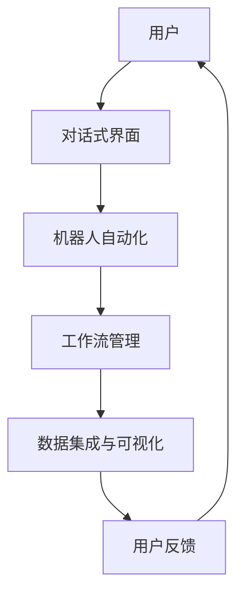
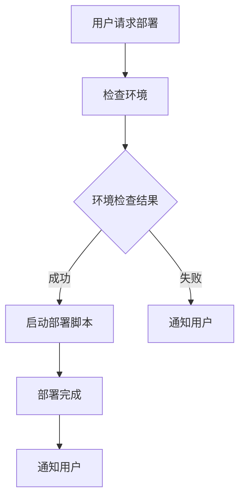
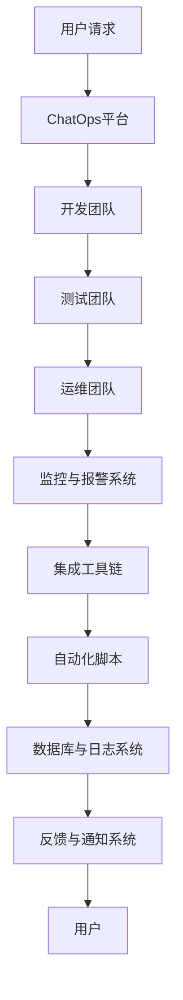

                 

### ChatOps：将对话式界面引入IT运维

#### 关键词：
- **ChatOps**
- **对话式界面**
- **IT运维**
- **自动化**
- **DevOps**

> **摘要**：本文将探讨如何将对话式界面引入IT运维，从而实现高效的自动化和智能化运维。通过介绍ChatOps的基本概念、核心组件和应用案例，本文将帮助读者深入了解ChatOps的原理和实践，并展望其未来发展方向。

## 第1章 引言

### 1.1 什么是ChatOps

ChatOps是一种将对话式界面（如聊天机器人、即时通讯工具等）引入到IT运维、软件开发和业务流程管理中的新兴方法。其核心理念是通过自动化和智能化的对话界面，实现运维任务的高效管理和协作。

ChatOps的主要目标是通过集成和自动化各种工具和服务，提供一个统一的沟通和操作平台。在这个平台上，团队成员可以通过自然语言与系统进行交互，从而简化工作流程，提高工作效率。

### 1.2 ChatOps的起源与发展

ChatOps的概念最早由GitHub在2012年提出，当时主要是为了解决DevOps中跨团队协作的问题。随着人工智能和自然语言处理技术的进步，ChatOps逐渐发展成为一套完整的运维和协作体系。

目前，ChatOps已经广泛应用于各种行业，包括IT、金融、医疗等。其发展的主要驱动力包括：

- **自动化和智能化**：ChatOps通过自动化脚本和智能算法，实现运维任务的自动化处理，减少人工干预。
- **用户体验**：对话式界面的用户友好性，使得团队成员能够更加便捷地完成任务，提高工作效率。
- **协作效率**：ChatOps提供了一个统一的沟通和操作平台，促进了团队成员之间的协作和沟通。

### 1.3 ChatOps的优势与挑战

#### 优势

- **提高效率**：通过自动化和智能化的对话界面，实现运维任务的高效管理和协作。
- **降低成本**：减少人工干预，降低运维成本。
- **用户体验**：用户友好性，提高团队成员的工作效率。
- **实时响应**：能够实时响应运维事件，快速处理问题。

#### 挑战

- **技术门槛**：需要具备一定的编程和运维技能，才能搭建和优化ChatOps平台。
- **系统集成**：需要集成各种工具和服务，确保平台的稳定性和兼容性。
- **数据安全**：涉及大量敏感数据的处理和存储，需要确保数据安全。

### 1.4 本章小结

本章介绍了ChatOps的基本概念、起源与发展，以及其优势和挑战。在接下来的章节中，我们将深入探讨ChatOps的核心概念、应用场景和未来发展趋势。

## 第2章 ChatOps的核心概念

### 2.1 对话式界面设计原则

#### 2.1.1 用户友好性

用户友好性是ChatOps设计的重要原则之一。一个好的对话式界面应该简洁直观，使得用户能够轻松地进行交互。这包括：

- **简洁的界面设计**：避免过于复杂的设计，减少用户的认知负担。
- **自然的语言交互**：支持自然语言输入和输出，使得用户能够像与人交流一样与系统进行交互。
- **快速响应**：提供快速响应，减少用户等待时间。

#### 2.1.2 上下文感知

上下文感知是ChatOps的核心能力之一。一个优秀的对话式界面应该能够根据用户的上下文环境，提供相关建议和操作。

- **上下文理解**：通过自然语言处理技术，理解用户的意图和上下文。
- **动态调整**：根据用户的操作和反馈，动态调整对话内容和操作建议。

#### 2.1.3 自适应交互

自适应交互是ChatOps的另一个重要原则。一个优秀的对话式界面应该能够根据用户的行为和偏好，自动调整交互方式和内容。

- **个性化推荐**：根据用户的行为和偏好，提供个性化的操作建议和推荐。
- **自适应调整**：根据用户的反馈，自动调整交互方式和内容。

### 2.2 ChatOps的关键组件

#### 2.2.1 机器人自动化

机器人自动化是ChatOps的核心组件之一。它通过集成各种自动化工具和脚本，实现运维任务的自动化处理。

- **集成自动化工具**：如Ansible、Puppet等，用于自动化配置管理。
- **编写自动化脚本**：根据具体需求，编写自动化脚本，实现运维任务的自动化处理。

#### 2.2.2 工作流管理

工作流管理是ChatOps的另一个重要组件。它通过定义和管理运维工作流，实现运维任务的高效管理和协作。

- **定义工作流**：根据运维任务的需求，定义工作流，包括任务的执行顺序、依赖关系等。
- **管理工作流**：实时监控工作流执行情况，处理异常情况。

#### 2.2.3 数据集成与可视化

数据集成与可视化是ChatOps的重要组件之一。它通过集成和可视化各种运维数据，提供运维数据的实时监控和报警。

- **数据集成**：集成各种运维数据源，如监控数据、日志数据等。
- **数据可视化**：通过图表、仪表板等形式，可视化运维数据，提供实时监控和报警。

### 2.3 ChatOps的核心概念架构

下面是一个简单的Mermaid流程图，展示ChatOps的核心概念架构：

### 2.4 本章小结

本章介绍了ChatOps的核心概念，包括对话式界面设计原则、机器人自动化、工作流管理和数据集成与可视化。这些核心组件共同构成了ChatOps的技术体系，为运维任务的高效管理和协作提供了有力支持。

## 第3章 ChatOps在IT运维中的应用

### 3.1 自动化运维任务

#### 3.1.1 搭建ChatOps平台

搭建ChatOps平台是进行自动化运维任务的第一步。以下是搭建ChatOps平台的基本步骤：

1. **选择ChatOps平台**：目前市面上有许多ChatOps平台可供选择，如Microsoft Teams、Slack、Rocket.Chat等。选择一个适合自己需求的平台。
2. **配置聊天机器人**：在选择的平台上配置聊天机器人，如使用Bot Framework或Slack App等。
3. **集成自动化工具**：将自动化工具（如Ansible、Puppet等）集成到聊天机器人中，以便通过对话式界面执行自动化任务。
4. **配置工作流**：根据运维任务的需求，配置工作流，定义任务的执行顺序、依赖关系等。

#### 3.1.2 自动化常见运维任务

ChatOps可以通过聊天机器人自动化执行各种常见运维任务，如下：

- **部署和升级**：通过聊天机器人执行应用程序的部署和升级任务，如使用Ansible执行自动化部署。
- **监控和报警**：通过聊天机器人监控系统状态，并在出现问题时发送报警通知。
- **配置管理**：通过聊天机器人执行配置管理任务，如使用Puppet或Chef执行自动化配置。
- **日志管理**：通过聊天机器人收集和分析日志数据，提供实时监控和报警。

#### 3.1.3 工作流设计实战

以下是一个简单的ChatOps工作流设计实例，用于自动化部署一个Web应用程序：

在这个工作流中，用户通过聊天机器人请求部署应用程序。聊天机器人首先检查环境，如果环境检查成功，则会启动部署脚本进行部署。如果环境检查失败，则通知用户并停止部署流程。部署完成后，通知用户部署成功。

### 3.2 智能监控与预警

#### 3.2.1 监控数据的获取与处理

智能监控与预警的关键在于实时获取和处理监控数据。以下是获取和处理监控数据的基本步骤：

1. **集成监控工具**：将监控工具（如Prometheus、Grafana等）集成到ChatOps平台中。
2. **数据采集**：通过监控工具采集系统性能、网络流量、日志等监控数据。
3. **数据处理**：对采集到的监控数据进行处理，如数据清洗、转换和存储。

#### 3.2.2 智能预警机制

智能预警机制是ChatOps在监控与预警方面的重要应用。以下是构建智能预警机制的基本步骤：

1. **设定预警规则**：根据监控数据，设定预警规则，如设置CPU利用率超过90%时发送报警。
2. **数据分析和处理**：对监控数据进行实时分析，判断是否触发预警规则。
3. **发送预警通知**：在触发预警规则时，通过聊天机器人发送预警通知，通知运维团队进行问题排查和处理。

#### 3.2.3 实时数据分析与可视化

实时数据分析与可视化是ChatOps在监控与预警方面的重要功能。以下是实现实时数据分析与可视化的基本步骤：

1. **数据实时采集**：通过集成监控工具，实时采集系统性能、网络流量、日志等监控数据。
2. **实时数据处理**：对实时采集到的监控数据进行处理，如数据清洗、转换和存储。
3. **实时可视化**：通过实时数据可视化工具（如Grafana、Kibana等），将实时监控数据可视化，提供实时监控和报警。

### 3.3 本章小结

本章介绍了ChatOps在IT运维中的应用，包括自动化运维任务、智能监控与预警以及实时数据分析与可视化。通过ChatOps，运维团队能够实现运维任务的高效管理和协作，提高工作效率和系统稳定性。

## 第4章 ChatOps与DevOps的结合

### 4.1 DevOps概述

DevOps是一种软件开发和运维的实践方法，旨在通过跨职能团队的协作和自动化工具的集成，提高软件交付的速度和质量。DevOps的核心原则包括：

- **自动化**：通过自动化工具实现软件开发、测试、部署等环节的自动化。
- **持续集成和持续部署**：通过持续集成和持续部署（CI/CD），实现快速、频繁的软件交付。
- **协作**：鼓励开发、测试、运维等团队的紧密协作，打破部门壁垒。
- **监控和反馈**：通过实时监控和反馈机制，确保软件质量和系统稳定性。

### 4.2 ChatOps在DevOps中的应用

ChatOps在DevOps中的应用主要体现在以下几个方面：

#### 4.2.1 持续集成与持续部署

持续集成（CI）和持续部署（CD）是DevOps的核心实践。ChatOps可以通过以下方式支持CI/CD：

- **自动化测试**：通过聊天机器人执行自动化测试脚本，确保代码质量。
- **部署脚本**：通过聊天机器人执行部署脚本，实现快速、安全的软件部署。
- **反馈机制**：在测试和部署过程中，通过聊天机器人实时反馈测试结果和部署状态，确保团队成员随时掌握项目进展。

#### 4.2.2 自动化测试与反馈

自动化测试是DevOps的重要组成部分。ChatOps可以通过以下方式实现自动化测试与反馈：

- **测试脚本集成**：将自动化测试脚本集成到聊天机器人中，实现一键执行。
- **实时反馈**：在测试执行过程中，通过聊天机器人实时反馈测试结果，如通过/失败、错误日志等。
- **问题定位**：在测试失败时，通过聊天机器人定位问题，提供解决方案。

#### 4.2.3 跨部门协作与沟通

跨部门协作是DevOps成功的关键。ChatOps通过以下方式促进跨部门协作与沟通：

- **统一平台**：提供一个统一的平台，让开发、测试、运维等团队在同一环境中进行协作。
- **即时沟通**：通过聊天机器人实现即时沟通，快速解决问题。
- **任务管理**：通过聊天机器人管理任务，确保每个任务都有明确的负责人和进度。

### 4.3 ChatOps与DevOps结合的架构

以下是ChatOps与DevOps结合的基本架构：

在这个架构中，用户通过ChatOps平台发起请求，请求会传递到各个团队，由开发、测试和运维团队共同协作完成。在整个过程中，监控与报警系统、集成工具链、自动化脚本和数据库与日志系统等组件协同工作，确保项目顺利进行。

### 4.4 本章小结

本章介绍了ChatOps与DevOps的结合，探讨了ChatOps在DevOps中的应用场景和架构。通过结合ChatOps，DevOps团队能够实现更加高效、协作和自动化的软件开发和运维过程。

## 第5章 ChatOps实施案例

### 5.1 案例一：企业级ChatOps平台搭建

#### 5.1.1 环境搭建与配置

搭建企业级ChatOps平台的第一步是选择合适的平台和工具。以下是一个简单的环境搭建和配置步骤：

1. **选择平台**：选择一个适合的企业级平台，如Slack、Microsoft Teams或Riot.im。
2. **安装聊天机器人**：在选择的平台上安装聊天机器人，如使用Slack App或Microsoft Bot Framework。
3. **集成自动化工具**：将自动化工具（如Ansible、Puppet等）集成到聊天机器人中，以便执行自动化任务。
4. **配置权限和角色**：根据团队需求和角色，配置平台权限和角色，确保数据安全和团队协作。

#### 5.1.2 聊天机器人集成

聊天机器人的集成是实现ChatOps功能的关键。以下是一个简单的聊天机器人集成步骤：

1. **编写机器人代码**：使用合适的编程语言（如Python、Node.js等）编写聊天机器人代码。
2. **配置API**：为聊天机器人配置API，以便与平台进行通信。
3. **测试机器人**：在本地或测试环境中测试聊天机器人，确保其功能正常。

#### 5.1.3 自动化运维脚本编写

自动化运维脚本是ChatOps的核心组件之一。以下是一个简单的自动化运维脚本编写步骤：

1. **需求分析**：明确自动化运维任务的需求，如部署、监控、日志管理等。
2. **编写脚本**：使用合适的脚本语言（如Python、Bash等）编写自动化运维脚本。
3. **测试脚本**：在本地或测试环境中测试脚本，确保脚本功能正常。
4. **集成脚本**：将编写好的脚本集成到聊天机器人中，以便通过聊天机器人执行。

### 5.2 案例二：智能监控与预警系统

#### 5.2.1 监控数据的采集

智能监控与预警系统的第一步是采集监控数据。以下是一个简单的监控数据采集步骤：

1. **选择监控工具**：选择一个适合的监控工具，如Prometheus、Grafana或Zabbix。
2. **配置数据源**：配置监控工具的数据源，如系统性能、网络流量、日志等。
3. **采集数据**：使用监控工具采集系统性能、网络流量、日志等监控数据。

#### 5.2.2 预警规则的设定

预警规则是智能监控与预警系统的核心。以下是一个简单的预警规则设定步骤：

1. **分析监控数据**：分析监控数据，确定需要预警的情况，如CPU利用率超过90%、内存使用率超过95%等。
2. **设定预警规则**：根据分析结果，设定预警规则，如CPU利用率超过90%时发送预警通知。
3. **测试预警规则**：在测试环境中测试预警规则，确保预警规则正确。

#### 5.2.3 预警信息处理与通知

预警信息处理与通知是智能监控与预警系统的重要部分。以下是一个简单的预警信息处理与通知步骤：

1. **处理预警信息**：在收到预警通知后，对预警信息进行处理，如检查系统状态、排查问题等。
2. **发送通知**：通过聊天机器人或其他通知方式（如短信、邮件等）发送预警通知，通知相关人员。
3. **反馈处理结果**：在问题解决后，通过聊天机器人或其他方式反馈处理结果，确保问题得到解决。

### 5.3 本章小结

本章通过两个实际案例，详细介绍了企业级ChatOps平台搭建和智能监控与预警系统的实施过程。通过这些案例，读者可以了解ChatOps的实施步骤和技术实现，为实际应用提供参考。

## 第6章 ChatOps的未来发展

### 6.1 ChatOps的技术趋势

ChatOps的发展离不开技术趋势的推动。以下是一些值得关注的技术趋势：

#### 6.1.1 对话式界面的智能化

随着自然语言处理和人工智能技术的发展，对话式界面的智能化程度越来越高。未来，ChatOps平台将能够更好地理解用户的意图，提供更加精准的服务。

#### 6.1.2 跨平台集成与互操作

跨平台集成与互操作是ChatOps的发展方向之一。未来，ChatOps将能够与更多平台和服务进行集成，提供更加全面的功能。

#### 6.1.3 人工智能与自然语言处理的结合

人工智能与自然语言处理的结合将进一步提升ChatOps的智能化水平。通过深度学习、语音识别等技术，ChatOps平台将能够提供更加自然、高效的交互体验。

### 6.2 ChatOps在企业中的应用拓展

ChatOps不仅适用于IT运维，还可以在其他领域得到广泛应用。以下是一些应用拓展方向：

#### 6.2.1 人力资源与客户服务

ChatOps在人力资源和客户服务领域的应用前景广阔。通过聊天机器人，企业可以实现招聘管理、员工福利、客户服务等方面的自动化和智能化。

#### 6.2.2 金融与保险行业

金融与保险行业对数据处理和风险控制有着极高的要求。ChatOps可以帮助金融机构实现自动化风控、客户服务等方面的优化。

#### 6.2.3 医疗与健康领域

医疗与健康领域对数据安全和实时处理有着严格要求。ChatOps可以帮助医疗机构实现患者管理、医疗服务等方面的自动化和智能化。

### 6.3 ChatOps与IoT的结合

物联网（IoT）的快速发展为ChatOps提供了新的应用场景。通过ChatOps，企业可以实现设备监控、远程控制、数据分析等功能，提高生产效率。

### 6.4 本章小结

ChatOps的未来发展前景广阔，随着技术的不断进步，ChatOps将在更多领域得到应用。企业应抓住这一机遇，积极探索ChatOps的潜力，提高工作效率和业务水平。

## 第7章 总结与展望

### 7.1 ChatOps的重要性

ChatOps作为一种新兴的运维和协作方法，具有显著的优势。它通过自动化和智能化的对话界面，实现运维任务的高效管理和协作，降低运维成本，提高用户体验。同时，ChatOps还促进了跨部门的协作和沟通，有助于打破部门壁垒，提高整体工作效率。

### 7.2 ChatOps的挑战与应对策略

尽管ChatOps具有显著的优势，但在实施过程中也面临一些挑战。以下是一些常见的挑战及应对策略：

#### 7.2.1 技术门槛

ChatOps需要一定的编程和运维技能，对技术团队的要求较高。应对策略：加强团队成员的培训，提高技术能力。

#### 7.2.2 系统集成

集成各种工具和服务是实现ChatOps的关键。应对策略：选择成熟的集成平台，降低集成难度。

#### 7.2.3 数据安全

涉及大量敏感数据的处理和存储，需要确保数据安全。应对策略：采用数据加密、访问控制等技术，确保数据安全。

### 7.3 ChatOps的未来发展方向

未来，ChatOps将在技术、应用和行业等方面持续发展。以下是一些发展方向：

#### 7.3.1 智能化水平提升

随着人工智能和自然语言处理技术的进步，ChatOps的智能化水平将不断提高，提供更加精准和高效的服务。

#### 7.3.2 跨平台集成

跨平台集成与互操作将使ChatOps能够与更多平台和服务进行集成，提供更加全面的功能。

#### 7.3.3 应用场景拓展

ChatOps将在更多领域得到应用，如人力资源、金融、医疗等，为企业提供更加全面的解决方案。

### 7.4 本章小结

ChatOps在IT运维和业务流程管理中具有显著的优势和潜力。企业应积极拥抱ChatOps，探索其在实际业务中的应用，提高工作效率和业务水平。同时，应对ChatOps面临的挑战，确保其顺利实施和持续发展。

### 作者

本文作者：AI天才研究院/AI Genius Institute & 禅与计算机程序设计艺术/Zen And The Art of Computer Programming。

