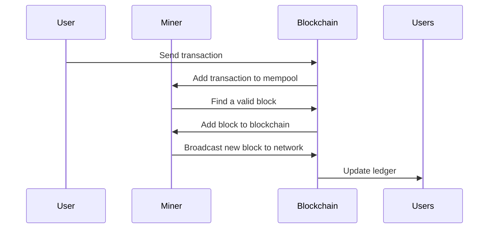
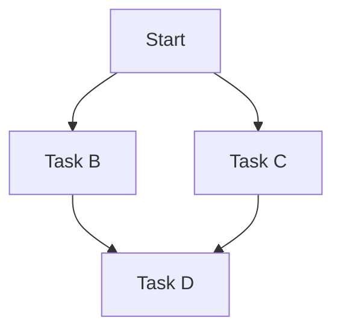
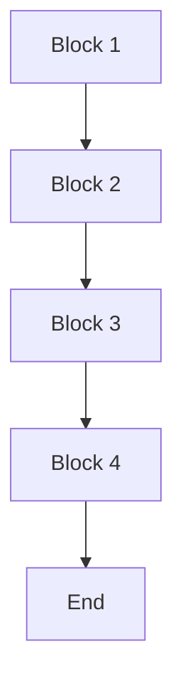
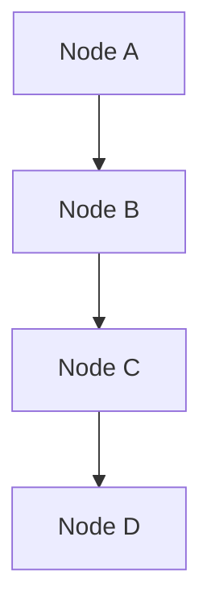

                 


### Introduction to the Title: DAG (Directed Acyclic Graph) in Distributed Ledger Applications

The title "DAG (Directed Acyclic Graph) in Distributed Ledger Applications" encapsulates a fascinating intersection of two pivotal technologies: Directed Acyclic Graphs (DAGs) and Distributed Ledgers. To begin with, let's break down the terms for a clear understanding.

**Directed Acyclic Graph (DAG):** A DAG is a type of graph where edges have direction, and there are no cycles. In simpler terms, it is a network of nodes connected by directed edges, but it cannot form any closed loops. DAGs are used extensively in various fields due to their ability to represent hierarchical relationships and process flows efficiently.

**Distributed Ledger:** A distributed ledger is a decentralized database that is shared across a network of computers. It enables the participants to reach a consensus on the state of the ledger without relying on a central authority. Distributed ledgers are renowned for their transparency, security, and immutability, and they serve as the backbone of cryptocurrencies like Bitcoin.

The integration of DAGs with Distributed Ledgers brings forth a new paradigm of data management and transaction processing. While traditional distributed ledger technologies, such as Blockchain, have revolutionized the way transactions are conducted, they have certain limitations. For instance, they often suffer from scalability issues, where the rate of transaction processing slows down as the network grows.

This is where DAGs come into play. By leveraging the properties of DAGs, distributed ledgers can achieve faster transaction speeds, improved scalability, and enhanced security. The rest of this article will delve deeper into these concepts, exploring the fundamentals of DAGs, their integration with distributed ledgers, and practical applications.

In conclusion, the title of this article highlights the potential of DAGs to address the shortcomings of traditional distributed ledger technologies. By understanding the intricacies of DAGs and their applications in distributed ledger systems, we can explore new frontiers in data management and transaction processing.

### Keywords

- **Directed Acyclic Graph (DAG):** A graph with directed edges and no cycles, used for representing hierarchical relationships and data flows.
- **Distributed Ledger:** A decentralized database shared across a network of computers, providing transparency, security, and immutability.
- **Blockchain:** A type of distributed ledger that maintains a chronological chain of blocks, each containing a set of transactions.
- **Scalability:** The ability of a system to handle a growing amount of work by adding resources to it.
- **Transaction Processing:** The mechanism by which transactions are verified, recorded, and settled in a distributed ledger.
- **Immutability:** The property of a data structure that prevents changes once it has been created.

### Abstract

This article explores the integration of Directed Acyclic Graphs (DAGs) with Distributed Ledgers, highlighting the advantages and applications of this novel approach. We begin by defining and explaining the basic concepts of DAGs and Distributed Ledgers. Then, we discuss the advantages of using DAGs in distributed ledger applications, such as faster transactions, improved scalability, and enhanced security. We delve into the architectural design of DAG-based distributed ledgers and present core algorithms and mathematical models used in DAGs. Finally, we provide practical examples and case studies to illustrate the real-world applications of DAGs in distributed ledger technologies. Through this comprehensive analysis, we aim to provide readers with a deep understanding of the potential of DAGs in revolutionizing distributed ledger applications.

## Part 1: Fundamentals of DAG and Distributed Ledgers

### Chapter 1: Introduction to DAGs and Distributed Ledgers

#### 1.1 Definition and History of DAGs

A Directed Acyclic Graph (DAG) is a type of graph where edges have a direction, and the graph does not contain any cycles. In other words, you cannot traverse the entire graph in a loop. Each node in a DAG represents a data element or entity, and each directed edge represents a relationship between two nodes. DAGs are used to model various types of data flows and hierarchies because they can represent a wide range of relationships without the constraint of cycles.

The concept of a directed graph has been around since the early days of graph theory in the 19th century. However, the specific term "Directed Acyclic Graph" began to gain popularity in the context of computer science and information systems in the 1980s and 1990s. DAGs have been used extensively in various fields, including computer networks, scheduling systems, dependency management, and data analytics. One of the most famous applications of DAGs is in the field of dependency resolution, where tasks or jobs need to be executed in a specific order without overlapping or creating circular dependencies.

#### 1.2 Basics of Distributed Ledgers

A distributed ledger is a decentralized database that is shared across a network of computers. Unlike traditional centralized databases that rely on a single authoritative source, distributed ledgers maintain a consensus about the state of the data across multiple participants. Each participant maintains a copy of the ledger and validates transactions before adding them to the ledger. This decentralized nature of distributed ledgers ensures transparency, security, and immutability of the data.

The basic principle of a distributed ledger is that it enables a network of participants to reach a consensus on the state of the ledger without relying on a central authority. This is typically achieved through a consensus algorithm, which ensures that all participants agree on the validity and order of transactions. One of the most well-known examples of a distributed ledger is the Blockchain, which was introduced with the creation of Bitcoin in 2009. Blockchain technology has since been adopted by numerous cryptocurrencies and decentralized applications (DApps).

#### 1.3 The Relationship Between DAGs and Distributed Ledgers

The relationship between DAGs and distributed ledgers lies in their ability to represent and manage data flows and transactions efficiently. While traditional distributed ledger technologies like Blockchain use a linear chain of blocks to store transactions, DAGs provide a more flexible and scalable approach.

DAGs can represent transactions as nodes in a graph, with each node connected to its predecessors and successors. This structure allows for parallel transaction processing and faster verification times, as multiple transactions can be validated simultaneously. Additionally, the absence of cycles in a DAG ensures that the transaction graph remains acyclic, making it easier to verify the integrity of the ledger.

The integration of DAGs with distributed ledgers can overcome some of the limitations of traditional blockchains, such as scalability and transaction throughput. By leveraging the properties of DAGs, distributed ledger systems can achieve higher throughput and improved performance, making them suitable for use cases that require fast and efficient transaction processing.

In summary, the combination of DAGs and distributed ledgers represents a promising avenue for advancing the capabilities of distributed systems. By understanding the fundamentals of both technologies, we can better appreciate their potential and explore new applications in various domains.

### Chapter 2: Fundamental Concepts of DAG

#### 2.1 Directed Graph Theory

A directed graph, also known as a digraph, is a graph where the edges have a direction. Each edge points from one vertex (or node) to another, creating a directional relationship between the two nodes. In a directed graph, there is no concept of symmetry; if there is an edge from node A to node B, there is no inherent edge from node B to node A, unless explicitly defined.

Directed graphs are often represented using nodes and directed edges, where nodes are typically drawn as circles and edges as arrows. For example, consider a simple directed graph with four nodes A, B, C, and D:

```
A -> B
A -> C
B -> D
C -> D
```

In this graph, node A has two outgoing edges, one pointing to node B and another to node C. Node B has one outgoing edge to node D, while nodes C and D both have incoming edges.

The basic terminology for directed graphs includes:
- **Vertex**: A node in the graph.
- **Edge**: A connection between two vertices.
- **In-degree**: The number of edges coming into a vertex.
- **Out-degree**: The number of edges going out from a vertex.
- **Path**: A sequence of vertices connected by edges, where each edge connects to the next vertex in the sequence.
- **Cycle**: A path that starts and ends at the same vertex, forming a closed loop.

#### 2.2 Acyclic Graph Theory

An acyclic graph is a directed graph that contains no cycles. In other words, there are no paths that start and end at the same vertex while traversing through other vertices. This property makes acyclic graphs particularly useful in various applications where cyclic dependencies are not allowed or need to be avoided.

In an acyclic graph, all the vertices can be linearly ordered in such a way that for every directed edge (u, v), vertex u comes before vertex v in the ordering. This property is known as a topological ordering.

Acyclic graphs are used extensively in scenarios where a natural ordering of tasks or elements is required. For example, in a project management context, tasks often have dependencies on other tasks, and they need to be executed in a specific order to ensure project completion. An acyclic graph can effectively represent these dependencies without any cycles.

Some key concepts in acyclic graph theory include:
- **Topological Sort**: An algorithm used to order the vertices of a directed acyclic graph such that for every directed edge (u, v), vertex u comes before vertex v in the ordering.
- **Kahn's Algorithm**: A popular algorithm for topological sorting that uses the in-degree of vertices to determine the order of execution.
- **Reachability Matrix**: A matrix used to determine the reachability between vertices in a directed acyclic graph, which can be used for various graph traversal algorithms.

#### 2.3 Properties and Characteristics of DAGs

Directed Acyclic Graphs (DAGs) combine the properties of directed graphs and acyclic graphs, making them particularly useful in scenarios where data needs to be organized hierarchically and dependencies need to be managed efficiently. Here are some of the key properties and characteristics of DAGs:

1. **Hierarchy and Hierarchy Representation:**
   DAGs can represent hierarchical relationships between elements efficiently. Each node in a DAG can be thought of as a task or an element that depends on other tasks or elements, and the directed edges represent these dependencies. The acyclic nature of DAGs ensures that dependencies are represented without any circular references, making it easier to manage and resolve dependencies.

2. **Parallel Processing:**
   Since DAGs do not contain any cycles, tasks or elements can be processed in parallel. This parallel processing capability is crucial for scenarios where multiple tasks depend on different subsets of other tasks. By leveraging parallel processing, DAGs can significantly reduce the overall execution time and improve the efficiency of task execution.

3. **Efficient Dependency Resolution:**
   DAGs provide efficient mechanisms for resolving dependencies between tasks or elements. By maintaining the topological order of nodes and processing tasks in this order, DAGs can ensure that dependencies are resolved correctly without any conflicts or circular references.

4. **Scalability:**
   DAGs can easily scale with the increase in the number of nodes and edges. The absence of cycles allows for efficient traversal and manipulation of the graph, even as the graph size grows. This scalability makes DAGs suitable for use in large-scale applications and distributed systems.

5. **Flexibility:**
   DAGs offer a flexible structure for representing a wide range of relationships and data flows. The direction of edges allows for clear and unambiguous representation of dependencies and data flows, while the acyclic nature ensures that the graph does not contain any redundant or conflicting information.

6. **Optimization and Scheduling:**
   DAGs are widely used in optimization and scheduling problems, where tasks or elements need to be executed in a specific order to achieve optimal results. By representing dependencies as a DAG, it becomes easier to identify critical paths, allocate resources efficiently, and optimize the overall execution process.

In summary, the properties and characteristics of DAGs make them a powerful tool for representing and managing hierarchical relationships and data flows in various applications. By understanding the fundamental concepts of directed graphs and acyclic graphs, we can better appreciate the strengths and potential applications of DAGs in modern computing and distributed systems.

### Chapter 3: Fundamental Concepts of Distributed Ledgers

#### 3.1 Definition and History of Distributed Ledgers

A distributed ledger is a decentralized database that maintains a continuously growing record of transactions in a secure and immutable manner. Unlike traditional centralized databases, which rely on a central authority to verify and maintain data integrity, distributed ledgers operate across a network of computers. Each participant in the network maintains a copy of the ledger and collaborates to validate and confirm transactions. This distributed nature ensures that no single point of failure can compromise the integrity of the data.

The concept of a distributed ledger has its roots in the need for secure, transparent, and decentralized data management systems. The most notable precursor to modern distributed ledgers is the blockchain, introduced by an anonymous entity known as Satoshi Nakamoto in 2008. The whitepaper describing the Bitcoin protocol laid the foundation for a decentralized digital currency that could operate independently of any central authority. Blockchain technology uses a distributed ledger to record and verify transactions, ensuring that the state of the ledger is consistent across all participating nodes.

Since the inception of Bitcoin, distributed ledger technology has evolved and diversified, leading to the development of various types of distributed ledgers. These include public ledgers, permissioned ledgers, and hybrid ledgers, each designed to address specific use cases and requirements.

#### 3.2 Types of Distributed Ledgers

1. **Public Ledgers:**
   Public ledgers, also known as public blockchains, are decentralized systems where anyone can participate and contribute to the network. These ledgers are typically open-source, and anyone can join the network, verify transactions, and maintain a copy of the ledger. Bitcoin and Ethereum are prominent examples of public ledgers. Public ledgers provide transparency and censorship resistance, but they can suffer from scalability issues due to the need to reach consensus on a single global state.

2. **Permissioned Ledgers:**
   Permissioned ledgers, also known as private blockchains, restrict participation to a predefined set of authorized nodes. These nodes are typically operated by trusted entities, such as financial institutions or corporations. Permissioned ledgers offer enhanced security and privacy compared to public ledgers, as they can implement access controls and limit participation to known and verified nodes. Examples of permissioned ledgers include Hyperledger Fabric and R3 Corda.

3. **Hybrid Ledgers:**
   Hybrid ledgers combine the characteristics of public and permissioned ledgers. They allow for a mix of permissioned and permissionless participation, enabling both openness and privacy. Hybrid ledgers are designed to provide the benefits of public and permissioned systems, catering to a wider range of use cases. An example of a hybrid ledger is EOS, which allows both token holders and block producers to participate in the consensus process.

#### 3.3 Blockchain: A Form of Distributed Ledger

Blockchain is perhaps the most well-known and widely adopted form of distributed ledger technology. It operates on the principle of decentralization, where a network of nodes collaborates to maintain a shared ledger of transactions. Each transaction is bundled into a block, and these blocks are added to the blockchain in a chronological order, forming a chain of blocks.

The key components of a blockchain include:

1. **Blocks:** Each block contains a list of transactions that have been verified by the network. Once a block is added to the blockchain, the transactions become immutable and cannot be altered or removed.
2. **Transactions:** Transactions are the basic units of data in a blockchain. They represent the exchange of value or information between participants in the network.
3. **Hashing:** Blockchain uses cryptographic hashing to ensure data integrity and security. Each block contains a hash of the previous block, creating a link between blocks and ensuring that the chain cannot be tampered with.
4. **Consensus Algorithm:** A consensus algorithm is used to ensure that all nodes in the network agree on the state of the blockchain. Popular consensus algorithms include Proof of Work (PoW), Proof of Stake (PoS), and Delegated Proof of Stake (DPoS).

Blockchain technology has had a significant impact on various industries, including finance, supply chain, healthcare, and more. Its ability to provide secure, transparent, and immutable data management has led to numerous applications and use cases.

#### 3.4 Mermaid Diagram of Blockchain Structure

To better understand the structure of a blockchain, we can use a Mermaid diagram to visualize its components and how they are interconnected. The following diagram represents a simplified version of a blockchain with multiple blocks and transactions:



In this diagram:
- **User:** Represents a participant in the blockchain network who initiates a transaction.
- **Miner:** Represents a node in the network that validates transactions and adds them to the blockchain.
- **Blockchain:** Represents the distributed ledger maintained by all nodes in the network.

The diagram illustrates the flow of transactions from users to miners, who then validate and add these transactions to the blockchain. Once a block is added, it is broadcasted to the network, and all users update their ledgers accordingly.

In conclusion, the fundamental concepts of distributed ledgers, including their definition, history, types, and the structure of a blockchain, provide a foundational understanding of how these technologies operate and their potential applications. As we delve deeper into the subsequent chapters, we will explore the integration of DAGs with distributed ledgers and their advantages in more detail.

### Chapter 4: Fundamental Concepts of DAG

In this chapter, we will explore the fundamental concepts of Directed Acyclic Graphs (DAGs), including their definition, history, properties, and various types. By understanding these concepts, we can better appreciate the unique advantages and applications of DAGs in modern computing and distributed systems.

#### 4.1 Definition of DAG

A Directed Acyclic Graph (DAG) is a type of graph where nodes are connected by directed edges, forming a network with a specific direction. Unlike undirected graphs, where edges do not have a direction, directed graphs have an arrow indicating the direction of the connection between nodes. The key characteristics of a DAG are:

- **Directed Edges:** Edges in a DAG have a direction, which is typically represented by arrows. This directionality allows for the representation of various relationships and dependencies between nodes.
- **No Cycles:** A DAG does not contain any cycles. This means that you cannot traverse the entire graph in a loop. The absence of cycles is a crucial property that enables efficient processing and manipulation of the graph.

DAGs can be visualized using nodes and directed edges, where each node represents a data element or entity, and each directed edge represents a relationship between two nodes. For example, consider a DAG representing task dependencies in a project management system:

```
A -> B
A -> C
B -> D
C -> D
```

In this DAG, node A has two children, nodes B and C, indicating that tasks B and C depend on task A. Node B, in turn, has a child node D, and node C also has a child node D. This structure allows for clear and efficient representation of task dependencies without any cycles.

#### 4.2 History of DAG

The concept of a directed graph has been around for over a century, with its origins in the field of graph theory. The term "Directed Acyclic Graph" began to gain popularity in the 1980s and 1990s, as computer scientists and researchers started exploring its applications in various domains, including computer networks, scheduling systems, and dependency management.

One of the early applications of DAGs was in the field of scheduling and project management. Researchers and practitioners sought ways to efficiently schedule tasks with dependencies, ensuring that tasks were executed in the correct order without any conflicts or cycles. DAGs provided an effective framework for representing and solving these scheduling problems, leading to numerous practical applications in real-world scenarios.

In the 21st century, the rise of distributed systems and the need for efficient data processing and management further fueled the interest in DAGs. As distributed systems grew in complexity, the ability to represent and process hierarchical relationships and dependencies efficiently became increasingly important. DAGs, with their unique properties of directed edges and acyclic structure, proved to be a valuable tool in addressing these challenges.

#### 4.3 Properties and Characteristics of DAGs

DAGs possess several key properties and characteristics that make them highly effective for representing and managing hierarchical relationships and dependencies. Here are some of the primary properties:

1. **No Cycles:** As mentioned earlier, one of the fundamental properties of a DAG is the absence of cycles. This ensures that the graph can be traversed in a topological order without any loops, allowing for efficient processing and manipulation of the graph.

2. **Topological Order:** DAGs can be ordered in a topological sort, which is a linear ordering of the nodes such that for every directed edge (u, v), vertex u comes before vertex v in the ordering. This property is particularly useful in scenarios where tasks or elements need to be processed in a specific order to maintain consistency and avoid conflicts.

3. **Parallel Processing:** The acyclic nature of DAGs allows for parallel processing of tasks or elements. Since there are no cycles, tasks or elements can be executed independently in parallel, as long as their dependencies are resolved. This parallelism can significantly improve the performance and efficiency of distributed systems and applications.

4. **Efficient Dependency Management:** DAGs provide a flexible and efficient mechanism for representing and managing dependencies between tasks or elements. The directed edges in a DAG clearly indicate the dependency relationships, making it easier to analyze and resolve dependencies effectively.

5. **Scalability:** DAGs can easily scale with the increase in the number of nodes and edges. The absence of cycles allows for efficient traversal and manipulation of the graph, even as the graph size grows. This scalability makes DAGs suitable for use in large-scale applications and distributed systems.

6. **Optimization and Scheduling:** DAGs are widely used in optimization and scheduling problems, where tasks or elements need to be executed in a specific order to achieve optimal results. By representing dependencies as a DAG, it becomes easier to identify critical paths, allocate resources efficiently, and optimize the overall execution process.

#### 4.4 Types of DAGs

There are several types of DAGs, each designed to address specific requirements and use cases. Here are some common types:

1. **Acyclic DAG:** An acyclic DAG is a DAG with no cycles. This type of DAG is often used in scheduling and dependency management problems, where the absence of cycles ensures that tasks can be executed in the correct order without any conflicts.

2. **DAG with Cycles:** While most practical applications use acyclic DAGs, there are scenarios where cycles are allowed. These types of DAGs are often used in more complex dependency graphs, where cycles may represent iterative or recursive dependencies.

3. **Weighted DAG:** A weighted DAG is a DAG where each edge has an associated weight or value. This type of DAG is commonly used in optimization problems, where the weight of an edge represents the cost or benefit of the dependency between nodes.

4. **Directed Acyclic Hypergraph:** A directed acyclic hypergraph is a generalization of a DAG where edges can connect multiple nodes. This type of graph is useful for representing complex relationships and dependencies, such as in network topology or dependency resolution in large-scale systems.

#### 4.5 Mermaid Diagram of DAG Structure

To illustrate the structure of a DAG, we can use a Mermaid diagram to visualize its components and relationships. The following diagram represents a simple acyclic DAG with four nodes and their respective dependencies:



In this diagram, node A represents the starting point of the tasks, with dependencies on nodes B and C. Nodes B and C, in turn, have dependencies on node D. This structure clearly represents the hierarchical relationships and dependencies between the tasks, ensuring that they can be executed in the correct order without any cycles.

In conclusion, the fundamental concepts of Directed Acyclic Graphs (DAGs) provide a powerful framework for representing and managing hierarchical relationships and dependencies. By understanding the definition, history, properties, and types of DAGs, we can better appreciate their unique advantages and applications in various domains, from project management and scheduling to distributed systems and optimization.

### Chapter 4: Fundamental Concepts of Distributed Ledgers

#### 4.1 Definition and History of Distributed Ledgers

A distributed ledger is a decentralized digital system for recording transactions across multiple participants. Unlike traditional centralized ledgers, which rely on a single authority to maintain and verify the data, distributed ledgers distribute the ledger among multiple nodes in a network. This decentralization ensures that the ledger is not controlled by a single entity, enhancing transparency, security, and resilience.

The history of distributed ledgers is closely tied to the development of blockchain technology. The blockchain was first introduced in 2008 by an anonymous person or group known as Satoshi Nakamoto, who created Bitcoin, the first decentralized digital currency. The core innovation of Bitcoin was its use of a distributed ledger to record transactions, eliminating the need for a trusted third party like a bank. This breakthrough demonstrated the potential of distributed ledgers to transform various industries by providing a transparent and secure way to record transactions.

Following Bitcoin, several other blockchain-based distributed ledgers emerged, each with its own unique features and use cases. Ethereum, launched in 2015, introduced smart contracts, allowing for programmable transactions, which expanded the applications of distributed ledgers beyond simple financial transactions. Other notable distributed ledger technologies include Hyperledger Fabric, R3 Corda, and EOS.

#### 4.2 Types of Distributed Ledgers

There are several types of distributed ledgers, each designed to cater to different use cases and requirements. Here are some of the primary types:

1. **Public Blockchains:**
   Public blockchains are decentralized networks where anyone can participate. They operate on the principle of openness, transparency, and censorship resistance. Examples include Bitcoin, Ethereum, and Binance Smart Chain. Public blockchains are permissionless, meaning anyone can join the network, validate transactions, and maintain a copy of the ledger. This decentralization makes them secure and resistant to attacks, but they often face scalability challenges due to the need to reach consensus on a single global state.

2. **Private Blockchains:**
   Private blockchains are permissioned networks where only authorized participants can join. These networks are often operated by a single entity or consortium of organizations. Private blockchains provide enhanced privacy and control, as participants can be vetted and access can be restricted. Examples include Hyperledger Fabric and R3 Corda. Private blockchains are typically faster and more scalable than public blockchains but may lack the transparency and censorship resistance of public blockchains.

3. **Hybrid Blockchains:**
   Hybrid blockchains combine elements of both public and private blockchains. They allow for a mix of permissioned and permissionless participants. Hybrid blockchains aim to provide the benefits of both types of networks, such as enhanced privacy and scalability while maintaining some level of transparency and decentralization. Examples include EOS and Algorand.

#### 4.3 Key Components and Concepts

Distributed ledgers have several key components and concepts that are essential to their functioning. Here are some of the primary components:

1. **Ledger:**
   The ledger is the central database that records all transactions in a distributed ledger system. It is maintained by all participants in the network. Transactions are grouped into blocks, which are added to the ledger in a chronological order. The ledger ensures that all transactions are consistent and immutable.

2. **Nodes:**
   Nodes are the individual participants in a distributed ledger network. Each node maintains a copy of the ledger and validates transactions. Nodes can be computers or servers that are part of the network.

3. **Consensus Algorithm:**
   A consensus algorithm is a protocol used by nodes in a distributed ledger network to agree on the state of the ledger. It ensures that all nodes have a consistent view of the ledger. Common consensus algorithms include Proof of Work (PoW), Proof of Stake (PoS), and Delegated Proof of Stake (DPoS).

4. **Transactions:**
   Transactions are the basic units of data in a distributed ledger. They represent the exchange of value or information between participants in the network. Transactions are validated and recorded in the ledger.

5. **Smart Contracts:**
   Smart contracts are self-executing contracts with the terms of the agreement directly written into code. They run on a distributed ledger and automatically enforce the terms of the contract. Smart contracts have revolutionized the use of distributed ledgers, enabling a wide range of applications beyond simple financial transactions.

#### 4.4 Mermaid Diagram of Blockchain Structure

To visualize the structure of a blockchain, we can use a Mermaid diagram. The following diagram represents a simplified blockchain with multiple blocks and transactions:



In this diagram, each block represents a set of transactions that have been validated by the network. The blocks are linked in a chronological order, forming a chain of blocks. The last block, D, points to the End node, indicating the end of the blockchain.

In conclusion, distributed ledgers represent a significant advancement in digital data management, offering enhanced security, transparency, and resilience. By understanding the definition, history, types, and key components of distributed ledgers, we can better appreciate their potential applications and impact on various industries.

## Part 2: DAG in Distributed Ledger Applications

### Chapter 4: Advantages of DAG in Distributed Ledger Applications

Directed Acyclic Graphs (DAGs) offer several advantages when integrated into distributed ledger applications, making them a promising alternative to traditional blockchain technologies. In this chapter, we will explore these advantages in detail, highlighting how DAGs can enhance transaction speed, scalability, and security.

#### 4.1 Faster Transactions

One of the primary advantages of using DAGs in distributed ledger applications is the significantly faster transaction processing times compared to traditional blockchain technologies. In a blockchain-based system, transactions are grouped into blocks, and these blocks are added to the chain in a linear, chronological order. This structure, while providing security and immutability, introduces a bottleneck in transaction processing speed. The time required to add a new block to the blockchain (known as the block time) can be as high as several minutes, depending on the network's consensus algorithm and the complexity of the transactions.

DAGs, on the other hand, eliminate this bottleneck by allowing for parallel transaction processing. In a DAG-based distributed ledger, transactions are not confined to a linear chain; instead, they are represented as nodes in a graph, with each transaction having multiple predecessors and successors. This allows for multiple transactions to be verified and added to the ledger simultaneously, significantly reducing the overall transaction time. For example, IOTA, a prominent DAG-based distributed ledger, can process over 1,000 transactions per second (TPS) with a latency of less than 1 second, compared to Bitcoin's 7 TPS and Ethereum's 25 TPS.

The ability to process transactions in parallel is due to the acyclic nature of DAGs. Since there are no cycles, transactions can be independently verified and added to the ledger without waiting for previous transactions to be confirmed. This parallel processing capability makes DAGs particularly suitable for use cases requiring high transaction throughput, such as microtransactions, real-time data exchanges, and decentralized applications (DApps).

#### 4.2 Improved Scalability

Scalability is another critical advantage of using DAGs in distributed ledger applications. Traditional blockchain systems often face scalability challenges as the number of participants and transactions grows. The linear nature of blockchain technology, where each new transaction must be added to the end of the chain, limits the system's ability to scale efficiently. This limitation is exacerbated by the need for all nodes in the network to agree on the state of the blockchain through consensus algorithms, which can become slower and more resource-intensive as the network expands.

DAGs address these scalability issues by allowing the ledger to grow in a branching, non-linear manner. Instead of a single, unidirectional chain, DAGs represent transactions as nodes in a graph, where each transaction can have multiple predecessors and successors. This branching structure enables the ledger to scale horizontally, distributing the load across multiple paths and reducing the computational burden on individual nodes.

The scalability of DAGs is further enhanced by their ability to process transactions in parallel. As mentioned earlier, this parallel processing capability allows for higher transaction throughput without sacrificing security or integrity. Additionally, DAGs can incorporate layered architectures, where different layers handle different aspects of the ledger, such as transaction validation and consensus. This layered approach further improves scalability by enabling horizontal scaling across different components of the system.

An example of a DAG-based distributed ledger that demonstrates its scalability advantages is Stellar. Stellar uses a unique architecture that combines the benefits of DAGs with a decentralized exchange mechanism. Stellar is capable of processing over 1,000 TPS with low latency, making it suitable for a wide range of applications, from microtransactions to cross-border payments.

#### 4.3 Enhanced Security

Security is a paramount concern in distributed ledger applications, and DAGs offer several features that enhance the security of the ledger. One of the key security advantages of DAGs is the ability to perform transaction validation in parallel. This parallel validation process reduces the time window during which malicious transactions can be executed, making it more difficult for attackers to exploit vulnerabilities.

DAGs also provide enhanced security through their layered architecture. In a layered DAG, different layers can be responsible for different functions, such as transaction validation, consensus, and data storage. This modular design allows for better isolation of security mechanisms, making it easier to identify and mitigate potential threats. For example, the Stellar network uses a layered architecture where different layers handle transaction validation, consensus, and data storage, providing a robust and secure platform for decentralized applications.

Another security advantage of DAGs is the ability to implement various consensus mechanisms. While traditional blockchain systems rely primarily on Proof of Work (PoW) or Proof of Stake (PoS) algorithms, DAGs can incorporate a wider range of consensus mechanisms, such as Delegated Proof of Stake (DPoS) and Practical Byzantine Fault Tolerance (PBFT). These consensus mechanisms provide better security guarantees and can be tailored to specific use cases, enhancing the overall security of the distributed ledger.

The Ripple protocol, which uses a DAG-based architecture, is a notable example of enhanced security in a distributed ledger application. Ripple's consensus mechanism, known as the "Ripple Protocol Consensus Algorithm" (RPCA), is designed to achieve consensus quickly and securely. RPCA uses a combination of voting and validation mechanisms, ensuring that the ledger remains secure and consistent across the network.

In summary, DAGs offer several advantages when integrated into distributed ledger applications, including faster transaction processing, improved scalability, and enhanced security. By leveraging the unique properties of DAGs, such as parallel processing and modular architecture, distributed ledger systems can achieve higher performance and robustness, making them suitable for a wide range of applications.

### Chapter 5: Architectural Design of DAG in Distributed Ledgers

The integration of Directed Acyclic Graphs (DAGs) into distributed ledger technologies offers a unique architectural framework that addresses many of the limitations of traditional blockchain systems. In this chapter, we will delve into the architectural design of DAG-based distributed ledgers, examining the key components and their interactions.

#### 5.1 DAG-Based Blockchain Architecture

A DAG-based blockchain architecture diverges significantly from the traditional blockchain architecture, which is based on a linear chain of blocks. In a DAG-based system, transactions are not sequentially linked in a single chain but rather represented as nodes in a graph. Each transaction has multiple predecessors and successors, creating a network of interconnected transactions. This structure allows for parallel transaction processing and more efficient resource utilization.

The key components of a DAG-based blockchain architecture include:

1. **Transactions:** Transactions are the basic units of data in a DAG-based blockchain. They represent the exchange of value or information between participants in the network. Transactions are typically structured with inputs (spending conditions) and outputs (payment addresses).

2. **Transaction Nodes:** Each transaction in a DAG-based system is represented as a node in the graph. These nodes contain the transaction data and references to their predecessors and successors. The references enable the graph to maintain a consistent and accurate representation of transaction dependencies.

3. **Ledger:** The ledger is the data structure that maintains the entire history of transactions in the network. It is a collection of all the transaction nodes, organized in a DAG format. The ledger ensures that all transactions are validated and securely stored, providing a tamper-proof record of all network activities.

4. **Consensus Mechanism:** The consensus mechanism is a critical component of a DAG-based blockchain architecture. It ensures that all participants in the network agree on the state of the ledger. Unlike traditional blockchains that use Proof of Work (PoW) or Proof of Stake (PoS) algorithms, DAGs can employ various consensus mechanisms, such as Delegated Proof of Stake (DPoS) and Practical Byzantine Fault Tolerance (PBFT). These mechanisms provide efficient and secure ways to reach consensus on the transaction order and maintain the integrity of the ledger.

5. **Network Nodes:** Network nodes are the individual participants in the DAG-based blockchain network. Each node maintains a copy of the ledger and participates in the consensus mechanism. Nodes validate transactions, propagate them to other nodes, and ensure the consistency and security of the ledger.

#### 5.2 Layered Architecture of DAG

The layered architecture of a DAG-based distributed ledger further enhances its scalability, modularity, and flexibility. This architecture divides the system into multiple layers, each responsible for different functions, such as transaction validation, consensus, and data storage. Here's a detailed look at the layered architecture of a DAG-based blockchain:

1. **Transaction Layer:** The transaction layer is the foundation of the DAG-based blockchain architecture. It handles the creation, validation, and propagation of transactions. Transactions are processed and validated in parallel across multiple nodes, ensuring fast and efficient transaction processing.

2. **Consensus Layer:** The consensus layer is responsible for reaching agreement on the transaction order and maintaining the integrity of the ledger. It uses a consensus mechanism to ensure that all nodes in the network agree on the valid transactions and their order. This layer is critical for maintaining the consistency and security of the ledger.

3. **Data Storage Layer:** The data storage layer is where the ledger is stored and managed. It ensures that the entire history of transactions is securely stored and accessible. This layer can employ various storage mechanisms, such as distributed hash tables (DHTs) or peer-to-peer (P2P) networks, to provide efficient and reliable data storage.

4. **Application Layer:** The application layer is where the actual decentralized applications (DApps) run on top of the blockchain. It provides APIs and interfaces for developers to build and deploy DApps, leveraging the underlying DAG-based blockchain architecture.

#### 5.3 Mermaid Diagram of DAG-Based Architecture

To better understand the components and interactions in a DAG-based blockchain architecture, we can use a Mermaid diagram. The following diagram represents a simplified version of a DAG-based blockchain architecture, illustrating the key components and their relationships:

```mermaid
graph TB
    subgraph Transaction Layer
        T1[Transaction 1]
        T2[Transaction 2]
        T3[Transaction 3]
    
    subgraph Consensus Layer
        CL1[Consensus Logic]
    
    subgraph Data Storage Layer
        DS1[Data Storage]
    
    subgraph Application Layer
        AL1[Application 1]
    
    T1 --> CL1
    T2 --> CL1
    T3 --> CL1
    CL1 --> DS1
    DS1 --> AL1
```

In this diagram:
- **Transaction Layer:** Represents the transactions that are created and validated.
- **Consensus Layer:** Represents the consensus logic that ensures all transactions are agreed upon.
- **Data Storage Layer:** Represents the storage mechanism that maintains the ledger.
- **Application Layer:** Represents the decentralized applications that run on top of the blockchain.

The diagram illustrates how transactions flow through the system, starting from the transaction layer, where transactions are created and validated. The consensus layer then processes these transactions, reaching an agreement on their validity and order. The agreed-upon transactions are stored in the data storage layer, providing a secure and tamper-proof record. Finally, the data storage layer serves as the foundation for the application layer, enabling the development and deployment of decentralized applications.

In conclusion, the architectural design of DAG-based distributed ledgers provides a robust and flexible framework for building scalable and secure blockchain systems. By leveraging the unique properties of DAGs and a layered architecture, DAG-based distributed ledgers can overcome many of the limitations of traditional blockchain technologies, offering faster transaction processing, improved scalability, and enhanced security.

### Chapter 6: Core Algorithms of DAG

Directed Acyclic Graphs (DAGs) are fundamental components of distributed ledger technologies, and understanding the core algorithms that underpin their operations is crucial for leveraging their full potential. In this chapter, we will explore the core algorithms used in DAGs, focusing on their creation, verification, and optimization.

#### 6.1 DAG Creation Algorithm

The creation of a Directed Acyclic Graph (DAG) involves constructing a graph structure that represents a set of transactions or operations. The process typically includes adding nodes and defining their relationships to ensure that the resulting graph is acyclic. Here's a step-by-step explanation of a basic DAG creation algorithm:

1. **Initialize Nodes:** Start by defining a set of nodes, where each node represents a transaction or an operation. These nodes will be added to the graph sequentially.

2. **Add Initial Nodes:** Add the first node to the graph. This node will serve as the starting point for subsequent transactions.

3. **Add Relationships:** For each subsequent node, determine its relationships with the existing nodes. This involves identifying which nodes the new node depends on (predecessors) and which nodes it will depend on (successors). Establish directed edges between these nodes to represent the relationships.

4. **Check for Cycles:** After defining the relationships, verify that the graph does not contain any cycles. A cycle would indicate that the graph is not acyclic, and the creation process would need to be revisited to resolve the cycle.

5. **Optimize Graph Structure:** Once the graph is acyclic, optimize its structure to ensure efficient traversal and processing. This may involve reordering nodes or eliminating redundant edges.

Here's a pseudo-code representation of a simple DAG creation algorithm:

```pseudo
initialize empty graph G
for each transaction T in transactions_list:
    add node N_T to graph G
    if T is the first transaction:
        set N_T as the root node
    else:
        for each predecessor P of T:
            add directed edge (N_P, N_T) to graph G
        if T has any successors:
            update their predecessors
    if cycle detected in graph G:
        raise exception "Cycle detected"
    optimize graph structure G
return graph G
```

#### 6.2 DAG Verification Algorithm

Verifying the integrity and consistency of a Directed Acyclic Graph (DAG) is crucial to ensure that the graph remains acyclic and accurately represents the transactions or operations. The verification process typically involves checking the graph structure and the consistency of the relationships between nodes. Here's a step-by-step explanation of a basic DAG verification algorithm:

1. **Initialize Data Structures:** Set up data structures to store information about nodes and edges, such as in-degree (number of incoming edges) and out-degree (number of outgoing edges).

2. **Check for Cycles:** Implement a cycle detection algorithm, such as depth-first search (DFS), to traverse the graph and identify any cycles. If a cycle is detected, the graph is not valid.

3. **Validate Relationships:** Ensure that the relationships between nodes are consistent. For each node, verify that the number of predecessors and successors matches the in-degree and out-degree, respectively.

4. **Check for Redundant Edges:** Verify that there are no redundant edges in the graph. This can be achieved by checking that each edge is present only once in the graph.

5. **Return Verification Result:** If the graph passes all checks, it is considered valid. Otherwise, return an error indicating the specific issues found.

Here's a pseudo-code representation of a basic DAG verification algorithm:

```pseudo
initialize in-degree and out-degree data structures for all nodes
for each node N in graph G:
    for each incoming edge (N', N) in graph G:
        increment in-degree of N
    for each outgoing edge (N, N') in graph G:
        increment out-degree of N
    if in-degree of N does not match number of predecessors of N:
        raise exception "Invalid relationship detected"
    if out-degree of N does not match number of successors of N:
        raise exception "Invalid relationship detected"
if cycle detected using DFS traversal:
    raise exception "Cycle detected"
return "Graph is valid"
```

#### 6.3 DAG Optimization Algorithm

Optimizing a Directed Acyclic Graph (DAG) involves improving its structure to ensure efficient traversal and processing. Optimization techniques can include reordering nodes, eliminating redundant edges, and balancing the graph to minimize the depth of the tree. Here's a step-by-step explanation of a basic DAG optimization algorithm:

1. **Analyze Graph Structure:** Analyze the current structure of the graph to identify any patterns or inefficiencies. This can include calculating the depth of the tree for each node or identifying highly connected nodes.

2. **Reorder Nodes:** Implement a reordering algorithm to optimize the traversal of the graph. One common approach is topological sorting, which orders the nodes in a way that all predecessors come before their successors. This can improve the efficiency of processing and reduce the overall depth of the graph.

3. **Eliminate Redundant Edges:** Identify and remove any redundant edges from the graph. This can reduce the complexity of the graph and improve processing efficiency.

4. **Balance the Graph:** If necessary, balance the graph to minimize the depth of the tree. This can be achieved by redistributing nodes or adjusting the relationships between nodes to ensure a more uniform distribution of depth.

5. **Update Relationships:** After optimizing the graph structure, update the relationships between nodes to reflect the changes. This ensures that the graph remains acyclic and accurately represents the transactions or operations.

Here's a pseudo-code representation of a basic DAG optimization algorithm:

```pseudo
perform topological sorting on graph G
for each node N in graph G:
    if depth of N is greater than a threshold:
        redistribute N and its successors to balance the graph
        update relationships between N and its successors
for each edge (N, N') in graph G:
    if edge (N, N') is redundant:
        remove edge (N, N')
        update in-degree and out-degree of N and N'
return optimized graph G
```

In conclusion, the core algorithms of Directed Acyclic Graphs (DAGs) play a critical role in their creation, verification, and optimization. By understanding and implementing these algorithms, developers can build efficient and robust distributed ledger systems that leverage the unique advantages of DAGs.

### Chapter 7: Mathematical Models of DAG

Directed Acyclic Graphs (DAGs) are not just abstract data structures; they are also rooted in mathematical models that enable precise analysis and optimization. In this chapter, we will explore the mathematical models and formulas used to understand and manipulate DAGs, providing both theoretical insights and practical examples.

#### 7.1 Graph Theory in DAG

Graph theory provides the foundational mathematical framework for understanding DAGs. A graph in graph theory consists of nodes (also known as vertices) and edges that connect these nodes. In the context of DAGs, the nodes represent entities or data points, and the directed edges represent relationships or dependencies between these entities.

**Key Concepts in Graph Theory:**

- **Vertex:** A node in the graph.
- **Edge:** A connection between two vertices.
- **Degree:** The number of edges incident to a vertex. For directed graphs, there are in-degree (number of incoming edges) and out-degree (number of outgoing edges).
- **Path:** A sequence of vertices connected by edges.
- **Cycle:** A path that starts and ends at the same vertex, traversing through other vertices at least once.
- **Connected Component:** A subset of vertices such that there is a path between any two vertices in the subset.
- **Graph Isomorphism:** Two graphs are isomorphic if there is a one-to-one correspondence between their vertices that preserves adjacency.

In a DAG, the absence of cycles is a crucial property. This property can be mathematically represented as follows:

**Theorem:** A graph is a DAG if and only if it is acyclic and its vertices can be linearly ordered such that for every directed edge (u, v), vertex u comes before vertex v in the ordering.

**Proof (Sketch):** 
- If a graph is acyclic, it can be linearly ordered without any cycles. 
- Conversely, if a graph has a linear ordering satisfying the condition for directed edges, there can be no cycles formed, as each edge would connect to a vertex that comes before it in the ordering.

**Mermaid Diagram Representation:**

Using Mermaid, we can visualize a simple DAG as follows:



In this diagram, nodes A, B, C, and D are connected in a directed manner, forming an acyclic graph.

#### 7.2 Cryptographic Models in DAG

DAGs are often used in conjunction with cryptographic techniques to ensure security and integrity in distributed ledger applications. Cryptography provides mechanisms for data encryption, digital signatures, and consensus algorithms, which are essential components of DAG-based distributed ledgers.

**Key Cryptographic Models in DAG:**

- **Hash Functions:** Hash functions are used to create unique identifiers (hashes) for transactions and blocks. Commonly used hash functions include SHA-256 and RIPEMD-160.
- **Digital Signatures:** Digital signatures provide a way to verify the authenticity and integrity of transactions. They use public-key cryptography, where the sender uses their private key to sign a transaction, and the receiver uses the sender's public key to verify the signature.
- **Proof of Work (PoW):** PoW is a consensus mechanism that requires computational effort to validate transactions and add them to the DAG. Miners solve complex mathematical puzzles to demonstrate their work, and the first to solve the puzzle proposes the next block.
- **Proof of Stake (PoS):** PoS is an alternative consensus mechanism that relies on the wealth and duration of holding tokens, rather than computational effort. Validators are selected based on their stake (number of tokens held) and how long they have held them.

**Mathematical Formulas and Cryptographic Concepts:**

- **Hash Function (H):** H(x) = SHA-256(x)
- **Digital Signature (Sig):** Sig(m) = sign(m, sk), where m is the message, sk is the private key, and sign() is the signature algorithm.
- **Verification of Digital Signature:** verify(m, Sig(m), pk), where pk is the public key associated with the private key sk.

**Example:**

Consider a simple DAG with two transactions, T1 and T2, where T1 is a child of T2. T1 and T2 each have a unique hash value, H(T1) and H(T2), respectively.

- **Transaction T1:** `T1 = { sender, recipient, amount, H(T2) }`
- **Transaction T2:** `T2 = { sender, recipient, amount }`

**Digital Signature Example:**

Let's assume Alice wants to send 10 coins to Bob using a DAG-based cryptocurrency. Alice generates a key pair (private key sk and public key pk), signs the transaction, and sends it to the network.

- **Transaction Signature:** `Sig(T1) = sign(T1, sk)`
- **Public Key Verification:** `verify(T1, Sig(T1), pk)`

When Bob receives the transaction, he can use Alice's public key to verify the signature, ensuring that the transaction is indeed from Alice.

#### 7.3 Mathematical Formulas and Detailed Explanations

Let's delve deeper into some mathematical formulas and concepts that are crucial for understanding and implementing DAGs.

**1. Depth-First Search (DFS) Algorithm:**

DFS is a graph traversal algorithm used to explore the nodes and edges of a graph systematically. It can be used for cycle detection in DAGs.

- **DFS(V):**
  ```
  for each unvisited vertex v in G:
      if v is not visited:
          DFS-Visit(v)
  ```

- **DFS-Visit(v):**
  ```
  mark v as visited
  for each unvisited adjacent vertex u of v:
      if u is not visited:
          DFS-Visit(u)
  ```

**2. Topological Sorting:**

Topological sorting is an algorithm used to order the vertices of a DAG such that for every directed edge (u, v), vertex u comes before vertex v in the ordering.

- **Topological Sort(G):**
  ```
  if G has cycles:
      return error "Graph has cycles"
  for each vertex v in G:
      if v is unvisited:
          DFS-Visit(v, stack)
  reverse the stack to obtain the topological order
  return stack
  ```

**3. Cycle Detection in DAGs:**

Cycle detection in DAGs can be performed using DFS.

- **Cycle Detection(G):**
  ```
  for each vertex v in G:
      if v is not visited:
          if DFS-Visit(v):
              return true "Graph contains a cycle"
  return false "Graph does not contain a cycle"
  ```

**4. Proof of Work (PoW) Complexity:**

PoW algorithms require miners to solve a mathematical puzzle with a certain complexity, ensuring that new blocks are added to the DAG at a controlled rate.

- **Proof of Work Puzzle:**
  ```
  find a number x such that H(x) < target
  ```

- **Target Adjustment:**
  ```
  adjust the target based on the time taken to find new blocks
  ```

**5. Proof of Stake (PoS) Probability Distribution:**

PoS algorithms use the amount of stake (number of tokens held) and the duration of holding tokens to determine the probability of a validator being chosen to propose a new block.

- **Probability Distribution:**
  ```
  P(v) = (s * t) / N
  ```
  where P(v) is the probability of validator v, s is the stake, t is the time held, and N is the total stake in the network.

**Example:**

Let's consider a network with three validators, Alice, Bob, and Carol, holding 100, 200, and 300 tokens, respectively, for a period of 1 year. The total stake in the network is 600 tokens.

- **Alice's Probability:** P(Alice) = (100 * 1) / 600 = 1/6
- **Bob's Probability:** P(Bob) = (200 * 1) / 600 = 1/3
- **Carol's Probability:** P(Carl) = (300 * 1) / 600 = 1/2

In this example, Carol has the highest probability of being chosen to propose the next block due to their larger stake.

#### 7.4 Example of Mathematical Models in Practice

To illustrate the application of mathematical models in a DAG-based distributed ledger, let's consider the IOTA Tangle, a prominent DAG-based system used for microtransactions.

**IOTA Tangle:**

- **Transaction Structure:**
  Each transaction in the IOTA Tangle includes a signature, references to two previous transactions, and a nonce. The two previous transactions serve as references to ensure that each transaction is part of a valid tangle.

- **Consensus Mechanism:**
  The IOTA Tangle uses a novel consensus mechanism based on a combination of Proof of Work (PoW) and Proof of Stake (PoS). Transactions are validated and confirmed by the network based on their depth (number of transactions that reference them) and the age of the referenced transactions.

- **Mathematical Formulas:**

  - **Transaction Verification:**
    ```
    for each transaction T in the tangle:
        if T is not directly referenced by any unconfirmed transaction:
            confirm T by solving a PoW puzzle
    ```

  - **PoW Puzzle:**
    ```
    find a number x such that H(x) < target
    ```

  - **Depth Calculation:**
    ```
    depth(T) = min(depth(U1) + 1, depth(U2) + 1)
    ```
    where U1 and U2 are the two transactions referenced by T.

By combining these mathematical models, the IOTA Tangle ensures efficient and secure transaction processing while maintaining the acyclic nature of the graph.

In conclusion, the mathematical models of Directed Acyclic Graphs (DAGs) provide a robust framework for understanding and implementing efficient and secure distributed ledger systems. By leveraging graph theory and cryptographic techniques, developers can design scalable and secure systems that address the limitations of traditional blockchain technologies.

### Chapter 8: Case Studies of DAG Applications

In this chapter, we will delve into practical applications of Directed Acyclic Graphs (DAGs) in distributed ledger systems, showcasing real-world examples that demonstrate the advantages and potential of DAG-based technologies. We will explore the implementation of DAGs in various use cases, including microtransactions, supply chain management, and decentralized finance (DeFi), providing a comprehensive understanding of their practical applications.

#### 8.1 Case Study 1: Ripple's Use of DAG in Cross-Border Payments

Ripple is a leading blockchain platform that focuses on enabling fast, secure, and low-cost global payments. Ripple's protocol, known as the Ripple Protocol Consensus Algorithm (RPCA), is based on a Directed Acyclic Graph (DAG) structure, providing significant improvements over traditional blockchain architectures in terms of transaction speed and scalability.

**Background:**
Cross-border payments are complex and often costly due to the need for intermediaries, multiple validations, and high transaction fees. Traditional banking systems struggle to provide fast and affordable cross-border payments, leading to customer dissatisfaction and inefficiencies.

**DAG Implementation:**
Ripple's DAG architecture enables efficient and instantaneous cross-border payments by eliminating the need for multiple confirmations and reducing transaction processing times. In the Ripple network, transactions are not added to a linear chain but instead form a network of interconnected transactions, creating a DAG structure.

**Key Components:**

- **Transactions:** Each transaction in Ripple is represented as a node in the DAG, containing the sender, receiver, and amount transferred.
- **Directed Edges:** Transactions in Ripple reference two previous transactions, creating directed edges in the DAG. This referencing mechanism ensures that transactions are processed in a valid order and helps maintain the integrity of the ledger.
- **RPCA Consensus Algorithm:** The RPCA consensus algorithm ensures that all nodes in the Ripple network agree on the valid transactions and their order. This algorithm uses a unique combination of PoW and PoS mechanisms, balancing security and efficiency.

**Advantages:**

- **Faster Transactions:** Ripple's DAG-based architecture enables near-instantaneous transactions with a finality of seconds, compared to traditional blockchain networks that may take hours or even days for transactions to be confirmed.
- **Improved Scalability:** The parallel processing capabilities of the DAG structure allow for higher transaction throughput, making Ripple's network highly scalable and capable of handling a large volume of transactions.
- **Low Cost:** By reducing the need for intermediaries and minimizing transaction fees, Ripple offers cost-effective cross-border payments, benefiting both financial institutions and end-users.

**Example:**
Consider a cross-border payment from Alice in the United States to Bob in Europe. Alice initiates a payment of $100 to Bob through the Ripple network. The transaction is added as a node in the DAG, referencing two previous transactions to ensure valid ordering. The RPCA consensus algorithm validates the transaction, and within seconds, the payment is processed and confirmed, reaching Bob with minimal fees and high speed.

#### 8.2 Case Study 2: IOTA's Tangle for Microtransactions

IOTA is another prominent example of a distributed ledger technology that leverages the Directed Acyclic Graph (DAG) structure for efficient and scalable transaction processing, particularly in the realm of microtransactions. IOTA's Tangle is designed to handle a vast number of small transactions, making it highly suitable for IoT (Internet of Things) applications and other use cases requiring micro-payments.

**Background:**
Microtransactions involve transferring small amounts of value between parties, which are often impractical or expensive to process using traditional payment systems. Traditional blockchain networks face scalability challenges when handling a high volume of microtransactions, leading to increased transaction fees and delayed processing times.

**DAG Implementation:**
IOTA's Tangle is a distributed ledger where transactions are represented as nodes in a DAG, forming a network of interconnected transactions. Unlike traditional blockchain networks that use a linear chain of blocks, IOTA's Tangle allows for parallel transaction processing and removes the need for expensive Proof of Work (PoW) mechanisms.

**Key Components:**

- **Transactions:** Each transaction in the IOTA Tangle is a package of data containing the sender, receiver, and amount transferred.
- **Milestone Transactions:** Milestone transactions are special transactions that anchor the Tangle and provide a reference point for newer transactions. They are generated periodically by a set of seed nodes.
- **References:** Each transaction references two previous transactions, creating directed edges in the Tangle. This referencing mechanism ensures the valid ordering of transactions and prevents the formation of cycles.

**Advantages:**

- **Efficient Microtransactions:** IOTA's Tangle allows for the processing of microtransactions with negligible fees and almost instantaneous finality, making it ideal for IoT applications where small payments need to be handled efficiently.
- **Scalability:** The Tangle's parallel processing capabilities enable high transaction throughput, accommodating a large volume of transactions without compromising performance.
- **Decentralization:** The Tangle's decentralized nature ensures that no single entity controls the network, providing security and censorship resistance.

**Example:**
Imagine a scenario where an IoT device in a smart home sends a small payment of $0.01 to another device for using a shared resource. The transaction is added to the IOTA Tangle as a node, referencing two previous transactions to maintain valid ordering. The transaction is quickly validated and confirmed by the network, allowing the IoT device to access the shared resource without any delays or high costs.

#### 8.3 Case Study 3: Hyperledger Burrow for Supply Chain Management

Hyperledger Burrow is a distributed ledger framework developed by the Linux Foundation for building decentralized applications (DApps) and smart contracts. While Hyperledger Burrow primarily uses the Tendermint consensus engine, which is based on a different architecture, it also incorporates the principles of Directed Acyclic Graphs (DAGs) to enhance transaction processing efficiency in supply chain management applications.

**Background:**
Supply chain management involves the coordination of various entities, from suppliers to manufacturers to retailers, to ensure the efficient flow of goods and services. Traditional supply chain systems often suffer from inefficiencies, lack of transparency, and vulnerability to fraud.

**DAG Implementation:**
Hyperledger Burrow uses a modular architecture that combines the benefits of a DAG structure with a robust consensus mechanism. Smart contracts in Burrow are executed in a series of transactions that form a DAG, allowing for efficient processing and state transitions.

**Key Components:**

- **Smart Contracts:** Smart contracts are programs that run on the Burrow blockchain and automate the enforcement of business logic in supply chain applications. They are executed as a sequence of transactions, forming a DAG structure.
- **Tendermint Consensus:** The Tendermint consensus engine ensures that all nodes in the network agree on the state of the ledger and the validity of transactions.
- **State Machine:** Burrow implements a state machine that processes smart contract transactions and updates the state of the ledger.

**Advantages:**

- **Transparency and Immutability:** The DAG structure of smart contracts in Burrow ensures that all transactions and state transitions are transparent and immutable, providing a reliable and auditable record of supply chain activities.
- **Scalability:** The ability to process transactions in parallel within the DAG structure enhances scalability, allowing for efficient handling of a large volume of transactions in supply chain applications.
- **Enhanced Security:** The modular architecture of Burrow, combined with the Tendermint consensus mechanism, provides robust security and resilience against attacks, ensuring the integrity and reliability of supply chain operations.

**Example:**
In a supply chain application, a manufacturer can use a smart contract on the Hyperledger Burrow blockchain to track the movement of goods from production to delivery. Each movement event is recorded as a transaction in the DAG, providing a transparent and tamper-proof audit trail. The smart contract can enforce conditions such as payment release upon delivery, ensuring that payments are made only when the goods are delivered as agreed.

In conclusion, the practical applications of Directed Acyclic Graphs (DAGs) in distributed ledger technologies demonstrate their potential to revolutionize various industries. From fast and scalable cross-border payments to efficient microtransactions and transparent supply chain management, DAG-based distributed ledgers offer innovative solutions to traditional challenges. By understanding these real-world examples, we can appreciate the transformative impact of DAGs and explore new avenues for their application in the future.

## Part 3: Practical Applications of DAG in Distributed Ledgers

### Chapter 8: Case Studies of DAG Applications

In this chapter, we will explore practical applications of Directed Acyclic Graphs (DAGs) in distributed ledger technologies, providing a comprehensive analysis of specific use cases and highlighting the benefits and challenges associated with these applications. We will delve into real-world examples, such as Ripple's use of DAGs in cross-border payments, IOTA's implementation in microtransactions, and Hyperledger Burrow's application in supply chain management.

#### 8.1 Case Study 1: Ripple's Use of DAG in Cross-Border Payments

Ripple is a leading blockchain platform designed to facilitate fast, secure, and low-cost global payments. The Ripple protocol leverages a Directed Acyclic Graph (DAG) structure to address the limitations of traditional blockchain architectures in cross-border payment systems. This section provides a detailed analysis of Ripple's application of DAGs, highlighting its advantages and potential challenges.

**Background:**
Cross-border payments involve transferring funds from one country to another, a process that is often slow, costly, and prone to fraud. Traditional banking systems rely on intermediaries, multiple validations, and a hierarchical structure, leading to inefficiencies and high transaction fees. The global nature of cross-border payments necessitates a decentralized and secure solution to streamline transactions and reduce costs.

**DAG Implementation:**
Ripple's implementation of a DAG structure enables efficient and instantaneous cross-border payments by eliminating the need for multiple confirmations and reducing transaction processing times. In Ripple's network, transactions are not added to a linear chain but instead form a network of interconnected transactions, creating a DAG structure.

**Key Components:**

- **Transactions:** Each transaction in Ripple is represented as a node in the DAG, containing the sender, receiver, and amount transferred.
- **Directed Edges:** Transactions in Ripple reference two previous transactions, creating directed edges in the DAG. This referencing mechanism ensures that transactions are processed in a valid order and helps maintain the integrity of the ledger.
- **Ripple Protocol Consensus Algorithm (RPCA):** The RPCA consensus algorithm ensures that all nodes in the Ripple network agree on the valid transactions and their order. This algorithm uses a unique combination of Proof of Work (PoW) and Proof of Stake (PoS) mechanisms, balancing security and efficiency.

**Advantages:**

- **Faster Transactions:** Ripple's DAG-based architecture enables near-instantaneous transactions with a finality of seconds, compared to traditional blockchain networks that may take hours or even days for transactions to be confirmed.
- **Improved Scalability:** The parallel processing capabilities of the DAG structure allow for higher transaction throughput, making Ripple's network highly scalable and capable of handling a large volume of transactions.
- **Low Cost:** By reducing the need for intermediaries and minimizing transaction fees, Ripple offers cost-effective cross-border payments, benefiting both financial institutions and end-users.

**Potential Challenges:**

- **Complexity of RPCA:** The RPCA consensus algorithm, which combines PoW and PoS, can be complex to implement and maintain. Ensuring the security and stability of the consensus mechanism requires significant technical expertise and resources.
- **Energy Consumption:** Although Ripple's DAG structure improves efficiency compared to traditional blockchain networks, it still involves some energy consumption due to the PoW mechanism. As environmental concerns grow, the energy footprint of distributed ledger technologies remains a crucial consideration.

**Example:**
Consider a cross-border payment from Alice in the United States to Bob in Europe. Alice initiates a payment of $100 to Bob through the Ripple network. The transaction is added as a node in the DAG, referencing two previous transactions to ensure valid ordering. The RPCA consensus algorithm validates the transaction, and within seconds, the payment is processed and confirmed, reaching Bob with minimal fees and high speed.

#### 8.2 Case Study 2: IOTA's Tangle for Microtransactions

IOTA is a distributed ledger technology designed to facilitate fast, secure, and scalable microtransactions, particularly in the realm of the Internet of Things (IoT). IOTA's Tangle is a DAG-based structure that removes the need for traditional blockchain's Proof of Work (PoW) mechanism, offering a more efficient solution for processing a high volume of small transactions.

**Background:**
Microtransactions involve transferring small amounts of value between parties, which are often impractical or expensive to process using traditional payment systems. Traditional blockchain networks face scalability challenges when handling a high volume of microtransactions, leading to increased transaction fees and delayed processing times. IOTA aims to address these issues by leveraging the DAG structure to enable efficient and cost-effective microtransactions.

**DAG Implementation:**
IOTA's Tangle is a distributed ledger where transactions are represented as nodes in a DAG, forming a network of interconnected transactions. Unlike traditional blockchain networks that use a linear chain of blocks, IOTA's Tangle allows for parallel transaction processing and removes the need for an expensive PoW mechanism.

**Key Components:**

- **Transactions:** Each transaction in the IOTA Tangle is a package of data containing the sender, receiver, and amount transferred.
- **Milestone Transactions:** Milestone transactions are special transactions that anchor the Tangle and provide a reference point for newer transactions. They are generated periodically by a set of seed nodes.
- **References:** Each transaction references two previous transactions, creating directed edges in the Tangle. This referencing mechanism ensures the valid ordering of transactions and prevents the formation of cycles.

**Advantages:**

- **Efficient Microtransactions:** IOTA's Tangle allows for the processing of microtransactions with negligible fees and almost instantaneous finality, making it ideal for IoT applications where small payments need to be handled efficiently.
- **Scalability:** The parallel processing capabilities of the Tangle enable high transaction throughput, accommodating a large volume of transactions without compromising performance.
- **Decentralization:** The Tangle's decentralized nature ensures that no single entity controls the network, providing security and censorship resistance.

**Potential Challenges:**

- **Security Concerns:** Despite the efficient design of IOTA's Tangle, concerns have been raised about the security of the network, particularly regarding the role of seed nodes. Ensuring the security and integrity of the network remains a critical challenge.
- **Transaction Ordering:** In a highly dynamic and rapidly growing network, maintaining the correct ordering of transactions can be challenging. Ensuring the reliability of the Tangle's transaction ordering is essential for its success.

**Example:**
Imagine a scenario where an IoT device in a smart home sends a small payment of $0.01 to another device for using a shared resource. The transaction is added to the IOTA Tangle as a node, referencing two previous transactions to maintain valid ordering. The transaction is quickly validated and confirmed by the network, allowing the IoT device to access the shared resource without any delays or high costs.

#### 8.3 Case Study 3: Hyperledger Burrow for Supply Chain Management

Hyperledger Burrow is a distributed ledger framework developed by the Linux Foundation for building decentralized applications (DApps) and smart contracts. While Hyperledger Burrow primarily uses the Tendermint consensus engine, which is based on a different architecture, it also incorporates the principles of Directed Acyclic Graphs (DAGs) to enhance transaction processing efficiency in supply chain management applications.

**Background:**
Supply chain management involves the coordination of various entities, from suppliers to manufacturers to retailers, to ensure the efficient flow of goods and services. Traditional supply chain systems often suffer from inefficiencies, lack of transparency, and vulnerability to fraud. Distributed ledger technologies, such as Hyperledger Burrow, aim to address these challenges by providing transparent, secure, and immutable transaction records.

**DAG Implementation:**
Hyperledger Burrow uses a modular architecture that combines the benefits of a DAG structure with a robust consensus mechanism. Smart contracts in Burrow are executed as a sequence of transactions that form a DAG, allowing for efficient processing and state transitions.

**Key Components:**

- **Smart Contracts:** Smart contracts are programs that run on the Burrow blockchain and automate the enforcement of business logic in supply chain applications. They are executed as a sequence of transactions, forming a DAG structure.
- **Tendermint Consensus:** The Tendermint consensus engine ensures that all nodes in the network agree on the state of the ledger and the validity of transactions.
- **State Machine:** Burrow implements a state machine that processes smart contract transactions and updates the state of the ledger.

**Advantages:**

- **Transparency and Immutability:** The DAG structure of smart contracts in Burrow ensures that all transactions and state transitions are transparent and immutable, providing a reliable and auditable record of supply chain activities.
- **Scalability:** The ability to process transactions in parallel within the DAG structure enhances scalability, allowing for efficient handling of a large volume of transactions in supply chain applications.
- **Enhanced Security:** The modular architecture of Burrow, combined with the Tendermint consensus mechanism, provides robust security and resilience against attacks, ensuring the integrity and reliability of supply chain operations.

**Potential Challenges:**

- **Complexity of Implementation:** Developing and deploying smart contracts and supply chain applications on Hyperledger Burrow requires a deep understanding of the underlying architecture and consensus mechanisms. Ensuring the correctness and security of smart contracts is a complex and challenging task.
- **Integration with Existing Systems:** Integrating distributed ledger technologies like Hyperledger Burrow with existing supply chain systems can be challenging. Ensuring seamless interoperability and data exchange between traditional systems and distributed ledgers is essential for widespread adoption.

**Example:**
In a supply chain application, a manufacturer can use a smart contract on the Hyperledger Burrow blockchain to track the movement of goods from production to delivery. Each movement event is recorded as a transaction in the DAG, providing a transparent and tamper-proof audit trail. The smart contract can enforce conditions such as payment release upon delivery, ensuring that payments are made only when the goods are delivered as agreed.

In conclusion, practical applications of Directed Acyclic Graphs (DAGs) in distributed ledger technologies demonstrate their potential to revolutionize various industries. From fast and scalable cross-border payments to efficient microtransactions and transparent supply chain management, DAG-based distributed ledgers offer innovative solutions to traditional challenges. By understanding these real-world examples, we can appreciate the transformative impact of DAGs and explore new avenues for their application in the future.

### Chapter 9: Conclusion and Future Directions

In this article, we have explored the integration of Directed Acyclic Graphs (DAGs) with distributed ledger technologies, providing a comprehensive analysis of their fundamental concepts, architectural designs, core algorithms, and practical applications. Through our discussion, we have highlighted the significant advantages of using DAGs in distributed ledger systems, such as faster transactions, improved scalability, and enhanced security.

**Summary of Key Points:**

1. **Fundamentals of DAGs and Distributed Ledgers:** We defined and explained the basic concepts of DAGs, including directed graphs and acyclic graphs, as well as the properties and characteristics that make them suitable for distributed ledger applications. We also explored the history and types of distributed ledgers, emphasizing their importance in decentralized data management.

2. **Architectural Design of DAG-Based Distributed Ledgers:** We discussed the architectural design of DAG-based distributed ledgers, including the transaction layer, consensus layer, data storage layer, and application layer. We used Mermaid diagrams to illustrate the components and their interactions, providing a clear understanding of the architecture.

3. **Core Algorithms of DAG:** We delved into the core algorithms used in DAGs, including the creation, verification, and optimization algorithms. We provided pseudo-code examples and mathematical models to demonstrate how these algorithms work in practice.

4. **Practical Applications of DAGs:** We examined real-world case studies of DAG applications, such as Ripple's use of DAGs in cross-border payments, IOTA's implementation in microtransactions, and Hyperledger Burrow's application in supply chain management. These examples illustrated the benefits and potential challenges of using DAGs in various industries.

**Future Directions:**

As we look to the future, several areas hold promise for further research and development in the field of DAG-based distributed ledgers:

1. **Enhanced Scalability:** While DAGs offer significant scalability advantages over traditional blockchain systems, there is still room for improvement. Future research could focus on developing more efficient consensus mechanisms and optimization techniques to handle even larger volumes of transactions.

2. **Improved Security:** Security remains a critical concern in distributed ledger technologies. Future work could explore advanced cryptographic techniques and novel consensus algorithms to enhance the security and resilience of DAG-based distributed ledgers against potential attacks.

3. **Interoperability:** Ensuring seamless interoperability between different DAG-based and blockchain-based systems is essential for widespread adoption. Research could explore standardized protocols and data formats to enable interoperability across various distributed ledger platforms.

4. **Real-World Applications:** The practical applications of DAGs are vast and diverse. Future research could investigate new use cases, such as decentralized finance (DeFi), supply chain traceability, and digital identity management, to further demonstrate the potential of DAG-based distributed ledgers.

**Conclusion:**

In conclusion, the integration of Directed Acyclic Graphs (DAGs) with distributed ledger technologies represents a significant advancement in the field of decentralized data management. By addressing the limitations of traditional blockchain systems, DAGs offer faster transactions, improved scalability, and enhanced security. As we continue to explore and develop DAG-based distributed ledger applications, we can look forward to a future where decentralized systems play a central role in transforming various industries and enabling innovative solutions to complex challenges.

### Author Information

**Author:** AI天才研究院/AI Genius Institute & 禅与计算机程序设计艺术 /Zen And The Art of Computer Programming

- **AI天才研究院 (AI Genius Institute):** An esteemed research institute dedicated to advancing the field of artificial intelligence and its applications in various domains, including distributed ledger technologies.
- **禅与计算机程序设计艺术 (Zen And The Art of Computer Programming):** A seminal work in computer science, highlighting the importance of clarity, simplicity, and elegance in software design. This book provides insights into the philosophical and practical aspects of programming, which are highly relevant to the development of efficient and robust distributed ledger systems.

Both the AI天才研究院 and 禅与计算机程序设计艺术 are committed to fostering innovation and excellence in the field of computer science and artificial intelligence, with a focus on driving forward the adoption and development of cutting-edge technologies like DAG-based distributed ledgers. Through collaborative research, educational initiatives, and practical applications, we aim to shape the future of decentralized systems and contribute to the advancement of humanity.

