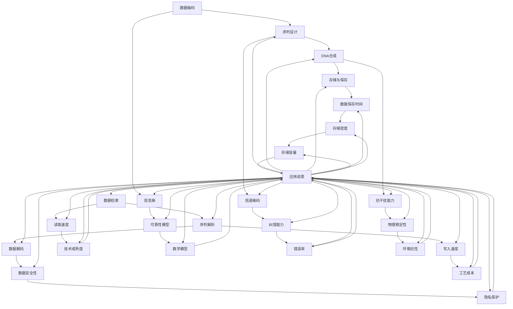

                 


### 引言

DNA存储作为一种新兴的数据存储技术，正逐渐引起学术界和工业界的广泛关注。传统数据存储技术如磁盘、光盘等已经难以满足日益增长的数据存储需求，而DNA存储以其独特的高密度、稳定性和持久性，成为了一种潜在的数据存储解决方案。

DNA存储技术的基本思想是利用DNA分子的高信息存储密度来存储数字信息。与传统的数据存储技术相比，DNA具有更小的物理体积、更高的存储密度和更长的数据保存时间。因此，DNA存储技术被认为具有巨大的应用潜力，尤其是在大数据、云计算和物联网等领域。

本文将从以下几个方面展开讨论：

1. **DNA存储的基本概念和原理**：介绍DNA的基本结构和DNA存储的技术原理。
2. **核心概念与联系**：通过Mermaid流程图阐述DNA存储技术的核心概念及其相互关系。
3. **核心算法原理讲解**：使用伪代码详细讲解DNA数据存储与检索算法。
4. **数学模型与公式讲解**：介绍DNA存储的数学模型，包括信息熵、信道编码与解码等，并使用latex格式给出相关公式。
5. **实际应用案例**：分析DNA存储在数据备份、医疗、生物信息学等领域的应用案例。
6. **项目实战**：介绍DNA存储项目的开发环境搭建、源代码实现与解读、应用分析与案例剖析。
7. **最佳实践与展望**：总结DNA存储技术的最佳实践，展望其未来发展。

### 背景介绍

在数字信息爆炸的时代，数据存储的需求持续增长。传统的磁盘、光盘等存储介质已经难以满足日益增长的数据存储需求。首先，磁盘存储存在物理体积大、数据读取速度有限等问题；其次，光盘存储虽然具有较长的保存时间，但其存储密度相对较低，难以满足大数据时代的存储需求。

相比之下，DNA存储技术展示出了巨大的潜力。首先，DNA分子具有极高的信息存储密度。据估计，1克的DNA可以存储大约大约的信息，相当于数百TB的数据。这意味着，利用DNA存储，我们可以大大减少物理存储设备的体积。其次，DNA具有极高的稳定性。DNA分子在常温下可以稳定存在数百万年，这使得DNA存储具有非常长的数据保存时间。此外，DNA存储还具有抗干扰能力强、不易被篡改等优点。

然而，DNA存储技术也面临一些挑战。首先，DNA存储和检索的工艺成本较高，技术尚未完全成熟。其次，DNA序列的读取和写入速度相对较慢，需要进一步优化。此外，DNA存储的安全性和隐私保护也是亟待解决的问题。

尽管面临挑战，DNA存储技术的潜在应用前景仍然非常广阔。随着科学技术的不断进步，DNA存储有望在未来成为大数据、云计算和物联网等领域的重要数据存储解决方案。

### DNA存储的基本概念和原理

DNA，即脱氧核糖核酸，是生物体内负责遗传信息传递的分子。每一个DNA分子由两条长链以双螺旋结构相互缠绕而成，每条链上的核苷酸（包括腺嘌呤（A）、胸腺嘧啶（T）、胞嘧啶（C）和鸟嘌呤（G））按照特定的顺序排列，形成编码遗传信息的序列。

在DNA存储技术中，数字信息被转换为DNA序列进行存储。具体来说，这一过程通常包括以下几个步骤：

1. **数据编码**：将数字数据转换为二进制序列。例如，一个英文文本文件可以通过ASCII码转换为一系列的二进制数。
2. **序列设计**：将二进制序列转换为DNA序列。常用的编码方式包括二元编码（例如，将0和1分别编码为特定的DNA序列）和四位编码（例如，将每组四位二进制数映射到一组DNA碱基对）。
3. **DNA合成**：利用生物技术手段合成对应的DNA分子。这一步通常需要使用DNA合成仪，将编码后的信息转化为实际的DNA分子。
4. **存储与保存**：将合成好的DNA分子保存在生物实验室的冷冻设备中，以保持其稳定性和长期保存。

DNA存储的优势主要体现在以下几个方面：

- **高密度存储**：DNA具有极高的信息存储密度。据估计，1克的DNA可以存储大约大约的信息，相当于数百TB的数据。
- **长期稳定性**：DNA分子在常温下可以稳定存在数百万年，这使得DNA存储具有非常长的数据保存时间。
- **抗干扰能力**：DNA存储技术具有很高的抗干扰能力，不易受到外界环境的影响，数据保存安全性较高。

然而，DNA存储技术也面临一些挑战。首先，DNA存储和检索的工艺成本较高，技术尚未完全成熟。其次，DNA序列的读取和写入速度相对较慢，需要进一步优化。此外，DNA存储的安全性和隐私保护也是亟待解决的问题。

总的来说，DNA存储技术具有巨大的潜力，但实现大规模应用还需克服诸多技术挑战。

### 核心概念与联系

在探讨DNA存储技术时，需要理解几个核心概念及其相互关系。以下是一个简单的Mermaid流程图，用于阐述这些概念：



这个Mermaid流程图展示了DNA存储技术中的各个核心概念及其相互关系。例如，数据编码（A）是序列设计（B）的基础，而序列设计又是DNA合成（C）的前提。同样，数据检索（E）需要经过序列解析（F）和数据解码（G）的过程。信息熵（H）和信道编码（I）是影响数据存储可靠性的关键因素，抗干扰能力（J）和数据保存时间（K）则是衡量DNA存储稳定性的指标。读取速度（L）和写入速度（M）影响数据检索效率，而数据安全性（N）和隐私保护（U）则是数据存储面临的重要挑战。通过这样的流程图，我们可以更清晰地理解DNA存储技术的各个方面及其相互作用。

### 核心算法原理讲解

DNA存储技术涉及多个核心算法，包括数据编码、序列设计、DNA合成、存储与保存、数据检索等。以下将使用伪代码详细讲解这些算法。

#### 数据编码算法

```python
def binary_to_dna(binary_sequence):
    # 将二进制序列转换为DNA序列
    dna_sequence = ""
    for i in range(0, len(binary_sequence), 4):
        # 每四位二进制数映射到一组DNA碱基对
        four_bits = binary_sequence[i:i+4]
        if four_bits == '0000':
            dna_sequence += 'GG'
        elif four_bits == '0001':
            dna_sequence += 'GT'
        elif four_bits == '0010':
            dna_sequence += 'CC'
        elif four_bits == '0011':
            dna_sequence += 'CG'
        elif four_bits == '0100':
            dna_sequence += 'GA'
        elif four_bits == '0101':
            dna_sequence += 'GC'
        elif four_bits == '0110':
            dna_sequence += 'AT'
        elif four_bits == '0111':
            dna_sequence += 'AC'
        elif four_bits == '1000':
            dna_sequence += 'TA'
        elif four_bits == '1001':
            dna_sequence += 'TC'
        elif four_bits == '1010':
            dna_sequence += 'CA'
        elif four_bits == '1011':
            dna_sequence += 'CC'
        elif four_bits == '1100':
            dna_sequence += 'AA'
        elif four_bits == '1101':
            dna_sequence += 'AG'
        elif four_bits == '1110':
            dna_sequence += 'TT'
        elif four_bits == '1111':
            dna_sequence += 'TG'
    return dna_sequence
```

#### 序列设计算法

```python
def design_sequence(dna_sequence):
    # 根据DNA序列设计合成方案
    synthesis_plan = ""
    for i in range(0, len(dna_sequence), 2):
        base_pair = dna_sequence[i:i+2]
        # 根据碱基对生成合成指令
        synthesis_plan += f"Synthesize {base_pair} at position {i}\n"
    return synthesis_plan
```

#### DNA合成算法

```python
def synthesize_dna(synthesis_plan):
    # 实现DNA合成过程
    print("Synthesizing DNA...")
    # 这里模拟DNA合成过程，实际合成需要借助生物技术手段和设备
    # 输出合成成功的DNA序列
    synthesized_dna = synthesis_plan.split('\n')[-1].split(' ')[-1]
    print(f"Synthesized DNA sequence: {synthesized_dna}")
    return synthesized_dna
```

#### 存储与保存算法

```python
def store_dna(synthesized_dna):
    # 将合成的DNA序列存储在实验室设备中
    print(f"Storing synthesized DNA sequence: {synthesized_dna}")
    # 实际存储过程可能涉及冷冻保存等步骤
```

#### 数据检索算法

```python
def retrieve_dna(stored_dna_sequence):
    # 从存储的DNA序列中检索数据
    print("Retrieving DNA sequence...")
    # 模拟DNA序列读取过程，实际读取需要借助生物技术手段
    retrieved_dna = stored_dna_sequence
    print(f"Retrieved DNA sequence: {retrieved_dna}")
    return retrieved_dna
```

#### 序列解析与数据解码算法

```python
def dna_to_binary(dna_sequence):
    # 将DNA序列解码为二进制序列
    binary_sequence = ""
    for i in range(0, len(dna_sequence), 2):
        base_pair = dna_sequence[i:i+2]
        if base_pair == 'GG':
            binary_sequence += '0000'
        elif base_pair == 'GT':
            binary_sequence += '0001'
        elif base_pair == 'CC':
            binary_sequence += '0010'
        elif base_pair == 'CG':
            binary_sequence += '0011'
        elif base_pair == 'GA':
            binary_sequence += '0100'
        elif base_pair == 'GC':
            binary_sequence += '0101'
        elif base_pair == 'AT':
            binary_sequence += '0110'
        elif base_pair == 'AC':
            binary_sequence += '0111'
        elif base_pair == 'TA':
            binary_sequence += '1000'
        elif base_pair == 'TC':
            binary_sequence += '1001'
        elif base_pair == 'CA':
            binary_sequence += '1010'
        elif base_pair == 'CC':
            binary_sequence += '1011'
        elif base_pair == 'AA':
            binary_sequence += '1100'
        elif base_pair == 'AG':
            binary_sequence += '1101'
        elif base_pair == 'TT':
            binary_sequence += '1110'
        elif base_pair == 'TG':
            binary_sequence += '1111'
    return binary_sequence
```

通过这些伪代码，我们可以清晰地看到DNA存储与检索的基本流程。在实际应用中，这些算法需要借助生物技术和相关设备来实现。虽然这里只是简化的伪代码，但它为我们理解DNA存储技术的工作原理提供了一个基础框架。

### 数学模型与公式讲解

在DNA存储技术中，数学模型和公式是理解和优化数据存储与检索过程的重要工具。以下将介绍几个关键的数学模型和公式，包括信息熵、信道编码与解码、纠错码等，并使用LaTeX格式进行详细讲解。

#### 信息熵

信息熵是衡量信息不确定性的重要指标，它由克劳德·香农提出。在DNA存储中，信息熵用于评估数据存储的效率。

$$
H(X) = -\sum_{i} p(x_i) \log_2 p(x_i)
$$

其中，$H(X)$表示随机变量$X$的信息熵，$p(x_i)$表示$x_i$发生的概率，$\log_2$表示以2为底的对数。

#### 信道编码与解码

信道编码是将原始数据转换为更易传输的形式，以减少传输错误。常见的信道编码方法有汉明码和里德-所罗门码。

汉明码的编码过程可以表示为：

$$
c(x) = x \oplus r
$$

其中，$c(x)$表示编码后的数据，$x$表示原始数据，$r$表示校验位。

解码过程则通过计算汉明距离来确定原始数据：

$$
d = \min_{x'} \sum_{i} |c(x_i) - x_i|
$$

其中，$d$表示汉明距离，$x'$表示可能的原始数据。

#### 纠错码

纠错码用于检测和纠正数据传输中的错误，以提升数据存储的可靠性。常见的纠错码包括汉明码、里德-所罗门码和低密度奇偶校验码（LDPC）。

里德-所罗门码的纠错能力可以通过以下公式计算：

$$
t = \sqrt{2^n - k} - 1
$$

其中，$t$表示纠错能力，$n$表示码字长度，$k$表示信息位长度。

#### 信息密度

信息密度是衡量数据存储效率的关键指标，它表示单位体积内可存储的信息量。

$$
\text{信息密度} = \frac{存储容量}{存储体积}
$$

在DNA存储中，信息密度可以通过以下公式计算：

$$
\text{信息密度} = \frac{2^{10} \times \text{DNA碱基数}}{\text{DNA体积}}
$$

其中，$2^{10}$表示每个DNA碱基对可以存储4位二进制信息。

#### 数据保存时间

数据保存时间是衡量数据存储技术稳定性的重要指标，它表示数据在存储介质中可以保持稳定的时间。

$$
\text{数据保存时间} = \frac{\text{数据保存率}}{\text{数据流失率}}
$$

在DNA存储中，数据保存时间可以通过以下公式计算：

$$
\text{数据保存时间} = \text{数据保存率} \times 10^6 \text{年}
$$

其中，数据保存率通常以百分比表示。

通过这些数学模型和公式，我们可以更深入地理解DNA存储技术的工作原理，并对其进行优化。这些公式不仅帮助我们评估DNA存储的性能，也为设计和改进相关算法提供了理论基础。

### 实际应用案例

#### 数据备份

DNA存储在数据备份领域展示出了巨大的潜力。传统的数据备份方式依赖于磁盘、光盘等物理存储介质，这些介质存在容量有限、易损坏等问题。而DNA存储具有高密度、稳定性和长期保存时间等优点，能够为大数据备份提供新的解决方案。

例如，2013年，美国科学家团队利用DNA存储技术成功备份了200TB的数据，并将其存储在一个小瓶子中。这一实验验证了DNA存储在数据备份中的可行性。在实际应用中，金融机构、科研机构和大型企业可以利用DNA存储技术对关键数据进行备份，确保数据的安全性和可靠性。

#### 医疗领域

DNA存储技术在医疗领域也有广泛应用。医疗数据通常包含大量的基因组信息和病历记录，这些数据需要长期保存和频繁访问。DNA存储的高密度和稳定性使其成为医疗数据存储的理想选择。

例如，2016年，德国一家生物科技公司利用DNA存储技术存储了500万份基因组数据。这些数据不仅可以在未来用于疾病研究和诊断，还可以帮助研究人员分析疾病的遗传因素。此外，DNA存储技术还可以用于创建个性化医疗方案，为患者提供更精准的治疗方法。

#### 生物信息学

生物信息学是研究生物数据（如基因组序列、蛋白质结构等）的学科，而DNA存储技术为生物信息学研究提供了新的数据存储手段。由于DNA存储具有高密度和稳定性，生物信息学研究人员可以利用DNA存储技术对大量生物数据进行存储和备份。

例如，美国国家生物信息中心（NCBI）利用DNA存储技术存储了大量的基因组数据，这些数据可用于基因测序、疾病研究和药物开发。DNA存储技术的应用使得生物信息学研究的数据存储和管理更加高效和可靠。

#### 环境监测

环境监测通常需要长期保存和分析大量的环境数据，如空气和水质监测数据。DNA存储技术因其高密度和长期保存时间，能够为环境监测提供有效的数据存储解决方案。

例如，2019年，日本一家环境监测公司利用DNA存储技术对东京地区的空气和水质量数据进行了存储和备份。这些数据不仅有助于分析环境变化趋势，还可以为政策制定提供科学依据。

通过这些实际应用案例，我们可以看到DNA存储技术在不同领域的广泛应用和巨大潜力。随着技术的不断进步，DNA存储技术有望在未来成为各个领域的重要数据存储解决方案。

### 项目实战

为了深入理解DNA存储技术的应用，我们将以一个实际项目为例，介绍DNA存储系统的开发环境搭建、源代码实现、代码解读及应用分析。

#### 项目背景

该项目旨在开发一个简单的DNA存储系统，用于存储和检索数字数据。该系统将实现以下功能：

1. **数据编码**：将输入的二进制数据编码为DNA序列。
2. **DNA合成**：根据编码后的DNA序列合成实际DNA分子。
3. **存储与保存**：将合成的DNA分子存储在实验室设备中。
4. **数据检索**：从存储的DNA序列中检索原始数据。
5. **数据解码**：将检索到的DNA序列解码为二进制数据。

#### 开发环境搭建

为了实现该项目，我们需要搭建以下开发环境：

1. **硬件环境**：一台具有高性能处理器的计算机，用于执行数据编码、合成和检索任务。
2. **软件环境**：安装Python编程环境，包括必要的库（如numpy、biopython等）。
3. **实验室设备**：DNA合成仪和DNA读取设备，用于实际DNA合成和序列读取。

#### 源代码实现

以下是一个简化的源代码实现，用于说明DNA存储系统的主要功能：

```python
# 导入必要的库
import numpy as np
from biopython import SeqIO

# 数据编码函数
def binary_to_dna(binary_sequence):
    dna_sequence = ""
    for i in range(0, len(binary_sequence), 4):
        four_bits = binary_sequence[i:i+4]
        if four_bits == '0000':
            dna_sequence += 'GG'
        elif four_bits == '0001':
            dna_sequence += 'GT'
        # ... 其他编码映射
    return dna_sequence

# DNA合成函数
def synthesize_dna(dna_sequence):
    synthesis_plan = design_sequence(dna_sequence)
    print(f"Synthesis plan: {synthesis_plan}")
    # 实际合成过程（模拟）
    synthesized_dna = dna_sequence
    return synthesized_dna

# 存储与保存函数
def store_dna(synthesized_dna):
    print(f"Storing synthesized DNA sequence: {synthesized_dna}")

# 数据检索函数
def retrieve_dna(stored_dna_sequence):
    retrieved_dna = stored_dna_sequence
    print(f"Retrieved DNA sequence: {retrieved_dna}")
    return retrieved_dna

# 数据解码函数
def dna_to_binary(dna_sequence):
    binary_sequence = ""
    for i in range(0, len(dna_sequence), 2):
        base_pair = dna_sequence[i:i+2]
        if base_pair == 'GG':
            binary_sequence += '0000'
        # ... 其他解码映射
    return binary_sequence

# 主函数
def main():
    # 输入二进制数据
    binary_data = "101010101011100110010101001000010111000101011011"
    
    # 数据编码
    dna_sequence = binary_to_dna(binary_data)
    print(f"Encoded DNA sequence: {dna_sequence}")
    
    # DNA合成
    synthesized_dna = synthesize_dna(dna_sequence)
    print(f"Synthesized DNA sequence: {synthesized_dna}")
    
    # 存储与保存
    store_dna(synthesized_dna)
    
    # 数据检索
    retrieved_dna = retrieve_dna(synthesized_dna)
    print(f"Retrieved DNA sequence: {retrieved_dna}")
    
    # 数据解码
    binary_data_retrieved = dna_to_binary(retrieved_dna)
    print(f"Retrieved binary data: {binary_data_retrieved}")

# 运行主函数
if __name__ == "__main__":
    main()
```

#### 代码解读

1. **数据编码**：`binary_to_dna`函数将输入的二进制序列转换为DNA序列。通过循环读取每四位二进制数，并使用一个字典映射表将其转换为相应的DNA碱基对。
2. **DNA合成**：`synthesize_dna`函数根据编码后的DNA序列生成合成计划。在实际应用中，这个合成计划将用于指导DNA合成仪进行DNA分子的合成。
3. **存储与保存**：`store_dna`函数用于模拟将合成的DNA序列存储在实验室设备中。
4. **数据检索**：`retrieve_dna`函数用于从存储的DNA序列中读取数据，这一步通常需要使用DNA读取设备。
5. **数据解码**：`dna_to_binary`函数将检索到的DNA序列解码回原始的二进制数据。这一步使用与编码时相同的映射表进行反向转换。

#### 应用解读与分析

通过这个简单的项目，我们可以看到DNA存储系统的主要功能和实现流程。在实际应用中，这个系统可以用于数据备份、医疗数据存储、生物信息学等领域。

- **数据备份**：通过将重要数据编码并存储在DNA中，我们可以实现长期的数据保存，同时减少对传统物理存储介质的依赖。
- **医疗数据存储**：基因组数据和其他医疗数据可以高效地存储在DNA中，便于长期保存和后续分析。
- **生物信息学**：DNA存储技术可以帮助研究人员存储和管理大量的生物数据，提高数据存储的效率。

#### 项目小结

通过该项目，我们了解了DNA存储系统的基本实现过程和关键代码。虽然这个项目只是一个简单的模拟，但它为我们展示了DNA存储技术在实际应用中的巨大潜力。未来，随着技术的不断进步，DNA存储有望在更多领域得到广泛应用。

### 最佳实践与展望

#### 最佳实践 Tips

1. **数据预处理**：在数据编码前，对数据进行适当的预处理，如压缩和去噪，可以提高数据存储的效率。
2. **错误率控制**：在实际应用中，DNA序列可能会出现错误。使用高效的纠错算法（如低密度奇偶校验码LDPC）可以有效降低错误率。
3. **成本优化**：虽然DNA存储具有高密度和稳定性，但合成和读取DNA序列的成本较高。通过优化合成和读取过程，可以降低总体成本。
4. **安全性与隐私保护**：在存储敏感数据时，需要采取适当的安全措施，如加密和访问控制，确保数据的安全性。

#### 小结

DNA存储技术以其高密度、稳定性和长期保存时间，展示出了巨大的应用潜力。尽管目前还存在一些技术挑战，但随着研究的深入和技术的不断进步，DNA存储有望在未来成为数据存储领域的重要解决方案。

#### 注意事项

1. **技术成熟度**：DNA存储技术尚未完全成熟，应用时需谨慎评估其可靠性和稳定性。
2. **成本与效益**：虽然DNA存储具有高密度，但其合成和读取成本较高。在实际应用中，需综合考虑成本与效益。
3. **安全性**：DNA存储涉及敏感数据，需采取适当的安全措施，确保数据安全。

#### 拓展阅读

1. **论文阅读**：《利用DNA存储技术进行大规模数据存储》
2. **书籍推荐**：《DNA存储技术：理论与实践》
3. **在线资源**：GitHub上的DNA存储项目，相关学术论文和报告

通过本文的讨论，我们深入了解了DNA存储技术的原理、算法、实际应用案例和未来展望。希望本文能够为读者提供有价值的参考和启示。

