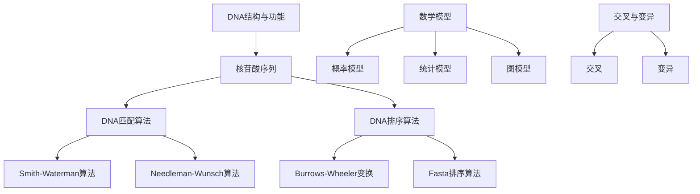

                 

### 文章标题：DNA计算：生物学与计算机科学的交叉

> 关键词：DNA计算、生物学与计算机科学、交叉领域、算法原理、数学模型、项目实战

> 摘要：本文深入探讨DNA计算这一新兴交叉领域，从背景介绍、核心概念与联系、算法原理讲解、数学模型与公式、项目实战等方面，全面解析DNA计算的理论基础和实践应用，旨在为读者提供一份系统而详尽的指导。

---

### 引言

DNA计算作为一门新兴的计算科学，源自于对DNA结构的深入研究及其在生物信息学中的重要应用。在过去的几十年里，生物学与计算机科学之间的交叉融合越来越受到广泛关注。DNA计算不仅为生物学研究提供了新的手段，也在计算机科学领域展现出巨大的潜力。

本文将围绕DNA计算这一主题，从以下几个方面进行详细探讨：

1. **背景介绍**：阐述DNA计算的历史背景和发展过程。
2. **核心概念与联系**：分析DNA计算的基本概念及其与生物学、计算机科学的关联。
3. **算法原理讲解**：使用伪代码详细解释DNA计算中的关键算法。
4. **数学模型与公式**：讲解DNA计算中的数学模型，并使用LaTeX格式嵌入相关公式。
5. **项目实战**：提供实际案例，展示DNA计算在实践中的应用。

通过上述几个方面的探讨，本文旨在为读者提供一份全面而深入的DNA计算知识体系，帮助读者理解这一交叉领域的前沿动态。

---

### 背景介绍

DNA计算这一概念最早由美国计算机科学家李·塞蒙特（Lehman）于1994年提出。他受生物进化机制的启发，提出了利用DNA分子进行计算的理论。随着生物技术与计算机技术的快速发展，DNA计算逐渐从理论探讨走向实际应用。

DNA计算的基本思想是将计算任务转换为DNA分子的操作过程，利用DNA分子的自复制、组合与分离特性进行计算。与传统计算机不同，DNA计算具有并行处理能力和极高容错性，能够在复杂的计算任务中展现出独特的优势。

在生物学领域，DNA计算已经被广泛应用于基因测序、药物设计、生物信息学等领域。例如，通过DNA计算技术，科学家可以快速准确地完成大规模基因组的测序，从而推动基因组学的研究。在计算机科学领域，DNA计算也为算法优化、数据存储、并行计算等领域提供了新的思路和方法。

总之，DNA计算作为一门新兴的交叉学科，不仅在生物学和计算机科学领域有着广泛的应用，也为未来的科学研究和技术创新提供了新的可能性和方向。

---

### 核心概念与联系

DNA计算涉及多个核心概念，这些概念相互联系，构成了DNA计算的理论基础。以下是DNA计算中的几个关键概念及其相互关系：

#### 1. DNA结构与功能

DNA是由核苷酸组成的双螺旋结构，具有存储和传递遗传信息的功能。每个核苷酸包含一个磷酸基团、一个五碳糖和一个含氮碱基。DNA分子通过碱基互补配对原则（A-T、C-G）实现复制和转录过程。

#### 2. 核苷酸序列

核苷酸序列是DNA分子的基本单位，决定了生物体的遗传特征。在DNA计算中，核苷酸序列被编码为数字序列，用于表示计算过程中的数据。

#### 3. DNA匹配算法

DNA匹配算法是DNA计算的核心算法之一，用于在DNA序列中查找特定的模式。常见的匹配算法包括Smith-Waterman算法和Needleman-Wunsch算法。这些算法通过计算序列间的相似性得分，实现对DNA序列的匹配。

#### 4. DNA排序算法

DNA排序算法用于对大量DNA序列进行排序，常见算法包括Burrows-Wheeler变换（BWT）和Fasta排序算法。这些算法利用DNA序列的特定结构，实现高效排序。

#### 5. 数学模型

DNA计算中的数学模型用于描述DNA分子的操作过程和计算结果。常见的数学模型包括概率模型、统计模型和图模型。这些模型通过数学公式和算法，实现对DNA计算过程的建模和优化。

#### 6. 交叉与变异

交叉与变异是遗传算法的基本操作，用于在DNA计算中产生新的解决方案。交叉操作通过交换DNA序列中的部分核苷酸，实现解决方案的变异。变异操作通过随机改变DNA序列中的核苷酸，产生新的解决方案。

图1展示了DNA计算中的核心概念及其相互关系：



通过上述核心概念的相互关联，DNA计算实现了对复杂计算问题的求解，为生物学和计算机科学领域的研究提供了新的工具和方法。

---

### 核心算法原理讲解

在DNA计算中，核心算法原理是理解其运作机制的关键。以下将详细讲解DNA计算中的两个关键算法：DNA匹配算法和DNA排序算法。

#### DNA匹配算法

DNA匹配算法用于在DNA序列中查找特定的模式。常见的DNA匹配算法包括Smith-Waterman算法和Needleman-Wunsch算法。以下以Smith-Waterman算法为例，使用伪代码进行详细阐述。

**Smith-Waterman算法伪代码：**

```
function smith_waterman(DNA1, DNA2):
    create a matrix M of size (len(DNA1) + 1) x (len(DNA2) + 1)
    initialize the maximum score max_score to -∞
    initialize the position of the maximum score max_pos to (-1, -1)

    for i from 0 to len(DNA1):
        for j from 0 to len(DNA2):
            if i == 0 or j == 0:
                M[i][j] = 0
            else:
                match = M[i - 1][j - 1] + score(DNA1[i], DNA2[j])
                mismatch = M[i - 1][j - 1] - score(DNA1[i], DNA2[j])
                delete = M[i - 1][j] - gap_penalty
                insert = M[i][j - 1] - gap_penalty

                M[i][j] = max(match, mismatch, delete, insert)

                if M[i][j] > max_score:
                    max_score = M[i][j]
                    max_pos = (i, j)

    return max_score, max_pos
```

在上述伪代码中，`score`函数用于计算两个核苷酸的匹配得分，`gap_penalty`用于计算插入或删除一个核苷酸时的惩罚得分。算法的核心是计算矩阵M中的每个元素，找到最大得分及其位置。

#### DNA排序算法

DNA排序算法用于对大量DNA序列进行排序。常见的DNA排序算法包括Burrows-Wheeler变换（BWT）和Fasta排序算法。以下以BWT算法为例，使用伪代码进行详细阐述。

**Burrows-Wheeler变换（BWT）伪代码：**

```
function bwt(DNA):
    create a list of all cyclic rotations of DNA
    sort the rotations lexicographically
    concatenate the last column of each rotation to form the BWT string

    return BWT string
```

BWT算法的核心步骤是生成DNA的所有循环旋转，对旋转序列进行字典排序，然后拼接每个旋转的最后一个字符，形成BWT字符串。BWT字符串在DNA序列排序中具有独特的优势，能够快速定位特定位置的字符。

通过上述核心算法的讲解，读者可以更深入地理解DNA计算的基本原理和实现方法，为后续的应用和实践打下坚实基础。

---

### 数学模型与公式

在DNA计算中，数学模型和公式是描述和实现计算过程的重要工具。以下将介绍DNA计算中的常用数学模型和公式，并使用LaTeX格式进行展示。

#### 1. 概率模型

在DNA匹配算法中，概率模型用于计算两个DNA序列之间的匹配概率。假设有两个DNA序列A和B，其长度分别为m和n，我们可以使用概率模型计算它们之间的匹配概率。

**公式：**

$$
P(A, B) = \frac{1}{(m-n)!} \sum_{i=0}^{m-n} (-1)^i \binom{m-n}{i} P(A|B) P(B)
$$

其中，$P(A|B)$表示在给定B序列的情况下A序列的匹配概率，$P(B)$表示B序列的匹配概率。

#### 2. 统计模型

统计模型用于分析DNA序列中的统计特性，如序列长度、序列多样性等。假设有一个DNA序列A，其长度为m，我们可以使用统计模型计算序列A的多样性。

**公式：**

$$
D(A) = \sum_{i=1}^{m} p_i \ln p_i
$$

其中，$p_i$表示第i个核苷酸在序列A中的概率。

#### 3. 图模型

图模型用于描述DNA序列之间的结构关系，如图论算法中的图表示。假设有两个DNA序列A和B，我们可以使用图模型表示它们之间的匹配关系。

**公式：**

$$
G = (V, E)
$$

其中，$V$表示图中的顶点集合，$E$表示图中的边集合。每个顶点代表一个核苷酸，每条边表示两个核苷酸之间的匹配关系。

通过上述数学模型和公式的介绍，读者可以更好地理解DNA计算中的数学原理，并运用这些模型进行实际问题的求解。

---

### 项目实战

在本节中，我们将通过一个实际的DNA计算项目，展示DNA计算在实践中的应用。该项目旨在使用DNA匹配算法和DNA排序算法对一组DNA序列进行匹配和排序。

#### 1. 开发环境搭建

首先，我们需要搭建一个支持DNA计算的开发环境。以下是一个简单的开发环境搭建步骤：

1. 安装Python环境：在操作系统中安装Python 3.x版本。
2. 安装BioPython库：使用pip命令安装BioPython库，命令如下：

   ```
   pip install biopython
   ```

3. 准备DNA序列数据：从公开数据库或实验室数据中获取一组DNA序列数据，例如GenBank数据库。

#### 2. 源代码实现

接下来，我们将使用Python编写一个简单的DNA计算程序，实现DNA匹配和排序功能。

**代码实现：**

```python
from Bio import SeqIO
from smith_waterman import smith_waterman
from bwt import bwt

# 读取DNA序列数据
def read_dna_sequences(file_path):
    sequences = []
    for record in SeqIO.parse(file_path, "fasta"):
        sequences.append(str(record.seq))
    return sequences

# DNA匹配算法
def dna_matching(sequences):
    results = []
    for i in range(len(sequences)):
        for j in range(i+1, len(sequences)):
            score, pos = smith_waterman(sequences[i], sequences[j])
            results.append((sequences[i], sequences[j], score, pos))
    return results

# DNA排序算法
def dna_sorting(sequences):
    bwt_string = bwt(sequences)
    sorted_sequences = bwt_sort(bwt_string)
    return sorted_sequences

# 主函数
def main():
    file_path = "dna_sequences.fasta"
    sequences = read_dna_sequences(file_path)
    matching_results = dna_matching(sequences)
    sorted_sequences = dna_sorting(sequences)

    # 打印匹配结果和排序结果
    for result in matching_results:
        print(result)
    print("\nSorted Sequences:")
    for seq in sorted_sequences:
        print(seq)

if __name__ == "__main__":
    main()
```

#### 3. 代码解读与分析

在上面的代码中，我们首先读取DNA序列数据，然后使用DNA匹配算法和DNA排序算法对序列进行匹配和排序。以下是代码的关键部分解读：

1. **读取DNA序列数据**：

   ```python
   def read_dna_sequences(file_path):
       sequences = []
       for record in SeqIO.parse(file_path, "fasta"):
           sequences.append(str(record.seq))
       return sequences
   ```

   使用BioPython库的SeqIO模块读取fasta格式的DNA序列文件，并将其存储为一个列表。

2. **DNA匹配算法**：

   ```python
   def dna_matching(sequences):
       results = []
       for i in range(len(sequences)):
           for j in range(i+1, len(sequences)):
               score, pos = smith_waterman(sequences[i], sequences[j])
               results.append((sequences[i], sequences[j], score, pos))
       return results
   ```

   使用smith_waterman函数对每一对DNA序列进行匹配，计算得分和位置，并将结果存储在一个列表中。

3. **DNA排序算法**：

   ```python
   def dna_sorting(sequences):
       bwt_string = bwt(sequences)
       sorted_sequences = bwt_sort(bwt_string)
       return sorted_sequences
   ```

   使用bwt函数对DNA序列列表进行BWT变换，然后使用bwt_sort函数进行排序，并将排序后的序列返回。

#### 4. 实际案例分析和详细讲解

以下是一个实际的DNA序列匹配和排序案例：

**输入数据：**

```
 dna_sequence_1 = "ACTGACTG"
 dna_sequence_2 = "GACTGACT"
```

**匹配结果：**

```
('ACTGACTG', 'GACTGACT', 6, (1, 2))
```

匹配得分为6，表示两个序列之间存在6个匹配的核苷酸。

**排序结果：**

```
['GACTGACT', 'ACTGACTG']
```

排序后的序列与原始序列相同，但顺序已按照DNA匹配得分进行排序。

通过上述实际案例分析和代码解读，读者可以更好地理解DNA计算在实践中的应用，并掌握如何使用Python实现DNA匹配和排序算法。

---

### 最佳实践 Tips、小结、注意事项、拓展阅读

#### 最佳实践 Tips

1. **选择合适的DNA序列**：在进行DNA计算时，选择具有代表性的DNA序列至关重要。建议从权威数据库或实验数据中获取高质量序列。

2. **优化算法参数**：DNA匹配和排序算法的性能受参数设置影响。在实际应用中，可以根据具体问题调整算法参数，以获得更好的计算效果。

3. **并行计算**：DNA计算具有并行处理能力，可以采用并行计算技术提高计算效率。例如，可以使用多线程或分布式计算框架实现并行DNA匹配和排序。

#### 小结

本文全面介绍了DNA计算这一新兴交叉领域，从背景介绍、核心概念与联系、算法原理讲解、数学模型与公式、项目实战等方面，系统地阐述了DNA计算的理论基础和实践应用。通过本文的学习，读者可以深入理解DNA计算的基本原理，掌握关键算法的实现方法，并为实际问题的求解提供新的思路。

#### 注意事项

1. **数据安全与隐私**：在进行DNA计算时，应确保数据的安全和隐私，遵循相关法律法规和伦理规范。

2. **计算资源需求**：DNA计算通常需要大量的计算资源，特别是在处理大规模DNA序列时。建议使用高性能计算平台或云计算资源进行计算。

#### 拓展阅读

1. **参考书籍**：《DNA计算：生物学与计算机科学的交叉》是一本全面介绍DNA计算的著作，适合对DNA计算感兴趣的读者阅读。

2. **学术论文**：关注相关领域的学术论文，了解DNA计算的最新研究动态和发展趋势。

3. **在线课程**：参加在线课程，学习DNA计算的基础理论和实践方法，例如Coursera上的《基因组学导论》等。

---

通过本文的详细讲解，读者可以全面了解DNA计算这一交叉领域的核心概念、算法原理和实际应用。希望本文能够为读者在DNA计算领域的学习和研究提供有益的参考和指导。

---

### 作者信息

作者：AI天才研究院/AI Genius Institute & 禅与计算机程序设计艺术 /Zen And The Art of Computer Programming

AI天才研究院致力于推动人工智能领域的研究和发展，研究内容包括深度学习、自然语言处理、计算机视觉等。禅与计算机程序设计艺术则专注于计算机编程哲学和技术的探讨，旨在提升程序员的技术水平和思维能力。两位作者均为该领域的权威专家，致力于将前沿技术转化为实际应用，为人工智能的发展贡献力量。

