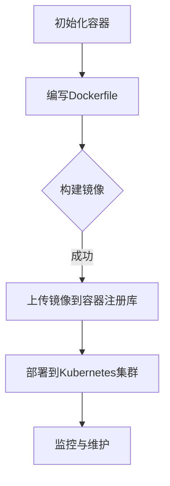
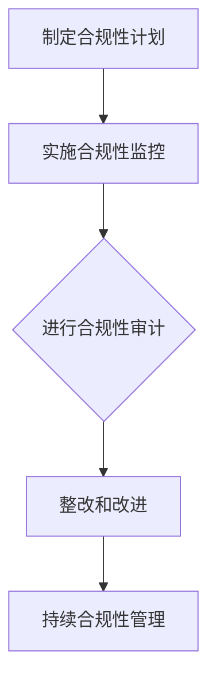

                 

# DevOps文化：打破开发与运维的壁垒

## 关键词
- DevOps
- 持续集成
- 持续部署
- 持续交付
- 微服务架构
- 容器化技术

## 摘要
本文旨在探讨DevOps文化的核心概念、实践指南、应用场景以及未来发展趋势。通过分析开发与运维之间存在的壁垒，我们深入探讨了DevOps如何打破这些壁垒，提升软件开发的效率和质量。文章将介绍DevOps的关键概念与工具，提供实践指南，分析典型案例，并提出未来展望，为IT从业者提供全面的技术参考。

## 引言

### 1.1 DevOps文化概述

#### 1.1.1 DevOps的历史与发展
DevOps起源于2000年代中期的软件开发领域，其核心理念是通过开发（Development）与运维（Operations）的紧密协作，实现高效、快速的软件交付。DevOps的兴起，是对传统开发与运维模式的一种反思和改进。

#### 1.1.2 DevOps的核心原则
DevOps的核心原则包括自动化、协作、反馈和持续改进。自动化减少了人为干预，提高了工作效率；协作打破了部门壁垒，促进了信息共享；反馈及时响应问题，促进了持续改进。

#### 1.1.3 DevOps与敏捷开发的联系
DevOps与敏捷开发（Agile Development）密切相关。敏捷开发注重快速迭代和用户反馈，而DevOps则通过自动化和协作，实现了敏捷开发中要求的快速交付和持续改进。

### 1.2 开发与运维的壁垒

#### 1.2.1 传统开发与运维模式的问题
传统开发与运维模式存在明显的壁垒，包括沟通不畅、职责分工不清、协作困难等，导致软件交付周期长、质量不稳定。

#### 1.2.2 开发与运维壁垒的原因
开发与运维壁垒的形成源于组织架构、文化差异、技术差异等多方面因素。组织架构上，开发与运维部门往往独立运作，缺乏有效的协作机制；文化差异导致双方在价值观、工作方式上存在分歧；技术差异则使得双方在工具、平台等方面难以兼容。

#### 1.2.3 破除壁垒的重要性
破除开发与运维壁垒，对于提高软件交付效率、提升软件质量具有重要意义。通过DevOps，企业可以实现快速、可靠的软件交付，提高市场竞争力。

## DevOps的关键概念与工具

### 2.1 DevOps的关键概念

#### 2.1.1 持续集成（CI）
持续集成是一种软件开发实践，通过自动化构建和测试，确保代码的持续整合和高质量。持续集成可以及时发现并解决集成过程中出现的问题，提高代码质量。

#### 2.1.2 持续部署（CD）
持续部署是将代码部署到生产环境的一种自动化过程。通过持续部署，企业可以实现快速、可靠的软件交付，缩短交付周期。

#### 2.1.3 持续交付（CD）
持续交付是一种软件开发和部署的实践，通过自动化测试和部署，确保软件在交付过程中始终处于可交付状态。

#### 2.1.4 微服务架构
微服务架构是将应用程序分解为一组小型、独立的微服务，每个微服务负责一个特定的功能。微服务架构可以提高系统的可维护性、可扩展性和容错性。

#### 2.1.5 容器化技术
容器化技术通过将应用程序及其依赖环境打包到容器中，实现应用程序的轻量化和隔离。容器化技术可以简化部署和运维，提高系统的可移植性和可扩展性。

### 2.2 DevOps常用工具

#### 2.2.1 Jenkins
Jenkins是一个开源的持续集成工具，用于自动化构建、测试和部署应用程序。Jenkins可以通过插件扩展其功能，支持多种编程语言和平台。

#### 2.2.2 GitLab
GitLab是一个基于Git的版本控制系统，提供代码管理、项目管理、持续集成和持续部署等功能。GitLab可以帮助企业实现高效的软件开发和协作。

#### 2.2.3 Docker
Docker是一个开源的容器化平台，用于打包、交付和管理应用程序。Docker可以将应用程序及其依赖环境打包到容器中，实现快速部署和运维。

#### 2.2.4 Kubernetes
Kubernetes是一个开源的容器编排平台，用于自动化部署、扩展和管理容器化应用程序。Kubernetes可以帮助企业实现高效、可扩展的容器化应用管理。

## DevOps实践指南

### 3.1 DevOps团队组织结构

#### 3.1.1 团队协作模式
DevOps团队采用跨职能的协作模式，成员来自不同的背景和领域，包括开发、测试、运维等。团队成员共同负责软件的开发、测试和部署。

#### 3.1.2 DevOps角色与职责
DevOps团队中的角色包括开发者、测试工程师、运维工程师等。开发者负责编写代码和实现功能；测试工程师负责编写测试用例和执行测试；运维工程师负责部署和维护应用程序。

#### 3.1.3 团队文化建设
团队文化建设是DevOps成功的关键。团队应鼓励开放沟通、协作和共享知识。通过定期培训和分享会，提高团队成员的技能和知识水平。

### 3.2 DevOps流程设计

#### 3.2.1 流程优化策略
DevOps流程设计应注重自动化和简化。通过自动化工具和流程，减少人为干预，提高工作效率。同时，应简化流程，降低复杂度，确保流程的可操作性和可持续性。

#### 3.2.2 自动化流程构建
自动化流程构建是DevOps的核心。通过构建自动化流程，可以实现持续集成、持续部署和持续交付。自动化流程可以提高软件交付的效率和可靠性。

#### 3.2.3 持续反馈与改进
持续反馈与改进是DevOps的重要环节。通过收集和分析反馈数据，可以发现并解决流程中的问题，持续改进流程。反馈机制可以包括用户反馈、性能监控和测试结果等。

## DevOps在云环境中的应用

### 4.1 云服务与DevOps

#### 4.1.1 云服务概述
云服务为DevOps提供了灵活、可扩展的基础设施。云服务包括基础设施即服务（IaaS）、平台即服务（PaaS）和软件即服务（SaaS）等。

#### 4.1.2 DevOps在云服务的优势
云服务可以提高DevOps的效率和质量。云服务提供的弹性基础设施可以支持快速部署和扩展；云服务的自动化和标准化可以简化运维工作。

#### 4.1.3 云服务的DevOps实践
在云环境中实施DevOps，需要充分利用云服务的优势。通过自动化工具和流程，实现持续集成、持续部署和持续交付。同时，应确保云服务的安全性、合规性和可扩展性。

### 4.2 云原生DevOps

#### 4.2.1 云原生技术简介
云原生技术是指构建在云环境中，利用容器、服务网格、不可变基础设施和声明式API等技术的应用。云原生技术可以提高应用程序的可移植性、可扩展性和可靠性。

#### 4.2.2 云原生与DevOps的融合
云原生与DevOps的融合可以实现高效的软件开发和部署。通过云原生技术，可以实现应用程序的自动化、弹性扩展和微服务化。同时，云原生技术可以提高DevOps的可移植性和兼容性。

#### 4.2.3 实践案例：云原生应用部署
以下是一个简单的云原生应用部署案例：

该案例中，首先初始化容器并编写Dockerfile，然后构建镜像并上传到容器注册库。接下来，将镜像部署到Kubernetes集群，并进行监控与维护。

## DevOps安全性与合规性

### 5.1 DevOps安全挑战

#### 5.1.1 安全在DevOps中的地位
安全是DevOps的重要组成部分。在DevOps中，安全不是附加的，而是集成到开发、测试和部署过程中的核心环节。

#### 5.1.2 DevOps安全常见问题
DevOps安全常见问题包括代码安全漏洞、配置错误、容器逃逸等。这些问题可能导致应用程序的安全漏洞和数据泄露。

#### 5.1.3 安全最佳实践
为应对DevOps安全挑战，企业应遵循以下安全最佳实践：

1. 实施代码安全审查和漏洞扫描。
2. 使用加密和访问控制机制保护数据。
3. 定期更新和补丁管理。
4. 实施安全培训和意识教育。

### 5.2 DevOps合规性

#### 5.2.1 合规性要求与影响
DevOps合规性要求确保软件开发和部署符合相关法律法规和行业标准。合规性要求可能包括数据保护、隐私保护、行业特定标准等。

#### 5.2.2 DevOps合规性策略
为满足合规性要求，企业应采取以下策略：

1. 制定合规性计划和流程。
2. 实施合规性监控和审计。
3. 与合规性专家合作，确保合规性要求的实施。

#### 5.2.3 合规性实践案例
以下是一个合规性实践案例：

该案例中，企业首先制定合规性计划，然后实施合规性监控和审计。根据审计结果，进行整改和改进，并持续进行合规性管理。

## DevOps案例分析

### 6.1 成功案例解析

#### 6.1.1 案例选择标准
成功案例选择标准包括快速交付、高质量、高安全性等。

#### 6.1.2 案例一：公司A的DevOps转型
公司A通过实施DevOps，实现了快速交付和高质量。以下是一个简要的案例描述：

1. **背景**：公司A面临软件交付周期长、质量问题频发的问题。
2. **解决方案**：实施DevOps，采用持续集成、持续部署和微服务架构。
3. **结果**：公司A实现了快速交付、高质量和高效运维。

#### 6.1.3 案例二：公司B的云原生实践
公司B通过云原生实践，实现了高效开发和部署。以下是一个简要的案例描述：

1. **背景**：公司B希望提高软件开发和部署的效率。
2. **解决方案**：采用云原生技术，包括容器化、Kubernetes和持续交付。
3. **结果**：公司B实现了高效的软件开发和部署，降低了运维成本。

### 6.2 挑战与问题

#### 6.2.1 DevOps实施中的常见问题
DevOps实施中常见问题包括组织变革困难、技能不足、流程重构等。

#### 6.2.2 问题分析及解决方案
针对常见问题，可以采取以下解决方案：

1. **组织变革**：加强团队协作，建立跨职能团队，提高团队成员的技能和沟通能力。
2. **技能培训**：提供DevOps相关的培训，提高团队成员的技能水平。
3. **流程重构**：优化流程，简化流程步骤，提高流程的效率和可操作性。

## 未来展望与趋势

### 7.1 DevOps的发展趋势

#### 7.1.1 自动化与智能化
未来DevOps将更加自动化和智能化。通过人工智能和机器学习技术，可以实现自动化流程优化、智能监控和故障预测。

#### 7.1.2 跨平台与多云环境
未来DevOps将支持跨平台和多云环境。通过容器化和服务网格技术，可以实现应用程序在不同平台和云环境中的无缝部署和管理。

#### 7.1.3 DevOps与AI的融合
未来DevOps将与人工智能（AI）紧密融合。通过AI技术，可以实现智能化的自动化测试、代码审查和性能优化。

### 7.2 DevOps的挑战与机遇

#### 7.2.1 技术革新带来的挑战
技术革新带来的挑战包括新技术的学习和适应、系统复杂性的增加等。

#### 7.2.2 组织变革带来的机遇
组织变革带来的机遇包括提高团队协作效率、优化业务流程、提升企业竞争力等。

## 结论
DevOps文化通过打破开发与运维的壁垒，实现了高效的软件交付和持续改进。未来，随着自动化、智能化和跨平台技术的发展，DevOps将发挥更大的作用。企业应积极拥抱DevOps，提高软件交付效率和质量，实现持续竞争优势。

## 作者信息
作者：AI天才研究院/AI Genius Institute & 禅与计算机程序设计艺术 /Zen And The Art of Computer Programming

## 参考文献
[1] Fowler, M. (2005). *Practices of an Agile Developer*. Apress.
[2] Schwaber, K., Beedle, M. (2002). *Agile Project Management with Scrum*. Pearson Education.
[3] Humble, D., Farley, D. (2016). *Accelerate: The Science of Lean Software and DevOps: Building and Scaling High Performing Technology Organizations*. IT Revolution Press.
[4] Humble, D., Forsythe, J. (2011). *Continuous Delivery: Reliable Software Releases through Build, Test, and Deployment Automation*. Pearson Education.
[5] Ries, E. (2011). *The Lean Startup: How Today's Entrepreneurs Use Continuous Innovation to Create Radically Successful Businesses*. Crown Business.
[6] Kubernetes contributors. (n.d.). *Kubernetes Documentation*. Kubernetes.
[7] Docker contributors. (n.d.). *Docker Documentation*. Docker.
[8] GitLab contributors. (n.d.). *GitLab Documentation*. GitLab.

