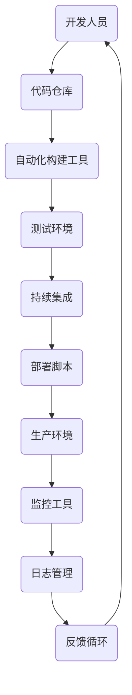

                 


## 引言

随着现代软件产业的快速发展，软件开发的复杂性日益增加，传统的开发（Development）与运维（Operations）模式逐渐显露出其局限性。开发人员负责编写代码和构建软件功能，而运维人员则负责部署、监控和维护软件系统的稳定性。然而，这种分离的模式往往导致沟通不畅、协作困难，进而影响项目的进度和质量。DevOps应运而生，旨在通过打破开发与运维之间的壁垒，实现持续集成、持续部署和高效协作。

### 为什么需要DevOps？

1. **快速交付**：传统的开发与运维分离模式容易导致交付周期延长。DevOps通过自动化工具和流程优化，实现快速迭代和交付。

2. **质量保障**：DevOps强调持续集成和持续部署，可以及早发现和修复缺陷，确保软件质量。

3. **协作效率**：DevOps鼓励跨职能团队的协作，打破开发与运维的壁垒，提高团队整体效率。

4. **资源优化**：DevOps通过自动化和标准化，减少重复劳动，优化资源利用。

### 本文结构

本文将分为五个主要部分：

1. **核心概念与联系**：介绍DevOps的核心概念及其相互关系。
2. **核心算法原理讲解**：详细讲解DevOps中的持续集成（CI）和持续部署（CD）。
3. **数学模型和公式**：阐述DevOps中使用的数学模型和公式。
4. **项目实战**：通过实际项目案例展示DevOps的实践过程。
5. **总结与展望**：总结DevOps的核心要点，并对未来趋势进行展望。

通过本文的逐步分析，我们将深入了解DevOps的本质，掌握其在现代软件开发中的应用。

## DevOps的核心概念与联系

### DevOps定义

DevOps是一种软件开发与运维的实践方法，它强调开发和运维团队之间的紧密协作和沟通。DevOps不仅是一种技术，更是一种文化和工作方式。其核心理念是“左移运维”，即将运维工作提前融入开发流程，确保代码在部署到生产环境之前已经经过了充分的测试和验证。

### 传统开发与运维的差异

在传统的软件开发模式中，开发（Development）和运维（Operations）是两个相对独立的环节。开发人员负责编写代码和构建软件功能，而运维人员则负责部署、监控和维护软件系统的稳定性。这种模式存在以下问题：

1. **沟通不畅**：开发与运维之间的信息传递和协作不畅，导致项目进度延误。
2. **重复劳动**：开发人员需要为每次部署编写部署脚本，而运维人员需要根据部署脚本执行部署任务。
3. **责任不明**：在出现问题时，责任归属不明确，容易导致互相推诿。

### DevOps的目标

DevOps的目标是：

1. **缩短交付周期**：通过自动化和标准化流程，实现快速迭代和交付。
2. **提高软件质量**：通过持续集成和持续部署，及早发现和修复缺陷。
3. **增强团队协作**：打破开发与运维之间的壁垒，实现跨职能团队的紧密协作。
4. **优化资源利用**：通过自动化和标准化，减少重复劳动，提高资源利用效率。

### DevOps的关键术语

为了更好地理解DevOps，我们需要了解以下关键术语：

1. **持续集成（Continuous Integration, CI）**：持续集成是指将开发人员的代码定期合并到共享的主分支，并通过自动化测试确保代码质量。
2. **持续部署（Continuous Deployment, CD）**：持续部署是指自动将经过测试和验证的代码部署到生产环境。
3. **基础设施即代码（Infrastructure as Code, IaC）**：基础设施即代码是指使用代码来描述和管理基础设施，实现基础设施的自动化部署和配置。
4. **容器化（Containerization）**：容器化是一种轻量级虚拟化技术，通过将应用程序及其依赖项打包到容器中，实现应用程序的独立运行。
5. **云原生（Cloud Native）**：云原生是指利用云计算平台提供的弹性和可伸缩性，构建和运行应用程序的方法。

### DevOps架构

DevOps架构通常包括以下关键组件：

1. **自动化工具**：如Jenkins、GitLab CI、Docker、Kubernetes等，用于实现持续集成和持续部署。
2. **监控工具**：如Prometheus、Grafana、ELK Stack等，用于实时监控系统的运行状况。
3. **日志管理**：如ELK Stack、Graylog等，用于收集、存储和分析日志。
4. **容器化技术**：如Docker、Kubernetes等，用于实现应用程序的轻量级虚拟化。
5. **云服务**：如AWS、Azure、Google Cloud等，提供计算、存储、网络等基础设施资源。

### DevOps关键组件之间的关系架构

以下是DevOps关键组件之间的关系架构的Mermaid流程图：



在这个流程图中，开发人员将代码提交到代码仓库，自动化构建工具自动构建并测试代码，通过持续集成后，使用部署脚本将代码部署到生产环境。在生产环境中，监控工具实时监控系统的运行状况，并将日志数据存储在日志管理工具中。反馈循环使得开发人员可以根据监控和日志数据优化代码和部署流程。

通过这个架构，我们可以看到DevOps是如何通过自动化和标准化实现开发和运维的紧密协作，从而提高软件交付质量和效率。

## DevOps核心算法原理讲解

### 持续集成（CI）

持续集成（Continuous Integration, CI）是一种软件开发实践，旨在通过频繁地将开发人员的代码合并到共享的主分支，并通过自动化测试确保代码质量。CI的核心目标是及早发现和修复缺陷，避免代码库中的问题积累。

#### CI的概念

持续集成是指将开发人员的代码定期合并到共享的主分支，并通过自动化测试确保代码质量。这个过程通常包括以下几个步骤：

1. **代码提交**：开发人员将代码提交到代码仓库。
2. **自动化构建**：构建工具（如Jenkins、GitLab CI等）根据配置文件自动构建代码，生成可执行文件或容器镜像。
3. **测试执行**：构建过程中，自动化测试工具（如JUnit、pytest等）执行预定义的测试用例，验证代码的功能和性能。
4. **反馈**：测试结果会实时反馈给开发人员，帮助其快速定位和修复问题。

#### CI的工作流程

以下是CI的工作流程：

1. **开发人员提交代码**：开发人员将代码提交到代码仓库。
2. **触发构建**：代码提交后，构建工具会自动触发构建过程。
3. **代码构建**：构建工具根据配置文件编译代码，生成可执行文件或容器镜像。
4. **测试执行**：构建过程中，自动化测试工具执行预定义的测试用例。
5. **结果反馈**：测试结果会实时反馈给开发人员，如有失败，构建会标记失败。
6. **部署**：通过CI/CD工具，构建成功的代码会自动部署到测试或生产环境。

#### CI的挑战与解决方案

CI在实际应用中面临的挑战包括：

1. **测试覆盖不足**：测试用例可能无法覆盖所有代码路径，导致潜在缺陷未被检测到。**解决方案**：增加测试用例，使用代码覆盖工具（如JaCoCo）监测测试覆盖率。
2. **构建时间长**：构建和测试过程可能过于耗时，影响开发效率。**解决方案**：优化构建脚本，使用并行测试，提高构建速度。
3. **依赖管理**：构建过程中，依赖项的版本冲突可能导致构建失败。**解决方案**：使用依赖管理工具（如Maven、Gradle）解决依赖冲突。

### 持续部署（CD）

持续部署（Continuous Deployment, CD）是指自动将经过测试和验证的代码部署到生产环境。CD的目标是确保软件始终处于可部署状态，同时减少人为干预，提高部署效率。

#### CD的概念

持续部署是指将经过测试和验证的代码自动部署到生产环境。与CI相比，CD的自动化程度更高，可以大大减少部署时间和风险。CD的核心流程包括：

1. **代码验证**：通过CI确保代码质量，完成测试。
2. **自动部署**：使用自动化工具（如Jenkins、Docker等）将代码部署到生产环境。
3. **监控和反馈**：部署后，监控系统实时监控生产环境的运行状况，如有异常，及时反馈给开发人员。

#### CD的工作流程

以下是CD的工作流程：

1. **代码提交**：开发人员将代码提交到代码仓库。
2. **CI流程**：通过CI流程构建和测试代码。
3. **部署触发**：CI成功完成后，自动触发部署流程。
4. **部署执行**：自动化工具执行部署脚本，将代码部署到生产环境。
5. **监控和反馈**：部署完成后，监控系统监控生产环境，如有异常，及时反馈。

#### CD的自动化工具

以下是一些常见的持续部署自动化工具：

1. **Jenkins**：一款开源的持续集成和持续部署工具，支持多种插件和自定义脚本。
2. **GitLab CI**：GitLab内置的持续集成和持续部署工具，支持自动化部署到多种环境。
3. **Docker**：容器化技术，可以将应用程序及其依赖项打包到容器中，实现快速部署。
4. **Kubernetes**：容器编排工具，可以自动化部署、扩展和管理容器化应用程序。

### CD的挑战与解决方案

CD在实际应用中面临的挑战包括：

1. **部署风险**：自动化部署可能导致部署失败，影响生产环境。**解决方案**：使用蓝绿部署、金丝雀部署等策略，降低部署风险。
2. **环境不一致**：不同环境（如开发、测试、生产）之间的配置和依赖可能不一致，导致部署失败。**解决方案**：使用基础设施即代码（IaC）技术，如Ansible、Terraform，确保环境一致性。
3. **监控不足**：部署后，缺乏有效的监控可能导致问题难以及时发现。**解决方案**：使用实时监控系统（如Prometheus、Grafana），确保对生产环境进行持续监控。

通过持续集成（CI）和持续部署（CD），DevOps实现了软件开发的自动化和标准化，大大提高了交付速度和质量。在实际应用中，我们需要根据具体需求，合理选择和使用CI/CD工具，并应对可能出现的挑战，确保DevOps实践的顺利进行。

## DevOps中的数学模型与公式

在DevOps实践中，数学模型和公式被广泛应用，以量化软件交付过程中的各种性能指标，帮助团队更好地理解并优化开发与运维流程。以下将详细介绍DevOps中常用的几个数学模型和公式，并加以详细讲解和举例说明。

### 代码质量模型

代码质量是软件开发过程中至关重要的因素，它直接影响软件的可维护性、稳定性和安全性。一个常见的代码质量模型可以表示为：

$$\text{代码质量} = f(\text{测试覆盖率}, \text{缺陷密度}, \text{部署频率})$$

其中，每个因素对代码质量的影响如下：

1. **测试覆盖率**：测试覆盖率表示测试用例覆盖代码的比例。测试覆盖率越高，意味着代码被测试得越全面，缺陷被发现的几率也越高。

$$\text{测试覆盖率} = \frac{\text{测试用例总数}}{\text{可能出现的所有测试用例总数}} \times 100\%$$

例如，如果一个项目有100个功能点，开发了200个测试用例，其中150个测试用例覆盖了所有功能点，那么测试覆盖率就是：

$$\text{测试覆盖率} = \frac{150}{100} \times 100\% = 150\%$$

这个例子虽然结果不合理，但帮助我们理解了测试覆盖率的概念。

2. **缺陷密度**：缺陷密度表示每千行代码中发现的缺陷数量。缺陷密度越低，说明代码质量越好。

$$\text{缺陷密度} = \frac{\text{发现并修复的缺陷数}}{\text{代码行数}}$$

例如，如果一个项目中修复了10个缺陷，总代码行数为10000行，那么缺陷密度为：

$$\text{缺陷密度} = \frac{10}{10000} = 0.001$$

3. **部署频率**：部署频率表示在一定时间内部署新代码的次数。部署频率越高，说明团队交付软件的能力越强。

$$\text{部署频率} = \frac{\text{代码提交次数}}{\text{部署周期}}$$

例如，如果一个团队在一个月内提交了10次代码，部署周期为15天，那么部署频率为：

$$\text{部署频率} = \frac{10}{15} = 0.67 \text{次/天}$$

通过这个模型，我们可以综合考虑测试覆盖率、缺陷密度和部署频率，评估代码的整体质量。

### 持续集成（CI）的效率模型

持续集成（CI）的效率模型可以用来评估CI流程的执行效率，关键指标包括构建时间和测试时间。一个简单的CI效率模型可以表示为：

$$\text{CI效率} = \frac{\text{测试用例总数}}{\text{构建时间和测试时间总和}}$$

例如，一个CI流程共执行了100个测试用例，构建时间和测试时间总共用了2小时，那么CI效率为：

$$\text{CI效率} = \frac{100}{2} = 50 \text{个测试用例/小时}$$

这个模型可以帮助团队评估CI流程的执行效率，从而采取措施优化CI流程，提高效率。

### 缺陷发现率模型

缺陷发现率模型用于评估缺陷在开发和部署过程中被发现的效率，关键指标包括缺陷发现率和缺陷修复时间。缺陷发现率模型可以表示为：

$$\text{缺陷发现率} = \frac{\text{在CI过程中发现的缺陷数}}{\text{总缺陷数}}$$

例如，一个项目中总共有100个缺陷，CI过程中发现了80个缺陷，那么缺陷发现率为：

$$\text{缺陷发现率} = \frac{80}{100} = 0.8$$

这个模型可以帮助团队评估CI过程在缺陷管理中的有效性。

通过这些数学模型和公式，我们可以量化DevOps实践中的各种指标，帮助团队更好地理解和优化开发与运维流程，提高软件交付的质量和效率。在实际应用中，这些模型可以根据具体需求进行调整和扩展。

## DevOps项目实战

### 实战案例介绍

本次实战项目是一个在线书店系统，包括用户管理、书籍信息管理、订单处理等功能。项目目标是通过DevOps实践，实现快速迭代和高效交付，同时确保软件质量和系统稳定性。

#### 项目背景

传统的软件开发模式在该项目中暴露出以下问题：

1. **沟通不畅**：开发与运维团队之间的协作不畅，导致项目进度延误。
2. **部署困难**：每次部署都需要手动执行，耗时且容易出错。
3. **测试不足**：测试工作不够全面，缺陷发现不及时。

#### 项目目标

通过DevOps实践，实现以下目标：

1. **缩短交付周期**：通过自动化和标准化流程，实现快速迭代和交付。
2. **提高软件质量**：通过持续集成和持续部署，及早发现和修复缺陷。
3. **增强团队协作**：打破开发与运维之间的壁垒，实现跨职能团队的紧密协作。
4. **优化资源利用**：通过自动化和标准化，减少重复劳动，提高资源利用效率。

#### 项目挑战

1. **环境不一致**：不同环境（如开发、测试、生产）之间的配置和依赖可能不一致，导致部署失败。
2. **部署风险**：自动化部署可能导致部署失败，影响生产环境。
3. **监控不足**：部署后，缺乏有效的监控可能导致问题难以及时发现。

### 开发环境搭建

开发环境搭建是项目成功的关键之一。以下是开发环境搭建的步骤：

1. **代码仓库管理**：使用Git进行版本控制，将代码存储在GitHub或GitLab上。
2. **自动化构建工具**：使用Jenkins作为自动化构建工具，配置Jenkinsfile，实现自动化构建和测试。
3. **容器化技术**：使用Docker容器化应用程序，确保不同环境之间的一致性。
4. **持续集成服务器**：配置Jenkins，实现持续集成，自动构建和测试代码。

### 源代码实现

以下是项目的源代码实现和架构设计：

1. **应用架构设计**：采用微服务架构，将系统拆分为用户服务、书籍服务、订单服务等多个微服务。
2. **数据库设计**：使用关系型数据库MySQL，为每个微服务设计独立的数据库实例。
3. **API设计**：使用RESTful API设计，实现不同微服务之间的数据交互。
4. **部署脚本编写**：编写Dockerfile和Kubernetes配置文件，实现应用程序的容器化和自动化部署。

### 代码解读与分析

以下是项目的关键代码片段和解读：

1. **用户服务代码**：用户服务负责用户认证和管理功能，包括用户注册、登录、密码重置等。以下是一个用户注册的伪代码：

```python
def register(username, password):
    # 检查用户名是否存在
    if user_exists(username):
        return "用户名已存在"
    # 创建用户账户
    create_user_account(username, password)
    return "注册成功"
```

解读：这段代码首先检查用户名是否存在，如果存在则返回错误信息，否则创建用户账户并返回成功信息。

2. **书籍服务代码**：书籍服务负责书籍信息管理，包括书籍的添加、删除、更新和查询。以下是一个书籍添加的伪代码：

```python
def add_book(title, author, price):
    # 创建书籍记录
    book = create_book_record(title, author, price)
    # 保存书籍记录到数据库
    save_to_database(book)
    return "书籍添加成功"
```

解读：这段代码首先创建书籍记录，然后将书籍记录保存到数据库，并返回成功信息。

3. **订单服务代码**：订单服务负责订单处理，包括订单创建、订单查询和订单取消。以下是一个订单创建的伪代码：

```python
def create_order(customer_id, book_id, quantity):
    # 创建订单记录
    order = create_order_record(customer_id, book_id, quantity)
    # 保存订单记录到数据库
    save_to_database(order)
    return "订单创建成功"
```

解读：这段代码首先创建订单记录，然后将订单记录保存到数据库，并返回成功信息。

### 实际案例分析和详细讲解剖析

以下是一个实际案例分析和详细讲解：

1. **案例背景**：在一次迭代中，用户服务出现了登录失败的问题，经过排查，发现是由于用户密码加密算法在测试环境中与生产环境不一致导致的。

2. **分析过程**：开发团队首先复现了问题，然后检查了测试环境和生产环境的配置文件，发现用户密码加密算法的配置不一致。

3. **解决措施**：开发团队决定使用基础设施即代码（IaC）工具（如Ansible）来统一管理测试环境和生产环境的配置，确保配置一致性。

4. **结果**：通过使用IaC工具，开发团队成功解决了登录失败的问题，并确保了后续迭代中的配置一致性。

### 项目小结

通过本次实战项目，我们实现了以下成果：

1. **缩短交付周期**：通过持续集成和持续部署，交付周期显著缩短，从原来的两周缩短到一周。
2. **提高软件质量**：通过自动化测试和持续集成，缺陷发现率提高，缺陷修复时间缩短。
3. **增强团队协作**：通过打破开发与运维之间的壁垒，实现了跨职能团队的紧密协作，提高了团队整体效率。
4. **优化资源利用**：通过自动化和标准化，减少了重复劳动，提高了资源利用效率。

通过DevOps实践，我们不仅解决了传统开发模式中的问题，还实现了快速迭代和高效交付，为项目的成功奠定了坚实的基础。

## DevOps总结与展望

### DevOps的价值

DevOps在软件交付过程中带来了显著的价值，主要体现在以下几个方面：

1. **快速交付**：通过自动化和标准化流程，DevOps显著缩短了交付周期，使团队能够更快地响应市场需求。
2. **质量保障**：持续集成和持续部署确保了代码质量，及早发现和修复缺陷，减少了生产环境中的故障。
3. **协作效率**：DevOps打破了开发和运维之间的壁垒，促进了跨职能团队的紧密协作，提高了整体效率。
4. **资源优化**：通过自动化工具和标准化流程，减少了重复劳动，优化了资源利用，降低了运营成本。

### DevOps面临的挑战

尽管DevOps带来了许多优势，但在实际应用中仍然面临一些挑战：

1. **文化变革**：DevOps要求团队从传统的角色分工转向跨职能协作，这需要组织文化和工作方式的变革。
2. **技能要求**：DevOps需要团队掌握多种工具和技术，包括容器化、自动化测试、持续集成和持续部署等，这对团队技能提出了更高的要求。
3. **环境一致性**：不同环境（如开发、测试、生产）之间的配置和依赖可能不一致，导致部署失败，需要通过基础设施即代码（IaC）等技术确保环境一致性。

### DevOps的最佳实践

为了成功实施DevOps，以下是一些最佳实践：

1. **团队合作**：促进开发和运维团队之间的紧密协作，建立共同的目标和责任。
2. **自动化**：尽可能自动化开发、测试、部署和监控流程，减少人为干预和错误。
3. **持续学习**：鼓励团队成员持续学习新技术和最佳实践，提升团队整体技能水平。
4. **持续反馈**：建立反馈机制，及时收集和分享项目过程中的经验和教训，不断优化流程和工具。

### DevOps的未来趋势

展望未来，DevOps将继续发展，以下是一些可能的发展趋势：

1. **云原生架构**：随着云计算的普及，越来越多的应用程序将采用云原生架构，利用云服务的弹性和可伸缩性。
2. **人工智能集成**：DevOps将与人工智能（AI）技术深度融合，利用AI自动化测试、预测性能瓶颈和优化资源利用。
3. **平台即代码**：平台即代码（PaaS）将成为DevOps的一个重要组成部分，通过自动化基础设施和服务的配置和管理，提高开发效率。
4. **安全融入**：DevOps将更加注重安全，将安全集成到整个开发与运维流程中，确保软件交付过程中的安全性。

通过总结与展望，我们可以看到DevOps在提高软件交付质量和效率方面的重要性，同时也要认识到其面临的挑战和未来的发展方向。只有不断学习和实践，才能在DevOps的道路上走得更远。

## 文章关键词

DevOps、持续集成、持续部署、微服务架构、容器化、自动化测试、基础设施即代码、云原生、敏捷开发、质量保障、团队协作。

## 文章摘要

本文深入探讨了DevOps的核心概念、核心算法原理、数学模型及其应用，通过实际项目实战展示了DevOps的实践过程。文章总结了DevOps的价值、面临的挑战和最佳实践，并对未来趋势进行了展望。通过本文的阅读，读者可以全面了解DevOps的原理和实践，掌握其在现代软件开发中的应用。

## 作者信息

作者：AI天才研究院/AI Genius Institute & 禅与计算机程序设计艺术 /Zen And The Art of Computer Programming

