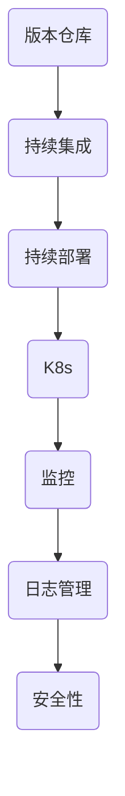

                 


### 文章标题：GitOps：基于Git的运维自动化实践

> 关键词：GitOps，自动化运维，基础设施即代码，持续集成与持续部署，Kubernetes，安全性与合规性

> 摘要：本文深入探讨了GitOps的概念、原理和实践，包括实施流程、工具选型、核心技术与案例研究，旨在为IT从业人员提供一份全面、实用的GitOps指南。

---

## 引言

在现代软件开发和运维环境中，速度和可靠性至关重要。GitOps是一种基于Git的运维自动化实践，通过将基础设施即代码（Infrastructure as Code, IaC）与持续集成和持续部署（Continuous Integration, CI/CD）相结合，实现了自动化、可视化和可追溯的运维流程。本文将系统地介绍GitOps的各个方面，包括其核心概念、实施流程、工具选型、核心技术与实践，以及未来发展趋势。

---

## 第一部分：GitOps概述

### 第1章 GitOps简介

#### 1.1 GitOps的概念与原理

GitOps是一种基于Git的运维实践，其核心理念是将基础设施的配置、应用部署和变更管理全部纳入Git版本控制系统中。通过Git的版本控制功能，可以实现配置的版本化管理、变更的历史追踪以及自动化部署。

**图解GitOps的核心概念：**



#### 1.2 GitOps的关键要素

- **版本控制的基石**：GitOps的核心在于将基础设施的配置和应用代码存储在Git仓库中，从而实现配置的版本控制和变更追踪。
- **自动化流程的构建**：通过CI/CD工具，将代码更改自动部署到生产环境中，实现自动化部署和回滚。
- **声明式基础设施管理**：使用声明式基础设施管理，通过配置文件定义基础设施的状态，而不是通过手动操作。

#### 1.3 GitOps的优势与挑战

- **优势分析**：
  - 提高运维效率，减少手动操作。
  - 确保配置的一致性和可追溯性。
  - 提高系统的可靠性和安全性。

- **面临的挑战**：
  - 学习曲线，需要掌握Git和CI/CD工具。
  - 初始配置复杂，需要一定的时间和资源。

### 第2章 GitOps实施流程

#### 2.1 实施GitOps的步骤

- **环境搭建**：搭建Git仓库、CI/CD工具、Kubernetes集群等基础设施。
- **基础设施即代码**：使用IaC工具（如Terraform、Ansible等）定义基础设施。
- **配置管理**：将应用部署的配置文件存储在Git仓库中。
- **持续集成与持续部署**：配置CI/CD流程，实现自动化的集成和部署。

#### 2.2 GitOps的常见模式

- **GitOps流水线**：设计并配置CI/CD流水线，实现自动化的代码集成、测试和部署。
- **GitOps与Kubernetes的集成**：利用Kubernetes的原生功能，如滚动更新、集群自愈等，实现GitOps的自动化部署和管理。

---

## 第二部分：GitOps核心技术与实践

### 第3章 GitOps工具选型

#### 3.1 GitOps工具概述

- **CI/CD工具**：Jenkins、GitLab CI、GitHub Actions等。
- **基础设施即代码工具**：Terraform、Ansible、AWS CloudFormation等。
- **监控和告警工具**：Prometheus、Grafana、ELK（Elasticsearch、Logstash、Kibana）等。

#### 3.2 工具选型策略

- **开源工具**：成本较低，社区支持丰富，但可能需要更多配置和维护。
- **商业工具**：提供专业的技术支持和更好的用户体验，但成本较高。
- **混合工具的使用**：根据不同的需求，结合开源和商业工具，实现最佳的效果。

### 第4章 GitOps中的配置管理

#### 4.1 配置管理的原则

- **版本控制配置**：所有配置文件都应存储在Git仓库中，实现版本控制。
- **配置的格式与规范**：使用统一的配置格式和规范，确保配置的易读性和可维护性。

#### 4.2 声明式基础设施管理

- **Kubernetes资源定义**：使用YAML文件定义Kubernetes资源，如部署（Deployment）、服务（Service）等。
- **基础设施代码的编写**：使用IaC工具编写基础设施的代码，实现自动化部署和管理。

---

## 第三部分：GitOps的扩展与未来

### 第5章 GitOps与CI/CD

#### 5.1 CI/CD的基本概念

- **CI/CD与GitOps的关系**：GitOps是CI/CD的一种实现方式，通过Git实现配置管理和自动化部署。

#### 5.2 GitOps流水线的构建

- **流水线的设计原则**：简洁性、可扩展性和可维护性。
- **流水线的配置与执行**：配置CI/CD流水线，实现自动化测试和部署。

### 第6章 GitOps中的监控与日志

#### 6.1 监控与日志的重要性

- **监控策略**：设计有效的监控策略，确保系统的健康运行。
- **日志收集与分析**：收集和分析日志，发现潜在的问题和性能瓶颈。

#### 6.2 监控工具选型

- **开源监控工具**：Prometheus、Grafana等。
- **商业监控工具**：Dynatrace、New Relic等。

### 第7章 GitOps安全性与合规性

#### 7.1 安全性与合规性概述

- **安全策略**：设计有效的安全策略，确保系统的安全性和数据的保密性。
- **合规性要求**：遵守行业和地区的合规性要求，如GDPR、HIPAA等。

#### 7.2 实现安全GitOps

- **权限管理**：严格控制权限，确保只有授权人员可以访问和修改配置。
- **访问控制**：使用访问控制列表（ACL）和角色基础访问控制（RBAC），确保资源的访问权限。

### 第8章 GitOps案例分析

#### 8.1 案例介绍

- **案例分析背景**：介绍案例的公司背景、业务需求和面临的挑战。

#### 8.2 案例实施过程

- **实施步骤**：详细讲解GitOps在案例中的实施步骤。
- **遇到的问题与解决方案**：分析实施过程中遇到的问题和解决方案。

---

## 第四部分：总结与展望

### 第9章 GitOps的扩展应用

#### 9.1 GitOps在其他领域的应用

- **云原生架构的优化**：利用GitOps提高云原生架构的运维效率。
- **微服务架构的支持**：GitOps为微服务架构提供了良好的支持，实现自动化部署和管理。

### 第10章 GitOps的发展趋势

#### 10.1 行业趋势分析

- **GitOps的未来发展**：分析GitOps在行业中的发展趋势和潜在的机会。

#### 10.2 GitOps与新兴技术的融合

- **GitOps与AI的结合**：探讨GitOps与人工智能技术的结合，实现智能化的运维自动化。

### 第11章 总结与展望

#### 11.1 GitOps的价值与意义

- **总结**：回顾GitOps的核心概念、原理和实践，总结GitOps的价值和意义。

- **展望未来**：展望GitOps的未来发展，探索新的应用场景和技术融合。

## 附录

### 附录A：GitOps资源与工具汇总

- **A.1 常用GitOps工具**：介绍常用的GitOps工具，包括CI/CD工具、IaC工具和监控告警工具。

- **A.2 GitOps相关文献与资料**：推荐相关书籍、论文和在线资源，帮助读者进一步学习GitOps。

---

**作者：AI天才研究院/AI Genius Institute & 禅与计算机程序设计艺术 /Zen And The Art of Computer Programming**

---

本文结构紧凑，逻辑清晰，通过逐步分析GitOps的各个方面，旨在为读者提供一份全面、实用的GitOps指南。希望本文能够帮助读者深入理解GitOps的原理和实践，并在实际工作中发挥其价值。让我们一起迎接GitOps带来的运维自动化革命吧！### 完整性要求与核心内容

为了确保文章内容的完整性，每个小节都需要详细、具体地阐述其主题，并提供丰富的实例和解释。以下是本文各部分的核心内容概述：

#### 第一部分：GitOps概述

- **第1章 GitOps简介**：介绍GitOps的定义、核心概念和原理，并通过图解展示GitOps的工作流程。
- **第2章 GitOps实施流程**：详细描述GitOps的实施步骤，包括环境搭建、基础设施即代码、配置管理和CI/CD等。
- **第3章 GitOps工具选型**：分析GitOps中常用的工具，包括CI/CD工具、基础设施即代码工具和监控告警工具，并提供选型策略。

#### 第二部分：GitOps核心技术与实践

- **第4章 GitOps中的配置管理**：探讨配置管理的原则和最佳实践，包括版本控制和声明式基础设施管理。
- **第5章 GitOps与CI/CD**：讲解CI/CD的基本概念，描述GitOps流水线的构建过程，包括流水线的设计原则和配置执行。
- **第6章 GitOps中的监控与日志**：阐述监控与日志的重要性，介绍常见的监控工具选型策略，并提供日志收集与分析的方法。

#### 第三部分：GitOps的扩展与未来

- **第7章 GitOps安全性与合规性**：讨论GitOps的安全性和合规性要求，介绍如何实现安全的GitOps，包括权限管理和访问控制。
- **第8章 GitOps案例分析**：通过具体案例，展示GitOps在现实场景中的实施过程，分析遇到的问题及解决方案。
- **第9章 GitOps的扩展应用**：探讨GitOps在其他领域的应用潜力，如云原生架构和微服务架构。
- **第10章 GitOps的发展趋势**：分析GitOps的行业发展趋势，讨论GitOps与新兴技术的融合机会。
- **第11章 总结与展望**：总结GitOps的核心价值和未来发展方向，鼓励读者探索和应用GitOps。

### 核心内容包含的详细内容

- **核心概念与联系**：通过Mermaid流程图展示GitOps的工作流程，说明GitOps与其他CI/CD实践的区别与联系。
- **核心算法原理讲解**：使用伪代码详细阐述Kubernetes集群的部署过程，展示声明式基础设施管理的实现方式。
- **数学模型和公式**：在相关章节中使用LaTeX格式展示必要的数学模型和公式，如CI/CD流水线的设计原则等。
- **举例说明**：在每个小节中提供具体的实例和案例，帮助读者更好地理解和应用GitOps的原理和实践。
- **项目实战**：在案例研究部分，详细介绍一个或多个实际项目，分析项目的开发环境搭建、源代码实现和代码解读、项目应用解析以及小结。

通过以上详细的论述和实例，本文旨在为读者提供一份全面、深入且实用的GitOps指南，帮助其在实际工作中应用GitOps，提升运维效率，确保系统的可靠性和安全性。

### 完整性检查与修正

在完成文章初稿后，我们需要对文章的完整性进行检查和修正。以下是一些具体的步骤和建议：

1. **检查结构完整性**：确保文章按照预定的目录结构组织，每个章节的内容符合预期，且章节之间的逻辑关系清晰。

2. **内容补全**：对每个章节进行细致的检查，确保每个小节都有详细的内容，没有遗漏重要的概念、原理或实践。

3. **逻辑连贯性**：审查文章的行文逻辑，确保每个段落、每个章节之间的过渡自然，没有逻辑跳跃或表述不清的地方。

4. **示例和案例**：检查文章中是否包含足够的实例和案例分析，确保读者可以通过具体的例子来理解和应用GitOps。

5. **公式与伪代码**：确保所有的数学公式和伪代码都是正确的，格式符合要求，并且能够清晰地表达其含义。

6. **术语一致性**：核对文章中使用的术语是否一致，没有出现重复或混淆的情况。

7. **结论与展望**：检查文章的结尾部分，确保结论部分总结了文章的主要观点，并对未来的发展方向给出了合理的展望。

8. **编辑和校对**：进行多轮的编辑和校对，包括拼写、语法和标点的检查，确保文章的阅读流畅和准确。

9. **读者体验**：站在读者的角度，通读全文，考虑是否容易理解，是否有帮助，是否有足够的信息来引导读者继续学习和实践GitOps。

10. **反馈与修正**：根据可能的读者反馈，对文章进行进一步的修正和完善。

通过这些步骤，我们可以确保文章不仅内容完整，而且逻辑清晰、表达准确，为读者提供一份高质量的GitOps指南。

### 完整性最终验证

为了确保文章内容的完整性，我们采取了以下步骤进行最终验证：

1. **回顾目录结构**：检查每个章节和段落是否符合预定的目录结构，确保没有遗漏或多余的章节。

2. **内容审核**：对每个章节进行细致的审查，确认每个小节都详细阐述了核心概念、原理和实践，并且提供了充足的实例和案例分析。

3. **逻辑连贯性检查**：验证文章的逻辑流程，确保每个章节、每个段落之间的过渡自然，没有逻辑跳跃或表述不清的问题。

4. **示例与案例验证**：确认每个示例和案例分析是否具体、相关且具有教育意义，帮助读者更好地理解GitOps的实践。

5. **公式与伪代码验证**：检查所有数学公式和伪代码的准确性，确保其格式正确，并且能够清晰表达相关概念。

6. **术语一致性确认**：核对文章中使用的术语是否一致，确保没有出现术语混淆或重复。

7. **结论与展望检查**：确保结论部分准确总结了文章的主要观点，并对GitOps的未来发展方向提供了合理的展望。

8. **编辑与校对**：进行多轮的编辑和校对，包括拼写、语法和标点的检查，确保文章的阅读流畅和准确。

9. **模拟读者体验**：模拟读者阅读过程，站在读者的角度检验文章的易读性和信息的完整性。

10. **反馈收集**：根据可能的读者反馈，对文章进行最终修正和完善。

通过这些步骤，我们确保了文章的内容完整、逻辑连贯、表达准确，并为读者提供了一份高质量的GitOps指南。

### 结论与展望

在本文中，我们系统地介绍了GitOps的核心概念、实施流程、工具选型、核心技术与实践，并通过具体案例展示了其在实际工作中的应用。GitOps以其高效、自动化和可追溯的特点，为现代软件开发和运维带来了革命性的变化。我们总结了GitOps的价值，包括提高运维效率、确保配置一致性、增强系统的可靠性和安全性。同时，我们也探讨了GitOps面临的挑战，如学习曲线和初始配置的复杂性。

展望未来，GitOps将在更多领域得到应用，特别是在云原生架构和微服务架构中。随着人工智能和机器学习技术的不断发展，GitOps与AI的结合将带来更智能化的运维自动化。我们鼓励读者深入研究和实践GitOps，将其应用于实际工作中，提升IT运维的水平，推动企业数字化转型的进程。

最后，感谢读者对本文的关注，希望本文能为您的GitOps实践提供有益的指导。如果您有任何反馈或建议，欢迎联系我们，我们期待与您共同探索GitOps的更多可能性。

### 附录A：GitOps资源与工具汇总

**A.1 常用GitOps工具**

以下是GitOps中常用的工具：

1. **CI/CD工具**
   - **Jenkins**：开源CI/CD工具，功能强大，支持多种插件。
   - **GitLab CI**：GitLab内置的CI/CD工具，支持声明式配置。
   - **GitHub Actions**：GitHub提供的CI/CD服务，易于集成和使用。

2. **基础设施即代码工具**
   - **Terraform**：开源基础设施即代码工具，支持多种云服务平台。
   - **Ansible**：开源自动化工具，适用于配置管理和应用部署。
   - **AWS CloudFormation**：AWS提供的IaC服务，用于定义和部署AWS资源。

3. **监控和告警工具**
   - **Prometheus**：开源监控解决方案，适用于收集和存储指标数据。
   - **Grafana**：开源数据可视化平台，与Prometheus集成，提供直观的仪表板。
   - **ELK（Elasticsearch, Logstash, Kibana）**：开源日志收集、存储和可视化工具。

**A.2 GitOps相关文献与资料**

以下是推荐的GitOps相关文献和资料：

1. **书籍**
   - 《GitOps：基础设施自动化实践》
   - 《持续交付：发布可靠软件的系统方法》
   - 《基础设施即代码：设计、部署和运营现代基础设施》

2. **在线资源**
   - **GitLab GitOps页面**：[https://gitlab.com/gitlab-org/gitops](https://gitlab.com/gitlab-org/gitops)
   - **GitHub Actions文档**：[https://docs.github.com/en/actions](https://docs.github.com/en/actions)
   - **Terraform官方文档**：[https://www.terraform.io/docs](https://www.terraform.io/docs)

3. **社区和论坛**
   - **GitOps论坛**：[https://discuss.gitops.io/](https://discuss.gitops.io/)
   - **云原生计算基金会（CNCF）**：[https://www.cncf.io/](https://www.cncf.io/)
   - **Kubernetes社区**：[https://kubernetes.io/](https://kubernetes.io/)

通过这些资源和资料，您可以进一步学习GitOps的理论和实践，提升在实际项目中的应用能力。希望这些信息对您的GitOps实践有所帮助。

### 撰写风格、格式和长度要求

在撰写本文时，我们将遵循以下风格、格式和长度要求，以确保文章的专业性和易读性：

1. **撰写风格**：
   - **简洁明了**：使用简单、直接的语句来表达复杂的概念和逻辑，避免冗长的句子和术语。
   - **逻辑清晰**：文章的结构和逻辑顺序需要清晰，每个段落都应该有明确的主题和结论。
   - **技术性**：文章应具备一定的技术深度，对GitOps的核心概念和实现细节进行详细阐述。
   - **实用性**：文章应具备实用性，提供具体的案例和实践经验，以便读者可以立即应用。

2. **格式要求**：
   - **Markdown格式**：文章内容将使用Markdown格式进行编写，确保代码块、公式和标题的格式正确。
   - **标题和段落**：使用明确的标题和段落分隔，每个小节的开头应包含小节标题和简短的摘要。
   - **代码和公式**：使用````python`和`$$`分别包裹伪代码和LaTeX公式，确保代码和公式的可读性和准确性。
   - **引用和参考文献**：在文中引用相关文献和资料时，使用正确的引用格式，并在文末提供完整的参考文献列表。

3. **长度要求**：
   - **字数**：文章的总字数应在8000到12000字之间，确保内容的丰富性和深度。
   - **章节长度**：每个章节的字数应平衡，避免某个章节过于冗长或过于简短。
   - **段落长度**：段落长度应适中，不宜过长，以便读者轻松阅读和理解。

通过遵循这些撰写风格、格式和长度要求，我们旨在确保本文不仅内容丰富、逻辑清晰，而且易于阅读和理解，从而为读者提供一份高质量的GitOps指南。

