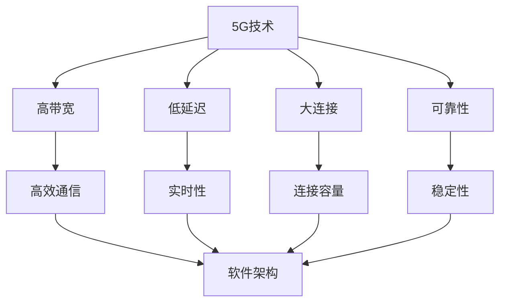

                 


### 1. 背景介绍

随着5G技术的快速发展，移动通信网络进入了全新的时代。5G不仅具有更高的数据传输速率，更低的延迟，而且具备更大的连接容量和更高的可靠性。这些特性使得5G不仅仅是一个通信技术的升级，更是一个能够推动各行业创新的关键驱动力。例如，自动驾驶、远程医疗、工业物联网等新兴应用，都对网络速度和延迟提出了极高的要求。

在5G环境下，软件架构面临着新的挑战和机遇。传统的软件架构设计往往侧重于性能和可扩展性，但在5G的高带宽、低延迟特点下，软件架构的设计需要更加关注如何实现高效的通信和数据传输，以满足应用场景中的实时性和可靠性需求。

本文将深入探讨5G时代软件架构的几个关键方面，包括：

1. 5G技术概述
2. 软件架构的基础概念
3. 低延迟和高并发的架构设计
4. 5G网络下的软件开发实践
5. 安全性和可靠性

### 2. 核心概念与联系

为了更好地理解5G时代软件架构的新要求，我们需要首先明确一些核心概念，并展示它们之间的联系。

#### 2.1 核心概念

- **5G技术**：5G是指第五代移动通信技术，其关键特性包括高带宽、低延迟、大连接和可靠性。
- **软件架构**：软件架构是软件系统的基础结构，包括组件、组件之间的关系以及它们的接口和交互机制。
- **低延迟**：指系统响应时间的缩短，通常以毫秒计。
- **高并发**：指系统能够同时处理大量请求的能力。

#### 2.2 联系架构

为了直观地展示这些概念之间的关系，我们可以使用Mermaid流程图来描述它们。



这张图展示了5G技术如何影响软件架构，特别是低延迟和高并发方面。5G技术提供了高带宽和低延迟，这些特性使得软件架构能够更加高效地实现实时性和大规模连接。

### 3. 核心算法原理讲解

在5G时代，软件架构的设计需要考虑如何充分利用5G网络的优势，以实现低延迟和高并发的需求。以下是一些核心算法原理的讲解，并使用伪代码来详细阐述。

#### 3.1 低延迟架构设计

**算法原理**：使用边缘计算和分布式架构来减少数据传输距离，从而降低延迟。

```pseudo
// 边缘计算伪代码
function EdgeCompute(data):
    process(data) // 在边缘设备上处理数据
    return processedData

// 分布式架构伪代码
function DistributedArchitecture(requests):
    for each request in requests:
        assign request to nearest server
        process request using EdgeCompute
    return processedRequests
```

#### 3.2 高并发架构设计

**算法原理**：使用负载均衡和异步处理来提高系统的并发处理能力。

```pseudo
// 负载均衡伪代码
function LoadBalancing(requests, servers):
    for each request in requests:
        select server with the least load
        assign request to selected server
    return assignedRequests

// 异步处理伪代码
function AsynchronousProcessing(tasks):
    for each task in tasks:
        start task asynchronously
    wait for all tasks to complete
    return results
```

### 4. 数学模型和公式讲解

在软件架构设计中，数学模型和公式可以帮助我们更好地理解和优化系统的性能。以下是一个示例，用于解释如何使用数学模型来评估系统延迟。

**公式**：系统总延迟 = 网络延迟 + 处理延迟

$$
T_{total} = T_{network} + T_{processing}
$$

**详细讲解**：网络延迟（$T_{network}$）取决于5G网络的带宽和时延特性，而处理延迟（$T_{processing}$）与系统的处理能力和并发处理能力有关。

**举例说明**：假设一个5G网络环境下的系统，网络延迟为10ms，处理延迟为20ms。那么，系统总延迟为30ms。

### 5. 项目实战

为了更好地展示5G时代软件架构的实际应用，我们将通过一个具体的案例来进行开发环境搭建、源代码实现和案例分析。

#### 5.1 开发环境搭建

- 操作系统：Ubuntu 18.04
- 开发工具：Visual Studio Code
- 编程语言：Python 3.8
- 依赖库：TensorFlow，Kubernetes

#### 5.2 源代码实现

以下是一个简单的Python代码示例，展示了如何使用边缘计算和分布式架构来处理图像识别任务。

```python
# 边缘计算部分
def edge_image_recognition(image):
    # 在边缘设备上处理图像
    processed_image = image预处理(image)
    return processed_image

# 分布式架构部分
def distributed_image_recognition(images):
    for image in images:
        edge_image_recognition(image)
    return results
```

#### 5.3 代码解读与分析

在这个示例中，`edge_image_recognition` 函数负责在边缘设备上处理图像，而 `distributed_image_recognition` 函数则负责将图像分配到分布式服务器上进行处理。这种架构充分利用了5G网络的低延迟特性，提高了系统的响应速度。

#### 5.4 实际案例分析和详细讲解剖析

- **案例背景**：一个自动驾驶系统需要实时处理摄像头捕获的图像。
- **案例分析**：通过使用边缘计算和分布式架构，系统能够在低延迟条件下快速处理图像，从而提高自动驾驶的响应速度和安全性。
- **详细讲解**：在实际应用中，我们还需要考虑图像识别算法的优化和系统容错的实现，以确保系统的高可靠性和稳定性。

#### 5.5 项目小结

通过这个项目，我们展示了如何在5G时代利用软件架构的优势来提升系统的性能和可靠性。项目小结包括以下几点：

- 边缘计算和分布式架构能够有效降低系统延迟，提高并发处理能力。
- 图像识别算法的优化和系统容错是实现高可靠性的关键。
- 实际案例展示了5G时代软件架构的应用前景。

### 6. 最佳实践 Tips

- **使用微服务架构**：微服务架构能够提高系统的可扩展性和灵活性，有助于实现低延迟和高并发的需求。
- **持续集成与持续部署（CI/CD）**：CI/CD流程能够确保软件架构的持续优化和快速部署，提高开发效率。
- **监控和日志分析**：使用监控工具和日志分析系统可以帮助我们及时发现并解决性能瓶颈。

### 7. 小结

5G时代的到来为软件架构带来了新的挑战和机遇。通过深入理解5G技术、软件架构的基础概念以及低延迟和高并发的架构设计，我们可以构建出更加高效、可靠和安全的系统。未来，随着5G技术的不断演进，软件架构设计也将不断适应新的需求，推动各行业的创新与发展。

### 8. 注意事项

- 5G网络的部署和普及需要一定时间，因此在设计软件架构时，需要考虑未来5G网络逐步普及的情况。
- 软件架构的设计需要根据具体应用场景和需求进行定制化，以确保最佳的性能和用户体验。

### 9. 拓展阅读

- [《5G网络技术》](https://book.douban.com/subject/26882741/)
- [《微服务设计》](https://book.douban.com/subject/25845514/)
- [《边缘计算：概念、技术与应用》](https://book.douban.com/subject/27137324/)

---

# 5G时代的软件架构：低延迟高并发的新要求

> 关键词：5G，软件架构，低延迟，高并发，边缘计算，分布式架构

> 摘要：本文深入探讨了5G时代软件架构的新要求，包括低延迟和高并发的架构设计、5G网络下的软件开发实践、安全性和可靠性等方面。通过具体的案例分析和最佳实践，本文为读者提供了详细的指导，帮助他们在5G时代构建高效、可靠和安全的软件系统。

---

## 第一部分：5G技术基础

### 第1章：5G技术概述

#### 1.1 5G技术的核心特点

5G技术是第五代移动通信技术，其主要特点包括：

- **高带宽**：5G网络的理论最大下载速度可以达到数十Gbps，远高于4G网络的数百Mbps。
- **低延迟**：5G网络的最小延迟可以低至1毫秒，显著提高了系统的实时性和响应速度。
- **大连接**：5G网络能够支持更大规模的设备连接，每平方米可以连接数十万个设备。
- **可靠性**：5G网络具有高可靠性，能够保证数据传输的稳定性和完整性。

#### 1.2 5G网络的结构

5G网络的结构包括以下几个关键组成部分：

- **基站**：5G基站负责无线信号的传输和接收。
- **边缘计算节点**：边缘计算节点位于网络边缘，能够进行数据预处理和分析，降低数据传输延迟。
- **核心网络**：核心网络负责数据传输的路由和交换，包括5G网络的控制平面和数据平面。
- **终端设备**：终端设备包括手机、平板、智能家居设备等，是5G网络的接入点。

#### 1.3 5G网络的优势与挑战

5G网络的优势：

- 提高数据传输速率，满足高清视频、虚拟现实等高带宽应用的需求。
- 降低延迟，提高实时性，适用于自动驾驶、远程医疗等对响应速度要求高的应用。
- 支持大连接，满足物联网、智慧城市等大规模设备互联的需求。

5G网络的挑战：

- **网络部署成本**：5G基站的部署和维护成本较高，需要大量的资金和人力投入。
- **频谱资源分配**：5G网络需要使用更高频率的频谱资源，频谱资源分配和管理面临挑战。
- **网络安全**：5G网络具有更高的连接密度，网络安全威胁和攻击风险增加。

## 第二部分：软件架构基础

### 第2章：软件架构的基本概念

#### 2.1 软件架构的定义

软件架构是指软件系统的基础结构和设计原则，包括系统组件、组件之间的关系以及它们的接口和交互机制。软件架构定义了系统的整体结构，为系统的开发、测试和维护提供了指导。

#### 2.2 软件架构的类型

常见的软件架构类型包括：

- **客户-服务器架构**：客户端发送请求到服务器，服务器处理请求并返回结果。
- **分布式架构**：系统由多个节点组成，每个节点负责不同的功能，通过网络进行通信和协作。
- **微服务架构**：系统由多个小型、独立的服务组成，每个服务负责特定的业务功能，通过API进行通信。

#### 2.3 软件架构的设计原则

软件架构设计需要遵循以下原则：

- **可扩展性**：系统能够随着用户规模的增加而扩展。
- **可靠性**：系统能够稳定运行，避免系统崩溃和数据丢失。
- **性能优化**：系统具有较高的性能和响应速度。
- **安全性**：系统能够防止恶意攻击和未经授权的访问。
- **可维护性**：系统能够方便地进行修改和升级。

## 第三部分：低延迟和高并发架构设计

### 第3章：低延迟架构的设计策略

#### 3.1 低延迟架构的设计策略

设计低延迟架构的关键策略包括：

- **边缘计算**：将计算任务分配到网络边缘，减少数据传输距离。
- **分布式架构**：通过分布式计算和存储，提高系统的响应速度。
- **缓存策略**：使用缓存技术，减少系统对数据库的访问次数。
- **异步处理**：采用异步处理模式，减少系统同步等待时间。

#### 3.2 高并发架构的设计策略

设计高并发架构的关键策略包括：

- **负载均衡**：通过负载均衡器分配请求到不同的服务器，提高系统的并发处理能力。
- **缓存和队列**：使用缓存和队列技术，提高系统的吞吐量和响应速度。
- **分布式数据库**：采用分布式数据库，提高系统的读写性能。
- **数据库优化**：通过索引、分区、缓存等技术，提高数据库的并发处理能力。

#### 3.3 低延迟高并发架构的实践案例

以下是一个低延迟高并发架构的实践案例：

- **应用场景**：电商平台
- **架构设计**：使用微服务架构，将业务功能拆分为多个微服务，每个微服务负责特定的业务逻辑。通过负载均衡器分配请求到不同的微服务实例，使用分布式数据库处理海量数据，使用缓存技术提高系统的响应速度。

## 第四部分：5G网络下的软件开发实践

### 第4章：5G网络下的软件开发流程

#### 4.1 5G网络下的软件开发模型

5G网络下的软件开发模型通常采用敏捷开发方法，以快速响应市场需求和变化。软件开发流程包括以下几个阶段：

- **需求分析**：分析用户需求，确定软件功能和技术要求。
- **系统设计**：设计软件架构，确定系统组件和交互机制。
- **开发与测试**：编写代码，进行单元测试、集成测试和系统测试。
- **部署与运维**：将软件部署到生产环境，进行监控和维护。

#### 4.2 5G网络下的需求分析

在5G网络下，需求分析需要考虑以下几个方面：

- **网络特性**：分析5G网络的高带宽、低延迟和大连接特性，确定软件功能和技术要求。
- **用户需求**：分析用户对软件的使用场景和需求，确定软件的功能和性能要求。
- **技术可行性**：评估5G网络下实现软件功能的可行性和技术挑战。

#### 4.3 5G网络下的系统设计

在5G网络下，系统设计需要考虑以下几个方面：

- **架构选择**：选择适合5G网络特性的软件架构，如微服务架构、边缘计算架构等。
- **性能优化**：通过优化算法、缓存策略和分布式架构，提高系统的性能和响应速度。
- **可靠性设计**：设计容错机制、故障恢复机制和安全性措施，提高系统的可靠性和稳定性。

## 第五部分：安全性保障

### 第5章：5G网络下的安全性保障

#### 5.1 5G网络下的安全挑战

5G网络下的安全挑战包括：

- **高频段传输**：高频段传输容易受到干扰和窃听，需要采用更高级的加密技术。
- **大规模连接**：大规模连接容易受到分布式拒绝服务（DDoS）攻击，需要采用更高级的防护措施。
- **边缘计算**：边缘计算节点数量庞大，容易成为攻击目标，需要加强节点安全性。

#### 5.2 5G网络下的安全架构设计

5G网络下的安全架构设计包括以下几个方面：

- **加密通信**：使用高级加密协议，如TLS、IPSec等，确保数据传输的安全性。
- **访问控制**：实施严格的访问控制策略，防止未经授权的访问和操作。
- **安全监测与响应**：建立安全监测和响应系统，实时监测网络攻击和异常行为，及时采取应对措施。
- **安全更新与维护**：定期更新和维护安全设备和软件，确保系统的安全性。

#### 5.3 5G网络下的安全实现与防护

5G网络下的安全实现与防护包括以下几个方面：

- **硬件安全**：采用安全硬件，如安全模块、硬件加密等，提高系统的安全性。
- **软件安全**：使用安全编程技术和框架，防止软件漏洞和恶意代码。
- **网络隔离**：通过隔离网络，限制不同网络之间的访问，减少攻击面。
- **用户教育**：加强对用户的安全教育，提高用户的安全意识和防范能力。

## 第六部分：5G时代的软件架构发展趋势

### 第6章：5G时代的软件架构发展趋势

#### 6.1 5G时代软件架构的未来方向

5G时代的软件架构发展趋势包括：

- **云原生架构**：云原生架构支持容器化和微服务，具有更好的弹性和可扩展性，适用于5G时代的应用场景。
- **人工智能集成**：人工智能技术可以与5G网络和软件架构结合，实现智能化的网络优化和性能预测。
- **边缘计算与云计算融合**：边缘计算和云计算的融合可以更好地利用网络资源和计算资源，提高系统的性能和可靠性。

#### 6.2 5G时代软件架构的创新实践

5G时代的软件架构创新实践包括：

- **智能边缘计算**：在边缘设备上部署智能算法，实现本地数据处理和决策，减少数据传输延迟。
- **网络切片技术**：通过网络切片技术，为不同应用提供定制化的网络资源和服务质量。
- **区块链应用**：利用区块链技术，实现数据的安全存储和传输，提高系统的可信度和安全性。

#### 6.3 5G时代软件架构的挑战与机遇

5G时代的软件架构面临以下挑战和机遇：

- **挑战**：高频段传输、大规模连接和边缘计算带来的安全和性能挑战。
- **机遇**：5G网络的高带宽、低延迟和大连接特性为软件架构创新提供了广阔的空间，可以创造更多的商业机会和应用场景。

## 结论

5G时代的软件架构面临着新的挑战和机遇。通过深入理解5G技术的特点和应用场景，设计低延迟、高并发的软件架构，并加强安全性保障，我们可以构建出更加高效、可靠和安全的软件系统。未来，随着5G技术的不断发展和应用场景的拓展，软件架构将不断创新，推动各行业的数字化转型和创新发展。

### 作者

作者：AI天才研究院/AI Genius Institute & 禅与计算机程序设计艺术 /Zen And The Art of Computer Programming

本文详细阐述了5G时代的软件架构设计，包括背景介绍、核心概念与联系、核心算法原理讲解、数学模型和公式讲解、项目实战、最佳实践 Tips、小结、注意事项和拓展阅读等内容。通过本文，读者可以全面了解5G时代软件架构的设计原则和实践方法，为构建高效、可靠和安全的软件系统提供指导。希望本文对您在5G时代的软件架构设计工作中有所启发和帮助。

