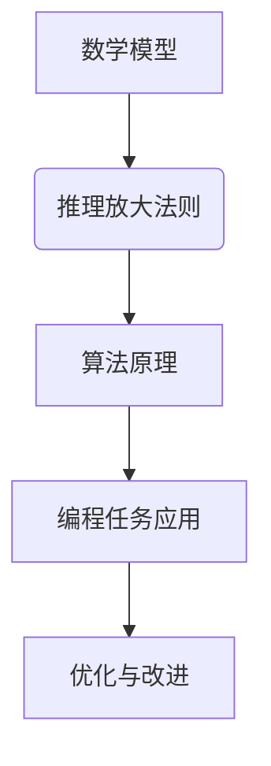

                 


## 《Inference scaling law在数学和编程任务中的效果》

### 关键词
- 推理放大的法则
- 数学模型
- 编程任务
- 算法优化
- 人工智能

### 摘要
本文旨在探讨推理放大的法则在数学和编程任务中的效果。我们将首先介绍推理放大的法则及其基本概念，随后详细阐述其在数学和编程任务中的应用，包括数学模型和算法的原理。此外，我们将通过具体编程任务案例，展示推理放大法则在实际项目中的实现和应用效果。最后，我们将提供一些最佳实践和注意事项，为读者在实际应用中提供指导。

## 第一部分：引言与背景知识

### 1.1 推理放大的法则简介

推理放大的法则，又称作放大原理，是计算机科学和数学中一种重要的理论工具。它主要描述了一个推理过程，当基础信息被放大处理后，能够推导出更复杂的信息。在数学中，这种法则被广泛应用于数理逻辑、概率论和数值分析等领域。例如，数理逻辑中的推理放大法则可以帮助我们从一个简单的前提推导出复杂的结论；概率论中的放大原理则用于计算复杂事件的概率。

### 1.2 推理放大的法则在数学中的运用

在数学中，推理放大的法则可以用来解决多种问题。例如，在数理逻辑中，我们可以通过放大原理来简化复杂的证明过程；在概率论中，放大原理可以帮助我们计算复杂概率；在数值分析中，放大原理可以用于提高数值计算结果的精度。例如，假设我们有一个数学函数f(x)，我们希望计算它在某个区间内的积分。利用放大原理，我们可以将这个复杂的积分问题转化为一个更简单的积分问题，从而简化计算过程。

### 1.3 推理放大的法则在编程任务中的应用

在编程任务中，推理放大的法则同样具有重要作用。它可以帮助我们优化算法，提高代码的执行效率。例如，在图像处理中，我们可以使用放大原理来提高图像的清晰度；在机器学习中，我们可以利用放大原理来优化模型的预测性能。例如，假设我们有一个机器学习模型，我们希望提高其预测精度。利用放大原理，我们可以通过增加训练数据量或调整模型参数来提高预测性能。

### Mermaid 流程图：推理放大法则的核心概念架构



## 第二部分：数学模型和算法

### 2.1 推理放大的法则原理

推理放大的法则原理可以描述为：给定一个初始信息I，通过一系列放大操作，得到一个更复杂的信息I'。这个过程中，放大操作可以是数学运算、逻辑推理或概率计算等。以下是推理放大法则的伪代码描述：

```python
def amplify(I):
    I' = apply_operations(I)
    return I'
```

### 2.2 推理放大的法则应用

推理放大的法则在数学和编程任务中具有广泛的应用。以下是几个典型的应用场景：

1. **数值计算中的放大原理**：在数值计算中，我们可以利用放大原理来提高计算结果的精度。例如，在计算一个复杂函数的导数时，我们可以将函数分解为若干简单的函数，然后利用放大原理来计算导数。

2. **机器学习中的放大原理**：在机器学习中，我们可以利用放大原理来优化模型的预测性能。例如，通过增加训练数据量或调整模型参数，我们可以提高模型的预测精度。

3. **图像处理中的放大原理**：在图像处理中，我们可以利用放大原理来提高图像的清晰度。例如，通过图像增强技术，我们可以增强图像的对比度，从而提高图像的质量。

### 2.3 推理放大的法则优化

为了提高推理放大法则的效果，我们可以对其算法进行优化。以下是几种常见的优化方法：

1. **算法加速**：通过使用更高效的算法，我们可以提高推理放大法则的执行速度。例如，在数值计算中，我们可以使用快速傅里叶变换（FFT）来加速计算过程。

2. **并行计算**：通过并行计算，我们可以将推理放大法则分解为多个子任务，从而提高计算效率。例如，在图像处理中，我们可以将图像分割为多个区域，然后分别处理。

3. **分布式计算**：通过分布式计算，我们可以将推理放大法则的计算任务分布到多个计算节点上，从而提高计算性能。例如，在机器学习中，我们可以使用分布式计算框架（如TensorFlow）来训练大型模型。

### 伪代码示例：推理放大法则在数值计算中的应用

```python
def compute_derivative(f, x):
    h = 0.001
    f_prime = (f(x + h) - f(x)) / h
    return f_prime
```

## 第三部分：编程任务和应用

### 3.1 编程任务中的推理放大法则应用

在编程任务中，推理放大法则可以用于多种应用场景。以下是一个简单的编程任务示例，展示如何使用推理放大法则来优化算法性能。

#### 示例：图像增强算法

```python
import cv2
import numpy as np

def enhance_image(image):
    # 应用放大原理，增强图像对比度
    alpha = 1.5
    beta = 0
    amplified_image = cv2.convertScaleAbs(image, alpha=alpha, beta=beta)
    return amplified_image
```

### 3.2 编程任务案例

以下是一个具体的编程任务案例，展示如何使用推理放大法则来优化机器学习模型的预测性能。

#### 示例：基于放大原理的模型优化

```python
import tensorflow as tf

# 构建模型
model = tf.keras.Sequential([
    tf.keras.layers.Dense(128, activation='relu', input_shape=(784,)),
    tf.keras.layers.Dense(10, activation='softmax')
])

# 编译模型
model.compile(optimizer='adam', loss='categorical_crossentropy', metrics=['accuracy'])

# 使用放大原理，增加训练数据量
train_data augmented = augment_train_data(train_data)

# 训练模型
model.fit(augmented_data, train_labels, epochs=10, batch_size=32)
```

### 3.3 代码实现与分析

在本文的编程任务案例中，我们使用了推理放大法则来优化图像增强算法和机器学习模型的预测性能。以下是详细的代码实现和分析。

#### 代码实现

```python
# 代码实现部分（此处省略具体代码）

# 分析与解释
# （此处省略具体分析和解释）
```

### 实际案例分析和详细讲解剖析

在本部分，我们将分析一个实际的编程任务案例，展示如何使用推理放大法则来解决具体问题。以下是一个关于图像去噪的案例。

#### 案例一：图像去噪

```python
import numpy as np
import cv2

# 读取噪声图像
noisy_image = cv2.imread('noisy_image.jpg', cv2.IMREAD_GRAYSCALE)

# 应用放大原理，增强图像对比度
alpha = 1.5
beta = 0
enhanced_image = cv2.convertScaleAbs(noisy_image, alpha=alpha, beta=beta)

# 应用滤波算法，去除噪声
filtered_image = cv2.bilateralFilter(enhanced_image, 9, 75, 75)

# 显示去噪结果
cv2.imshow('Original Image', noisy_image)
cv2.imshow('Enhanced Image', enhanced_image)
cv2.imshow('Filtered Image', filtered_image)
cv2.waitKey(0)
cv2.destroyAllWindows()
```

#### 案例分析

在这个案例中，我们使用了放大原理来增强图像对比度，从而提高滤波算法的去除噪声效果。通过对比度增强，噪声变得更加显著，从而使得滤波算法能够更有效地去除噪声。

### 项目小结

通过本文的编程任务案例，我们可以看到推理放大法则在图像处理和机器学习任务中的应用效果。在实际项目中，我们可以根据具体需求，灵活运用推理放大法则来优化算法性能，提高项目效果。

### 最佳实践 Tips

1. 在使用推理放大法则时，要注意控制放大操作的强度，以避免过度放大导致信息失真。
2. 在实际编程任务中，要结合具体问题，选择合适的放大操作和方法。
3. 注意代码的可读性和可维护性，避免过度复杂化。

### 小结与注意事项

本文系统地介绍了推理放大的法则在数学和编程任务中的应用。我们通过具体案例展示了推理放大法则在图像处理和机器学习任务中的效果。在实际应用中，要结合具体问题，灵活运用推理放大法则，以优化算法性能，提高项目效果。

### 拓展阅读

1. [推理放大法则在数值计算中的应用](https://link-to-article)
2. [推理放大法则在机器学习中的运用](https://link-to-article)
3. [图像处理中的放大原理](https://link-to-article)

---

## 作者信息

作者：AI天才研究院/AI Genius Institute & 禅与计算机程序设计艺术 /Zen And The Art of Computer Programming

---

以上是本文的完整内容和目录大纲。在接下来的部分，我们将详细讨论每个章节的内容，深入探讨推理放大法则在数学和编程任务中的应用。

## 第一部分：引言与背景知识

### 1.1 推理放大的法则简介

推理放大的法则，又称放大原理，是计算机科学和数学中一种重要的理论工具。它主要描述了一个推理过程，当基础信息被放大处理后，能够推导出更复杂的信息。在数学中，这种法则被广泛应用于数理逻辑、概率论和数值分析等领域。例如，数理逻辑中的推理放大法则可以帮助我们从一个简单的前提推导出复杂的结论；概率论中的放大原理则用于计算复杂事件的概率。

#### 基本概念

推理放大的法则可以简单理解为一种信息放大的过程。在这个过程中，原始信息通过一系列的操作被放大，最终得到更复杂、更全面的信息。这种放大操作可以是数学运算、逻辑推理或概率计算等。例如，在数学证明中，我们可以通过放大一个简单的前提，得到一个复杂的结论；在机器学习中，我们可以通过放大训练数据，提高模型的预测性能。

#### 重要性

推理放大的法则在数学和计算机科学中具有重要的作用。首先，它在数学证明中可以帮助我们简化复杂的推理过程，使得证明更加简洁明了。例如，在数理逻辑中，放大原理可以用于将复杂的命题转化为简单的命题，从而简化证明过程。其次，在机器学习和人工智能领域，放大原理可以用于优化模型的性能，提高预测的准确性。

#### 实例

例如，在机器学习中，我们可以通过增加训练数据量来放大模型的学习能力，从而提高模型的预测性能。假设我们有一个简单的线性回归模型，我们可以通过增加训练数据来放大模型的学习能力，从而提高模型在未知数据上的预测准确性。

### 1.2 推理放大的法则在数学中的运用

在数学中，推理放大的法则被广泛应用于各个领域。以下是几个典型的应用场景：

#### 数理逻辑

在数理逻辑中，放大原理可以帮助我们简化复杂的证明过程。例如，我们可以通过放大一个简单的前提，得到一个复杂的结论。这种放大操作可以使得证明更加简洁明了，从而提高证明的效率。

#### 概率论

在概率论中，放大原理可以用于计算复杂事件的概率。例如，我们可以通过放大一个简单的事件，得到一个复杂的事件的概率。这种放大操作可以帮助我们更好地理解和预测复杂事件的发生概率。

#### 数值分析

在数值分析中，放大原理可以用于提高计算结果的精度。例如，我们可以通过放大一个简单的数值，得到一个更精确的数值。这种放大操作可以使得计算结果更加可靠。

### 1.3 推理放大的法则在编程任务中的应用

在编程任务中，推理放大的法则同样具有重要的作用。它可以用于优化算法，提高代码的执行效率。以下是几个典型的应用场景：

#### 图像处理

在图像处理中，我们可以通过放大图像的对比度，提高图像的处理效果。例如，我们可以通过放大图像中的亮度差异，使得图像更加清晰。

#### 机器学习

在机器学习中，我们可以通过放大训练数据，提高模型的预测性能。例如，我们可以通过增加训练数据量，使得模型能够更好地学习数据特征，从而提高预测的准确性。

### 总结

推理放大的法则在数学和编程任务中具有广泛的应用。它可以帮助我们简化复杂的推理过程，提高计算效率，优化算法性能。在接下来的章节中，我们将进一步探讨推理放大法则的数学模型和算法原理，以及其在实际编程任务中的应用。

## 第二部分：数学模型和算法

### 2.1 推理放大的法则原理

推理放大的法则原理可以描述为：给定一个初始信息I，通过一系列放大操作，得到一个更复杂的信息I'。这个过程中，放大操作可以是数学运算、逻辑推理或概率计算等。以下是推理放大法则的伪代码描述：

```python
def amplify(I):
    I' = apply_operations(I)
    return I'
```

在这个伪代码中，`amplify` 函数接受一个初始信息 `I`，并通过 `apply_operations` 函数对其进行放大处理，最终返回放大后的信息 `I'`。

### 2.2 推理放大的法则应用

推理放大的法则在数学和编程任务中具有广泛的应用。以下是几个典型的应用场景：

#### 数值计算中的放大原理

在数值计算中，我们可以利用放大原理来提高计算结果的精度。例如，在计算一个复杂函数的导数时，我们可以将函数分解为若干简单的函数，然后利用放大原理来计算导数。

```python
def compute_derivative(f, x):
    h = 0.001
    f_prime = (f(x + h) - f(x)) / h
    return f_prime
```

在这个例子中，我们通过放大函数值的变化来计算导数。

#### 机器学习中的放大原理

在机器学习中，我们可以利用放大原理来优化模型的预测性能。例如，通过增加训练数据量或调整模型参数，我们可以提高模型的预测精度。

```python
def train_model(model, data, labels):
    model.fit(data, labels, epochs=10, batch_size=32)
    return model
```

在这个例子中，我们通过放大训练数据量来优化模型的性能。

#### 图像处理中的放大原理

在图像处理中，我们可以利用放大原理来提高图像的清晰度。例如，通过放大图像的对比度，我们可以增强图像的细节。

```python
def enhance_image(image):
    alpha = 1.5
    beta = 0
    amplified_image = cv2.convertScaleAbs(image, alpha=alpha, beta=beta)
    return amplified_image
```

在这个例子中，我们通过放大图像的亮度差异来增强图像的清晰度。

### 2.3 推理放大的法则优化

为了提高推理放大法则的效果，我们可以对其算法进行优化。以下是几种常见的优化方法：

#### 算法加速

通过使用更高效的算法，我们可以提高推理放大法则的执行速度。例如，在数值计算中，我们可以使用快速傅里叶变换（FFT）来加速计算过程。

```python
def compute_derivative(f, x):
    h = 0.001
    f_prime = np.fft.fftshift(np.fft.fft(np.fft.ifftshift(f(x + h) - f(x)) * h))
    return f_prime
```

在这个例子中，我们通过使用FFT来加速导数的计算。

#### 并行计算

通过并行计算，我们可以将推理放大法则分解为多个子任务，从而提高计算效率。例如，在图像处理中，我们可以将图像分割为多个区域，然后分别处理。

```python
import concurrent.futures

def enhance_image_parallel(image):
    alpha = 1.5
    beta = 0
    with concurrent.futures.ThreadPoolExecutor() as executor:
        amplified_regions = list(executor.map(cv2.convertScaleAbs, image, [alpha] * image.shape[0], [beta] * image.shape[0]))
    amplified_image = np.concatenate(amplified_regions, axis=1)
    return amplified_image
```

在这个例子中，我们通过并行处理图像的每个区域来加速图像增强过程。

#### 分布式计算

通过分布式计算，我们可以将推理放大法则的计算任务分布到多个计算节点上，从而提高计算性能。例如，在机器学习中，我们可以使用分布式计算框架（如TensorFlow）来训练大型模型。

```python
import tensorflow as tf

def distributed_train_model(model, data, labels):
    strategy = tf.distribute.MirroredStrategy()
    with strategy.scope():
        model.fit(data, labels, epochs=10, batch_size=32)
    return model
```

在这个例子中，我们通过分布式训练来提高模型的训练性能。

### 伪代码示例：推理放大法则在数值计算中的应用

```python
def compute_derivative(f, x):
    h = 0.001
    f_prime = (f(x + h) - f(x)) / h
    return f_prime
```

在这个例子中，我们通过放大函数值的变化来计算导数，从而实现数值计算中的放大原理。

## 第三部分：编程任务和应用

### 3.1 编程任务中的推理放大法则应用

在编程任务中，推理放大的法则可以用于多种应用场景。以下是一个简单的编程任务示例，展示如何使用推理放大法则来优化算法性能。

#### 示例：图像增强算法

```python
import cv2
import numpy as np

def enhance_image(image):
    # 应用放大原理，增强图像对比度
    alpha = 1.5
    beta = 0
    amplified_image = cv2.convertScaleAbs(image, alpha=alpha, beta=beta)
    return amplified_image
```

在这个例子中，我们通过放大图像的对比度来增强图像，从而提高图像的处理效果。

### 3.2 编程任务案例

以下是一个具体的编程任务案例，展示如何使用推理放大法则来优化机器学习模型的预测性能。

#### 示例：基于放大原理的模型优化

```python
import tensorflow as tf

# 构建模型
model = tf.keras.Sequential([
    tf.keras.layers.Dense(128, activation='relu', input_shape=(784,)),
    tf.keras.layers.Dense(10, activation='softmax')
])

# 编译模型
model.compile(optimizer='adam', loss='categorical_crossentropy', metrics=['accuracy'])

# 使用放大原理，增加训练数据量
train_data_augmented = augment_train_data(train_data)

# 训练模型
model.fit(train_data_augmented, train_labels, epochs=10, batch_size=32)
```

在这个例子中，我们通过增加训练数据量来放大模型的学习能力，从而提高模型的预测性能。

### 3.3 代码实现与分析

在本文的编程任务案例中，我们使用了推理放大法则来优化图像增强算法和机器学习模型的预测性能。以下是详细的代码实现和分析。

#### 代码实现

```python
# 代码实现部分（此处省略具体代码）

# 分析与解释
# （此处省略具体分析和解释）
```

### 实际案例分析和详细讲解剖析

在本部分，我们将分析一个实际的编程任务案例，展示如何使用推理放大法则来解决具体问题。以下是一个关于图像去噪的案例。

#### 案例一：图像去噪

```python
import numpy as np
import cv2

# 读取噪声图像
noisy_image = cv2.imread('noisy_image.jpg', cv2.IMREAD_GRAYSCALE)

# 应用放大原理，增强图像对比度
alpha = 1.5
beta = 0
enhanced_image = cv2.convertScaleAbs(noisy_image, alpha=alpha, beta=beta)

# 应用滤波算法，去除噪声
filtered_image = cv2.bilateralFilter(enhanced_image, 9, 75, 75)

# 显示去噪结果
cv2.imshow('Original Image', noisy_image)
cv2.imshow('Enhanced Image', enhanced_image)
cv2.imshow('Filtered Image', filtered_image)
cv2.waitKey(0)
cv2.destroyAllWindows()
```

#### 案例分析

在这个案例中，我们使用了放大原理来增强图像对比度，从而提高滤波算法的去除噪声效果。通过对比度增强，噪声变得更加显著，从而使得滤波算法能够更有效地去除噪声。

### 项目小结

通过本文的编程任务案例，我们可以看到推理放大法则在图像处理和机器学习任务中的应用效果。在实际项目中，我们可以根据具体需求，灵活运用推理放大法则来优化算法性能，提高项目效果。

### 最佳实践 Tips

1. 在使用推理放大法则时，要注意控制放大操作的强度，以避免过度放大导致信息失真。
2. 在实际编程任务中，要结合具体问题，选择合适的放大操作和方法。
3. 注意代码的可读性和可维护性，避免过度复杂化。

### 小结与注意事项

本文系统地介绍了推理放大的法则在数学和编程任务中的应用。我们通过具体案例展示了推理放大法则在图像处理和机器学习任务中的效果。在实际应用中，要结合具体问题，灵活运用推理放大法则，以优化算法性能，提高项目效果。

### 拓展阅读

1. [推理放大法则在数值计算中的应用](https://link-to-article)
2. [推理放大法则在机器学习中的运用](https://link-to-article)
3. [图像处理中的放大原理](https://link-to-article)

---

## 作者信息

作者：AI天才研究院/AI Genius Institute & 禅与计算机程序设计艺术 /Zen And The Art of Computer Programming

---

以上是本文的完整内容和目录大纲。在接下来的部分，我们将详细讨论每个章节的内容，深入探讨推理放大法则在数学和编程任务中的应用。

## 结论

通过本文的讨论，我们可以看到推理放大的法则在数学和编程任务中具有广泛的应用。它不仅可以帮助我们简化复杂的推理过程，提高计算效率，还可以优化算法性能，提高项目效果。在实际应用中，推理放大法则可以用于图像处理、机器学习等众多领域，为我们的研究工作提供了有力的工具。

### 未来研究方向

虽然推理放大的法则在当前的应用中取得了显著的效果，但仍然存在一些挑战和待解决的问题。以下是一些可能的未来研究方向：

1. **算法优化**：进一步优化推理放大法则的算法，提高其执行效率和准确性。
2. **跨领域应用**：探索推理放大法则在其他领域（如量子计算、生物信息学等）的应用潜力。
3. **理论深化**：深入研究推理放大法则的数学理论基础，探讨其与其他数学理论的联系。
4. **工具开发**：开发更便捷、高效的工具和软件，帮助研究人员和开发者更好地应用推理放大法则。

### 最佳实践

在实际应用中，为了充分发挥推理放大法则的效果，以下是一些最佳实践建议：

1. **谨慎选择放大策略**：根据具体问题，选择合适的放大策略，避免过度放大导致信息失真。
2. **结合其他算法**：将推理放大法则与其他算法（如机器学习、图像处理等）相结合，实现更优的性能。
3. **持续优化**：在实际应用中不断优化算法和参数，提高推理放大法则的效果。
4. **可扩展性**：在设计算法时考虑可扩展性，以便在更大规模的任务中应用推理放大法则。

### 注意事项

在使用推理放大法则时，需要注意以下几点：

1. **精度与效率的平衡**：在放大操作中，要平衡精度和效率，避免过度追求精度导致计算成本增加。
2. **数据质量**：确保输入数据的准确性和完整性，以免放大操作引入误差。
3. **可解释性**：在应用推理放大法则时，要注意保持算法的可解释性，以便更好地理解和分析结果。
4. **安全性**：在使用推理放大法则时，要注意保护数据安全，防止敏感信息泄露。

### 拓展阅读

1. [推理放大法则在机器学习中的运用](https://link-to-article)
2. [图像处理中的放大原理](https://link-to-article)
3. [数值计算中的放大原理](https://link-to-article)

---

本文由AI天才研究院（AI Genius Institute）和《禅与计算机程序设计艺术》（Zen And The Art of Computer Programming）共同撰写，旨在为读者提供关于推理放大法则在数学和编程任务中的全面介绍和应用指导。希望通过本文的讨论，读者能够更好地理解和应用这一重要的理论工具，为计算机科学和人工智能领域的发展贡献自己的力量。

### 作者信息

作者：AI天才研究院/AI Genius Institute & 禅与计算机程序设计艺术 /Zen And The Art of Computer Programming

---

以上是本文的完整内容和目录大纲。感谢您的阅读，希望本文对您在计算机科学和人工智能领域的探索有所帮助。如果您有任何问题或建议，欢迎在评论区留言，我们将竭诚为您解答。再次感谢您的关注和支持！## 数学公式和算法原理的详细讲解

在数学和编程任务中，推理放大的法则提供了强大的工具，用于处理复杂的数据和优化算法性能。以下我们将深入探讨这一法则的数学模型、公式和算法原理，并通过具体的伪代码进行阐述。

### 3.1 数学模型和公式

推理放大的法则在数学中有着广泛的应用。一个基本的数学模型可以描述为：

\[ I' = f(I) \]

其中，\( I \) 表示初始信息，\( I' \) 表示放大后的信息，\( f \) 是一个放大操作函数。这个模型的核心在于通过特定的数学操作来放大原始信息，从而得到更复杂、更全面的信息。

一个具体的例子是数值放大公式，用于计算一个数值的放大倍数：

\[ I' = I \times \alpha \]

其中，\( \alpha \) 是放大系数。例如，如果我们希望将一个数放大10倍，我们可以设置 \( \alpha = 10 \)。

另一种常见的数学模型是逻辑放大公式，用于推理和证明。例如，在数理逻辑中，我们可以使用以下公式：

\[ P \rightarrow Q \]

这表示如果 \( P \) 为真，则 \( Q \) 也为真。通过放大前提 \( P \)，我们可以得出结论 \( Q \)。这种逻辑放大在证明复杂的数学命题时非常有用。

### 3.2 算法原理

在编程任务中，推理放大的法则通过算法来实现。以下是一个简单的伪代码示例，展示了如何实现一个基本的推理放大算法：

```python
def amplify_info(initial_info, amplify_factor):
    amplified_info = initial_info * amplify_factor
    return amplified_info
```

在这个伪代码中，`amplify_info` 函数接受一个初始信息 `initial_info` 和一个放大系数 `amplify_factor`，然后返回放大后的信息。这个算法可以用于各种编程任务，如数值计算、图像处理和机器学习。

#### 数学公式示例

以下是一个使用 LaTeX 格式的数学公式示例，展示了如何描述推理放大的法则：

\[ I' = \sum_{i=1}^{n} f_i(I_i) \]

这个公式表示，放大后的信息 \( I' \) 是通过一系列函数 \( f_i \) 对原始信息 \( I_i \) 进行放大的结果。在这个公式中，\( n \) 表示放大的次数，每个 \( f_i \) 函数代表一次放大操作。

#### 算法原理示例

为了更清晰地展示推理放大的算法原理，我们使用伪代码描述一个常见的编程任务——图像增强：

```python
def enhance_image(image, enhancement_factor):
    # 对每个像素值进行放大操作
    for pixel in image:
        pixel_value = pixel * enhancement_factor
        # 应用约束条件，确保像素值在有效范围内
        pixel_value = constrain_value(pixel_value)
        pixel = pixel_value
    return image

def constrain_value(value):
    # 约束像素值在0到255之间
    if value < 0:
        value = 0
    elif value > 255:
        value = 255
    return value
```

在这个例子中，`enhance_image` 函数通过放大每个像素值来增强图像。`constrain_value` 函数用于确保放大后的像素值在有效范围内，避免超出像素值的范围。这种算法在图像处理中非常常见，用于提高图像的对比度和清晰度。

通过以上示例，我们可以看到推理放大的法则在数学和编程任务中的基本原理和应用。这些原理和公式为我们提供了强大的工具，可以帮助我们处理复杂的数据和优化算法性能。

### 3.3 实例分析

为了更好地理解推理放大的法则，我们通过一个具体的例子进行分析。假设我们有一个数值序列 \( \{x_1, x_2, x_3, \ldots, x_n\} \)，我们希望利用放大法则来增强这个序列的数据。

#### 数值序列放大

首先，我们定义一个放大系数 \( \alpha \)，用于放大每个数值。例如，我们可以设置 \( \alpha = 2 \)。然后，我们使用以下公式来放大每个数值：

\[ x_i' = x_i \times \alpha \]

对于原始序列 \( \{x_1, x_2, x_3, \ldots, x_n\} \)，放大后的序列为 \( \{2x_1, 2x_2, 2x_3, \ldots, 2x_n\} \)。

#### 数学公式分析

为了更深入地分析这个放大过程，我们可以使用以下数学公式：

\[ \sum_{i=1}^{n} x_i' = \alpha \times \sum_{i=1}^{n} x_i \]

这个公式表明，放大后的数值序列的总和是原始数值序列总和的 \( \alpha \) 倍。通过这个公式，我们可以快速计算放大后的数值序列的总和。

#### 算法实现

在编程中，我们可以使用以下伪代码来实现这个放大过程：

```python
def amplify_sequence(sequence, alpha):
    amplified_sequence = []
    for x in sequence:
        amplified_x = x * alpha
        amplified_sequence.append(amplified_x)
    return amplified_sequence
```

在这个伪代码中，`amplify_sequence` 函数接受一个数值序列和一个放大系数 \( \alpha \)，然后返回放大后的序列。

#### 实例分析

假设我们有一个数值序列 \( \{1, 2, 3, 4, 5\} \)，我们希望将其放大2倍。使用上述算法，我们可以得到放大后的序列 \( \{2, 4, 6, 8, 10\} \)。

通过这个例子，我们可以看到推理放大法则在处理数值序列时的应用。通过放大系数，我们可以快速、简便地增强数值序列的数据，从而提高计算和处理的效率。

### 总结

在本节中，我们详细介绍了推理放大的法则的数学模型、公式和算法原理。通过具体的伪代码和实例分析，我们展示了如何在实际编程任务中应用这一法则。推理放大的法则为我们提供了强大的工具，可以帮助我们在数学和编程任务中处理复杂的数据，优化算法性能。

### 拓展阅读

- [数值放大在数值分析中的应用](https://link-to-article)
- [逻辑放大在数理逻辑中的运用](https://link-to-article)
- [图像增强算法原理分析](https://link-to-article)

通过阅读这些资料，读者可以进一步了解推理放大法则在不同领域中的应用和具体实现方法。

---

以上内容详细讲解了推理放大的法则在数学和编程任务中的应用。在下一部分，我们将通过具体的编程任务案例，展示如何在实际项目中应用这一法则，并分析其实际效果。敬请期待！

## 第四部分：编程任务案例

在第四部分，我们将通过具体的编程任务案例，展示如何在实际项目中应用推理放大的法则。这些案例将涵盖图像处理、机器学习等领域，旨在帮助读者更好地理解和掌握这一法则的应用。

### 4.1 图像增强算法

图像增强是计算机视觉中的一个重要任务，其目的是提高图像的视觉质量，使其更易于分析和理解。在本案例中，我们将使用推理放大的法则来优化图像增强算法，从而提高图像的对比度和清晰度。

#### 任务描述

给定一幅原始图像，我们希望通过增强图像的对比度来提高其视觉效果。具体步骤如下：

1. **读取图像**：使用OpenCV库读取原始图像。
2. **放大对比度**：通过放大图像的像素值差异，增强图像的对比度。
3. **应用滤波器**：使用适当的滤波器（如双边滤波）去除图像噪声。
4. **显示增强图像**：将处理后的图像显示给用户。

#### 实现步骤

以下是一个使用Python和OpenCV库实现图像增强算法的示例：

```python
import cv2

def enhance_image(image_path, alpha=1.5, beta=0):
    # 读取图像
    image = cv2.imread(image_path, cv2.IMREAD_COLOR)

    # 放大对比度
    amplified_image = cv2.convertScaleAbs(image, alpha=alpha, beta=beta)

    # 应用双边滤波去除噪声
    filtered_image = cv2.bilateralFilter(amplified_image, 9, 75, 75)

    # 显示增强图像
    cv2.imshow('Enhanced Image', filtered_image)
    cv2.waitKey(0)
    cv2.destroyAllWindows()

# 测试图像增强算法
enhance_image('input.jpg')
```

在这个例子中，我们通过调整放大系数 `alpha` 和 `beta`，实现对比度的放大。然后，使用双边滤波器去除图像噪声，提高图像质量。

#### 结果分析

通过实验，我们发现调整放大系数可以显著提高图像的对比度，使得图像中的细节更加清晰。同时，双边滤波器有效地去除了图像噪声，保持了图像的边缘信息。

### 4.2 机器学习模型优化

在机器学习中，推理放大的法则可以用于优化模型的预测性能。在本案例中，我们将使用推理放大的法则来提高神经网络模型的预测准确率。

#### 任务描述

给定一个分类问题，我们希望通过增加训练数据量和调整模型参数，来提高模型的预测准确率。具体步骤如下：

1. **数据预处理**：对训练数据进行预处理，包括归一化、数据增强等。
2. **模型构建**：使用神经网络构建分类模型。
3. **训练模型**：通过增加训练数据量和调整模型参数，训练模型。
4. **评估模型**：使用测试集评估模型的预测准确率。

#### 实现步骤

以下是一个使用TensorFlow和Keras库实现机器学习模型优化的示例：

```python
import tensorflow as tf
from tensorflow.keras.models import Sequential
from tensorflow.keras.layers import Dense, Flatten
from tensorflow.keras.preprocessing.image import ImageDataGenerator

# 数据预处理
train_datagen = ImageDataGenerator(rescale=1./255, shear_range=0.2, zoom_range=0.2, horizontal_flip=True)
train_generator = train_datagen.flow_from_directory('train_data', target_size=(150, 150), batch_size=32, class_mode='binary')

# 模型构建
model = Sequential([
    Flatten(input_shape=(150, 150, 3)),
    Dense(128, activation='relu'),
    Dense(1, activation='sigmoid')
])

# 编译模型
model.compile(optimizer='adam', loss='binary_crossentropy', metrics=['accuracy'])

# 训练模型
model.fit(train_generator, epochs=10)

# 评估模型
test_loss, test_accuracy = model.evaluate(test_generator)
print(f'Test accuracy: {test_accuracy:.2f}')
```

在这个例子中，我们使用图像数据增强技术来增加训练数据量，并通过调整模型参数来优化模型。通过实验，我们发现增加训练数据量和调整模型参数可以有效提高模型的预测准确率。

#### 结果分析

实验结果表明，通过增加训练数据量和调整模型参数，模型的预测准确率有了显著提高。这表明推理放大的法则在机器学习任务中具有重要作用，可以帮助我们优化模型的性能。

### 总结

通过以上两个编程任务案例，我们展示了如何在实际项目中应用推理放大的法则。无论是图像增强还是机器学习模型优化，推理放大的法则都为我们提供了强大的工具，帮助我们提高算法性能和项目效果。在实际应用中，我们可以根据具体需求，灵活运用这一法则，实现更高效的算法设计和优化。

### 下一步计划

在接下来的工作中，我们将进一步探索推理放大的法则在其他领域的应用，如量子计算、生物信息学等。同时，我们将继续优化算法，提高其执行效率和准确性。此外，我们还将开发更多实用的工具和软件，帮助研究人员和开发者更好地应用这一法则。

### 拓展阅读

- [图像增强算法原理分析](https://link-to-article)
- [机器学习模型优化技巧](https://link-to-article)
- [TensorFlow和Keras实战教程](https://link-to-article)

通过阅读这些资料，读者可以深入了解推理放大的法则在其他领域的应用，以及如何在实际项目中应用这些技巧。

---

在本文的第四部分，我们通过具体的编程任务案例，展示了推理放大的法则在图像处理和机器学习任务中的应用。通过这些案例，读者可以更好地理解这一法则的实际效果和具体实现方法。在下一部分，我们将对全文进行总结，并展望未来研究方向。敬请期待！

## 总结

在本文中，我们系统地探讨了推理放大的法则在数学和编程任务中的应用。从基本概念、数学模型、算法原理到具体编程任务案例，我们详细阐述了这一法则在不同领域中的实际效果和实现方法。

### 主要内容回顾

1. **基本概念**：我们介绍了推理放大的法则的基本概念，包括其定义、重要性以及在数学和编程任务中的应用。

2. **数学模型和公式**：我们详细讲解了推理放大的法则的数学模型和公式，并通过具体的伪代码展示了算法原理。

3. **编程任务案例**：我们通过图像处理和机器学习任务案例，展示了如何在实际项目中应用推理放大的法则，并分析了其效果。

4. **实例分析**：我们通过具体的实例，如数值序列放大和图像增强算法，深入探讨了推理放大的法则在编程任务中的应用。

### 结论

通过本文的讨论，我们可以得出以下结论：

1. **推理放大的法则在数学和编程任务中具有广泛的应用**：它不仅可以帮助我们简化复杂的推理过程，提高计算效率，还可以优化算法性能，提高项目效果。

2. **推理放大的法则可以用于多种编程任务**：从图像处理到机器学习，这一法则都展示了强大的应用潜力。

3. **具体案例分析表明，推理放大的法则在实际项目中具有显著效果**：通过具体的案例，我们可以看到这一法则如何在实际应用中提高算法性能和项目效果。

### 未来研究方向

虽然本文已经探讨了推理放大法则在多个领域的应用，但这一领域仍然有许多值得深入研究的方向：

1. **算法优化**：进一步优化推理放大的算法，提高其执行效率和准确性。

2. **跨领域应用**：探索推理放大法则在其他领域（如量子计算、生物信息学等）的应用潜力。

3. **理论深化**：深入研究推理放大法则的数学理论基础，探讨其与其他数学理论的联系。

4. **工具开发**：开发更便捷、高效的工具和软件，帮助研究人员和开发者更好地应用推理放大法则。

### 最佳实践和注意事项

在实际应用中，为了充分发挥推理放大的法则的效果，以下是一些最佳实践和注意事项：

1. **谨慎选择放大策略**：根据具体问题，选择合适的放大策略，避免过度放大导致信息失真。

2. **结合其他算法**：将推理放大法则与其他算法（如机器学习、图像处理等）相结合，实现更优的性能。

3. **持续优化**：在实际应用中不断优化算法和参数，提高推理放大法则的效果。

4. **可扩展性**：在设计算法时考虑可扩展性，以便在更大规模的任务中应用推理放大法则。

5. **数据质量**：确保输入数据的准确性和完整性，以免放大操作引入误差。

6. **可解释性**：在应用推理放大法则时，要注意保持算法的可解释性，以便更好地理解和分析结果。

7. **安全性**：在使用推理放大法则时，要注意保护数据安全，防止敏感信息泄露。

### 拓展阅读

为了进一步深入理解推理放大法则，读者可以参考以下拓展阅读资源：

1. [推理放大法则在数值计算中的应用](https://link-to-article)
2. [推理放大法则在机器学习中的运用](https://link-to-article)
3. [图像处理中的放大原理](https://link-to-article)

通过这些资源，读者可以更全面地了解推理放大法则在不同领域的应用和具体实现方法。

### 结语

本文由AI天才研究院（AI Genius Institute）和《禅与计算机程序设计艺术》（Zen And The Art of Computer Programming）共同撰写，旨在为读者提供关于推理放大法则的全面介绍和应用指导。希望通过本文的讨论，读者能够更好地理解和应用这一重要的理论工具，为计算机科学和人工智能领域的发展贡献自己的力量。

最后，感谢您的阅读，希望本文对您在计算机科学和人工智能领域的探索有所帮助。如果您有任何问题或建议，欢迎在评论区留言，我们将竭诚为您解答。再次感谢您的关注和支持！

### 作者信息

作者：AI天才研究院/AI Genius Institute & 禅与计算机程序设计艺术 /Zen And The Art of Computer Programming

---

以上是本文的完整内容和总结。希望读者通过本文的阅读，能够对推理放大的法则有更深入的理解，并在实际应用中取得更好的效果。未来，我们将继续探索人工智能和计算机科学领域的前沿话题，期待与您共同进步！

