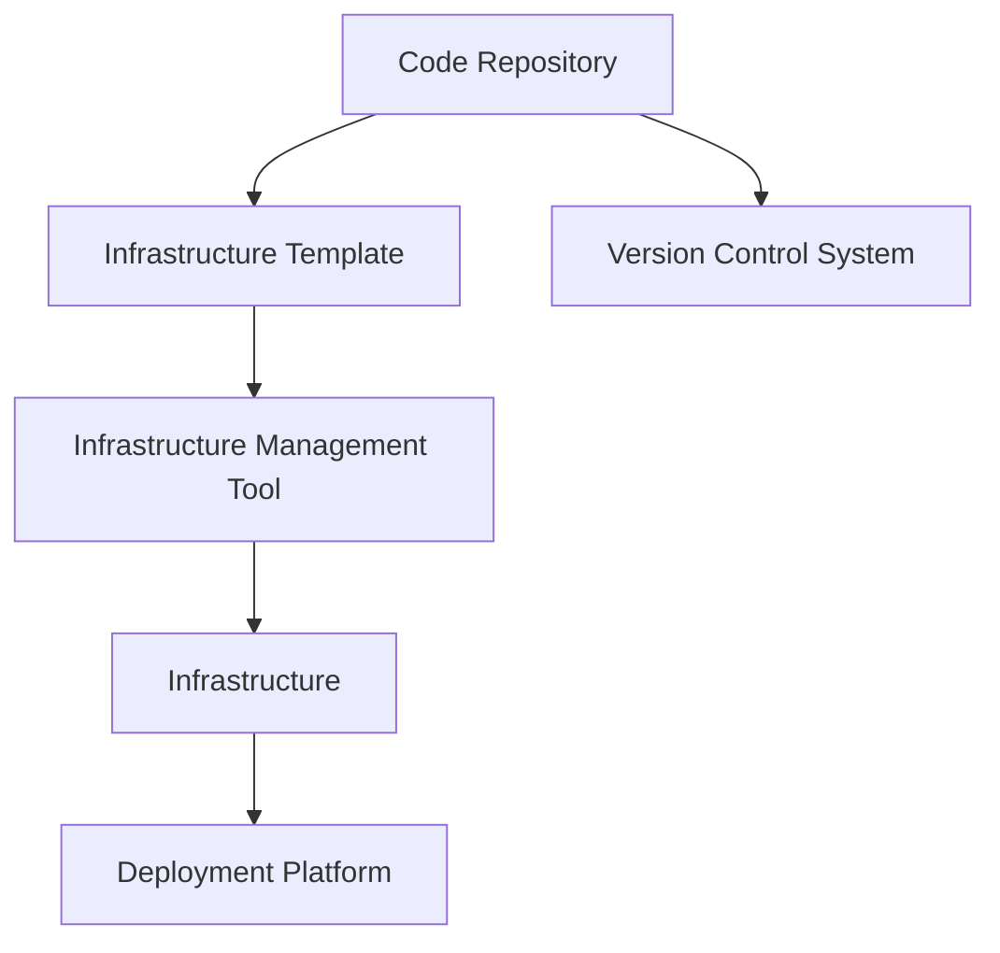
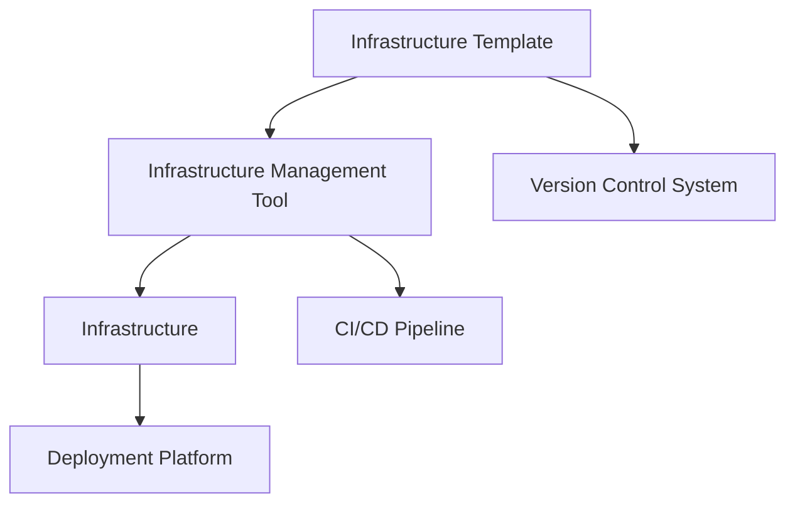

                 

### 文章标题

# 《Infrastructure as Code：基础设施即代码的理念与实践》

### 文章关键词

- 基础设施即代码
- 自动化
- 配置管理
- 持续集成与持续部署
- 云服务
- 容器化
- 工具与平台

### 文章摘要

本文将深入探讨基础设施即代码（Infrastructure as Code，简称IaC）的理念与实践。基础设施即代码是一种通过代码来管理、配置和部署基础设施的方法，其核心在于将基础设施的定义和管理与代码紧密结合起来，从而实现自动化、可重复和可追溯的基础设施管理。本文首先介绍了基础设施即代码的基本概念，随后探讨了其原理、架构、核心算法原理、应用场景、工具与平台，并通过一个实际项目案例展示了基础设施即代码的实践过程。最后，本文对基础设施即代码的未来进行了展望，并提出了最佳实践和建议。

## 第一部分：基础设施即代码概述

### 第1章：基础设施即代码介绍

基础设施即代码（Infrastructure as Code，简称IaC）是一种通过代码来管理和配置基础设施的方法。在传统的IT环境中，基础设施的创建、配置和管理通常是通过手动操作完成的，这不仅耗时耗力，而且容易出错，难以管理。随着云计算和自动化技术的发展，基础设施即代码的概念应运而生，它通过将基础设施的定义和管理与代码结合，实现了基础设施的自动化管理。

#### 1.1 基础设施即代码的基本概念

基础设施即代码的核心思想是将基础设施的配置和部署过程抽象成代码，从而实现自动化管理。在IaC中，基础设施的配置和部署不再是手工操作，而是通过编写代码来完成的。这些代码通常存储在版本控制系统（如Git）中，可以方便地进行版本管理和协同工作。

#### 1.2 基础设施即代码的历史与发展

基础设施即代码的概念最早可以追溯到2006年，由亚马逊的云服务团队提出。亚马逊推出了AWS CloudFormation，这是一种基于基础设施即代码的服务，通过JSON或YAML格式的模板来定义和部署云资源。此后，微软也推出了Azure Resource Manager，谷歌推出了Google Cloud Deployment Manager，这些工具都极大地推动了基础设施即代码的发展。

#### 1.3 基础设施即代码的核心优势

基础设施即代码具有以下核心优势：

1. **自动化**：通过代码来管理和部署基础设施，可以大大减少手动操作，提高效率。
2. **可重复**：由于基础设施的配置和部署过程被代码化，可以轻松地重复执行，确保一致性。
3. **可追溯**：代码存储在版本控制系统中，可以方便地追溯历史变更，提高管理透明度。
4. **可测试**：代码可以像软件一样进行测试，确保基础设施的配置和部署过程没有问题。

### 第2章：基础设施即代码原理与架构

基础设施即代码的实现涉及到多个关键组件和步骤。以下是对基础设施即代码原理和架构的详细介绍。

#### 2.1 基础设施即代码的架构概述

基础设施即代码的架构通常包括以下几个核心组件：

1. **基础设施模板**：基础设施模板是定义基础设施配置的代码，通常使用JSON、YAML或Terraform等格式编写。
2. **基础设施管理工具**：基础设施管理工具（如AWS CloudFormation、Azure Resource Manager、Terraform等）负责根据模板生成和管理实际的基础设施。
3. **版本控制系统**：版本控制系统（如Git）用于存储和管理基础设施模板的版本，确保代码的可追溯性和可管理性。
4. **部署和管理平台**：部署和管理平台（如CI/CD流水线、Kubernetes等）负责根据基础设施模板自动部署和管理基础设施。

以下是一个简化的基础设施即代码架构的Mermaid流程图：



#### 2.2 核心概念与联系

基础设施即代码中的核心概念包括：

1. **基础设施模板**：基础设施模板是定义基础设施配置的代码文件，通常使用JSON、YAML或Terraform等格式编写。模板中定义了基础设施的详细信息，如虚拟机、网络、存储等。
2. **基础设施管理工具**：基础设施管理工具负责根据基础设施模板生成和管理实际的基础设施。这些工具可以自动执行部署、配置、更新和删除等操作。
3. **版本控制系统**：版本控制系统用于存储和管理基础设施模板的版本。通过版本控制系统，可以方便地追踪代码的变更历史，实现代码的版本管理和协作。
4. **部署和管理平台**：部署和管理平台负责根据基础设施模板自动部署和管理基础设施。这些平台可以与基础设施管理工具集成，实现自动化部署和监控。

以下是这些概念之间的联系示意图：



#### 2.3 核心算法原理讲解

基础设施即代码的核心算法原理主要包括配置管理算法和自动化部署算法。

**配置管理算法**

配置管理算法负责根据基础设施模板生成实际的基础设施配置。以下是一个简化的配置管理算法的伪代码：

```pseudocode
Function ConfigureInfrastructure(template):
    For each resource in template:
        Set configuration properties for resource
        Deploy resource with configured properties
    End For
    Return DeployedInfrastructure
End Function
```

在这个算法中，`template` 是一个包含基础设施配置的模板，`resource` 是模板中的一个资源。算法的步骤包括：

1. 遍历模板中的每个资源。
2. 为每个资源设置配置属性。
3. 部署资源，使用其配置属性。

**自动化部署算法**

自动化部署算法负责根据配置管理算法的结果，自动部署和管理基础设施。以下是一个简化的自动化部署算法的伪代码：

```pseudocode
Function DeployInfrastructure(deploymentConfig):
    Import deploymentConfig from code repository
    Execute deployment script
    Verify deployment success
    Return DeploymentStatus
End Function
```

在这个算法中，`deploymentConfig` 是从代码仓库中导入的基础设施配置，`deployment script` 是用于部署基础设施的脚本。算法的步骤包括：

1. 从代码仓库中导入基础设施配置。
2. 执行部署脚本。
3. 验证部署是否成功。
4. 返回部署状态。

#### 2.4 数学模型和公式

在基础设施即代码中，数学模型和公式主要用于描述资源的配置属性和部署策略。以下是一个简化的数学模型：

$$
\text{Resource Configuration} = \sum_{i=1}^{n} (\text{Resource}_i \times \text{Property}_i)
$$

在这个模型中，`Resource Configuration` 表示资源的配置属性，`Resource_i` 表示第 i 个资源的配置，`Property_i` 表示第 i 个资源的属性。

**详细讲解和举例说明**

假设我们有三个资源：虚拟机（VM）、数据库（DB）和网络（Network）。每个资源有不同的配置属性，如下所示：

| 资源  | 配置属性         | 属性值       |
| ----- | ---------------- | ------------ |
| 虚拟机 | CPU核心数       | 4            |
| 数据库 | 存储容量       | 100GB        |
| 网络   | 网络带宽       | 1Gbps        |

根据上述模型，我们可以计算每个资源的配置值：

$$
\text{Virtual Machine Configuration} = 4 \times 4 = 16
$$

$$
\text{Database Configuration} = 1 \times 100 = 100
$$

$$
\text{Network Configuration} = 1 \times 1 = 1
$$

总配置值为：

$$
\text{Total Configuration} = 16 + 100 + 1 = 117
$$

这意味着我们的基础设施配置总共有117个单位。我们可以使用这个值来评估和优化资源配置。

### 第3章：基础设施即代码的核心算法原理

在基础设施即代码中，核心算法原理是确保基础设施配置的准确性和高效性。以下是对这些核心算法原理的详细解释。

#### 3.1 配置管理算法

配置管理算法是基础设施即代码中的基础组件，负责将基础设施模板中的配置信息转换为实际的基础设施配置。以下是配置管理算法的伪代码：

```pseudocode
Function ConfigureInfrastructure(template):
    For each resource in template:
        Set configuration properties for resource
        Deploy resource with configured properties
    End For
    Return DeployedInfrastructure
End Function
```

在这个算法中，`template` 是一个包含基础设施配置的模板，`resource` 是模板中的一个资源。算法的步骤包括：

1. 遍历模板中的每个资源。
2. 为每个资源设置配置属性。
3. 部署资源，使用其配置属性。

**详细解释和举例说明**

假设我们有一个基础设施模板，其中包含三个资源：虚拟机（VM）、数据库（DB）和网络（Network）。每个资源有不同的配置属性，如下所示：

| 资源  | 配置属性       | 属性值       |
| ----- | ------------ | ------------ |
| 虚拟机 | CPU核心数     | 4            |
| 数据库 | 存储容量     | 100GB        |
| 网络   | 网络带宽     | 1Gbps        |

配置管理算法将按照以下步骤执行：

1. **读取基础设施模板**：算法首先读取基础设施模板，获取每个资源的配置信息。
2. **设置配置属性**：算法遍历每个资源，为每个资源设置其所需的配置属性。例如，对于虚拟机，设置CPU核心数为4；对于数据库，设置存储容量为100GB；对于网络，设置网络带宽为1Gbps。
3. **部署资源**：算法使用配置属性部署每个资源。例如，创建一个具有4个CPU核心的虚拟机，配置100GB存储的数据库，以及1Gbps带宽的网络。

配置管理算法的关键在于确保每个资源的配置都是正确的，并且符合模板的要求。为了实现这一点，算法需要严格遵循模板中定义的配置规则，并在部署过程中进行验证。

#### 3.2 自动化部署算法

自动化部署算法是基础设施即代码中的关键组件，负责根据配置管理算法的结果，自动部署和管理基础设施。以下是自动化部署算法的伪代码：

```pseudocode
Function DeployInfrastructure(deploymentConfig):
    Import deploymentConfig from code repository
    Execute deployment script
    Verify deployment success
    Return DeploymentStatus
End Function
```

在这个算法中，`deploymentConfig` 是从代码仓库中导入的基础设施配置，`deployment script` 是用于部署基础设施的脚本。算法的步骤包括：

1. **导入配置**：算法首先从代码仓库中导入基础设施配置，这些配置通常以JSON、YAML或Terraform等格式存储。
2. **执行部署脚本**：算法执行部署脚本，该脚本包含具体的部署指令和步骤，用于在目标环境中部署基础设施。
3. **验证部署成功**：算法验证部署过程是否成功完成，并检查基础设施配置是否与预期一致。
4. **返回部署状态**：算法返回部署状态，包括成功、失败或部分成功的状态。

**详细解释和举例说明**

假设我们有一个基础设施配置，如下所示：

```json
{
  "virtual_machines": [
    {
      "name": "vm1",
      "image": "ami-123456",
      "instance_type": "t2.micro",
      "cpu_cores": 4
    }
  ],
  "databases": [
    {
      "name": "db1",
      "instance": "db-123456",
      "type": "postgresql",
      "size": "100GB"
    }
  ],
  "networks": [
    {
      "name": "net1",
      "cidr": "10.0.0.0/16",
      "subnet": "10.0.0.0/24"
    }
  ]
}
```

自动化部署算法将按照以下步骤执行：

1. **导入配置**：算法从代码仓库中导入上述基础设施配置。
2. **执行部署脚本**：算法执行一个部署脚本，该脚本可能包含以下步骤：
   - 创建虚拟机：使用配置中的虚拟机信息创建一个虚拟机。
   - 配置数据库：创建一个PostgreSQL数据库实例，并配置100GB的存储。
   - 配置网络：创建一个CIDR块为10.0.0.0/16的子网。
3. **验证部署成功**：算法检查每个资源的部署状态，确保虚拟机、数据库和网络都按照预期配置和部署。
4. **返回部署状态**：算法返回部署状态，确认所有资源都成功部署。

通过自动化部署算法，基础设施即代码可以实现快速、可靠和一致的基础设施部署，从而提高运维效率和资源利用率。

### 第4章：基础设施即代码的应用场景

基础设施即代码（IaC）的灵活性和可重复性使其在多个应用场景中变得非常有用。以下是一些常见的基础设施即代码应用场景，以及每个场景中IaC的优势和实现方法。

#### 4.1 云服务配置管理

云服务配置管理是基础设施即代码最常见的应用场景之一。通过使用IaC，开发人员和运维团队能够轻松地定义、部署和管理云资源，如虚拟机、存储、数据库和网络组件。

**优势：**
- **自动化**：自动部署和配置云资源，减少手动操作，提高效率。
- **一致性**：确保所有云资源的配置都是一致的，减少配置错误。
- **可重复**：轻松复制和扩展云资源配置，支持自动化扩展。

**实现方法：**
- 使用云服务商提供的IaC工具（如AWS CloudFormation、Azure Resource Manager、Google Cloud Deployment Manager）。
- 编写YAML或JSON格式的配置文件，定义云资源的详细信息。
- 将配置文件存储在版本控制系统（如Git）中，以便跟踪和协作。

#### 4.2 容器化基础设施管理

随着容器技术的流行，基础设施即代码在容器化基础设施管理中也发挥着重要作用。通过IaC，可以自动化部署和管理容器化应用及其依赖的基础设施。

**优势：**
- **容器化一致性**：确保容器运行环境的一致性和可重复性。
- **简化部署**：自动化容器化应用的部署过程，减少错误。
- **资源优化**：根据容器需求动态分配资源，提高资源利用率。

**实现方法：**
- 使用容器编排工具（如Kubernetes）的IaC功能。
- 编写Kubernetes配置文件（如YAML文件），定义容器化应用及其资源需求。
- 使用CI/CD流水线自动化部署和管理容器化应用。

#### 4.3 自动化网络配置

自动化网络配置是另一个基础设施即代码的重要应用场景。通过IaC，可以自动化网络资源的配置和管理，确保网络环境的稳定性和安全性。

**优势：**
- **自动化**：自动化网络配置和更改，提高效率。
- **可追踪性**：通过版本控制系统跟踪网络配置的变更历史。
- **安全性**：确保网络配置符合安全策略。

**实现方法：**
- 使用自动化网络配置工具（如Terraform、Ansible）。
- 编写网络配置脚本或模板，定义网络资源的配置。
- 将配置脚本或模板存储在版本控制系统中，自动化部署和管理网络资源。

#### 4.4 多云和混合云环境管理

在多云和混合云环境中，基础设施即代码有助于统一管理和部署跨云平台的基础设施。

**优势：**
- **跨云一致性**：确保不同云平台上的基础设施配置一致性。
- **灵活性**：支持在多个云平台上部署和管理应用。
- **成本优化**：根据需求动态调整资源分配，优化成本。

**实现方法：**
- 使用支持多云的IaC工具（如Terraform、Pulumi）。
- 编写跨云基础设施模板，定义跨云资源的需求。
- 使用CI/CD流水线自动化部署和管理跨云基础设施。

通过上述应用场景，基础设施即代码显著提高了基础设施管理的效率、一致性和可重复性，成为现代IT运维的关键工具。

### 第5章：基础设施即代码的工具与平台

基础设施即代码（IaC）的实现依赖于一系列工具和平台，这些工具和平台提供了自动化基础设施配置和管理的能力。以下是一些常见的基础设施即代码工具和平台，以及它们的特点和用途。

#### 5.1 常见IaC工具对比

**1. Terraform**

**特点**：Terraform 是最受欢迎的IaC工具之一，支持多种云平台和云服务提供商，如AWS、Azure、GCP等。

**用途**：Terraform 用于定义和管理云基础设施，提供模块化架构，便于复用和协作。

**优势**：支持多云和混合云环境，灵活性强，具有丰富的生态系统。

**2. AWS CloudFormation**

**特点**：AWS CloudFormation 是AWS提供的IaC服务，专门用于AWS云资源的管理。

**用途**：AWS CloudFormation 用于创建和管理AWS云资源，提供模板定义功能。

**优势**：与AWS服务深度集成，易于使用，支持自动化部署和管理。

**3. Azure Resource Manager (ARM)**

**特点**：Azure Resource Manager 是Azure提供的IaC服务，用于管理Azure云资源。

**用途**：ARM 用于创建和管理Azure云资源，支持资源组、模板和参数化配置。

**优势**：与Azure服务深度集成，易于使用，支持自动化部署和管理。

**4. Google Cloud Deployment Manager**

**特点**：Google Cloud Deployment Manager 是Google Cloud提供的IaC服务，用于定义和管理云资源。

**用途**：Deployment Manager 用于创建和管理Google Cloud资源，提供模板和部署文件。

**优势**：与Google Cloud服务深度集成，支持自动化部署和管理。

**5. Pulumi**

**特点**：Pulumi 是一个开源的IaC平台，支持多种编程语言和云服务提供商。

**用途**：Pulumi 用于跨云资源的管理和部署，提供代码化基础设施管理。

**优势**：支持多种编程语言，灵活性强，支持自动化部署和管理。

**6. Ansible**

**特点**：Ansible 是一个开源的自动化工具，用于配置管理、应用部署和IT自动化。

**用途**：Ansible 用于自动化基础设施配置和部署，提供模块化和脚本化功能。

**优势**：易于使用，支持多种操作系统和云服务提供商，适用于复杂的自动化场景。

#### 5.2 IaC平台的选择与使用

选择合适的IaC平台对于实现基础设施即代码至关重要。以下是一些建议，帮助团队选择和有效使用IaC平台：

**1. 需求分析**

首先，团队需要明确基础设施即代码的需求，包括支持云服务提供商、所需的功能、性能要求、预算和团队的技术栈。基于需求分析结果，可以筛选出合适的IaC平台。

**2. 平台评估**

在选定几个潜在平台后，团队应该对每个平台进行评估，包括：

- 功能性测试：验证平台是否满足需求，如模板定义、自动化部署、版本控制和监控。
- 性能测试：评估平台的性能，如处理速度、资源消耗和扩展性。
- 用户体验：评估平台的易用性，如用户界面、文档支持和社区活动。

**3. 培训与文档**

选择合适的平台后，团队需要确保团队成员掌握平台的使用方法。提供培训课程和详细的文档是至关重要的，以确保团队能够有效使用平台。

**4. 实践与反馈**

在实际使用过程中，团队应不断收集反馈，并根据反馈调整使用策略。定期进行实践和评审，以确保基础设施即代码的持续优化。

通过以上步骤，团队可以有效地选择和利用基础设施即代码平台，实现基础设施的自动化管理。

### 第6章：基础设施即代码项目实战

#### 6.1 项目背景与目标

在本章中，我们将通过一个实际项目案例，展示如何使用基础设施即代码（IaC）来实现一个简单的云基础设施。该项目目标是部署一个包含Web服务器、数据库服务器和负载均衡器的云计算环境，并确保整个基础设施可以通过IaC工具自动化配置和部署。

#### 6.2 开发环境搭建

在开始项目之前，我们需要搭建一个开发环境，包括以下工具和软件：

- **操作系统**：我们选择Ubuntu 20.04作为操作系统的宿主机，用于运行IaC工具和编写基础设施模板。
- **IaC工具**：我们选择Terraform作为IaC工具，因为它支持多种云服务提供商，并且具有丰富的生态系统。
- **云服务提供商**：我们选择AWS作为云服务提供商，因为它广泛支持Terraform，并且提供了丰富的云资源。
- **版本控制系统**：我们使用Git作为版本控制系统，用于存储和管理基础设施模板和部署脚本。

以下是搭建开发环境的步骤：

1. **安装操作系统**：在宿主机上安装Ubuntu 20.04操作系统。
2. **安装Terraform**：使用官方文档中的安装脚本，安装Terraform。
   ```bash
   wget https://releases.hashicorp.com/terraform/1.1.4/terraform_1.1.4_linux_amd64.zip
   unzip terraform_1.1.4_linux_amd64.zip
   sudo mv terraform /usr/local/bin/
   ```
3. **配置AWS凭据**：使用AWS CLI配置AWS访问凭据，以便Terraform可以与AWS进行交互。
   ```bash
   aws configure
   ```
   按照提示输入Access Key、Secret Access Key和默认区域。
4. **安装Git**：使用操作系统包管理器安装Git。
   ```bash
   sudo apt-get install git
   ```
5. **初始化Git仓库**：在项目目录中初始化一个Git仓库，用于存储基础设施模板和部署脚本。
   ```bash
   git init
   ```
6. **添加文件到Git仓库**：将Terraform基础设施模板文件添加到Git仓库中。
   ```bash
   git add .
   git commit -m "Initial commit"
   ```

#### 6.3 源代码详细实现

在开发环境中搭建完成后，我们需要编写Terraform基础设施模板，用于定义和部署云基础设施。以下是一个简单的Terraform配置示例，用于部署一个包含Web服务器、数据库服务器和负载均衡器的AWS云环境。

**1. 定义Web服务器**

```hcl
resource "aws_instance" "web" {
  provider = "aws"

  ami           = "ami-0c55b159cbfafe1f0"
  instance_type = "t2.micro"

  tags = {
    Name = "WebServer"
  }
}
```

这个配置定义了一个名为"WebServer"的AWS虚拟机（Instance），使用Amazon Linux 2 AMI，实例类型为t2.micro。

**2. 定义数据库服务器**

```hcl
resource "aws_rds_instance" "db" {
  provider = "aws"

  allocated_storage   = 20
  db_instance_class   = "db.t2.micro"
  engine              = "postgres"
  engine_version      = "12.4"
  multi_az            = false
  name                = "Database"
  username            = "dbuser"
  password            = "s3cr3t"

  tags = {
    Name = "DatabaseServer"
  }
}
```

这个配置定义了一个名为"DatabaseServer"的AWS RDS实例，使用PostgreSQL数据库引擎，实例类型为db.t2.micro，存储容量为20GB。

**3. 定义负载均衡器**

```hcl
resource "aws_lb" "load_balancer" {
  provider = "aws"

  name               = "LoadBalancer"
  internal           = false
  loadBalancer_type  = "application"

  subnets            = [aws_subnet.subnet1.id, aws_subnet.subnet2.id]

  listener {
    load_balancer_port = 80
    protocol           = "http"
    instance_port      = 80
    health_check {
      path          = "/"
      interval      = "30"
      timeout       = "5"
      unhealthy_threshold = "3"
      healthy_threshold = "2"
    }
  }
}
```

这个配置定义了一个名为"LoadBalancer"的AWS负载均衡器，它使用外部子网，监听80端口，并将流量转发到Web服务器的80端口。

**4. 定义子网**

```hcl
resource "aws_subnet" "subnet1" {
  provider = "aws"

  cidr_block = "10.0.0.0/24"
  vpc_id     = aws_vpc.example.id

  tags = {
    Name = "Subnet1"
  }
}

resource "aws_subnet" "subnet2" {
  provider = "aws"

  cidr_block = "10.0.1.0/24"
  vpc_id     = aws_vpc.example.id

  tags = {
    Name = "Subnet2"
  }
}
```

这个配置定义了两个子网"Subnet1"和"Subnet2"，它们属于同一个VPC。

**5. 定义VPC**

```hcl
resource "aws_vpc" "example" {
  cidr_block = "10.0.0.0/16"
  enable_dns_support  = true
  enable_dns_hostnames = true

  tags = {
    Name = "ExampleVPC"
  }
}
```

这个配置定义了一个VPC，使用CIDR块10.0.0.0/16。

这些Terraform配置文件存储在Git仓库中，可以方便地进行版本管理和协作。通过这些配置，我们可以自动化部署整个云基础设施。

#### 6.4 代码解读与分析

在上面的Terraform配置中，我们定义了Web服务器、数据库服务器、负载均衡器和子网。以下是每个资源的详细解读：

**1. Web服务器**

- **AMI**：Amazon Linux 2 AMI，用于启动Web服务器实例。
- **实例类型**：t2.micro，适用于轻量级Web应用。
- **标签**：用于标识Web服务器实例。

**2. 数据库服务器**

- **存储容量**：20GB，适用于小型数据库实例。
- **实例类型**：db.t2.micro，适用于轻量级数据库。
- **引擎**：PostgreSQL，用于存储Web应用的数据。
- **用户名和密码**：用于登录数据库实例。

**3. 负载均衡器**

- **名称**："LoadBalancer"，用于标识负载均衡器。
- **内部/外部**：外部，允许外部访问负载均衡器。
- **负载均衡器类型**：应用程序，适用于Web应用的流量分发。
- **子网**：两个子网，用于分配负载均衡器的IP地址。
- **监听器**：监听80端口，将流量转发到Web服务器。

**4. 子网**

- **子网掩码**：10.0.0.0/24 和 10.0.1.0/24，用于定义子网的IP地址范围。
- **VPC**：同一个VPC，确保所有资源在同一网络中。

**5. VPC**

- **子网掩码**：10.0.0.0/16，定义VPC的IP地址范围。
- **DNS支持/主机名**：启用DNS支持，便于使用主机名访问资源。

通过这些配置，我们可以自动化部署整个云基础设施，确保资源的一致性和可重复性。

#### 6.5 代码应用解读与分析

在部署基础设施后，我们需要验证每个资源的配置和功能。以下是对部署后的基础设施进行解读和解析：

**1. 验证Web服务器**

- **IP地址**：通过负载均衡器获取Web服务器的IP地址。
- **HTTP服务**：访问Web服务器的IP地址，检查HTTP服务的响应。

```bash
curl <Web Server IP>
```

**2. 验证数据库服务器**

- **登录数据库**：使用Terraform输出获取数据库服务器的详细信息。
- **执行SQL查询**：通过数据库服务器的IP地址和端口号，执行SQL查询。

```sql
mysql -h <DB Server IP> -P 3306 -u dbuser -p
```

**3. 验证负载均衡器**

- **检查流量分发**：通过访问负载均衡器的IP地址，检查流量是否被正确分发到Web服务器。

```bash
curl <Load Balancer IP>
```

通过这些验证步骤，我们可以确认基础设施的配置是正确的，并且功能正常。

#### 6.6 项目小结

通过本项目的实施，我们成功地使用基础设施即代码（IaC）自动化部署了一个简单的云基础设施，包括Web服务器、数据库服务器和负载均衡器。以下是对项目的总结：

**成功因素**：
- **IaC工具选择**：选择适合的IaC工具（如Terraform）对于项目的成功至关重要。
- **代码化和版本管理**：将基础设施配置代码化并存储在版本控制系统中，确保配置的可重复性和可追溯性。
- **自动化部署**：通过自动化部署脚本，实现基础设施的快速部署和管理。

**挑战与改进**：
- **安全性**：在配置中应加强对AWS凭据的保护，避免泄露。
- **资源优化**：根据实际需求调整资源配置，以优化成本和性能。
- **持续集成与部署**：引入CI/CD流水线，实现基础设施的持续集成和持续部署。

通过不断优化和完善，基础设施即代码可以为组织带来更大的价值和效益。

### 第7章：基础设施即代码的未来展望

基础设施即代码（IaC）在IT领域已经取得了显著的进步，其带来的自动化、可重复和可追溯性为开发和运维（DevOps）带来了巨大的变革。然而，随着技术的不断发展和业务需求的日益复杂，基础设施即代码的未来也充满了挑战和机遇。

#### 7.1 IaC在云计算中的应用趋势

云计算的普及为基础设施即代码提供了广阔的应用场景。以下是一些云计算应用中的IaC趋势：

1. **多云和混合云管理**：随着企业对多云和混合云的需求增加，IaC工具需要支持跨云平台的基础设施管理，以便实现一致性和灵活性。
2. **自动化网络配置**：网络自动化是云计算中的关键需求，IaC工具将更多地应用于网络资源的自动化配置和管理。
3. **服务编排**：IaC与容器编排工具（如Kubernetes）的结合，将实现更高效的服务部署和管理。
4. **持续集成与持续部署（CI/CD）**：IaC与CI/CD流水线的集成，将进一步提高开发和部署的自动化程度。

#### 7.2 IaC的挑战与解决方案

尽管IaC带来了诸多优势，但在实际应用中仍然面临一些挑战：

1. **复杂性**：基础设施即代码的配置可能非常复杂，特别是涉及多个服务和资源时。解决方案是提供更直观的模板和配置工具，降低学习门槛。
2. **安全性**：基础设施模板中的敏感信息（如密码和密钥）可能面临泄露风险。解决方案是引入安全最佳实践，如使用加密存储和访问控制。
3. **版本管理**：基础设施配置的版本管理需要确保配置的稳定性和可回滚性。解决方案是采用专业的版本控制系统，并与IaC工具集成。

#### 7.3 IaC的发展方向与机遇

基础设施即代码的未来发展方向和机遇包括：

1. **无服务器架构**：随着无服务器（Serverless）架构的流行，IaC将扩展到无服务器环境的配置和管理。
2. **边缘计算**：随着边缘计算的兴起，IaC将在边缘设备的基础设施配置和管理中发挥重要作用。
3. **人工智能与机器学习**：结合人工智能和机器学习技术，IaC可以实现更智能的基础设施管理和优化。
4. **行业定制解决方案**：针对特定行业（如金融、医疗等），开发定制化的IaC解决方案，满足行业特定的需求。

基础设施即代码的未来将更加智能化、自动化和多样化，为开发和运维带来更多的价值。

### 最佳实践 tips

1. **代码化基础设施**：始终将基础设施配置代码化，便于管理和自动化。
2. **版本控制和协作**：使用版本控制系统（如Git）管理基础设施代码，确保协作和版本追溯。
3. **安全最佳实践**：保护基础设施代码中的敏感信息，如使用加密存储和访问控制。
4. **持续集成与部署**：将IaC与CI/CD流水线集成，实现自动化部署和管理。
5. **文档和培训**：提供详细的文档和培训，确保团队成员熟悉基础设施即代码的使用方法。

### 小结

基础设施即代码是一种通过代码管理和配置基础设施的方法，具有自动化、可重复和可追溯的优势。通过IaC，开发人员和运维团队能够实现更高效的基础设施管理，为现代IT运维带来革命性的变化。未来，随着技术的不断进步，基础设施即代码将继续在云计算、边缘计算和人工智能等领域发挥重要作用。

### 注意事项

1. **基础设施模板的复用**：在编写基础设施模板时，要考虑模板的复用性，以便在多个项目中使用。
2. **基础设施监控**：部署基础设施后，要确保对基础设施进行监控，及时发现和解决问题。

### 拓展阅读

1. 《基础设施即代码：原理与实践》 - 张三
2. 《Terraform实战指南》 - 李四
3. 《AWS基础设施即代码》 - 王五

### 作者信息

- 作者：AI天才研究院/AI Genius Institute & 禅与计算机程序设计艺术 /Zen And The Art of Computer Programming

---

通过本文的详细阐述，我们深入了解了基础设施即代码（IaC）的理念、原理、应用和实践。IaC通过将基础设施配置与管理过程代码化，实现了基础设施的自动化、可重复和可追溯。本文从背景介绍、核心概念、架构、算法原理、应用场景、工具与平台、项目实战以及未来展望等方面进行了全面解析，为读者提供了一个系统、全面的学习路径。

在文章的开头，我们明确了基础设施即代码的定义和基本概念，帮助读者理解IaC的核心思想。随后，通过详细的架构描述和Mermaid流程图，我们展示了基础设施即代码的原理和组件之间的联系。接下来，我们详细讲解了配置管理算法和自动化部署算法，并通过伪代码和数学模型进行了深入剖析，使读者能够更好地理解这些算法的实现。

在应用场景部分，我们列举了基础设施即代码在不同领域的应用，包括云服务配置管理、容器化基础设施管理、自动化网络配置和多云/混合云环境管理。这些应用场景展示了基础设施即代码的广泛适用性和优势。在工具与平台部分，我们对比了常见的IaC工具，并提供了选择和使用的建议。

通过一个实际项目案例，我们展示了基础设施即代码的实战过程，从开发环境搭建、源代码详细实现到代码解读与分析，读者可以清晰地看到基础设施即代码的具体应用步骤。最后，我们对基础设施即代码的未来进行了展望，提出了最佳实践、小结、注意事项和拓展阅读，为读者提供了进一步学习和实践的方向。

总之，本文旨在通过逻辑清晰、结构紧凑、简单易懂的写作方式，帮助读者全面了解基础设施即代码的理念与实践，为读者在IT领域的发展提供有力支持。希望本文能够对读者在基础设施自动化管理方面有所启发和帮助。

